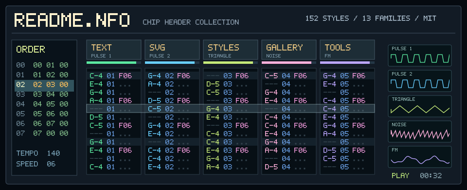
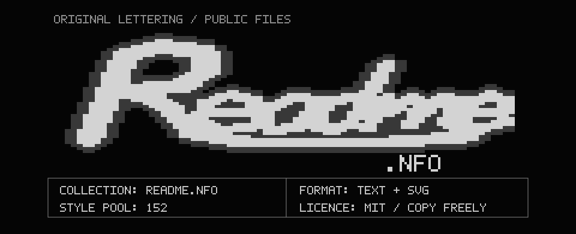
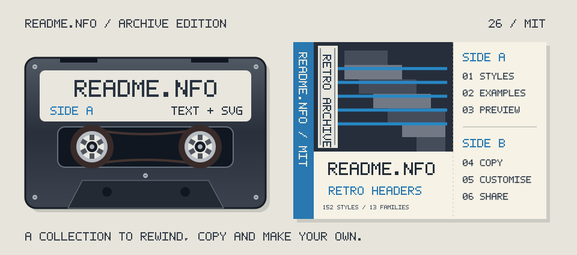
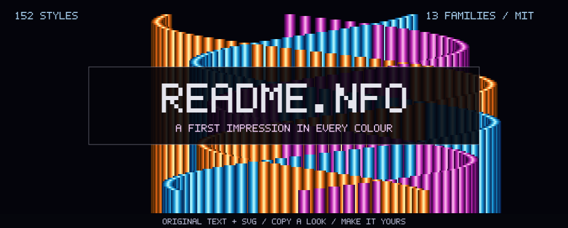

<p align="center">
  <a href="examples/readme-nfo/04-trk-07.md"></a>
</p>

# README.NFO

Retro README headers built from text art and animated SVG: cracktros, terminals, trackers, arcade screens, old desktops and physical media.

**219 headers · 152 distinct catalogue styles · seven project galleries.** Each example comes with its source generator and ready-to-copy Markdown. The style catalogue explains the look, how to build it, and the references behind it.

**[Start with twelve picks](examples/START-HERE.md)** · [Browse every example](examples/README.md) · [Explore the style catalogue](styles/INDEX.md)

## Five favourite looks

These five headers were chosen for README.NFO itself. **[04 — Multi-chip tracker](examples/readme-nfo/04-trk-07.md)** opens this page; the other four are below. Click a preview to open its copyable Markdown and source generator, or [browse all forty candidates](examples/readme-nfo/README.md).

<p align="center">
  <a href="examples/readme-nfo/16-nfo-01.md"></a>
  <a href="examples/readme-nfo/26-print-02.md"></a>
</p>

[16 — Brush-script NFO](examples/readme-nfo/16-nfo-01.md) · [26 — Cassette and J-card](examples/readme-nfo/26-print-02.md)

<p align="center">
  <a href="examples/readme-nfo/36-idle-10.md"></a>
  <a href="examples/readme-nfo/38-c64-07.md"></a>
</p>

[36 — Off-air test card](examples/readme-nfo/36-idle-10.md) · [38 — Copper ribbons](examples/readme-nfo/38-c64-07.md)

## Choose a header

The [shortlist](examples/START-HERE.md) pairs eight animated previews with four text-only options. Start there for a manageable range, then open a project's full gallery for variations.

| Gallery | Headers | What the examples are built around |
| --- | ---: | --- |
| [Dance Vision](examples/dance-vision/README.md) | 6 | Phone motion capture, stick-figure dancers and a shared TV dance floor |
| [ULTRA-SATISFACTORY](examples/ultra-satisfactory/README.md) | 42 | Factory recipes, machines and Space Elevator objectives |
| [Castaway](examples/castaway/README.md) | 116 | A lo-fi island, passing ships and a schedule of visual gags; split across six gallery pages |
| [NATURALIS-HISTORIA](examples/naturalis-historia/README.md) | 5 | Latin-English natural history, chapter plates and a bilingual library |
| [GL4SS](examples/gl4ss/README.md) | 5 | Places through time, year and hour controls, and an era comparison |
| [ST3GG](examples/st3gg/README.md) | 5 | Visible carriers and hidden layers in images, audio, text and documents |
| [README.NFO](examples/readme-nfo/README.md) | 40 | This repository: two random draws, with a favourite picker and four gallery pages |

[Compare the three Pliny repositories side by side](comparisons/pliny-first-draw/index.html): the same five randomly drawn references, with an independent composition for each project.

For a particular look, use the [style index](styles/INDEX.md). Its thirteen families include NFO/ASCII, ANSI/BBS, chiptune, vaporwave, demoscene and print. There are 156 entries; four explicitly marked duplicates leave 152 distinct styles, all represented in the examples.

## Copy one into your project

1. Open the individual `.md` linked from a gallery, then view its raw source. Copy the header and the parts of its introduction you want to adapt into your own README.
2. For an SVG header, copy **every image referenced by that Markdown** from the example's `assets/` folder into your repository. Some options include separate dividers, buttons or badges. Text-only headers need no image files.
3. Adjust each image path relative to your README. For example, if you put a banner in `docs/readme-assets/`, use:

   ```html
   <p align="center">
     
   </p>
   ```

4. Replace project names, descriptions, statistics, commands and links with your own. Example links to files and section anchors belong to the original project and may deliberately lead nowhere in this gallery.
5. Include the [MIT licence notice](LICENSE) with copied work. Preview your finished README at desktop and mobile widths.

Keep SVGs as image files referenced by `` or Markdown image syntax. GitHub README pages strip inline SVG, scripts and custom page CSS. The animation lives inside the image; links belong in the Markdown around it.

## Customise the artwork

The matching source lives in `examples/<set>/src/<same-filename>.mjs`. Read the comments at the top for the layout, palette, animation and rebuild instructions. Most generators use plain Node.js and contain their own fonts, geometry and project data.

Edit the generator and run it from this repository's root, for example:

```sh
node examples/ultra-satisfactory/src/17-amiga-tracker_opus_5.5.mjs
npm run gallery
```

Check the comment in the individual Markdown before editing it: some pages are generated, while others have handwritten prose alongside generated art. Gallery pages and the shortlist are generated and will be overwritten by their build commands. Project facts are dated snapshots; check them again when adapting a header. A few generators offer a live-data mode that needs the original project's files; follow that generator's instructions.

## Preview and validate

Use Node.js 22 or newer. Install the development dependency and Chromium once:

```sh
npm ci
npx playwright install chromium
```

The preview tool creates light and dark screenshots and reports text-width, character, image and GitHub-sanitizer issues. It approximates GitHub's rendering; check the final result on GitHub too.

```sh
npm run preview -- examples/castaway/01-mode7-island_opus_5.5.md .preview/demo
```

Append `--times=0,1500` to capture two moments in the animation, or `--mobile` to check a phone-width layout. Use a different output directory for each example you want to keep.

Run the complete repository check with:

```sh
npm run validate
```

It runs the validation tests, checks JavaScript syntax, catalogue coverage, gallery membership, documentation links and image paths, then parses and loads every SVG as a Chromium image. It also checks SVG image restrictions and reduced-motion rules, and rebuilds generated pages in a temporary directory to detect stale output. It leaves your working files untouched. The same command runs in GitHub Actions on pushes and pull requests.

| Command | Purpose |
| --- | --- |
| `npm run gallery` | Rebuild all seven project galleries and the curated shortlist |
| `npm run gallery:pliny` | Rebuild the fifteen Pliny headers, their galleries and the portable comparison |
| `npm run gallery:readme-nfo` | Rebuild the forty README.NFO candidates' index, four gallery pages and favourite picker |
| `npm run shortlist` | Rebuild the shortlist from `examples/shortlist.json` |
| `npm run styles` | Rebuild catalogue family pages and the index from `styles/styles.json` |
| `npm run preview -- <file.md-or.svg> <output-dir>` | Render a single example; screenshots belong in ignored `.preview/` |
| `npm run validate` | Run the tests and check the repository without rewriting its files |

## What is where

```text
examples/
  START-HERE.md       curated picks with animated previews
  shortlist.json     the selection and the reason for each pick
  <set>/
    <option>.md      individual headers
    assets/          SVG banners, dividers, buttons and badges
    src/             source generators and gallery builder
styles/
  styles.json        catalogue source data
  INDEX.md           every style, grouped by family
  <family>.md        descriptions, build notes and source links
tools/               preview, generation and validation commands
```

[examples/build-log.csv](examples/build-log.csv) records the original build sessions. Its importer, `tools/build-log.mjs`, needs those sessions' transcripts; they are not required to use or validate this repository.

## Reuse and credits

Original code, documentation and artwork in this repository are available under the [MIT licence](LICENSE). Keep existing third-party notices wherever they occur; dependencies retain their own licences. Links in the research catalogue credit their sources and do not license the linked material.

Real scene groups, artists, games and products are references. Adapt the technique to your own project and keep its identity original. The example sets describe their own fan-work context, and the catalogue records research limitations in [styles/README.md](styles/README.md).
