# Start with twelve headers

<!-- Generated by tools/build-shortlist.mjs. Edit examples/shortlist.json, then run npm run shortlist. -->

A curated starting point across three projects: eight animated previews and four text-only options. These picks favour different shapes, palettes and amounts of information, rather than ranking all the artwork.

[Project README and copying instructions](../README.md) · [All 164 headers](README.md) · [Style index](../styles/INDEX.md)

## Animated previews

Click a preview or its name to open the complete header. Animations are SVG image files; your reduced-motion setting may pause them. Open the full example before judging fine lettering at thumbnail size.

### [Mode 7 Island](castaway/01-mode7-island_opus_5.5.md)

A small scene with depth and character; a good fit for games and simulations. **castaway** · [mach-15](../styles/mach.md#mach-15)

### [Amiga Tracker](ultra-satisfactory/17-amiga-tracker_opus_5.5.md)

Turns real project data into a four-channel instrument panel. **ultra-satisfactory** · [trk-01](../styles/trk.md#trk-01)

### [Amiga Cracktro](dance-vision/02-amiga-cracktro_opus_5.5.md)

Chrome letters, copper bars and dancers for an energetic introduction. **dance-vision** · Original six

### [CRT Terminal](dance-vision/05-crt-terminal_opus_5.5.md)

A readable green-phosphor boot sequence for command-line and developer tools. **dance-vision** · Original six

### [Chrome Spheres](ultra-satisfactory/13-chrome-spheres_opus_5.5.md)

A large wordmark, checker floor and reflective spheres for classic demo spectacle. **ultra-satisfactory** · [pc-03](../styles/pc.md#pc-03)

### [Classic Vaporwave](ultra-satisfactory/26-vaporwave_opus_5.5.md)

Pink, mint, perspective grids and desktop windows for a softer palette. **ultra-satisfactory** · [vap-01](../styles/vap.md#vap-01)

### [Pinball Display](castaway/09-pinball-dmd_opus_5.5.md)

Orange dots, scores and an attract loop for a playful arcade treatment. **castaway** · [mach-11](../styles/mach.md#mach-11)

### [Teletext Page](castaway/52-teletext-page_opus_5.5.md)

A colourful broadcast page where the project's sections become channel listings. **castaway** · [ansi-08](../styles/ansi.md#ansi-08)

## Text-only options

These need no image assets. Open an example to see the lettering at its intended width, and preserve its whitespace when copying. Wide text art will scroll on a phone.

### [7-bit Outline NFO](castaway/07-7bit-outline-nfo_opus_5.5.md)

A 78-column slash-and-underscore logo with a compact ASCII island. **castaway** · [nfo-04](../styles/nfo.md#nfo-04)

### [Scene Release NFO](dance-vision/01-nfo-release_opus_5.5.md)

Shaded block letters, release information and install notes in an 80-column layout. **dance-vision** · Original six

### [Site Race](ultra-satisfactory/29-site-race_opus_5.5.md)

An ASCII transfer session that makes progress bars and statistics part of the identity. **ultra-satisfactory** · [xfer-01](../styles/xfer.md#xfer-01)

### [RFC / Man Page](castaway/06-rfc-manpage_opus_5.5.md)

A 72-column technical memo and manual page for a quieter, dryly funny introduction. **castaway** · [hack-03](../styles/hack.md#hack-03)

## Keep browsing

- [Dance Vision: six originals](dance-vision/README.md)
- [ULTRA-SATISFACTORY: forty-two factory treatments](ultra-satisfactory/README.md)
- [Castaway: 116 island treatments, on six pages](castaway/README.md)
- [The catalogue: thirteen style families](../styles/INDEX.md)
