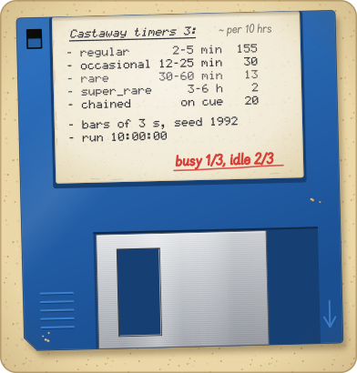
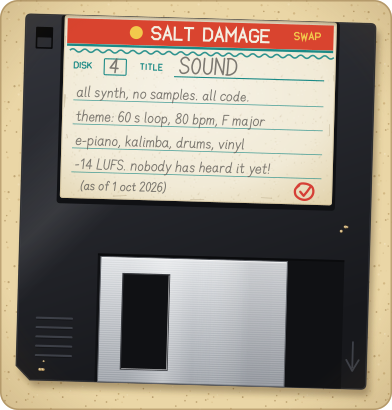
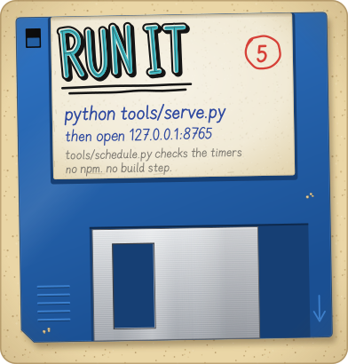

<!-- Header 115-swapper-floppy_opus_5.5 for Castaway: "Swapper's Floppy" (catalogue entry print-01). The banner is generated by src/115-swapper-floppy_opus_5.5.mjs; this page is hand-written. -->

<p align="center">
  
</p>

<h1 align="center">Castaway</h1>

<p align="center">
  <b>Disk 1 of 5: ten hours of one island, swapped by bottle. Please swap back.</b>
</p>

<p align="center">
  A stationary-frame lo-fi video for YouTube, in the spirit of the ten-hour lofi streams: a young woman alone on a tiny island with one tall palm, a raft and a lot of time. She idles, nodding to the music on her headphones, and every so often something happens. Mostly, she waits. So does the sea.<br>
  <sub>An unofficial remake, inspired by the small-island routines and visual comedy of <i>Johnny Castaway</i>, the 1992 screensaver. Sunny, hand-painted coastal anime. 16:9, 1080p, 24 fps, and always daytime.</sub>
</p>

<p align="center">
  More than 90 activities, most of them on four timers, and each one starts on the next bar of the music, so every gag lands on the beat: a hermit crab who walks off wearing the coconut that fell on it, a drone delivering another pair of headphones, a shark in headphones nodding along. Every sound is synthesized from code in <a href="tools/make_audio.py"><code>tools/make_audio.py</code></a>. No samples, no loops, no recordings.
</p>

```sh
python tools/serve.py
# then open http://127.0.0.1:8765/
```

<p align="center">
  <sub>Live preview in the browser, then export a YouTube-ready MP4. Plain ES modules, no build step, no npm.<br>
  In development: no video is out yet, so for now there is only this disk. Keep away from magnets, heat and the sea. (It came out of the sea.)</sub>
</p>

<details>
<summary><b>Disk 2 of 5: gags</b> (the printed label, decoded)</summary>
<br>

The label, as printed. Every name is a real activity id from [activities.toml](activities.toml); it was a short printout, so there are plenty more.

```text
 Castaway gags 2:
 ----------------
 - coconut_sip              - shark_nod
 - fishing_quiet            - delivery_drone
 - jog_lap                  - efoil_bro
 - sandcastle               - fire_by_friction
 - coconut_crab  <-- (!)    - hammock
 - turtle_visit             - lookout
 - cat_visit                - spear_fishing
 - bottle_reply             - kumara_leafs
 - signal_hunt              - leave_any_time
                                                  + lots more
```

- `coconut_sip`: she wanders into the shade and sips a coconut, eyes closed, completely content.
- `fishing_quiet`: nibbles, nothing. The usual.
- `jog_lap`: the length of the island and back. It is not a long island.
- `sandcastle`: it stays on the beach until the tide comes for it. The tide always comes for it.
- `coconut_crab`: a coconut drops squarely onto a passing hermit crab. Then the coconut walks off, with the crab wearing it. (Also on the banner, under disk 2.)
- `turtle_visit`: a sea turtle crawls up beside her and they both doze off.
- `cat_visit`: a grey tabby with a white chest drifts in on a crate, climbs the palm, naps, and one day floats away again. It comes back another time.
- `bottle_reply`: her message in a bottle washes straight back to her feet. Hours later, a different bottle brings a reply. (This disk came the other way.)
- `signal_hunt`: one bar of signal, at the top of the palm.
- `shark_nod`: a shark surfaces in headphones, nodding to the same beat. They nod. It leaves.
- `delivery_drone`: a parcel, lowered with care. Inside: another pair of headphones.
- `efoil_bro`: a bro on an electric hydrofoil carves in close, waves with a shaka, and carves off.
- `fire_by_friction`: a bow drill, shaking arms, one thin curl of smoke, and then a flame.
- `hammock`: a beautiful hammock, tied to the palm, then a long look round for a second tree. There isn't one. The other end goes on the raft.
- `lookout`: a platform in the palm's crown. As she climbs, the palm bends slowly under her until the platform is at ground level.
- `spear_fishing`: she stalks the shallows like a heron. The fish take turns jumping over the spear.
- `kumara_leafs`: hours after she planted it, the kumara has quietly grown leafy. Nobody remarks on it.
- `leave_any_time`: she could leave any time. She walks away over the water, the island sits empty for a bit, and she comes back with an iced coffee.

</details>

<details>
<summary><b>Disk 3 of 5: timers</b> (every 2 minutes to 6 hours)</summary>
<br>

<p align="center">
  
</p>

Four timers in [activities.toml](activities.toml). When one goes off, it picks an activity from its tier that is free to happen right now, and the start waits for the next bar of the music (every 3 seconds).

| Tier | Comes round every | In a typical 10-hour run |
| --- | --- | --- |
| regular | 2 to 5 minutes | about 155 |
| occasional | 12 to 25 minutes | about 30 |
| rare | 30 to 60 minutes | about 13 |
| super rare | 3 to 6 hours, at most 3 a run | about 2 |
| chained | only when another activity starts it | about 20 |

The counts are the median of 200 simulated runs, as the file's own header says. She is busy about a third of the time and idling the rest, which is the point. Lanes let things overlap, so the sea can be busy while she is. The default run is 10:00:00 on seed 1992. [`tools/schedule.py`](tools/schedule.py) validates the file and simulates a run.

Around her, 26 entries of scene life: four always-on effects and 22 timed events. The shore waves and the drifting cloud shadows are built; distant birds, planes with vapour trails, whale pods, dolphins, sailboats, sandpipers, a gecko and a rain shower are planned.

</details>

<details>
<summary><b>Disk 4 of 5: sound</b> (all synth, no samples)</summary>
<br>

<p align="center">
  
</p>

- Every sound is synthesized from code by [`tools/make_audio.py`](tools/make_audio.py): no samples, no loops, no recordings, so no third-party licence applies. More than 150 sound files so far.
- The theme is a seamless 60-second loop at 80 BPM in F major (ii-V-I-vi): 20 bars of exactly 3 seconds, with electric piano, a kalimba lead, soft drums and vinyl surface noise. That 3-second bar is the clock every gag waits for.
- The ocean ambience is a seamless 60-second loop too.
- The mix sits at -14 LUFS with true peak at or below -1 dBTP. Levels can be set for the master and for each routine.
- As of 1 October 2026, nobody has listened to any of it. The label says "all synth, no samples". It does not say "good". That is for the first pair of ears to decide.

</details>

<details>
<summary><b>Disk 5 of 5: run it</b> (python tools/serve.py)</summary>
<br>

<p align="center">
  
</p>

```sh
python tools/serve.py               # then open http://127.0.0.1:8765/
python tools/schedule.py            # check the schedule, simulate a 10-hour run
python tools/render_demo.py --dev   # a dev reel of every activity, with a HUD
```

- The renderer is a web page ([`web/index.html`](web/index.html), served by [`tools/serve.py`](tools/serve.py)) with a live preview and export to a YouTube-ready MP4.
- Export is frame-exact and happens in the browser (WebCodecs H.264: 68 to 78 frames a second in Chrome, measured at 1080p30); the server mixes the sound and joins the two into an MP4.
- Plain ES modules: no build step, no npm packages.
- [`tools/render_demo.py`](tools/render_demo.py) is the older Python reference renderer.
- Hard cuts and stepped movement are the motion defaults. (The crab on the banner walks in steps, out of respect.)
- What is going on, and what was decided: [`MUSING.md`](MUSING.md).

</details>

<details>
<summary><b>The letter in the bottle</b> (and the small print)</summary>
<br>

> hi! here's CASTAWAY,<br>
> disks 1 to 5.<br>
> ten hours, one island.<br>
> she mostly waits.<br>
> now and then,<br>
> a gag, on the beat.<br>
> every sound is code.<br>
> &nbsp;&nbsp;swap back pls!<br>
> &nbsp;&nbsp;&nbsp;&nbsp;ferric / salt damage

**Care of your disk**

- Keep away from magnets, heat and the sea. This one is in the sun, on a beach, next to the sea. One out of three.
- The write-protect window is open, so nothing on this disk can change. The island is not write-protected: a sandcastle stays until the tide takes it, a parcel until a wave washes it off, and the kumara just keeps growing.
- Do not open the shutter. (The banner opens it every nine seconds. It cannot help itself.)
- If no reply comes, the bottle will. It always comes back.

**Credits**

- Swapped by **ferric** of **Salt Damage**, the island's only swap club, which operates by bottle and has never once received a disk back. Both are invented.
- Style: the swapper's floppy, a hand-labelled 3.5-inch disk sent through the post as "disk 1 of N" (catalogue entry print-01), after the disk scans collected on the Got Papers? site. Every letter, label, sticker and doodle here was drawn from scratch; nothing was copied, and no real group, handle or maker appears.
- Castaway is an unofficial remake inspired by *Johnny Castaway* (1992) and is not affiliated with it or its owners.

</details>
