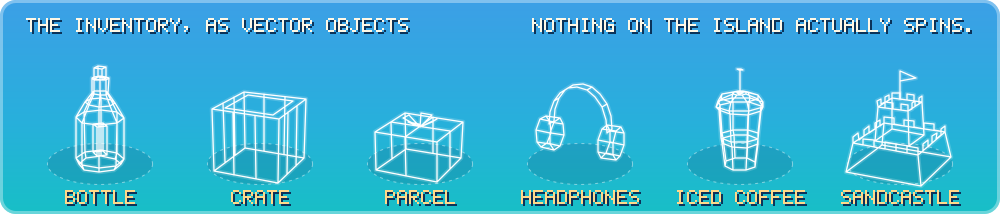

<!-- Header 26-vector-objects_opus_5.5 for Castaway, in the demoscene "vector objects" style (glenz, dot scroller, vector balls, wireframe). Both images are generated by src/26-vector-objects_opus_5.5.mjs; this page is hand-written. -->

<p align="center">
  
</p>

<h3 align="center">CASTAWAY <sub><i>(working title)</i></sub></h3>

<p align="center">
  <b>A ten-hour lo-fi island video in which almost nothing happens, on purpose.</b><br>
  She idles. Every so often, something happens. The camera never moves, so all the spinning went up there.
</p>

A stationary-frame lo-fi video for YouTube, in the spirit of the ten-hour lofi streams: a young woman alone on a tiny island with one tall palm, a raft and a lot of time. She mostly idles, nodding to the music on her headphones, and every so often something happens. A message in a bottle washes straight back. A delivery drone drops a parcel, and the parcel is another pair of headphones. A shark in headphones nods along to the beat. It is an unofficial remake inspired by the small-island routines and visual comedy of *Johnny Castaway*, the 1992 desert-island screensaver, repainted as a sunny, hand-painted coastal anime scene: 16:9, 1080p, 30 fps, and always daytime.

The gags live in [activities.toml](activities.toml): more than 90 of them, on four timers. Something regular every 2 to 5 minutes, occasional every 12 to 25, rare every 30 to 60, super rare every 3 to 6 hours. A typical ten-hour run comes to about 155 regular, 30 occasional, 13 rare and 2 super-rare events, plus chained follow-ups, and she is busy about a third of the time. Every activity waits for the next bar of the music, so the gags land on the beat. Every sound is synthesized from code by [tools/make_audio.py](tools/make_audio.py): no samples, loops or recordings, so no third-party licence applies. It is loudness-checked, peak-limited, and so far unheard by anyone.

```sh
python tools/serve.py
# then open http://127.0.0.1:8765/
```

Live preview in the page, then export a YouTube-ready MP4: the browser encodes frame-exact H.264 (WebCodecs) and the server mixes in the sound. Plain ES modules, no build step, no npm. In development: nothing is published yet, so to watch her do nothing for ten hours you will have to run it yourself.

<details>
<summary><b>FIG. 2</b>: the inventory, in wireframe</summary>
<br>
<p align="center">
  
</p>

- **Bottle.** Thrown out to sea, it washes straight back. A different bottle, much later, brings a reply.
- **Crate.** A stray cat (grey tabby, white chest) arrives on one, climbs the palm and naps. One day it floats away again. Another day it comes back.
- **Parcel.** Delivered by drone. Contents: headphones.
- **Headphones.** The spare pair. See parcel.
- **Iced coffee.** She could leave any time. Once in a long while she walks out over the water and comes back with one.
- **Sandcastle.** She builds it. The tide takes it: the tide is a chained follow-up, so it comes back for the castle 5 to 30 minutes later.

In the video none of these turn round, ever: hard cuts and stepped movement are the project's motion defaults. The turntables are a README privilege.

</details>

<details>
<summary><b>OBJECT FILE 01</b>: how the banner works</summary>

```text
 TIDEPOOL POLYGON SOCIETY · OBJECT FILE 01 · "A COCONUT, ROUGHLY"
 ────────────────────────────────────────────────────────────────────────
  shape ......... a cube with a low pyramid on every face
  faces ......... 24 triangles, two-tone like a chessboard
  vertices ...... 14
  glass ......... white at 46 percent, coral pink at 74 percent
  motion ........ two turns about y and one about x every 30 s, plus a
                  slow sway about z
  frames ........ 48 per 30 s; the browser fills in the rest
  depth sort .... none: every face is see-through, so nobody can tell
  nods .......... once a beat, 4 px down, 80 times a minute
  resemblance ... to a coconut: some
 ────────────────────────────────────────────────────────────────────────
```

**The glenz.** The generator rotates the object on three axes, projects it with perspective and writes every face as one SVG polygon whose corners and colour are lists of 48 keyframes, one 30-second cycle's worth. Faces are lit by their angle to a light in the top left, so they change tint as they turn, and they are drawn see-through, so the back of the object shows through the front and overlaps come out brighter. That is the glenz look, and the reason it never needed a depth sort.

**The dot scroller.** Forty character slots sit on a ring round the object's middle, tilted towards you. They all share one animation (a full turn: position on the ellipse, squash, slope and brightness) and differ only in where they start. The ring is drawn twice, the far half behind the glass and the near half in front. Each slot holds four letters and swaps to the next one while it is directly behind the object, so 160 characters of text go round on 40 slots, every 15 seconds a turn.

**The vector balls.** CASTAWAY is 120 shaded balls in a 5 by 7 grid per letter, floating on a slow wave. Once a minute, on bar 4, the letters flip right round one after another, half a beat apart. Every ball knows its distance from its letter's axis and feeds it to one shared animation, which swings it round and scales it for depth. Every so often something happens: the banner does it too.

**The rest.** A text writer types five pages with hard cuts between them. A ripple leaves the object on every bar and spreads for four. Every period divides 60 seconds, the length of the theme (20 bars of 3 seconds at 80 BPM), so the whole banner loops when the music would. No script, no fonts, no filters, no GIF: shapes, CSS and SMIL. With reduced motion switched on it holds still on a complete first frame.

</details>

<details>
<summary><b>THE SCENE LIST</b>: what turns up, when, and the greetz</summary>

```text
 OBJ  WHAT                    WHEN                    NOTES
 ───  ──────────────────────  ──────────────────────  ───────────────────────
 001  the island              always                  never rotates
 002  her                     always                  idles, nods on the beat
 003  regular routines        every 2 to 5 min        coconut, fishing, laps
 004  occasional gags         every 12 to 25 min      small gags and visits
 005  rare set pieces         every 30 to 60 min      the bigger ones
 006  super-rare callbacks    every 3 to 6 hours      3 a run, at most
 007  chained follow-ups      after something else    the tide, after a castle
 008  shore waves             always                  built
 009  cloud shadows           drifting                built
 010  birds, planes, whales,  not yet                 planned, with sailboats,
      dolphins                                        sandpipers, a gecko and
                                                      a (daytime) rain shower

 A TYPICAL TEN-HOUR RUN (median of 200 simulated runs)
   ~155 regular · ~30 occasional · ~13 rare · ~2 super rare, plus follow-ups
   busy about a third of the time · idle the rest · 10:00:00, seed 1992

 SOME OF WHAT HAPPENS, EVENTUALLY
   · A bottle washes straight back. Later, a different one brings a reply.
   · A drone drops a parcel. It is another pair of headphones.
   · A sea turtle visits. A shark in headphones nods to the beat.
   · A stray cat arrives on a crate, naps up the palm, floats away one day
     and comes back another.
   · The signal hunt: one bar of signal, at the very top of the palm.
   · A coconut falls on a hermit crab. The coconut walks off, crab inside.
   · A tour boat of selfie-takers. A hydrofoil bro gives a shaka, carves off.
   · Bushcraft: fire by friction, a hammock, a lookout up the palm, spear
     fishing. A kumara she plants grows over the course of the video.
   · And a ship sails past exactly while she is busy. Of course it does.

 TOOLS
   python tools/serve.py ............ the renderer: live preview, then MP4
   python tools/schedule.py ......... validate it, simulate ten hours
   python tools/make_audio.py ....... synthesize every sound from code
   python tools/render_demo.py --dev  dev reel of every activity, with HUD

 THE THEME
   a seamless 60 s loop · 80 BPM · F major · ii-V-I-vi · 20 bars of 3 s
   electric piano · kalimba lead · soft drums · vinyl surface noise
   more than 150 synthesized sounds in all, mixed to -14 LUFS with true
   peak at or below -1 dBTP; levels set in master and per routine

 GREETZ
   the Back-Face Culling Society (not needed this time, thanks)
   the Committee for Slightly Translucent Fruit
   the Sandbar Rendering Guild · the Turntable Appreciation League
   the Department of the Next Bar
   and every polygon that faced away and did its best anyway

 NO GREETZ
   The camera. It has not moved in ten hours and it is not about to start.
```

Castaway is an unofficial project inspired by *Johnny Castaway* (1992), which belongs to its owners; nothing from it is used here. The Tidepool Polygon Society and everyone in the greetz are made up. Glenz, dot scrollers, vector balls and wireframes are demoscene staples, credited here as a genre; the object, the fonts, the props and the copy were built from scratch by the generator.

More: [MUSING.md](MUSING.md) (the project log), [web/index.html](web/index.html) (the renderer page), [tools/schedule.py](tools/schedule.py), [tools/render_demo.py](tools/render_demo.py).

</details>
