<!-- Header 27-texture-movers_opus_5.5 for Castaway. Both banners are generated by src/27-texture-movers_opus_5.5.mjs; this page is hand-written. -->

<p align="center">
  
</p>

<h1 align="center">CASTAWAY</h1>

<p align="center">
  <b>There is a light at the end of the tunnel. It is a very small island, and it is always ten hours away.</b>
</p>

<p align="center">
  A stationary-frame lo-fi video for YouTube: a young woman alone on a tiny island with one tall palm, a raft and a lot of time. She mostly idles, nodding to the music on her headphones. Every so often, something happens: a message in a bottle washes straight back, a drone delivers a parcel that turns out to be more headphones, a coconut lands on a hermit crab and walks off with the crab inside it.<br>
  <sub>An unofficial remake, inspired by the small-island routines and visual comedy of <i>Johnny Castaway</i>, the 1992 screensaver. Sunny, hand-painted coastal anime. 16:9, 1080p, 30 fps, and always daytime.</sub>
</p>

<p align="center">
  <b>The schedule:</b> more than 90 activities, most of them on four timers that go off anywhere from every 2 to 5 minutes to every 3 to 6 hours, and each one waits for the next bar of the music, so the gags land on the beat.<br>
  <b>The sound:</b> every note, wave and gull is synthesized from code in <a href="tools/make_audio.py"><code>tools/make_audio.py</code></a>. No samples, no loop packs, no recordings.
</p>

<p align="center">
  
</p>

```sh
python tools/serve.py
# then open http://127.0.0.1:8765/
```

<p align="center">
  <sub>Live preview in the browser, then export a frame-exact, YouTube-ready MP4. Plain ES modules, no build step, no npm.<br>
  The tunnel above sends a gag every bar. The video does not. That is rather the point.</sub>
</p>

<details>
<summary><b>TUNNEL NOTES</b>: one ring per beat, and why the island never gets any closer</summary>

```text
 LOOKUP LAGOON · TUNNEL NOTES                           ONE RING PER BEAT
 ──────────────────────────────────────────────────────────────────────
 RINGS ............. 16 in flight, each a band of 32 checkered cells
 SPAWN ............. one new ring per beat: 80 BPM, 0.75 s, the tempo
                     of the theme
 SPEED ............. the walls double in size every bar (3 s)
 TWIST ............. each ring sits half a cell round from the last
 ROLL .............. 10 degrees a second. the far end circles once
                     every 36 s, which counts as excitement round here
 THE FAR END ....... a tiny island in daylight, kept the right way up.
                     she nods on every beat. it never gets any closer
 SIGNS ............. one gag flies out of the island every bar and
                     swerves past you on the way out:
                     coconut, bottle (again), sea turtle, more
                     headphones, cat on a crate, one bar of signal,
                     shark (nodding), sandcastle, the tide, a hydrofoil
                     shaka, iced coffee, kumara
 THE COCONUT ....... the one on top of the logo has a hermit crab in
                     it. it walks C-A-S-T-A and back in eighth notes
 ETA ............... 10:00:00. it does not count down. it never will
 LOOP .............. 36 s (12 bars), then exactly the same again
 REDUCED MOTION .... everything holds still on the first frame. so
                     does she, mostly
```

The banner is the trailer. In the video, the busiest timer goes off every 2 to 5 minutes, and she spends about two thirds of the run doing nothing in particular, beautifully. The signs above are roughly half an hour of her day, delivered in 36 seconds.

The other effect, the spinning sand tiles round the run command, is a rotozoomer: one small tile repeated to infinity, turned and zoomed about the middle. Both effects move the texture and leave the subject alone, which is also how Castaway treats its castaway.

</details>

<details>
<summary><b>THE SCHEDULE</b>: four timers, ten hours, a lot of very calm waiting</summary>

```text
 CASTAWAY · 10:00:00 · SEED 1992 · ALWAYS DAYTIME
 ──────────────────────────────────────────────────────────────────────
 TIER           COMES ROUND EVERY       IN A TYPICAL RUN
 regular        2 to 5 minutes          about 155
 occasional     12 to 25 minutes        about 30
 rare           30 to 60 minutes        about 13
 super rare     3 to 6 hours            about 2 (never more than 3)
 chained        when another one        about 20 follow-ups, such as
                says so                 the tide after a sandcastle
 ──────────────────────────────────────────────────────────────────────
 typical run = the median of 200 simulated runs, as the schedule's own
 header puts it. busy about a third of the time, idling the rest.
 every start waits for the next bar of the music (one bar = 3 s)

 ON THE SCHEDULE, AMONG OTHER THINGS
   · a message in a bottle that washes straight back. a different
     bottle, later, brings a reply
   · a delivery drone. the parcel: another pair of headphones
   · a sea turtle who visits
   · a grey tabby with a white chest who arrives on a crate, climbs
     the palm, naps, and one day floats away again. it comes back
     another time
   · the signal hunt: one bar of signal, at the top of the palm
   · a shark in headphones, nodding to the beat
   · a tour boat of selfie-takers
   · a coconut falls on a hermit crab. the coconut walks off
   · she could leave any time: she walks out over the water and comes
     back with an iced coffee
   · a bro on an electric hydrofoil: a shaka, a carve, gone
   · bushcraft: fire by friction, a hammock, a lookout up the palm,
     spear fishing
   · a kumara, planted, growing over the course of the video
   · coconut sipping, fishing, jogging laps, waving for rescue, and a
     sandcastle that the tide takes
```

[activities.toml](activities.toml) held 94 activities on 2026-10-01 (81 on the four timers, 13 chained follow-ups), and more arrive every few hours. Lanes let things overlap: she has one, and the cat, the turtle, the sea and sky, and the shore each have their own, so a ship can sail past while she is busy with a coconut. The ship has a lane and a sense of timing. She has headphones.

The scene has a life of its own too: 26 entries, 4 always-on effects and 22 timed events. Shore waves and drifting cloud shadows are built; distant birds, planes with vapour trails, whale pods, dolphins, sailboats, sandpipers, a gecko and a rain shower are planned. Run `python tools/schedule.py` to check the schedule and simulate a ten-hour run.

</details>

<details>
<summary><b>THE SOUND AND THE TOOLS</b>: synthesized, rendered and checked from code</summary>

```text
 PICTURE
   python tools/serve.py ......... the renderer: a web page with a live
                                   preview at http://127.0.0.1:8765/
   EXPORT ........................ frame-exact H.264 in the browser
                                   (WebCodecs: 68 to 78 frames a second
                                   at 1080p30 in Chrome). the server
                                   mixes the sound and joins the two
                                   into an MP4
   python tools/schedule.py ...... validates the schedule, simulates a
                                   ten-hour run
   python tools/render_demo.py --dev
                                   a dev reel of every activity with a
                                   heads-up display (the older Python
                                   reference renderer)
   MOTION ........................ hard cuts and stepped movement. the
                                   coconut on the logo walks the same way
 SOUND
   python tools/make_audio.py .... synthesizes all of it: more than 150
                                   files, no samples, loop packs or
                                   recordings
   THEME ......................... a seamless 60 s loop: 80 BPM, F major,
                                   ii-V-I-vi, 20 bars of exactly 3 s.
                                   electric piano, kalimba lead, soft
                                   drums, vinyl crackle
   OCEAN ......................... also a seamless 60 s loop
   LEVELS ........................ -14 LUFS, true peak at or below
                                   -1 dBTP. master and per-routine volume
   HEARD BY ...................... nobody yet. it is waiting calmly for
                                   an audience, like her
 STATUS
   in development. no video has been published yet, so there is no link
```

Working notes: [MUSING.md](MUSING.md) · the schedule: [activities.toml](activities.toml) · the renderer: [tools/serve.py](tools/serve.py) and [web/index.html](web/index.html) · the checks: [tools/schedule.py](tools/schedule.py) · the dev reel: [tools/render_demo.py](tools/render_demo.py)

</details>

<details>
<summary><b>CREDITS AND GREETZ</b></summary>

```text
 THE ISLAND, HER, THE GAGS ......... Castaway
 THE TUNNEL AND THE TILE ........... Lookup Lagoon, who do not exist, and
                                     who have been flying toward the same
                                     island since the first frame
 THE INSPIRATION ................... Johnny Castaway (1992), which belongs
                                     to its owners. this is an unofficial
                                     remake, in spirit only

 GREETZ
   the Breathing Tile Society (in, out, in, out, every four bars)
   the Not There Yet Hiking Club (ten degrees a second round the
     bend, and not one step closer)
   and the hermit crab in the coconut, who has walked the length of
     C-A-S-T-A more times than anybody asked
```

</details>

<p align="center"><sub>Lookup Lagoon, the Breathing Tile Society and the Not There Yet Hiking Club are invented. The ETA is accurate.</sub></p>
