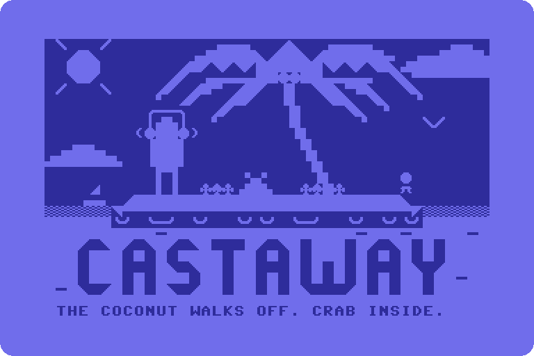

<!-- Header 30-petscii-picture_opus_5.5 for Castaway. Both pictures are generated by src/30-petscii-picture_opus_5.5.mjs; this page is hand-written. -->

<p align="center">
  
</p>

<h1 align="center">CASTAWAY</h1>

<p align="center">
  <b>A ten-hour lo-fi island video in which almost nothing happens, on purpose.</b><br>
  One young woman in cream headphones, one tall palm, one raft and a great deal of very calm waiting.
  She idles. Every so often, something happens. Today it happened to a crab.<br>
  <sub>Working title, in development. 16:9, 1080p, 30 fps, always daytime. An unofficial remake inspired by the small-island routines and visual comedy of the 1992 screensaver <i>Johnny Castaway</i>.</sub>
</p>

<p align="center">
  <kbd>F1</kbd> <a href="tools/serve.py">run it</a> &nbsp;
  <kbd>F3</kbd> <a href="activities.toml">the schedule</a> &nbsp;
  <kbd>F5</kbd> <a href="tools/make_audio.py">the synth</a> &nbsp;
  <kbd>F7</kbd> <a href="MUSING.md">the project log</a>
</p>

From the project root. No build step and no npm packages, just plain ES modules and a small Python server:

```sh
python tools/serve.py        # then open http://127.0.0.1:8765/
python tools/schedule.py     # check the schedule, simulate a 10-hour run
```

The page plays a live preview and exports a YouTube-ready MP4: the browser encodes every frame exactly with WebCodecs (H.264, 68 to 78 frames a second at 1080p30 in Chrome), and the server mixes the sound and joins the two with ffmpeg.

<details>
<summary><b>What happens, and how often</b>: four timers, and every gag lands on the bar</summary>
<br>

Everything she can do lives in [activities.toml](activities.toml): more than 90 activities as of October 2026, each with its own step-by-step beats, how long it lasts and how often it comes round. Most sit on four timers; a dozen or so only ever follow on from something else. Typical counts are the median of 200 simulated 10-hour runs, as the file's own header gives them:

```text
TIMER        COMES ROUND EVERY     IN 10 HOURS
-----------  --------------------  -----------
REGULAR      2 TO 5 MINUTES               ~155
OCCASIONAL   12 TO 25 MINUTES              ~30
RARE         30 TO 60 MINUTES              ~13
SUPER RARE   3 TO 6 HOURS (MAX 3)           ~2
CHAINED      AFTER SOMETHING ELSE          ~20
```

She is busy about a third of the time and idling the rest. Every activity starts on the next bar of the music, every 3 seconds, so the gags land on the beat. Lanes let things overlap, so the world can carry on while she is busy. The default run is `10:00:00` with seed `1992`, and the same seed always gives the same schedule.

Things that may happen while you are looking the other way:

- A coconut falls on a hermit crab. Then the coconut walks off, with the crab wearing it.
- A message in a bottle washes straight back to her feet. Much later, a different bottle brings a reply.
- A delivery drone arrives. The parcel is another pair of headphones.
- A sea turtle visits.
- A stray grey tabby with a white chest arrives on a crate, climbs the palm and naps. One day it floats away again. It comes back another time.
- The signal hunt: one bar, at the top of the palm.
- A shark in headphones surfaces and nods along to the beat.
- A tour boat full of selfie-takers.
- She could leave any time: she walks out over the water and comes back with an iced coffee.
- A bro on an electric hydrofoil waves a shaka and carves off.
- Bushcraft: fire by friction, a hammock, a lookout up the palm, spear fishing.
- A kumara, planted, that grows over the course of the video.
- And the regulars: coconut sipping, fishing, jogging laps, waving for rescue, and a sandcastle that stands until the tide takes it.

The scene keeps itself busy too: 26 bits of scene life, 4 always on and 22 timed. Shore waves and drifting cloud shadows are built; distant birds, planes with vapour trails, whale pods, dolphins, sailboats, sandpipers, a gecko and a rain shower are planned.

</details>

<details>
<summary><b>The sound</b>: every note is made from code</summary>
<br>

Every sound is synthesized by [tools/make_audio.py](tools/make_audio.py): more than 150 files, none of them sampled, recorded or lifted from a loop pack, so no third-party licence applies. The theme is a seamless 60-second loop at 80 BPM in F major (ii, V, I, vi), 20 bars of exactly 3 seconds, with electric piano, a kalimba lead, soft drums and vinyl crackle. The ocean ambience is a seamless 60-second loop too. The mix sits at -14 LUFS with true peak at or below -1 dBTP, and the levels can be set for the master and for each routine.

Nobody has listened to any of it yet. The waveforms look extremely relaxed.

</details>

<details>
<summary><b>How the picture is drawn</b>: 1000 cells and one background colour</summary>
<br>

It is a PETSCII picture: a Commodore 64 text screen, 40 cells across and 25 down, and every cell holds one 8 by 8 character from the machine's own set of blocks, wedges, lines, arcs and capitals, or its reverse. The rules are the machine's: one background colour for the whole picture, and one colour per cell on top of it. The generator keeps them; a cell cannot hold two foreground colours even by accident.

```basic
10 POKE 53280,14 : REM BORDER: LIGHT BLUE
20 POKE 53281,3  : REM BACKGROUND: CYAN. THE SKY. THERE IS ONLY ONE.
30 REM COLOUR 0 IS BLACK. IT IS IN NONE OF THE 1000 CELLS.
40 REM IT IS ALWAYS DAYTIME.
```

The background is cyan, so the sky comes free and everything else is built a cell at a time. That is why the palm's fronds bend in 45-degree steps and the island ends in wedges. Where the sand meets the sea a cell would need yellow and blue at once, which it cannot have, so it shows yellow and cyan instead, and the cyan becomes shallow water. That is a colour clash. Here it is the scenery.

The title is typed in reverse video in blue, so its letters are the background showing through: CASTAWAY is written in the sky, under the sea.

It moves the only way PETSCII moves, by changing characters, and only on the music's grid: 80 BPM, a beat every 0.75 seconds, a bar every 3. The loop is 20 bars, 60 seconds, the length of the theme. Brackets of sound pulse beside her headphones on every beat, the foam swaps every half bar, the sun swaps its rays every bar, the caption changes every two, a glint crosses the title every four, and the coconut lands exactly on a bar line, 18 seconds in. From 40.5 seconds a sea turtle swims into the shallows a cell per beat, naps, and swims off again before the loop comes round. 181 of the 1000 cells ever change; on a typical quarter beat, 4 do. Under reduced motion it holds the frame where the coconut walks off.

Here is that frame with the colour switched off, in the C64's own start-up colours. Every cell is just a character:

<p align="center">
  
</p>

The 8 by 8 shapes are redrawn as plain bitmaps, not copied out of a ROM. Every cell of both pictures is placed by hand, in a small script that draws them.

</details>

<details>
<summary><b>Credits</b></summary>
<br>

```text
PICTURE ..................... HERMIT KERNING
SHOWN AT .................... TIDEMARK, AN ISLAND PARTY FOR ONE
PLACED ...................... 1ST OF 1, PETSCII COMPO
JUDGE ....................... THE CRAB (BUSY)
GRID ........................ 40 X 25
BACKGROUND COLOURS .......... 1
COLOURS IN THE PICTURE ...... 11 OF 16
BLACK ....................... 0 CELLS
CELLS THAT EVER CHANGE ...... 181
TURTLES ..................... 1 (ASLEEP)
COCONUTS LOST ............... 1, TO A CRAB
```

Thanks to the tide, which did all the foam, to the crab, who did not ask to be in this, and to the turtle, who slept through the credits.

</details>

<p align="center">
  <sub>Every handle and party above is made up. Castaway is unofficial and not affiliated with the makers or owners of <i>Johnny Castaway</i>.</sub>
</p>
