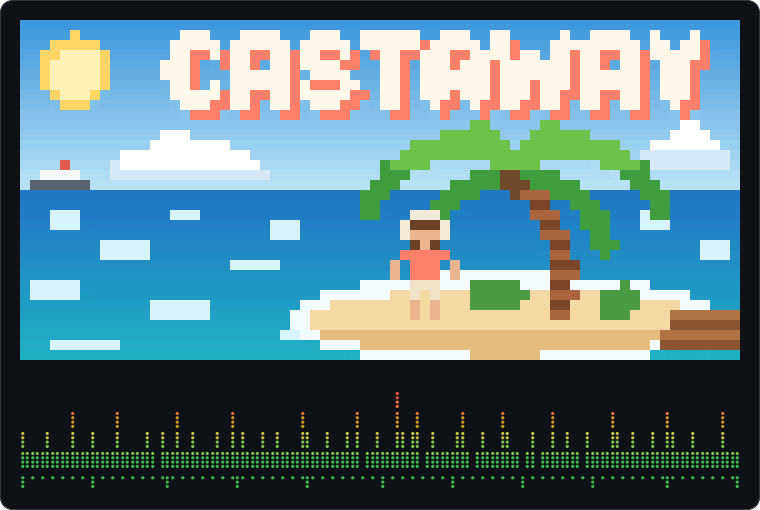

<!-- Header 55-braille-dot-graphics_opus_5.5 for Castaway. Generated by src/55-braille-dot-graphics_opus_5.5.mjs: edit that, not this. -->

<pre>
  lulltop · castaway · run 10:00:00 · seed 1992 · 1080p30 · daylight 100%

  ⠁⠁⠐⢄⠁⢰⠁⡠⠂⠁⠁⠁⠁⠁⢀⣴⣶⣦⡀⠁⠁⣠⣴⣶⣦⣄⠁⠁⣠⣴⣶⣦⣄⠁⢠⣶⣶⣶⣶⣶⡄⠁⣠⣴⣶⣦⣄⠁⢠⣶⡄⠁⠁⠁⠁⣴⣦⠁⢀⣤⣶⣶⣤⡀⠁⣴⣦⡀⢀⣴⣦⠁
  ⠁⠁⢄⠈⣠⣤⣄⠁⡠⠁⠁⠁⠁⢠⣿⡿⠉⠿⠿⠁⢰⣿⡟⠉⢻⣿⡆⢸⣿⡟⠉⠻⠿⠁⠁⠉⢹⣿⡏⠉⠁⢰⣿⡟⠉⢻⣿⡆⠘⣿⣷⢀⣴⣄⢰⣿⡟⠁⣾⣿⠋⠙⣿⣷⠁⠘⣿⣷⣾⣿⠃⠁
  ⠠⠤⠄⢼⣿⣿⣿⡧⠠⠤⠄⠁⠁⢸⣿⡇⠁⠁⠁⠁⢸⣿⣧⣤⣼⣿⡇⠈⠻⣿⣿⣷⣦⡀⠁⠁⢸⣿⡇⠁⠁⢸⣿⣧⣤⣼⣿⡇⠁⢿⣿⣼⣿⣿⣼⣿⠇⠁⣿⣿⣤⣤⣿⣿⠁⠁⠘⣿⣿⠃⠁⠁
  ⠁⠁⠔⠈⠻⠿⠟⠁⠢⠁⠁⠁⠁⠘⣿⣷⣀⣶⣶⠁⢸⣿⡟⠛⢻⣿⡇⢀⣶⣆⣀⣹⣿⡇⠁⠁⢸⣿⡇⠁⠁⢸⣿⡟⠛⢻⣿⡇⠁⠸⣿⣿⡏⣿⣿⡿⠁⠁⣿⣿⠛⠛⣿⣿⠁⠁⠁⣿⣿⠁⠁⠁
  ⠁⠁⢀⠜⠁⡆⠁⠣⡀⠁⠁⠁⠁⠁⠈⠻⠿⠟⠁⠁⠘⠿⠃⠁⠘⠿⠃⠁⠙⠿⠿⠿⠋⠁⠁⠁⠘⠿⠃⠁⠁⠘⠿⠃⠁⠘⠿⠃⠁⠁⠻⠟⠁⠘⠿⠃⠁⠁⠻⠟⠁⠁⠻⠟⠁⠁⠁⠻⠟⠁⠁⠁
  ⠁⠁⠁⠁⠁⠁⠁⠁⠁⠁⠁⠁⠁⢀⡠⠤⢄⠁⠁⠁⠁⠁⠁⠁⠁⠁⠁⠤⡀⡠⠄⠁⠁⠁⠁⠁⠁⠁⠁⠁⠁⠁⢀⣀⡀⠁⢶⣄⠁⠁⠁⣠⡶⠁⢀⣀⡀⠁⠁⠁⠁⠁⠁⠁⠁⡠⠲⠲⢄⠁⠁⠁
  ⠁⠁⠁⠁⠁⠁⠁⠁⠁⢀⡠⠤⠤⠣⠡⠡⠡⠱⠩⠩⠲⢄⣀⠁⠁⠁⠁⠁⠈⠁⠁⠐⠢⡠⠒⠁⠁⠁⣀⣴⣶⣿⡿⠿⠿⠿⢦⠹⡷⠁⣾⠏⡴⠿⠿⠿⢿⣿⣶⣦⣀⠁⡴⠩⠩⠡⠡⠡⠡⠩⢢⠁
  ⠁⠁⣀⣴⣄⡀⠁⠁⠁⣮⣡⣡⣡⣡⣡⣡⣡⣡⣡⣡⣡⣡⣡⣹⡄⠁⠁⠁⠁⠁⠁⠁⠁⠁⠁⠁⣠⣾⠿⠋⠁⠁⠁⠁⠁⣀⣤⣤⣡⡲⣋⢤⣤⣀⠁⠁⠁⠁⠈⠙⠿⣷⣍⠉⠉⠉⠉⠉⠉⠉⠉⠁
  ⠁⠬⠿⠿⠿⠯⠤⠤⠤⠤⠤⠤⠤⠤⠤⠤⠤⠤⠤⠤⠤⠤⠤⠤⠤⠤⠤⠤⠤⠤⠤⠤⠤⠤⠤⣴⠿⠤⠤⠤⠤⠤⣤⣶⣿⠿⠿⠭⠌⠶⠩⣾⡿⠿⣿⣶⣤⠤⠤⠤⠤⠤⠿⣦⠤⠤⠤⠤⠤⠤⠤⠤
  ⠁⠁⠁⣀⣤⣄⡀⠁⠁⠁⠁⠁⠁⠁⠁⣤⠤⣤⠁⠁⠁⠁⠁⠁⠁⠁⠁⠁⠁⠁⠁⠁⠁⠁⠁⠁⠁⠁⠁⠁⠁⠴⡿⠋⠁⠁⠁⠁⠁⠁⠁⠹⣿⡄⠁⠙⢿⣦⠁⠁⠁⠁⣀⣬⣄⡀⠁⠁⠁⠁⠁⠁
  ⠁⠁⠁⠁⠁⠈⠁⠁⠁⠁⠁⠁⠁⠁⠁⠁⠁⠁⠁⠁⠁⠁⠁⠁⠁⠶⠛⠳⠆⠁⠁⠁⠁⠁⠁⠁⠁⣴⡏⣭⡍⣷⡄⠁⠁⠁⠁⠁⠁⠁⠁⠁⠹⠿⡄⠁⠁⠻⡇⠁⠁⠁⠉⠁⠈⠁⠁⠁⠁⠁⠁⠁
  ⠁⠁⠁⠁⠁⠁⠁⠁⠒⠛⠛⠛⠶⠁⠁⠁⠁⠁⠁⠁⠁⠁⣀⣀⡀⠁⠁⠁⠁⠁⠁⠁⠁⠁⠁⠁⠁⠶⣈⣻⣋⡀⠁⠁⠁⠁⠁⠁⠁⠁⠁⠁⠁⣿⣷⠁⠁⠁⠁⠁⠁⠁⠁⠁⠁⠁⠁⠁⠞⠛⠛⠆
  ⠁⠁⠁⠁⠁⠁⠁⠁⠁⠁⠁⠁⠁⠁⠁⠁⠁⠁⠁⠁⠁⠉⠉⠉⠙⠃⠁⠁⠁⠁⠁⠁⠁⠁⠁⠁⠁⠸⢸⣿⣿⠸⠁⢀⠁⡀⡀⢀⠁⡀⢀⢀⠁⣸⣿⢀⠁⡀⠁⠁⠁⠁⠁⠁⠁⠁⠁⠁⠁⠁⠁⠁
  ⠁⠶⠒⠛⠛⠳⠆⠁⠁⠁⠁⠁⠁⠁⠁⠁⢀⠁⠁⠁⠁⠁⠁⠁⠁⠁⠁⠁⠁⢀⡀⠤⢐⣐⣐⣤⣥⣥⡘⡇⡟⢰⢶⢶⢶⢶⢶⢶⢶⢶⢶⢴⢶⣾⣿⢷⢦⢤⢬⣬⣬⣤⣂⣂⡂⠤⢀⡀⠁⠁⠁⠁
  ⠁⠁⠁⠁⠁⠁⠁⠁⠁⠁⠁⠁⠁⠶⠛⠋⠉⠛⠳⠆⠁⠁⠁⠁⠁⠁⢠⠔⢩⢴⢞⢟⢝⢝⢕⢕⢕⢕⠡⠇⠧⢑⢕⢕⢕⢕⢕⢕⢕⢕⢕⢕⢕⢿⣿⢕⢕⢕⢕⢕⢕⢕⢝⠅⠁⠁⠤⡴⠤⢤⠦⠤
  ⠁⠁⠁⢀⣀⣤⣤⣄⣀⠁⠁⠁⠁⠁⠁⠁⠁⠁⠁⠁⠁⠁⠁⠁⠁⠁⡼⠢⣘⠳⢕⣕⣕⢕⢕⢕⢕⢕⢕⢕⢕⢕⢕⢕⢕⢕⢕⢕⢕⢕⢕⢕⢕⢕⢕⢕⢕⢕⢕⢕⢕⢕⢕⠅⠁⠬⡽⠭⢭⠯⠭⠭
  ⠁⠁⠁⠋⠉⠁⠁⠈⠉⠃⠁⠁⠁⠁⠁⠁⠁⠁⠁⠁⠁⠁⠁⠁⠁⠁⠁⠁⠁⠈⠁⠒⠨⠩⠩⠓⡓⡓⡓⠓⠳⠵⠵⠵⠵⠕⠵⠵⠵⠵⠵⠵⠵⠵⠵⠵⠕⠓⢓⢓⢓⠛⠍⠅⠈⠙⠉⠉⠋⠉⠉⠉

  <b>CASTAWAY</b> · ten hours on one tiny island, one tall palm, one raft
  she idles. every so often, something happens. mostly, the lines stay flat.

  ┌ events · one simulated 10-hour run, seed 1992 · the rarer, the taller
  ⠁⠁⠁⠁⠁⠁⠁⠁⠁⠁⠁⠁⠁⠁⠁⠁⠁⠁⠁⠁⠁⠁⠁⠁⠁⠁⠁⠁⠁⠁⠁⠁⠁⠁⠁⠁⠁⠁⠁⠁⠁⠁⠁⠁⠁⠁⠁⠁⠁⠁⠁⠁⠁⠁⠁⠁⠁⠁⠁⠁⠁⠁⠁⠁⠁⠁⠁⠁⠁⠁⠁⠁
  ⠁⠁⠁⠁⠁⠁⠁⠁⠁⠁⠁⠁⠁⠁⠁⠁⠁⠁⠁⠁⠁⠁⠁⠁⠁⠁⠁⠁⠁⠁⠁⠁⠁⠁⠁⠁⠁⣿⠁⠁⠁⠁⠁⠁⠁⠁⠁⠁⠁⠁⠁⠁⠁⠁⠁⠁⠁⠁⠁⠁⠁⠁⠁⠁⠁⠁⠁⠁⠁⠁⠁⠁
  ⠁⠁⠁⠁⠁⣿⠁⠁⠁⣿⠁⠁⠁⠁⠁⣿⠁⠁⠁⠁⠁⣿⠁⠁⠁⠁⠁⠁⣿⠁⠁⠁⠁⣿⠁⠁⠁⣿⠁⣿⠁⠁⠁⠁⣿⠁⠁⠁⣿⠁⠁⠁⠁⣿⠁⠁⠁⠁⠁⣿⠁⠁⠁⠁⣿⠁⠁⠁⠁⠁⣿⠁
  ⣿⠁⣿⠁⠁⣿⠁⣿⠁⣿⠁⠁⣿⠁⣿⣿⠁⣿⠁⣿⠁⣿⣿⠁⣿⣿⠁⠁⣿⠁⣿⠁⣿⣿⠁⣿⠁⣿⣿⣿⠁⣿⠁⣿⣿⠁⣿⠁⣿⠁⠁⣿⠁⣿⣿⠁⣿⠁⠁⣿⠁⣿⠁⣿⣿⣿⠁⣿⠁⠁⣿⠁
  ⡟⠛⠛⠛⠛⠛⠛⡟⠛⠛⠛⠛⠛⠛⢻⠛⠛⠛⠛⠛⠛⢻⠛⠛⠛⠛⠛⠛⠛⡟⠛⠛⠛⠛⠛⠛⡟⠛⠛⠛⠛⠛⠛⡟⠛⠛⠛⠛⠛⠛⢻⠛⠛⠛⠛⠛⠛⢻⠛⠛⠛⠛⠛⠛⠛⡟⠛⠛⠛⠛⠛⢻
  └ 219 events. she is busy 28% of the run and nodding along for 72%.

  ┌ events per 10-hour run, by timer · median of 200 simulated runs
  regular     ■■■■■■■■■■■■■■■■■■■■■■■■■■■■■■ ~155  every 2 to 5 min
  occasional  ■■■■■■························  ~30  every 12 to 25 min
  rare        ■■■···························  ~13  every 30 to 60 min
  super rare  ■·····························   ~2  every 3 to 6 h
  samples     ······························    0  every sound is code

  $ python <a href="tools/serve.py">tools/serve.py</a>     then open <a href="http://127.0.0.1:8765/">http://127.0.0.1:8765/</a>
</pre>

**Castaway** (working title) is a ten-hour lo-fi video for YouTube in which almost nothing happens, on purpose. A young woman sits on a very small island with one tall palm, a raft and her headphones, nodding to the music, and every so often something happens: a message in a bottle washes straight back, a coconut lands on a hermit crab and later walks off with the crab inside, a stray cat drifts in on a crate, climbs the palm and naps. It is an unofficial remake inspired by the small-island routines and visual comedy of the 1992 screensaver *Johnny Castaway*, repainted as a sunny, hand-painted coastal scene. 16:9, 1080p, 30 fps, and it is always daytime.

[`activities.toml`](activities.toml) lists more than 90 activities, most of them on four timers, from a coconut every few minutes to "she could leave any time", which some videos never get to see. Every one of them waits for the next bar of the music, so the gags land on the beat. Every sound is synthesized from code by [`tools/make_audio.py`](tools/make_audio.py): no samples, no loops, no recordings. The charts above were plotted from the project's own numbers on 2026-10-01, one simulated run with the default seed. By the time you read this the schedule will have grown, which is more than can be said for the sandcastles.

```sh
python tools/serve.py      # then open http://127.0.0.1:8765/
python tools/schedule.py   # check the schedule, simulate 10 hours
```

The page encodes frame-exact H.264 in the browser with WebCodecs (68 to 78 frames a second at 1080p30 in Chrome), and the server mixes in the sound and joins the two into a YouTube-ready MP4. Plain ES modules, no build step, no npm packages. [`tools/render_demo.py --dev`](tools/render_demo.py) is the older Python reference renderer, and draws a reel of every activity with a heads-up display. Working notes live in [`MUSING.md`](MUSING.md).

<details>
<summary><b>lulltop --log</b>: one whole ten-hour run, lane by lane, with timestamps</summary>

<pre>
  lulltop --log · seed 1992 · simulated 2026-10-01 · 194 things she did

  ┌ ships · 9 crossed the horizon, 8 of them while she was busy
  ⠁⠁⢪⡅⡀⠁⢪⡅⡀⠁⠁⠐⣭⢀⠁⠁⢪⡅⡀⠁⠁⠁⠁⢪⡅⡀⠁⠐⣭⢀⠁⠁⠁⠁⠁⠁⢪⡅⡀⠁⠁⠁⠁⠁⠁⠁⠁⠁⠁⠁⠁⠁⠁⠁⠁⠁⠁⠐⣭⢀⠁⠁⠁⢪⡅⡀⠁⠁⠁⠁⠁⠁
  ⡀⠺⠿⠿⠇⠺⠿⠿⠿⠿⠐⠿⠿⠿⠇⠺⠿⠿⠿⠿⠂⡀⠺⠿⠿⠿⠐⠿⠿⠿⠿⠗⡀⡀⡀⠺⠿⠿⠿⠿⠂⡀⡀⡀⡀⡀⡀⡀⡀⡀⡀⡀⡀⡀⡀⡀⡐⠿⠿⠿⠿⠇⠺⠿⠿⠿⠿⠂⡀⡀⡀⡀
  ┌ the cat · 5 visits on a crate · 1:49:40 on the island in all
  ⠁⠁⠁⠁⢷⣴⠇⢀⠁⠁⠁⠁⠁⠁⠁⠁⠁⠁⠁⠸⣦⡾⠁⡀⠁⠁⠁⠁⠁⠁⠁⠁⠁⠁⠁⠁⠁⠸⣦⡾⠁⡀⠁⠁⠁⠁⠁⠁⠁⠁⠸⣦⡾⠁⡀⠁⠁⠁⠁⠁⠁⠁⠁⠁⠁⠁⠁⢷⣴⠇⢀⠁
  ⡀⡀⡀⡀⠸⠿⠷⠜⡀⡀⡀⡀⡀⡀⡀⡀⡀⡀⡀⡀⠿⠿⠦⠃⡀⡀⡀⡀⡀⡀⡀⡀⡀⡀⡀⡀⡀⡀⠿⠿⠦⠃⡀⡀⡀⡀⡀⡀⡀⡀⡀⠿⠿⠦⠃⡀⡀⡀⡀⡀⡀⡀⡀⡀⡀⡀⡀⠸⠿⠷⠜⡀
  ┌ sandcastles · 10 built · 10 taken by the tide · standing now: 0
  ⠁⠁⠁⠁⠁⠁⣷⣧⣦⣷⡇⢸⣾⣴⣼⣾⠁⠁⠁⠁⠁⠁⠁⠁⠁⣷⣧⣦⢸⣾⡄⣷⣧⡆⣷⣧⣦⣷⡇⠁⠁⠁⠁⠁⣷⣧⣦⣷⡇⠁⠁⠁⠁⠁⠁⠁⠁⠁⣷⣧⣦⣷⢸⣾⡄⣷⣧⣦⣷⡇⠁⠁
  ⡀⡀⡀⡀⡀⡀⠿⠏⡈⠿⠇⠸⠿⠁⠹⠿⠁⡀⡀⡀⡀⡀⡀⡀⡀⠿⠏⡈⠸⠿⠁⠿⠏⠁⠿⠏⡈⠿⠇⡀⡀⡀⡀⡀⠿⠏⡈⠿⠇⡀⡀⡀⡀⡀⡀⡀⡀⡀⠿⠏⡈⠿⠸⠿⠁⠿⠏⠈⠿⠇⡀⡀
  ┌ signal · 0 bars, except for 2 min 35 s at the top of the palm
  ⠁⠁⠁⠁⠁⠁⠁⠁⠁⠁⠁⠁⠁⠁⠁⠁⠁⠁⠁⠁⠁⠁⠁⠁⠁⠁⠁⠁⠁⠁⠁⠁⠁⠁⠁⠁⠁⠁⠁⠁⠁⠁⢀⠁⡆⢸⠁⠁⠁⠁⠁⠁⠁⠁⠁⠁⠁⠁⠁⠁⠁⠁⠁⠁⠁⠁⠁⠁⠁⠁⠁⠁
  ⡀⡀⡀⡀⡀⡀⡀⡀⡀⡀⡀⡀⡀⡀⡀⡀⡀⡀⡀⡀⡀⡀⡀⡀⡀⡀⡀⡀⡀⡀⡀⡀⡀⡀⡀⡀⡀⡀⡀⡀⡀⠶⠸⠁⠇⠸⠁⡀⡀⡀⡀⡀⡀⡀⡀⡀⡀⡀⡀⡀⡀⡀⡀⡀⡀⡀⡀⡀⡀⡀⡀⡀
  └ 0:00:00 on the left, 10:00:00 on the right

   0:24:18  a ship crosses the horizon. she is sipping a coconut.
   0:44:06  a stray cat drifts in on a crate, climbs the palm, naps.
   1:00:42  a sandcastle.
   1:07:57  the tide comes for the sandcastle.
   1:21:21  a hammock. one end on the palm, the other on the raft.
   3:04:15  a message in a bottle. it washes straight back.
   3:36:03  a coconut lands on a hermit crab. later, the coconut leaves.
   4:01:09  a ship. she is not even busy. headphones.
   6:05:06  a different bottle washes up. it is a reply. she smiles.
   6:07:24  one bar of signal, at the top of the palm.
   9:44:09  the cat again. same crate.
  10:00:00  end of run. 10 sandcastles, 0 standing. 0 ships seen.
</pre>

</details>

<details>
<summary><b>lulltop --sound</b>: the 60-second theme, plotted note by note</summary>

<pre>
  lulltop --sound · <a href="tools/make_audio.py">tools/make_audio.py</a> · samples 0 · loops 0 · recordings 0

  ┌ kalimba lead · bars 7 to 20 of the 60 s theme · E5 up to G6
  ⠁⠁⠁⠁⠁⠁⠁⠁⠁⠁⠨⠁⠁⠁⠁⠁⠁⠁⠁⠁⠁⠁⠁⠁⠁⠁⠁⠁⠁⠁⠨⠁⠁⠁⠁⠁⠁⠁⠁⠁⠁⠁⠁⠁⠁⠁⠁⠁⠁⠁⠨⠁⠁⠁⠁⠁⠁⠁⠁⠁⠁⠁⠁⠁⠁⠁⠁⢠⡄⠁⠁⠁
  ⠁⠁⠁⠁⠁⠁⠁⠁⠁⠁⠨⠁⠁⠁⠁⠁⠁⠁⠁⠁⠁⠁⠁⠁⠁⠁⠁⠁⠁⣤⠨⠁⠁⠁⠁⠁⠁⠁⠁⠁⠁⣤⣤⡄⠁⠁⠁⠁⠁⠁⠨⠁⠁⠁⠁⠁⠁⠁⠁⠁⠁⠁⠁⠁⠁⠁⠁⠁⢠⣤⣤⠁
  ⠁⠁⠁⠁⠁⠁⠁⠁⠁⠁⠨⠁⠁⠁⠁⠁⠁⠁⠁⠁⠁⠁⠁⠛⠁⠁⠁⠁⠁⠁⠻⠁⠁⠁⠁⠁⠁⠁⠁⠁⠛⠁⠁⠘⠃⠁⠁⠁⠁⠁⠨⠁⠁⠁⠁⠁⠁⠁⠁⠁⠁⠁⠁⠁⠁⠁⠘⠃⠁⠁⠁⠁
  ⠁⠁⠁⠁⠁⠁⠁⠁⠁⠁⠨⠘⠃⠁⠁⠁⠁⠁⠁⠁⠁⠁⠁⠘⠛⠁⠁⠁⠛⠁⠸⠛⠛⠁⠁⠁⠁⠁⠁⠛⠁⠁⠁⠁⠁⠁⠁⠁⠁⠁⠸⠛⠛⠃⠁⠁⠁⠁⠁⠁⠁⠁⠁⠁⠁⠁⠁⠁⠁⠁⠁⠁
  ⠁⠁⠘⠃⠁⠁⠁⠁⠁⠁⠨⠁⠘⠃⠁⠁⠁⠁⠁⠁⠁⠁⠘⠃⠁⠛⠃⠘⠃⠁⠨⠁⠁⠛⠁⠁⠁⠁⠘⠃⠁⠁⠁⠁⠛⠁⠁⠁⠛⠛⠫⠁⠁⠘⠛⠛⠁⠁⠁⠁⠁⠁⠘⠛⠁⠁⠛⠁⠁⠁⠁⠁
  ⠁⢠⡄⣤⠁⠁⠁⠁⢠⣤⣬⠁⠁⣤⠁⠁⠁⢠⡄⠁⠁⢠⡄⠁⠁⠁⢠⡄⠁⠁⠨⠁⠁⢠⡟⣤⠁⠁⣤⠁⠁⠁⠁⠁⠁⣤⡄⢠⡄⠁⠨⠁⠁⠁⠁⠁⣤⣤⡄⠁⠁⠁⠁⠁⣤⣤⠁⠁⠁⠁⠁⠁
  ⠁⠁⠁⠁⣤⣤⡄⠁⣤⠁⠨⠁⠁⠁⣤⣤⡄⠁⢠⣤⠁⠁⠁⠁⠁⠁⠁⠁⠁⠁⠨⠁⠁⠁⠁⢠⣤⣤⠁⠁⠁⠁⠁⠁⠁⠁⢠⡄⠁⠁⠨⠁⠁⠁⠁⠁⠁⠁⢠⣤⣤⠁⠁⠁⠁⠁⠁⠁⠁⠁⠁⠁
  ⠁⠁⠁⠁⠁⠁⠁⢠⡄⠁⠨⠁⠁⠁⠁⠁⠁⠁⠁⠁⠁⣤⠁⠁⠁⠁⠁⠁⠁⠁⠨⠁⠁⠁⠁⠁⠁⠁⠁⠁⠁⠁⠁⠁⠁⠁⠁⠁⠁⠁⠨⠁⠁⠁⠁⠁⠁⠁⠁⠁⠁⠁⠁⠁⠁⠁⠁⠁⠁⠁⠁⠁
  ⠁⠁⠁⠁⠁⠁⠁⠁⠁⠁⠨⠁⠁⠁⠁⠁⠁⠁⠁⠁⠛⠁⠁⠁⠁⠁⠁⠁⠁⠁⠨⠁⠁⠁⠁⠁⠁⠁⠁⠁⠁⠁⠁⠁⠁⠁⠁⠁⠁⠁⠨⠁⠁⠁⠁⠁⠁⠁⠁⠁⠁⠁⠁⠁⠁⠁⠁⠁⠁⠁⠁⠁
  └ dotted lines: Gm9 · C13 · Fmaj9 · Dm9 come round again, every 4 bars

  tempo ...... 80 bpm, F major, ii-V-I-vi, 20 bars of exactly 3 s
  players .... electric piano, kalimba, soft drums, vinyl crackle
  the sea .... its own seamless 60 s loop
  loudness ... -14 LUFS, true peak at or below -1 dBTP
  levels ..... a master, and one per routine
  heard by ... nobody yet. the plot is all we have.
</pre>

</details>

<details>
<summary><b>lulltop --symbols</b>: the same run in Braille, in blocks, in three plain symbols, and in colour</summary>

<pre>
  lulltop --symbols braille
  ⠁⠁⠁⠁⠁⠁⠁⠁⠁⠁⠁⠁⠁⠁⠁⠁⠁⠁⠁⠁⠁⠁⠁⠁⠁⠁⠁⠁⠁⠁⠁⠁⠁⠁⠁⠁⠁⣶⠁⠁⠁⠁⠁⠁⠁⠁⠁⠁⠁⠁⠁⠁⠁⠁⠁⠁⠁⠁⠁⠁⠁⠁⠁⠁⠁⠁⠁⠁⠁⠁⠁⠁
  ⠁⠁⠁⠁⠁⣿⠁⠁⠁⣿⠁⠁⠁⠁⠁⣿⠁⠁⠁⠁⠁⣿⠁⠁⠁⠁⠁⠁⣿⠁⠁⠁⠁⣿⠁⠁⠁⣿⠁⣿⠁⠁⠁⠁⣿⠁⠁⠁⣿⠁⠁⠁⠁⣿⠁⠁⠁⠁⠁⣿⠁⠁⠁⠁⣿⠁⠁⠁⠁⠁⣿⠁
  ⣿⠁⣿⠁⠁⣿⠁⣿⠁⣿⠁⠁⣿⠁⣿⣿⠁⣿⠁⣿⠁⣿⣿⠁⣿⣿⠁⠁⣿⠁⣿⠁⣿⣿⠁⣿⠁⣿⣿⣿⠁⣿⠁⣿⣿⠁⣿⠁⣿⠁⠁⣿⠁⣿⣿⠁⣿⠁⠁⣿⠁⣿⠁⣿⣿⣿⠁⣿⠁⠁⣿⠁
  ⡟⠛⠛⠛⠛⠛⠛⡟⠛⠛⠛⠛⠛⠛⢻⠛⠛⠛⠛⠛⠛⢻⠛⠛⠛⠛⠛⠛⠛⡟⠛⠛⠛⠛⠛⠛⡟⠛⠛⠛⠛⠛⠛⡟⠛⠛⠛⠛⠛⠛⢻⠛⠛⠛⠛⠛⠛⢻⠛⠛⠛⠛⠛⠛⠛⡟⠛⠛⠛⠛⠛⢻

  lulltop --symbols block
       ▄   ▄     ▄    ▄      ▄     ▄  █ ▄   ▄   ▄    ▄     ▄     ▄    ▄
  █▄█▄▄██▄▄█▄▄█▄███▄▄███▄█▄█▄███▄█▄██▄█▄█▄█▄█▄█▄██▄▄██▄█▄█▄███▄█▄█▄█▄▄█▄

  lulltop --symbols tty
  ^_^__|^__|__^_^|^__^|^_^_^_|^^_^_|^_|_|_^_|_^_|^__^|_^_^_|^^_^_|_^__|_
</pre>

Terminal plotters pick their symbols by what the font can draw: Braille gives 2 x 4 dots a cell, block characters give half of that, and a bare console gets three plain symbols. The same 10 hours, three times.

Given colour, a cell can also hold two square pixels, an upper-half block in one colour over a background in another. Text on GitHub has no colour, so that version has to be a picture: the island at half the resolution of the one at the top, and the chart tinted by height the way terminal monitors do it, scrolling one cell at a time.

<p align="center">
  
</p>

</details>

<details>
<summary><b>about these dots</b>: how the header is drawn, and the small print</summary>

<br>

Everything above is text. Each Braille character is a 2 x 4 grid of dots, so the island picture is 144 x 68 dots in 72 characters by 17 lines, drawn by a script in plain Node and written out one character at a time.

Two rules keep it lined up in fonts nobody controls. A picture line holds Braille and nothing else, and it never uses the empty Braille cell, because on Windows that one character is narrower than the other 255 and would pull the rest of its line out of place. A cell with nothing in it gets a single dot instead, which is why a faint grid sits behind everything, like plot paper. On Windows the Braille also comes out a little wider than the plain text beside it. It is meant to.

Screen readers announce Braille as Braille, which here would be nonsense, so every name and number in the charts is also written out in plain text next to them.

*lulltop* is not a real program: it is a monitor for places where nothing happens, invented for this header. *Johnny Castaway* and its characters belong to their owners; Castaway is an unofficial, original project and is not affiliated with them.

</details>
