<!-- Header 56-vhs-tape_opus_5.5 for Castaway: "VHS Tape". The banner and the timer menu are generated by src/56-vhs-tape_opus_5.5.mjs; this page is hand-written. -->

<p align="center">
  
</p>

<h1 align="center">Castaway</h1>

<p align="center">
  <b>Ten hours of island on one tape. Fifteen seconds of it are worn thin.</b>
</p>

<p align="center">
  A stationary-frame lo-fi video for YouTube, in the spirit of the 10-hour lofi streams and of a classic desert-island screensaver: a young woman, one tall palm, a raft and a lot of time. She idles, nodding to the music on her headphones. Every so often, something happens. Mostly, it does not. On purpose.<br>
  <sub>An unofficial remake, inspired by the small-island routines and visual comedy of <i>Johnny Castaway</i>, the 1992 screensaver. Sunny, hand-painted coastal anime. 16:9, 1080p, 24 fps, and always daytime.</sub>
</p>

<p align="center">
  More than 90 gags and routines, most of them on four timers, and every one starts on the next bar of the music, so it lands on the beat: a bottle that washes straight back, a drone that delivers another pair of headphones, a shark in headphones nodding along. Every sound is synthesized from code in <a href="tools/make_audio.py"><code>tools/make_audio.py</code></a>: no samples, no stock loops, no recordings.
</p>

```sh
python tools/serve.py
# then open http://127.0.0.1:8765/
```

<p align="center">
  <sub>Live preview in the browser, then export a YouTube-ready MP4. Plain ES modules, no build step, no npm.<br>
  Still in development, and nothing has been published yet, so for now there is only this tape. Please rewind.</sub>
</p>

<details>
<summary><b>PLAY</b>: the tape log, frame by worn frame</summary>

```text
 TAPE LOG · KELP MAGNETICS T-600 · SP · COUNTER 4:21:57 TO 4:22:12, AGAIN
 ─────────────────────────────────────────────────────────────────────────
 4:21:57  PLAY. A hermit crab sets off from the raft side of the island.
          She is nodding to the music with her eyes shut.
          ♪ KALIMBA, 80 BPM ♪ [MADE FROM CODE]
 4:22:00  [SYNTHESIZED SURF] [CRAB FEET TICKING]
 4:22:03  A coconut leaves the palm and lands on the crab, exactly on the
          bar line. [BONK] (ON THE BEAT). She keeps nodding.
 4:22:05  Small legs appear under the coconut. Then two eyes, on stalks.
 4:22:06  The coconut walks off, past her bare feet. [COCONUT FOOTSTEPS]
 4:22:09  ♪ KALIMBA CONTINUES ♪ [SHE MISSED IT]
 4:22:12  Somebody presses REW.
 << REW   Five times speed. Noise bars roll down the picture. The coconut
          walks backwards, gets off the crab and jumps back up the palm.
          The crab reverses to the raft. The counter spins back.
 4:21:57  PLAY. Again.
 ─────────────────────────────────────────────────────────────────────────
 WHY THE TRACKING IS BAD ... this is the most-rewound fifteen seconds of a
                             ten-hour tape. the other nine hours,
                             fifty-nine minutes and forty-five seconds
                             are in mint condition
 THE CLOCK ................. PM 12:00, blinking. nobody ever set it. it
                             says noon, which suits an island where it
                             is always daytime (that one is a rule)
 THE DATE .................. JAN. 01 1992 is not a release date. 1992 is
                             the default seed: same seed, same video,
                             event for event
 THE PICTURE ............... 4:3, so the 16:9 island has been formatted
                             to fit your screen. the palm was kept
 KELP MAGNETICS T-600 ...... six hundred minutes. there is no such tape,
                             and there is no such brand
```

In the video itself she is reading under the palm when the coconut drops, and she winces at the camera. On this tape she is nodding to the music instead, because that is what she does between gags, which is most of the time.

</details>

<details>
<summary><b>TIMER REC</b>: the schedule, programmed into a VCR (it worked first time)</summary>

<p align="center">
  
</p>

The four timers live in [activities.toml](activities.toml). When one goes off, it picks an activity from its tier that is free to happen right now. The counts per ten hours are the median of 200 simulated runs, from the file's own header. She is busy about a third of the time and idling the rest. Lanes let things overlap, so the sea can be busy while she is: a ship can sail past while she is dealing with a coconut. `python tools/schedule.py` checks the file and simulates a ten-hour run.

```text
 NOW SHOWING, EVERY SO OFTEN (in no particular order, by design)
 ─────────────────────────────────────────────────────────────────────────
 · a message in a bottle that washes straight back to her feet. a
   different bottle, later, brings a reply
 · a delivery drone. the parcel is another pair of headphones
 · a sea turtle who visits
 · a grey tabby with a white chest who arrives on a crate, climbs the
   palm, naps, and one day floats away again. and comes back
 · the signal hunt: one bar of signal, at the top of the palm
 · a shark wearing headphones, nodding to the beat
 · a tour boat of selfie-takers. nobody offers a lift
 · a coconut falls on a hermit crab. the coconut walks off (see tape)
 · she could leave any time: she walks out over the water and comes
   back with an iced coffee
 · a bro on an electric hydrofoil: a shaka, a carve, gone
 · bushcraft: fire by friction, a hammock, a lookout up the palm, spear
   fishing
 · a kumara she plants, which grows over the course of the video
 · coconut sipping, fishing, jogging laps, waving for rescue
 · a sandcastle. the tide takes it
```

</details>

<details>
<summary><b>LINE 21</b>: the soundtrack, as captioned</summary>

```text
 ♪ KALIMBA, 80 BPM ♪ ....... the theme: a seamless 60-second loop in
                             F major, a ii-V-I-vi progression, 20 bars of
                             exactly 3 s. electric piano, a kalimba lead,
                             soft drums, vinyl crackle
 [MADE FROM CODE] .......... all of it, by tools/make_audio.py. no
                             samples, stock loops or recordings, so
                             no third-party licence applies. more than 150
                             sound files and counting
 [SYNTHESIZED SURF] ........ the ocean ambience, also a seamless 60 s loop
 [CRAB FEET TICKING] ....... a crab's feet ticking quickly over the sand
 [BONK] .................... the sound file calls it a thud and a short
                             dry crunch. the caption writer went with BONK
 (ON THE BEAT) ............. every activity starts on the next bar line,
                             every 3 seconds, so the gags land on it
 [COCONUT FOOTSTEPS] ....... the crab's feet again, now under a coconut
 [SHE MISSED IT] ........... headphones
 LEVELS .................... -14 LUFS, true peak at or below -1 dBTP,
                             adjustable in master and per routine
 REVIEWS ................... none yet. nobody has listened to it. the
                             captions are working from the sound files
```

</details>

<details>
<summary><b>VCR MANUAL</b>: how to work it (no blinking 12:00 involved)</summary>

```text
 python tools/serve.py ............ the renderer: a web page with a live
                                    preview at http://127.0.0.1:8765/
 EXPORT ........................... frame-exact H.264 in the browser
                                    (WebCodecs, 68 to 78 frames a second
                                    at 1080p in Chrome). the server
                                    mixes the sound and joins the two
                                    into a YouTube-ready MP4
 python tools/schedule.py ......... validates the schedule and simulates
                                    a ten-hour run
 python tools/render_demo.py --dev  a dev reel of every activity with a
                                    heads-up display (the older Python
                                    reference renderer)
 python tools/make_audio.py ....... synthesizes the sound, all of it
 MOTION ........................... hard cuts and stepped movement, like
                                    the coconut's feet
 SCENE LIFE ....................... 26 entries. on now: shore waves and
                                    drifting cloud shadows. coming up:
                                    distant birds, planes with vapour
                                    trails, whale pods, dolphins,
                                    sailboats, sandpipers, a gecko and a
                                    rain shower
 RUN .............................. 10:00:00 by default, seed 1992
 STATUS ........................... in development. no video published,
                                    no public link
```

The working notes live in [MUSING.md](MUSING.md). The page itself is [web/index.html](web/index.html). The tools: [tools/serve.py](tools/serve.py), [tools/schedule.py](tools/schedule.py), [tools/make_audio.py](tools/make_audio.py), [tools/render_demo.py](tools/render_demo.py).

</details>

<details>
<summary><b>END CREDITS</b>: small print, and greetings to the people who rewind</summary>

```text
 CASTAWAY
 an island, a palm, a raft, her, and a coconut with legs

 CAPTIONS ........... Lagoon Captioning, who type exactly what they hear
                      and are not sorry about BONK
 TAPE STOCK ......... Kelp Magnetics T-600, the ten-hour tape that was
                      never made
 RENTED FROM ........ Second Shell Video, run by hermit crabs, who know
                      a thing or two about renting. the sticker says
                      PLEASE REWIND. somebody took that very seriously
 LETTERING .......... Tracking Mono, a squared on-screen-display face
                      drawn for this header, and a heavier cut for the
                      title. no real font was harmed
 THE PICTURE ........ drawn from scratch in code. no footage, no stills

 GREETINGS TO
   the Coconut Rewind Society (meets at 4:22:03, then again at 4:22:03)
   the Tracking Knob Appreciation Club (turn it slowly. slower)
   the Noon Forever Club, whose clocks have said 12:00 since they were
   unboxed
   and everyone who has watched ten hours of a stationary frame on
   purpose

 SMALL PRINT
   Castaway is an unofficial project, inspired by Johnny Castaway, the
   1992 desert-island screensaver, which belongs to its owners. nothing
   from it is used here. the VHS look is a homage to home video and to
   the late-night lo-fi edits that brought it back
```

</details>

<p align="center"><sub>Kelp Magnetics, Second Shell Video, Lagoon Captioning and every club above are invented. The coconut is real, within the video.</sub></p>
