<!-- Header 61-web-1-homepage_opus_5.5 for Castaway. The pictures are generated by src/61-web-1-homepage_opus_5.5.mjs; this page is hand-written. -->

<p align="center">
  
</p>

<h1 align="center">Castaway</h1>

<p align="center">
  <b><i>~*~ Welcome to my island! ~*~</i></b><br>
  <b>Castaway</b> is a ten-hour lo-fi island video in which almost nothing happens, on purpose.<br>
  One young woman, one tall palm, one raft and a great deal of time. She mostly nods to the music on her headphones.
  Every so often, on the beat, something happens. Then she goes back to nodding.<br>
  <sub>Working title &nbsp;·&nbsp; an unofficial remake inspired by the 1992 screensaver <i>Johnny Castaway</i> &nbsp;·&nbsp; in development, no video yet</sub>
</p>

<p align="center">
  <a href="tools/serve.py"></a>
  <a href="activities.toml"></a>
  <a href="tools/make_audio.py"></a>
  <a href="tools/make_audio.py"></a>
  <br>
  <a href="web/index.html"></a>
  <a href="tools/schedule.py"></a>
  <a href="MUSING.md"></a>
  <a href="web/index.html">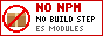</a>
</p>

Run this to visit my island, then open <a href="http://127.0.0.1:8765/">http://127.0.0.1:8765/</a> for the preview and MP4 export:

```sh
python tools/serve.py
```

<p align="center">
  You are visitor number 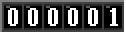<br>
  <sub>No video has been published yet, so the count is honest. It keeps hoping for 2.</sub>
</p>

<p align="center">
  
</p>

**What happens on my island.** Mostly nothing, and that is the product: a stationary-frame video for YouTube in the spirit of the ten-hour lofi streams, 16:9, 1080p, 30 fps, sunny and hand-painted, and always daytime. Then a message in a bottle washes up, she throws it back, and it washes straight back. A drone delivers a parcel, and the parcel is another pair of headphones. A shark surfaces, also in headphones, and nods to the same beat. More than 90 activities in [activities.toml](activities.toml) take turns on four timers, and every one of them waits for the next bar of the music, so the gags land on the beat.

**Everything you hear is made from code.** [tools/make_audio.py](tools/make_audio.py) synthesizes all of it, more than 150 sound files including the theme and the ocean, from maths alone: no samples, no loops, no recordings, so no third-party licence applies.

<p align="center">
  <br>
  <a href="MUSING.md"><b>Sign my Guestbook</b></a> &nbsp;|&nbsp; <a href="MUSING.md"><b>View my Guestbook</b></a><br>
  <sub>The guestbook is the project log. Bottle-mail also welcome: it washes straight back.</sub>
</p>

<table align="center">
  <tr>
    <td align="center" colspan="3">This island is a proud member of the<br><b>~ Islands With Exactly One Palm ~</b> webring<br><sub>(members: 1, so every link leads back here)</sub></td>
  </tr>
  <tr>
    <td align="center"><a href="MUSING.md">&lt;&lt; Prev island</a></td>
    <td align="center"><a href="activities.toml">Random island</a></td>
    <td align="center"><a href="tools/serve.py">Next island &gt;&gt;</a></td>
  </tr>
</table>

<p align="center">
  
</p>

<details>
<summary><b>~*~ My gags!!! ~*~</b> the things that happen while you are not looking</summary>
<br>

Here is some of what might happen, at random, in one ten-hour video. Some of it every few minutes. Some of it once, if you are lucky. The new ones are marked, like on a real homepage.

- **The bottle.** A message in a bottle washes up. She throws it back. It washes straight back.
-  **The reply.** Much later, a different bottle brings an answer.
- **The drone.** A delivery drone lowers a parcel. Inside: another pair of headphones.
- **The turtle.** A sea turtle drops by.
-  **The cat.** A stray cat, a grey tabby with a white chest, arrives on a crate, climbs the palm and naps. One day it floats away again. Another day, the cat comes back.
- **The signal hunt.** One bar of signal, at the very top of the palm. (This page was probably uploaded from up there.)
- **The shark.** A shark in headphones surfaces and nods to the beat.
- **The tour boat.** A small boat full of people taking selfies.
- **The coconut.** A coconut falls on a hermit crab. Then the coconut walks off, with the crab wearing it.
- **She could leave any time.** Very rarely she walks out over the water and comes back with an iced coffee.
- **The hydrofoil.** A bro on an electric hydrofoil carves in, waves a shaka and carves off.
- **Bushcraft.** Fire by friction, a hammock, a lookout up the palm, spear fishing.
- **The kumara.** Planted once, it grows over the course of the video.
- **The regulars.** Sipping a coconut, fishing, jogging laps, waving for rescue, and a sandcastle that stands until the tide takes it.

The island keeps itself busy too: 26 bits of scene life, 4 always on and 22 that come and go. The shore waves and the drifting cloud shadows are built. Distant birds, planes with vapour trails, whale pods, dolphins, sailboats, sandpipers, a gecko and a rain shower are planned.

</details>

<details>
<summary><b>~*~ My schedule (very important) ~*~</b> four timers, one beat</summary>
<br>

Most activities sit on one of four timers in [activities.toml](activities.toml); a dozen or so only ever follow on from another one. Counts are the median of 200 simulated ten-hour runs, as the file's own header gives them.

<table align="center">
  <tr><th>Timer</th><th>Comes round every</th><th>In a 10-hour run</th></tr>
  <tr><td>regular</td><td>2 to 5 minutes</td><td align="right">about 155</td></tr>
  <tr><td>occasional</td><td>12 to 25 minutes</td><td align="right">about 30</td></tr>
  <tr><td>rare</td><td>30 to 60 minutes</td><td align="right">about 13</td></tr>
  <tr><td>super rare</td><td>3 to 6 hours, 3 at most</td><td align="right">about 2</td></tr>
  <tr><td>chained</td><td>straight after another one</td><td align="right">follow-ups</td></tr>
</table>

She is busy about a third of the time and idles the rest. Every activity starts on the next bar of the 80 BPM theme (a bar is 3 seconds), so even the rarest gag lands on the beat. Lanes let things overlap, so the sea can get on with something while she is busy with a coconut. The default run is `10:00:00` on seed `1992`, and the same seed gives the same schedule, event for event.

```sh
python tools/schedule.py      # check the schedule and simulate a 10-hour run
```

</details>

<details>
<summary><b>~*~ Cool sounds!!! ~*~</b> all of them made from code</summary>
<br>

[tools/make_audio.py](tools/make_audio.py) makes every sound from scratch, more than 150 files and counting, with no samples, no loops and no recordings, so nothing in the soundtrack carries a third-party licence.

- **The theme** is a seamless 60-second loop at 80 BPM in F major: ii, V, I, vi, 20 bars of exactly 3 seconds, with electric piano, a kalimba lead, soft drums and vinyl crackle.
- **The ocean** is a seamless 60-second loop as well.
- **The mix** sits at -14 LUFS with true peak at or below -1 dBTP, and the levels can be set for the master and for each routine.

Nobody has listened to any of it yet, so this homepage cannot tell you whether it is good. It can tell you it is exactly 60 seconds long.

```sh
python tools/make_audio.py    # needs numpy, and ffmpeg on PATH
```

</details>

<details>
<summary><b>~*~ How my homepage works ~*~</b> the renderer, the export, the dev reel</summary>
<br>

The renderer is a web page. [tools/serve.py](tools/serve.py) serves [web/index.html](web/index.html) with a live preview of the island and an export button. The browser encodes every frame exactly with WebCodecs (H.264, 68 to 78 frames a second at 1080p30 in Chrome), then the server mixes in the sound and joins the two into a YouTube-ready MP4. Plain ES modules: no build step, no npm packages.

```sh
python tools/serve.py               # then open http://127.0.0.1:8765/
python tools/schedule.py            # check the schedule, simulate 10 hours
python tools/render_demo.py --dev   # older renderer: a dev reel with a HUD
```

Hard cuts and stepped movement are the project's motion defaults, which is also how every GIF on this page moves.

</details>

<details>
<summary><b>~*~ Link to me!!! ~*~</b> my button, and the rest of my collection</summary>
<br>

<p align="center">
  <a href="web/index.html"></a><br>
  <sub>This is my button. To link to my island, right-click it and Save Picture As. That is how it was done.</sub>
</p>

<p align="center">
  <a href="tools/make_audio.py"></a>
  <a href="MUSING.md"></a>
  <a href="tools/schedule.py"></a>
</p>

**Awards this island has won:** the *Turtle's Choice Award* for Best Island (the turtle has visited one island), and *Exactly One Palm*, from the webring. Both were presented by the island to the island.

</details>

<details>
<summary><b>~*~ FAQ ~*~</b> frequently asked questions, asked by nobody, frequently</summary>
<br>

**Does anything happen?** Yes. Every so often. On the beat.

**How often?** Something ordinary every 2 to 5 minutes. Something rare every 30 to 60 minutes. Something super rare once or twice a video, three times at the very most.

**Why are there stars? It is always daytime.** The stars are this page's wallpaper. On the island it is always daytime, and that is a rule.

**Can she leave?** She could leave any time. Very rarely she walks out over the water and comes back with an iced coffee.

**What is the ship for?** It waits until she is busy, then sails past. She is busy with a coconut. She never sees it.

**Is this the 1992 screensaver?** No. It is an unofficial remake inspired by its small-island routines and visual comedy: a different castaway, a different island, about the same amount of waiting.

</details>

<details>
<summary><b>~*~ View source ~*~</b> how this homepage was made</summary>
<br>

The look is the free personal homepage of the late 1990s, the vernacular web that Olia Lialina catalogued in her 2005 essay: a tiled starry background, a serif welcome line in a clashing colour, a 3D logo from a free logo generator, a rainbow rule, a NEW! starburst, an under-construction sign with flashing lamps, a marquee, an odometer hit counter, a webring and a drawer of 88x31 buttons. GitHub strips `<marquee>` and `<blink>`, so all the motion lives inside the pictures, and because each button is its own image, each one can be a real link.

Nothing here is copied from an archived page, GIF, button or site. A small generator script draws every pixel:

- **Four fonts, drawn by hand:** a bold Roman at 9 px caps for the welcome line, the way a browser's serif came out on an unsmoothed screen; a 7 px sans for the small print; 3x5 capitals for inside the buttons; and the counter's figures.
- **The logo** is eight centre-line strokes, rasterised hard-edged on an arch, extruded in three purples and matted in black, with a rainbow that steps one band a beat.
- **The photo** is dithered like a 256-colour GIF and annotated in paint-program red.
- **Every animation cuts like a GIF** and keeps the theme's time: 0.75 seconds a beat, 3 seconds a bar. She nods on the beat, the photo's story takes 8 bars, and the lamps and the NEW! swap once a beat, far below anything that flashes. With reduced motion turned on, everything holds a complete, readable frame.

</details>

<p align="center">
  <sub>Last updated: 1 October 2026 &nbsp;·&nbsp; Best viewed at 1920x1080, with headphones &nbsp;·&nbsp; Hosted on one bar of signal, at the top of the palm</sub><br>
  <sub>The webring, the award and the visitor count are made up. Castaway is unofficial and not affiliated with the makers or owners of <i>Johnny Castaway</i>.</sub>
</p>
