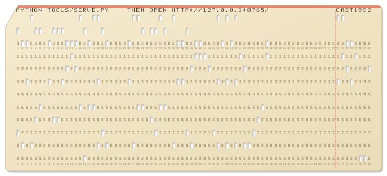

# Castaway header examples

Twenty retro README headers for Castaway (working title), a ten-hour lo-fi island video for YouTube: a young woman alone on a tiny island, idling to the music, while a schedule of gags plays out on the beat. It is an unofficial remake inspired by the 1992 screensaver *Johnny Castaway*, and is not affiliated with it or its owners. The project lives in `D:/python/castaway`, has no README or repository yet, and each header here is a candidate for the top of that future README.

Every style was drawn at random from the [style catalogue](../../styles), excluding the ones already built for the other example sets. Each example is its own `.md` in this folder; animated art is in `assets/`, and the generator that rebuilds it is in `src/` (`node examples/castaway/src/<option>.mjs`). Rebuild this page with `node examples/castaway/src/build-gallery.mjs`. File links were written for the castaway project root, so they don't resolve here.

Counts quoted (92 activities, 81 of them on four timers, 151 sound files) were checked against the project on 2026-10-01. The project is growing fast, so they will drift. Every crew, board, station, maker and person named is invented; real groups and products are style references only.

| # | Option | Style | What it is |
| --- | --- | --- | --- |
| 01 | [Mode 7 Island](01-mode7-island_opus_5.5.md) | [mach-15](../../styles/mach.md#mach-15) | Animated SVG: a 256x144 early-90s rotating-floor title screen where one island map, redrawn in 48 depth-scaled strips, swings round a palm while she sips a coconut, a ship slips behind her head, and CASTAWAY is painted in the sand. |
| 02 | [BBS Data Screens](02-bbs-stats_opus_5.5.md) | [ansi-05](../../styles/ansi.md#ansi-05) | Animated SVG: Castaway as a 1990s BBS post-login screen, with a gradient logo, stats strip, a lightbar stepping through the island's visitors as last callers, hotkeys, a half-block island, and a ruled file-area table and FILE_ID.DIZ. |
| 03 | [Fake Desktop Takeover](03-desktop-takeover_opus_5.5.md) | [pc-10](../../styles/pc.md#pc-10) | Animated SVG: a period teal desktop with a castaway wallpaper and one dialog that an island takes over, where a ship sails past while she sips a coconut, with the gags, schedule and sound in pop-up dialog boxes below. |
| 04 | [Fullwidth Text](04-fullwidth_opus_5.5.md) | [vap-02](../../styles/vap.md#vap-02) | Pure text: a vaporwave record sleeve in a pre block, with the name in fullwidth capitals and a Japanese subtitle beside a half-block palm, a shade-block sea, and the schedule set as a track list with real durations. |
| 05 | [Shift_JIS AA](05-shiftjis-aa_opus_5.5.md) | [asia-04](../../styles/asia.md#asia-04) | Animated SVG: a 2channel-style thread with original Shift_JIS line art. CASTAWAY is spelled in the kanji 島, a girl in headphones sips a coconut under a palm, and a ship hoots past unnoticed. |
| 06 | [RFC / Man Page](06-rfc-manpage_opus_5.5.md) | [hack-03](../../styles/hack.md#hack-03) | Pure text: a paginated 72-column RFC memo (Request for Calm 1992) plus a CASTAWAY(1) man page. Its tables, charts and diagrams are built from the real schedule's seed-1992 run. |
| 07 | [7-bit Outline NFO](07-7bit-outline-nfo_opus_5.5.md) | [nfo-04](../../styles/nfo.md#nfo-04) | Pure text: a 78-column 7-bit outline NFO with a slanted slash-and-underscore CASTAWAY logo, an ASCII island where a ship passes unseen, dot-leader fact rows and notched sections in details blocks. |
| 08 | [Tractor-Feed Printout](08-tractor-feed_opus_5.5.md) | [print-04](../../styles/print.md#print-04) | Animated SVG: a nine-pin printer feeding green-bar tractor paper, printing a CASTAWAY banner page and an excerpt of the real schedule report beside a dot-matrix island picture, plus a static 80-column punched card with the run command. |
| 09 | [Pinball Dot-Matrix Display](09-pinball-dmd_opus_5.5.md) | [mach-11](../../styles/mach.md#mach-11) | Animated SVG: a 128x32 orange plasma pinball display by an invented maker. Its 60-second attract loop shows the title, the ship sailing past while she sips a coconut, a SHIP MISSED award, real schedule scores, gags and PRESS START. |
| 10 | [C64 Directory Art](10-dir-art_opus_5.5.md) | [c64-04](../../styles/c64.md#c64-04) | Pure text: a Commodore 64 disk directory listing whose 0-block file names draw CASTAWAY, a palm island, a ship and her, with real project counts as block sizes, plus a blue-screen SVG twin. |
| 11 | [Usenet Line Art](11-usenet-line-art_opus_5.5.md) | [nfo-10](../../styles/nfo.md#nfo-10) | Pure text: a monochrome 7-bit ASCII Usenet post with a hand-drawn line-style picture of the island, palm, raft, turtle and an unseen passing ship, signed "op", plus folded follow-ups with nine more signed gag pictures and the facts. |
| 12 | [BIOS Setup Hijack](12-bios-hijack_opus_5.5.md) | [pc-11](../../styles/pc.md#pc-11) | Animated SVG: a navy 80x25 firmware setup screen whose menus are Castaway's real settings, until Save & Exit lets the island take over the panel, the divider becomes a palm, and a ship passes while she sips a coconut. |
| 13 | [Bouncing Idle Logo](13-bouncing-logo_opus_5.5.md) | [idle-09](../../styles/idle.md#idle-09) | Animated SVG: a CASTAWAY wordmark with a palm-tree T bounces round a black 16:9 idle screen, changes colour at each bounce and hits a corner every 45 s, while a ship sails past unnoticed. |
| 14 | [Off-Air Idle](14-off-air_opus_5.5.md) | [idle-10](../../styles/idle.md#idle-10) | Animated SVG: a 33-second off-air loop on an invented station, a circle test card whose picture is the island and the signal-hunt gag, then SMPTE colour bars with a hopping ident box, snow and a NO SIGNAL box. |
| 15 | [Vertical Copper Bars](15-kefrens-bars_opus_5.5.md) | [c64-07](../../styles/c64.md#c64-07) | Animated SVG: Amiga-style vertical copper bars in sea, sun and coral braid behind CASTAWAY in sandcastle-brick capitals, with her nodding to the beat in the crook of the Y and a giant scroller of the gags. |
| 16 | [BBS T-File](16-tfile_opus_5.5.md) | [hack-02](../../styles/hack.md#hack-02) | Pure text: a 78-column BBS t-file in the cDc tradition, with a slash-stroke palm emblem bursting through a double ASCII frame, a field guide to the schedule, gag bulletin and tool notes in folds, and a boxed board directory of project links. |
| 17 | [Text-Mode Module Player](17-module-player_opus_5.5.md) | [trk-08](../../styles/trk.md#trk-08) | Animated SVG: Castaway's synthesized 60-second theme playing in an invented DOS text-mode module player, with the real score scrolling, a measured spectrum analyser, a CASTAWAY equaliser and a tiny unseen ship. |
| 18 | [TUI Monitor](18-tui-monitor_opus_5.5.md) | [hack-07](../../styles/hack.md#hack-07) | Animated SVG: Castaway as a full-screen terminal process monitor, with lane meters as CPU cores, activities as a tree of processes, an F-key strip and a status line that watches a ship pass while she sips a coconut. |
| 19 | [Megademo Menu](19-megademo-menu_opus_5.5.md) | [c64-06](../../styles/c64.md#c64-06) | Animated SVG: an Amiga megademo part-select menu with a chrome CASTAWAY logo, starfield, giant scroller and a blue-to-pink dotted-leader list of island gags whose cursor flips each pick to its timer, plus MAYBE. |
| 20 | [Apple II Title Screen](20-apple2-screen_opus_5.5.md) | [demo-11](../../styles/demo.md#demo-11) | Animated SVG: an early-80s Apple II style six-colour hi-res title screen for Castaway, with block-capital CASTAWAY, an island scene where a ship passes unseen, 40-column credits and a stacked-panel credits page. |

<br>

---

## 01 · Mode 7 Island

<sub><code>01-mode7-island_opus_5.5.md</code></sub>

<!-- Header 01-mode7-island_opus_5.5 for Castaway. The banner is generated by src/01-mode7-island_opus_5.5.mjs; this page is hand-written. -->

<p align="center">
  
</p>

<p align="center">
  <b>CASTAWAY</b> <i>(working title)</i>: ten hours of one tiny island, one tall palm, one raft and one young woman in headphones.<br>
  She nods to the music. Every so often, something happens. Then she nods some more.
</p>

<p align="center">
  <kbd>PLAYERS</kbd> 0 &nbsp;·&nbsp; <kbd>COURSE</kbd> 1 island &nbsp;·&nbsp; <kbd>TIME</kbd> 10:00:00 &nbsp;·&nbsp; <kbd>SEED</kbd> 1992 &nbsp;·&nbsp; <kbd>CAMERA</kbd> stationary, except up there
</p>

A stationary-frame lo-fi video in the spirit of the ten-hour streams, and an unofficial remake inspired by *Johnny Castaway*, the 1992 desert-island screensaver: its small-island routines and visual comedy repainted as a sunny, hand-painted coastal scene. 16:9, 1080p, 30 fps, and always daytime. [activities.toml](activities.toml) puts more than 80 activities on four timers, from a coconut every few minutes to "she could leave any time" once in a very long while. Lanes let things overlap, so a ship can sail past exactly while she is busy with a coconut. Every activity starts on the next bar of the music, every 3 seconds, so the gags land on the beat. Every sound is synthesized from code.

```sh
python tools/serve.py
# then open http://127.0.0.1:8765/
```

Live preview in the page, then export a YouTube-ready MP4: the browser encodes frame-exact H.264 (WebCodecs, 68 to 78 frames a second at 1080p30 in Chrome) and the server mixes in the sound and joins the two. Plain ES modules, no build step, no npm packages.

<p align="center">
  <kbd>START</kbd> <a href="tools/serve.py">tools/serve.py</a> &nbsp;·&nbsp;
  <kbd>SELECT</kbd> <a href="activities.toml">activities.toml</a> &nbsp;·&nbsp;
  <kbd>TIME TRIAL</kbd> <a href="tools/schedule.py">tools/schedule.py</a> &nbsp;·&nbsp;
  <kbd>REPLAY</kbd> <a href="tools/render_demo.py">tools/render_demo.py</a> &nbsp;·&nbsp;
  <kbd>OPTIONS</kbd> <a href="MUSING.md">MUSING.md</a>
</p>

<details>
<summary><b>COURSE NOTES</b>: the four timers, what comes round on each, and how a ship learns to wait</summary>

```text
 COURSE NOTES                          1 ISLAND · RUN 10:00:00 · SEED 1992
 ─────────────────────────────────────────────────────────────────────────
 TIMER        COMES ROUND          PER 10 H   FOR EXAMPLE
 REGULAR      every 2 to 5 min       ~155     a coconut, fishing, a lap of
                                              the island, a sandcastle
 OCCASIONAL   every 12 to 25 min      ~30     a ship sails past unseen,
                                              a message in a bottle, the
                                              sea turtle drops by
 RARE         every 30 to 60 min      ~13     the delivery drone, the
                                              signal hunt, the cat on a
                                              crate, a shark in headphones,
                                              a tour boat of selfie-takers
 SUPER RARE   every 3 to 6 hours       ~2     she could leave any time
              (at most 3 a run)               (she could, and she does,
                                              and she comes back with an
                                              iced coffee)
 FOLLOW-UPS   chained                 ~20     the tide takes the
                                              sandcastle; a different
                                              bottle brings a reply
 ─────────────────────────────────────────────────────────────────────────
 IDLE         the other two thirds of the run. nodding. on the beat.
```

Counts are the medians of 200 simulated runs, as [activities.toml](activities.toml) says at the top. `python tools/schedule.py` checks the file and simulates a 10-hour run of its own; `python tools/render_demo.py --dev` renders a reel of every activity with a heads-up display.

Each timer picks by weight among the activities that are free right now: off cooldown, their lane clear, their conditions met. She has one lane. The cat, the turtle, the sea and sky, and the shore each have their own, which is how a ship comes to cross the horizon while she sips a coconut with her eyes closed. The ship is told to prefer that moment. She never sees it. Headphones.

Other things on the list, all real: a coconut drops on a hermit crab and walks off wearing it; the signal hunt ends at the top of the palm with one bar; the drone's parcel is a second pair of headphones; the stray cat (grey tabby, white chest) arrives on a crate, climbs the palm, naps, and one day floats away again; a bro on an electric hydrofoil throws a shaka and carves off; bushcraft (fire by friction, a hammock, a lookout up the palm, spear fishing); and a kumara, planted in the sand, that grows over the course of the video. Scene life runs underneath: 26 entries, of which the shore waves and the drifting cloud shadows are built so far, and birds, planes with vapour trails, whale pods, dolphins, sailboats, sandpipers, a gecko and one rain shower are among those planned.

</details>

<details>
<summary><b>SOUND TEST</b>: well over a hundred files, every one of them made by a Python script</summary>

```text
 SOUND TEST                                   ALL SYNTHESIZED · 100+ FILES
 ─────────────────────────────────────────────────────────────────────────
 01  THEME        a seamless 60 s loop at 80 BPM, F major, ii-V-I-vi.
                  20 bars of exactly 3 s: electric piano, a kalimba
                  lead, soft drums, vinyl hiss and ticks
 02  OCEAN        a seamless 60 s loop of its own
 ..  THE REST     every effect, made the same way
 ─────────────────────────────────────────────────────────────────────────
 SOURCE           tools/make_audio.py. no samples, no loop packs, no
                  recordings, so no third-party licence applies
 MIX              -14 LUFS, true peak at or below -1 dBTP; levels for
                  the master and for each routine
 HEARD BY         nobody, yet
```

The banner keeps time with it: one loop of the banner is one loop of the theme, 20 bars of 3 seconds. The counter in the top corner is the bar, the four lights are the beats, and while she idles she nods on every one of them. Her coconut starts on bar 7, the ship crosses behind her head in bar 11 and has left the screen by the end of bar 12, and the waving starts on bar 13, because everything starts on a bar line. By the theme's own bar map, the kalimba comes in on bar 7 and its full melody starts on bar 11, so it would all land on cue, if images could make a sound. Source: [tools/make_audio.py](tools/make_audio.py).

</details>

<details>
<summary><b>HOW THE FLOOR TURNS</b>: one flat map, drawn 48 times, two scanlines at a time</summary>

```text
 sky ░ flat bands, clouds, title, status text: none of it ever rotates
 ─────────────── horizon: scanline 48 of a 256 x 144 frame ───────────────
 strip  1   scanline  48   map unit = 0.03 px   (4,889 units away)
 strip  2   scanline  50   map unit = 0.10 px   (1,630 units away)
 strip 12   scanline  70   map unit = 0.77 px     (213 units away)
 strip 24   scanline  94   map unit = 1.57 px     (104 units away)
 strip 48   scanline 142   map unit = 3.17 px      (52 units away)
 ─────────────────────────────────────────────────────────────────────────
 every strip: the SAME map, clipped to 2 scanlines, scaled by how far
 below the horizon it sits, then turned by ONE shared camera track
```

That is the early-90s trick, done literally: a console could rotate and scale exactly one background layer, and by changing the scale on every scanline it turned a flat map into a floor running to the horizon. Here the map is a 176 by 176 texel picture of the island seen from straight above (a 3 KB palette PNG made by the generator, drawn with nearest-neighbour sampling), laid on an endless tiled sea. Near the camera one texel covers three screen pixels; at the horizon a whole 32-texel wave tile shrinks to about one pixel and shimmers. Nothing on the floor stands up. The palm, her and the ship are flat sprites drawn on top: they slide and scale with the map but never rotate. The drone does not even do that. It stays put at the bottom of the frame, which is how you can tell it is the camera.

The camera does one lap of the island a minute, comes in close twice (whenever one of the two painted names faces it) and drifts a little side to side. The clouds scroll exactly 4 x 256 pixels a lap, which is what a 76 degree field of view owes the sky. Everything is CSS keyframes inside one 72 KB SVG, nothing external, regenerated by a dependency-free Node script. With reduced motion set, it holds still on its first frame, with both names readable: the one in the sky and the one in the sand.

The real video does none of this. Its camera never moves, by design. This banner is the only place anyone has ever driven round the island.

</details>

<details>
<summary><b>STAFF ROLL</b></summary>

```text
                                 ── STAFF ──

     ISLAND ................................................. one, small
     PALM .................................................... one, tall
     CAMERA ................... a Bar Line Parcels drone, still circling
     PARCEL ................................. another pair of headphones
     FLOOR SURVEY ........................... The Scanline Surveying Co.
     HORIZON ............................... The Horizon Shimmer Society
     WATER ............................................ Calm Water Board
     LAPS .............................................. Lagoon Lap Club
     SHIP ............................... on time, every time she's busy
     SHIPS SEEN ...................................................... 0
     RESCUE ............................................ pending (cont.)

                            ── SPECIAL THANKS ──

     the turtle, for waiting · the hermit crab, for the hat
     the bar line, for being every 3 seconds without fail
     whoever first leaves this running overnight and wakes up to her nodding

                    PRESS START. OR DON'T. SHE WON'T MIND.
```

Castaway is an unofficial project inspired by the 1992 screensaver *Johnny Castaway*, which belongs to its owners; it is not affiliated with them. The 16-bit console look is a style reference only: no console's name, logo or lettering is used, and all art here is original. Bar Line Parcels, the Scanline Surveying Co., the Horizon Shimmer Society, the Calm Water Board and the Lagoon Lap Club are made up.

</details>

<br>

---

## 02 · BBS Data Screens

<sub><code>02-bbs-stats_opus_5.5.md</code></sub>

<!-- Header 02-bbs-stats_opus_5.5 for Castaway. Generated by src/02-bbs-stats_opus_5.5.mjs: edit that, not this. -->

<p align="center">
  
</p>

<p align="center">
  <b>CASTAWAY</b> (working title) · now calling the PALM READER BBS · sysop: Low Tide · node 1, up the palm<br>
  <sub>an unofficial lo-fi remake, inspired by the 1992 screensaver Johnny Castaway · in development · no video published yet</sub>
</p>

**Castaway** is a ten-hour lo-fi video for YouTube in which almost nothing happens, on purpose. One young woman, one tiny island, one tall palm, a raft and a great deal of time. Mostly she idles and nods along to her headphones. Every so often, on the next bar of the music, someone calls: a sea turtle, a stray cat on a crate, a delivery drone whose parcel is another pair of headphones, a shark in headphones nodding to the same beat. A ship sails past while she is busy with a coconut. She never sees it. Headphones.

The callers are booked in [activities.toml](activities.toml): 92 activities, each with its own beats and length, on timers from every 2 to 5 minutes to once every 3 to 6 hours, or chained after another one. A typical ten-hour run has about 155 regular, 30 occasional, 13 rare and 2 super-rare events, plus about 15 chained follow-ups. Lanes let them overlap, which is how the ship gets past mid-coconut. In the default run she is busy 28% of the time; the rest is very calm waiting, always in daylight. This board has no night.

Every sound is synthesized from code by [tools/make_audio.py](tools/make_audio.py): 151 sound files, no samples, no stock loops, no recordings. The theme is a seamless 60-second loop at 80 BPM in F major, 20 bars of exactly 3 seconds, with electric piano, a kalimba lead, soft drums and vinyl surface noise. Nobody has listened to it yet. The sysop is waiting for a quiet moment. There are a lot of those.

```sh
python tools/serve.py              # then open http://127.0.0.1:8765/
python tools/schedule.py           # check it, simulate a 10-hour run
python tools/render_demo.py --dev  # dev reel: every activity, with a HUD
```

The page previews live and exports a YouTube-ready 1080p30 MP4, encoded frame-exact in the browser (WebCodecs, 68 to 78 frames a second in Chrome); the server mixes in the sound. Plain ES modules, no build step, no npm packages. Same seed, same schedule: the default run is 10:00:00 on seed 1992.

<pre>
 FiLE aReA #1 · ThE iSLaND · one area. there is only the one.
════════════════════════════════════════════════════════════════════════════════
 ## │ FILENAME.EXT    │    SIZE │ DATE     │ TYPE │ DESCRIPTION
────┼─────────────────┼─────────┼──────────┼──────┼─────────────────────────────
 01 │ <a href="tools/serve.py">SERVE.PY</a>        │     16K │ 09-30-26 │ PY   │ the renderer's own server.
    │                 │         │          │      │ then open 127.0.0.1:8765
 02 │ <a href="web/index.html">INDEX.HTML</a>      │      4K │ 09-30-26 │ HTML │ the renderer: live preview,
    │                 │         │          │      │ frame-exact MP4 export.
 03 │ <a href="tools/schedule.py">SCHEDULE.PY</a>     │     21K │ 09-30-26 │ PY   │ checks the schedule and
    │                 │         │          │      │ simulates a 10-hour run.
 04 │ <a href="activities.toml">ACTIVITIES.TOML</a> │    171K │ 10-01-26 │ TOML │ 92 activities, 6 lanes.
    │                 │         │          │      │ the caller list.
 05 │ <a href="tools/make_audio.py">MAKE_AUDIO.PY</a>   │    114K │ 10-01-26 │ PY   │ all 151 sound files, from
    │                 │         │          │      │ maths. no samples.
 06 │ <a href="tools/render_demo.py">RENDER_DEMO.PY</a>  │     93K │ 09-30-26 │ PY   │ the old reference renderer.
    │                 │         │          │      │ --dev: every activity, HUD.
 07 │ <a href="MUSING.md">MUSING.MD</a>       │    106K │ 10-01-26 │ MD   │ the project log. start at
    │                 │         │          │      │ its "Current state".
────┴─────────────────┴─────────┴──────────┴──────┴─────────────────────────────
 7 files · 525K · as of 10-01-26 · 151 sound files · 0 samples
 compression: none. it is an island.
════════════════════════════════════════════════════════════════════════════════
 [V]iew [D]ownload [N]ext area: there is no next area. the filenames are links.
</pre>

<details>
<summary><b>FILE_ID.DIZ</b> · the whole board on one 45 x 10 card</summary>

```text
┌───────────────────────────────────────────┐
│ C A S T A W A Y   (working title)         │
│ a ten-hour lo-fi island video in which    │
│ almost nothing happens, on purpose        │
│ ───────────────────────────────────────── │
│ 92 activities · 4 timers · 6 lanes        │
│ 151 sound files, all made from code       │
│ 80 bpm · F major · 3 s bars · seed 1992   │
│ 1080p30 · 10:00:00 · always day, no night │
└───────────────────────────────────────────┘
```

</details>

<details>
<summary><b>ONELINERS</b> · the wall, as left by today's callers</summary>

```text
 OLD SHELL ......... nice spot. dozed off. might be back in an hour.
 CRATE ESCAPE ...... the top of the palm is mine now. crate on standby.
 LAST MILE ......... parcel left on the sand. no signature needed.
 LO-FIN ............ same beat. respect.
 SAY CHEESE ........ lovely view. no room on board, sorry.
 FOILED AGAIN ...... shaka. (carves off.)
 NUT CASE .......... found a hat. it fits.
 GLASS HALF FULL ... returned to sender. immediately.
 SHIPS THAT PASS ... passed. nobody looked up. lovely island.
 LOW TIDE .......... sysop here. the kumara is growing. that is the news.
```

</details>

<details>
<summary><b>BULLETINS</b> · the schedule, the nodes, the house rules, the small print</summary>

```text
 BULLETIN 1 · HOW OFTEN THINGS CALL (activities.toml, [tiers])

   tier         every              typical in a 10-hour run
   regular      2 to 5 minutes     ~155
   occasional   12 to 25 minutes   ~30
   rare         30 to 60 minutes   ~13
   super rare   3 to 6 hours       ~2  (never more than 3)
   chained      after another one  ~15
   (medians of 200 simulated runs. 81 activities sit on the four
   timers; the other 11 only ever follow one. in the default run
   she is busy 28% of the time.)
   every start snaps to the next bar of the theme: 3.0 s at 80 BPM.

 BULLETIN 2 · THE NODES (the file calls them lanes: 6 of them)

   castaway   her. one thing at a time.
   cat        the grey tabby, for the whole of its visit
   turtle     the sea turtle
   sea_sky    the ship, the drone, the boats, the shark
   shore      the tide, which takes the sandcastle
   garden     the kumara, which grows on its own once planted
   lanes overlap. that is how a ship gets past mid-coconut.

 BULLETIN 3 · HOUSE RULES

   1. it is always daytime. the sysop has checked twice.
   2. hard cuts and stepped movement, by default. it suits the board.
   3. the bottle washes straight back. a different one replies, later.
   4. one bar of signal, at the top of the palm. do not ask.
   5. she could leave any time. very rarely she walks out over the
      water and comes back with an iced coffee.
   6. the hammock needs a second tree. there is one tree. (the raft.)
   7. nobody offers a lift.

 BULLETIN 4 · ALSO ON THE BOARD (between callers)

   coconut sipping, quiet fishing, jogging laps, a sandcastle the tide
   takes, waving for rescue, fire by friction, a lookout up the palm,
   spear fishing, and a kumara she plants that grows over the video.
   scene life: shore waves and drifting cloud shadows are built; birds,
   planes with vapour trails, whales, dolphins, sailboats, sandpipers,
   a gecko and a rain shower are planned.

 SMALL PRINT

   unofficial. inspired by the small-island routines of the 1992
   screensaver Johnny Castaway, which belongs to its owners; this
   board is not affiliated with them. every sound here is made from
   code. status: in development. no video is published yet, and
   nobody has listened to the synthesized audio yet, either.
```

</details>

<br>

---

## 03 · Fake Desktop Takeover

<sub><code>03-desktop-takeover_opus_5.5.md</code></sub>

<p align="center">
  
</p>

<h1 align="center">Castaway</h1>

<p align="center">
  <b>A 10-hour lo-fi island video in which almost nothing happens, on purpose.</b><br>
  <sub>working title &middot; an unofficial remake inspired by the 1992 screensaver <i>Johnny Castaway</i> &middot; 16:9, 1080p, 30 fps &middot; always daytime</sub>
</p>

One young woman, one tall palm, one raft and a lot of time. She mostly idles, nodding to the music on her headphones, and every so often something happens: a message in a bottle washes straight back, a drone delivers another pair of headphones, a shark in headphones nods along. And a ship sails past exactly while she is sipping a coconut with her eyes closed. She never sees it.

**92 activities**, all in [`activities.toml`](activities.toml): 81 on four timers (regular every 2 to 5 minutes, occasional every 12 to 25, rare every 30 to 60, super rare every 3 to 6 hours) and 11 follow-ups that something else sets off. Each one waits for the next bar of the music (every 3 seconds), so the gags land on the beat. Lanes let things overlap, which is how the ship gets past.

**Every sound is synthesized from code** by [`tools/make_audio.py`](tools/make_audio.py): 151 files, and no samples, borrowed loops or recordings, so no third-party licence applies.

**Run it**, then open <a href="http://127.0.0.1:8765/">http://127.0.0.1:8765/</a> for the live preview and the export to a YouTube-ready MP4:

```sh
python tools/serve.py
```

<sub>The desktop in the banner is a drawing. The mouse is the only thing in it that is ever in a hurry.</sub>

<details>
<summary><b>Task List</b>: six lanes, which is how a ship gets past unseen</summary>

```text
┌─ Island Task List ─────────────────────────────────────────────────────┐
│                                                                        │
│  Lane       Runs                                 In the banner         │
│  ────────   ──────────────────────────────────   ───────────────────   │
│  castaway   her, one activity at a time          coconut_sip           │
│  sea_sky    the ship, the drone, boats, a shark  ship_passes_unseen    │
│  cat        the stray cat, when it visits        out on its crate      │
│  turtle     the sea turtle                       somewhere, dozing     │
│  shore      the tide washing things away         waiting for a castle  │
│  garden     the kumara patch                     nothing planted yet   │
│                                                                        │
│  ship_passes_unseen prefers to start while she is busy (coconut_sip,   │
│  sandcastle, fishing_quiet or jog_lap) and will wait up to 10 minutes  │
│  for the chance. Eyes closed, headphones on: the schedule is on the    │
│  ship's side.                                                          │
│                                                                        │
│                      [ End Task ]   [ Let It Sail ]                    │
└────────────────────────────────────────────────────────────────────────┘
```

</details>

<details>
<summary><b>Screen Saver settings</b>: what a 10-hour run looks like</summary>

```text
┌─ Screen Saver: Castaway ───────────────────────────────────────────────┐
│                                                                        │
│  Wait   [  2 ] to [  5 ] minutes    regular      about 155 a run       │
│  Wait   [ 12 ] to [ 25 ] minutes    occasional   about 30              │
│  Wait   [ 30 ] to [ 60 ] minutes    rare         about 13              │
│  Wait   [  3 ] to [  6 ] hours      super rare   about 2 (3 at most)   │
│                                     chained      about 20 follow-ups   │
│                                                                        │
│  Run length ... 10:00:00            Seed ....... 1992                  │
│  Start on ..... the next bar        One bar .... 3 seconds             │
│                                                                        │
│  Same seed, same schedule, event for event. She is busy about a third  │
│  of the time and idling the rest. Both are the point.                  │
│                                                                        │
│  Counts are medians of 200 simulated runs. One run, event by event:    │
│  python tools/schedule.py                                              │
└────────────────────────────────────────────────────────────────────────┘
```

</details>

<details>
<summary><b>Things that happen</b>, eventually: the gags</summary>

- A message in a bottle that washes straight back. Hours later, a different bottle brings a reply.
- A delivery drone. The parcel is another pair of headphones.
- A sea turtle who comes to visit.
- A stray cat that arrives on a crate, climbs the palm, naps, and one day floats away again. It comes back another time.
- The signal hunt: one bar of signal, at the top of the palm.
- A shark wearing headphones, nodding to the beat.
- A tour boat full of selfie-takers.
- A coconut falls on a hermit crab, and then the coconut walks off with the crab wearing it. (It is the one on the taskbar.)
- She could leave any time: she walks out over the water and comes back with an iced coffee. Never explained.
- A bro on an electric hydrofoil, who waves a shaka and carves off.
- Bushcraft: fire by friction, a hammock, a lookout up the palm, spear fishing.
- A kumara she plants, which grows over the course of the video.
- And the everyday ones: coconut sipping, fishing, jogging laps, a sandcastle that the tide takes, waving for rescue.

Scene life runs underneath all of it: shore waves and drifting cloud shadows are built; distant birds, planes with vapour trails, whale pods, dolphins, sailboats, sandpipers, a gecko and a rain shower are planned.

</details>

<details>
<summary><b>Sound</b>: what the note in the tray is playing</summary>

```text
 ♪ theme   seamless 60 s loop, 80 BPM, F major, ii-V-I-vi
           20 bars of exactly 3 s: electric piano, kalimba lead,
           soft drums, vinyl ticks and hiss

   0     6           18          30                48          60 s
   ├─────┼───────────┼───────────┼─────────────────┼───────────┤
   intro  groove      + kalimba   theme             breakdown
   keys

 ~ ocean   also a seamless 60 s loop
 = mix     -14 LUFS, true peak at or below -1 dBTP
           levels adjustable in master and per routine
 ? heard   not yet, by anyone. The meters are happy. The ears are pending.
```

All 151 files come out of [`tools/make_audio.py`](tools/make_audio.py). No samples, no borrowed loops, no recordings.

</details>

<details>
<summary><b>Tools</b>: the four you will actually use</summary>

- [`python tools/serve.py`](tools/serve.py), then <a href="http://127.0.0.1:8765/">http://127.0.0.1:8765/</a>: the renderer ([`web/index.html`](web/index.html)). Live preview, and frame-exact export in the browser (WebCodecs H.264, 68 to 78 frames a second at 1080p30 in Chrome); the server mixes the sound and joins the two into an MP4. Plain ES modules, no build step, no npm packages.
- [`python tools/schedule.py`](tools/schedule.py): validates the schedule and simulates a 10-hour run.
- [`python tools/render_demo.py --dev`](tools/render_demo.py): a dev reel of every activity with a heads-up display (the older Python reference renderer).
- [`tools/make_audio.py`](tools/make_audio.py): where every sound comes from.

Hard cuts and stepped movement are the motion defaults. More in [`MUSING.md`](MUSING.md).

</details>

<details>
<summary><b>About this desktop</b>: credits and greetz</summary>

```text
┌─ About Castaway ───────────────────────────────────────────────────────┐
│                                                                        │
│   castaway (working title)                                             │
│   brought to your desktop by the Mouse Stillness Society               │
│                                                                        │
│   The banner is one SVG file and some CSS: 30 seconds, which is 10     │
│   bars of the theme, which is 40 beats. The island takes over in hard  │
│   cuts and stepped moves, because those are the project's own motion   │
│   defaults. The clock says 10:00:00 because that is how long a run     │
│   lasts. The start button says Wait because that is most of the job.   │
│                                                                        │
│   Greetz to the Horizon Watch Committee (still watching), the Idle     │
│   Hands Listening Club, the Shade Allocation Office, the Coconut       │
│   Shell Housing Co-op, Palm Frond Facilities, and the Department of    │
│   Leaving It Running.                                                  │
│                                                                        │
│   Unofficial. Inspired by a 1992 screensaver, not affiliated with it.  │
│   Always daytime.                                                      │
│                                                                        │
│                              [    OK    ]                              │
└────────────────────────────────────────────────────────────────────────┘
```

</details>

<br>

---

## 04 · Fullwidth Text

<sub><code>04-fullwidth_opus_5.5.md</code></sub>

<!-- Header 04-fullwidth_opus_5.5 for Castaway. Generated by src/04-fullwidth_opus_5.5.mjs: edit that, not this. -->

<pre>

             ▄▄▄███████▄▄ ▄▄███████▄▄▄                       ▀
        ▄▄██▀▀▀   ▄▄▄▄███████▄▄▄▄▄  ▀▀▀▀█▄▄▄            ▄ ▄█████▄ ▄
      ▄█▀▀     ▄██▀▀▀   ▄█▀█▄   ▀▀▀▀█▄▄   ▀██              ▀▀▀▀▀
     █▀       █▀      ▄▀▀  █ ▀█▄      ▀█    ▀                ▀
                           ▐   <b>ＣＡＳＴＡＷＡＹ　９２</b>
                           ▌   無人島で十時間　ほとんど何も起きない
                          ▐    castaway · ten hours on one island    ▄█▄▄
                  ▄▄▄▄▄▄██████▄▄▄▄▄▄                              ▀███████▀
   ░░░░░░░░░░░░░░░░░░░░░░░░░░░░░░░░░░░░░░░░░░░░░░░░░░░░░░░░░───░░░░░░░░░░░░░░
   ░░░▒▒▒▒▒▒▒▒▒▒▒▒▒▒▒▒▒▒▒▒▒▒▒▒▒▒▒▒▒▒▒▒▒▒▒▒▒▒▒▒▒▒▒▒▒▒▒▒▒▒▒▒─ ─── ─▒▒▒▒▒▒▒▒▒░░░
   ░░░▒▒▒▓▓▓▓▓▓▓▓▓▓▓▓▓▓▓▓▓▓▓▓▓▓▓▓▓▓▓▓▓▓▓▓▓▓▓▓▓▓▓▓▓▓▓▓▓▓▓─ ─ ─── ─ ─▓▓▓▓▒▒▒░░░
   fig. 1  the set, more or less. the ship will not stop. it never does.

   ── <b>selected tracks</b> ───────────────────────────────────── total 10:00:00

          00  idling, nodding to the music ................. about 7:00:00
   side a 01  coconut sipping, eyes closed ..................... 0:27-0:51
          05  a sandcastle, until the tide comes ............... 0:57-1:54
   side b 06  a ship passes. she never sees it ................. 1:30-2:30
          07  message in a bottle, return to sender ............ 1:17-2:17
   side c 11  delivery drone. inside: more headphones .......... 0:39-0:57
          13  a stray cat arrives on a crate ................. 11:04-26:46
   side d 21  she could leave any time ......................... 1:19-1:59

   ── <b>sides</b> ── one per tier. a track every: a 2-5 min · b 12-25 min
               c 30-60 min · d 3-6 hours · the full list: <a href="activities.toml">activities.toml</a>

   ── <b>sound</b> ── every sound synthesized from code ..... <a href="tools/make_audio.py">tools/make_audio.py</a>
   ── <b>play</b> ─── python <a href="tools/serve.py">tools/serve.py</a>, then ........ <a href="http://127.0.0.1:8765/">http://127.0.0.1:8765/</a>

</pre>

**Castaway** (working title) is a ten-hour lo-fi video for YouTube in which almost nothing happens, on purpose. A young woman is alone on a very small island with one tall palm and a raft. She mostly sits there, nodding to the music on her headphones, and every so often something happens: a message in a bottle washes straight back, a drone delivers a parcel of more headphones, a shark in headphones nods along. It is an unofficial remake inspired by the small-island routines and visual comedy of the 1992 screensaver *Johnny Castaway*, with a new castaway, a sunny hand-painted look, and no night. It is always daytime.

Every gag waits for the next bar of the music, so it lands on the beat, and lanes let things overlap, which is how a ship gets to sail past exactly while she is busy with a coconut. She never sees it. Every sound is synthesized from code: no samples, no loops, no recordings, and so far no listeners. The renderer is a web page with a live preview that exports a YouTube-ready MP4.

```sh
python tools/serve.py      # then open http://127.0.0.1:8765/
python tools/schedule.py   # check the schedule and simulate a 10-hour run
```

<sub>In development. No video has been published yet, so there is nothing to link to. The island is used to waiting.</sub>

<details>
<summary><b>the double album</b>: four sides, one per tier, and the hidden tracks</summary>

<pre>

   <b>ＣＡＳＴＡＷＡＹ　９２</b>
   the double album, one side per tier. when a tier's timer goes off,
   it plays one track from its side, picked by weight from the ones that
   can go right now. a selection: the full list is in <a href="activities.toml">activities.toml</a>

   ── <b>side a</b> · regular ────────────────────── one track every 2 to 5 minutes

      01  coconut sipping, eyes closed ........................... 0:27-0:51
      02  a slow lap to the waterline, and back .................. 0:22-0:42
      03  jogging the length of the island ....................... 0:21-0:38
      04  fishing. nibbles, nothing. the usual ................... 0:55-2:17
      05  a sandcastle, until the tide comes ..................... 0:57-1:54

   ── <b>side b</b> · occasional ─────────────────────── one every 12 to 25 minutes

      06  a ship passes. she never sees it ....................... 1:30-2:30
      07  message in a bottle, return to sender .................. 1:17-2:17
      08  a sea turtle visits. they both doze off ................ 3:13-6:06
      09  coconut lands on hermit crab. coconut leaves ........... 1:11-2:42
      10  planting a kumara ...................................... 0:25-0:44

   ── <b>side c</b> · rare ───────────────────────────── one every 30 to 60 minutes

      11  delivery drone. inside: more headphones ................ 0:39-0:57
      12  the signal hunt. one bar, top of the palm .............. 1:54-4:10
      13  a stray cat arrives on a crate ....................... 11:04-26:46
      14  a shark in headphones, nodding along ................... 0:49-1:17
      15  tour boat. selfies. nobody offers a lift ............... 0:52-1:21
      16  e-foil bro. one shaka, then gone ....................... 0:30-0:51
      17  fire by friction. a wave puts it out ................... 0:43-1:11
      18  spear fishing. the gull takes pity ..................... 0:39-1:07
      19  a hammock, and no second tree .......................... 1:35-3:59
      20  a lookout. the palm bends to the sand .................. 0:47-1:15

   ── <b>side d</b> · super rare ──────────────── one every 3 to 6 hours, 3 at most

      21  she could leave any time ............................... 1:19-1:59
      22  almost rescued. the ship toots, sails on ............... 1:24-2:05
      23  the cat naps on the turtle ............................. 2:57-5:38

   ── <b>hidden tracks</b> ────────────── never on a timer. only ever after another

      --  after a sandcastle, a bigger wave ...................... 0:05-0:08
      --  after the drone, the box floats off .................... 0:19-0:36
      --  hours after a bottle, a reply .......................... 0:40-1:07
      --  after a planting, the kumara grows leaves ................... 0:04
      --  later still, the kumara flowers ............................. 0:04

   ── <b>between tracks</b> ───────────────────────────────────────────────────────

      00  idling, nodding to the music ....................... about 7:00:00
          one of four idles at a time: nodding, sitting against the palm,
          writing in her journal, reading. 45 seconds to 3 minutes each.

</pre>

</details>

<details>
<summary><b>liner notes</b>: the sound, the picture, a typical run, the tools, the credits</summary>

<pre>

   ── <b>sound</b> ──────────────────────────────────────────── <a href="tools/make_audio.py">tools/make_audio.py</a>

      samples, loops, recordings ...................................... none
      third-party licences ...................................... none apply
      theme ........................................... a seamless 60 s loop
      tempo, key, changes ..................... 80 bpm · F major · ii-V-I-vi
      bars ............................................ 20, each exactly 3 s
      players ........................ electric piano · kalimba · soft drums
      also on the record ..................................... vinyl crackle
      the sea ................................... its own seamless 60 s loop
      loudness ............................. -14 LUFS · true peak &lt;= -1 dBTP
      levels ....................................... master, and per routine
      listened to by ........................................... nobody, yet

   ── <b>picture</b> ─────────────────────────────────────────────── <a href="web/index.html">web/index.html</a>

      frame .......................................... 16:9 · 1080p · 30 fps
      time of day .......................................... daytime. always
      motion ................................... hard cuts, stepped movement
      renderer ............................ a web page. ES modules, no build
      export .................................. frame-exact H.264, WebCodecs
      export speed, 1080p30 in Chrome ............. 68 to 78 frames a second
      then .............................. the server adds the sound: one MP4
      scene life ................................................ 26 entries
      built ........................... shore waves · drifting cloud shadows
      planned ............................ birds · planes with vapour trails
          whales · dolphins · sailboats · sandpipers · a gecko · a rain shower

   ── <b>a typical 10-hour run</b> ─────────────────── median of 200 simulated runs

      regular .................................................... about 155
      occasional .................................................. about 30
      rare ........................................................ about 13
      super rare ................................................... about 2
      chained follow-ups .......................................... about 20
      busy ....................................... about a third of the time
      idling ...................................................... the rest
      seed ..................................... 1992. same seed, same video

   ── <b>tools</b> ────────────────────────────────────────────────────────────────

      python <a href="tools/serve.py">tools/serve.py</a> ...................... live preview + MP4 export
      python <a href="tools/schedule.py">tools/schedule.py</a> ................. validate, simulate 10 hours
      python <a href="tools/render_demo.py">tools/render_demo.py</a> --dev ......... every activity, with a HUD
      python <a href="tools/make_audio.py">tools/make_audio.py</a> ............................... every sound
      <a href="MUSING.md">MUSING.md</a> .......................................... the working notes

   ── <b>credits</b> ──────────────────────────────────────────────────────────────

      label ............................................ Palm &amp; Raft Leisure
      holdings .......................................... one palm, one raft
      catalogue no. ............................................... PRL-1992
      sleeve .............................................. ░▒▓ and one palm
      thanks ........................................ the turtle, for dozing
          the shark, for keeping time · the hermit crab, now in a coconut
          the cat, whenever it is here · the ship, for never stopping

</pre>

**What the Japanese says.** `無人島で十時間` (*mujintō de jū-jikan*): "ten hours on a desert island". `ほとんど何も起きない` (*hotondo nani mo okinai*): "almost nothing happens". `ＣＡＳＴＡＷＡＹ　９２` is just the name in fullwidth letters, the way vaporwave sets its titles; 92 because the screensaver that inspired it came out in 1992, and 1992 is the default seed.

**The small print.** Castaway is an original, unofficial project. *Johnny Castaway* and its characters belong to their owners, and this project is not affiliated with them. Palm & Raft Leisure is not a real label. This header is plain text drawn by a script: the palm, the island, the ship and the sun are shade and half-block characters, and nothing in it was borrowed.

</details>

<br>

---

## 05 · Shift_JIS AA

<sub><code>05-shiftjis-aa_opus_5.5.md</code></sub>

<p align="center">
  
</p>

<h1 align="center">Castaway</h1>

<p align="center">
  <b>Ten hours on one tiny island. She idles. Every so often, something happens.</b><br>
  A stationary-frame lo-fi video for YouTube, an unofficial remake inspired by the small-island routines of the 1992 screensaver <i>Johnny Castaway</i>. Working title. Always daytime.
</p>

```sh
python tools/serve.py        # then open http://127.0.0.1:8765/
```

<p align="center">
  <a href="tools/serve.py"><kbd>&nbsp;&gt;&gt;1 preview + export&nbsp;</kbd></a>&nbsp;
  <a href="activities.toml"><kbd>&nbsp;&gt;&gt;2 the schedule&nbsp;</kbd></a>&nbsp;
  <a href="tools/make_audio.py"><kbd>&nbsp;&gt;&gt;3 the sound&nbsp;</kbd></a>&nbsp;
  <a href="MUSING.md"><kbd>&nbsp;&gt;&gt;4 the log&nbsp;</kbd></a>
</p>

A young woman, a tall palm, a raft and a lot of time. She mostly idles, nodding along to her headphones, which is the point. Lanes let things overlap, so a ship can sail past while she is busy with a coconut, and the schedule tells the ship to wait up to ten minutes for her to get busy. Every activity starts on the next bar of the music (every 3 seconds), so even the missed rescues land on the beat.

The page above is a thread on an anonymous Japanese text board, done the way they looked around 2003, when pictures were typed rather than drawn. The big letters are the kanji 島 (*shima*, island), typed 74 times. The post is real text: every line is stored inside the SVG exactly as an AA artist would type it, full-width and half-width spaces included, and it lines up in the standard board font. Nobody in the thread hears the ship either.

<details>
<summary><b>&gt;&gt;4-17</b> &nbsp;the thread so far (six hours in, and it has been eventful, for an island)</summary>

<br>

> **4** ：<b>名無しの島民</b>：2026/10/01(木) 10:02:57 ID:b0ttl3d0<br>
> she put a message in a bottle and threw it out to sea. it washed straight back.
>
> **5** ：<b>名無しの島民</b>：2026/10/01(木) 10:17:24 ID:dr0n3box<br>
> a delivery drone dropped off a parcel. it was another pair of headphones.
>
> **6** ：<b>名無しの島民</b>：2026/10/01(木) 10:36:12 ID:t0rt01se<br>
> a sea turtle crawled up beside her and they both dozed off. nobody said anything. it was nice.
>
> **7** ：<b>名無しの島民</b>：2026/10/01(木) 11:04:30 ID:t4bbyc4t<br>
> a grey tabby arrived on a crate, climbed the palm and went to sleep.
>
> **8** ：<b>名無しの島民</b>：2026/10/01(木) 11:41:09 ID:1b4ronly<br>
> she climbed the palm looking for signal. one bar. at the very top.
>
> **9** ：<b>名無しの島民</b>：2026/10/01(木) 12:13:45 ID:sh4rkf1n<br>
> there is a shark wearing headphones. it nods to the beat. so does she. nobody mentions it.
>
> **10** ：<b>名無しの島民</b>：2026/10/01(木) 12:52:18 ID:cr4bsh3l<br>
> a coconut fell on a hermit crab. the coconut has now walked off. the crab is wearing it.
>
> **11** ：<b>名無しの島民</b>：2026/10/01(木) 13:20:06 ID:s3lf13ss<br>
> a tour boat pulled up. everyone took selfies with her in the background. nobody offered a lift.
>
> **12** ：<b>名無しの島民</b>：2026/10/01(木) 13:47:33 ID:sh4k4br0<br>
> a guy on an electric hydrofoil threw her a shaka and carved off.
>
> **13** ：<b>名無しの島民</b>：2026/10/01(木) 14:15:00 ID:kum4r4gr<br>
> she planted a kumara this morning. it is growing. it is a ten-hour video, so it has time.
>
> **14** ：<b>名無しの島民</b>：2026/10/01(木) 14:38:51 ID:s4ndc4st<br>
> sandcastle went up. tide came in. sandcastle went down.
>
> **15** ：<b>名無しの島民</b>：2026/10/01(木) 15:06:27 ID:1cedc0ff<br>
> she walked out across the water and came back with an iced coffee. she could leave any time.
>
> **16** ：<b>名無しの島民</b>：2026/10/01(木) 15:44:03 ID:r3plyb0t<br>
> a different bottle washed up. it has a reply in it.
>
> **17** ：<b>名無しの島民</b>：2026/10/01(木) 16:09:42 ID:w4v1ng0k<br>
> she saw this ship (unlike the one at &gt;&gt;2) and waved like mad. it sounded its horn back and sailed on. she put the music back on.

Also in the schedule: fishing, jogging laps, coconut sipping, fire by friction, a hammock, a lookout up the palm, spear fishing, and the cat floating away again one day on its crate (it comes back another time).

</details>

<details>
<summary><b>The schedule</b> &nbsp;four tiers, one timer each, starts snapped to the bar</summary>

<br>

Every activity lives in [activities.toml](activities.toml) with its step-by-step beats, how long it lasts and how often it comes round. Each tier has its own timer; when it goes off, one eligible activity from that tier is picked.

| Tier | Comes round every | In a typical 10-hour run |
| --- | --- | --- |
| Regular: everyday routines | 2 to 5 minutes | about 155 |
| Occasional: small gags and visits | 12 to 25 minutes | about 30 |
| Rare: set pieces | 30 to 60 minutes | about 13 |
| Super rare: callbacks and crossovers | 3 to 6 hours, at most 3 per run | about 2 |

Plus about 20 chained follow-ups (the tide after a sandcastle, for example). Counts are the median of 200 simulated runs, as the file's own header states. She is busy about a third of the time and idling the rest, which is the lo-fi part. The default run is `10:00:00` with seed `1992`.

```sh
python tools/schedule.py     # validate the schedule and simulate a 10-hour run
```

</details>

<details>
<summary><b>The sound</b> &nbsp;all of it synthesized from code, none of it heard yet</summary>

<br>

Everything comes out of [tools/make_audio.py](tools/make_audio.py): no samples, no loops, no recordings, so no third-party licence applies.

- **Theme:** a seamless 60-second loop at 80 BPM in F major (ii-V-I-vi), 20 bars of exactly 3 seconds: electric piano, a kalimba lead, soft drums and the faint ticks and hiss of a vinyl record.
- **Ocean:** a seamless 60-second ambience loop.
- **Mix:** -14 LUFS, true peak at or below -1 dBTP. Levels are adjustable in master and per routine.

Nobody has listened to any of it yet. The shark is reserving judgement.

</details>

<details>
<summary><b>The tools</b> &nbsp;one web page, a few Python scripts, no build step</summary>

<br>

- [tools/serve.py](tools/serve.py) serves the renderer, [web/index.html](web/index.html): a live preview and export to a YouTube-ready MP4 at 16:9, 1080p, 30 fps. Frames are encoded in the browser (WebCodecs H.264, 68 to 78 frames a second at 1080p30 in Chrome) and the server mixes the sound and joins the two. Plain ES modules, no npm packages.
- [tools/schedule.py](tools/schedule.py) validates the schedule and simulates a 10-hour run.
- [tools/render_demo.py](tools/render_demo.py) `--dev` renders a dev reel of every activity with a heads-up display (the older Python reference renderer).
- [MUSING.md](MUSING.md) is the working log: decisions, rules and open questions.

Hard cuts and stepped movement are the motion defaults. It is always daytime.

</details>

<details>
<summary><b>About this header</b> &nbsp;who 名無しの島民 is, and why the letters are islands</summary>

<br>

The style is Shift_JIS art, called AA in Japan: line drawings typed into anonymous text boards such as 2channel from 1999 onwards, made for the proportional MS PGothic font at 16 px with an 18 px line pitch. Every character has its own width, so artists position strokes to the pixel by mixing full-width spaces (11 px) and half-width ones (5 px), and they never start a line with a half-width space or type two in a row, because browsers collapse them.

This header follows those rules. It is drawn in a 16 px bitmap font made for it, with the standard advance widths; a solver picks the spaces for every gap and checks both taboos; and the finished post is stored in the SVG's description as plain text. Set it in MS PGothic and it lines up. No existing AA character appears, nothing is copied from a board, and every name and ID is invented.

- **名無しの島民** (*nanashi no tōmin*): "nameless islander", the default name every anonymous poster shares. IDs tell them apart. Post 3 has the same ID as post 1.
- **【無人島】CASTAWAY Part1【10時間】**: "[desert island] CASTAWAY part 1 [10 hours]".
- **ﾎﾞｰ** is a ship's horn. **ﾁｭｰ** is a sip through a straw. **♪** is whatever is on her headphones.
- The motion is in the manner of the Flash animations made from board AA: she and the shark nod on every beat of the 80 BPM theme, and the ship sounds its horn once every four bars. With reduced motion on, the thread holds still.

Made with `node src/05-shiftjis-aa_opus_5.5.mjs`, which regenerates the SVG.

</details>

<br>

---

## 06 · RFC / Man Page

<sub><code>06-rfc-manpage_opus_5.5.md</code></sub>

<!-- Header 06-rfc-manpage_opus_5.5 for Castaway. Generated by src/06-rfc-manpage_opus_5.5.mjs: edit that, not this. -->

<pre>
Very Small Island Working Group                                     Luke
Request for Calm: 1992                                 One Palm, One Bar
Obsoletes: Nothing                                          October 2026
Updates: Every 2 to 5 Minutes
Category: Informational
Running Time: 10:00:00


          <b>Castaway: A Standard for Ten Hours of Almost Nothing</b>

<b>Abstract</b>

   This memo specifies Castaway, a ten-hour lo-fi video and an
   unofficial remake inspired by the 1992 screensaver Johnny Castaway.
   A young woman sits on a tiny island with one tall palm, a raft and
   her headphones, nodding to the music.  Every so often, on the beat,
   something happens: her message in a bottle washes straight back,
   a drone delivers more headphones, a shark in headphones nods along.
   A schedule of 92 activities and four timers decides when.  A ship
   passes on the horizon while she is busy with a coconut.  She does not
   see it.  This is the protocol working as intended.

<b>Status of This Memo</b>

   This memo is in development and no video has been published.  Every
   sound is synthesized from code in <a href="tools/make_audio.py">tools/make_audio.py</a>, with no
   samples, loops or recordings, and nobody has listened to it yet.
   Distribution of this memo is unlimited.  To preview the routines live
   and export an MP4:

      $ <b>python <a href="tools/serve.py">tools/serve.py</a></b>
      then open <a href="http://127.0.0.1:8765/">http://127.0.0.1:8765/</a>

<b>Table of Contents</b>

   1.  Introduction  . . . . . . . . . . . . . . . . . . . . . . . .   2
   2.  Terminology . . . . . . . . . . . . . . . . . . . . . . . . .   2
   3.  The Schedule  . . . . . . . . . . . . . . . . . . . . . . . .   2
   4.  Activity Record Format  . . . . . . . . . . . . . . . . . . .   4
   5.  The Ship  . . . . . . . . . . . . . . . . . . . . . . . . . .   6
   6.  Implementation Status . . . . . . . . . . . . . . . . . . . .   7
   7.  Operational Considerations for Single-Palm Deployments  . . .   7
   8.  Audio Considerations  . . . . . . . . . . . . . . . . . . . .   7
   9.  Security Considerations . . . . . . . . . . . . . . . . . . .   8
   10. Interoperability Considerations . . . . . . . . . . . . . . .   8
   11. References  . . . . . . . . . . . . . . . . . . . . . . . . .   9
   Appendix A.  Manual Page  . . . . . . . . . . . . . . . . . . . .   9
   Acknowledgements  . . . . . . . . . . . . . . . . . . . . . . . .   9
   Author's Address  . . . . . . . . . . . . . . . . . . . . . . . .   9


Luke                         Informational                      [Page 1]
</pre>

<details>
<summary><b>Pages 2 to 3</b>: Introduction, Terminology and The Schedule, with a table, for seriousness, and a chart of her doing nothing</summary>

<pre>
Request for Calm 1992           Castaway                    October 2026


<b>1.  Introduction</b>

   Ten-hour lo-fi videos ask very little of the viewer and, in return,
   offer very little.  This memo proposes a small amendment: offer very
   little, but every so often, offer a coconut that gets up and walks
   away with a hermit crab wearing it.

   The picture is one fixed shot, 16:9, rendered at 1080p and 30 frames
   a second.  It is always daytime.  The island holds one tall palm, one
   raft and one castaway: a young woman with brown hair in a loose low
   bun, cream headphones, a coral tank top, cream shorts and bare feet.
   In the default run she is busy 28% of the time.  The other 72% is the
   point.

<b>2.  Terminology</b>

   The key words "MUST", "MUST NOT", "SHOULD" and "MAY" in this memo are
   to be read in the usual way, but slowly.

   Castaway:  The woman on the island.  Her headphones are load-bearing;
      see Section 5.

   Idle:  What she does between activities: nodding to the music,
      sitting against the palm, reading, or writing in a notebook.  Idle
      is the default state and the main attraction.

   Activity:  Anything that is not idle.  There are 92 at the time of
      writing, each with step-by-step beats, how long it lasts and how
      often it comes round <a href="activities.toml">[ACTIVITIES]</a>.

   Beat:  One step of an activity, such as "throw" or "deadpan".

   Bar:  Three seconds.  One bar of the theme at 80 BPM.

   Lane:  Anything that can only do one thing at a time.  She is a lane.
      So is the sea.

   Gag:  An activity in which somebody misses something.  Usually her.

<b>3.  The Schedule</b>

   Activities MUST NOT be played in order.  Each tier has its own timer.
   When it goes off, one activity from that tier is picked by weight,
   from those whose lanes are free, whose cooldown has passed and whose
   requirements hold.  If two tiers are due at once, the rarer one wins.


Luke                         Informational                      [Page 2]
</pre>

<pre>
Request for Calm 1992           Castaway                    October 2026


<b>3.1.  Tiers</b>

   +------------+----------------------+------------+-----------+
   | Tier       | Comes round every    | Activities | Seed 1992 |
   +------------+----------------------+------------+-----------+
   | regular    | 2 to 5 minutes       |          9 |       159 |
   | occasional | 12 to 25 minutes     |         35 |        32 |
   | rare       | 30 to 60 minutes     |         31 |        13 |
   | super rare | 3 to 6 hours (max 3) |          6 |         1 |
   | chained    | when told to         |         11 |        14 |
   +------------+----------------------+------------+-----------+
   | total      |                      |         92 |       219 |
   +------------+----------------------+------------+-----------+

         Table 1: Tiers, and How Many Came Round with Seed 1992

   A chained activity is never picked by a timer.  Another activity
   starts it, later: the tide takes the sandcastle 5 to 30 minutes after
   it is built, and a reply to her message in a bottle washes up 1 to 3
   hours after the bottle came back.

<b>3.2.  Lanes</b>

   Each actor has a lane: castaway, cat, turtle, sea_sky, shore and
   garden.  An activity holds its lanes until it ends, and activities in
   different lanes MAY overlap.  A ship (sea_sky) can therefore sail
   past while she (castaway) is busy with a coconut.  This is the
   classic joke, and Section 5 specifies it in full.

<b>3.3.  The Bar</b>

   Every activity MUST start on the next bar line of the music, that is,
   on a multiple of 3 seconds, so every gag lands on the beat.  An
   activity that falls due between bars waits for the next one.  It does
   not mind.

<b>3.4.  Duty Cycle</b>

   The number of this memo is the default seed.  The same seed gives the
   same video, event for event.  Figure 1 is the first half hour of the
   default run, from <a href="tools/schedule.py">[SCHEDULE]</a>.

            0:00      0:05      0:10      0:15      0:20      0:25  0:30
            |         |         |         |         |         |        |
   castaway ##......###....##....#......#...#......#........##......#...
   sea_sky  .................................................=====......
                                                             ^ Section 5
            # busy   . idle   = ship   one column = 30 seconds

               Figure 1: The First 30 Minutes, Seed 1992

   She is busy for 6 minutes 35 seconds of the 30.  This is plenty.


Luke                         Informational                      [Page 3]
</pre>

</details>

<details>
<summary><b>Pages 4 to 6</b>: a binary record format that nothing uses, and The Ship, with a sequence diagram of her not seeing it</summary>

<pre>
Request for Calm 1992           Castaway                    October 2026


<b>4.  Activity Record Format</b>

   Activities are carried in a TOML file <a href="activities.toml">[ACTIVITIES]</a>.  For
   completeness, Figure 2 gives a binary encoding.  Implementations MUST
   NOT use it.  None does.  It is included because a protocol without
   a diagram did not feel finished.

    0                   1                   2                   3
    0 1 2 3 4 5 6 7 8 9 0 1 2 3 4 5 6 7 8 9 0 1 2 3 4 5 6 7 8 9 0 1
   +-+-+-+-+-+-+-+-+-+-+-+-+-+-+-+-+-+-+-+-+-+-+-+-+-+-+-+-+-+-+-+-+
   |Tier | Weight  |   Lanes   |H|N|      Cooldown (seconds)       |
   +-+-+-+-+-+-+-+-+-+-+-+-+-+-+-+-+-+-+-+-+-+-+-+-+-+-+-+-+-+-+-+-+
   |      Shortest (seconds)       |       Longest (seconds)       |
   +-+-+-+-+-+-+-+-+-+-+-+-+-+-+-+-+-+-+-+-+-+-+-+-+-+-+-+-+-+-+-+-+
   |           Requires            |         Requires Not          |
   +-+-+-+-+-+-+-+-+-+-+-+-+-+-+-+-+-+-+-+-+-+-+-+-+-+-+-+-+-+-+-+-+
   |             Sets              |            Clears             |
   +-+-+-+-+-+-+-+-+-+-+-+-+-+-+-+-+-+-+-+-+-+-+-+-+-+-+-+-+-+-+-+-+
   |      Wait From (seconds)      |       Wait To (seconds)       |
   +-+-+-+-+-+-+-+-+-+-+-+-+-+-+-+-+-+-+-+-+-+-+-+-+-+-+-+-+-+-+-+-+
   |     Then      |Max|           Reserved            |   Beats   |
   +-+-+-+-+-+-+-+-+-+-+-+-+-+-+-+-+-+-+-+-+-+-+-+-+-+-+-+-+-+-+-+-+
   |                                                               |
   /                       Beats (variable)                        /
   |                                                               |
   +-+-+-+-+-+-+-+-+-+-+-+-+-+-+-+-+-+-+-+-+-+-+-+-+-+-+-+-+-+-+-+-+
   |                   About (variable, deadpan)                   |
   +-+-+-+-+-+-+-+-+-+-+-+-+-+-+-+-+-+-+-+-+-+-+-+-+-+-+-+-+-+-+-+-+

                   Figure 2: Activity Record (Unused)

   Tier:  3 bits.  0 regular, 1 occasional, 2 rare, 3 super rare,
      4 chained, 5 once.  Values 6 and 7 are reserved for tiers so rare
      that nothing in them would ever happen.

   Weight:  5 bits.  Relative chance of being picked when the tier's
      timer goes off.

   Lanes:  6 bits, one per lane, in the order of Section 3.2.

   H (Headphones):  1 bit.  MUST be 1.

   N (Noticed):  1 bit.  Whether she notices what happens.  MUST be 0
      for ship_passes_unseen (Section 5).  It is 1 for rescue_almost,
      which happens at most once a video (Section 10).

   Cooldown:  16 bits.  Seconds before the activity MAY be picked again.
      The coconut that lands on the hermit crab waits 5400.

   Shortest, Longest:  16 bits each.  Bounds on how long a run lasts.
      Each run draws a fresh value between them.


Luke                         Informational                      [Page 4]
</pre>

<pre>
Request for Calm 1992           Castaway                    October 2026


   Requires, Requires Not, Sets, Clears:  16 bits each, one per world
      flag, such as "a sandcastle is standing", "the cat is present" or
      "a bottle awaits a reply".  The island has 11 flags at the time of
      writing.  The other 5 bits are for later.

   Wait From, Wait To:  16 bits each.  Seconds before the follow-up
      activity starts.  The longest wait is 10800: for a reply to
      a bottle, or for a kumara to flower.

   Then:  8 bits.  Which activity follows, if any.

   Max:  2 bits.  Most runs of this activity in one video, or 0 for no
      limit.  "She could leave any time" has a Max of 1.

   Reserved:  16 bits.  Reserved for a second palm.  MUST be zero.

   Beats:  6 bits, a count, then the steps, in order.  Each gives what
      happens, the drawing to use, how many seconds it lasts and,
      optionally, a sound.  Figure 3 decodes the beats of
      message_in_bottle (occasional, cooldown 7200, then bottle_reply
      after 3600 to 10800 seconds).

      1.  write a note ........................ 20 to 40 s
      2.  roll, bottle, cork ..................  5 to  8 s
      3.  walk to the waterline ...............  4 to  8 s
      4.  throw ...............................  2 to  3 s
      5.  watch it bob away ................... 15 to 25 s
      6.  it drifts back ...................... 20 to 35 s
      7.  deadpan .............................  4 to  6 s
      8.  pick it up ..........................  3 to  4 s
      9.  walk back ...........................  4 to  8 s

                  Figure 3: Beats of message_in_bottle

   About:  What happens, in plain words, such as "Writes a note, bottles
      it, throws it... it washes straight back to her feet."  It is the
      only field anyone reads.


Luke                         Informational                      [Page 5]
</pre>

<pre>
Request for Calm 1992           Castaway                    October 2026


<b>5.  The Ship</b>

   The ship (ship_passes_unseen, occasional) is the reason for this
   memo.  When its timer goes off it SHOULD wait, for up to ten minutes,
   until she is busy with a coconut, a sandcastle, a fishing rod or
   a jog.  It then crosses the horizon in 90 to 150 seconds.  She MUST
   NOT see it.  The mechanism is the headphones.  Figure 4 shows the
   exchange as it happens in the default run.

              Castaway           Coconut               Ship
                 |                  |                    :
   0:24:09       |----(1) sip------&gt;|                    :
   0:24:18       |                  |                   +-+ (2)
                 |                  |                   | |
   0:25:00       |&lt;---(3) empty-----|                   | |
                 |                  x                   | |
                 |   (4) idle                           | |
                 |                                      | |
   0:26:46       |                                      +-+ (5)
                 |                                       :

                Figure 4: Ship Passes Unseen, Seed 1992

   (1)  She wanders into the shade and sips a coconut, eyes closed,
        completely content.
   (2)  A ship appears on the horizon.  N = 0.
   (3)  The coconut is finished.  She returns to idle.
   (4)  The ship stays on the horizon for a further 106 seconds.  N = 0.
   (5)  The ship leaves.  N = 0.  No rescue occurs.


Luke                         Informational                      [Page 6]
</pre>

</details>

<details>
<summary><b>Pages 7 to 9</b>: Implementation Status, four kinds of Considerations (the hammock, the synthesizer, the coconut and the shark), References, and where to send a bottle</summary>

<pre>
Request for Calm 1992           Castaway                    October 2026


<b>6.  Implementation Status</b>

   Two implementations exist.  The current one is a web page <a href="web/index.html">[WEB]</a>,
   served by <a href="tools/serve.py">[SERVE]</a>, with a live preview and export to a YouTube-ready
   MP4.  It is plain ES modules, with no build step and no npm packages.
   Export is frame-exact and runs in the browser (WebCodecs H.264) at 68
   to 78 frames a second at 1080p30 in Chrome.  The server then mixes
   the sound and joins the two.  Motion defaults to hard cuts and
   stepped movement.

   The other, <a href="tools/render_demo.py">[RENDER-DEMO]</a>, is the older Python reference renderer.  It
   gains no new features.  It renders the scripted demo cut, or, with
   --dev, a reel of every activity in turn with a heads-up display.
   <a href="tools/schedule.py">[SCHEDULE]</a> validates the schedule and simulates a ten-hour run.

   Scene life adds 26 entries in the background, at most two events on
   screen at once.  Shore waves and drifting cloud shadows are built.
   Distant birds, planes with vapour trails, whale pods, dolphins,
   sailboats, sandpipers, a gecko and a rain shower are planned.

<b>7.  Operational Considerations for Single-Palm Deployments</b>

   The island provides one palm.  Implementations SHOULD expect the
   following.

   o  Hammock: she weaves a beautiful hammock, ties one end to the palm
      and looks around for a second tree.  There is not one.  The other
      end goes to the raft.

   o  Lookout: she builds a platform in the palm's crown, with a ladder.
      As she climbs, the palm bends slowly under her weight until the
      platform is at ground level.  She steps off.

   o  Fire by friction: she works a bow drill until a flame catches, and
      leaps up with her arms raised.  A wave puts it out.

   o  Spear fishing: a heroic lunge, and a miss.  The fish take turns
      jumping over the spear.  A gull drops one at her feet, out of
      pity.

   o  Signal: none at ground level.  There is one bar at the top of the
      palm, so she climbs it.

   o  Kumara: once planted, it grows leafy 90 to 150 minutes later and
      flowers 2 to 3 hours after that.  Nobody remarks on it.

<b>8.  Audio Considerations</b>

   Every sound is synthesized from code in <a href="tools/make_audio.py">[MAKE-AUDIO]</a>.  No samples,
   loops or recordings are used, so no third-party licence applies.
   There are 151 sound files at the time of writing.


Luke                         Informational                      [Page 7]
</pre>

<pre>
Request for Calm 1992           Castaway                    October 2026


   The theme is a seamless 60-second loop at 80 BPM in F major:
   a ii-V-I-vi progression over 20 bars of exactly 3 seconds, with
   electric piano, a kalimba lead, soft drums and vinyl surface noise.
   The ocean is a second seamless 60-second loop.  The mix sits at -14
   LUFS with true peak at or below -1 dBTP, and levels MAY be set in
   master and per routine.

   Nobody has listened to any of it yet.  Reviews are therefore neither
   positive nor negative, in keeping with the rest of the protocol.

<b>9.  Security Considerations</b>

   The coconut is not authenticated.  It MAY fall from the palm onto
   a passing hermit crab.  The coconut then gets up and walks away, with
   the crab wearing it.  No crab is harmed.

   Messages in bottles are delivered on a best-effort basis.  The first
   is returned to sender within a minute.  A different bottle, carrying
   a reply, MAY arrive hours later.  Neither is encrypted.

   A delivery drone MAY lower a parcel onto the island.  It contains
   another pair of headphones.  This does not improve her chances of
   noticing the ship.

   A stray cat, a grey tabby with a white chest, MAY drift in on
   a crate, climb the palm and sleep.  One day it hops back on the crate
   and floats away.  It comes back another time.  It is never asked for
   credentials.

   She MAY leave at any time.  She stands, stretches and walks out
   across the water, out of frame.  The island sits empty for twenty
   seconds.  She walks back with an iced coffee.  This path is not
   documented further.

<b>10.  Interoperability Considerations</b>

   A shark MAY circle the island, surface in headphones and nod to the
   same beat.  They nod together, and it leaves.  The shark is the only
   other party known to implement Section 3.3.

   A sea turtle MAY swim in and crawl up beside her.  They both doze
   off.  This is the most successful exchange in the protocol.

   A small tour boat MAY pull up so that everyone aboard can take
   selfies with her in the background.  Nobody offers a lift.

   A ship MAY, at most once a video, acknowledge her (rescue_almost,
   super rare).  She finally spots it and waves like mad.  It sounds its
   horn back, then sails on.  She shrugs and puts the music back on.

   A bro on an electric hydrofoil board MAY carve in close.  She runs
   over to wave.  He waves back with a big smile and a shaka, then


Luke                         Informational                      [Page 8]
</pre>

<pre>
Request for Calm 1992           Castaway                    October 2026


   carves off.  She is left with her hands in the air, and a double face
   palm follows.

<b>11.  References</b>

   <a href="activities.toml">[ACTIVITIES]</a>   "Castaway: activities and how often they happen",
                  <a href="activities.toml">activities.toml</a>.  92 activities at the time of
                  writing.

   <a href="MUSING.md">[MUSING]</a>       "Castaway: working learnings", <a href="MUSING.md">MUSING.md</a>.  Read
                  "Current state" first.

   <a href="tools/serve.py">[SERVE]</a>        "Web renderer: live preview and MP4 export",
                  <a href="tools/serve.py">tools/serve.py</a>.

   <a href="web/index.html">[WEB]</a>          "Web renderer page", <a href="web/index.html">web/index.html</a>.

   <a href="tools/schedule.py">[SCHEDULE]</a>     "Schedule validator and ten-hour simulator",
                  <a href="tools/schedule.py">tools/schedule.py</a>.

   <a href="tools/make_audio.py">[MAKE-AUDIO]</a>   "Sound synthesizer", <a href="tools/make_audio.py">tools/make_audio.py</a>.  No samples
                  were harmed.

   <a href="tools/render_demo.py">[RENDER-DEMO]</a>  "Reference renderer and dev reel",
                  <a href="tools/render_demo.py">tools/render_demo.py</a>.

<b>Appendix A.  Manual Page</b>

   The manual page for both implementations, CASTAWAY(1), follows this
   memo.  Manual pages are not paginated, so it has no page number.  It
   has not asked for one.

<b>Acknowledgements</b>

   The author thanks the sea turtle, who dozed through every review; the
   shark, for keeping time; the hermit crab, for agreeing to wear the
   coconut; and the gull, for the fish.

<b>Author's Address</b>

   Luke
   One Palm, One Bar
   The island, a little right of the palm

   Email: by bottle (replies take one to three hours)


Luke                         Informational                      [Page 9]
</pre>

</details>

<details>
<summary><b>CASTAWAY(1)</b>: the manual page, for anyone who will not read 9 pages about a coconut</summary>

<pre>
CASTAWAY(1)              Island Commands Manual              CASTAWAY(1)

<b>NAME</b>
       castaway - ten hours on a very small island, mostly nodding

<b>SYNOPSIS</b>
       <b>python tools/serve.py</b> [<b>--port</b> <i>PORT</i>]
       <b>python tools/schedule.py</b> [<b>--seed</b> <i>N</i>] [<b>--length</b> <i>H:MM:SS</i>]
                                [<b>--show</b> <i>H:MM:SS</i>] [<b>--ready-only</b>] [<b>--demo</b>]
                                [<b>--json</b> <i>FILE</i>] [<b>--file</b> <i>TOML</i>]
       <b>python tools/render_demo.py</b> [<b>--dev</b> [<b>--only</b> <i>NAME</i>[,<i>NAME</i>]...]]
       <b>python tools/make_audio.py</b>

<b>DESCRIPTION</b>
       Castaway is a stationary-frame lo-fi video for YouTube: one fixed
       shot of a young woman on a tiny island with one tall palm and
       a raft, 16:9, 1080p, 30 frames a second, always daytime.  She
       idles, nodding to the music on her headphones.  Every so often,
       on the next bar, something happens.

       <b>serve.py</b> serves the renderer at <a href="http://127.0.0.1:8765/">http://127.0.0.1:8765/</a>: a live
       preview of each routine, and export to an MP4 ready for YouTube.

       <b>schedule.py</b> validates <a href="activities.toml">activities.toml</a> and simulates a run,
       printing how often each of the 92 activities came round, and the
       first half hour event by event.

       <b>render_demo.py</b>, the older reference renderer, renders the
       scripted demo cut, or a dev reel of every activity in turn.

       <b>make_audio.py</b> synthesizes every sound from code.

<b>OPTIONS</b>
       <b>--port</b> <i>PORT</i>
              Listen on PORT instead of 8765.  Only 127.0.0.1 is used.

       <b>--seed</b> <i>N</i>
              Same seed, same video, event for event.  The default is
              1992.

       <b>--length</b> <i>H:MM:SS</i>
              Override the run length.  The default is 10:00:00.

       <b>--show</b> <i>H:MM:SS</i>
              How much of the timeline to print.  The default is
              0:30:00, which is how Figure 1 of the memo was made.

       <b>--ready-only</b>
              Simulate only the activities whose assets exist today.

       <b>--demo</b>
              Lay out the scripted demo cut instead.

       <b>--json</b> <i>FILE</i>
              Also write every simulated event to FILE, for the
              renderer.

       <b>--file</b> <i>TOML</i>
              Read the schedule from TOML instead of activities.toml.

       <b>--dev</b>
              Render the dev reel instead of the demo cut: every
              activity in turn, with a heads-up display.

       <b>--only</b> <i>NAME</i>[,<i>NAME</i>]...
              Dev reel: just these activities.

<b>EXIT STATUS</b>
       She does not exit.  The video ends at 10:00:00 with her still on
       the island.  See BUGS.

<b>FILES</b>
       <a href="activities.toml">activities.toml</a>
              All 92 activities: tiers, lanes, beats, cooldowns.
       <a href="MUSING.md">MUSING.md</a>
              The working log.  Read "Current state" first.
       <a href="web/index.html">web/index.html</a>
              The renderer page.

<b>SEE ALSO</b>
       Request for Calm 1992, coconut(5), hermit-crab(7), shark(6)

<b>BUGS</b>
       A ship sails past while she is busy.  This is intended.

       The tide takes the sandcastle.  This is also intended.

       She can leave any time.  She walks out over the water and comes
       back with an iced coffee.  This is not explained.

Castaway (in development)     October 2026                   CASTAWAY(1)
</pre>

</details>

<br>

---

## 07 · 7-bit Outline NFO

<sub><code>07-7bit-outline-nfo_opus_5.5.md</code></sub>

<!-- Header 07-7bit-outline-nfo_opus_5.5 for Castaway. Generated by src/07-7bit-outline-nfo_opus_5.5.mjs: edit that, not this. -->

<pre>
   .:  <b>M.I.L.L.P.O.N.D</b>  :.  waiting division  .:  presents, eventually  :.

<b>         /(______/(______/(______/(_______/(______/(_      ___/(______/(_  ___</b>
<b>        /  _____/  __   /  _____/__   ___/  __   /  /     /  /  __   /  / /  /</b>
<b>       /  /    /  / /  /  /       /  /  /  / /  /  /     /  /  / /  /  / /  /</b>
<b>      /  /    /  /_/  /  /____   /  /  /  /_/  /  / __  /  /  /_/  /  /_/  /</b>
<b>     /  /    /  __   /____   /  /  /  /  __   /  / / / /  /  __   /_   ___/</b>
<b>    /  /    /  / /  /    /  /  /  /  /  / /  /  / / / /  /  / /  / /  /</b>
<b>   /  /____/  / /  /____/  /  /  /  /  / /  /  /_/ /_/  /  / /  / /  /</b>
<b>&lt;-/_______/__/-/__/_______/--/__/--/__/-/__/___________/__/-/__/-/__/- kmr --&gt;</b>
            <b>Castaway.Ten.Hours.Of.Almost.Nothing.1080p30-MILLPOND</b>
    a lo-fi island video in the spirit of a 1992 desert-island screensaver

____________________.___.                           .___._____________________
                    |___|  W H A T . H A P P E N S  |___|
                                                   _.--._    _.--._        \|/
  One small island, one tall palm, one          .-'  __ `\  /' __  `-.     -O-
  raft. She sits in cream headphones and      .'  .-'  `-.\/.-'  `-.  `.   /|\
  nods to the beat. Every few minutes,       /  .'    _.-'||`-._    `.  \
  something happens: a coconut, a bottle,      /    .'    ))    `.    `
  a turtle, a shark that also nods. Then           '     ((       `      |\
  she goes back to nodding. For 10 hours.                 ))           __|_\_
                                           -- --- ----- -((- ---- ---- \____/
  <b>Out at sea, a ship sails past.</b>                 o     _.-))-._
  <b>She is busy with a coconut.</b>                .__/|o_.-'        `-._
                                          ---'                     `(_)(_)(_)-

_______________________.___.                     .___.________________________
                       |___|  T H E . F A C T S  |___|
  10:00:00 :.............. RUN.LENGTH .. SEED ..........................: 1992
  92 :.................... ACTIVITIES .. STATUS ......................: in dev
  every 3 s :................ ONE.BAR .. GAGS.START.ON .........: the next one
  151 :.................. SOUND.FILES .. MADE.FROM ...............: code, only
  0 :........................ SAMPLES .. NIGHT.SCENES ..........: 0, by policy
  python <a href="tools/serve.py">tools/serve.py</a> :........ RUN .. OPEN ........: <a href="http://127.0.0.1:8765/">http://127.0.0.1:8765/</a>

'------------------[ nothing happens. on purpose. mostly. ]------------------&gt;
</pre>

**Castaway** (working title) is a stationary-frame lo-fi video for YouTube, in the spirit of the 10-hour lofi streams: a young woman alone on a tiny island with one tall palm, a raft and a lot of time. She mostly idles, nodding to the music on her headphones, and every so often something happens, always on the next bar of the music. It is an unofficial remake inspired by the small-island routines and visual comedy of the 1992 screensaver *Johnny Castaway*. Every sound in it is synthesized from code.

To run it: `python tools/serve.py`, then open http://127.0.0.1:8765/ for the live preview and the MP4 export. The schedule lives in [activities.toml](activities.toml) and the working notes in [MUSING.md](MUSING.md). In development: no video has been published yet.

<details>
<summary><b>T H E . S C H E D U L E</b> &nbsp;92 activities, four tiers, and a ship she never sees</summary>

<pre>
____________________.___.                           .___._____________________
                    |___|  T H E . S C H E D U L E  |___|

  <a href="activities.toml">activities.toml</a> lists 92 activities (as of 2026-10-01). Each has
  step-by-step beats, how long it lasts and how often it comes round.

  .------------.---------------------.--------------------------------.
  |       tier : comes round every   : in a typical 10-hour run       |
  |------------+---------------------+--------------------------------|
  |    regular : 2 to 5 minutes      : about 155                      |
  | occasional : 12 to 25 minutes    : about 30                       |
  |       rare : 30 to 60 minutes    : about 13                       |
  | super rare : 3 to 6 hours        : about 2, and never more than 3 |
  |    chained : on cue from another : about 20 follow-ups            |
  '------------'---------------------'--------------------------------'
    typical: the median of 200 simulated runs, as the file itself says.

  1992 :........................ SEED .. SAME.SEED ............: same schedule
  about 1/3 :................... BUSY .. IDLING ....................: the rest

  Lanes let things overlap. She has one lane. The cat, the turtle, the sea
  and sky, the shore and the kumara patch each have their own. So a ship
  can sail past while she is busy with a coconut, and she does not look
  up. That is the whole joke. It has been the whole joke since 1992.

  python <a href="tools/schedule.py">tools/schedule.py</a> ...... validates the file, simulates 10 hours
</pre>

</details>

<details>
<summary><b>T H E . G A G S</b> &nbsp;what interrupts the nodding</summary>

<pre>
________________________.___.                   .___._________________________
                        |___|  T H E . G A G S  |___|
 .__________________________________________________________________________
 |
 |  message in a bottle ..... washes straight back. later, a different
 |                            bottle brings a reply
 |  delivery drone .......... the parcel is another pair of headphones
 |  sea turtle .............. crawls up beside her. they both doze off
 |  stray cat ............... grey tabby, white chest. arrives on a crate,
 |                            climbs the palm, naps. one day it floats off
 |                            again. another day it comes back
 |  signal hunt ............. one bar of signal, at the top of the palm
 |  shark ................... wears headphones. nods to the beat
 |  tour boat ............... selfies, with her in the background. nobody
 |                            offers a lift
 |  coconut ................. falls on a hermit crab. then walks off, with
 |                            the crab wearing it
 |  hydrofoil bro ........... waves a shaka, carves off
 |  she could leave any time  walks out over the water, comes back with
 |                            an iced coffee. never explained
 |  waving for rescue ....... once in a long while she spots a ship and
 |                            waves like mad. it honks back. it sails on
 |  bushcraft ............... fire by friction, a hammock, a lookout up
 |                            the palm, spear fishing
 |  kumara .................. planted. grows over the course of the video
 |  everyday ................ coconut sipping, fishing, jogging laps, a
 |                            sandcastle the tide takes
 |
 |__________________________________________________________________________.
</pre>

</details>

<details>
<summary><b>S O U N D</b> &nbsp;151 files, 0 samples, 0 listeners so far</summary>

<pre>
___________________________.___.             .___.____________________________
                           |___|  S O U N D  |___|

  151 :.................. SOUND.FILES .. SAMPLES ..........................: 0
  0 :..................... RECORDINGS .. THIRD.PARTY.LICENCES .............: 0
  60 s :....................... THEME .. TEMPO .......................: 80 BPM
  F major :...................... KEY .. CHORDS ...................: ii-V-I-vi
  20 :.......................... BARS .. ONE.BAR ................: exactly 3 s
  -14 LUFS :................ LOUDNESS .. TRUE.PEAK .........: -1 dBTP or below

  Electric piano, a kalimba lead, soft drums, and the ticks, pops and faint
  hiss of a vinyl record that does not exist. All of it is synthesized by
  <a href="tools/make_audio.py">tools/make_audio.py</a>: no samples, no borrowed loops, no recordings, so no
  third-party licence applies. The theme is a seamless 60-second loop, and
  so is the ocean. Levels are adjustable in master and per routine.

  nobody :.................. HEARD.BY .. REVIEWS ....................: pending
</pre>

</details>

<details>
<summary><b>T H E . T O O L S</b> &nbsp;how it renders, greetz and respect</summary>

<pre>
_______________________.___.                     .___.________________________
                       |___|  T H E . T O O L S  |___|

  python <a href="tools/serve.py">tools/serve.py</a> ............... the renderer: a web page with live
                                        preview and export to a YouTube-ready
                                        MP4, at <a href="http://127.0.0.1:8765/">http://127.0.0.1:8765/</a>
  python <a href="tools/schedule.py">tools/schedule.py</a> ............ validates the schedule and simulates a
                                        10-hour run
  python <a href="tools/render_demo.py">tools/render_demo.py</a> --dev ... a dev reel of every activity with a
                                        heads-up display (the older Python
                                        reference renderer)
  <a href="web/index.html">web/index.html</a> ...................... the page itself
  <a href="MUSING.md">MUSING.md</a> ........................... the working notes

  Plain ES modules, no build step, no npm packages. The browser encodes
  frame-exact H.264 with WebCodecs, 68 to 78 frames a second at 1080p30 in
  Chrome, and the server mixes the sound and joins the two into an MP4.
  Hard cuts and stepped movement are the motion defaults.

__________________________.___.               .___.___________________________
                          |___|  G R E E T Z  |___|

  to the hermit crab, who wears a coconut well. to the grey tabby, who
  came on a crate and leaves on one. to the shark in headphones, who keeps
  better time than most drummers. to the drone, for the spare headphones.
  to the turtle, for the nap. to the tour boat, for the photos. to the
  bro on the hydrofoil: shaka received. and to every ship that sailed past
  while she was busy. she never knew you were there.

_________________________.___.                 .___.__________________________
                         |___|  R E S P E C T  |___|

  to a certain 1992 desert-island screensaver, for proving that a very
  small island and a lot of waiting can be enough. this is an unofficial
  remake inspired by it, with its own character, art and music, and no
  affiliation with it or with its owners.

  logo, palm, raft, ship and leader rows by kmr of MILLPOND. 7-bit ascii
  in 78 columns. no blocks were harmed in the making of this file. the
  crew, its waiting division and the tag kmr exist only in this file.

'-----------------------[ the ship has already gone ]------------------------&gt;
</pre>

</details>

<br>

---

## 08 · Tractor-Feed Printout

<sub><code>08-tractor-feed_opus_5.5.md</code></sub>

<!-- Header 08-tractor-feed_opus_5.5 for Castaway. Generated by src/08-tractor-feed_opus_5.5.mjs: edit that, not this. -->

<p align="center">
  
</p>

<h1 align="center">Castaway</h1>

<p align="center">
  <b>Ten hours of a woman on a very small island, in which almost nothing happens, on purpose.</b><br>
  <sub>JOB 1992 &nbsp;·&nbsp; TEN HOURS &nbsp;·&nbsp; ONE PALM &nbsp;·&nbsp; ONE RAFT &nbsp;·&nbsp; NO RUSH</sub>
</p>

Castaway is a stationary-frame lo-fi video for YouTube, the ten-hour kind you leave on: one tall palm, one raft, one young woman in cream headphones nodding to the music, and a great deal of time. Every few minutes she does something small. Every so often something happens to her. Then she goes back to nodding. It is an unofficial remake inspired by the small-island routines and visual comedy of the 1992 screensaver Johnny Castaway, painted in sunny coastal lo-fi: 16:9, 1080p at 30 fps, and always daytime. In development; no video is out yet.

A message in a bottle washes straight back. A drone delivers a parcel, and the parcel is another pair of headphones. A shark in headphones nods to the beat. A coconut falls on a hermit crab, and the crab walks off wearing it. She could leave any time: once in a very long while she walks out over the water and comes back with an iced coffee. And a ship crosses the horizon, but first it waits, up to ten minutes, for her to get busy with a coconut, a sandcastle, a fish or a lap. She never sees it. On the day this page was printed, seed 1992 sent it past at 0:24:18, nine seconds into a coconut.

**The schedule is the script.** [activities.toml](activities.toml) lists 92 activities (as of 2026-10-01), and four tiers of timers decide how often they come round: regular every 2 to 5 minutes, occasional every 12 to 25, rare every 30 to 60, and super rare every 3 to 6 hours, three a run at most. A typical ten-hour run comes to about 155 regular, 30 occasional, 13 rare and 2 super-rare events, plus a dozen or more follow-ups (a reply to a bottle, the tide coming for a sandcastle), and the rest is idling. Lanes let things overlap, which is how the ship gets past her. Every activity starts on the next bar of the music, every 3 seconds, so the gags land on the beat. Same seed, same schedule, event for event.

**Every sound is synthesized from code** by [tools/make_audio.py](tools/make_audio.py): more than 150 files and not one borrowed sample, loop or recording, so no third-party licence applies. The theme is a seamless 60-second loop at 80 BPM in F major. Nobody has listened to any of it yet. The meters have, and they say -14 LUFS.

<p align="center">
  
</p>

No card reader? Type it in:

```sh
python tools/serve.py        # then open http://127.0.0.1:8765/
```

That page is the renderer: a live preview, then export to a YouTube-ready MP4. It encodes frame-exact H.264 in the browser with WebCodecs, and the server mixes in the sound and joins the two. Plain ES modules, no build step, no npm packages. The working log, decisions and open questions included, is [MUSING.md](MUSING.md).

```sh
python tools/schedule.py            # validate it, then simulate ten hours
python tools/render_demo.py --dev   # every activity, one after another
```

<details>
<summary><b>The whole print job</b>: the banner page, then the schedule as <code>tools/schedule.py</code> prints it</summary>

<br>

```text
################################################################################
******* START **** JOB 1992 **** DELIVER TO: 1 PALM, 1 RAFT **** NO RUSH *******

  CCCCCC      AA      SSSSSS   TTTTTTTT     AA     WW    WW     AA     YY    YY
 CC    CC    AAAA    SS    SS     TT       AAAA    WW    WW    AAAA    YY    YY
 CC         AA  AA   SS           TT      AA  AA   WW    WW   AA  AA    YY  YY
 CC        AA    AA   SSSSSS      TT     AA    AA  WW WW WW  AA    AA    YYYY
 CC        AAAAAAAA        SS     TT     AAAAAAAA  WW WW WW  AAAAAAAA     YY
 CC    CC  AA    AA  SS    SS     TT     AA    AA  WWWWWWWW  AA    AA     YY
  CCCCCC   AA    AA   SSSSSS      TT     AA    AA   WW  WW   AA    AA     YY

******* NOTE: A SHIP WENT PAST AT 0:24:18. SHE WAS BUSY WITH A COCONUT. ********
################################################################################

CASTAWAY SCHEDULE: 10:00:00 run, seed 1992 (all activities, assets or not)

  activity                status         runs  about every     lasts  % of run

  REGULAR  (every 0:02:00 to 0:05:00)
    coconut_sip           ready            29      0:20:41   0:00:39      3.1%
    stroll                ready            34      0:17:39   0:00:32      3.0%
    jog_lap               ready            19      0:31:35   0:00:30      1.6%
    fishing_quiet         ready            19      0:31:35   0:01:38      5.2%
    sandcastle            ready            10      1:00:00   0:01:24      2.3%
    ...

  OCCASIONAL  (every 0:12:00 to 0:25:00)
    ship_passes_unseen    ready             9      1:06:40   0:02:03      3.1%
    message_in_bottle     ready             1     10:00:00   0:01:47      0.3%
    turtle_visit          ready             0        never
    ...

  RARE  (every 0:30:00 to 1:00:00)
    delivery_drone        ready             0        never
    signal_hunt           ready             1     10:00:00   0:02:35      0.4%
    cat_visit             ready             5      2:00:00   0:21:56     18.3%
    shark_nod             ready             0        never
    tour_boat_selfies     ready             0        never
    ...

  SUPER RARE  (every 3:00:00 to 6:00:00, max 3 per run)
    rescue_almost         ready             1     10:00:00   0:01:54      0.3%
    leave_any_time        ready             0        never
    ...

  CHAINED  (Never picked by a timer: only started by another activity's `then`.)
    tide_takes_sandcastle ready            10      1:00:00   0:00:06      0.2%
    bottle_reply          ready             1     10:00:00   0:00:54      0.1%
    ...

  She is busy 28% of the run and idling 72% (the calm lofi baseline).
  The cat visits 5 times, on the island 1:49:40 in total.

  FIRST 0:30:00
    ...
    0:19:39  stroll                  0:00:33   castaway
    0:24:09  coconut_sip             0:00:51   castaway
    0:24:18  ship_passes_unseen      0:02:28   sea_sky
    0:28:09  jog_lap                 0:00:22   castaway
```

The listing is real: an excerpt of what [tools/schedule.py](tools/schedule.py) printed for the default run on 2026-10-01, rows left out where you see `...`. The schedule changes daily, so a fresh run will differ. On this printout the turtle, the drone and the shark never come round at all, which is also how islands work. The sandcastle goes up ten times and the tide comes for it ten times. The ship comes round nine times and catches her busy eight of them, four times with a coconut; the ninth time it got tired of waiting. She could leave any time, and doesn't.

</details>

<details>
<summary><b>Print queue</b>: some of the gags, and how long each one takes</summary>

<br>

```text
RANK   JOB                    TIER        LASTS       NOTE
active coconut_sip            regular     0:27-0:51   the ship waits for this
   1   sandcastle             regular     0:57-1:54   builds one for the tide
   2   tide_takes_sandcastle  chained     0:05-0:08   the tide accepts
   3   ship_passes_unseen     occasional  1:30-2:30   waits for her to be busy
   4   message_in_bottle      occasional  1:17-2:17   washes straight back
   5   bottle_reply           chained     0:40-1:07   a different bottle answers
   6   turtle_visit           occasional  3:13-6:06   they both doze off
   7   coconut_crab           occasional  1:11-2:42   the crab leaves wearing it
   8   a3_kumara_planting     occasional  0:25-0:44   it grows over the video
   9   delivery_drone         rare        0:39-0:57   parcel: more headphones
  10   signal_hunt            rare        1:54-4:10   one bar, top of the palm
  11   cat_visit              rare        11:04-26:46 crate, palm, nap
  12   shark_nod              rare        0:49-1:17   in headphones, on the beat
  13   tour_boat_selfies      rare        0:52-1:21   nobody offers a lift
  14   efoil_bro              rare        0:30-0:51   shaka, carve, gone
  15   fire_by_friction       rare        0:43-1:11   a wave puts it out
  16   hammock                rare        1:35-3:59   strung from palm to raft
  17   lookout                rare        0:47-1:15   palm bends to ground level
  18   leave_any_time         super_rare  1:19-1:59   back with an iced coffee
```

Tiers and running times are from [activities.toml](activities.toml). `python tools/schedule.py --ready-only` simulates only what today's assets can show. Around all of it the scene keeps itself busy: shore waves and drifting cloud shadows are built, and distant birds, planes with vapour trails, whale pods, dolphins, sailboats, sandpipers, a gecko and a rain shower are planned.

</details>

<details>
<summary><b>Operator's notes</b>: the small print</summary>

<br>

- **Unofficial.** Castaway is inspired by Johnny Castaway (1992); that screensaver, its castaway and its publishers belong to their owners. This project is not affiliated with any of them.
- **Sound.** The theme is 20 bars of exactly 3 seconds, a ii-V-I-vi in F with electric piano, a kalimba lead, soft drums and the synthesized hiss and pop of vinyl. The ocean is its own seamless 60-second loop. The mix sits at -14 LUFS with true peak at or below -1 dBTP, and levels are adjustable in master and per routine.
- **Video.** The browser export runs at 68 to 78 frames a second at 1080p30 in Chrome. Hard cuts and stepped movement are the motion defaults, which is also how this printer feeds paper.
- **Tools.** [tools/serve.py](tools/serve.py) serves the renderer, [tools/schedule.py](tools/schedule.py) validates and simulates, [tools/make_audio.py](tools/make_audio.py) makes every sound, [tools/render_demo.py](tools/render_demo.py) is the older Python reference renderer.
- **This header.** The printer, its maker DOLDRUMS, the job fields and the run card are invented, and everything in the pictures is drawn from scratch by a script, dot by dot: the font, the giant letters, the island. Job 1992 is the seed. The note on the banner page is accurate for the run printed on 2026-10-01.

</details>

<br>

---

## 09 · Pinball Dot-Matrix Display

<sub><code>09-pinball-dmd_opus_5.5.md</code></sub>

<p align="center">
  
</p>

<h1 align="center">CASTAWAY</h1>

<p align="center">
  <b>A ten-hour lo-fi video of a tiny island on which almost nothing happens. On purpose.</b><br>
  <sub>Unofficial and drawn from scratch: in the spirit of <i>Johnny Castaway</i>, the 1992 desert-island screensaver. Not affiliated with it or its owners.</sub>
</p>

One young woman, one tall palm, one raft and a great deal of time. She idles, nodding to the music in her headphones, and every so often something happens: a message in a bottle washes straight back, a drone delivers a parcel that turns out to be another pair of headphones, a shark in headphones nods along on the beat, and a ship sails past exactly while she is busy with a coconut. She does not see it. She never sees it. Sunny, hand-painted coastal anime, always daytime, 16:9 at 1080p and 30 fps, made for YouTube.

**[81 activities](activities.toml)** in four tiers (plus chained follow-ups), from *regular* (every 2 to 5 minutes) to *super rare* (every 3 to 6 hours), and each one starts on the next bar of the music, every 3 seconds, so the gags land on the beat. **Every sound is synthesized from code** by [`tools/make_audio.py`](tools/make_audio.py): no samples, no stock loops, no recordings, so no licences to worry about.

```sh
python tools/serve.py
# then open http://127.0.0.1:8765/
```

<p align="center">
  <a href="tools/serve.py"><kbd>PRESS START</kbd></a>
  <a href="activities.toml"><kbd>RULE CARD</kbd></a>
  <a href="tools/schedule.py"><kbd>SIMULATE A RUN</kbd></a>
  <a href="MUSING.md"><kbd>OPERATOR'S LOG</kbd></a>
  <kbd>TILT</kbd> <i>(please don't: it's an island)</i>
</p>

The renderer is [a web page](web/index.html) with a live preview and one button for a YouTube-ready MP4: frame-exact H.264 straight out of the browser (WebCodecs, 68 to 78 frames a second at 1080p30 in Chrome), with the sound mixed in by the server. Plain ES modules, no build step, no npm. It is in development: no video is out yet, and nobody has heard the soundtrack yet, not even the code that wrote it.

<details>
<summary><b>RULE CARD</b>: how a ten-hour game plays out</summary>

```text
 ┌────────────────────────────────────────────────────────────────────────────┐
 │ CASTAWAY                                   1 PLAYER · 10-HOUR BALL         │
 │ ────────────────────────────────────────────────────────────────────────── │
 │ 1. SHE IDLES, nodding to the music in her headphones. That is most of      │
 │    the game, and it is meant to be.                                        │
 │                                                                            │
 │ 2. Every tier has its own timer. When one goes off, an activity from       │
 │    that tier starts on the next bar of the music: every 3 seconds.         │
 │                                                                            │
 │    TIER          COMES ROUND EVERY      IN A TYPICAL 10-HOUR RUN           │
 │    regular       2 to 5 minutes         about 155                          │
 │    occasional    12 to 25 minutes       about 30                           │
 │    rare          30 to 60 minutes       about 13                           │
 │    super rare    3 to 6 hours           about 2 (3 a run at most)          │
 │    chained       only after another     about 20 follow-ups                │
 │                                                                            │
 │ 3. LANES let things overlap. A ship may cross the horizon while she is     │
 │    busy with a coconut. She will not see it. This is the main rule.        │
 │                                                                            │
 │ 4. She is busy about a third of the time. The rest is waiting.             │
 │                                                                            │
 │ 5. SAME SEED, SAME VIDEO. Default run 10:00:00, seed 1992.                 │
 │ ────────────────────────────────────────────────────────────────────────── │
 │ 81 activities in the four timed tiers as of 2026-10-01, plus chained       │
 │ follow-ups. Typical counts are the median of 200 simulated runs.           │
 │ python tools/schedule.py checks this card and simulates a 10-hour run.     │
 └────────────────────────────────────────────────────────────────────────────┘
```

The display's score screen is this card's last column, rounded the same way. The machine adds nothing for style points. There are no style points.

</details>

<details>
<summary><b>AWARDS</b>: a few of the gags, as the display would announce them</summary>

```text
  SHIP MISSED ............ a ship crosses the horizon while she is busy.
                           Headphones on. She never sees it
  BOTTLE RETURNED ........ her message in a bottle washes straight back
  REPLY RECEIVED ......... later, a different bottle brings an answer
  SPECIAL DELIVERY ....... a drone drops a parcel: another pair of headphones
  SIGNAL FOUND ........... one bar, at the very top of the palm
  SHARK SIGHTED .......... he wears headphones and nods on the beat
  NEW SHELL .............. a coconut falls on a hermit crab, who walks off
                           wearing it
  VISITOR ................ a sea turtle drops by
  STOWAWAY ............... a grey tabby with a white chest arrives on a crate,
                           climbs the palm, naps, and one day floats away again.
                           Then comes back another time
  TOUR BOAT .............. a boatload of selfie-takers
  SHAKA .................. a bro on an electric hydrofoil waves and carves off
  SHE COULD LEAVE ANY TIME she walks out over the water and comes back with
                           an iced coffee
  BUSHCRAFT .............. fire by friction, a hammock, a lookout up the palm,
                           spear fishing
  GARDEN ................. a kumara, planted, growing over the video
  TIDE WINS .............. she builds a sandcastle. The tide takes it
  RESCUE? ................ she waves for rescue. See SHIP MISSED
```

Meanwhile the scene keeps itself busy: shore waves and drifting cloud shadows are built, and birds, planes with vapour trails, whale pods, dolphins, sailboats, sandpipers, a gecko and a rain shower are on the list. Twenty-six entries in all, none of them in a hurry.

</details>

<details>
<summary><b>SOUND TEST</b>: what will come out of the speakers</summary>

```text
  THEME ......... a seamless 60-second loop at 80 BPM in F major (ii-V-I-vi):
                  20 bars of exactly 3 seconds, electric piano, kalimba lead,
                  soft drums and the pops and hiss of old vinyl
  OCEAN ......... also a seamless 60-second loop
  MIX ........... -14 LUFS, true peak at or below -1 dBTP
  LEVELS ........ adjustable in master and per routine, in activities.toml
  SAMPLES USED .. 0. Every file is synthesized by tools/make_audio.py
  LICENCES ...... none needed: no samples, stock loops or recordings
  LISTENED TO ... not yet, by anyone. The beat lamp on the display is
                  keeping time for a song it has never heard
```

The display's attract loop is also 20 bars of 3 seconds, so its cuts land where the theme's bars would. It cannot play the theme. It is a picture.

</details>

<details>
<summary><b>SERVICE MENU</b>: operator settings, the board set, credits, greetz</summary>

```text
  BECALMED AMUSEMENT WORKS            SERVICE MENU           CASTAWAY, REV 0
  ───────────────────────────────────────────────────────────────────────────
  OPERATOR SETTINGS
   BALL TIME ........... 10:00:00, the default run
   RANDOM SEED ......... 1992. Same seed, same video, event for event
   PICTURE ............. 16:9, 1080p, 30 fps, one stationary frame
   TIME OF DAY ......... daytime. Always. It is a rule
   MOTION .............. hard cuts and stepped movement
   EXTRA BALL .......... none. She could leave any time

  BOARD SET
   python tools/serve.py ............ the renderer: live preview, MP4 export
                                      (then open http://127.0.0.1:8765/)
   python tools/schedule.py ......... validates the schedule, simulates a run
   python tools/render_demo.py --dev  a dev reel of every activity, with a
                                      heads-up display (the older renderer)
   tools/make_audio.py .............. synthesizes every sound
   activities.toml .................. the whole schedule, beat by beat

  CREDITS (REAL)
   inspired by ......... Johnny Castaway, the 1992 desert-island screensaver.
                         Unofficial: not affiliated with it or its owners
   everything else ..... drawn, coded and synthesized for this project

  GREETZ (INVENTED)
   the Slack Tide Social Club · the Hermit Crab Housing Authority ·
   everyone who has left a ten-hour video on for eleven minutes ·
   the ship, which tried

  NO GREETZ
   the coconut. It knows what it did
  ───────────────────────────────────────────────────────────────────────────
```

Becalmed Amusement Works does not exist, and neither does the machine: the display is a drawing, made for this README. There is no coin slot. Please do not tilt the island.

</details>

<br>

---

## 10 · C64 Directory Art

<sub><code>10-dir-art_opus_5.5.md</code></sub>

<!-- Header 10-dir-art_opus_5.5 for Castaway. Generated by src/10-dir-art_opus_5.5.mjs: edit that, not this. -->

**Castaway** · ten lo-fi hours of one woman on one very small island, doing very little, very calmly. Here is the disk.

<pre>
LOAD"$",8

SEARCHING FOR $
LOADING
READY.
LIST

<b>0 "CASTAWAY        " LO-FI</b>     <i>← working title</i>
0    "▄▄▄▄▄▄▄▄▄▄▄▄▄▄▄▄" DEL    <i>← every row of this picture is a file name</i>
0    " ╭── ╭─╮ ╭── ─┬─" DEL
0    " │   ├─┤ ╰─╮  │ " DEL
0    " ╰── │ │ ──╯  │ " DEL
0    " ╭─╮ │ │ ╭─╮ │ │" DEL
0    " ├─┤ │││ ├─┤ ╰┬╯" DEL
0    " │ │ ╰┴╯ │ │  │ " DEL
0    "▄▄▄▄▄▄▄▄▄▄▄▄▄▄▄▄" DEL
0    " ╭─╮╭╮      ╲│╱ " DEL
0    "╭╯ ╰╯╰─╮    ─●─ " DEL    <i>← the sun. always daytime: house rule</i>
0    "╰──────╯ ╲╱ ╱│╲ " DEL    <i>← a gull. it will take pity on her later</i>
0    "   ╭───╮╭───╮   " DEL    <i>← one bar of signal. up here only</i>
0    " ╭─╯ ╭─╲╱─╮ ╰─╮ " DEL
0    "╭╯  ╱  ╱│╲ ╲  ╰╮" DEL
0    "│  ╱  ╱ │●╲ ╲  │" DEL    <i>← a coconut. hermit crabs: look up</i>
0    "   ▄▌▄  ├       " DEL    <i>← a ship! she will not see it</i>
0    "─╲▄▄▄▄╱─┼───────" DEL    <i>← (eyes shut, coconut, headphones on)</i>
0    "  ─     ┤  ╭●╮  " DEL    <i>← her. for most of the video, she nods along</i>
0    "     ─  │  ╱▌○  " DEL
0    "  ▄▄▄▄▄▄┴▄▄╰┴╯▄ " DEL
0    " ╱▒▒▒▒▒▒▒▒▒▒▒▒▒╲" DEL
0    "╭╮  ╭╮  ╭╮  ▄▄▄▄" DEL    <i>← the raft. she could leave any time</i>
0    "  ╰╯  ╰╯  ╰╯  ╰╯" DEL    <i>← shore waves, foam and all: built</i>
92   "<a href="activities.toml">ACTIVITIES.TOML</a>"  SEQ    <i>← 92 things to do: 81 on four timers</i>
155  "<a href="tools/schedule.py">EVERY 2-5 MIN</a>"    PRG    <i>← ~155 a run: coconut, fishing, laps</i>
30   "<a href="tools/schedule.py">EVERY 12-25 MIN</a>"  PRG    <i>← ~30: the turtle, a bottle, that ship</i>
13   "<a href="tools/schedule.py">EVERY 30-60 MIN</a>"  PRG    <i>← ~13: a drone, a cat on a crate, a shark</i>
2    "<a href="tools/schedule.py">EVERY 3-6 HOURS</a>"  PRG    <i>← ~2: she walks off over the water</i>
151  "<a href="tools/make_audio.py">MAKE←AUDIO.PY</a>"    PRG    <i>← 151 sounds, every one made from code</i>
26   "<a href="activities.toml">SCENE LIFE</a>"       SEQ    <i>← whales, birds, planes: 2 built, 24 to go</i>
0    "<a href="tools/serve.py">SERVE.PY</a>"         PRG    <i>← start here. port 8765. 0 blocks of npm</i>
0    " ART BY BOLLARD " DEL
195 BLOCKS FREE.               <i>← 664 minus the lot, as a real 1541 says</i>
READY.
█                              <i>← the cursor. it is also just waiting</i>
</pre>

**In plain words.** *Castaway* (working title) is a lo-fi video for YouTube in the spirit of the ten-hour lofi streams: a young woman alone on a tiny island with one tall palm, a raft and a lot of time. She mostly idles, nodding to the music in her headphones, and every so often something happens. It is an unofficial homage to the small-island routines and visual comedy of the 1992 screensaver *Johnny Castaway*, repainted sunny, coastal and lo-fi: 16:9, 1080p, 30 fps, and always daytime. The listing above draws it in file names (the title, a cloud, a gull, the sun, the palm, a ship on the horizon, her on the sand with a coconut, the raft and the sea) with the real numbers underneath.

**Almost nothing happens, on a schedule.** [activities.toml](activities.toml) lists 92 activities, each with step-by-step beats, how long it lasts and how often it comes round. 81 of them sit on four timers: regular every 2 to 5 minutes, occasional every 12 to 25, rare every 30 to 60, super rare every 3 to 6 hours. The other 11 only ever follow on from something else. A typical 10-hour run (median of 200 simulated ones) holds about 155 regular, 30 occasional, 13 rare and 2 super-rare events, plus about 20 chained follow-ups, and she is busy about a third of the time. Lanes let things overlap, which is how a ship gets past while she is busy with a coconut. Every activity starts on the next bar of the music, every 3 seconds, so the gags land on the beat.

**Every sound is synthesized from code** by [tools/make_audio.py](tools/make_audio.py): 151 files, none of them sampled, recorded or lifted from a loop pack, so no third-party licence applies. Nobody has listened to them yet. The island is being very brave about it.

**Run it.** No disk drive needed: the renderer is a web page with a live preview and an export to a YouTube-ready MP4, in plain ES modules with no build step and no npm.

```sh
python tools/serve.py       # then open http://127.0.0.1:8765/
python tools/schedule.py    # check the schedule, simulate a 10-hour run
```

<details>
<summary><b>BLUE SCREEN</b> · side A as the C64 itself lists it, in its own colours and characters</summary>

<p align="center"></p>

The same listing, drawn 8 by 8 pixels to a character: light blue on blue inside a light blue border, the disk name in reverse video as the drive sends it, and the cursor blinking after READY. A real screen is 25 rows tall, so in real life this scrolls past and you hold CTRL to slow it down. The notes on the sleeve are not on the screen.

</details>

<details>
<summary><b>SIDE B</b> · flip the disk: the default 10-hour run, counted</summary>

<pre>
LOAD"$",8

SEARCHING FOR $
LOADING
READY.
LIST

<b>0 "SEED 1992       " 10HRS</b>     <i>← side b: the default run, counted</i>
0    "   ╱╲     ╱╲    " DEL    <i>← the cat. grey tabby, white chest</i>
0    "  ╱  ╲───╱  ╲   " DEL
0    "  │ ●     ● │   " DEL
0    "  │  ╲ ♦ ╱  │╭╮ " DEL
0    "  ╰─┬──┴──┬─╯││ " DEL
0    "  ╭─┴─────┴──╯│ " DEL
0    " ┌┴───────────┴┐" DEL    <i>← arrives by crate. leaves by crate</i>
0    " │╳╳╳╳╳╳╳╳╳╳╳╳╳│" DEL
0    "─┴─────────────┴" DEL
0    "╭╮  ╭╮  ╭╮  ╭╮  " DEL
0    "  ╰╯  ╰╯  ╰╯  ╰╯" DEL
34   "STROLL"           PRG    <i>← a slow lap to the waterline. it is close</i>
29   "COCONUT SIP"      PRG    <i>← eyes closed, completely content</i>
19   "FISHING"          PRG    <i>← nibbles, nothing. the usual</i>
19   "JOG LAP"          PRG    <i>← the length of the island, and back</i>
10   "SANDCASTLE"       PRG
10   "TIDE TAKES IT"    PRG    <i>← 10 castles. 10 tides. undefeated</i>
9    "SHIP UNSEEN"      PRG    <i>← 9 ships. 0 seen</i>
5    "CAT VISIT"        PRG    <i>← on the island for 1:49:40, all told</i>
2    "HAMMOCK"          PRG    <i>← one palm. other end: the raft</i>
1    "SIGNAL HUNT"      PRG    <i>← one bar. top of the palm</i>
1    "BOTTLE"           PRG    <i>← thrown. straight back</i>
1    "BOTTLE REPLY"     PRG    <i>← somebody wrote back</i>
1    "COCONUT ON CRAB"  PRG    <i>← a direct hit. the crab kept it</i>
1    "WAVE FOR RESCUE"  PRG    <i>← ship 10. seen! it honked. it left</i>
0    "DELIVERY DRONE"   PRG    <i>← not this run. try another seed</i>
0    "TURTLE VISIT"     PRG
0    "SHARK NOD"        PRG
0    "TOUR BOAT"        PRG
0    "HYDROFOIL BRO"    PRG    <i>← no shaka today</i>
0    "LEAVE ANY TIME"   PRG    <i>← she could. she did not</i>
0    "  SLACKWATER 26 " DEL    <i>← the crew. nothing happens, on purpose</i>
522 BLOCKS FREE.               <i>← idle 72% of this run. the disk: 79%</i>
READY.
█
</pre>

The default run is 10:00:00 with seed 1992, so the same seed gives the same video, event for event. These are some of the counts `python tools/schedule.py` printed for it on 2026-10-01, which counts every activity whether its art is finished or not; the schedule is still being tuned, so yours will differ. Ten ships came past. She saw one, waved like mad, and it honked and sailed on, which is also correct.

</details>

<details>
<summary><b>SLEEVE NOTES</b> · the renderer, the music on paper, the scenery, and what is not done</summary>

- **Her.** A young woman with brown hair in a loose low bun, cream headphones, a coral tank top, cream shorts and bare feet. On the disk she is three characters tall.
- **The renderer.** [web/index.html](web/index.html), served by [tools/serve.py](tools/serve.py) on 127.0.0.1 only. It exports frame-exact video in the browser (WebCodecs H.264, 68 to 78 frames a second at 1080p30 in Chrome); the server mixes the sound and joins the two into an MP4. Hard cuts and stepped movement are the motion defaults. The older Python reference renderer, [tools/render_demo.py](tools/render_demo.py), renders a dev reel of every activity with a heads-up display when run with `--dev`.
- **The music, on paper.** A seamless 60-second loop at 80 BPM in F major, a ii-V-I-vi: 20 bars of exactly 3 seconds, electric piano, a kalimba lead, soft drums, and the ticks, pops and hiss of a record that does not exist. The ocean is a seamless 60-second loop too. The mix sits at -14 LUFS with true peak at or below -1 dBTP, and every level can be turned up, down or off in master and per routine. Whether any of it sounds nice is, at time of writing, between the island and the sea.
- **Scene life.** 26 entries of things that are always on or happen now and then. Built: shore waves and drifting cloud shadows. Planned: distant birds, planes with vapour trails, whale pods, dolphins, sailboats, sandpipers, a gecko and a rain shower.
- **Status.** In development. No video has been published and there is no public link yet. The working log is [MUSING.md](MUSING.md).

</details>

<details>
<summary><b>DIR ART?</b> · what this is, and why 195 BLOCKS FREE is honest</summary>

On a Commodore 64 you see what is on a floppy by typing `LOAD"$",8` and `LIST`. Every file is one line: its size in 254-byte blocks, its name in quotes and its type. The list is never sorted and nobody checks the names, so people drew pictures in them, one row per empty 0-block DEL file, sixteen characters at a time. That is all this is.

- Every character between the quotes exists in the C64's own uppercase and graphics set, and the script that writes this page refuses to run if one does not. That is why the picture has no solid blocks (on a C64 those are reverse-video characters, and this disk keeps to plain ones) and why it says MAKE←AUDIO.PY: a C64 has no underscore, and the underscore's code prints a left arrow.
- Every line is padded the way the drive pads it, so every opening quote lands in the sixth column, whatever the block count.
- The block counts on the real entries are real numbers from the project, counted on 2026-10-01. 195 BLOCKS FREE is 664, an empty 1541 disk, minus all 469 of them, and side B's 522 is worked out the same way. Both disks would fit: 32 and 32 entries, where a 1541 directory holds 144.
- The script that writes this page also builds both sides as real 1541 disk images, lists them back the way the drive would, and stops unless every line matches the page. It will save the two images for an emulator if asked. Nobody has put them in one yet; the island is not in a hurry.
- The pencil notes on the right are not on the disk. They are on the sleeve.

</details>

<details>
<summary><b>GREETZ</b> · to the cast</summary>

Dir art by BOLLARD of SLACKWATER, a crew named after the still bit between two tides, when nothing moves and that is the point.

Greetz to the turtle, the cat on the crate (see you next time), the shark in the headphones (same beat), the hermit crab (nice coconut, it suits you), the delivery drone (more headphones, thank you), the bro on the hydrofoil (shaka received), the tour boat (nobody offered a lift), whoever wrote back, and the ship. We know you were there.

<sub>Castaway is an unofficial homage to the 1992 screensaver <i>Johnny Castaway</i>, which belongs to its owners; this project is not affiliated with them. The dir art here is new. Commodore 64 and 1541 are named here only to explain the format. BOLLARD and SLACKWATER are made up.</sub>

</details>

<br>

---

## 11 · Usenet Line Art

<sub><code>11-usenet-line-art_opus_5.5.md</code></sub>

<!-- Header 11-usenet-line-art_opus_5.5 for Castaway. Generated by src/11-usenet-line-art_opus_5.5.mjs: edit that, not this. -->

<pre>
From: Ottilie Penhallow &lt;op@NOSPAM.lagoon.invalid&gt;
Newsgroups: alt.ascii.tiny-islands,alt.lofi.nothing-happens
Subject: [ASCII] <b>Castaway</b> (was: Re: does anything happen?)
Date: Thu, 1 Oct 2026 09:41:07 +0100
Message-ID: &lt;seed-1992.one-palm@lagoon.invalid&gt;
Lines: 45

   .--.                .
  /       .--.   .--  -+-   .--.   .   .   .--.   .   .
 |       (   |   `-.   |   (   |   | | |  (   |   |   |
  `--'    `--'`  --'   `-   `--'`  `-'-'   `--'`  `--'|
   _.-~-._.-~-._.-~-._.-~-._.-~-._.-~-._.-~-._.-~-._.--'

                 _                            <b>castaway</b> (working title)
          _.-~~-' `.     _.--._         \/    a ten-hour lo-fi video:
       .-'  _.--._  \  .' _.._ `-._           one island, one palm,
     .'  .-' \  \ `. \/ .'\  \ `-. `-.        one raft, her.
    /  .' \   \    `(@@)'  \   \  `.  `.
   / .'    \   \   /))\     \   \   `.  \               , o O
   |/           \ / (( `     `       `. |            ___|_|___
   '             '   \\               `.'       ____|_________|____
                     ))                         \ o  o  o  o  o  o /
 ______  d(-_-)b     ((  _____ ____ __ _____ ____\________________/ ___
         _\)_(@)     ||
     _.--(__/ \__)-''''-.__
  .-'   ,          \|/     `-.            ______________
.'         .          ,       `.         /_/_/_/_/_/_/_/
~~~ ~~~~~~ ~~~~ ~~~~~~ ~~~~ ~~~~~~ ~~~  (_)(_)(_)(_)(_)(_)~~
         _       ~~~~         ~~~       ~~            _.-""-._
   ~~~  | |  ~~       ~~~~        ~~~          ,-.  .'\__/\__/`.
      ~/   \~                                 ( o )/__/  \/  \__\~~ op

In article &lt;lurk.41@inlet.invalid&gt;, a lurker wrote:
&gt; does anything actually happen in it?

Every few minutes, something. A turtle swims in and they both doze
off. A bottle goes out and washes straight back. A coconut falls on
a hermit crab, who walks off wearing it. In between, she nods to the
music. For ten hours. On purpose.

&gt; there is a ship behind her.

There is. She is busy with a coconut. She will not see it.

&gt; how do I watch it?

Instructions in sig.

--
   _\/_     Ottilie Penhallow (op), drawing one island since tuesday
    ))      python <a href="tools/serve.py">tools/serve.py</a>, then open <a href="http://127.0.0.1:8765/">http://127.0.0.1:8765/</a>
  ~~||~~    "she could leave any time."
</pre>

**Castaway** (working title) is a ten-hour lo-fi video for YouTube: a young woman alone on a tiny island with one tall palm, a raft and a lot of time. She mostly idles, nodding to the music in her headphones, and every few minutes something happens, always on the beat. Every sound, from the kalimba theme to the waves, is synthesized from code, and nobody has heard any of it yet. It is an unofficial homage to the small-island routines and visual comedy of the 1992 screensaver *Johnny Castaway*, with a new castaway and a sunny, hand-painted coastal anime look. It is always daytime, and it is still in development.

```sh
python tools/serve.py      # then open http://127.0.0.1:8765/
python tools/schedule.py   # check the schedule, simulate a 10-hour run
```

<details>
<summary><b>Re: [ASCII] Castaway (requests)</b>: nine more small pictures, all signed</summary>

<pre>
From: Ottilie Penhallow &lt;op@NOSPAM.lagoon.invalid&gt;
Subject: Re: [ASCII] Castaway (requests)
References: &lt;seed-1992.one-palm@lagoon.invalid&gt;

You asked for more. Here are nine, and every one of them is in the
schedule. Same island, same initials. If you repost one, leave the
initials on. That is the rule.


                                         /\.--./\
                                        / ,'''', \
                                       (  -    -  )
                                      =-.   Y    .-=
                                         `-.__.-'
   ,   '                ,  .-.  '        /'    `\
  d(-_-)b               d/  |b          ( (    ) )___
  _\)_(\_               /   |         __(_(____)_)___)__
 (__/ \__)             /    |        |\________________/|
_.-------._ ~~~ ~~~~~ /_____|~~~~    ||    |     |     ||
   ~~~~      ~~~~       ~~~~   op   ~||____|_____|_____||~ op

  the shark. it surfaces in           the cat. grey tabby, white chest.
  headphones, nodding to the same     arrives on a crate, climbs the
  beat. they nod. it leaves.          palm, naps. one day it floats
                                      off. it comes back.


                                                       -===-   -===-
                                                          |__.-.__|
         _.----._                                            `-'
       .'  o  o  `.                       .--.
      /      o     \                     d    b
     |              |  oo             ___|____|___
      \            /   ||            |\__________/|
       `-.______.-'   _//            |            |
       /\/\/\  /\/\/\(_/  op         |____________| op

  a coconut fell on a hermit crab.    a delivery drone. inside the
  the coconut is now leaving.         parcel: another pair of
                                      headphones.


           .------.
           | Y.   |
           |      |
           `------'
              \\                             d(^_^)b    /
     _.-~~-._  \\  _.-~~-._                   /)_(\____[=]
   .'  _.-~~ d(o_o)b ~~-._ `.                 (___)    |_|
  / .-'  \  \  \/  /  / `-. \                  / \
 /.'      \   (@@)   /     `.\        ~~ ~~~  /   \  ~~~~ ~~~
              ))            op          ~~~~   ~~~  ~~~    ~~  op

  the signal hunt. one bar, at the    she could leave any time. she
  very top of the palm.               walks out over the water and
                                      comes back with an iced coffee.


          |&gt;
       _  |  _           .-~~-.           []  []    []   []
      | |_|_| |        .' .-. )           \o  o/   \o/   o/
  _   |  ___  |   _  .'  ( '-'       ______|__|_____|____|____
 | |__|_|   |_|__| |    `-.          \   o    o    o    o    /
_|_________________|_~~~ ~~ `~ op   ~~\_____________________/~~ op

  a sandcastle. the tide comes for    a tour boat. everyone takes a
  it. she builds another.             selfie with her in the
                                      background. nobody offers a lift.


        _.-~~-.    _.--._
     .-'  _.-. \  / .-. `-.
   .'  .-'  \ `.\/.' /   `. `.
  /  .'  \   `(@@)'   \    `. \
  | /         /))\          \ |
  '           ((             `'
               \\
               ||`-._
               ||    `-._                       ______________
               ||        `-.__d(-_-)b__.--''''-/_/_/_/_/_/_/_/
               ||             `------'        (_)(_)(_)(_)(_)(_)
  ~~~ ~~~ ~~~__||__~~~ ~~~~ ~~~ ~~~~ ~~~ ~~~ ~~~~ ~~~~~ ~~~~ ~~ op

  bushcraft. she weaves a beautiful hammock and ties one end to the
  palm. there is no second tree. the other end goes on the raft.

--
op
</pre>

</details>

<details>
<summary><b>Re: [ASCII] Castaway (how often, though?)</b>: the schedule, the sound, the renderer</summary>

<pre>
From: Ottilie Penhallow &lt;op@NOSPAM.lagoon.invalid&gt;
Subject: Re: [ASCII] Castaway (how often, though?)
References: &lt;seed-1992.one-palm@lagoon.invalid&gt;

In article &lt;lurk.42@inlet.invalid&gt;, the same lurker wrote:
&gt; but how often is "every so often"?

<a href="activities.toml">activities.toml</a> lists 92 activities, each with its beats, how long it
lasts and how often it comes round. There are four timers:

    regular ........ every 2 to 5 minutes ..... about 155 a run
    occasional ..... every 12 to 25 minutes ... about 30
    rare ........... every 30 to 60 minutes ... about 13
    super rare ..... every 3 to 6 hours ....... about 2 (3 at most)

plus 15 to 20 chained follow-ups, such as the tide coming for the
sandcastle. Those are typical counts from 200 simulated 10-hour runs.
She is busy for under a third of the time and idles for the rest.
Lanes let things overlap, which is how a ship gets past while she is
busy. Every activity starts on the next bar of the music, every 3
seconds, so the gags land on the beat. The default run is 10:00:00,
seed 1992.

&gt; and the scenery?

26 entries of scene life. Two are built: waves on the shore, and
cloud shadows drifting over the sea. The other 24 are planned, among
them distant birds, planes with vapour trails, whale pods, dolphins,
sailboats, sandpipers, a gecko and a rain shower. It is always
daytime. That is a rule.

&gt; what does it sound like?

Nobody knows yet. Every sound is synthesized from code by
<a href="tools/make_audio.py">tools/make_audio.py</a>: no samples, no loop packs, no recordings,
so no third-party licence applies. The theme is a seamless 60-second
loop at 80 BPM in F major, ii-V-I-vi: 20 bars of exactly 3 seconds,
with electric piano, a kalimba lead, soft drums and a vinyl hiss.
The ocean is a seamless 60-second loop too. The mix sits at -14 LUFS
with true peak at or below -1 dBTP, and every level can be set in
master and per routine. It has been measured thoroughly. It has not
yet been heard by anyone.

&gt; and the renderer?

A web page (<a href="web/index.html">web/index.html</a>) with a live preview and an export to a
YouTube-ready MP4. Plain ES modules, no build step, no npm. It exports
frame-exact video in the browser (WebCodecs H.264, 68 to 78 frames a
second at 1080p30 in Chrome); the server mixes the sound and joins
the two. 16:9, 1080p, 30 fps. Motion: hard cuts and stepped
movement, by default.

    python <a href="tools/serve.py">tools/serve.py</a> ............. then <a href="http://127.0.0.1:8765/">http://127.0.0.1:8765/</a>
    python <a href="tools/schedule.py">tools/schedule.py</a> .......... check it, simulate 10 hours
    python <a href="tools/render_demo.py">tools/render_demo.py</a> --dev .. a dev reel, every activity

&gt; is it out?

No. It is in development: no video yet, no link. Notes: <a href="MUSING.md">MUSING.md</a>.

--
op
</pre>

</details>

<br>

---

## 12 · BIOS Setup Hijack

<sub><code>12-bios-hijack_opus_5.5.md</code></sub>

<!-- Header 12-bios-hijack_opus_5.5 for Castaway, written for a future README.md at the project root. The banner is generated by src/12-bios-hijack_opus_5.5.mjs: edit that, not the SVG. -->

<p align="center">
  
</p>

<p align="center">
  <b>CASTAWAY</b> · ten hours on a very small island. Almost nothing happens, on schedule.<br>
  <sub>Working title, in development. An unofficial homage to the 1992 screensaver <i>Johnny Castaway</i>.</sub>
</p>

**Castaway** is a stationary-frame lo-fi video for YouTube, in the spirit of the ten-hour lofi streams: a young woman alone on a tiny island with one tall palm, a raft and a great deal of time. She idles, nodding to the music on her headphones, and every so often something happens. A bottle she throws washes straight back. A drone delivers another pair of headphones. A stray cat arrives on a crate. Sunny, hand-painted coastal anime, always daytime, 16:9 at 1080p30.

The menu is only half a joke. [`activities.toml`](activities.toml) really does set the timers: routines every 2 to 5 minutes, occasional gags every 12 to 25, rare set pieces every 30 to 60, super-rare callbacks every 3 to 6 hours. Every gag starts on the next bar of the music, and lanes let things overlap, so a ship can sail past while she is busy with a coconut. In fact the ship is told to wait, up to ten minutes, for her to get busy. Every sound is synthesized from code in [`tools/make_audio.py`](tools/make_audio.py): no samples, loops or recordings.

<kbd>F10</kbd> Save &amp; Exit to the island. From the project root, run:

```sh
python tools/serve.py
```

Then open <code>http://127.0.0.1:8765/</code> for the live preview and the MP4 export. Plain ES modules: no build step, no npm.

<details>
<summary><b>EVENT TIER SETUP</b>: how often anything happens, and what she misses</summary>

<pre>
 EVENT TIER SETUP                                CASTAWAY Island Setup Utility
══════════════════════════════════════════════════════════════════════════════
 Tier          Comes round every    Typical 10-hour run    Item Help
 ────────────  ───────────────────  ─────────────────────  ──────────────────
 Regular       2 to 5 minutes       about 155              routines
 Occasional    12 to 25 minutes     about 30               small gags, visits
 Rare          30 to 60 minutes     about 13               set pieces
 Super Rare    3 to 6 hours         about 2, 3 at most     callbacks
 Chained       never on a timer     about 20               follow-ups

 Snap To Bar ......... [3.0 s]       every activity starts on the next bar
 Run Length .......... [10:00:00]    the default run
 Seed ................ [1992]        same seed, same schedule, event for event
 Lane Overlap ........ [Enabled]     a ship may pass while she is busy
 Ship Patience ....... [0:10:00]     waits up to this long for her to be busy
 Busy ................ [About 1/3]   idle the rest. Idle is the point

 GAG AUTO DETECTION                  a few of many, none of them urgent
 Ship Passes Unseen .. [Occasional]  she is busy. She never sees it
 Message In A Bottle . [Occasional]  washes straight back. Later, a reply
 Sea Turtle .......... [Occasional]  swims in, and they both doze off
 Hermit Crab ......... [Occasional]  leaves wearing a coconut
 Delivery Drone ...... [Rare]        the parcel: another pair of headphones
 Signal Hunt ......... [Rare]        one bar, at the top of the palm
 Stray Cat ........... [Rare]        arrives on a crate, naps up the palm
 Shark ............... [Rare]        wears headphones, nods to the beat
 Tour Boat ........... [Rare]        selfies, with her in the background
 E-Foil Bro .......... [Rare]        one shaka, then he carves off
 Bushcraft ........... [Rare]        fire by friction, hammock, lookout
 Leave Any Time ...... [Super Rare]  walks off over the water, comes back
                                     with an iced coffee
══════════════════════════════════════════════════════════════════════════════
 Beats, weights and the rest: <a href="activities.toml">activities.toml</a>         Esc : Back To The Island
</pre>

</details>

<details>
<summary><b>SOUND SYNTH SETUP</b>, motion, scene life and the integrated tools</summary>

<pre>
 SOUND SYNTH SETUP                               CASTAWAY Island Setup Utility
══════════════════════════════════════════════════════════════════════════════
 Source .............. [Code]        <a href="tools/make_audio.py">tools/make_audio.py</a>. No samples, loops or
                                     recordings, so no third-party licence
 Sound Files ......... [150+]        and counting. Not one of them recorded
 Theme ............... [60 s Loop]   seamless. 80 BPM, F major, ii-V-I-vi,
                                     20 bars of exactly 3 s
 Band ................ electric piano, kalimba lead, soft drums, vinyl crackle
 Ocean ............... [60 s Loop]   also seamless
 Loudness ............ [-14 LUFS]    true peak at or below -1 dBTP
 Levels .............. [Adjustable]  master, and per routine
 Listened To ......... [Not Yet]     nobody has heard it. No reviews stored

 MOTION STEP SETUP
 Cuts ................ [Hard]
 Movement ............ [Stepped]
 Frame ............... [16:9]        1080p at 30 fps
 Time Of Day ......... [Daytime]     no night scenes, by rule

 SCENE LIFE MONITOR                  26 entries, effects and timed events
 Shore Waves, Cloud Shadows ........ [Built]
 Birds, Planes, Whales, Dolphins,
 Sailboats, Sandpipers, A Gecko,
 A Rain Shower ..................... [Planned]

 INTEGRATED TOOLS                    plain ES modules, no build step, no npm
 python <a href="tools/serve.py">tools/serve.py</a> ............. live preview and export, in the browser:
                                     http://127.0.0.1:8765/
 Export .............. [Frame-Exact] WebCodecs H.264, 68 to 78 fps at
                                     1080p30 in Chrome; the server mixes the
                                     sound and makes the MP4
 python <a href="tools/schedule.py">tools/schedule.py</a> .......... validate, then simulate a 10-hour run
 python <a href="tools/render_demo.py">tools/render_demo.py</a> --dev . dev reel of every activity, with a HUD
══════════════════════════════════════════════════════════════════════════════
 Renderer: <a href="web/index.html">web/index.html</a>                                    F10 : Save &amp; Exit
</pre>

</details>

<details>
<summary><b>EXIT WITHOUT RESCUE</b>: credits, greetz, small print</summary>

<pre>
 CREDITS
 Castaway ............ an island, a schedule and a lot of calm. Working
                       notes, decisions and open questions: <a href="MUSING.md">MUSING.md</a>
 Inspired by ......... Johnny Castaway (1992), the island screensaver.
                       An unofficial homage, not affiliated with its owners
 Barnacle Firmware ... not a real firmware maker. It just sticks around
 The Palm ............ formerly the menu divider
 The Ship ............ hired to be missed, and very good at it

 GREETZ
 the Coconut Tenancy Tribunal ...... the crab's lease is under review
 Horizon Traffic Control ........... one lane: ship, drone, boats, shark
 the Next Bar Society .............. nothing starts before the downbeat
</pre>

</details>

<br>

---

## 13 · Bouncing Idle Logo

<sub><code>13-bouncing-logo_opus_5.5.md</code></sub>

<p align="center">
  
</p>

<h1 align="center">CASTAWAY</h1>

<p align="center">
  <b>Ten hours of one tiny island. Almost nothing happens, on purpose.</b>
</p>

<p align="center">
  A stationary-frame lo-fi video for YouTube: a young woman alone on a tiny island with one tall palm, a raft and a lot of time. She mostly sits there nodding to the music on her headphones. Every so often, something happens. A message in a bottle washes straight back. A drone delivers a parcel, and the parcel is another pair of headphones. A shark in headphones nods along to the beat. And a ship sails past, exactly while she is busy with a coconut.<br>
  <sub>An unofficial remake, inspired by the small-island routines and visual comedy of the 1992 screensaver <i>Johnny Castaway</i>. Sunny, hand-painted coastal anime. 16:9, 1080p, 30 fps, and always daytime.</sub>
</p>

<p align="center">
  <b>The schedule:</b> ninety-odd activities, from everyday routines every 2 to 5 minutes to super-rare callbacks every 3 to 6 hours. Each one starts on the next bar of the music, so every gag lands on the beat.<br>
  <b>The sound:</b> every note, gull and wave is synthesized from code in <a href="tools/make_audio.py"><code>tools/make_audio.py</code></a>. No samples, no borrowed loops, no recordings, so no third-party licence.
</p>

```sh
python tools/serve.py
# then open http://127.0.0.1:8765/
```

<p align="center">
  <sub>Live preview in the browser, then export a frame-exact, YouTube-ready MP4. Plain ES modules, no build step, no npm.<br>
  The logo above hits a corner every 45 seconds and the countdown is exact. You will still miss the ship.</sub>
</p>

<details>
<summary><b>THE CORNER, EXPLAINED</b>: the bounce maths, and why the countdown is never wrong</summary>

```text
 FLAT CALM HOME VIDEO                         IDLE SCREEN · SERVICE NOTES
 ─────────────────────────────────────────────────────────────────────────
 ACROSS ............ 5.0 s per horizontal crossing
 DOWN .............. 4.5 s per vertical crossing
 CORNER ............ both bounces land at once: every 45 s
 LOOP .............. 90 s, then the same path again, bounce for bounce
 WHERE ............. top right at 0:16, top left at 1:01

 THE RUN-UP TO EVERY CORNER (the misses close in by half a second)
   missed by 1.5 s ..... NOT YET.
   missed by 1.0 s ..... CLOSER...
   missed by 0.5 s ..... SO CLOSE.
   missed by 0.0 s ..... CORNER! EVERYONE SAW IT.
   meanwhile ........... a ship sailed past. nobody saw that.

 COLOURS ........... 36 bounces a loop, a new colour at each one: coral,
                     sun, lagoon, palm, sea, hibiscus and lilac, and
                     sun-bleached cream for a corner
 STANDBY LIGHT ..... pulses at 80 BPM, the tempo of the theme. it nods
                     along, like her
 REDUCED MOTION .... the logo waits in the corner it was always heading
                     for. the ship waits too. nobody looks
```

The countdown can be exact because nothing in the picture is left to chance: even the colour order comes from a fixed seed. Castaway works the same way: a run is seeded (`seed = 1992` in [activities.toml](activities.toml)), and the same seed gives the same video, event for event. The video's version of a corner hit is the super-rare tier: once every 3 to 6 hours, never more than 3 times a run.

</details>

<details>
<summary><b>PROGRAMME GUIDE</b>: what a typical ten hours looks like, and what turns up</summary>

```text
 CASTAWAY · 10:00:00 · SEED 1992 · ALWAYS DAYTIME
 ─────────────────────────────────────────────────────────────────────────
 TIER           COMES ROUND EVERY       IN A TYPICAL RUN
 regular        2 to 5 minutes          about 155
 occasional     12 to 25 minutes        about 30
 rare           30 to 60 minutes        about 13
 super rare     3 to 6 hours            about 2 (never more than 3)
 chained        when another one        about 20 follow-ups
                says so
 ─────────────────────────────────────────────────────────────────────────
 busy about a third of the time, idling the rest, starting on the bar
 (one bar = 3 s). counts: the median of 200 simulated runs, as the
 schedule's own header puts it

 NOW SHOWING, EVERY SO OFTEN
   · a message in a bottle that washes straight back. a different
     bottle, later, brings a reply
   · a delivery drone. the parcel: another pair of headphones
   · a sea turtle who visits
   · a grey tabby who arrives on a crate, climbs the palm, naps, and
     one day floats away again (and comes back another time)
   · the signal hunt: one bar of signal, at the top of the palm
   · a shark in headphones, nodding to the beat
   · a tour boat of selfie-takers
   · a coconut falls on a hermit crab. the coconut walks off
   · she could leave any time: she walks out over the water and comes
     back with an iced coffee
   · a bro on an electric hydrofoil: a shaka, a carve, gone
   · bushcraft: fire by friction, a hammock, a lookout up the palm,
     spear fishing
   · a kumara, planted, growing over the course of the video
   · a sandcastle. the tide takes it
   · waving for rescue. see: ship, above
```

Lanes let things overlap: she has one, and the cat, the turtle, the sea and sky, the shore and even the kumara patch each have their own. So a ship can sail past while she is busy with a coconut. That is the whole joke, and it is in the schedule on purpose. Run `python tools/schedule.py` to check the schedule and simulate a ten-hour run.

</details>

<details>
<summary><b>SETUP MENU</b>: the tools, the sound, credits and greetz</summary>

```text
 SETUP MENU                                         FLAT CALM HOME VIDEO
 ─────────────────────────────────────────────────────────────────────────
 PICTURE
   python tools/serve.py ......... the renderer: a web page with a live
                                   preview at http://127.0.0.1:8765/
   EXPORT ........................ frame-exact H.264 in the browser
                                   (WebCodecs: 68 to 78 frames a second
                                   at 1080p30 in Chrome). the server
                                   mixes the sound and joins the two
                                   into an MP4
   python tools/schedule.py ...... validates the schedule, simulates a
                                   ten-hour run
   python tools/render_demo.py --dev
                                   a dev reel of every activity with a
                                   heads-up display (the older Python
                                   reference renderer)
   MOTION ........................ hard cuts and stepped movement
 SOUND
   python tools/make_audio.py .... synthesizes all of it from code
   THEME ......................... a seamless 60 s loop: 80 BPM, F major,
                                   ii-V-I-vi, 20 bars of exactly 3 s.
                                   electric piano, kalimba lead, soft
                                   drums, vinyl crackle
   OCEAN ......................... also a seamless 60 s loop
   LEVELS ........................ -14 LUFS, true peak at or below
                                   -1 dBTP; master and per-routine
                                   volumes
   LISTENED TO BY ................ nobody, yet. it has passed its
                                   loudness checks, which is more than
                                   most of us can say
 STATUS
   in development. no video has been published, so there is no link.
   the working notes live in MUSING.md

 CREDITS
   the island, her, the gags ..... Castaway
   the idle screen ............... Flat Calm Home Video, which does not
                                   exist and has never made a television
   the inspiration ............... Johnny Castaway (1992), which belongs
                                   to its owners. this is an unofficial
                                   remake, in spirit only

 GREETZ
   the Corner Watch Society (meets wherever a logo is about to land),
   the Half-Second Club (one near miss before every corner, guaranteed),
   and the ship, which keeps coming back. one day somebody will look.
```

</details>

<p align="center"><sub>Flat Calm Home Video, the Corner Watch Society and the Half-Second Club are invented. The ship is drawn along the bottom of the screen, in case anybody ever looks.</sub></p>

<br>

---

## 14 · Off-Air Idle

<sub><code>14-off-air_opus_5.5.md</code></sub>

<!-- Header 14-off-air_opus_5.5 for Castaway: "Off-Air Idle". The banner and the colour-bar divider are generated by src/14-off-air_opus_5.5.mjs; this page is hand-written. -->

<p align="center">
  
</p>

<h1 align="center">Castaway</h1>

<p align="center">
  <b>Normal service has been resumed. This is it.</b><br>
  Ten hours of one tiny island, one tall palm and one young woman in headphones, nodding along.<br>
  Every so often, something happens. Mostly it does not. On purpose.
</p>

<p align="center">
  
</p>

**Castaway** *(working title)* is a stationary-frame lo-fi video for YouTube, made in the spirit of the 10-hour lofi streams: an unofficial remake inspired by the small-island routines and visual comedy of *Johnny Castaway*, the 1992 desert-island screensaver, repainted as a sunny, hand-painted coastal anime scene. 16:9, 1080p, 30 fps. It is always daytime there. That is not a mood, it is a rule.

She mostly idles. [activities.toml](activities.toml) keeps over 80 activities on four timers, from everyday routines every few minutes (a coconut, a jog, some fishing) to "she could leave any time" once in a very long while, plus follow-ups that only happen after something else has. Every one of them starts on the next bar of the music (every 3 seconds), so the gags land on the beat. Lanes let things overlap, so a ship can sail past exactly while she is busy. She never sees it. Headphones. Every sound is synthesized from code in [tools/make_audio.py](tools/make_audio.py): no samples, no loop packs, no recordings.

Tune in:

```sh
python tools/serve.py        # then open http://127.0.0.1:8765/
```

Live preview in the page ([web/index.html](web/index.html)), then export a YouTube-ready MP4: the browser encodes the frames and the server mixes in the sound. Check the schedule with [tools/schedule.py](tools/schedule.py) first, if you like your ten hours validated. Still in development and not on air anywhere yet, so for now this is the test card.

<details>
<summary><b>Coming up on Sandbar TV</b>: the schedule, as printed in a listings page nobody delivers</summary>

```text
 SANDBAR TV · CHANNEL 1 · ALL DAY, EVERY DAY (IT IS ALWAYS DAYTIME)
 ─────────────────────────────────────────────────────────────────────────
 0:00:00  CASTAWAY                                     10 hours, seed 1992
          A young woman, a tall palm, a raft. She idles, nodding to the
          music. Every so often, something happens. Same seed, same
          schedule, event for event. Busy about a third of the time.

 EVERY 2 TO 5 MIN     Regular ............................ about 155 a run
          A coconut, eyes closed. Fishing: nibbles, nothing. Jogging
          laps. A sandcastle, until the tide comes for it. A stroll to
          the waterline to look out to sea, and back.

 EVERY 12 TO 25 MIN   Occasional .......................... about 30 a run
          A ship crosses the horizon while she is busy. She never sees
          it. A message in a bottle washes straight back to her feet. A
          sea turtle visits and they both doze off. A coconut drops on
          a hermit crab, and a little later the coconut walks away.

 EVERY 30 TO 60 MIN   Rare ................................ about 13 a run
          The signal hunt: one bar, at the top of the palm. A delivery
          drone; the parcel is another pair of headphones. A shark in
          headphones, nodding to the same beat. A tour boat of selfies,
          and nobody offers a lift. A bro on an electric hydrofoil:
          shaka, carve, gone. A stray cat on a crate. Bushcraft: fire
          by friction (a wave puts it out), a hammock (there is no
          second tree), a lookout up the palm, spear fishing (a miss).

 EVERY 3 TO 6 HOURS   Super rare ........................... about 2 a run
          She could leave any time. She walks out over the water, the
          island sits empty, and she walks back with an iced coffee.
          Never explained. At most three of these a run.

 LATER                Chained follow-ups .................. about 20 a run
          The tide takes the sandcastle. A different bottle brings a
          reply. The kumara she planted quietly grows leaves.

 Programmes subject to the timers. There are no changes. There is no
 news at ten. It is a palm tree.
```

The counts are the median of 200 simulated 10-hour runs, from the header of [activities.toml](activities.toml). `python tools/schedule.py` runs the simulation and validates the file.

</details>

<details>
<summary><b>The test card, patch by patch</b>: everything on it is true, except the station</summary>

```text
 16:9 · 1080P ...... the frame: 16:9, rendered at 1080p
 30 FPS ............ 30 frames a second, exported frame-exact
 80 BPM ............ the theme: 80 BPM, F major, a ii-V-I-vi progression,
                     20 bars of exactly 3 seconds, a seamless 60 s loop
 10:00:00 · RUN .... the default run length; SEED 1992 is the default seed
 ALWAYS DAYTIME .... a project rule. No night scenes. Not one.
 THE CLOCK ......... counts real time since the page opened and rolls
                     over at 10:00:00, which is where the video ends
 THE PICTURE ....... the signal hunt (rare) and the passing ship she
                     never sees (occasional), happening at the same time
                     because lanes let them overlap
 THE CAPTIONS ...... change on every bar line, like her routines do
 THE COLOUR BARS ... 7 of colour, 20 of music, 1 of signal
 THE TONE CARD ..... not 1 kHz. Electric piano, a kalimba lead, soft
                     drums and vinyl surface noise, all made from code
 THE SNOW .......... one second of it, gently. You are welcome.
 NO SIGNAL ......... the set will wait ten hours. So will she.
 SANDBAR TV ........ does not exist. Mast 1 is a palm tree.
```

</details>

<details>
<summary><b>Transmitter log</b>: how the picture and the sound get made</summary>

```text
 TRANSMITTER LOG · SANDBAR TV · MAST 1 (A PALM TREE)

 PICTURE   The renderer is a web page with live preview and export.
           Plain ES modules, no build step, no npm packages. The browser
           encodes frame-exact H.264 (WebCodecs, 68 to 78 frames a
           second at 1080p30 in Chrome); the server mixes the sound and
           joins the two into a YouTube-ready MP4.
 SCHEDULE  tools/schedule.py validates the schedule and simulates a
           10-hour run. Every start snaps to the next bar of the music.
 DEV REEL  tools/render_demo.py --dev plays every activity in turn with
           a heads-up display (the older Python reference renderer).
 SOUND     tools/make_audio.py writes every sound file from code (well
           over a hundred): no samples, loop packs or recordings, so no
           third-party licence applies. The theme and the ocean
           ambience are seamless 60-second loops. The mix sits at
           -14 LUFS, true peak at or below -1 dBTP; levels adjust in
           master and per routine. Nobody has listened to it yet. The
           engineer is hopeful.
 SCENE     26 entries of scene life. On air: shore waves and drifting
           cloud shadows. Coming up: distant birds, planes with vapour
           trails, whale pods, dolphins, sailboats, sandpipers, a gecko
           and a rain shower.
 MOTION    Hard cuts and stepped movement, by default. A test card, but
           with a coconut.
 STATUS    In development. No video published, no public link. You are
           looking at the test card.
```

The working notes live in [MUSING.md](MUSING.md). The tools: [tools/serve.py](tools/serve.py), [tools/schedule.py](tools/schedule.py), [tools/make_audio.py](tools/make_audio.py), [tools/render_demo.py](tools/render_demo.py).

</details>

<details>
<summary><b>Closedown</b>: credits, small print and greetings</summary>

```text
 THIS IS SANDBAR TV, CLOSING DOWN FOR THE NIGHT. IT IS STILL DAYTIME.

 Sandbar TV is not a real station and Mast 1 is a palm tree. Castaway is
 an unofficial project, inspired by Johnny Castaway, the 1992 screensaver
 of a desert island, which belongs to its owners; nothing from it is used
 here. The colour bars follow the SMPTE arrangement; the circle card is a
 generic design drawn for this header, not any broadcaster's card.

 GREETINGS TO
   the Top-of-the-Palm Reception Society (one bar; members: one)
   the Bar Line Union, who start nothing between the beats
   the Missed Boat Ship Spotters' Club (sightings: many; by her: none)
   the Snow Clearance Department, back in about a second
   the turtle, who visits and dozes, and the cat, who leaves on a crate
   and comes back anyway
   and everyone who has ever watched ten hours of a stationary frame on
   purpose

 Normal service has been resumed. This was it.
```

</details>

<br>

---

## 15 · Vertical Copper Bars

<sub><code>15-kefrens-bars_opus_5.5.md</code></sub>

<!-- Header 15-kefrens-bars_opus_5.5 for Castaway: the Amiga "vertical copper bars" effect. The banner is generated by src/15-kefrens-bars_opus_5.5.mjs (add --ascii to print the text bars used below); this page is hand-written. -->

<p align="center">
  
</p>

<h3 align="center">CASTAWAY <sub><i>(working title)</i></sub></h3>

<p align="center">
  <b>One island. One palm. One raft. Ten hours.</b><br>
  She idles. Every so often, something happens. Then she idles some more.
</p>

<p align="center">
  <kbd>♪ MUSIC</kbd> every gag waits for the next bar (3&nbsp;s)
  &nbsp;·&nbsp;
  <kbd>▂ SIGNAL</kbd> one bar, top of the palm
  &nbsp;·&nbsp;
  <kbd>▌▌▌ COPPER</kbd> 304 bars, all moving
</p>

A stationary-frame lo-fi video for YouTube, in the spirit of the ten-hour lofi streams: a young woman alone on a tiny island with one tall palm, a raft and a lot of time. She mostly idles, nodding to the music on her headphones, and every so often something happens. It is an unofficial remake inspired by the small-island routines and visual comedy of *Johnny Castaway*, the 1992 desert-island screensaver, repainted as a sunny, hand-painted coastal anime scene. 16:9, 1080p, 30 fps, and always daytime.

The gags live in [activities.toml](activities.toml): ninety-odd activities with step-by-step beats, on four timers. Something regular every 2 to 5 minutes, occasional every 12 to 25, rare every 30 to 60, super rare every 3 to 6 hours. A typical ten-hour run comes to about 155 regular, 30 occasional, 13 rare and 2 super-rare events, plus about 20 chained follow-ups, and she is busy about a third of the time. Lanes let things overlap, so a ship can sail past exactly while she is busy with a coconut. Every sound is synthesized from code by [tools/make_audio.py](tools/make_audio.py): no samples, no borrowed loops, no recordings, so no third-party licence. It has been measured very carefully and heard by nobody yet.

```sh
python tools/serve.py
# then open http://127.0.0.1:8765/
```

Live preview in the page, then export a YouTube-ready MP4: the browser encodes the frames (WebCodecs H.264, frame-exact) and the server mixes in the sound. Plain ES modules, no build step, no npm. In development: no video has been published yet, so for now the only way to watch her wait is to run it.

<details>
<summary><b>BAREFOOT COPPERWORKS</b>: the three kinds of bars, and how the banner works</summary>

```text
 BAREFOOT COPPERWORKS · THE SAME TRICK IN 76 COLUMNS
 ────────────────────────────────────────────────────────────────────────────
                              ░▒▓█▓▒░         ░▒▓█▓▒░
                       ░▒▓█▓▒░░▒▓█▓▒░         ░▒▓░▒▓█▓▒░
                 ░▒▓█▓▒░▒▓█▓▒░░▒▓█▓▒░         ░▒▓░▒░▒▓█▓▒░
           ░▒▓█▓▒░▒▓█▓▒░▒▓█▓▒░░▒▓█▓▒░         ░▒▓░▒░▒░▒▓█▓▒░
       ░▒▓█▓▒░█▓▒░▒▓█▓▒░▒▓█▓▒░░▒▓█▓▒░         ░▒▓░▒░▒░▒░▒▓█▓▒░
    ░▒▓█▓▒░▓▒░█▓▒░▒▓█▓▒░▒▓█▓▒░░▒▓█▓▒░         ░▒▓░▒░▒░▒░▒░▒▓█▓▒░
    ░▒▓█▓▒░▓▒░█▓▒░▒▓█▓▒░▒▓█▓▒░░▒▓█▓▒░         ░▒▓░▒░▒░▒░▒░▒▓░▒▓█▓▒░
    ░▒░▒▓█▓▒░░█▓▒░▒▓█▓▒░▒▓█▓▒░░▒▓█▓▒░         ░▒▓░▒░▒░▒░▒░▒▓░▒░▒▓█▓▒░
    ░▒░▒▓░▒▓█▓▒░▒░▒▓█▓▒░▒▓█▓▒░░▒▓█▓▒░         ░▒▓░▒░▒░▒░▒░▒▓░▒░▒░▒▓█▓▒░
    ░▒░▒▓░▒▓░▒▓█▓▒░▓█▓▒░▒▓█▓▒░░▒▓█▓▒░         ░▒▓░▒░▒░▒░▒░▒▓░▒░▒░▒▓█▓▒░
    ░▒░▒▓░▒▓░▒▓░▒▓█▓▒░▒░▒▓█▓▒░░▒▓█▓▒░         ░▒▓░▒░▒░▒░▒░▒▓░▒░▒▓█▓▒░▒░
    ░▒░▒▓░▒▓░▒▓░▒▓░▒▓█▓▒░▓█▓▒░░▒▓█▓▒░         ░▒▓░▒░▒░▒░▒░░▒▓█▓▒░█▓▒░▒░
    ░▒░▒▓░▒▓░▒▓░▒▓░▒░▒▓█▓▒░▓▒░░▒▓█▓▒░         ░▒▓░▒░▒░▒▓█▓▒░▓█▓▒░█▓▒░▒░
    ░▒░▒▓░▒▓░▒▓░▒▓░▒░▒░▒▓█▓▒░░░▒▓█▓▒░         ░▒▓█▓▒░░▒▓█▓▒░▓█▓▒░█▓▒░▒░
    ░▒░▒▓░▒▓░▒▓░▒▓░▒░▒░▒▓░▒▓█▓▒░▓█▓▒░  ░▒▓█▓▒░░▒▓█▓▒░░▒▓█▓▒░▓█▓▒░█▓▒░▒░
    ░▒░▒▓░▒▓░▒▓░▒▓░▒░▒░▒▓░▒▓█░▒▓█▓▒░█▓▒░▒▓█▓▒░░▒▓█▓▒░░▒▓█▓▒░▓█▓▒░█▓▒░▒░
    ░▒░▒▓░▒▓░▒▓░▒▓░▒░▒░▒▓░▒░▒▓█▓▒░░▒▓█▓▒░▓█▓▒░░▒▓█▓▒░░▒▓█▓▒░▓█▓▒░█▓▒░▒░
    ░▒░▒▓░▒▓░▒▓░▒▓░▒░▒░▒░▒▓█▓▒░▓▒░░▒▓█▓▒░▒▓█▓▒░▒▓█▓▒░░▒▓█▓▒░▓█▓▒░█▓▒░▒░
 ────────────────────────────────────────────────────────────────────────────
  One line buffer. Each row, draw one more bar per ribbon into it, then
  print the whole buffer. Nothing is ever rubbed out, so the top stays
  sparse and the bottom turns into a wall. That is the entire effect.
  It is also, more or less, the entire video.
```

**The three kinds of bars.** Musical bars: 3 seconds each at 80 BPM, 20 of them in the 60-second theme, and every activity waits for the next one, so the gags land on the beat. Signal bars: one, at the top of the palm, found during the signal hunt. Copper bars: 304 in the banner, and they never wait for anything.

**How the banner works.** On the Amiga, the trick was to show one line of video memory on every scanline and draw one more shaded bar into it as the beam went down the screen. The SVG does the same thing literally: 304 bars, each starting on its own scanline and running off the bottom, later ones painted over earlier ones. Each bar sits on the sum of two sines, which are two shared keyframe tracks rounded to whole Amiga pixels and offset scanline by scanline with an animation delay. The swing takes 12 seconds and the twist takes 6, which is four bars and two bars of the theme. The sea ribbon starts on the top line, the sun joins a quarter of the way down and her coral half way, which is why the title gets the quiet part of the screen. The sandcastle letters are drawn brick by brick by the generator; she nods once per beat. No script, no GIF, no filters, and with reduced motion switched on the whole thing holds still on a full frame.

**The maths.** Ten hours at 30 fps is 1,080,000 frames of one island, and something happens about 220 times. The bars loop every 12 seconds, so across a ten-hour video they would loop 3,000 times without once being distracted by a coconut.

The effect is usually named after the Amiga group Kefrens. A commenter on Pouet credits Metalwar of Alcatraz with doing it first, in Megademo 3 (1989). Both are credited here as the reference; nothing of theirs was copied.

</details>

<details>
<summary><b>THE TIMETABLE</b>: tiers, the gags, the tools and the greetz</summary>

```text
 ┌─ THE TIMETABLE ────────────────────────────────────────────────────────┐
 │ REGULAR ....... every 2 to 5 min ...... coconut, fishing, jogging laps │
 │ OCCASIONAL .... every 12 to 25 min .... small gags and visits          │
 │ RARE .......... every 30 to 60 min .... set pieces                     │
 │ SUPER RARE .... every 3 to 6 hours .... callbacks, 3 a run at most     │
 │ CHAINED ....... never on a timer ...... the tide, after a sandcastle   │
 ├────────────────────────────────────────────────────────────────────────┤
 │ A TYPICAL TEN-HOUR RUN (median of 200 simulated runs):                 │
 │   ~155 regular · ~30 occasional · ~13 rare · ~2 super rare             │
 │   + ~20 chained follow-ups · busy a third of the time · idle the rest  │
 │   default run: 10:00:00, seed 1992. Same seed, same ten hours.         │
 └────────────────────────────────────────────────────────────────────────┘

 ── SOME OF WHAT HAPPENS, EVENTUALLY ──────────────────────────────────────
  * A ship sails past exactly while she is busy. Lanes. On purpose.
  * A message in a bottle washes straight back. Later, a different bottle
    brings a reply.
  * A delivery drone drops a parcel. It is another pair of headphones.
  * A sea turtle visits. A shark in headphones nods to the beat.
  * A grey tabby with a white chest arrives on a crate, climbs the palm
    and naps. One day it floats away again. Another day it comes back.
  * The signal hunt: one bar, at the very top of the palm.
  * A coconut falls on a hermit crab. The coconut walks off, crab inside.
  * A tour boat of selfie-takers. A bro on an electric hydrofoil throws
    a shaka and carves off.
  * She could leave any time. She walks out over the water and comes back
    with an iced coffee.
  * Bushcraft: fire by friction, a hammock, a lookout up the palm, spear
    fishing. A kumara she plants grows over the course of the video.
  * A sandcastle. The tide takes it. The tide is chained to it.

 ── SCENE LIFE ────────────────────────────────────────────────────────────
  26 entries. Built: shore waves, drifting cloud shadows. Planned: distant
  birds, planes with vapour trails, whale pods, dolphins, sailboats,
  sandpipers, a gecko, a rain shower (daytime rain, naturally).

 ── TOOLS ─────────────────────────────────────────────────────────────────
  python tools/serve.py ............ the renderer: live preview, then MP4
  python tools/schedule.py ......... validate it, simulate ten hours
  python tools/make_audio.py ....... synthesize every sound from code
  python tools/render_demo.py --dev  dev reel of every activity, with HUD

 ── THE THEME ─────────────────────────────────────────────────────────────
  60 s seamless loop · 80 BPM · F major · ii-V-I-vi · 20 bars of 3 s
  electric piano · kalimba lead · soft drums · vinyl ticks and hiss
  mixed to -14 LUFS, true peak at or below -1 dBTP, levels adjustable in
  master and per routine. Measured to the decibel. Heard by: nobody yet.

 ── GREETZ ────────────────────────────────────────────────────────────────
  the Hermit Crab Hat Exchange · the Kumara Growth Committee
  · the Message-in-a-Bottle Returns Desk · the Department of Waiting
  · the Coconut Safety Board · Palm Climbers Local 1
  · the Lost Property Office (Tide Division)
  · every ship that sailed past at exactly the wrong moment

 ── NO GREETZ ─────────────────────────────────────────────────────────────
  The tide. It knows what it did to the sandcastle.

 ── SMALL PRINT ───────────────────────────────────────────────────────────
  Castaway is an unofficial project inspired by Johnny Castaway (1992),
  which belongs to its owners; nothing from it is used in this header.
  Barefoot Copperworks and everyone in the greetz are made up. The
  banner's bars, letters, sprite and scroller were drawn from scratch by
  its generator.

     ═════  let it run. nothing will happen. then something will.  ═════
```

More: [MUSING.md](MUSING.md) (the project log), [web/index.html](web/index.html) (the renderer page), [tools/schedule.py](tools/schedule.py), [tools/render_demo.py](tools/render_demo.py).

</details>

<br>

---

## 16 · BBS T-File

<sub><code>16-tfile_opus_5.5.md</code></sub>

<!-- Header 16-tfile_opus_5.5 for Castaway. Generated by src/16-tfile_opus_5.5.mjs: edit that, not this. -->

<pre>
sPr bottle-mail: t-file #001

                              <b>__________  __________</b>
                      <b>_______/_/_/_/_/_/\/\_\_\_\_\_\_______</b>
                <b>_____/_/_/_/_/  ______ /\ ______  \_\_\_\_\_\_____</b>
              <b>_/_/_/_/_/   ____/_/_/_/\/\/\_\_\_\____   \_\_\_\_\_\_</b>
             <b>/_/_/_/     _/_/_/_/  _/_/\/\_\_  \_\_\_\_     \_\_\_\_\</b>
            <b>/_/_/       /_/_/     /_/_/||\_\_\     \_\_\       \_\_\</b>
                       <b>/_/       /_/  o||o  \_\       \_\</b>
     __________________                <b>||</b>              __________________
    |  ________________                <b>||</b>              ________________  |
    | |                               <b>//</b>                    \ | /      | |
    | |         _||_                 <b>//</b>                    -- O --     | |
    | |     ___|____|___            <b>//</b>                      / | \      | |
    | |__ __\__________/_______ ___<b>//</b>___________ ________ ________ ____| |
    | |                            <b>||</b>                                  | |
    | |   _  __                    <b>||</b>         [o] ____                 | |
    | |                   /\/\/\   <b>||</b>  /\/\   /|_/    |     _________  | |
    | |         ______o____________<b>||</b>_________/ \___  |    /_/_/_/_/   | |
    | |   _____/                                    \_____  __  _      | |
    | |                  <b>c   a   s   t   a   w   a   y</b>                 | |
    | |________________________________________________________________| |
    |____________________________________________________________________|

  ...presents...

       The sPr #001 <b>CASTAWAY</b>-Ten-Whole-Hours-0n-One-Very-Small-Island-
       With-One-Palm-One-Raft-And-Alm0st-N0thing-Happening-0n-Purp0se File

                                              by Luke, at one bar of signal

                    &gt;&gt;&gt; bottled by the sPr.......2026 &lt;&lt;&lt;
               -sPr- SOCIETY FOR THE PREVENTION OF RESCUE -sPr-
  ____     _    ____    _   ____    _   ____   _   ____    _   ____   _  ____
|_____one_island____one_palm____one_raft____one_bar____one_ship____missed____|

     <b>Castaway</b> (working title) is a ten-hour lo-fi video for YouTube in
     which almost nothing happens, on purpose. A young woman, a very small
     island, one tall palm, a raft and a great deal of time. She nods to the
     music on her cream headphones, and every few minutes, on the next bar,
     something happens: a coconut, a sea turtle, a drone delivering more
     headphones. Out at sea, a ship waits for her to get busy, then sails
     past. She never sees it. This is the system working as intended.

     An unofficial remake inspired by the 1992 screensaver Johnny Castaway.
     Sunny, hand-painted, always daytime. Every sound is synthesized from
     code. In development: no video has been published yet.
______________________________________________________________________________

     <b>TO RUN IT</b>   $ python <a href="tools/serve.py">tools/serve.py</a>   then open <a href="http://127.0.0.1:8765/">http://127.0.0.1:8765/</a>
______________________________________________________________________________
</pre>

<details>
<summary><b>sPr #001-a</b> &nbsp;how to wait for a ship that will sail past anyway (the schedule)</summary>

<pre>
     <b>HOW TO WAIT FOR A SHIP THAT WILL SAIL PAST ANYWAY</b>
     a field guide for the very small island, in seven easy steps

     STEP 1.  Sit under the palm. Nod on the beat. You will be doing this
              about two thirds of the time, so get comfortable.

     STEP 2.  Every 2 to 5 minutes, do something regular. Sip a coconut.
              Fish (nibbles, nothing). Jog a lap. Build a sandcastle and
              let the tide have it. About 155 of these in ten hours.

     STEP 3.  Every 12 to 25 minutes, something occasional. A sea turtle
              swims in for a doze. The bottle you threw washes straight
              back. About 30 of these.

     STEP 4.  Every 30 to 60 minutes, a set piece. A drone lowers a parcel:
              more headphones. A shark surfaces in headphones and nods
              along. A stray cat drifts in on a crate. About 13 of these.

     STEP 5.  Every 3 to 6 hours, three at most, the big one. She walks
              out over the water and comes back with an iced coffee: she
              could leave any time. Or she finally spots a ship, waves like
              mad, and it honks back and sails on. About 2 of these.

     STEP 6.  About 20 times a video, one thing leads to another. The tide
              takes the sandcastle. The empty parcel box floats off. Hours
              later, a different bottle brings a reply.

     STEP 7.  Be busy. The ship is patient: it waits up to ten minutes for
              you to sip a coconut, fish, jog or build a sandcastle, then
              crosses in its own lane. You do not look up. (Headphones.)
______________________________________________________________________________

     <b>HOUSE RULES</b>
       * every activity starts on the next bar of the music: every 3 s
       * she is busy about a third of the time and idles the rest
       * the counts above are the median of 200 simulated ten-hour runs
       * the default run is 10:00:00 with seed 1992. no night scenes, ever
       * it all lives in <a href="activities.toml">activities.toml</a>. to check it and simulate
         a ten-hour run:  $ python <a href="tools/schedule.py">tools/schedule.py</a>

</pre>

</details>

<details>
<summary><b>sPr #001-b</b> &nbsp;bulletin: things that have washed up (the gags)</summary>

<pre>
---------------------------------------
\ [SPACE] TO END . [CTRL-S] TO PAUSE  /
 \    NOTHING HAPPENS EITHER WAY     /
  \_________________________________/

<b>THE ISLAND BULLETIN BOARD.</b> THE FOLLOWING HAVE WASHED UP. PLEASE READ
ALL OF THEM. THERE IS TIME.

 &gt; A MESSAGE IN A BOTTLE. SHE THREW IT. IT WASHED STRAIGHT BACK. A
   DIFFERENT BOTTLE, HOURS LATER, BRINGS A REPLY.
 &gt; A PARCEL, BY DRONE. CONTENTS: ANOTHER PAIR OF HEADPHONES.
 &gt; A SEA TURTLE. VISITING. NO FURTHER BUSINESS.
 &gt; A STRAY CAT ON A CRATE. GREY TABBY, WHITE CHEST. CLIMBS THE PALM,
   NAPS, AND ONE DAY FLOATS AWAY AGAIN. IT COMES BACK ANOTHER TIME.
 &gt; ONE (1) BAR OF SIGNAL. LOCATION: THE VERY TOP OF THE PALM.
 &gt; A SHARK WEARING HEADPHONES. NODS ON THE BEAT. HAS TASTE.
 &gt; A TOUR BOAT OF SELFIE-TAKERS. SHE IS IN THE BACKGROUND OF ALL OF THEM.
 &gt; A COCONUT. IT FELL ON A HERMIT CRAB, THEN WALKED OFF WITH THE CRAB
   WEARING IT.
 &gt; A BRO ON AN ELECTRIC HYDROFOIL. WAVED A SHAKA. CARVED OFF.
 &gt; A KUMARA, PLANTED. IT GROWS OVER THE COURSE OF THE VIDEO.
 &gt; BUSHCRAFT: FIRE BY FRICTION, A HAMMOCK, A LOOKOUT UP THE PALM, AND
   SPEAR FISHING.
 &gt; A SANDCASTLE. THE TIDE HAS IT NOW.
 &gt; A SHIP. SHE WAS BUSY.

ALSO ON THE HORIZON: SCENE LIFE, 26 ENTRIES IN ALL. BUILT SO FAR: SHORE
WAVES AND DRIFTING CLOUD SHADOWS. PLANNED: DISTANT BIRDS, PLANES WITH
VAPOUR TRAILS, WHALE PODS, DOLPHINS, SAILBOATS, SANDPIPERS, A GECKO AND
A RAIN SHOWER (IN DAYLIGHT, OBVIOUSLY).

&lt;&lt;&lt; END OF BULLETIN. NEXT ITEM IN 2 TO 5 MINUTES, GIVE OR TAKE A SHIP. &gt;&gt;&gt;

</pre>

</details>

<details>
<summary><b>sPr #001-c</b> &nbsp;the sound of nothing happening (all synthesized, none of it heard)</summary>

<pre>
     <b>THE SOUND OF NOTHING HAPPENING</b>

     Every sound in Castaway is synthesized from code, in
     <a href="tools/make_audio.py">tools/make_audio.py</a>. No samples, no pre-made loops, no recordings,
     so no third-party licence applies. Not even to the gulls.

       the theme ......... a seamless 60-second loop, 80 BPM, F major
       the changes ....... ii-V-I-vi, a chord a bar, five times round
       the bars .......... 20 of them, exactly 3 seconds each
       the band .......... electric piano, kalimba lead, soft drums,
                           vinyl surface noise
       the ocean ......... also a seamless 60-second loop
       the level ......... -14 LUFS, true peak at or below -1 dBTP
       the knobs ......... master levels, and one per routine
       the reviews ....... none. nobody has listened to it yet.

     The bars are exactly 3 seconds long and every activity starts on the
     next one, so the gags land on the beat, heard or not.

</pre>

</details>

<details>
<summary><b>sPr #001-d</b> &nbsp;the machine room (tools, renderer, how the MP4 gets made)</summary>

<pre>
     <b>THE MACHINE ROOM</b>

     $ python <a href="tools/serve.py">tools/serve.py</a> ............... the renderer. then open
                                             <a href="http://127.0.0.1:8765/">http://127.0.0.1:8765/</a>
     $ python <a href="tools/schedule.py">tools/schedule.py</a> ............ validate the schedule and
                                             simulate a ten-hour run
     $ python <a href="tools/render_demo.py">tools/render_demo.py</a> --dev ... a dev reel of every activity,
                                             with a heads-up display (the
                                             older Python reference renderer)

     The renderer is a web page, <a href="web/index.html">web/index.html</a>, with a live preview.
     Plain ES modules, no build step, no npm packages. It exports
     frame-exact video in the browser (WebCodecs H.264, 68 to 78 frames a
     second at 1080p30 in Chrome), then the server mixes the sound and
     joins the two into a YouTube-ready MP4.

     Motion: hard cuts and stepped movement, by default. She does not
     glide. She has standards.

</pre>

</details>

<details>
<summary><b>sPr #001-e</b> &nbsp;greetz, and the fine print</summary>

<pre>
     <b>GREETZ</b> to the regulars: the sea turtle, the grey tabby with the
     white chest, the hermit crab (and its coconut), the shark with the
     good headphones, the bro on the hydrofoil, the selfie boat, the
     drone, and the ship, for waiting politely until she was busy.

     <b>THE FINE PRINT.</b> Castaway is an unofficial fan remake, inspired by
     the 1992 screensaver Johnny Castaway, which belongs to its owners.
     This project is not affiliated with them. The island, the art, the
     code and every sound here are new. The Society for the Prevention of
     Rescue is made up, and so are its boards. The waiting is real.

</pre>

</details>

<pre>
 _______  ___________________________________________________________________
/  ___  \| Logbook...............<a href="MUSING.md">MUSING.md</a> | Coastguard....<a href="tools/schedule.py">tools/schedule.py</a> |
| /:::\ || Tide Tables.....<a href="activities.toml">activities.toml</a> | Jukebox.....<a href="tools/make_audio.py">tools/make_audio.py</a> |
| \o_o/ || Lighthouse.......<a href="tools/serve.py">tools/serve.py</a> | Darkroom...<a href="tools/render_demo.py">tools/render_demo.py</a> |
|&lt;// \\&gt;|| Front Porch......<a href="web/index.html">web/index.html</a> | Local Shore......<a href="http://127.0.0.1:8765/">127.0.0.1:8765</a> |
\_______/|_________________________________|_________________________________|
==============================================================================
(c)2026 Luke and the sPr. all waiting reserved.                2026.10.01-#001
      -sPr-  the ship is patient. she is busy. nobody is rescued.  -sPr-
</pre>

<br>

---

## 17 · Text-Mode Module Player

<sub><code>17-module-player_opus_5.5.md</code></sub>

<!-- Header 17-module-player_opus_5.5 for Castaway. The banner is generated by src/17-module-player_opus_5.5.mjs: edit that, not the SVG. -->

<p align="center">
  
</p>

<h1 align="center">CASTAWAY</h1>

<p align="center">
  <b>A ten-hour lo-fi island video in which almost nothing happens, on purpose.</b><br>
  <sub>working title · in development, nothing published yet · an unofficial remake inspired by the 1992 screensaver <i>Johnny Castaway</i></sub>
</p>

**Castaway** is a stationary-frame lo-fi video for YouTube: one young woman, one tiny island, one tall palm, a raft and a great deal of time. She idles, nodding to her headphones. Every so often, always on the next bar of the music, something happens. A bottle she throws washes straight back. A drone delivers a parcel, and the parcel is more headphones. A shark surfaces in headphones and nods to the same beat. A ship sails past while she is busy with a coconut. She never sees it.

Who turns up, and when, is [activities.toml](activities.toml): every routine with its beats, how long it lasts and how often it comes round, in four tiers from *regular* (every 2 to 5 minutes) to *super rare* (every 3 to 6 hours, three at most). A typical ten-hour run has about 155 regular, 30 occasional, 13 rare and 2 super-rare events, plus about 20 chained follow-ups. She is busy for about a third of it. The rest is very calm waiting, always in daylight.

The banner is the theme, playing. Every sound in Castaway is synthesized from code by [tools/make_audio.py](tools/make_audio.py): no samples, loops or recordings. The theme is a seamless 60-second loop at 80 BPM in F major, ii-V-I-vi, 20 bars of exactly 3 seconds, on electric piano, kalimba, soft drums and vinyl crackle. The pattern view up there is that script's score, transcribed one row per sixteenth note; the analyser, the peak meter and the eight letters of the title are measured from the WAV itself, a row at a time. Nobody has listened to it yet, so the player has no opinion.

```sh
python tools/serve.py        # then open http://127.0.0.1:8765/
python tools/schedule.py     # check the schedule, simulate a 10-hour run
```

<sub>The page in <a href="web/index.html">web/index.html</a> previews live and exports a YouTube-ready MP4 (1080p, 30 fps, frame-exact, encoded in the browser); the server mixes in the sound. Plain ES modules, no build step, no npm packages. The default run is 10:00:00 on seed 1992: same seed, same schedule.</sub>

<details>
<summary><b>module info</b>: what the screen up there is actually showing</summary>

```text
 module info: CASTAW~1.WAV                             driftwood player v0.80
 ─────────────────────────────────────────────────────────────────────────────
 file      media/audio/music/castaway_lofi_theme_loop_60s.wav
 made by   tools/make_audio.py, out of arithmetic. samples: 0
 length    60 s, looping with no seam: 20 orders (one per bar) of 16 rows
 clock     tempo 6, bpm 80. a row is 0.1875 s, a tick is 31.25 ms
 key       F major, ii-V-I-vi, one chord a bar: Gm9  C13  FM9  Dm9
 orders    00-01  intro    keys alone; the low-pass opens, 450 to 7200 Hz
           02-09  groove   drums and bass come in, kalimba from order 06
           0A-0F  theme    the whole kalimba tune, busier hats
           10-13  break    kick and rim, a held bass, a pad; the filter closes
 swing     offbeats land 0.07, 0.03 and 0.08 of a beat late: SD2 SD1 SD2
 level     -14 LUFS integrated, true peak -2.4 dBTP
 analyser  64 bars of 47 Hz each, the WAV's own FFT, left over right
 title     eight bands, 30 Hz to 12 kHz: lows under the C, highs under the Y
 scene     idle_music_nod, then coconut_sip. meanwhile: ship_passes_unseen
```

</details>

<details>
<summary><b>instruments</b>: eleven voices, zero samples</summary>

```text
 ##  instrument  how make_audio.py makes it                          channel
 ─────────────────────────────────────────────────────────────────────────────
 01  e.piano     FM: a 1:1 body and a fast-fading 14:1 tine              1
 02  kalimba     a fundamental, a 6.27x tine mode and a finger tick      2
 03  bass        a sine and three harmonics, softly saturated            3
 04  kick        a sweep from 132 Hz down to 47 Hz, and a click          4
 05  snare       190 Hz and 340 Hz tones over band-passed noise          4
 06  rim         1650 Hz and 820 Hz, gone in a blink                     4
 07  hat         noise between 6.5 and 13 kHz                            5
 08  open hat    the same noise, left to ring                            5
 09  pad         detuned saws, three a note, through a 1.1 kHz low-pass  6
 0A  vinyl       sparse ticks, rare pops, a faint hiss                   7
 0B  riser       a noise swell, its low-pass climbing 400 to 6400 Hz     8
```

</details>

<details>
<summary><b>file selector</b>: some of the other things that happen, eventually</summary>

```text
 /island/*.ACT                                        sorted by how rarely
 ─────────────────────────────────────────────────────────────────────────────
 COCONU~1.ACT  coconut_sip         regular     a coconut in the shade
 FISHIN~1.ACT  fishing_quiet       regular     nibbles. nothing. the usual
 JOG_LAP.ACT   jog_lap             regular     there and back. small island
 SANDCA~1.ACT  sandcastle          regular     stays until the tide comes
 SHIPPA~1.ACT  ship_passes_unseen  occasional  she is busy. headphones
 MESSAG~1.ACT  message_in_bottle   occasional  thrown; washes straight back
 TURTLE~1.ACT  turtle_visit        occasional  a sea turtle. both doze off
 COCONU~2.ACT  coconut_crab        occasional  the crab walks off wearing it
 DELIVE~1.ACT  delivery_drone      rare        the parcel is more headphones
 SIGNAL~1.ACT  signal_hunt         rare        one bar, at the top of the palm
 CAT_VI~1.ACT  cat_visit           rare        a grey tabby, by crate. naps
 SHARK_~1.ACT  shark_nod           rare        a shark in headphones, on beat
 TOUR_B~1.ACT  tour_boat_selfies   rare        selfies. nobody offers a lift
 EFOIL_~1.ACT  efoil_bro           rare        a wave, a shaka, gone
 HAMMOCK.ACT   hammock             rare        one end on the palm, one on
                                               the raft
 BOTTLE~1.ACT  bottle_reply        chained     a different bottle. a reply
 LEAVE_~1.ACT  leave_any_time      super rare  walks off over the water,
                                               comes back with iced coffee
```

</details>

<details>
<summary><b>greetings</b> from Neap Tide Software</summary>

Greetings, in no particular order, to the sea turtle, the grey tabby who arrives by crate, the shark in headphones, the hermit crab and its new coconut, the e-foil bro, the tour boat, the delivery drone, the bottle that came back, and the ship, which has passed this island many times and has never once been seen.

</details>

<sub>driftwood player and Neap Tide Software do not exist. The theme, its score and its spectrum do. Castaway is an unofficial remake inspired by <i>Johnny Castaway</i> (1992), which belongs to its owners.</sub>

<br>

---

## 18 · TUI Monitor

<sub><code>18-tui-monitor_opus_5.5.md</code></sub>

<!-- Header 18-tui-monitor_opus_5.5 for Castaway. Generated by src/18-tui-monitor_opus_5.5.mjs: edit that, not this. -->

<p align="center">
  
</p>

<h1 align="center">Castaway</h1>

<p align="center">
  <b>A 10-hour lo-fi island video in which almost nothing happens, on purpose.</b><br>
  <sub>Unofficial. Inspired by the small-island routines of the 1992 screensaver <i>Johnny Castaway</i>.</sub>
</p>

**Castaway** (working title) is a stationary-frame lo-fi video for YouTube, in the spirit of the 10-hour lofi streams: a young woman alone on a tiny island with one tall palm, a raft and a lot of time. She mostly idles, nodding to the music on her headphones. Every so often, something happens. Then she goes back to nodding. Sunny, hand-painted, 16:9 at 1080p and 30 fps, and always daytime.

Above is her process monitor. Every lane of the schedule is a core, so a ship can sail past on core 3 while she is busy with a coconut on core 0. She never sees it. 81 activities wait their turn in four timed tiers, from **regular** (every 2 to 5 minutes) to **super rare** (every 3 to 6 hours), plus chained follow-ups, and each one starts on the next bar of the music, so the gags land on the beat. **Smp: 0.** Every sound is synthesized from code: no samples, no loops, no recordings.

```sh
python tools/serve.py               # then open http://127.0.0.1:8765/
python tools/schedule.py            # check the schedule, simulate a 10-hour run
python tools/render_demo.py --dev   # every activity in a row, with a dev HUD
```

<p align="center">
  <kbd>F1</kbd>&nbsp;<a href="tools/serve.py">Run</a> &nbsp;
  <kbd>F2</kbd>&nbsp;<a href="activities.toml">Gags</a> &nbsp;
  <kbd>F3</kbd>&nbsp;<a href="tools/schedule.py">Tiers</a> &nbsp;
  <kbd>F4</kbd>&nbsp;<a href="tools/make_audio.py">Sound</a> &nbsp;
  <kbd>F5</kbd>&nbsp;<a href="MUSING.md">Notes</a> &nbsp;
  <kbd>F6</kbd>&nbsp;<a href="tools/render_demo.py">Reel</a> &nbsp;
  <kbd>F7</kbd>&nbsp;Calm&nbsp;- &nbsp;
  <kbd>F8</kbd>&nbsp;Calm&nbsp;+ &nbsp;
  <kbd>F9</kbd>&nbsp;Wave &nbsp;
  <kbd>F10</kbd>&nbsp;Stay
</p>

<details>
<summary><b>F3 Tiers</b>: the schedule, the sound and the renderer, in numbers</summary>
<br>

**The schedule.** [`activities.toml`](activities.toml) lists every activity with its step-by-step beats, how long it lasts and how often it comes round. **Regular** every 2 to 5 minutes, **occasional** every 12 to 25, **rare** every 30 to 60, **super rare** every 3 to 6 hours (at most 3 a run). A typical 10-hour run (the median of 200 simulated runs) comes to about 155 regular, 30 occasional, 13 rare and 2 super-rare events, plus about 20 chained follow-ups: the tide comes for the sandcastle, a reply turns up for the bottle. She is busy about a third of the time and idle the rest, hence the load average. Lanes let things overlap, which is the whole ship joke. The default run is 10:00:00 with seed 1992, and [`tools/schedule.py`](tools/schedule.py) validates the file and simulates it.

**The sound.** Every sound is synthesized by [`tools/make_audio.py`](tools/make_audio.py): no samples, loops or recordings, so no third-party licence applies. The theme is a seamless 60-second loop at 80 BPM in F major (a ii-V-I-vi progression): 20 bars of exactly 3 seconds, electric piano, a kalimba lead, soft drums and vinyl ticks and pops. The ocean is a seamless 60-second loop too. The mix sits at -14 LUFS with true peak at or below -1 dBTP, and levels are adjustable in the master and per routine. Nobody has listened to any of it yet, so no review is offered here.

**The renderer.** A web page ([`web/index.html`](web/index.html), served by [`tools/serve.py`](tools/serve.py)) with live preview and export to a YouTube-ready MP4. Plain ES modules, no build step, no npm packages. It encodes frame-exact H.264 in the browser with WebCodecs (68 to 78 frames a second at 1080p30 in Chrome), and the server mixes the sound and joins the two. Hard cuts and stepped movement are the defaults. [`tools/render_demo.py`](tools/render_demo.py) is the older Python reference renderer; with `--dev` it renders a reel of every activity with a heads-up display.

**Status.** In development. No video is out yet, so there is nothing to link to. She is not in a hurry.

</details>

<details>
<summary><b>No pictures?</b> The same screen, frozen at 0:02, in plain text</summary>

```text
  0[|||||||||||||||||||||||||| castaway]  C A S T A W A Y
  1[|                               cat]  10 hours of lo-fi island.
  2[                             turtle]  now and then, a gag.
  3[|||||||||||||||||||||       sea_sky]  Tasks: 81, 11 chained; 2 running
  4[||                            shore]  Load average: 0.33 0.33 0.33
  5[|                            garden]  Uptime: 03:41:02 of 10:00:00
Mus[||                  intro bar 01/20]  Tiers: 2-5m 12-25m 30-60m 3-6h
Smp[                0 samples, all code]  seed 1992

  PID USER     TIER   EVERY   LASTS       S  CPU% Command
 1992 island   -      -       10:00:00    S   0.0 python tools/serve.py
 2001 castaway idle   between 0:45-3:00   S   0.0 ├─ idle_music_nod
 2047 castaway reg    2-5m    0:27-0:51   R  86.5 ├─ coconut_sip
 2093 castaway reg    2-5m    0:57-1:54   S   0.0 ├─ sandcastle
 2094 shore    chain  +5-30m  0:05-0:08   S   0.0 │  └─ tide_takes_sandcastle
>2118 sea_sky  occ    12-25m  1:30-2:30   R  59.2 ├─ ship_passes_unseen
 2161 castaway occ    12-25m  1:17-2:17   S   0.0 ├─ message_in_bottle
 2162 castaway chain  +1-3h   0:40-1:07   S   0.0 │  └─ bottle_reply
 2205 turtle   occ    12-25m  3:13-6:06   S   0.0 ├─ turtle_visit
 2240 cat      rare   30-60m  11:04-26:46 S   0.0 ├─ cat_visit
 2286 castaway rare   30-60m  1:54-4:10   S   0.0 ├─ signal_hunt
 2331 sea_sky  rare   30-60m  0:39-0:57   S   0.0 ├─ delivery_drone
 2379 sea_sky  rare   30-60m  0:49-1:17   S   0.0 ├─ shark_nod
 2412 castaway s.rare 3-6h    1:19-1:59   S   0.0 └─ leave_any_time
F1Run   F2Gags  F3Tiers F4Sound F5Notes F6Reel  F7Calm -F8Calm +F9Wave  F10Stay
-- a ship is passing. she is busy with a coconut. she will never know. --
```

</details>

<details>
<summary><b>F2 Gags</b>: a longer process list (some of these are still waiting for their art)</summary>

```text
COMMAND                     TIER   EVERY     WHAT HAPPENS
python tools/serve.py       -      -         the renderer, on 127.0.0.1:8765
├─ idle_music_nod           idle   between   nods to the music. most of it
├─ coconut_sip              reg    2-5m      a coconut in the shade, eyes closed
├─ fishing_quiet            reg    2-5m      nibbles, nothing. the usual
├─ jog_lap                  reg    2-5m      the length of the island and back
├─ sandcastle               reg    2-5m      stays up until the tide comes
│  └─ tide_takes_sandcastle chain  +5-30m    a bigger wave. gone.
├─ ship_passes_unseen       occ    12-25m    crosses while she is busy. unseen
├─ message_in_bottle        occ    12-25m    thrown. washes straight back
│  └─ bottle_reply          chain  +1-3h     a different bottle. a reply
├─ turtle_visit             occ    12-25m    a sea turtle. they both doze off
├─ coconut_crab             occ    12-25m    coconut meets crab. coconut leaves
├─ kumara_leafs             chain  +1.5-2.5h her kumara: leafy now. no remarks
│  └─ kumara_flowers        chain  +2-3h     pale lavender flowers
├─ cat_visit                rare   30-60m    a grey tabby on a crate. palm naps
├─ signal_hunt              rare   30-60m    one bar, at the top of the palm
├─ delivery_drone           rare   30-60m    the parcel: more headphones
│  └─ box_washed_away       chain  +20-90m   the empty box floats off to sea
├─ shark_nod                rare   30-60m    a shark in headphones. same beat
├─ tour_boat_selfies        rare   30-60m    selfies with her. no lift offered
├─ efoil_bro                rare   30-60m    a hydrofoil, a shaka, gone
├─ fire_by_friction         rare   30-60m    a flame, at last. then a wave
├─ hammock                  rare   30-60m    no second tree. tied to the raft
├─ lookout                  rare   30-60m    the palm bends to ground level
├─ spear_fishing            rare   30-60m    a heroic lunge. a miss
├─ rescue_almost            s.rare 3-6h      waves. a horn toots back. sails on
└─ leave_any_time           s.rare 3-6h      leaves over the water. iced coffee
```

</details>

<details>
<summary><b>F1 Help</b>: keys, meters and columns</summary>

```text
palmtop: a process monitor for one palm, one raft and one person
(not a real program. the island is real enough.)

Keys
  F1  Run     python tools/serve.py, then open http://127.0.0.1:8765/
  F2  Gags    activities.toml: every activity, its beats, tier and timer
  F3  Tiers   python tools/schedule.py: validate, then simulate 10 hours
  F4  Sound   tools/make_audio.py: every sound, synthesized from code
  F5  Notes   MUSING.md: decisions, rules and open questions
  F6  Reel    python tools/render_demo.py --dev: every activity, with a HUD
  F7  Calm -  disabled
  F8  Calm +  already at maximum
  F9  Wave    for rescue. a ship may toot back. it will not stop.
  F10 Stay    she could leave any time.

Meters
  0-5    one core per lane: castaway, cat, turtle, sea_sky, shore, garden.
         lanes run in parallel, which is the whole ship joke.
  Mus    where the theme is: 20 bars of 3 s (intro, groove, theme, break).
  Smp    samples used: 0. loops used: 0. recordings used: 0.
  Her    her lane, as history. busy about a third of the time.
  Tasks  81 activities on a timer, 11 chained (counted 2026-10-01).
  Uptime island time. the seconds tick. the minutes are not in a hurry.

Columns
  TIER  idle, reg, occ, rare, s.rare, or chain (started by another)
  EVERY how often the tier comes round; +x: that long after its starter
  LASTS how long one go takes
  S     R running, S sleeping (the cat, mostly)
  CPU%  decoration, like the PIDs and the meter fills.

The screen
  a 60-second highlight reel, one loop of the theme. in a real run the
  tide comes 5 to 30 minutes after the sandcastle, and the shark is rare.
  the real timings are the LASTS and EVERY columns, from activities.toml.
```

<sub>The look borrows the furniture of the bar-meter process monitors and multiplexer status lines that live in the corners of Unix terminals. <code>palmtop</code> is not a real program. Castaway is unofficial and the owner's own work; the 1992 screensaver that inspired it belongs to its owners.</sub>

</details>

<br>

---

## 19 · Megademo Menu

<sub><code>19-megademo-menu_opus_5.5.md</code></sub>

<!-- Header 19-megademo-menu_opus_5.5 for Castaway. The banner is generated by src/19-megademo-menu_opus_5.5.mjs; this page is hand-written. -->

<p align="center">
  
</p>

<h3 align="center">Castaway: ten hours on a very small island. Every so often, something happens.</h3>

<p align="center">
  A stationary-frame lo-fi video for YouTube, in the spirit of the ten-hour streams: one young woman, one tall palm, one raft and a lot of time.
  She mostly idles, nodding to the music in her headphones, and every so often a gag happens: a bottle washes straight back, a shark in headphones nods along,
  a ship sails past exactly while she is busy with a coconut. An unofficial remake inspired by the small-island routines and visual comedy of
  <i>Johnny Castaway</i>, the 1992 desert-island screensaver, in a sunny, hand-painted coastal anime look: 16:9, 1080p30, always daytime.
</p>

<p align="center">
  <b>92 activities</b>, four timers &middot; every gag starts on the next bar of the music &middot; <b>every sound is synthesized from code</b> &middot; <i>working title, in development</i>
</p>

```sh
python tools/serve.py
```

<p align="center">
  Then open <b>http://127.0.0.1:8765/</b> for the live preview and the export to a YouTube-ready MP4.<br>
  Unlike a real megademo menu, this one loads nothing when you press fire. You wait. On purpose.
</p>

<pre>
                         - SELECT PART TO LOAD -

  THE SCHEDULE: 92 ACTIVITIES, 4 TIMERS .................. <a href="activities.toml">activities.toml</a>
  THE SERVER: START HERE .................................. <a href="tools/serve.py">tools/serve.py</a>
  THE RENDERER: LIVE PREVIEW AND MP4 EXPORT ............... <a href="web/index.html">web/index.html</a>
  THE 10-HOUR SIMULATOR ................................ <a href="tools/schedule.py">tools/schedule.py</a>
  THE SYNTHESIZER: EVERY SOUND, FROM CODE ............ <a href="tools/make_audio.py">tools/make_audio.py</a>
  THE DEV REEL: ONE OF EVERYTHING ................... <a href="tools/render_demo.py">tools/render_demo.py</a>
  THE WORKING LOG .............................................. <a href="MUSING.md">MUSING.md</a>

  NEXT DISK ....................................... <a href="http://127.0.0.1:8765/">http://127.0.0.1:8765/</a>
</pre>

<details>
<summary><b>DISK 2</b>: every part, sorted by which timer it waits on</summary>

```text
              - DISK 2: THE PARTS, BY HOW LONG YOU WAIT -

  TIMER ......... COMES ROUND ............... IN A TYPICAL 10-HOUR RUN
  REGULAR ....... every 2 to 5 min ......................... about 155
     a coconut in the shade, a stroll to the waterline, jogging laps,
     fishing (nothing bites), a sandcastle
  OCCASIONAL .... every 12 to 25 min ........................ about 30
     a ship sails past while she is busy, a message in a bottle that
     washes straight back, the sea turtle drops by, a coconut lands on
     a hermit crab, which walks off wearing it, she plants a kumara
  RARE .......... every 30 to 60 min ........................ about 13
     the delivery drone (the parcel is another pair of headphones),
     the signal hunt (one bar, top of the palm), the cat on a crate,
     the shark in headphones, a tour boat of selfie-takers, the
     hydrofoil bro (one shaka, then he carves off), fire by friction,
     a hammock, a lookout up the palm, spear fishing
  SUPER RARE .... every 3 to 6 hours .............. about 2, at most 3
     she could leave any time (she walks out over the water and comes
     back with an iced coffee), she spots a ship and waves like mad
  FOLLOW-UPS .... chained to something else ................. about 20
     the tide takes the sandcastle, a different bottle brings a reply,
     the kumara grows over the course of the video
  IDLE .......... the rest of the time .............. about two thirds
     nodding. on the beat.
```

The counts are the median of 200 simulated runs, as the header of [activities.toml](activities.toml) says. Lanes let things overlap, so a ship can sail past while she is busy with a coconut, which is the whole joke. Every start snaps to the next bar of the music, every 3 seconds, so every punchline lands on the beat. The default run is 10:00:00 with seed 1992; `python tools/schedule.py` checks the file and simulates one.

When the menu flips a part to 30-60 MIN, MAYBE, the first half is its tier's timer. The maybe is the rest: when a timer goes off it picks one part from its tier by weight, among the ones free to run, so your favourite may take a lot of rounds, and some parts sit out a whole ten-hour run. Bring a coconut.

</details>

<details>
<summary><b>DISK 3</b>: the sound, the picture and the machinery</summary>

- **Sound.** Every sound is synthesized from code by [tools/make_audio.py](tools/make_audio.py): no samples, no stock loops, no recordings, so no third-party licence applies. The theme is a seamless 60-second loop at 80 BPM in F major (ii-V-I-vi), 20 bars of exactly 3 seconds, with electric piano, a kalimba lead, soft drums and a layer of vinyl ticks and hiss. The ocean ambience is a seamless 60-second loop too. The mix sits at -14 LUFS with true peak at or below -1 dBTP, and levels are adjustable in master and per routine. Nobody has listened to it yet. It has only been measured, which is not quite the same thing.
- **Picture.** Sunny, hand-painted coastal anime, 16:9, rendered at 1080p and 30 fps. Always daytime: that is a project rule. Hard cuts and stepped movement are the motion defaults. Scene life has 26 entries: shore waves and drifting cloud shadows are built; distant birds, planes with vapour trails, whale pods, dolphins, sailboats, sandpipers, a gecko and a rain shower are planned.
- **Machinery.** The renderer is a web page ([web/index.html](web/index.html)) with live preview and export: it encodes frame-exact H.264 in the browser with WebCodecs (68 to 78 frames a second at 1080p30 in Chrome), and the server mixes the sound and joins the two into an MP4. Plain ES modules, no build step, no npm packages. `python tools/render_demo.py --dev` renders a dev reel of every activity with a heads-up display, from the older Python reference renderer.
- **Status.** In development. No video has been published yet, so for now the only way to watch is to run it.

</details>

<details>
<summary><b>CREDITS AND GREETZ</b></summary>

```text
                              - CREDITS -

  PARTS ............................. 92 activities in activities.toml
  MUSIC ........... synthesized in tools/make_audio.py, as yet unheard
  PICTURE ...................... hand-painted, coastal, always daytime
  TIMING ............................... one bar of music, exactly 3 s
  CURSOR ............................ moves on the bar, like every gag
  CREW ............. BAR LINE SOCIETY, who start everything on the bar
  INSPIRATION ............... Johnny Castaway (1992), the screensaver.
                                 Unofficial. It belongs to its owners.

                               - GREETZ -

  the sea turtle * the shark in headphones * the grey tabby on the
  crate * the hermit crab and his coconut * the hydrofoil bro * the
  tour boat * the SLACK WATER SOCIAL CLUB * the ORDER OF THE ONE BAR
  * the KALIMBA LEAD LOBBY * everyone who has ever fallen asleep to a
  ten-hour video and woken up to the same palm tree

                             - NO GREETZ -

  the ship. it was right there. it kept going.
```

</details>

<br>

---

## 20 · Apple II Title Screen

<sub><code>20-apple2-screen_opus_5.5.md</code></sub>

<!-- Header 20-apple2-screen_opus_5.5 for Castaway. Both screens are generated by src/20-apple2-screen_opus_5.5.mjs; this page is hand-written. -->

<p align="center">
  
</p>

<h1 align="center">CASTAWAY</h1>

<p align="center">
  <b>A ten-hour lo-fi island video in which almost nothing happens, on purpose.</b><br>
  One young woman in cream headphones, one tall palm, one raft and a great deal of very calm waiting.
  She idles and nods to the beat. Every so often something happens. Sometimes it happens behind her.<br>
  <sub>Working title. 16:9, 1080p, 30 fps, always daytime. An unofficial remake inspired by the small-island routines and visual comedy of the 1992 screensaver <i>Johnny Castaway</i>.</sub>
</p>

<p align="center">
  <a href="tools/serve.py"><kbd>RUN</kbd> the renderer</a> ·
  <a href="activities.toml"><kbd>LIST</kbd> the schedule</a> ·
  <a href="tools/make_audio.py"><kbd>BLOAD</kbd> the synth</a> ·
  <a href="MUSING.md"><kbd>CATALOG</kbd> the project log</a>
</p>

Load it from the project root. There is no build step and no npm, just Python and a browser:

```sh
python tools/serve.py        # then open http://127.0.0.1:8765/
python tools/schedule.py     # validate the schedule, simulate a 10-hour run
```

The page plays a live preview and exports a YouTube-ready MP4: Chrome encodes every frame exactly with WebCodecs (H.264, 68 to 78 frames a second at 1080p30), and the server mixes the sound and joins the two.

```text
]RUN CASTAWAY

           THE LULL PRESENTS

            C A S T A W A Y

     A TEN-HOUR LO-FI ISLAND VIDEO
    IN WHICH ALMOST NOTHING HAPPENS,
              ON PURPOSE.

STARRING ........................... HER
ALSO ON THE ISLAND ....... ONE TALL PALM
MOORED NEARBY ................. ONE RAFT
SHIP SPOTTED BY ................. NOBODY
ACTIVITIES ............. 92 AND COUNTING
EVERY GAG STARTS ....... ON THE NEXT BAR
ONE BAR ...................... 3 SECONDS
RUN TIME ...................... 10:00:00
SEED .............................. 1992
SOUND ............ SYNTHESIZED FROM CODE
SAMPLES USED ...................... NONE
NIGHT SCENES ...................... NONE

  THANX TO THE TURTLE, THE CAT ON THE
  CRATE, THE HERMIT CRAB AND THE TIDE

]_
```

<details>
<summary><b>]RUN PAGE2</b>: the credits screen, in stacked panels</summary>
<br>
<p align="center">
  
</p>

The Bottle Post is the only board in the area. You write a note, cork it and throw it, and it washes straight back to your feet. Hours later a different bottle turns up with a reply. Sysop: the tide.

</details>

<details>
<summary><b>]LIST SCHEDULE</b>: four tiers, every gag on the bar</summary>
<br>

Everything she can do lives in [activities.toml](activities.toml): each routine with its step-by-step beats, how long it lasts and how often it comes round. Each tier keeps its own timer. Typical counts are the median of 200 simulated 10-hour runs, as the file's own header puts them:

```text
TIER        COMES ROUND EVERY   PER 10 H
----------  ------------------  --------
REGULAR     2 TO 5 MINUTES          ~155
OCCASIONAL  12 TO 25 MINUTES         ~30
RARE        30 TO 60 MINUTES         ~13
SUPER RARE  3 TO 6 HOURS              ~2
CHAINED     AFTER ANOTHER GAG        ~20
```

She is busy about a third of the time and idling the rest. Super rare events are capped at three a run. Every activity starts on the next bar of the music, every 3 seconds, so gags land on the beat. Lanes let things overlap, which is how a ship gets to sail past while she is busy with a coconut: the schedule will even hold a ship for up to ten minutes until she is. The default run is `10:00:00` with seed `1992`, and the same seed makes the same video, event for event.

What might happen while you are not looking:

- A message in a bottle that washes straight back to her feet. Hours later a different bottle brings a reply.
- A delivery drone. The parcel is another pair of headphones.
- A sea turtle swims in, and they both doze off.
- A stray grey tabby arrives on a crate, climbs the palm and naps, and one day floats away again. It comes back another time.
- No signal. She finds one bar, at the top of the palm.
- A shark in headphones surfaces and nods to the same beat.
- A tour boat of selfie-takers. Nobody offers a lift.
- A coconut lands on a hermit crab. Then the coconut walks off, with the crab wearing it.
- She could leave any time: she walks out over the water and comes back with an iced coffee.
- A bro on an electric hydrofoil waves a shaka and carves off.
- Bushcraft: fire by friction, a hammock, a lookout up the palm, spear fishing.
- A kumara, planted, that grows over the course of the video.
- Once in a long while she does spot a ship. She waves like mad, the horn answers, and it sails on. At most once a run.
- And the regulars: coconut sipping, fishing, jogging laps and a sandcastle that stays until the tide takes it.

Around her, the scene keeps itself busy: shore waves and drifting cloud shadows are built; distant birds, planes with vapour trails, whale pods, dolphins, sailboats, sandpipers, a gecko and a rain shower are on the way.

</details>

<details>
<summary><b>]BLOAD SYNTH</b>: every sound, from code</summary>
<br>

Every sound is synthesized by [tools/make_audio.py](tools/make_audio.py). No samples, stock loops or recordings, so no third-party licence applies. The theme is a seamless 60-second loop at 80 BPM in F major (ii, V, I, vi), 20 bars of exactly 3 seconds, with electric piano, a kalimba lead, soft drums and vinyl crackle. The ocean ambience is a seamless 60-second loop too. The mix sits at -14 LUFS with true peak at or below -1 dBTP, and levels are adjustable in master and per routine.

Nobody has listened to any of it yet. The meters are very happy with it. The meters have never been wrong about anything, as far as the meters know.

</details>

<details>
<summary><b>]PEEK</b>: how these two screens are drawn</summary>
<br>

They obey the machine they imitate. The picture is 280 by 192 dots, kept as 40 bytes of 7 dots per row. One spare bit in each byte picks the palette for its seven dots, green and violet or orange and blue, and a colour can only land on alternate dots. Then every row is decoded roughly the way a colour set decodes it: 560 samples, each coloured by the four around it. Runs of dots come out white, lone dots come out coloured, and every white edge grows its green or violet fringe by itself. Nothing is hand-fringed.

The palm stands in front of a cloud bank on purpose. White, like black, belongs to both palettes, so green fronds can sit on it; over plain blue sky they would share bytes with the sky and one of them would have to go black. The ship moves one byte, seven dots, per beat, with a second drawing of it for the odd bytes: seven is odd, and an odd step swaps green for violet and orange for blue. The video's own motion rules are hard cuts and stepped movement, so the two got on immediately.

The banner loops every 60 seconds: 20 bars of 3 seconds at 80 BPM, the length of the theme. She nods on the beat, the credit lines change on the bar, and the title's colours move along one letter every five bars. Under reduced motion it holds still on the first frame.

</details>

<p align="center">
  <sub>Every crew, board and handle above is made up. Castaway is unofficial and not affiliated with the makers or owners of <i>Johnny Castaway</i>.</sub>
</p>
