# Castaway headers 101 to 116

[All headers](README.md) · [← 81 to 100](page-5.md)

<br>

---

## 101 · Echomail Reader

<sub><code>101-echomail-reader_opus_5.5.md</code></sub>

<!-- Header 101-echomail-reader_opus_5.5 for Castaway. The banner is generated by src/101-echomail-reader_opus_5.5.mjs; this page is hand-written. -->

<p align="center">
  
</p>

<h1 align="center">Castaway</h1>

<p align="center">
  <b>A ten-hour lo-fi island video, posted as echomail. Delivery is guaranteed, to the sender.</b><br>
  <sub>working title · in development, nothing published yet · an unofficial remake inspired by the 1992 screensaver <i>Johnny Castaway</i></sub>
</p>

**Castaway** is a stationary-frame lo-fi video for YouTube, in the spirit of the ten-hour lofi streams: a young woman alone on a tiny island with one tall palm, a raft and a lot of time. She mostly idles, nodding to the music in her headphones, and every so often, always on the next bar of the music, something happens. A bottle goes out and washes straight back. A drone delivers a parcel, and the parcel is more headphones. A shark in headphones surfaces and nods along. Sunny, hand-painted coastal anime, 16:9 at 1080p, and always daytime.

Up there, the pitch is posted as echomail, the way hobbyist bulletin boards passed public mail along overnight, each system signing the bottom as it went by. Which is how a bottle works, only drier. This is the third bottle: its SEEN-BY line lists one system (the island), and its PATH runs from the island to the island. More than 90 activities take turns, most of them on four timers, and every sound is synthesized from code: no samples, no loops, no recordings.

```sh
python tools/serve.py        # then open http://127.0.0.1:8765/
```

<p><sub>A live preview in the browser, and export to a YouTube-ready MP4. Plain ES modules, no build step, no npm packages.</sub></p>

<details>
<summary><b>Alt-K</b>: the raw message, kludges and all</summary>

<br>

The same message as plain text, the way it would sit in a mail packet. The control-A that starts a kludge line is shown as `@`, and the picture is down to whatever a reader without colour would show.

<pre>
AREA:CASTAWAY
@MSGID: 1992:80/3.1 b0771e03
@REPLY: 1992:80/3.1 b0771e02
@CHRS: CP437 2
@SHIP: waited until she was busy, then sailed past. 09:41:33

                                                           _.--._ _.--._
                                                        .-'  _.-\|/-._  '-.
     C   A   S   T   A   W   A   Y                     /  .-'    |    '-.  \
   .--.      .---.       .--.       .---.      .--.    '   /     |     \   '
 .(    ).  .(     ).   .(    ).   .(     ).  .(    ).            |
(________)(_________) (________) (_________)(________)~~~~~~~~~~~|~~~~~~~~~
  ~~~~~      ~~~~~       ~~~~~       ~~~~~      ~~~~  ~~~   o    |   ~~~~
     ~~~~~       ~~~~~       ~~~~~      ~~~~~  [====]  ~~  /|\   |  ~~~
  ~~~      ~~~~      ~~~~      ~~~~       ~~~~      ~~  (__/_\___|____)~~

 C>> Hello? Is anyone out there?
 C> Hello again. Did the first bottle get anywhere?

Both came straight back. They always do. So, for the record: Castaway is a
ten-hour lo-fi video of one tiny island, one tall palm, a raft and her,
nodding to the music. Every few minutes, on the beat, something happens:
a turtle visits, or a coconut lands on a hermit crab, who walks off wearing it.
To watch: python <a href="tools/serve.py">tools/serve.py</a>, then open http://127.0.0.1:8765/
... Bottle mail: guaranteed delivery. To the sender.
--- Castaway (working title)
 * Origin: One Palm Point. Every sound made from <a href="tools/make_audio.py">code</a>. (1992:80/3.1)
SEEN-BY: 80/3
@PATH: 80/3 3
</pre>

</details>

<details>
<summary><b>Alt-A</b>: the area list, which is the schedule</summary>

<br>

Every activity lives in [`activities.toml`](activities.toml): most on one of four timers, the rest chained to another activity and started only by it. Read as an area list, the message counts are what turns up in a typical ten-hour run (the median of 200 simulated runs, as the file's own header says), as of 2026-10-01.

```text
   #  EchoID               Msgs  Every                 Description
  ───────────────────────────────────────────────────────────────────────
   1  CASTAWAY.REGULAR      155  2 to 5 minutes        everyday routines
   2  CASTAWAY.OCCASIONAL    30  12 to 25 minutes      small gags, visits
   3  CASTAWAY.RARE          13  30 to 60 minutes      set pieces
   4  CASTAWAY.SUPER.RARE     2  3 to 6 hours, 3 max   callbacks
   5  CASTAWAY.CHAINED      ~20  never, by itself      follow-ups
  ───────────────────────────────────────────────────────────────────────
      she is busy about a third of the time, and idles the rest
      default run 10:00:00, seed 1992: same seed, same ten hours
```

Every activity starts on the next bar of the music, every 3 seconds, so every punchline lands on the beat. Lanes let things overlap: she has one lane, and the cat, the turtle, the sea and sky, the shore and the kumara patch each have their own, which is how a ship can sail past while she is busy with a coconut (it waits for her to be busy). [`tools/schedule.py`](tools/schedule.py) validates the file and simulates a ten-hour run.

Also posted to the island, eventually: a sea turtle who visits; a grey tabby who arrives on a crate, climbs the palm, naps, and one day floats away again (and comes back another time); one bar of signal, found only at the top of the palm; a tour boat of selfie-takers; a bro on an electric hydrofoil who waves a shaka and carves off; fire by friction, a hammock, a lookout up the palm and spear fishing; a kumara that she plants and that grows over the video; and, very rarely, she walks out over the water and comes back with an iced coffee. The scene keeps 26 entries of life of its own: shore waves and drifting cloud shadows are built; distant birds, planes with vapour trails, whale pods, dolphins, sailboats, sandpipers, a gecko and a rain shower are planned.

</details>

<details>
<summary><b>F1 Help</b>: how to read the screen up there</summary>

<br>

- **The header window.** Area `CASTAWAY`. `Msg : 3 of 4 -2 +4` means message 3 of 4, a reply to message 2, and message 4 replies to it (message 4 is the amber bottle). Two dates on the right: written at 09:41:07, arrived at 09:42:01. It took 54 seconds to arrive, because it never left. `Re^2:` is the numeric "Re" that some readers put on replies to replies.
- **The address.** `1992:80/3.1` is zone 1992, net 80, node 3, point 1: the default seed, the tempo of the theme in BPM, the length of one bar in seconds, and her. Zone 1992 is made up for this page.
- **The dim lines at the top** are kludges, which a reader hides unless you ask. `MSGID` and `REPLY` end in an eight-digit hexadecimal serial, as the standard asks; here they spell bottle 03 and bottle 02, near enough. The third is a hidden line, a kludge nobody has defined, which some conferences used for comments between the lines. It is about the ship, and it is true: in the schedule, the ship waits for her to be busy before it sails past.
- **The quotes.** Quoted lines carry the author's initials and a chevron, one more chevron per level, and the levels alternate colour: `C>>` in white is the first bottle, `C>` in yellow is the second.
- **The bottom of the message** is the classic stack: a tagline starting with three dots, the tear line carrying the program's name (here, the project's), the origin line with the system's slogan and full address, then `SEEN-BY`, the systems that have seen it, and `PATH`, the systems it passed through, with the net left off whenever it repeats. `SEEN-BY: 80/3`: one system has seen this message. `PATH: 80/3 3`: it passed through that system, and then through that system again.
- **The picture** is 78 by 22 half-block pixels in the 16 text colours, with one palette register quietly redefined as a skin tone, as the hardware allowed. In the video, the bottle that washes straight back is `message_in_bottle`, and the reply in an amber bottle is `bottle_reply`, one to three hours later. The banner does both in a minute.
- **The status line** narrates the bottles, and the counter on its right counts the 20 bars of the theme, so one loop of the banner is one loop of the music: 60 seconds. The clock's colon blinks on the beat. Everything moves in hard steps, in time with the beat, which happens to be the project's own rule too: hard cuts and stepped movement are its motion defaults.

</details>

<details>
<summary><b>Alt-S</b>: the sound, which nobody has heard yet</summary>

<br>

Every sound is synthesized from code by [`tools/make_audio.py`](tools/make_audio.py): no samples, loops or recordings, so no third-party licence applies. More than 150 sound files so far, and counting. The theme is a seamless 60-second loop at 80 BPM in F major (a ii-V-I-vi progression), 20 bars of exactly 3 seconds, with electric piano, a kalimba lead, soft drums and vinyl crackle. The ocean is a seamless 60-second loop of its own. The mix sits at -14 LUFS with true peak at or below -1 dBTP, and levels are adjustable in the master and per routine.

Nobody has listened to any of it yet, so this message makes no claims about how it sounds. The bar counter keeps time anyway.

</details>

<details>
<summary><b>Alt-R</b>: run it, check it, reel it</summary>

<br>

```sh
python tools/serve.py               # then open http://127.0.0.1:8765/
python tools/schedule.py            # validate, then simulate a 10-hour run
python tools/render_demo.py --dev   # a dev reel of every activity, HUD on
```

[`tools/serve.py`](tools/serve.py) serves [`web/index.html`](web/index.html), the renderer: a live preview and export to a YouTube-ready MP4. The page encodes the video frame-exact in the browser (H.264 through WebCodecs), and the server mixes the sound and joins the two. [`tools/render_demo.py`](tools/render_demo.py) is the older Python reference renderer. The working log is [`MUSING.md`](MUSING.md).

</details>

<details>
<summary><b>Alt-X</b>: credits, and what is not real</summary>

<br>

```text
  The reader on screen has no name, and the network has no name either.
  The look is borrowed, with credit, from GoldED and GoldED+, the
  echomail editors of the DOS years, in their shipped default colours:
  light blue lines, yellow titles, grey text, kludges in dark grey and
  a white-on-blue status line. Those programs belong to their authors,
  and the tear line carries this project's name, not theirs. The line
  formats (tear line, origin, SEEN-BY, PATH, MSGID) are published
  standards, free to use.

  Zone 1992 is made up, and so is One Palm Point. No real node, system
  or origin line was harmed, copied or routed through.

  Clouds, island, palm, raft, bottles and her were all drawn fresh for
  this page by a Node script, half a character cell at a time. The text
  is a hand-made bitmap face in the manner of the VGA ROM, cut down to
  14 rows so that 36 lines fit on the screen.
```

</details>

<sub>Castaway is an unofficial remake inspired by <i>Johnny Castaway</i> (1992), which belongs to its owners. The bottles in this README are fictional; the one in the video really does come back.</sub>

<br>

---

## 102 · Pack List

<sub><code>102-pack-list_opus_5.5.md</code></sub>

<!-- Header 102-pack-list_opus_5.5 for Castaway. Generated by src/102-pack-list_opus_5.5.mjs: edit that, not this. Counts checked 2026-10-02. -->

<pre>
<b> #castaway · Castaway (working title) · one island, one slot              [+nt]</b>
────────────────┬───────────────────────────────────────────────────────────────
00:00:00    --&gt; │ reader (~idle@a.readme) has joined <b>#castaway</b>
00:00:00     -- │ Topic for #castaway is "she idles. now and then, a pack."
00:00:03 [Raft] │ <b> ####   ####    #####  ######   ####   ##   ##   ####   ##  ##</b>
00:00:06 [Raft] │ <b>##     ##  ##  ##        ##    ##  ##  ##   ##  ##  ##  ##  ##</b>
00:00:09 [Raft] │ <b>##     ##  ##   ####     ##    ##  ##  ##   ##  ##  ##   ####</b>
00:00:12 [Raft] │ <b>##     ######      ##    ##    ######  ## # ##  ######    ##</b>
00:00:15 [Raft] │ <b>##     ##  ##      ##    ##    ##  ##  #######  ##  ##    ##</b>
00:00:18 [Raft] │ <b> ####  ##  ##  #####     ##    ##  ##   ## ##   ##  ##    ##</b>
00:00:21 [Raft] │    <b>**</b> a ten-hour lo-fi island, sent at 1 second per second <b>**</b>
00:00:24 [Raft] │ <b>**</b> 94 packs <b>**</b>  0 of 1 slots open, Queue: 24/26,
                │ Min: 1.0s/s, Max: 1.0s/s, Record: 1.0s/s
00:00:27 [Raft] │ <b>**</b> Bandwidth Usage <b>**</b> Current: 0 bars, Cap: 1 bar,
                │ Record: 1 bar (at the very top of the palm)
00:00:30 [Raft] │ <b>**</b> To request the island, type "python <a href="tools/serve.py">tools/serve.py</a>" <b>**</b>
00:00:33 [Raft] │ <b>**</b> then open "<a href="http://127.0.0.1:8765/">http://127.0.0.1:8765/</a>" and wait. that is it <b>**</b>
00:00:36 [Raft] │ <b>**</b> To request details, type "python <a href="tools/schedule.py">tools/schedule.py</a>" <b>**</b>
00:00:39 [Raft] │ <b>#1 </b> 29x [ 39s] coconut_sip
00:00:42 [Raft] │ <b>#4 </b> 19x [ 96s] fishing_quiet
00:00:45 [Raft] │  <b>^-</b>            nibbles. nothing. the usual.
00:00:48 [Raft] │ <b>#9 </b>  9x [2.0m] ship_passes_unseen
00:00:51 [Raft] │  <b>^-</b>            waits until she is busy. she never looks up.
00:00:52    &lt;-- │ ship (~horn@far.out) has left #castaway ("she looked busy")
00:00:54 [Raft] │ <b>#11</b>  1x [1.8m] message_in_bottle
00:00:57 [Raft] │  <b>^-</b>            thrown out to sea. washes straight back.
00:01:00 [Raft] │ <b>#45</b>  0x [ 48s] delivery_drone
00:01:03 [Raft] │  <b>^-</b>            the parcel is another pair of headphones.
00:01:06 [Raft] │ <b>#46</b>  1x [3.0m] signal_hunt
00:01:08    --&gt; │ stray_cat (~napper@crate.ahoy) has joined #castaway
00:01:09 [Raft] │ <b>#47</b>  5x [ 19m] cat_visit
00:01:12 [Raft] │ <b>#48</b>  0x [ 63s] shark_nod
00:01:15 [Raft] │  <b>^-</b>            wears headphones. nods on the beat. not today.
00:01:18 [Raft] │ <b>#82</b>  0x [ 99s] leave_any_time [1 of 1 DL left]
00:01:21 [Raft] │  <b>^-</b>            walks over the water. back with an iced coffee.
00:01:24 [Raft] │ <b>**</b> gets: times in a 10-hour run, seed 1992 · [size]: length <b>**</b>
00:01:27 [Raft] │ Total Offered: 10:00:00  Total Transferred: 0B
────────────────┴───────────────────────────────────────────────────────────────
[00:01:30] [2:ShoalNet/#castaway(+nt)] [xfer: island 0.25% 1.0s/s ETA 9:58:30]
[reader] is it done yet_
</pre>

**Castaway** (working title) is a ten-hour lo-fi video for YouTube in which almost nothing happens, on purpose. A young woman sits on a tiny island with one tall palm and a raft, nods to the music on her headphones, and waits. Every so often, on the next bar of the music, a pack lands: a coconut, a bottle that washes straight back, a stray cat on a crate, a drone delivering another pair of headphones. Then she goes back to nodding. It is an unofficial remake inspired by the small-island routines and visual comedy of *Johnny Castaway*, the 1992 desert-island screensaver, repainted sunny and hand-painted, and it is always daytime.

More than 90 activities wait their turn in [`activities.toml`](activities.toml): most on four timers (every 2 to 5 minutes, 12 to 25 minutes, 30 to 60 minutes, and 3 to 6 hours), the rest chained to follow another one. The numbers in the window are the project's own: the gets are how often each activity came up in the default seed-1992 run, simulated on 2026-10-02 (the shark sat this one out), and the sizes are how long each one lasts. Every sound is synthesized from code by [`tools/make_audio.py`](tools/make_audio.py): no samples, no loops, no recordings. The project is in development and no video has been published, which is why the honest transfer total is 0B.

```sh
python tools/serve.py
# then open http://127.0.0.1:8765/ for the live preview and the MP4 export
```

<details>
<summary><b>/msg [Raft] xdcc list</b> &nbsp;the island, pack by pack (with notes)</summary>

<pre>
reader │ <b>/msg [Raft] xdcc list</b>

<b>**</b> 94 packs <b>**</b>  0 of 1 slots open, Queue: 24/26, Min: 1.0s/s, Max: 1.0s/s,
   Record: 1.0s/s
<b>**</b> Bandwidth Usage <b>**</b> Current: 0 bars, Cap: 1 bar, Record: 1 bar
   (at the very top of the palm)
<b>**</b> To request the island, type "python <a href="tools/serve.py">tools/serve.py</a>" <b>**</b>
<b>**</b> To request details, type "python <a href="tools/schedule.py">tools/schedule.py</a>" <b>**</b>

group: <b>regular     </b>every 2 to 5 minutes
<b>#1 </b> 29x [ 39s] coconut_sip
 <b>^-</b>            wanders into the shade and sips a coconut, eyes closed.
<b>#2 </b> 34x [ 32s] stroll
 <b>^-</b>            a slow lap to the waterline to look at the sea. and back.
<b>#3 </b> 19x [ 30s] jog_lap
 <b>^-</b>            the whole length of the island, and back. then a breather.
<b>#4 </b> 19x [ 96s] fishing_quiet
 <b>^-</b>            nibbles. nothing. the usual.
<b>#5 </b> 10x [ 86s] sandcastle
 <b>^-</b>            stays up until the tide wants it (#32).

group: <b>occasional  </b>every 12 to 25 minutes
<b>#6 </b>  1x [1.9m] coconut_crab
 <b>^-</b>            a coconut falls on a hermit crab, who walks off wearing it.
<b>#9 </b>  9x [2.0m] ship_passes_unseen
 <b>^-</b>            waits until she is busy, then crosses. she never looks up.
<b>#11</b>  1x [1.8m] message_in_bottle
 <b>^-</b>            thrown out to sea. washes straight back to her feet.
<b>#12</b>  0x [4.7m] turtle_visit
 <b>^-</b>            a sea turtle crawls up beside her. they both doze off.

group: <b>rare        </b>every 30 to 60 minutes
<b>#45</b>  0x [ 48s] delivery_drone
 <b>^-</b>            the parcel is another pair of headphones.
<b>#46</b>  1x [3.0m] signal_hunt
 <b>^-</b>            one bar of signal, at the very top of the palm.
<b>#47</b>  5x [ 19m] cat_visit
 <b>^-</b>            grey tabby, white chest. arrives on a crate, climbs the palm,
               naps. one day it floats away. it comes back another time.
<b>#48</b>  0x [ 63s] shark_nod
 <b>^-</b>            wears headphones. nods on the beat. not in this run.
<b>#49</b>  0x [ 67s] tour_boat_selfies
 <b>^-</b>            a boat of selfie-takers. she is in the background of every one.
               nobody offers a lift.
<b>#59</b>  0x [ 41s] efoil_bro
 <b>^-</b>            electric hydrofoil. a big smile, a shaka, and he carves off.
<b>#60</b>  0x [ 57s] fire_by_friction
 <b>^-</b>            a bow drill. one curl of smoke. a flame. a wave.
<b>#62</b>  0x [ 53s] spear_fishing
 <b>^-</b>            a heroic lunge. a miss. a gull drops her a fish out of pity.
<b>#68</b>  2x [2.8m] hammock
 <b>^-</b>            one palm, no second tree. the other end goes on the raft.
<b>#70</b>  0x [ 61s] lookout [1 of 1 DL left]
 <b>^-</b>            a platform in the crown, with a ladder. the palm bends under her
               until it is at ground level.

group: <b>super rare  </b>every 3 to 6 hours, at most 3 a run
<b>#78</b>  1x [1.7m] rescue_almost [0 of 1 DL left]
 <b>^-</b>            she waves for rescue. it toots back. it sails on.
<b>#82</b>  0x [ 99s] leave_any_time [1 of 1 DL left]
 <b>^-</b>            walks out over the water. back with an iced coffee.

group: <b>chained     </b>never on a timer: started by another pack
<b>#32</b> 10x [6.5s] tide_takes_sandcastle
 <b>^-</b>            a bigger wave rolls in. the sandcastle is gone.
<b>#33</b>  0x [ 28s] box_washed_away
 <b>^-</b>            the empty parcel box floats off to sea.
<b>#84</b>  1x [ 54s] bottle_reply
 <b>^-</b>            hours later, a different bottle washes up. a reply.
<b>#85</b>  0x [4.0s] kumara_leafs
 <b>^-</b>            hours after she plants a kumara, it has quietly grown leafy.
               nobody remarks on it.
<b>#86</b>  0x [4.0s] kumara_flowers
 <b>^-</b>            later still, a few pale lavender flowers.

<b>**</b> 94 packs in all, as of 2026-10-02. the rest are in <a href="activities.toml">activities.toml</a> <b>**</b>
<b>**</b> gets: times in the seed-1992 run. [size]: the middle of its range <b>**</b>
<b>**</b> every pack starts on the next bar of the music: every 3 seconds <b>**</b>
Total Offered: 10:00:00  Total Transferred: 0B
</pre>

</details>

<details>
<summary><b>/msg [Raft] xdcc list sound</b> &nbsp;all synthesized, none of it heard yet</summary>

<pre>
reader │ <b>/msg [Raft] xdcc list sound</b>

group: <b>sound       </b>synthesized by <a href="tools/make_audio.py">tools/make_audio.py</a> from code
<b>#1 </b>  0x [ 11M] music/castaway_lofi_theme_loop_60s.wav
 <b>^-</b>            the theme. a seamless 60-second loop at 80 BPM, in F major.
<b>#2 </b>  0x [ 11M] sfx/ambience_ocean_loop_60s.wav
 <b>^-</b>            the ocean. also a seamless 60-second loop.
<b>#3 </b>  0x [1.2M] sfx/ship_horn_distant.wav
<b>#4 </b>  0x [263K] sfx/phone_ping_one_bar.wav
 <b>^-</b>            one bar of signal, as heard at the top of the palm.
<b>#5 </b>  0x [225K] sfx/shark_surface.wav
<b>#6 </b>  0x [169K] sfx/straw_slurp_ice.wav
 <b>^-</b>            the iced coffee.
<b>#7 </b>  0x [ 66K] sfx/cork_squeak_in.wav
<b>#8 </b>  0x [ 56K] sfx/coconut_drop_crunch.wav
<b>#9 </b>  0x [ 47K] sfx/parcel_thud_sand.wav
<b>#10</b>  0x [ 30K] sfx/cat_mrrp.wav
<b>**</b> ...and more than 140 others. gets: times heard by a human so far <b>**</b>

reader │ <b>/msg [Raft] xdcc info #1</b>

Pack Info for Pack #1:
 Filename       castaway_lofi_theme_loop_60s.wav
 Description    the theme: a seamless 60-second loop, made from code
 Note           80 BPM, F major, ii-V-I-vi. 20 bars of exactly 3 s.
                electric piano, kalimba lead, soft drums, vinyl crackle
 Filesize       11520044 [11MB]
 Gets           0
 Minspeed       1.0s/s
 Maxspeed       1.0s/s

<b>**</b> more than 150 sound files. samples: 0. loops borrowed: 0. recordings: 0 <b>**</b>
<b>**</b> so no third-party licence applies to any of it <b>**</b>
<b>**</b> the mix sits at -14 LUFS, true peak at or below -1 dBTP <b>**</b>
<b>**</b> levels: adjustable in master and per routine <b>**</b>
<b>**</b> heard by: nobody yet. the meters are happy. ears pending <b>**</b>
Total Offered: more than 150 files  Total Transferred: 0B
</pre>

</details>

<details>
<summary><b>/msg [Raft] xdcc list tools</b> &nbsp;the files, and how to run them</summary>

<pre>
reader │ <b>/msg [Raft] xdcc list tools</b>

group: <b>tools       </b>the project's own files. each name is a link
<b>#1 </b>  0x [ 17K] <a href="tools/serve.py">tools/serve.py</a>
 <b>^-</b>            the renderer's local server. it serves the page at
               http://127.0.0.1:8765/, mixes the sound, and joins it to the
               video in an MP4.
<b>#2 </b>  0x [3.7K] <a href="web/index.html">web/index.html</a>
 <b>^-</b>            the renderer: a live preview and an export to a YouTube-ready
               MP4. plain ES modules, no build step, no npm packages.
               frame-exact export in the browser (WebCodecs H.264).
<b>#3 </b>  0x [ 21K] <a href="tools/schedule.py">tools/schedule.py</a>
 <b>^-</b>            validates the schedule and simulates a 10-hour run.
<b>#4 </b>  0x [174K] <a href="activities.toml">activities.toml</a>
 <b>^-</b>            every activity: its timer, its lane, its beats.
<b>#5 </b>  0x [133K] <a href="tools/make_audio.py">tools/make_audio.py</a>
 <b>^-</b>            every sound, from code.
<b>#6 </b>  0x [ 93K] <a href="tools/render_demo.py">tools/render_demo.py</a>
 <b>^-</b>            the older Python reference renderer. --dev renders a reel of
               every activity with a heads-up display.
<b>#7 </b>  0x [148K] <a href="MUSING.md">MUSING.md</a>
 <b>^-</b>            decisions, lessons and notes.

<b>**</b> nothing has been published yet, so every gets counter is an honest 0 <b>**</b>
<b>**</b> sizes as of 2026-10-02 <b>**</b>
Total Offered: 589KB  Total Transferred: 0B
</pre>

</details>

<details>
<summary><b>/msg [Raft] xdcc queue</b> &nbsp;scene life, waiting its turn</summary>

<pre>
reader │ <b>/msg [Raft] xdcc queue</b>

<b>**</b> Scene life: 26 entries, 4 always on and 22 timed events <b>**</b>
<b>**</b> Sent, and on screen: shore_waves, cloud_shadows (always on) <b>**</b>
<b>**</b> Queue: 24/26. each one is waiting for its code or its art <b>**</b>
Queued for "light_moves", in position 1 of 24. planned.
 <b>^-</b> morning to late afternoon over the run. never night.
Queued for "distant_birds", in position 3 of 24. planned.
Queued for "plane_vapour_trail", in position 4 of 24. planned.
Queued for "rain_shower", in position 5 of 24. planned.
 <b>^-</b> a small grey cloud drags rain along the horizon. a rainbow follows.
Queued for "whale_pod", in position 9 of 24. planned.
Queued for "dolphin_jump", in position 11 of 24. planned.
Queued for "sailboat", in position 12 of 24. planned.
Queued for "sandpipers", in position 21 of 24. planned.
Queued for "gecko", in position 23 of 24. planned.
<b>**</b> 15 more in the queue. estimated wait: until they are built <b>**</b>
<b>**</b> it is always daytime here. that one is a rule, not a queue <b>**</b>
</pre>

</details>

<details>
<summary><b>/whois [Raft]</b> &nbsp;credits and small print</summary>

<pre>
reader │ <b>/whois [Raft]</b>

<b>[Raft]</b> (~packs@the.raft): one island, one slot, no hurry
<b>[Raft]</b> is on #castaway
<b>[Raft]</b> server: shore.shoalnet (a sandbar, mostly)
<b>[Raft]</b> idle: 3 seconds. it pastes a line on every bar
<b>[Raft]</b> of the music, which is every 3 seconds: its flood
<b>[Raft]</b> limit and the beat agree, for once
End of WHOIS

ShoalNet, shore.shoalnet, [Raft] and every nick and host in this window
are made up. The layout is the generic one an XDCC bot printed, and the
packs are this project's own activities and files: nothing else is
offered, and the request line is the real command to run it.

Greetz to the Slow Lane Society, the Pack Rats of #kumara, the Half Tide
Collective, and the Sand Timer Appreciation Society. Patience, all.

Unofficial. Inspired by a 1992 desert-island screensaver, and not
affiliated with it or its owners. Always daytime.
</pre>

</details>

<br>

---

## 103 · Sitebot Announce

<sub><code>103-sitebot-announce_opus_5.5.md</code></sub>

<!-- Header 103-sitebot-announce_opus_5.5 for Castaway. The banner is generated by src/103-sitebot-announce_opus_5.5.mjs; this page is hand-written. Style reference: the announce bot of a private IRC channel, about 2002-2008, posting bracketed one-line reports with six-character tags (catalogue xfer-06). The site tag CAY, the channel #cay and the group tag ONEPALM are invented; the users are the island's own cast, the groups are the schedule's real lanes, the sections REGULAR to CHAINED are its real timers (LOFI, SOUND and RULES are invented), and nothing but this project's own video and files is ever announced. -->

<p align="center">
  
</p>

<h1 align="center">Castaway</h1>

<p align="center">
  <b>One island. One bot. Every coconut gets announced.</b><br>
  <sub>working title &middot; a 10-hour lo-fi island video for YouTube &middot; 16:9, 1080p, 30 fps &middot; always daytime<br>an unofficial remake inspired by the 1992 screensaver <i>Johnny Castaway</i>, not affiliated with it or its owners</sub>
</p>

<p align="center">
  <code>[<a href="tools/serve.py">run</a>&nbsp;&nbsp;&nbsp;]</code>
  <code>[<a href="activities.toml">sched</a>&nbsp;]</code>
  <code>[<a href="tools/schedule.py">sim</a>&nbsp;&nbsp;&nbsp;]</code>
  <code>[<a href="tools/make_audio.py">sound</a>&nbsp;]</code>
  <code>[<a href="tools/render_demo.py">reel</a>&nbsp;&nbsp;]</code>
  <code>[<a href="MUSING.md">notes</a>&nbsp;]</code>
</p>

**Castaway** is a stationary-frame lo-fi video in the spirit of the 10-hour lofi streams: a young woman alone on a tiny island with one tall palm, a raft and a lot of time. She mostly idles, nodding to the music on her headphones, and every so often something happens. A message in a bottle washes straight back. A delivery drone brings her another pair of headphones. A coconut lands on a hermit crab and walks off with the crab inside. Then she goes back to nodding. The look is sunny, hand-painted coastal anime, after the small-island routines and visual comedy of a certain 1992 desert-island screensaver.

Somebody has to cover all this live. The banner is the island's announce bot, in the bracketed one-liners that bots posted to private IRC channels in the early 2000s: a tag, a section, who did what to whom. The sections from REGULAR to CHAINED are the schedule's real timers, the groups are its real lanes, and the only thing ever released is the video itself.

**More than 90 activities** live in [`activities.toml`](activities.toml) (94 on 2026-10-02), on four timers that run from every 2 to 5 minutes to every 3 to 6 hours, plus chained follow-ups. A typical 10-hour run has about 200 timed events and about 20 follow-ups, and she is busy for about a third of it. Every start waits for the next bar of the music, every 3 seconds, so the gags land on the beat, and so does every line in the banner. **Every sound is synthesized from code** by [`tools/make_audio.py`](tools/make_audio.py): no samples, no borrowed loops, no recordings.

```sh
python tools/serve.py
# then open http://127.0.0.1:8765/
```

That opens the renderer: a web page with a live preview of the island and an export to a YouTube-ready MP4. Plain ES modules, no build step, no npm packages. No video has been published yet, so for now the channel is the only coverage.

<details>
<summary><b>/lastlog #cay</b>: the whole channel as plain text, plus the lines that did not fit</summary>

<pre>
--- Log opened 12:00. It stays 12:00. Always daytime, by project rule.
-!- Topic for #cay: 10 hours, one island, almost nothing happens
<b>CAY</b> :: [<b>new   </b>][LOFI] <b>Castaway.10h.Run</b> by <b>her</b>/CASTAWAY :: expecting <b>10:00:00</b>
<b>CAY</b> :: [<b>update</b>][REGULAR] <b>her</b>/CASTAWAY got the first file: <b>Coconut.Sip</b>
<b>CAY</b> :: [<b>racer </b>][OCCASIONAL] <b>ship</b>/SEA_SKY is racing <b>her</b>/CASTAWAY :: she is busy
<b>CAY</b> :: [<b>leader</b>][REGULAR] <b>her</b>/CASTAWAY leads :: eyes closed :: ships seen <b>0</b>
<b>CAY</b> :: [<b>login </b>][RARE] <b>cat</b>/CAT logged in from a <b>crate</b> :: grey tabby, white chest
<b>CAY</b> :: [<b>update</b>][RARE] <b>cat</b>/CAT climbed the palm :: asleep in the crown
<b>CAY</b> :: [<b>nuke  </b>][OCCASIONAL] <b>Note.In.A.Bottle</b> x<b>1</b> by <b>the.sea</b> [reason]
       came.straight.back [nukees] <b>her</b> (<b>1</b> note)
<b>CAY</b> :: [<b>dupe  </b>][RARE] <b>Headphones</b> by <b>drone</b>/SEA_SKY :: dupe of the pair she wears
<b>CAY</b> :: [<b>washed</b>][CHAINED] <b>Delivery.Box</b> :: a wave took it out to sea :: empty
<b>CAY</b> :: [<b>racer </b>][RARE] <b>shark</b>/SEA_SKY is racing <b>her</b>/CASTAWAY at <b>80 BPM</b> :: a tie
<b>CAY</b> :: [<b>wipe  </b>][CHAINED] <b>Sandcastle</b> wiped by <b>tide</b>/SHORE :: she will rebuild it
<b>CAY</b> :: [<b>req   </b>][SUPER-RARE] <b>her</b>/CASTAWAY requests <b>A.Lift.Home</b> :: waving
<b>CAY</b> :: [<b>filled</b>][RARE] <b>A.Lift.Home</b> by <b>tour.boat</b>/SEA_SKY :: <b>0</b> lifts, many selfies
<b>CAY</b> :: [<b>racer </b>][RARE] <b>bro</b>/SEA_SKY hydrofoiled past :: shaka <b>1</b> :: lifts <b>0</b>
<b>CAY</b> :: [<b>50%   </b>][LOFI] <b>Castaway.10h.Run</b> is halfway :: <b>her</b>/CASTAWAY leads, idling
<b>CAY</b> :: [<b>bwinfo</b>] <b>1</b> up at <b>1 bar</b>, top of the palm :: <b>0</b> down :: <b>1</b> phone held high
<b>CAY</b> :: [<b>update</b>][OCCASIONAL] <b>Coconut.On.A.Hermit.Crab</b> :: it walked off
<b>CAY</b> :: [<b>login </b>][OCCASIONAL] <b>turtle</b>/TURTLE crawled up beside her :: both dozing
<b>CAY</b> :: [<b>nuke  </b>][RARE] <b>Fire.By.Friction</b> x<b>1</b> by <b>a.wave</b> [reason] so.close
<b>CAY</b> :: [<b>new   </b>][OCCASIONAL] <b>Kumara</b> by <b>her</b>/CASTAWAY :: it grows over the video
<b>CAY</b> :: [<b>unnuke</b>][CHAINED] <b>Note.In.A.Bottle</b> :: a different bottle :: a reply
<b>CAY</b> :: [<b>logout</b>][SUPER-RARE] <b>her</b>/CASTAWAY walked out over the water
<b>CAY</b> :: [<b>login </b>][SUPER-RARE] <b>her</b>/CASTAWAY is back with an <b>iced.coffee</b>
<b>CAY</b> :: [<b>nuke  </b>][RULES] <b>Sunset</b> x<b>10</b> by <b>the.rules</b> [reason] always.daytime [nukees]
       <b>the.moon</b>
<b>CAY</b> :: [<b>space </b>] ISLAND <b>1</b> palm, <b>1</b> raft, no room :: SEA all of it
<b>CAY</b> :: [<b>sfv   </b>][SOUND] <b>Theme</b> :: expecting <b>20</b> bars of <b>3 s</b> :: F major, <b>80 BPM</b>
<b>CAY</b> :: [<b>stats </b>][SOUND] <b>0</b> samples :: <b>0</b> recordings :: <b>synthesized.from.code</b>
<b>CAY</b> :: [<b>done  </b>][LOFI] <b>Castaway.10h.Run</b> :: ~<b>200</b> timed, ~<b>20</b> chained :: busy <b>1/3</b>
<b>CAY</b> :: [<b>stats </b>][LOFI] Users hall of fame :: [<b>01</b>] <b>her</b>/CASTAWAY idle <b>2/3</b>
<b>CAY</b> :: [<b>stats </b>][LOFI] Groups hall of fame :: [<b>01</b>] SEA_SKY <b>0</b> rescues
&lt;you&gt; is this the whole video
<b>CAY</b> :: [<b>help  </b>] yes. <b>python tools/serve.py</b>, then <b>http://127.0.0.1:8765/</b>
</pre>

How to read it: `CAY` is the site, the first bracket is the event padded to six characters, the second is the section. Bold is who and what; the rest is commentary. The banner shows 20 of these lines in a 60-second loop, one per bar of the theme, which is also 20 bars long.

</details>

<details>
<summary><b>!sections</b> and <b>!groups</b>: the schedule behind the announcements</summary>

```text
CAY :: [stats ] sections, from the timers in activities.toml

  REGULAR      every 2 to 5 minutes     about 155 a run   coconut, jog, fish
  OCCASIONAL   every 12 to 25 minutes   about 30          bottle, ship, crab
  RARE         every 30 to 60 minutes   about 13          drone, cat, shark
  SUPER-RARE   every 3 to 6 hours       about 2, max 3    leave any time
  CHAINED      never on a timer         about 20          bottle reply, tide

  typical counts: the median of 200 simulated 10-hour runs, as quoted at
  the top of activities.toml. more than 90 activities in all (94 on
  2026-10-02: 81 on the four timers, 13 chained). default run 10:00:00,
  seed 1992.

CAY :: [stats ] groups, from the lanes in activities.toml

  CASTAWAY     her: one activity at a time
  SEA_SKY      the ship, the drone, the boats, the shark
  SHORE        the tide, washing things away
  CAT          the stray cat: grey tabby, white chest
  TURTLE       the sea turtle
  GARDEN       the kumara patch, which grows on its own once planted

  lanes let things overlap, so the ship can sail past while she is busy
  with a coconut. it will even wait a while for her to get busy.
```

[`python tools/schedule.py`](tools/schedule.py) validates the schedule and simulates a 10-hour run. Also scheduled, all on the beat: fishing, jogging laps, waving for rescue, the signal hunt (one bar, at the top of the palm), bushcraft (fire by friction, a hammock, a lookout up the palm, spear fishing) and a kumara that grows leaves and then flowers over the course of the video. Scene life keeps going between gags: shore waves and drifting cloud shadows are built, and distant birds, planes with vapour trails, whale pods, dolphins, sailboats, sandpipers, a gecko and a rain shower are planned.

</details>

<details>
<summary><b>!sound</b>: every sound is synthesized from code</summary>

```text
CAY :: [stats ][SOUND] tools/make_audio.py

  theme      a seamless 60-second loop: 80 BPM, F major, ii-V-I-vi
  bars       20 of exactly 3 seconds (the banner steps on the same bar)
  parts      electric piano, kalimba lead, soft drums, vinyl crackle
  ocean      a seamless 60-second loop too
  mix        -14 LUFS, true peak at or below -1 dBTP
  levels     adjustable in master and per routine
  files      more than 150, every one made by code
  samples    0      loops borrowed    0      recordings    0
  listeners  0 as of 2026-10-02: nobody has heard it yet. the shark
             does not count.
```

No samples, borrowed loops or recordings means no third-party licence applies to any of it.

</details>

<details>
<summary><b>!help</b>: the tools</summary>

- [`python tools/serve.py`](tools/serve.py), then open <a href="http://127.0.0.1:8765/">http://127.0.0.1:8765/</a>: the renderer ([`web/index.html`](web/index.html)). Live preview, and frame-exact export in the browser (WebCodecs H.264, 68 to 78 frames a second at 1080p30 in Chrome); the server mixes the sound and joins the two into an MP4.
- [`python tools/schedule.py`](tools/schedule.py): validates the schedule and simulates a 10-hour run.
- [`python tools/render_demo.py --dev`](tools/render_demo.py): a dev reel of every activity with a heads-up display, from the older Python reference renderer.
- [`tools/make_audio.py`](tools/make_audio.py): where every sound comes from.
- [`MUSING.md`](MUSING.md): notes, decisions and the current state.

Hard cuts and stepped movement are the motion defaults. The banner's log moves the same way: one line up, on the bar, no easing.

</details>

<details>
<summary><b>!rules</b>: the site rules, the greetz and the small print</summary>

```text
CAY :: [rules ] the site rules, all five of them

  1. always daytime. the sunset was nuked on sight.
  2. announce this project and nothing else: its own video, its own gags,
     its own files. nothing from anywhere else is ever released here.
  3. CAY, #cay and the ONEPALM tag are made up for this banner. the users
     are the island's own cast, the groups are the schedule's real lanes.
  4. the bracketed-tag grammar is a generic convention of old IRC bots.
     the pixel font and every line were made from scratch in one Node
     script; the colours are the classic sixteen IRC colours.
  5. unofficial. inspired by a 1992 desert-island screensaver, not
     affiliated with it or its owners.

  greetz: the tide, for every wipe. the sea, for the nuke and the unnuke.
  the ship, for waiting until she was busy. the cat, for logging in.

* you have quit (Quit: back on the next bar)
```

</details>

<br>

---

## 104 · P2P Transfer Window

<sub><code>104-p2p-transfer-window_opus_5.5.md</code></sub>

<!-- Header 104-p2p-transfer-window_opus_5.5 for Castaway. The banner is generated by src/104-p2p-transfer-window_opus_5.5.mjs; this page is hand-written. Style reference: the P2P client transfer window of about 1999-2008 (catalogue xfer-07). The client "Longshore", its mark, its icons and every name in it are invented; every row is one of Castaway's own activities or sounds. -->

<p align="center">
  
</p>

<h1 align="center">Castaway</h1>

<p align="center">
  <b>Time left: 10 hours. For once, the estimate is right.</b><br>
  <sub>working title &middot; a 10-hour lo-fi island video for YouTube &middot; 16:9, 1080p, 24 fps &middot; always daytime<br>an unofficial remake inspired by the 1992 screensaver <i>Johnny Castaway</i>, not affiliated with it</sub>
</p>

<p align="center">
  <a href="tools/serve.py">Connect</a> &middot;
  <a href="activities.toml">Queue</a> &middot;
  <a href="tools/schedule.py">Statistics</a> &middot;
  <a href="tools/make_audio.py">Sound</a> &middot;
  <a href="MUSING.md">Log</a>
</p>

A young woman, one tall palm, one raft and a lot of time. She mostly idles, nodding to the music on her headphones, and every so often something washes up: a drone lowers a parcel that turns out to be another pair of headphones, a message in a bottle comes straight back, a stray cat drifts in on a crate, climbs the palm and naps. It downloads at exactly one second per second, which is the point. A stationary-frame video in the spirit of the ten-hour lo-fi streams, with the small-island routines and visual comedy of a 1992 desert-island screensaver, repainted as a sunny, hand-painted coastal anime scene.

**More than 90 activities** wait in [`activities.toml`](activities.toml) (94 on 2026-10-02), on four timers from every 2 to 5 minutes to every 3 to 6 hours, plus chained follow-ups. Each one starts on the next bar of the music, every 3 seconds, so the gags land on the beat. **Every sound is synthesized from code** by [`tools/make_audio.py`](tools/make_audio.py): more than 150 files, no samples, no borrowed loops, no recordings, so no third-party licence applies.

```sh
python tools/serve.py
# then open http://127.0.0.1:8765/
```

That opens the renderer: a live preview of the island and an export to a YouTube-ready MP4. Plain ES modules, no build step, no npm packages. No video has been published yet; this is the only way to watch her wait.

<details>
<summary><b>Transfers</b>: the window, as text</summary>

```text
 Longshore 0.80 - Transfers                      everything arrives, eventually
 ──────────────────────────────────────────────────────────────────────────────
 Downloads (5)                      what washes up · every start waits for a bar

 File name       Progress         From                Status
 delivery_drone  ██████▒▒▒▒  63%  delivery drone      Downloading
 bottle_reply    ░░░░░░░░░░   0%  a different bottle  Waiting for a reply
 cat_visit       █████▒▒▒▒▒  54%  a crate (Unknown)   Paused: asleep up the palm
 turtle_visit    ██▒▒▒▒▒▒▒▒  25%  sea turtle (14.4)   Downloading (dozing off)
 kumara_leafs    ▒▒▒▒▒▒▒▒▒▒   4%  the sand            Growing, slowly

 Uploads (4)                                 Clients on queue: 90+, in no hurry

 User                Line     File                Status
 shark (headphones)  Cable    theme, 60 s loop    Uploading. It nods along
 the sea             Current  message_in_bottle   Returned. Washed straight back
 the tide            Unknown  sandcastle          Complete. The tide took it
 hydrofoil bro       T3       one big wave        Complete. Shaka received
 ──────────────────────────────────────────────────────────────────────────────
 Connected: 127.0.0.1:8765   Up: theme, 80 BPM   Down: 1 bar every 3 s   1 bar
```

Every row is a real entry. The five downloads are activities in [`activities.toml`](activities.toml); the uploads are the theme and three things she gives away: a bottle to the sea, a sandcastle to the tide and one big wave to a passing hydrofoil. The bottle's reply bar is red because, in the old colour code, red means no known source has that part yet. Nobody has written the reply. It arrives 1 to 3 hours after the first bottle.

</details>

<details>
<summary><b>Queue</b>: the four timers, and what a run looks like</summary>

```text
 Priority     Comes round every     Typical 10-hour run
 ──────────────────────────────────────────────────────────────────
 regular      2 to 5 minutes        about 155   coconut, fishing, a
                                                lap, a sandcastle
 occasional   12 to 25 minutes      about 30    the turtle, the
                                                bottle, the crab
 rare         30 to 60 minutes      about 13    drone, cat, shark,
                                                tour boat, bushcraft
 super rare   3 to 6 hours          about 2     at most 3 a run
 chained      after something else  follow-ups  the reply, the tide
 ──────────────────────────────────────────────────────────────────
 Typical = median of 200 simulated runs. She is busy about a third
 of the time and idling the rest. Default run 10:00:00, seed 1992.
```

That is the "Seeds: 1992" in the banner: not a swarm, the random seed. Same seed, same schedule. Lanes let things overlap, so a ship can sail past while she is busy with a coconut (it even waits for her to get busy). A simulated 10-hour run, counted per activity with the first half hour event by event, and a check of the whole file: [`python tools/schedule.py`](tools/schedule.py).

</details>

<details>
<summary><b>Peers</b>: who turns up, and on what line</summary>

| Peer | Line | What happens |
| --- | --- | --- |
| delivery drone | Wireless | Lowers a parcel. Inside: another pair of headphones. |
| a bottle | Current | Her message in a bottle washes straight back. Later a different bottle brings a reply. |
| sea turtle | 14.4 | Visits, crawls up beside her, and they both doze off. |
| stray cat | Unknown | Grey tabby, white chest. Arrives on a crate, climbs the palm, naps. One day it floats away again, and another day it comes back. |
| shark | Cable | Wears headphones. Nods to the beat. |
| tour boat | DSL | Full of people taking selfies. |
| hermit crab | 56K | A coconut falls on it. Then the coconut walks off, with the crab wearing it. |
| hydrofoil bro | T3 | Waves a shaka and carves off. |
| her phone | 1 bar | The signal hunt: one bar, at the very top of the palm. |
| her | on foot | Could leave any time. Walks out over the water, comes back with an iced coffee. |

Also in the queue: fire by friction, a hammock, a lookout up the palm, spear fishing, a kumara that grows over the video, coconut sipping, fishing, jogging laps, a sandcastle the tide takes, and waving for rescue. Around them, 26 entries of scene life: shore waves and drifting cloud shadows are built; birds, planes with vapour trails, whale pods, dolphins, sailboats, sandpipers, a gecko and a rain shower are planned.

</details>

<details>
<summary><b>Sound</b>: what she uploads</summary>

```text
 File        theme (a seamless 60-second loop)
 Tempo       80 BPM, F major, ii-V-I-vi
 Pieces      20 bars of exactly 3 seconds
 Parts       electric piano, kalimba lead, soft drums, vinyl crackle
 Also        ocean ambience, also a seamless 60-second loop
 Mix         -14 LUFS, true peak at or below -1 dBTP
 Levels      adjustable in master and per routine
 Source      tools/make_audio.py: code only, 150+ files and counting
 Listeners   none yet. The meters have opinions; ears pending.
```

The banner runs on the same clock: its loop is the theme's 60 seconds, the chunk map is the theme's 20 bars, and every status change lands on a bar line.

</details>

<details>
<summary><b>Shared files</b>: the tools</summary>

- [`python tools/serve.py`](tools/serve.py), then <a href="http://127.0.0.1:8765/">http://127.0.0.1:8765/</a>: the renderer ([`web/index.html`](web/index.html)). Live preview, and frame-exact export in the browser (WebCodecs H.264, measured at 68 to 78 frames a second at 1080p30 in Chrome); the server mixes the sound and joins the two into an MP4.
- [`python tools/schedule.py`](tools/schedule.py): validates the schedule and simulates a 10-hour run.
- [`python tools/render_demo.py --dev`](tools/render_demo.py): a dev reel of every activity with a heads-up display (the older Python reference renderer).
- [`tools/make_audio.py`](tools/make_audio.py): where every sound comes from.

Hard cuts and stepped movement are the motion defaults, which is why the drone in the banner arrives in little jumps. Notes, decisions and history: [`MUSING.md`](MUSING.md).

</details>

<details>
<summary><b>About Longshore</b>: credits and small print</summary>

```text
 Longshore 0.80
 everything arrives, eventually

 An invented client, drawn for this banner in one Node script: the
 window, the pixel lettering, the toolbar icons, the wave-and-arrow
 mark and the island in the preview. No outside fonts, images or
 clients were used. Every row is Castaway's own: its activities, its
 theme and its local preview server. Nothing here is downloaded
 from anyone, and the only address is 127.0.0.1.

 Thanks to the Overnight Queue Society, the 14.4 Appreciation
 League, Ratio Watch Weekly and the Red Bar Restoration Trust,
 who asked that the reply stay red until someone writes it.

 Unofficial. Inspired by a 1992 screensaver, not affiliated with
 it or its owners. Time left is accurate. Please do not hold your
 breath; she isn't.
```

</details>

<br>

---

## 105 · Two-Pane Transfer Client

<sub><code>105-two-pane-transfer-client_opus_5.5.md</code></sub>

<!-- Header 105-two-pane-transfer-client_opus_5.5 for Castaway. The banner is generated by src/105-two-pane-transfer-client_opus_5.5.mjs; this page is hand-written. Style reference: the two-site FXP client of about 1998-2008 (catalogue xfer-09). The client, its icon, its colour scheme and every name in it are invented. -->

<p align="center">
  
</p>

<h1 align="center">Castaway</h1>

<p align="center">
  <b>Everything you send to the sea comes back. Except the sandcastle.</b><br>
  <sub>working title &middot; a 10-hour lo-fi island video for YouTube &middot; in development, nothing published yet<br>an unofficial remake inspired by the 1992 screensaver <i>Johnny Castaway</i>, not affiliated with it</sub>
</p>

**Castaway** is a stationary-frame lo-fi video in the spirit of the ten-hour lofi streams: a young woman alone on a tiny island with one tall palm, a raft and a great deal of time. She mostly idles, nodding to the music on her headphones, and every so often, always on the next bar of the music, something happens. Sunny, hand-painted coastal anime, 16:9, 1080p at 24 fps, and it is always daytime.

Up there it is drawn as a site-to-site transfer between the island and the sea, which is the right shape for it: your own connection only sends the commands, and the island and the sea do all the work. A message in a bottle goes out and washes straight back. The tide takes the sandcastle. A coconut gets renamed `crab/hat`. The cat is napping, so that one can wait. **More than 90 activities** wait in [`activities.toml`](activities.toml), most of them on four timers that go off anywhere from every 2 to 5 minutes to every 3 to 6 hours, and **every sound is synthesized from code**: no samples, no loops, no recordings.

```sh
python tools/serve.py
# then open http://127.0.0.1:8765/
```

<sub>A web page with a live preview and an export to a YouTube-ready MP4. Plain ES modules, no build step, no npm packages.</sub>

<details>
<summary><b>Queue</b>: the schedule, as a transfer queue</summary>

<br>

<table>
  <tr><th align="left">Name</th><th align="left">Target</th><th align="left">Every</th><th align="left">Remark</th></tr>
  <tr><td><b>regular</b></td><td>the next bar</td><td>2 to 5 min</td><td>about 155 a run: coconut sipping, fishing, jogging laps, a sandcastle for the tide</td></tr>
  <tr><td><b>occasional</b></td><td>the next bar</td><td>12 to 25 min</td><td>about 30 a run: the bottle, the coconut and the crab, a sea turtle who visits</td></tr>
  <tr><td><b>rare</b></td><td>the next bar</td><td>30 to 60 min</td><td>about 13 a run: the delivery drone (the parcel is more headphones), the signal hunt, the shark in headphones, the stray cat, a tour boat of selfie-takers, bushcraft</td></tr>
  <tr><td><b>super rare</b></td><td>the next bar</td><td>3 to 6 hours</td><td>about 2 a run, 3 at most: she could leave any time, and does, and comes back with an iced coffee</td></tr>
  <tr><td><b>chained</b></td><td>after another</td><td>when due</td><td>the tide after the sandcastle, a reply after the bottle, the kumara coming into leaf</td></tr>
</table>

Counts are the median of 200 simulated 10-hour runs, as the file's own header states. She is busy about a third of the time and idling the rest, which in this banner is the `NOOP` and `200 Nod.` that fill the log. Every activity starts on the next bar of the music, every 3 seconds, so the punchlines land on the beat. Lanes let things overlap: a ship can sail past while she is busy with a sandcastle, and the ship will even wait a while for her to get busy. The default run is `10:00:00` with seed `1992`; [`tools/schedule.py`](tools/schedule.py) validates the file and simulates a run.

Also waiting their turn: a bro on an electric hydrofoil who waves a shaka and carves off, fire by friction, a hammock, a lookout up the palm, spear fishing, and a kumara she plants that grows over the course of the video. The scene has 26 entries of life of its own, 4 always on and 22 timed: shore waves and drifting cloud shadows are built; distant birds, planes with vapour trails, whale pods, dolphins, sailboats, sandpipers, a gecko and a rain shower are planned.

</details>

<details>
<summary><b>Log</b>: the quick start, as commands and numbered replies</summary>

<br>

```text
[you] python tools/serve.py
      200 Live preview and MP4 export at http://127.0.0.1:8765/
[you] python tools/schedule.py
      200 Schedule validated, one 10-hour run simulated
[you] python tools/render_demo.py --dev
      200 Dev reel of every activity, heads-up display on
[you] QUIT
      221 She could leave any time. She is still there.
```

[`tools/serve.py`](tools/serve.py) serves [`web/index.html`](web/index.html). The page exports frame-exact video in the browser (WebCodecs H.264, measured at 68 to 78 frames a second at 1080p in Chrome), and the server mixes in the sound and joins the two into an MP4. [`tools/render_demo.py`](tools/render_demo.py) is the older Python reference renderer. Hard cuts and stepped movement are the project's motion defaults, so the banner moves the same way.

The FXP handshake in the banner is real arithmetic: the passive side answers `227` with six numbers, `(127,0,0,1,34,61)`, and the other side is told `PORT` with the same six. The first four are the address, 127.0.0.1, and the last two are the port, 34 &times; 256 + 61 = 8765. That is where Castaway is actually served.

</details>

<details>
<summary><b>Sites</b>: the island, the sea, and the yellow strip</summary>

<br>

- **The left site is the island.** `palm` and `raft` are folders (the cat lives in `palm`, which is why moving `palm/cat` fails), `bottle.msg` is 1,992 bytes for the year of the screensaver, and `theme_60s.wav` is what is playing in her headphones.
- **The right site is the sea.** `deep` is dated 01/01/70, the start of Unix time, because nothing is older than the deep. Things appear in its listing while they are out there: the bottle, the sandcastle, the ship, and for a few seconds, her.
- **The two loops weigh the same.** The theme and the ocean ambience are both seamless 60-second loops, 16-bit stereo at 48 kHz, and both files are exactly 11,520,044 bytes (as of 2026-10-01): 11,520,000 bytes of sound and a 44-byte header. The panes shorten their real names, `castaway_lofi_theme_loop_60s.wav` and `ambience_ocean_loop_60s.wav`, to fit the column.
- **The pale yellow strip** under a pane marks the side that is sending. It moves to the sea when the sea sends something back, which it always does.
- **The log's clock is the theme's clock.** Its bracketed times run `[00:00]` to `[00:57]`, the 20 bars of the 60-second theme, and then come round again; the banner is one loop of the theme long, so the log scrolls back to exactly where it started.
- **When she leaves, the island disconnects.** `QUIT`, `221 Goodbye`, and the left pane reads *Not connected. The island sits empty.* The client uses the quiet to restart, prints its library versions like every client of its kind, and waits until she walks back over the water and logs in again.
- **The sandcastle is a file that grows.** `STOR` puts down 120 bytes of sand, `APPE` builds it up to 960, the tide moves it to the sea, and `REST 0` starts the next one from nothing.

</details>

<details>
<summary><b>Sound</b>: synthesized, every byte of it</summary>

<br>

Every sound is synthesized from code by [`tools/make_audio.py`](tools/make_audio.py): no samples, loops or recordings, so no third-party licence applies. More than 150 sound files so far, and growing. The theme is a seamless 60-second loop at 80 BPM in F major (a ii-V-I-vi progression), 20 bars of exactly 3 seconds, with electric piano, a kalimba lead, soft drums and vinyl crackle. The ocean is a seamless 60-second loop of its own. The mix sits at -14 LUFS with true peak at or below -1 dBTP, and sound levels are adjustable in the master and per routine.

Nobody has listened to any of it yet, so this page has no opinion about how it sounds. The log nods along anyway.

</details>

<details>
<summary><b>About Tombolo FXP</b>: credits, and what is not real</summary>

<br>

```text
  Tombolo FXP does not exist. A tombolo is the strip of sand that ties
  an island to the land; this one ties it to a README.

  Neither do libsand 3.0 and libtide 0.6, which it loads at start-up
  with great confidence.

  The layout is the generic two-site transfer client of about 1998 to
  2008: two file panes, a queue, a raw log. No product's name, logo,
  icons or toolbar were borrowed. Every file in it is Castaway's own.

  Logo, fonts, island, palm, raft, cat, crab, coconut, bottle, ship,
  shark and the woman in the headphones were all drawn for this page,
  one pixel at a time.
```

The working log is [`MUSING.md`](MUSING.md).

</details>

<sub>Tombolo FXP does not exist, and the sea is not a server. Castaway is an unofficial remake inspired by <i>Johnny Castaway</i> (1992), which belongs to its owners.</sub>

<br>

---

## 106 · SFV Check

<sub><code>106-sfv-check_opus_5.5.md</code></sub>

<!-- Header 106-sfv-check_opus_5.5 for Castaway. Generated by src/106-sfv-check_opus_5.5.mjs: edit that, not this. Checksums and counts checked 2026-10-02. -->

<p align="center">
  
</p>

<h1 align="center">Castaway</h1>

<p align="center"><b>ten hours on one small island · 15 files checked · verified uneventful</b><br>
<sub>a lo-fi island video for YouTube · in development · unofficial, inspired by a 1992 desert-island screensaver</sub></p>

**Castaway** (working title) is a ten-hour lo-fi video for YouTube in which almost nothing happens, on purpose. A young woman sits on a tiny island with one tall palm and a raft, nods to the music in her headphones, and waits. Every so often, on the next bar of the music, something happens: a bottle she throws washes straight back, a drone delivers another pair of headphones, a stray cat drifts in on a crate and naps up the palm. Then she goes back to nodding. It is an unofficial remake inspired by the small-island routines and visual comedy of *Johnny Castaway*, the 1992 desert-island screensaver, with a sunny, hand-painted look: 16:9, 1080p at 24 fps, always daytime.

More than 90 activities wait their turn in [activities.toml](activities.toml), most of them on four timers, from every 2 to 5 minutes to every 3 to 6 hours, and each starts on the next bar (every 3 seconds), so even a falling coconut lands on the beat. Every sound is synthesized from code by [tools/make_audio.py](tools/make_audio.py): more than 150 files, with no samples, no borrowed loops and no recordings. The checksums in the window are the real CRC-32s of 15 of them as of 2026-10-02. A checksum proves the bytes, not the tune: the files are verified, the vibes are pending.

```sh
python tools/serve.py      # open http://127.0.0.1:8765/ to preview and export
python tools/schedule.py   # validate the schedule and simulate ten hours
```

<details>
<summary><b>castaway.sfv</b> · the real file, with sizes and times</summary>

<pre>
; Generated by Flotsum v1.0 on 2026-10-01 at 22:51.43
; Castaway (working title), a ten-hour lo-fi island video, in development
; every file below was synthesized from code by tools/make_audio.py:
; no samples, no borrowed loops, no recordings.
; paths are relative to media/audio/
;
;  11520044  18:49.39 2026-10-01 music/castaway_lofi_theme_loop_60s.wav
;  11520044  18:49.43 2026-10-01 sfx/ambience_ocean_loop_60s.wav
;     21164  18:49.44 2026-10-01 sfx/footstep_sand_01.wav
;     21164  18:49.44 2026-10-01 sfx/footstep_sand_02.wav
;     21164  18:49.44 2026-10-01 sfx/footstep_sand_03.wav
;     21164  18:49.45 2026-10-01 sfx/footstep_sand_04.wav
;     28844  18:49.49 2026-10-01 sfx/footstep_water_01.wav
;     28844  18:49.49 2026-10-01 sfx/footstep_water_02.wav
;     28844  18:49.49 2026-10-01 sfx/footstep_water_03.wav
;     28844  18:49.49 2026-10-01 sfx/footstep_water_04.wav
;     67244  18:49.47 2026-10-01 sfx/cork_squeak_in.wav
;    960044  18:49.46 2026-10-01 sfx/drone_fly_in.wav
;     30764  18:50.01 2026-10-01 sfx/cat_mrrp.wav
;    268844  18:49.45 2026-10-01 sfx/phone_ping_one_bar.wav
;    576044  18:49.48 2026-10-01 sfx/shark_fin_pulse_loop.wav
;
music/castaway_lofi_theme_loop_60s.wav 17EDD2F4
sfx/ambience_ocean_loop_60s.wav        0024149F
sfx/footstep_sand_01.wav               BCF057D3
sfx/footstep_sand_02.wav               810FA9AF
sfx/footstep_sand_03.wav               4FAFEA81
sfx/footstep_sand_04.wav               CB4D6D9C
sfx/footstep_water_01.wav              F85CF963
sfx/footstep_water_02.wav              DFDE7F7D
sfx/footstep_water_03.wav              FD122611
sfx/footstep_water_04.wav              6C9403E8
sfx/cork_squeak_in.wav                 97DC1176
sfx/drone_fly_in.wav                   22464831
sfx/cat_mrrp.wav                       DC5B082A
sfx/phone_ping_one_bar.wav             306AD26C
sfx/shark_fin_pulse_loop.wav           9E1888FE
;
; checked 2026-10-02: 15 files, 15 OK, 0 bad, 0 missing
</pre>

Save it as `media/audio/castaway.sfv` and it is an ordinary SFV file: comment lines start with a semicolon, and every other line is a file and its CRC-32. Check it with any SFV tool after a fresh `python tools/make_audio.py` to see whether the generator made the same bytes again. The sounds are still being reworked, so a BAD on a later day means a sound changed, not that anything broke. The first line is the whole theme: a seamless 60-second loop at 80 BPM in F major (ii-V-I-vi), with electric piano, a kalimba lead, soft drums and vinyl crackle, 20 bars of exactly 3 seconds. The mix sits at -14 LUFS with true peak at or below -1 dBTP.

</details>

<details>
<summary><b>BAR-Check</b> · the island's own zipscript: every gag lands on a bar</summary>

<pre>
[BAR-Check] the island's zipscript. rule: every activity starts on a bar.
[BAR-Check] 1 bar = 4 beats at 80 BPM = 3 s. run: seed 1992, 10:00:00

   start  activity               tier          bar      remark
 0:04:09  fishing_quiet          regular        83  OK  nibbles. nothing.
 0:07:36  coconut_sip            regular       152  OK  eyes closed
 0:19:39  stroll                 regular       393  OK  to the water and back
 0:24:09  coconut_sip            regular       483  OK  busy now
 0:24:18  ship_passes_unseen     occasional    486  OK  she never sees it
 0:28:09  jog_lap                regular       563  OK  the island is short
 0:44:06  cat_visit              rare          882  OK  by crate. naps up palm
 1:07:57  tide_takes_sandcastle  chained      1359  OK  the tide wins
 1:21:21  hammock                rare         1627  OK  no second tree
 3:04:15  message_in_bottle      occasional   3685  OK  washes straight back
 3:36:03  coconut_crab           occasional   4321  OK  the coconut walks off
 5:14:06  rescue_almost          super rare   6282  OK  it toots. sails on
 6:05:06  bottle_reply           chained      7302  OK  a reply, 3 h later
 6:07:24  signal_hunt            rare         7348  OK  1 bar, top of palm
 9:44:09  cat_visit              rare        11683  OK  back again
   ...
[BAR-Check] 219 events: 219 on the bar, 0 off the beat. OK
</pre>

Every line is real: the default run of [tools/schedule.py](tools/schedule.py) (seed 1992, 10:00:00) as simulated on 2026-10-02, with a few highlights picked out. A bar is 3 seconds, so a start on the bar divides by 3, and the bar number is the second divided by 3. All 219 events in that run pass. The schedule grows every few hours, so the times will move. Over 200 simulated runs the median is about 155 regular, 30 occasional, 13 rare and 2 super-rare events per ten hours, plus chained follow-ups, and she is busy about a third of the time.

</details>

<details>
<summary><b>greetz</b> · and who made what</summary>

Flotsum, which wrote the file, and Driftglass, which shows it, are invented for this page, and so is the BAR-Check zipscript. The SFV and NFO conventions are the style reference: nothing here is anybody's release, just a project checking its own files.

<pre>
greetz: the shark, for keeping time
        the hermit crab, for wearing it well
        the stray cat, for turning up, and for leaving, and for turning up
        the tide, for consistency
        anyone who has watched a progress bar for longer than the thing
        it was loading

not in the greetz: the ship. it never stopped.
</pre>

</details>

<br>

---

## 107 · PC Demo Opening Titles

<sub><code>107-demo-opening-titles_opus_5.5.md</code></sub>

<!-- Header 107-demo-opening-titles_opus_5.5 for Castaway: PC demo opening titles and closing credit cards. Both banners are generated by src/107-demo-opening-titles_opus_5.5.mjs; this page is hand-written. -->

<p align="center">
  
</p>

<h1 align="center">Castaway</h1>

<p align="center">
  <b>a Ten Hours Later production</b><br>
  <i>world premiere at 127.0.0.1, and nowhere else, yet</i>
</p>

<p align="center">
  A ten-hour, stationary-frame lo-fi video for YouTube: one young woman, one tiny island, one tall palm and a raft.
  She mostly idles, nodding to the music in her headphones, and every so often something happens.
  A bottle washes straight back. A shark in headphones nods along. A coconut lands on a hermit crab, and the crab walks off wearing it.
  An unofficial remake inspired by the small-island routines and visual comedy of <i>Johnny Castaway</i>, the 1992 desert-island screensaver,
  in a sunny, hand-painted coastal anime look: 16:9, 1080p at 24 fps, and always daytime.
</p>

<p align="center">
  Like an early-90s PC demo, it is a chain of separate parts held together by one soundtrack:
  four timers, and the follow-ups they set off, choose from <b>more than 90 activities</b>, and every part starts on the next bar of the music, every 3 seconds.
  <b>Every sound is synthesized from code.</b> <i>Working title, in development.</i>
</p>

```sh
python tools/serve.py
# then open http://127.0.0.1:8765/
```

<p align="center">
  Live preview in the browser, and an export to a YouTube-ready MP4. No video has been published yet, so the only screening so far is the one on 127.0.0.1.<br>
  <a href="activities.toml">activities.toml</a> &middot;
  <a href="web/index.html">web/index.html</a> &middot;
  <a href="tools/serve.py">tools/serve.py</a> &middot;
  <a href="tools/schedule.py">tools/schedule.py</a> &middot;
  <a href="tools/make_audio.py">tools/make_audio.py</a> &middot;
  <a href="tools/render_demo.py">tools/render_demo.py</a> &middot;
  <a href="MUSING.md">MUSING.md</a>
</p>

<p align="center">
  
</p>

<p align="center"><sub>The closing credits: eight cards, six seconds each, which is two bars of the theme apiece.</sub></p>

<pre>
      STARRING - her, nodding, about two thirds of the time
   GUEST STARS - a turtle, a grey tabby, a shark, a hermit crab
      RENDERER - <a href="web/index.html">web/index.html</a>, served by <a href="tools/serve.py">tools/serve.py</a>
      SCHEDULE - <a href="activities.toml">activities.toml</a>, more than 90 activities
SIMULATED RUNS - <a href="tools/schedule.py">tools/schedule.py</a>, ten hours at a time
 MUSIC + SOUND - <a href="tools/make_audio.py">tools/make_audio.py</a>, every note from code
REFERENCE REEL - <a href="tools/render_demo.py">tools/render_demo.py</a> --dev
   WORKING LOG - <a href="MUSING.md">MUSING.md</a>
OPENING TITLES - Ten Hours Later (invented, like the font)
   INSPIRATION - Johnny Castaway (1992), unofficially
</pre>

<details>
<summary><b>CASTAWAY.PRT</b>: the parts list, each part tagged with the timer that starts it</summary>

```text
CASTAWAY.PRT                                           as of 2026-10-02

 NO  PART                                                    TIMER
 --  ------------------------------------------------------  ----------
 00  she idles, nodding to the music (most of the video)     -
 01  coconut sipping, eyes closed, completely content        regular
 02  fishing from the shore: nibbles, nothing                regular
 03  jogging the length of the island and back               regular
 04  a sandcastle, until the tide takes it                   regular
 05  message in a bottle: it washes straight back            occasional
 06  a sea turtle visits                                     occasional
 07  a coconut lands on a hermit crab, who walks off in it   occasional
 08  planting a kumara, which grows over the video           occasional
 09  delivery drone: the parcel is more headphones           rare
 10  the signal hunt: one bar, at the top of the palm        rare
 11  a grey tabby arrives on a crate, climbs the palm, naps  rare
 12  a shark in headphones, nodding to the beat              rare
 13  a tour boat of selfie-takers                            rare
 14  a bro on an electric hydrofoil: one shaka, then gone    rare
 15  bushcraft: fire by friction, a hammock, a lookout       rare
 16  she walks out over the water, back with iced coffee     super rare
 17  a different bottle brings a reply                       chained
 ..  and the rest of the more than 90
```

The demo this header borrows its titles from was a chain of separately coded parts started one after another by a loader. Castaway's loader is its scheduler, and its parts list is [activities.toml](activities.toml): four timers, each picking one activity from its tier by weight, among the ones free to run. Lanes let things overlap, so a ship can sail past while she is busy with a coconut, and the ship even waits for her to get busy. The follow-ups (the tide, the reply, the kumara's leaves) are chained to the part before them and turn up a set time later, sometimes hours.

</details>

<details>
<summary><b>THE FOUR TIMERS</b>: what a ten-hour run looks like</summary>

```text
 TIMER        COMES ROUND EVERY       IN A TYPICAL 10-HOUR RUN
 regular      2 to 5 minutes          about 155
 occasional   12 to 25 minutes        about 30
 rare         30 to 60 minutes        about 13
 super rare   3 to 6 hours            about 2, never more than 3
 chained      after the part before   about 20 follow-ups
 idle         the rest of the time    about two thirds of it

 default run ........ 10:00:00, seed 1992 (same seed, same video)
 every start ........ snapped to the next bar of the music (3 s)
 night scenes ....... 0
```

A typical run is the median of 200 simulated runs, as the header of [activities.toml](activities.toml) says. `python tools/schedule.py` checks the file and simulates a ten-hour run; `python tools/render_demo.py --dev` renders a dev reel of every activity with a heads-up display (the older Python reference renderer). The scene has life of its own too: 26 entries, of which shore waves and drifting cloud shadows are built, and distant birds, planes with vapour trails, whale pods, dolphins, sailboats, sandpipers, a gecko and a rain shower are planned.

</details>

<details>
<summary><b>IN SYNTHESIZED SOUND</b>: the soundtrack, made from code</summary>

- **No samples, loops or recordings.** Every sound is synthesized by [tools/make_audio.py](tools/make_audio.py), so no third-party licence applies. More than 150 sound files so far.
- **The theme** is a seamless 60-second loop at 80 BPM in F major (a ii-V-I-vi progression): 20 bars of exactly 3 seconds, with electric piano, a kalimba lead, soft drums and vinyl crackle. Every gag starts on one of those bar lines, which is the early-90s demo trick of syncing picture to music, done here by a scheduler.
- **The ocean** is a seamless 60-second loop too.
- **The mix** sits at -14 LUFS with true peak at or below -1 dBTP, and the levels are adjustable in master and per routine.
- **Heard by:** nobody yet. So far it has only been measured.

</details>

<details>
<summary><b>END SCROLLER</b>: 45 columns, crawling upward (it does not crawl here)</summary>

```text
         THANK YOU FOR WATCHING
      ALL TEN HOURS OF IT, SEED 1992

  Greetings drift out to the sea turtle,
  the grey tabby on the crate, the hermit
  crab in his coconut, the shark who keeps
  the beat, the hydrofoil bro, the kumara
  (still growing), and the tide, which
  takes every sandcastle without once
  being asked.

  No samples were used in this production.
  Every sound was synthesized from code,
  and nobody has heard any of it yet, so
  there have been no complaints.

  Castaway is an unofficial remake,
  inspired by the 1992 screensaver Johnny
  Castaway, which belongs to its owners.

  It is always daytime. Nothing is wrong.
  She could leave any time.
```

</details>

```text
Thank you for watching Castaway. The default run is 10:00:00.

  To watch it again ....... python tools/serve.py
                            then open http://127.0.0.1:8765/
  To check the schedule ... python tools/schedule.py
  To read the log ......... MUSING.md

  Contact: she is on an island. Try a bottle. It will come straight back.

C:\CASTAWAY>_
```

<br>

---

## 108 · PC Demo READ.ME

<sub><code>108-demo-read-me_opus_5.5.md</code></sub>

<!-- Header 108-demo-read-me_opus_5.5 for Castaway. Generated by src/108-demo-read-me_opus_5.5.mjs: edit that, not this. Facts checked 2026-10-02. -->

<pre>
┌────────────────────────────────────────────────────────────────────────────┐
│                                                                            │
│            Copyright (C) 2026 Luke  .  an Idle Loop production             │
│                                                                            │
│   ========================   <b>C A S T A W A Y</b>   ========================    │
│                              (working title)                               │
│                                                                            │
├────────────────────────────────────────────────────────────────────────────┤
│              a ten-hour lo-fi video of one very small island,              │
│                in which almost nothing happens, on purpose                 │
│                                                                            │
│    in development  .  unreleased  .  every sound synthesized from code     │
└────────────────────────────────────────────────────────────────────────────┘

  This file is nine pages long. The video is ten hours long. Pace yourself.

                                = MAIN INDEX =

           Opening words.........................................01
           Hardware requirements, and how to run it..............02
           The schedule: what happens, and how often.............03
           Members of the island.................................04
           Credits and music information.........................05
           Scene life, and other things on the horizon...........06
           Questions and answers.................................07
           Contacting the island (form, cut here)................08
           Greetings, and the small print........................09

                                    - 01 -

        <b>OPENING WORDS</b>
        =============

        A young woman sits on a very small island with one tall palm and
        a raft, nodding to the music in her cream headphones. Every 2 to
        5 minutes, on the next bar, she does something: a spot of
        fishing, a lap of the island, a sandcastle for the tide. Now and
        then something else happens: the bottle she threw washes
        straight back, a drone delivers a parcel of more headphones, a
        coconut falls on a hermit crab and then walks off with the crab
        wearing it. Then back to nodding, which is the main part.

        <b>Castaway</b> is an unofficial remake, inspired by the 1992
        screensaver Johnny Castaway. Sunny, hand-painted, 16:9, 1080p at
        24 frames a second, and always daytime.

        <b>TO RUN IT:</b>   python <a href="tools/serve.py">tools/serve.py</a>   then open <a href="http://127.0.0.1:8765/">http://127.0.0.1:8765/</a>
</pre>

<details>
<summary><b>- 02 -</b> &nbsp;Hardware requirements, and how to run it</summary>

<pre>

                                    - 02 -

        <b>HARDWARE REQUIREMENTS</b>
        =====================

        To watch the preview ...... a web browser
        To export the MP4 ......... ffmpeg on the PATH, NumPy and Pillow
                                    (the mixer lives in <a href="tools/render_demo.py">tools/render_demo.py</a>)
        To export it quickly ...... a browser with WebCodecs, such as
                                    Chrome (others hand the frames to ffmpeg)
        To run the tools .......... Python 3.11 or newer (they read
                                    TOML with tomllib)
        To enjoy it ............... ten hours, and nowhere to be

        There is no sound card setup screen. Every sound was synthesized
        ahead of time by <a href="tools/make_audio.py">tools/make_audio.py</a>, and the server mixes it
        into the video when you export.


        <b>HOW TO RUN IT</b>
        =============

        1.  python <a href="tools/serve.py">tools/serve.py</a>
        2.  open <a href="http://127.0.0.1:8765/">http://127.0.0.1:8765/</a> for the live preview
        3.  Export from the page. The browser encodes frame-exact video
            (68 to 78 frames a second at 1080p in Chrome, for a video
            that only needs 24), the server mixes the sound and joins
            the two into a YouTube-ready MP4.

        The renderer is a web page, <a href="web/index.html">web/index.html</a>: plain ES modules, no
        build step, no npm packages. Hard cuts and stepped movement are
        the defaults. She does not glide.


        <b>COMMAND LINE OPTIONS</b>
        --------------------

        <a href="tools/serve.py">tools/serve.py</a>        --port N       listen on another port
        <a href="tools/schedule.py">tools/schedule.py</a>                    check it all, simulate ten hours
                              --seed N       another day (the default is 1992)
                              --length T     a shorter run, e.g. 2:00:00
                              --show T       how much timeline to print
                              --demo         lay out the scripted demo cut
        <a href="tools/render_demo.py">tools/render_demo.py</a>  --dev          a dev reel of every activity,
                                             with a heads-up display (the
                                             older Python reference renderer)
                              --music-db DB  one run's music level, or "off"
                                             likewise --ocean-db, --sfx-db
                                             and --life-db
                              --audio-only   only the soundtrack, quickly


        <b>KNOWN PROBLEMS</b>
        --------------

        * Nothing is happening. This is correct. She idles about two
          thirds of the time, and something regular comes round every 2
          to 5 minutes.
        * A ship sailed past and she did not see it. This is also
          correct. (Headphones.)
        * It is getting dark. It is not. It is always daytime on the
          island, by project rule. Check the lamp in your room.
</pre>

</details>

<details>
<summary><b>- 03 -</b> &nbsp;The schedule: what happens, and how often</summary>

<pre>

                                    - 03 -

        <b>THE SCHEDULE</b>
        ============

        Everything she and her visitors can do is listed in
        <a href="activities.toml">activities.toml</a>: more than 90 activities, each on one of four
        timers or chained to another as a follow-up. A new pick comes
        round when a timer goes off.

        TIMER        EVERY          IN 10 HOURS  FOR EXAMPLE
        ----------------------------------------------------------------
        regular      2 to 5 min     about 155    coconut, fishing, jog
        occasional   12 to 25 min   about 30     bottle, turtle, crab
        rare         30 to 60 min   about 13     drone, cat, shark
        super rare   3 to 6 hours   about 2      iced coffee, waving
        follow-up    chained        as needed    tide, reply bottle

        Counts are the median of 200 simulated ten-hour runs. Super rare
        is capped at 3 a run. She is busy about a third of the time and
        idles the rest.

        <b>ON THE BEAT.</b> Every activity starts on the next bar of the music,
        and a bar is exactly 3 seconds. A ten-hour run has 12,000 bars.
        About 200 of them start something on a timer. The rest are for
        nodding.

        <b>LANES.</b> Everyone has a lane, so things overlap. She does one
        thing at a time; the cat, the turtle, the tide and the kumara
        patch each have their own; the ship, the drone, the boats and
        the shark share the sea and sky. The ship prefers to cross while
        she is busy with a coconut, a rod, a jog or a sandcastle, and
        will wait up to ten minutes for her to start one.


        <b>RELEASE LIST: HOUR ONE</b>
        ----------------------

        The default run is 10:00:00 with seed 1992: same seed, same
        video, event for event. As simulated on 2026-10-02, trimmed to
        the routines this file already mentions. New routines arrive
        every few hours, and they may shuffle it.

        TITLE           RELEASED   NOTE
        ----------------------------------------------------------------
        Fishing         0:04:09    nibbles, nothing. the usual
        Coconut         0:07:36    eyes closed, completely content
        Coconut         0:24:09    same again
        Ship (unseen)   0:24:18    nine seconds into the coconut
        Jog lap         0:28:09    the length of the island and back
        Cat             0:44:06    arrives on a crate. stays 26 min
        Coconut         0:46:39    the usual
        Fishing         0:51:27    nibbles, nothing. still the usual
        Coconut         0:58:12    eyes closed
        Ship (unseen)   0:58:21    nine seconds into the coconut. again
</pre>

</details>

<details>
<summary><b>- 04 -</b> &nbsp;Members of the island</summary>

<pre>

                                    - 04 -

        <b>MEMBERS OF THE ISLAND</b>
        =====================

        Alias       Real name                Age          Position
        ----------------------------------------------------------------------
        She         not given                young adult  lead idler
        The Palm    one tall palm            tall         signal mast (1 bar)
        The Raft    a raft                   unknown      the other tree
        The Cat     grey tabby, white chest  nine lives   napping, visiting
        The Turtle  sea turtle               unhurried    dozing, visiting
        The Crab    hermit crab              small        wears a coconut
        The Shark   shark                    not saying   rhythm section
        The Gull    gull                     kind         drops fish (pity)
        The Drone   delivery drone           new          headphones courier
        The Ship    a ship                   punctual     sails past
        The Bro     bro on e-hydrofoil       stoked       shaka, carves off
        The Kumara  kumara                   growing      grows on its own

        Membership is closed: the island seats one. Visitors are welcome
        and do leave again. The cat drifts in on a crate, climbs the
        palm, naps, and one day floats away; it comes back another time.
        The turtle swims in and they both doze off. The shark surfaces
        in headphones and nods on the beat. The bro on the hydrofoil
        carves in close, waves a shaka and carves off.

        The Raft is listed as the other tree because there is only one
        tree. When she weaves a hammock, she ties the far end to the
        raft. The Kumara is planted during the video and grows over it,
        on its own lane, without remark. To apply for membership anyway,
        see page 08.
</pre>

</details>

<details>
<summary><b>- 05 -</b> &nbsp;Credits and music information</summary>

<pre>

                                    - 05 -

        <b>CREDITS</b>
        =======

        Most of the credits go to files.

        Renderer ............... <a href="web/index.html">web/index.html</a> (a web page)
        Server and export ...... <a href="tools/serve.py">tools/serve.py</a>
        Music and sound ........ <a href="tools/make_audio.py">tools/make_audio.py</a>
        Schedule ............... <a href="activities.toml">activities.toml</a>
        Simulation ............. <a href="tools/schedule.py">tools/schedule.py</a>
        Reference renderer ..... <a href="tools/render_demo.py">tools/render_demo.py</a> (older, Python)
        Lessons learned ........ <a href="MUSING.md">MUSING.md</a>
        Organising ............. Luke


        <b>MUSIC INFORMATION</b>
        -----------------

        Title ......... the theme
        Length ........ 60 seconds, a seamless loop (ten hours is
                        600 laps of it)
        Tempo ......... 80 BPM, so one bar is exactly 3 seconds
        Key ........... F major, ii-V-I-vi, 20 bars
        Instruments ... electric piano, kalimba lead, soft drums,
                        vinyl crackle
        Ocean ......... a second seamless 60-second loop
        Loudness ...... -14 LUFS, true peak at or below -1 dBTP
        Levels ........ adjustable in master and per routine
        Sound files ... more than 150, every one from code
        Samples ....... none
        Loops ......... none, except its own
        Recordings .... none
        Licences ...... no third-party licence applies
        Reviews ....... one so far, from the loudness meter
</pre>

</details>

<details>
<summary><b>- 06 -</b> &nbsp;Scene life, and other things on the horizon</summary>

<pre>

                                    - 06 -

        <b>SCENE LIFE</b>
        ==========

        Behind the activities the scene keeps a life of its own: 26
        entries, four always on and 22 events that turn up now and then,
        never more than two on screen at once. The flag in the margin
        says how far along each one is. Built so far: the first two.

     *  01  Shore waves running up the sand ............. always on
     *  02  Cloud shadows drifting over the sea ......... always on
     -  03  The light moving, morning to afternoon ...... always on
     -  04  The tide, up and back over an hour .......... always on
     -  05  Distant birds ............................... 3 to 8 min
     -  06  Jumping fish ................................ 4 to 10 min
     -  07  Shapes in the shallows ...................... 10 to 25 min
     -  08  Sand crabs .................................. 10 to 25 min
     -  09  Turtle heads, out in the water .............. 15 to 40 min
     -  10  Sandpipers chasing the waves ................ 15 to 35 min
     -  11  A plane and its vapour trail ................ 20 to 45 min
     -  12  Flying fish ................................. 20 to 50 min
     -  13  A gecko up the palm ......................... 20 to 45 min
     -  14  Things drifting past (a rubber duck) ........ 25 to 60 min
     -  15  A frigatebird and its shadow ................ 30 to 60 min
     -  16  Heat shimmer on the horizon ................. 30 to 90 min
     -  17  A sailboat .................................. 30 to 75 min
     -  18  A dolphin jump .............................. 40 to 90 min
     -  19  A pod of whales ............................. 1 to 2.5 hours
     -  20  One lost red balloon ........................ 1 to 3 hours
     -  21  A rain shower, then a rainbow ............... 1.5 to 3 hours
     -  22  A trawler and its gulls ..................... 1.5 to 3 hours
     -  23  A hot-air balloon (20 min to cross) ......... 2 to 4 hours
     -  24  A jellyfish bloom ........................... 2 to 4 hours
     -  25  A whale breach, far out ..................... 4 to 9 hours
     -  26  A nest in the palm; chicks, later ........... once

        Legend:   * built, running in every frame
                  - planned (some need code, some are waiting on art)
</pre>

</details>

<details>
<summary><b>- 07 -</b> &nbsp;Questions and answers</summary>

<pre>

                                    - 07 -

        <b>QUESTIONS AND ANSWERS</b>
        =====================

        Q: Nothing is happening. Is it broken?
        A: No, that is it working. Something regular is due every 2 to 5
           minutes. Please continue to wait.

        Q: Can I skip to the good part?
        A: You are in it.

        Q: When does it get dark?
        A: It does not. Always daytime is a project rule.

        Q: Why does she not just leave?
        A: She could leave any time. Very rarely she stands, stretches
           and walks out over the water. The island sits empty for
           twenty seconds. She walks back with an iced coffee and sits
           down. It is never explained.

        Q: Is there any signal out there?
        A: One bar, at the very top of the palm. She has found it.

        Q: Where is the other tree for the hammock?
        A: There is not one. See The Raft, page 04.

        Q: Does a ship ever stop?
        A: Once in a long while she spots one and waves like mad, and it
           sounds its horn back. Then it sails on. She shrugs and puts
           the music back on.

        Q: Is the music any good?
        A: Unknown. Every sound is synthesized from code, and when this
           file was written nobody had listened to any of it. The
           loudness meter has no complaints.

        Q: Where can I watch it?
        A: Nowhere yet: no video has been published. Run it yourself
           (page 02) and watch the live preview at
           <a href="http://127.0.0.1:8765/">http://127.0.0.1:8765/</a>.

        Q: Is this the 1992 screensaver?
        A: No. An unofficial remake, inspired by the small-island
           routines and visual comedy of Johnny Castaway, which belongs
           to its owners. She, the island, the art, the code and every
           sound here are new.
</pre>

</details>

<details>
<summary><b>- 08 -</b> &nbsp;Contacting the island (form, cut here)</summary>

<pre>

                                    - 08 -

        <b>CONTACTING THE ISLAND</b>
        =====================

        By bottle ......... throw it from the shore. It washes
                            straight back. A different bottle may
                            bring a reply, hours later.
        By phone .......... one bar, at the top of the palm.
        By drone .......... parcels accepted. She has two pairs of
                            headphones now, thank you.
        By ship ........... she will be busy.
        By hydrofoil ...... expect a shaka.
        By tour boat ...... she will be in the background of
                            every selfie. Nobody offers a lift.

        To apply for membership, fill in the form below and send it by
        bottle.

------------------------------------------------------------------------------
 CUT HERE!  CUT HERE!  CUT HERE!  CUT HERE!  CUT HERE!  CUT HERE!  CUT HERE!
------------------------------------------------------------------------------

        <b>ISLAND MEMBERSHIP APPLICATION</b>                               form IL-1

        Alias                 :____________________________________
        Species               :____________________________________
        Arriving by           : [ ] crate     [ ] drone     [ ] fin
                                [ ] hydrofoil [ ] on foot, over the water
        Own headphones        : [ ] yes       [ ] no, please send some
        Can you nod at 80 BPM : [ ] yes       [ ] I will practise
        Preferred spot        : [ ] under the palm  [ ] on the raft
                                [ ] up the palm (for the signal)
        Longest wait (hours)  :______   (minimum 10:00:00)
        Night shifts          : [ ] no        (there is no night)
        Signature             :____________________________________

        Roll it up, put it in a bottle and throw it as far as you can.
        It will wash straight back. That is how you know it arrived.
</pre>

</details>

<details>
<summary><b>- 09 -</b> &nbsp;Greetings, and the small print</summary>

<pre>

                                    - 09 -

        <b>GREETINGS</b>
        =========

        Hellos go out to the sea turtle, the grey tabby with the white
        chest, the hermit crab and its coconut, the shark with the good
        headphones, the selfie boat, the bro on the hydrofoil, the
        drone, the gull who dropped a fish at her feet out of pity, and
        the ship, for its timing.


        <b>THE SMALL PRINT</b>
        ---------------

        Castaway is an unofficial remake, inspired by the 1992
        screensaver Johnny Castaway, which belongs to its owners. This
        project has no connection with them. Idle Loop is made up, and
        so is its form. The calm is real.

        No video has been published and there is no public link. This
        file will be updated when something happens, which, as you have
        read, takes a while.
</pre>

</details>

<pre>
------------------------------------------------------------------------------
        END OF READ.ME  .  something regular is due in 2 to 5 minutes
------------------------------------------------------------------------------
</pre>

<br>

---

## 109 · Full-Frame Procedural Effects

<sub><code>109-procedural-effects_opus_5.5.md</code></sub>

<!-- Header 109-procedural-effects_opus_5.5 for Castaway, in the style of the full-frame procedural effects of early-1990s PC demos (catalogue entry demo-03: voxel landscape, fire, shade bobs, fractal zoom). The banner is generated by src/109-procedural-effects_opus_5.5.mjs; this page is hand-written. CORAL DAC is an invented demo group. -->

<p align="center">
  
</p>

<h1 align="center">CASTAWAY</h1>

<p align="center">
  <b>A demo crams everything into four minutes. This spreads a little across ten hours.</b><br>
  <sub>Working title. In development. An unofficial remake inspired by <i>Johnny Castaway</i>, the 1992 desert-island screensaver.</sub>
</p>

<p align="center">
  <a href="tools/serve.py"><kbd>RUN</kbd></a>&nbsp;
  <a href="activities.toml"><kbd>SCHEDULE</kbd></a>&nbsp;
  <a href="tools/make_audio.py"><kbd>SOUND</kbd></a>&nbsp;
  <a href="MUSING.md"><kbd>NOTES</kbd></a>
</p>

A stationary-frame lo-fi video for YouTube, in the spirit of the ten-hour lofi streams: a young woman alone on a tiny island with one tall palm, a raft and a lot of time. She mostly idles, nodding to the music in her cream headphones, and every so often something happens. A message in a bottle washes straight back. A sea turtle visits. A coconut falls on a hermit crab, and the crab walks off wearing it. Sunny, hand-painted coastal anime, 16:9 at 1080p, and always daytime.

The banner is the intro this video would get if it were a 1993 PC demo: four full-screen effects, every pixel computed, presented by a group that does not exist. The video then does almost nothing for ten hours, on purpose. In effects per minute it is the worst demo ever made, and by some distance the most relaxing.

More than 90 activities live in [activities.toml](activities.toml), on four timers: regular every 2 to 5 minutes, occasional every 12 to 25, rare every 30 to 60, and super rare every 3 to 6 hours. Each one starts on the next bar of the music (every 3 seconds), so gags land on the beat. Every sound is synthesized from code by [tools/make_audio.py](tools/make_audio.py): no samples, no stock loops, no recordings, so no third-party licence applies.

```sh
python tools/serve.py
# then open http://127.0.0.1:8765/
```

Live preview in the page, then export a YouTube-ready MP4: the browser encodes frame-exact H.264 with WebCodecs, faster than real time, and the server mixes in the sound and joins the two. Plain ES modules, no build step, no npm packages. [`python tools/schedule.py`](tools/schedule.py) validates the schedule and simulates a ten-hour run; [`python tools/render_demo.py --dev`](tools/render_demo.py) renders a dev reel of every activity with a heads-up display.

<details>
<summary><b>DEMO.NFO</b>: what the four parts compute</summary>

```text
  ░▒▓█  CORAL DAC  ·  C A S T A W A Y  ·  a four-part intro  █▓▒░

  PART  BARS  EFFECT            ABOUT
  ────  ────  ────────────────  ──────────────────────────────────────
   1    1-4   voxel landscape   the island, from a camera on rails
   2    5-6   fire              bushcraft: fire by friction
   3    7-8   shade bobs        jogging laps, a closed 3:2 figure
   4    9-10  fractal zoom      the coastline, which does not end

  SCREEN ...... 320 x 120 square pixels, palette colour, no fonts
  LOOP ........ 30 s: ten bars of the theme at 80 BPM, hard cuts
  REQUIRES .... a browser. no 486, no sound card, no boot disk
  SIZE ........ about 100 KB, which in 1993 was a lot of island
```

**Voxel island.** Each island is a height map and a colour map with the sunlight and the sea haze baked in, drawn the way early-90s voxel landscapes were: column by column, front to back, each sample filling only what rises above everything nearer. An SVG cannot raycast, so the camera slides instead of flying. Every island is its own layer, sliding at the speed its distance gives it, and the sea is 66 one-pixel scanlines, each sliding at its own speed, which is exactly how a flat plane moves past a camera on rails. Even the name is made of voxels: every pixel of CASTAWAY is a short column running back into the sky, lit on top and shaded down the side. The bottle is the only thing in the shot with somewhere to be, and it changes its mind.

**Fire by friction.** The classic fire at half resolution: a white-hot floor, a heat map that also rises off the tops of the letters, and two seamless noise tiles that scroll upward in whole cells, all multiplied together and pushed through a 37-step palette lookup. That is the 256-colour trick, done with an SVG filter. It is still daytime. The screen is just black.

**Shade bobs.** A soft disc jogs a 3:2 Lissajous figure, and every step leaves a faint stamp that stays. Where her laps cross, the stamps add up and climb a coral palette ramp: three laps, and the sand remembers all of them.

**Fractal coastline.** Nested Koch islands, each one 1/√3 the size of the one outside it and turned 30 degrees. Zoom in by √3, turn 30 degrees, and every band lands on the next; eight bands later the picture is back where it started, so the zoom never has to stop. Her real coastline is a lot shorter than this one. The coastline here gets 4/3 longer every time you look closer.

</details>

<details>
<summary><b>SETUP.EXE</b>: choose your sound device</summary>

```text
 ╔═══════════════════════ CASTAWAY SETUP ═══════════════════════╗
 ║                                                              ║
 ║  Select sound device:                                        ║
 ║                                                              ║
 ║    ( ) PC speaker                                            ║
 ║    ( ) No sound                                              ║
 ║    (•) tools/make_audio.py                                   ║
 ║          every sound synthesized from code                   ║
 ║          no samples, no stock loops, no recordings           ║
 ║          more than 150 sound files so far                    ║
 ║                                                              ║
 ║  Theme ...... 60 s seamless loop, 80 BPM, F major, ii-V-I-vi ║
 ║               20 bars of exactly 3 s: electric piano,        ║
 ║               kalimba lead, soft drums, vinyl crackle        ║
 ║  Ocean ...... 60 s seamless loop                             ║
 ║  Mix ........ -14 LUFS, true peak at or below -1 dBTP        ║
 ║  Levels ..... master, and per routine                        ║
 ║  Heard by ... nobody yet (as of 2026-10-01)                  ║
 ║                                                              ║
 ║         [ENTER] continue        [ESC] stay on the island     ║
 ╚══════════════════════════════════════════════════════════════╝
```

</details>

<details>
<summary><b>TIMING.TXT</b>: a ten-hour run, bar by bar</summary>

```text
  TIMER        EVERY           A TYPICAL 10-HOUR RUN
  ───────────  ──────────────  ─────────────────────────────────
  regular      2 to 5 min      about 155
  occasional   12 to 25 min    about 30
  rare         30 to 60 min    about 13
  super rare   3 to 6 hours    about 2 (never more than 3)
  chained      follow-ups      about 20 (the tide takes the sandcastle)

  (median of 200 simulated runs; default run 10:00:00, seed 1992)

  busy ........ about a third of the time
  idle ........ the rest, nodding, on purpose
  lanes ....... the cat, the turtle, the sea and sky, and the
                shore each have their own, so a visitor can turn
                up while she is busy with a coconut
  starts ...... on the next bar, every 3 s, so even a falling
                coconut lands on the beat
```

</details>

<details>
<summary><b>GREETZ</b></summary>

```text
  greetings fly out across the lagoon to ...

    the hermit crab, now wearing a coconut  ·  the grey tabby who
    came on a crate, napped up the palm and floated off again  ·  the
    shark in headphones, who keeps better time than anyone  ·  the
    sea turtle  ·  the drone, and its parcel of more headphones  ·
    the hydrofoil bro (shaka received)  ·  the tour boat and every
    selfie on it  ·  the one bar of signal at the top of the palm  ·
    the kumara, still growing  ·  whoever finally answered the bottle

  no greetings to the tide. it knows what it did to the sandcastle.
```

</details>

<br>

---

## 110 · 256-Byte Intro

<sub><code>110-256-byte-intro_opus_5.5.md</code></sub>

<!-- Header 110-256-byte-intro_opus_5.5 for Castaway: the PC 256-byte intro (bit-pattern effects in the default VGA palette, one effect speckling into the next), with its info file as the text half. The banner is generated by src/110-256-byte-intro_opus_5.5.mjs; this page is hand-written. -->

<p align="center">
  
</p>

<h1 align="center">CASTAWAY</h1>

<p align="center">
  <b>Five effects in thirty seconds, then one island for ten hours. Pace yourself.</b>
</p>

<p align="center">
  A stationary-frame lo-fi video for YouTube: a young woman alone on a tiny island with one tall palm, a raft and a lot of time.
  She mostly idles, nodding to the music in her headphones, and every so often something happens: a message in a bottle washes straight back,
  a drone delivers a parcel that turns out to be another pair of headphones, a coconut lands on a hermit crab and walks off with the crab wearing it.<br>
  <sub>An unofficial remake, inspired by the small-island routines and visual comedy of <i>Johnny Castaway</i>, the 1992 screensaver. Sunny, hand-painted coastal anime: 16:9, 1080p, 30 fps, and always daytime.</sub>
</p>

<p align="center">
  <b>More than 90 activities</b>, most on four timers and the rest chained to those, and each one waits for the next bar of the music, so the gags land on the beat.<br>
  <b>Every sound is synthesized from code</b>: no samples, no loops, no recordings. Size coders work like that because they only have 256 bytes. Castaway does it on purpose.
</p>

```sh
python tools/serve.py
# then open http://127.0.0.1:8765/
```

<p align="center">
  <sub>Live preview in the browser, then export a frame-exact, YouTube-ready MP4. Plain ES modules, no build step, no npm. <i>Working title, in development.</i></sub>
</p>

```text
  "castaway" - 10-hour lo-fi video
   one woman, one palm, one raft
   and a lot of very calm waiting
 ___________________________________

 (for the organisers)
 run ...... python tools/serve.py
 open ..... http://127.0.0.1:8765/
 length ... 10:00:00, seed 1992
 picture .. 16:9, 1080p, 30 fps
 sound .... synthesized from code
 night .... none
 quit ..... she could leave any
            time: she walks out over
            the water and comes back
            with an iced coffee
 ___________________________________

 (for the slide)
 castaway. she idles. every so
 often something happens, and it
 always starts on the next bar.
 ___________________________________
 banner by modulo atoll. size: see
 its bottom corner.         - eof -
```

<details>
<summary><b>THE PARTS</b>: five effects, two bars each, and how they are made</summary>

```text
 THE PARTS                        80 BPM, TWO BARS EACH, LOOPS AT 30 S
 ---------------------------------------------------------------------
 1  SEA      a plane made by dividing by the row number, textured
             with (u xor v) and scrolling toward you, under a sky
             dithered from four blues. one island, one palm, one
             raft, and her, nodding on every beat. the island is
             drawn by hand, which in this category counts as
             bringing a packed lunch
 2  SAND     the same xor, cut into a grid of little chessboards
             while the palette walks from cream through coral to
             brown and back
 3  PALM     (|x| and |y|) = 0, the sierpinski figure four times
             over, one turn per loop and zoomed x2 every bar. it
             never reaches a coconut
 4  SIGNAL   rings: distance minus time, through the palette's
             pastel hues, broadcast from where the top of the palm
             stood. that is where the signal is. one bar of it
 5  SKY      three see-through checkerboards at three speeds.
             cloud shadows, roughly
 ---------------------------------------------------------------------
 BETWEEN     a speckle dissolve, one beat long: every pixel gets a
             random head start, so one effect fizzes into the next
 COLOURS     picked by index from the stock mode 13h palette, since
             setting your own costs bytes. the haze and the fades mix
             two entries, which mode 13h could not show without a
             palette of its own
 NIGHT       0 bytes. the sky never fades out: in the intro that
             saves a palette fade, in the video it is a rule
 SIZE        256 bytes, give or take. the take is how far over 256
             the file really is, printed in the corner by the script
             that wrote it, which measured again until the number in
             the picture matched the size of the picture
 STILL       with reduced motion on, it holds on the sea. so does she
```

The banner is the trailer, and the trailer is far too busy. In the video, the busiest timer goes off every 2 to 5 minutes, and she spends about two thirds of a run doing nothing in particular, beautifully.

</details>

<details>
<summary><b>THE SCHEDULE</b>: four timers, ten hours, a lot of very calm waiting</summary>

```text
 CASTAWAY · RUN 10:00:00 · SEED 1992 · EVERY START SNAPS TO THE BAR (3 S)
 ---------------------------------------------------------------------
 TIER          COMES ROUND EVERY      IN A TYPICAL RUN
 regular       2 to 5 minutes         about 155
 occasional    12 to 25 minutes       about 30
 rare          30 to 60 minutes       about 13
 super rare    3 to 6 hours           about 2 (at most 3)
 chained       when another says so   about 20 follow-ups
 ---------------------------------------------------------------------
 typical = the median of 200 simulated runs, as the schedule's own
 header puts it. busy about a third of the time, idling the rest.

 ON THE SCHEDULE, AMONG OTHER THINGS
   · a message in a bottle that washes straight back. later, a
     different bottle brings a reply
   · a delivery drone. the parcel: another pair of headphones
   · a sea turtle who visits
   · a grey tabby with a white chest who arrives on a crate, climbs
     the palm, naps, and one day floats away again. it comes back
     another time
   · the signal hunt: one bar of signal, at the top of the palm
   · a shark in headphones, nodding to the beat
   · a tour boat of selfie-takers
   · a coconut falls on a hermit crab. the coconut walks off
   · she could leave any time: she walks out over the water and
     comes back with an iced coffee
   · a bro on an electric hydrofoil: a shaka, a carve, gone
   · bushcraft: fire by friction, a hammock, a lookout up the palm,
     spear fishing
   · a kumara, planted, growing over the course of the video
   · coconut sipping, fishing, jogging laps, waving for rescue, and a
     sandcastle that the tide takes
```

[activities.toml](activities.toml) held 94 activities on 2026-10-02, and more arrive every few hours. Lanes let things overlap: she has one, and the cat, the turtle, the sea and sky, the shore and the kumara patch each have their own, so a ship can sail past while she is busy with a coconut (it even waits for her to get busy).

The scene has a life of its own: 26 entries, 4 always-on effects and 22 timed events. Shore waves and drifting cloud shadows are built; distant birds, planes with vapour trails, whale pods, dolphins, sailboats, sandpipers, a gecko and a rain shower are planned. Run `python tools/schedule.py` to check the schedule and simulate a ten-hour run.

</details>

<details>
<summary><b>THE SOUND AND THE TOOLS</b>: no samples, no build step</summary>

```text
 SOUND   python tools/make_audio.py
         synthesizes every file: more than 150 of them, and not one
         sample, loop or recording, so no third-party licence applies
 THEME   a seamless 60 s loop at 80 BPM in F major (ii-V-I-vi):
         20 bars of exactly 3 s. electric piano, a kalimba lead, soft
         drums and vinyl crackle
 OCEAN   also a seamless 60 s loop
 LEVELS  -14 LUFS, true peak at or below -1 dBTP. master volume, and
         a level per routine
 HEARD   by nobody yet. the numbers above were measured, not
         listened to. it waits, very calmly, for an audience,
         like her
 ---------------------------------------------------------------------
 PICTURE python tools/serve.py, then http://127.0.0.1:8765/
         a web page with a live preview. it exports frame-exact video
         in the browser (WebCodecs H.264, 68 to 78 frames a second at
         1080p30 in Chrome), and the server mixes the sound and joins
         the two into an MP4
 CHECK   python tools/schedule.py
         validates the schedule and simulates a ten-hour run
 REEL    python tools/render_demo.py --dev
         a dev reel of every activity with a heads-up display (the
         older Python reference renderer)
 MOTION  hard cuts and stepped movement by default. the banner
         fizzes and glides, but the banner is showing off
 STATUS  in development. no video has been published, so no link yet
```

Working notes: [MUSING.md](MUSING.md) · the schedule: [activities.toml](activities.toml) · the renderer: [tools/serve.py](tools/serve.py) and [web/index.html](web/index.html) · the checks: [tools/schedule.py](tools/schedule.py) · the sound: [tools/make_audio.py](tools/make_audio.py) · the dev reel: [tools/render_demo.py](tools/render_demo.py)

</details>

<details>
<summary><b>GREETINGS</b></summary>

```text
                     G R E E T I N G S
 ---------------------------------------------------------------------
 the carry flag rowing club, the overflow flotilla, the one-bar
 antenna club, the sea turtle, the hermit crab and its coconut, the
 grey tabby on the crate, the shark in headphones, the hydrofoil bro
 (shaka), the kumara (growing), and everyone still watching at
 hour nine
 ---------------------------------------------------------------------
 the island, her, the gags ........ castaway
 the banner ....................... modulo atoll, who do not exist
 the inspiration .................. johnny castaway (1992), which
                                    belongs to its owners. this is an
                                    unofficial remake, in spirit only
```

</details>

<p align="center"><sub>Modulo Atoll, the Carry Flag Rowing Club, the Overflow Flotilla and the One-Bar Antenna Club are invented. The byte count in the corner is real.</sub></p>

<br>

---

## 111 · Tiny-Intro Info File

<sub><code>111-tiny-intro-info-file_opus_5.5.md</code></sub>

<!-- Header 111-tiny-intro-info-file_opus_5.5 for Castaway. Generated by src/111-tiny-intro-info-file_opus_5.5.mjs: edit that, not this. Counts checked 2026-10-02. -->

<div align="center">
<table><tr><td align="left">
<pre>
                   __     __
              _.-''  '.  .'  ''-._
           .-'   _.--''\/''--._   '-.
         .'   .-'     _/\_     '-.   '.
        /   .'      .'o||o'.      '.   \
           /       /   ))   \       \
                  '   ((     '
          ♪            ))
         (o)          ((
         /|\   ,;;,    ))  ,;,
   ___.--/ \-''''''-.-((-''-._  ______
~~(___________________________)~\_\_\_\~
~~~~~~~~~~~~~~~~~~~~~~~~~~~~~~~~~~ sl0th
<b></b>
   "castaway" - 10h lo-fi for youtube
       by halfshell / wait staff
  for sitzfleisch 2o26, 10h wild compo
----------------------------------------
            (for the orgas)
runtime is 10:00:00. all of it, please
needs: python 3.11+ numpy pillow ffmpeg
start: python tools/serve.py
open:  http://127.0.0.1:8765/
space plays. sound plays at 1x only
no key quits. close the tab, gently
----------------------------------------
          (for the big screen)
 she nods. sometimes something happens.
 every sound is synthesized from code.
----------------------------------------
         - G R E E T I N G S -
hermitcrab, greytabby, crate, seaturtle,
coconut, shark, drone, selfies, foilbro,
tourboat, bottle, penpal, raft, hammock,
kumara, sandcastle, icedcoffee, lookout,
     palmtree, tide, signal, spear
 and every ship she was too busy to see
----------------------------------------
 this file: 1,453 bytes. the plot: 40.
              -[ e o f ]-
</pre>
</td></tr></table>
</div>

<p align="center"><sub><b>castaway.diz</b> · 40 columns of plain text, as a tiny intro would ship it · 1,453 bytes, about 36 times the length of the plot</sub></p>

**Castaway** (working title) is a ten-hour lo-fi video for YouTube in which almost nothing happens, on purpose. A young woman stands on a tiny island with one tall palm and a raft, nodding to the music on her headphones, and every few minutes, on the next bar of the music, something happens: a bottle she throws out washes straight back, a drone delivers another pair of headphones, a coconut lands on a hermit crab and walks off with the crab wearing it. More than 90 activities take turns (most of them on four timers, from every 2 to 5 minutes up to every 3 to 6 hours), and every sound is synthesized from code. An unofficial remake inspired by the 1992 screensaver *Johnny Castaway*: sunny, hand-painted, always daytime, and in development.

```sh
python tools/serve.py      # then open http://127.0.0.1:8765/
python tools/schedule.py   # check the schedule, simulate a 10-hour run
```

<details>
<summary><b>castaway.diz, deluxe</b> · the boxed one: a logo, a plaque, the timers, the actual config</summary>

<div align="center">
<table><tr><td align="left">
<pre>
    __  __  __  _/_  __        __
   /   __/ /_   /   __/ / / / __/ /  /
  /__ /_/ __/  /_  /_/ /_/_/ /_/ /__/
  sl0th                          __/
<b></b>
              .----------------------.
.-------------[ "castaway" 10h lo-fi ]-.
|             '----------------------' |
| 10h lo-fi island video for youtube   |
| 16:9, 1080p, 24 fps. always daytime  |
|                                      |
| starring:                            |
|   a young woman in cream headphones, |
|   a coral tank top and cream shorts, |
|   barefoot, brown hair in a loose    |
|   low bun. one tall palm. one raft.  |
|   a lot of sea                       |
|                                      |
| plot:                                |
|   see plot.txt (40 bytes)            |
|                                      |
| timers (activities.toml), every:     |
|   regular ...... 2 to 5 min          |
|   occasional ... 12 to 25 min        |
|   rare ......... 30 to 60 min        |
|   super rare ... 3 to 6 h, 3 at most |
|   chained ...... after another one   |
|                                      |
| a typical 10h run (median of 200):   |
|   ~155 regular     ~30 occasional    |
|    ~13 rare         ~2 super rare    |
|   plus the chained follow-ups. busy  |
|   under a third of the time, idle    |
|   the rest. each one starts on the   |
|   next bar (3 s)                     |
|                                      |
| requirements:                        |
|   * python 3.11 or newer             |
|   * for the mp4 export: numpy,       |
|     pillow and ffmpeg                |
|   * a browser. chrome encodes h.264  |
|     with webcodecs: 68 to 78 frames  |
|     a second at 1080p, measured      |
|   * no npm. no build step            |
|                                      |
| configuration (activities.toml):     |
|   [run]                              |
|   length = "10:00:00"                |
|   seed = 1992                        |
|   snap_to_bar = 3.0                  |
|   rest_between = ["0:00:20",         |
|                   "0:01:00"]         |
|                                      |
| sound (tools/make_audio.py):         |
|   * all of it synthesized from code  |
|   * 150+ files. no samples, no       |
|     borrowed loops, no recordings,   |
|     no third-party licence           |
|   * theme: a seamless 60 s loop at   |
|     80 bpm in f major, ii-V-I-vi, 20 |
|     bars of exactly 3 s              |
|   * electric piano, kalimba lead,    |
|     soft drums, vinyl crackle        |
|   * ocean: also a seamless 60 s loop |
|   * mix: -14 LUFS, true peak -1 dBTP |
|     or under. levels in master and   |
|     per routine                      |
|   * listened to so far by: nobody    |
|                                      |
| scene life:                          |
|   * done: shore waves, cloud shadows |
|   * planned: birds, planes with      |
|     vapour trails, whale pods,       |
|     dolphins, sailboats, sandpipers, |
|     a gecko, a rain shower           |
|                                      |
| greets fly to:                       |
|   * the hermit crab, in its coconut  |
|   * the tabby, asleep up the palm    |
|   * the sea turtle, just visiting    |
|   * the shark, nodding on the beat   |
|   * the drone, and spare headphones  |
|   * the tour boat and its selfies    |
|   * the hydrofoil bro (shaka!)       |
|   * the bottle that washed back      |
|   * whoever wrote back               |
|   * the kumara, still growing        |
|   * one bar of signal, up the palm   |
|   * the iced coffee. no questions    |
|   * and the ship, which waits up to  |
|     ten minutes for her to get busy  |
|                                      |
`--------------------[ 16:9 1080p24 ]--'
                             -[ e o f ]-
</pre>
</td></tr></table>
</div>

The fancy kind of info file: a small slanted logo signed by its artist, then a box with the title on a plaque in its top edge and labelled fields inside. The configuration is the real `[run]` table from [activities.toml](activities.toml), where an info file would quote the emulator settings the organisers must use. The typical-run counts are the medians of 200 simulated 10-hour runs, as the file itself says; [tools/schedule.py](tools/schedule.py) validates the schedule and simulates one run, seed 1992 unless told otherwise. Lanes let things overlap, which is how the sea gets on with something while she is busy.

</details>

<details>
<summary><b>plot.txt</b> · 40 bytes, for comparison</summary>

<pre>
she nods. something happens. she nods.
</pre>

That is the whole plot, saved as a DOS text file: 40 bytes, line end included. The info file is 1,453. For a 256-byte intro this is normal: the note outweighs the program several times over.

</details>

<details>
<summary><b>the small print</b> · the format, the made-up names, how to run the rest</summary>

- **The format.** A 256-byte or 4k intro is entered in a competition with a short text file beside it, and for a 256-byte entry that file is several times the size of the program. It says what the entry is and how big, how the organisers should run it, what to put on the big-screen slide, and who the author greets. This one does the same for a ten-hour video, at 40 columns. Here the program runs for ten hours and the note still wins, because the plot fits on one line.
- **The made-up names.** *Sitzfleisch 2o26* and its 10h wild compo, the crew *Wait Staff*, the coder *halfshell* and the logo artist *sl0th* are all invented. There is no such party. (*Sitzfleisch* is German for the ability to sit still through something long. Bring some.)
- **Her.** In the art she is the `(o)`: the brackets are her cream headphones; the two o's up in the crown are coconuts. She is a young woman with brown hair in a loose low bun, a coral tank top, cream shorts and bare feet.
- **The renderer** is a web page, [web/index.html](web/index.html), served by [tools/serve.py](tools/serve.py) at http://127.0.0.1:8765/ with a live preview and an export to a YouTube-ready MP4. Plain ES modules, no build step, no npm packages. The video is 16:9, 1080p at 24 fps. Chrome encodes it frame-exact as H.264 with WebCodecs (68 to 78 frames a second at 1080p, as measured), and the server mixes the sound (with numpy) and joins the two (with ffmpeg). Hard cuts and stepped movement are the motion defaults.
- **The dev reel.** [tools/render_demo.py](tools/render_demo.py) `--dev` renders every activity with a heads-up display (the older Python reference renderer).
- **Status.** In development. No video has been published and there is no public link. The working log is [MUSING.md](MUSING.md).

<sub>Castaway is an unofficial remake inspired by the 1992 screensaver <i>Johnny Castaway</i>, which belongs to its owners; this project is not affiliated with them. The info-file layout follows the plain text files that travel with tiny intros at demoparties; no one's wording, logo or greetings is reproduced.</sub>

</details>

<br>

---

## 112 · Demoparty results.txt

<sub><code>112-party-results_opus_5.5.md</code></sub>

<!-- Header 112-party-results_opus_5.5 for Castaway: a demoparty results.txt. Generated by src/112-party-results_opus_5.5.mjs: edit that, not this. Figures checked 2026-10-02. -->

<pre>
<b>                         __     \ | /     __</b>
<b>                    _.-'`  `'-.  \|/  .-'`  `'-._</b>
<b>                  .'  _.-~~-._ '._|_.' _.-~~-._  '.</b>
<b>                 '  .'        '.  |  .'        '.  '</b>
<b>   _____    _____     _____    _______    _____  __       __  _____    __   __</b>
<b>  /  ___|  /  _  \   /  ___|  |_     _|  /  _  \|  |     |  |/  _  \  |  | |  |</b>
<b> |  |     |  | |  | |  |       o|   |o  |  | |  |  |     |  |  | |  | |  | |  |</b>
<b> |  |     |  | |  | |  |___     |   |   |  | |  |  |     |  |  | |  | |  |_|  |</b>
<b> |  |     |  |_|  |  \___  \    |   |   |  |_|  |  |  _  |  |  |_|  |  \     /</b>
<b> |  |     |   _   |      |  |   |   |   |   _   |  | | | |  |   _   |   |   |</b>
<b> | .|     | .| | .|      | .|   |  .|   | .| | .| .| |.| | .| .| | .|   |  .|</b>
<b> | :|___  | :| | :|  ____| :|   |  :|   | :| | :| :|_|:|_| :| :| | :|   |  :|</b>
<b>  \_____| |__| |__| |______/    |___|   |__| |__|\_________/|__| |__|   |___|</b>
<b>~ ~~ ~~~ ~ ~~ ~~~~ ~~ ~ ~ ~~ _/:::::::\_ ~ ~ [=====] ~~~ ~ ~~ ~~~~ ~~ ~ -kelpie</b>

         <b>C A S T A W A Y   1 0 H</b>   .   O F F I C I A L   R E S U L T S
 : : : : : : : : :      one island, one palm, one raft       : : : : : : : : :
 : : : : : : : : :          <a href="http://127.0.0.1:8765/">http://127.0.0.1:8765/</a>           : : : : : : : : :

  No votes were cast. Points are seconds on screen in the default 10:00:00 run,
  seed 1992, simulated by <a href="tools/schedule.py">tools/schedule.py</a> on 2026-10-02. Nobody was watching.

  .-------------------------------.
 _|<b>  V I S I T O R S   C O M P O  </b>|___________________________________________
| '-------------------------------'                                           |
|  pl.   pts  entry                                        by              t  |
|  ---  ----  -----------------------------------------    --------------  -  |
|  01.  6477  stray cat: five visits, arrives by crate     the cat         R  |
|  02.  1107  ship: nine crossings, seen zero times        a ship          o  |
|  03.   127  a coconut that walks off by itself           a hermit crab   o  |
|  04.   114  rescue ship: waved at, honks, sails on       a ship, again   S  |
|  05.    54  a reply, by bottle, three hours later        anonymous       c  |
|        DNS  drone delivery: more headphones              a drone         R  |
|        DNS  sea turtle, dozes off beside her             the turtle      o  |
|        DNS  shark in headphones, nods on the beat        the shark       R  |
|        DNS  tour boat of selfie-takers                   a tour boat     R  |
|        DNS  electric hydrofoil, one shaka                a bro           R  |
|__________________________________________________________ 5 shown . 5 DNS __|
  t = timer: r every 2-5 min, o 12-25 min, R 30-60 min, S 3-6 h, c chained
  DNS = did not show. 219 events in all. Run it: python <a href="tools/serve.py">tools/serve.py</a>
</pre>

**Castaway** (working title) is a ten-hour lo-fi video for YouTube in which almost nothing happens, on purpose. A young woman sits on a tiny island with one tall palm and a raft and nods to the music on her headphones. Every so often, on the next bar of the music, something happens: a stray cat drifts in on a crate, her message in a bottle washes straight back, a coconut lands on a hermit crab and the crab walks off wearing it. Then she goes back to nodding. It is an unofficial remake inspired by the small-island routines and visual comedy of *Johnny Castaway*, the 1992 desert-island screensaver, in a sunny, hand-painted style where it is always daytime.

The results above are real screen time from one simulated run. More than 90 activities wait their turn in [activities.toml](activities.toml), most of them on four timers (from every few minutes to every few hours), and every sound is synthesized from code by [tools/make_audio.py](tools/make_audio.py): more than 150 files, no samples, no recordings. In development: no video has been published yet.

```sh
python tools/serve.py
# then open http://127.0.0.1:8765/ for the live preview and the MP4 export
```

<details>
<summary><b>F U L L &nbsp; R E S U L T S</b> &nbsp;special awards, the other compos and the FILE_ID.DIZ</summary>

<pre>
            - - - - - -   <b>S P E C I A L   A W A R D S</b>   - - - - - -

  most screen time .......... the cat: 1:47:57 on screen in 5 visits
  best unseen performance ... the ship: 18:27 on screen, seen 0 times
  perfect record ............ the tide: 10 sandcastles built, 10 taken
  most patient .............. her: idle 72% of the ten hours, nodding
  closest call .............. 5:14:06. she waved. it honked. it sailed on
  longest wait for post ..... her bottle: the reply took about 3 hours
  last to leave ............. the cat. visit 5 was still going at 10:00:00

  .-------------------------------.
 _|<b>  E V E R Y D A Y   C O M P O  </b>|___________________________________________
| '-------------------------------'                                           |
|  pl.   pts  entry                                        by              t  |
|  ---  ----  -----------------------------------------    --------------  -  |
|  01.  1857  fishing: nibbles, nothing, the usual, x19    her             r  |
|  02.  1132  coconut sip in the shade, eyes closed, x29   her             r  |
|  03.   840  sandcastle, x10                              her             r  |
|  04.   579  jog lap: there, back, breath, x19            her             r  |
|  05.    64  sandcastle removal, x10                      the tide        c  |
|__________________________________________________________________ 5 shown __|

  .-------------------------------.
 _|<b>  S U R V I V A L   C O M P O  </b>|___________________________________________
| '-------------------------------'                                           |
|  pl.   pts  entry                                        by              t  |
|  ---  ----  -----------------------------------------    --------------  -  |
|  01.   409  hammock: palm to raft, no second tree, x2    her             R  |
|  02.   155  signal hunt: one bar, top of the palm        her             R  |
|  03.   107  message in a bottle: washes straight back    her             o  |
|  04.    24  hammock, taken down again, x2                her             c  |
|        DNS  fire by friction                             her             R  |
|        DNS  spear fishing                                her             R  |
|        DNS  lookout up the palm                          her             R  |
|        DNS  kumara, planted, grows all video             her             o  |
|        DNS  walks off over the water, back with coffee   her             S  |
|__________________________________________________________ 4 shown . 5 DNS __|

  .-----------------------------------.
 _|<b>  S O U N D T R A C K   C O M P O  </b>|_______________________________________
| '-----------------------------------'                                       |
|  pl.   pts  entry                                        by              t  |
|  ---  ----  -----------------------------------------    --------------  -  |
|  --    n/a  theme: 60 s, 80 BPM, F major, ii-V-I-vi      <a href="tools/make_audio.py">make_audio.py</a>      |
|  --    n/a  ocean ambience: 60 s seamless loop           <a href="tools/make_audio.py">make_audio.py</a>      |
|  --    n/a  more than 150 sound files, from code         <a href="tools/make_audio.py">make_audio.py</a>      |
|                                                                             |
|  Points withheld: nobody has listened to any of it yet. Electric piano,     |
|  kalimba lead, soft drums, vinyl crackle, all synthesized: no samples, no   |
|  stock loops, no recordings, so no third-party licence. Mix at -14 LUFS.    |
|________________________________________________________________ 0 samples __|

 -----------------------------------------------------------------------------
  votes cast: 0 . voters: 0 (headphones) . events in the run: 219
  t = timer: r every 2-5 min, o 12-25 min, R 30-60 min, S 3-6 h, c chained
  DNS = did not show with seed 1992. All of them are in <a href="activities.toml">activities.toml</a>;
  another seed may well bring them. Same seed, same run, event for event.
  results: <a href="tools/schedule.py">tools/schedule.py</a> . logo: kelpie . orga: Isobath, who did nothing
 -----------------------------------------------------------------------------

@BEGIN_FILE_ID.DIZ
.-------------------------------------------.
|   C A S T A W A Y   R E S U L T S         |
|  10:00:00 run . seed 1992 . 2026-10-02    |
|  the cat wins by turning up. the ship     |
|  placed without being seen. the tide      |
|  went 10 for 10. nobody voted.            |
'-------------------------------------------'
@END_FILE_ID.DIZ
</pre>

</details>

<details>
<summary><b>I N V I T A T I O N</b> &nbsp;to the next ten hours: how to run it, the rules, the prizes</summary>

<pre>
             - = (   <b>C A S T A W A Y   I N V I T A T I O N</b>   ) = -
                      to the next ten hours on the island

             &gt;&gt;&gt;   bring nothing. she already has a coconut.   &lt;&lt;&lt;

                 place :  <a href="http://127.0.0.1:8765/">http://127.0.0.1:8765/</a>
                 doors :  python <a href="tools/serve.py">tools/serve.py</a>
                 dates :  whenever you like. it is always daytime
              duration :  10:00:00, or a 2-minute cut

 .-- organized by -------------------.   .-- sponsored by -------------------.
 |  <a href="activities.toml">activities.toml</a>      the timers  |   |  nobody. no npm packages,         |
 |  <a href="tools/make_audio.py">tools/make_audio.py</a>  the sound   |   |  no build step, no samples        |
 |  <a href="web/index.html">web/index.html</a>       the stage   |   |  and no night shifts              |
 '- --- -- - -  -   -    -     -         '- --- -- - -  -   -    -     -

             - - - - - -   <b>O P E N I N G   W O R D S</b>   - - - - - -

  You are invited to ten hours on a very small island. A young woman in
  cream headphones sits by one tall palm and a raft and nods to the music.
  Every so often, on the next bar, something happens. Then nothing does.
  More than 90 activities wait their turn, most of them on four timers.
  Bring a drink. Do not expect a plot. She does not.

              - - - - - -   <b>C O M P E T I T I O N S</b>   - - - - - -

       compo        size  length   notes
       -----        ----  ------   -----
       music :  11250 kb  60.0 s   the theme: 20 bars of exactly 3 s
     ambient :  11250 kb  60.0 s   the ocean, also without a seam
   ship horn :   1275 kb   6.8 s   distant, for the one ship she sees
       drone :    938 kb   5.0 s   arriving with more headphones
    cat purr :    675 kb   7.2 s   a loop, for the guest of honour
  phone ping :    263 kb   1.4 s   one bar, at the top of the palm
   ice slurp :    169 kb   1.8 s   the iced coffee
     coconut :     56 kb   0.6 s   landing on a hermit crab
         and :  more than 150 entries in all, every one written from code
                by <a href="tools/make_audio.py">tools/make_audio.py</a> as a 48 kHz, 16-bit WAV.

                    - - - - - -   <b>P R I Z E S</b>   - - - - - -

           1st  one bar of signal, at the very top of the palm
           2nd  another pair of headphones, delivered by drone
           3rd  an iced coffee. she will walk over the water for it

                     - - - - - -   <b>R U L E S</b>   - - - - - -

    1. 16:9 at 1080p, one fixed shot. Always daytime: no night entries.
    2. Every entry starts on the next bar of the music: every 3 seconds.
    3. Hard cuts and stepped movement by default. Machine in-betweening
       entered once and was disqualified.
    4. Four timers: every 2-5 min, 12-25 min, 30-60 min and 3-6 hours.
    5. Lanes let entries overlap, so a ship may sail past while she is
       busy with a coconut. Complaints will not be heard (headphones).
    6. Same seed, same run. The default is 1992.

              - - - - - -   <b>G E N E R A L   I N F O</b>   - - - - - -

  python <a href="tools/serve.py">tools/serve.py</a>                live preview and MP4 export
  python <a href="tools/schedule.py">tools/schedule.py</a>             checks the schedule, simulates 10 h
  python <a href="tools/render_demo.py">tools/render_demo.py</a> --dev    a dev reel of every activity
  python <a href="tools/make_audio.py">tools/make_audio.py</a>           writes every sound, from code

  The renderer is a web page: plain ES modules, no build step. It exports
  frame-exact video in the browser (WebCodecs H.264, 68 to 78 frames a
  second at 1080p30 in Chrome), and the server mixes the sound in and joins
  the two into a YouTube-ready MP4. Working notes: <a href="MUSING.md">MUSING.md</a>.

           see you on the island. it will be exactly as you left it.
</pre>

</details>

<br>

---

## 113 · Atari 8-Bit Demo Screen

<sub><code>113-atari-8-bit-demo_opus_5.5.md</code></sub>

<!-- Header 113-atari-8-bit-demo_opus_5.5 for Castaway: an Atari 8-bit style demo screen (16-shade wide pixels, hue bands per scanline, text rows, a four-colour row, sprites). The banner is generated by src/113-atari-8-bit-demo_opus_5.5.mjs; this page is hand-written. -->

<p align="center">
   127.0.0.1:8765.">
</p>

<h1 align="center">Castaway</h1>

<p align="center">
  <b>Sixteen shades of the same afternoon.</b><br>
  A stationary-frame lo-fi video for YouTube: one tiny island, one tall palm, one raft, and one young woman in cream headphones with a great deal of time. She idles, nodding to the music. Every so often something happens: a bottle washes in and goes straight back out, a drone delivers a spare pair of headphones, a coconut lands on a hermit crab, and the crab walks off wearing it. Each gag waits for the next bar of the music, so it lands on the beat.
</p>

<p align="center">
  <sub>Atari's 8-bit computers had an <i>attract mode</i>: leave the keyboard alone for several minutes and the machine starts slowly cycling the screen colours, so the picture does not burn in. Castaway is ten hours of nobody touching anything, so the colours up there have already started.</sub>
</p>

<p align="center">
  <sub>An unofficial remake, inspired by the small-island routines and visual comedy of <i>Johnny Castaway</i>, the 1992 desert-island screensaver, and not affiliated with it or its owners. Sunny, hand-painted coastal anime. 16:9, 1080p, 30 fps, always daytime. Every sound is synthesized from code.</sub>
</p>

```sh
python tools/serve.py    # live preview, and export to a YouTube-ready MP4
# then open http://127.0.0.1:8765/
```

<p align="center">
  <a href="MUSING.md"><b>MUSING.md</b></a> ·
  <a href="activities.toml">activities.toml</a> ·
  <a href="tools/serve.py">tools/serve.py</a> ·
  <a href="tools/schedule.py">tools/schedule.py</a> ·
  <a href="tools/make_audio.py">tools/make_audio.py</a> ·
  <a href="tools/render_demo.py">tools/render_demo.py</a> ·
  <a href="web/index.html">web/index.html</a><br>
  <sub>In development: no video published yet. Please do not press any key.</sub>
</p>

<details>
<summary><b>THE DISPLAY LIST</b>: the screen above, one band at a time</summary>

<br>

An Atari 8-bit draws its screen from a display list: a short program that picks a graphics mode for each band of scanlines and can fire an interrupt on any line to change the colours. This is the one the banner pretends to run.

```text
; CASTAWAY.DL : the display list this banner pretends to run
; one ANTIC mode per band, and an interrupt on any line that wants one

dlist  .byte $70,$70,$70      ; 24 blank lines of overscan, as is tradition
       .byte $42,a(credit)    ; mode 2, text: Very Blank Island presents
       .byte $CF,a(logo)      ; mode F as 16 shades: C A S T A W A Y
       :43 .byte $8F          ; 43 more lines, each with its own hue
       .byte $C2,a(tagline)   ; mode 2: sixteen shades of the same...
       .byte $CF,a(island)    ; 16 shades again: sky, sea, sand, palm
       :83 .byte $8F          ; she, the cat and a coconut ride on top
       .byte $C3,a(caption)   ; mode 3: the whole 10-hour run, seed 1992
                              ; (ten-line text: descenders clear the next row)
       :8 .byte $DE,a(run1992+#*375)
                              ; mode E, four colours, 8 lines, each with
                              ; its own address, so the row can scroll
       .byte $C3,a(legend)    ; mode 3, with the missiles as swatches
       .byte $C3,a(sound)     ; mode 3: every sound synthesized from code
       .byte $C3,a(howto)     ; mode 3: python tools/serve.py
                              ; 192 lines in all
       .byte $41,a(dlist)     ; wait for the next frame. Repeat for 10 h.
```

The joke the effect makes for free: in the logo band the picture is only a brightness map, and the hue comes from whatever the colour register says on that line. So the hues roll up through CASTAWAY while not one pixel of it moves. A stationary frame, with the colours doing all the work. That is the video too.

</details>

<details>
<summary><b>PLAYERS AND MISSILES</b>: who is on screen, and who is due</summary>

<br>

The Atari's sprites are called players (and their thin little siblings, missiles): small single-colour objects laid over the picture. The island's cast, in the same spirit:

| Who | In the banner | In the video |
| --- | --- | --- |
| Her | Stands on the sand and nods once per beat. | Mostly exactly that. Also coconut sipping, fishing, jogging laps, a sandcastle that the tide takes, waving for rescue, bushcraft (fire by friction, a hammock, a lookout up the palm, spear fishing), and a kumara she plants that grows over the video. |
| The grey tabby | Dozing on top of the palm. Flicks the end of its tail once a bar. | Arrives on a crate, climbs the palm, naps, and one day floats away again. Comes back another time. |
| The hermit crab | Inside a coconut, walking sideways. | A coconut falls on it, and then the coconut walks off with the crab wearing it. |
| The bottle | Drifts into the shallows and straight back out. | A message in a bottle washes straight back. Much later, a different bottle brings a reply. |
| The raft | Floats. | Floats. A very dependable raft. |

Not in this frame, but due at some point: the sea turtle who visits, the shark in headphones who nods to the beat, the delivery drone whose parcel is another pair of headphones, a tour boat of selfie-takers, a bro on an electric hydrofoil who throws a shaka and carves off, the signal hunt (one bar of signal, at the top of the palm), and the ship, which sails past exactly while she is busy and has been known to wait until she is. She could leave any time, by the way: once in a long while she walks out over the water and comes back with an iced coffee.

</details>

<details>
<summary><b>ATTRACT MODE</b>: ten hours, four timers, nobody at the keyboard</summary>

<br>

[activities.toml](activities.toml) holds more than 90 activities (94 on 2026-10-02: 81 on four timers and 13 chained follow-ups), and gains a few more every few hours. In a typical 10-hour run (the median of 200 simulated runs):

| Timer | Comes round every | In a typical 10-hour run |
| --- | --- | --- |
| Regular | 2 to 5 minutes | about 155 |
| Occasional | 12 to 25 minutes | about 30 |
| Rare | 30 to 60 minutes | about 13 |
| Super rare | 3 to 6 hours (at most 3 a run) | about 2 |

Plus chained follow-ups, like the tide that comes for each sandcastle. She is busy about a third of the time and idles the rest. Lanes let things overlap, so the sea and sky can get on with their business while she is busy with a coconut. Every activity starts on the next bar of the music, every 3 seconds. The default run is 10:00:00 with seed 1992.

The row of blips under the island in the banner is that seed-1992 run, as `tools/schedule.py --json` laid it out on 2026-10-01 (it changes as activities are added): 159 regular, 32 occasional, 13 rare and 1 super-rare event, plus 14 chained follow-ups. Her activities are the blocks on the lower track, as long as they last; everyone else's (the cat, the sea and sky, the shore) are the ticks on the upper track. Chained follow-ups wear the regular colour, the one super-rare event is a white missile, and the bright notch on the bottom line is where the ten hours wrap round. One pixel is 24 seconds, so the whole run goes by in four minutes, 150 times faster than the video, and it is still mostly a thin blue line.

The scene has a life of its own as well: 26 entries, 4 always-on effects and 22 timed events. Shore waves and drifting cloud shadows are built; distant birds, planes with vapour trails, whale pods, dolphins, sailboats, sandpipers, a gecko and a rain shower are on the way.

```sh
python tools/schedule.py           # validate, then simulate a 10-hour run
python tools/render_demo.py --dev  # dev reel of every activity, with a HUD
```

</details>

<details>
<summary><b>THE SOUND</b>: made of code, not yet heard by anyone</summary>

<br>

- Everything is synthesized from code in [tools/make_audio.py](tools/make_audio.py): no samples, loops or recordings, so no third-party licence applies. More than 150 sound files so far.
- The theme is a seamless 60-second loop at 80 BPM in F major (a ii-V-I-vi progression): 20 bars of exactly 3 seconds, with electric piano, a kalimba lead, soft drums and vinyl crackle. The ocean ambience is a seamless 60-second loop too.
- The mix sits at -14 LUFS with true peak at or below -1 dBTP, and the levels are adjustable in master and per routine.
- Nobody has listened to any of it yet. The banner is silent, which keeps it level with everyone else.

</details>

<details>
<summary><b>THE MACHINE</b>: what actually renders it</summary>

<br>

```text
 RENDERER ....... web/index.html, plain ES modules, no build step
 SERVER ......... tools/serve.py on 127.0.0.1:8765
 VIDEO .......... WebCodecs H.264 in the browser, frame-exact
 SPEED .......... 68 to 78 frames a second at 1080p30 in Chrome
 SOUND .......... mixed by the server, joined into one MP4
 NPM PACKAGES ... none
 MOTION ......... hard cuts and stepped movement
 KEYS PRESSED ... none, please
```

The web page is the renderer: a live preview, and export to a YouTube-ready MP4. `python tools/render_demo.py --dev` is the older Python reference renderer; it renders a dev reel of every activity with a heads-up display.

</details>

<details>
<summary><b>ABOUT THIS SCREEN</b>: how the banner is made</summary>

<br>

The banner follows the layout of an Atari 800XL / 130XE demo screen, from a scene centred on Poland, where the machine became the market leader: bands of different graphics modes stacked down one screen, each line free to change its colours.

- **Wide pixels.** The logo and the island use the 16-shade mode: 88 pixels across the wide playfield, each four hi-res pixels wide and one scanline tall, so shading comes out as soft horizontal brickwork.
- **Hue by line.** The logo is a brightness map only (chrome shading from a small emboss). One colour track per brightness level walks round the hue wheel, each scanline one step behind the last, so the bands rise at five lines a second, about one hue every four lines.
- **Gradients.** The sky and sea are one colour per scanline, stepping lighter towards the horizon, with the hue switching band by band down the picture.
- **Text rows.** An 8x8 font drawn for this banner, mixed case, 44 columns. In that mode a letter takes its row's hue and only picks a brightness; a brightness table rolls up through each row once a bar.
- **Four-colour row.** The timeline keeps to what that mode allows on each line: the background plus three playfield colours. The idle track is the background register changed for one line; the super-rare event and the legend swatches are missiles, two or four hi-res pixels wide.
- **Sprites.** Her, the cat, the coconut crab and the bottle sit on top in two-unit pixels, like players, and move on the beat (80 BPM): she nods every beat, the crab steps, the bottle bobs, and the cat flicks its tail once a bar. Real players have one colour each; these take a few liberties with that. The clouds drift two hi-res pixels a step, like a fine scroll.
- **Palette.** 16 hues by 16 brightness steps, built in OKLCH; every colour on the screen is one of those 256.
- **Motion.** Every loop is seamless and nothing flashes: each hue step keeps its brightness, the text rasters move one gentle step at a time, and the sprites move on the beat. With reduced motion switched on, the whole screen holds still on its first frame.

Credited references, nothing copied: the hardware documentation for ANTIC display lists and the GTIA 16-shade mode, and the scene's screens as Pouet and Demozoo describe them. No group's logo, font, picture or words were used; the letters, the font, the island and every sprite are drawn for this banner. Rebuild it with `node src/113-atari-8-bit-demo_opus_5.5.mjs`.

</details>

<br>

---

## 114 · Amstrad CPC Demo Screen

<sub><code>114-cpc-demo-screen_opus_5.5.md</code></sub>

<!-- Header 114-cpc-demo-screen_opus_5.5 for Castaway: an 8-bit demo screen in double-wide pixels, 27 three-level colours and full overscan (catalogue entry demo-10). The banner is generated by src/114-cpc-demo-screen_opus_5.5.mjs (add --print-scroll for the scroll text, --inks for the ink check); this page is hand-written. -->

<p align="center">
  
</p>

<h1 align="center">Castaway</h1>

<p align="center">
  <b>Ten hours of one tiny island, in full overscan.<br>The picture goes right over the border. She mostly stays put.</b>
</p>

<p align="center">
  A stationary-frame lo-fi video for YouTube, in the spirit of the ten-hour lofi streams: one young woman, one tall palm, one raft and a great deal of time. She mostly idles, nodding to the music on her headphones, and every so often something happens. A message in a bottle washes straight back. A delivery drone brings her another pair of headphones. A coconut lands on a hermit crab, and the crab walks off wearing it. Every gag waits for the next bar of the music, so it lands on the beat.
</p>

<p align="center">
  <sub>An unofficial remake, inspired by the small-island routines and visual comedy of <i>Johnny Castaway</i>, the 1992 desert-island screensaver, and not affiliated with it or its owners. Sunny, hand-painted coastal anime. 16:9, 1080p, 30 fps, always daytime. Every sound is synthesized from code.</sub>
</p>

```sh
python tools/serve.py    # live preview, and export to a YouTube-ready MP4
# then open http://127.0.0.1:8765/
```

<p align="center">
  <a href="MUSING.md"><b>MUSING.md</b></a> ·
  <a href="activities.toml">activities.toml</a> ·
  <a href="tools/serve.py">tools/serve.py</a> ·
  <a href="tools/schedule.py">tools/schedule.py</a> ·
  <a href="tools/make_audio.py">tools/make_audio.py</a> ·
  <a href="tools/render_demo.py">tools/render_demo.py</a> ·
  <a href="web/index.html">web/index.html</a><br>
  <sub>In development: no video published yet. Sun: full. Effort: half. Plot: off.</sub>
</p>

<details>
<summary><b>SCROLLTEXT</b>: all of it, for anyone not prepared to wait nearly six minutes</summary>

```text
GATE AJAR PRESENTS ... CASTAWAY ♪ TEN HOURS OF
ONE TINY ISLAND, ONE TALL PALM, ONE RAFT AND ONE
YOUNG WOMAN IN HEADPHONES, NODDING ALONG. ♪ THIS
SCREEN RUNS IN FULL OVERSCAN: THE PICTURE GOES
RIGHT OVER THE BORDER. SHE MOSTLY STAYS PUT. ♪
EVERY SO OFTEN SOMETHING HAPPENS. A BOTTLE
WASHES STRAIGHT BACK. A DRONE DELIVERS MORE
HEADPHONES. A COCONUT LANDS ON A HERMIT CRAB,
AND THE CRAB WALKS OFF WEARING IT. A GREY TABBY
ARRIVES ON A CRATE, NAPS UP THE PALM AND, ONE
DAY, FLOATS OFF AGAIN. ♪ DEMO CODERS WAIT FOR
THE NEXT RASTER LINE. SHE WAITS FOR THE NEXT
BAR: EVERY GAG STARTS ON THE NEXT BAR OF THE
MUSIC, EVERY 3 SECONDS. ♪ BAR COUNT: THREE
RASTER BARS ON THIS SCREEN, TWENTY IN EVERY LOOP
OF THE THEME, AND ONE BAR OF SIGNAL, AT THE TOP
OF THE PALM. ♪ MORE THAN 90 ACTIVITIES. FOUR
TIMERS, FROM EVERY 2 TO 5 MINUTES TO EVERY 3 TO
6 HOURS, AND A FEW FOLLOW-UPS ON CUE. ♪ EVERY
SOUND IS SYNTHESIZED FROM CODE: NO SAMPLES, NO
BORROWED LOOPS, NO RECORDINGS. ♪ TO RUN IT:
PYTHON TOOLS/SERVE.PY, THEN OPEN 127.0.0.1:8765
♪ AN UNOFFICIAL LO-FI REMAKE, INSPIRED BY A 1992
DESERT-ISLAND SCREENSAVER. ♪ 27 COLOURS, AND NOT
ONE OF THEM IS NIGHT. ♪ SHE COULD LEAVE ANY
TIME, YOU KNOW. THE GATE IS AJAR. ONCE IN A VERY
LONG WHILE SHE DOES: SHE STROLLS OUT ACROSS THE
WATER, COMES BACK WITH AN ICED COFFEE AND SITS
DOWN. NEVER EXPLAINED. ♪ WRAP ...
```

</details>

<details>
<summary><b>THE INK TABLE</b>: 24 of the 27 colours, each made of off, half and full</summary>

<br>

Every colour on this screen is a mix of three levels of red, green and blue, so there are exactly 27 of them, numbered by counting in base three (nine for each step of green, three for red, one for blue). No line of the picture uses more than 16 at once; the busiest uses 13.

```text
 NO  INK           RED  GRN  BLUE  ON THIS SCREEN
 --  ------------  ---- ---- ----  ---------------------------------------
  0  black         off  off  off   outlines, and the scroller's lane
  1  navy          off  off  half  the logo's extrusion, the horizon line
  2  blue          off  off  full  the top of the sky, the far sea
  3  maroon        half off  off   her hair, the bark rings, the raft
  4  plum          half off  half  the logo's underside, the strip
  5  violet        half off  full  the extrusion's lip, the cool bars
  6  red           full off  off   the warm bar. That is its whole job.
  7  hot pink      full off  half  the lower half of the logo
  9  green         off  half off   fronds, bushes, the bottle
 10  teal          off  half half  the fronds at the back
 11  sky blue      off  half full  most of the sky, most of the sea
 12  olive         half half off   wet sand, coconuts, her footprints
 13  grey          half half half  two rocks. Half of everything.
 14  lavender      half half full  cloud undersides, the cool bars
 15  orange        full half off   her tank top (coral is not on the menu)
 16  salmon        full half half  her face, arms and legs
 18  bright green  off  full off   fronds in the sun
 19  sea green     off  full half  the bottle's glass
 20  cyan          off  full full  the lagoon, the low sky, the sparkles
 21  lime          half full off   frond tips, bush tops
 23  aqua          half full full  the haze on the horizon, the shallows
 24  yellow        full full off   sand, the middle of the logo
 25  cream         full full half  headphones, shorts, the logo's top
 26  white         full full full  clouds, foam, gulls, the note in the bottle

     Not used: 8 magenta, 17 pink lilac and 22 mint. They may visit.
     Not used, on principle: anything that looks like night.
```

</details>

<details>
<summary><b>THE TIMETABLE</b>: four timers, mostly waiting</summary>

<br>

[activities.toml](activities.toml) held 94 activities when this was written (2026-10-01) and grows every few hours. Four timers pick from them, and chained follow-ups (such as the tide that comes for each sandcastle) run after the activity that starts them. In a typical 10-hour run, the median of 200 simulated runs:

| Timer | Comes round every | Events in a 10-hour run |
| --- | --- | --- |
| Regular | 2 to 5 minutes | about 155 |
| Occasional | 12 to 25 minutes | about 30 |
| Rare | 30 to 60 minutes | about 13 |
| Super rare | 3 to 6 hours (at most 3 a run) | about 2 |

She is busy about a third of the time and idles the rest. Lanes let things overlap, so a ship can sail past while she is busy with a coconut, and it will wait for her to get busy. Every activity starts on the next bar of the music, every 3 seconds. The default run is 10:00:00 with seed 1992.

What she gets up to: coconut sipping, fishing, jogging the length of the island and back (those are her footprints), a sandcastle that the tide takes, waving for rescue, the signal hunt (one bar, at the top of the palm), bushcraft (fire by friction, a hammock, a lookout up the palm, spear fishing) and a kumara that she plants and that grows over the video. Who drops by: a sea turtle, a stray grey tabby with a white chest who arrives on a crate, a shark in headphones who nods to the beat, a tour boat of selfie-takers, a bro on an electric hydrofoil who waves a shaka and carves off, and a bottle whose reply comes back in a different bottle.

The scene keeps itself busy too: 26 entries, 4 always-on effects and 22 timed events. Shore waves and drifting cloud shadows are built; distant birds, planes with vapour trails, whale pods, dolphins, sailboats, sandpipers, a gecko and a rain shower are planned. The two gulls on this screen are getting in early.

```sh
python tools/schedule.py           # validate, then simulate a 10-hour run
python tools/render_demo.py --dev  # dev reel of every activity, with a HUD
```

</details>

<details>
<summary><b>THE SOUND</b>: made of maths, heard by nobody yet</summary>

<br>

- Everything is synthesized from code in [tools/make_audio.py](tools/make_audio.py): no samples, loops or recordings, so no third-party licence applies. More than 150 sound files so far.
- The theme is a seamless 60-second loop at 80 BPM in F major (a ii-V-I-vi progression): 20 bars of exactly 3 seconds, with electric piano, a kalimba lead, soft drums and vinyl crackle. The ocean ambience is a seamless 60-second loop as well.
- The mix sits at -14 LUFS with true peak at or below -1 dBTP, and the levels are adjustable in master and per routine.
- Nobody has listened to it yet. This screen is silent, which keeps it honest.

</details>

<details>
<summary><b>ABOUT THIS SCREEN</b>: fat pixels, no border, how it is built</summary>

<br>

The banner copies the habits of a late-1980s demo screen on a mid-1980s 8-bit home computer, the kind sold with its own monitor, whose palette is every mix of off, half and full red, green and blue. Its lowest-resolution mode has 16 inks and pixels twice as wide as they are tall, and its demo coders reprogrammed the video timing to push the picture out over the border until there was no border left. That is the trick this screen is built round.

- **Overscan.** 192 fat pixels by 240 lines, picture to every edge.
- **Logo.** Letters drawn as outlines, slanted, then dropped onto the fat-pixel grid and shaded with a 4x4 ordered dither from cream to plum. Black outline, navy extrusion, lit top edges. At the top of every bar a wobble runs down it two lines at a time, then it rests until the next bar.
- **Backdrop.** One ink per line, the way a raster routine sets it: bands of sky and sea, with interleaved lines where one band hands over to the next.
- **Strip.** The finer mode (half-width pixels, four inks). Part-way along each line the paper and the pen change colour, the pen a few pixels behind the paper, and the split slides along the line.
- **Scroller.** Wide 8x8 type from a font drawn for this screen, one ink per line, moving one fat pixel per step at 30 steps a second.
- **Motion.** All stepped, most of it on the 80 BPM beat: she nods every beat, the foam swaps every two, the sparkles cycle through four inks, the bottle takes eight bars. Nothing flashes. With reduced motion switched on, the screen holds one complete still frame, with the bottle parked at her shore.

```text
 SCREEN ........ GATE AJAR, A CREW MADE UP FOR THIS SCREEN
 LOGO .......... OUTLINES, A SLANT AND AN ORDERED DITHER
 FONT .......... 5X7 IN AN 8X8 CELL, DRAWN FOR THIS SCREEN
 MUSIC ......... NONE HERE. THE VIDEO'S LIVES IN MAKE_AUDIO.PY
 INKS .......... 24 OF 27, NEVER MORE THAN 16 ON A LINE
 BORDER ........ NONE
```

No group's logo, font, picture or scrolltext was copied, and no real crew is named. Rebuild the art with `node src/114-cpc-demo-screen_opus_5.5.mjs`; it checks every colour against the 27, every line of the picture against the 16-ink limit and every line of the strip against four, as it goes.

</details>

<br>

---

## 115 · Swapper's Floppy

<sub><code>115-swapper-floppy_opus_5.5.md</code></sub>

<!-- Header 115-swapper-floppy_opus_5.5 for Castaway: "Swapper's Floppy" (catalogue entry print-01). The banner is generated by src/115-swapper-floppy_opus_5.5.mjs; this page is hand-written. -->

<p align="center">
  
</p>

<h1 align="center">Castaway</h1>

<p align="center">
  <b>Disk 1 of 5: ten hours of one island, swapped by bottle. Please swap back.</b>
</p>

<p align="center">
  A stationary-frame lo-fi video for YouTube, in the spirit of the ten-hour lofi streams: a young woman alone on a tiny island with one tall palm, a raft and a lot of time. She idles, nodding to the music on her headphones, and every so often something happens. Mostly, she waits. So does the sea.<br>
  <sub>An unofficial remake, inspired by the small-island routines and visual comedy of <i>Johnny Castaway</i>, the 1992 screensaver. Sunny, hand-painted coastal anime. 16:9, 1080p, 24 fps, and always daytime.</sub>
</p>

<p align="center">
  More than 90 activities, most of them on four timers, and each one starts on the next bar of the music, so every gag lands on the beat: a hermit crab who walks off wearing the coconut that fell on it, a drone delivering another pair of headphones, a shark in headphones nodding along. Every sound is synthesized from code in <a href="tools/make_audio.py"><code>tools/make_audio.py</code></a>. No samples, no loops, no recordings.
</p>

```sh
python tools/serve.py
# then open http://127.0.0.1:8765/
```

<p align="center">
  <sub>Live preview in the browser, then export a YouTube-ready MP4. Plain ES modules, no build step, no npm.<br>
  In development: no video is out yet, so for now there is only this disk. Keep away from magnets, heat and the sea. (It came out of the sea.)</sub>
</p>

<details>
<summary><b>Disk 2 of 5: gags</b> (the printed label, decoded)</summary>
<br>

The label, as printed. Every name is a real activity id from [activities.toml](activities.toml); it was a short printout, so there are plenty more.

```text
 Castaway gags 2:
 ----------------
 - coconut_sip              - shark_nod
 - fishing_quiet            - delivery_drone
 - jog_lap                  - efoil_bro
 - sandcastle               - fire_by_friction
 - coconut_crab  <-- (!)    - hammock
 - turtle_visit             - lookout
 - cat_visit                - spear_fishing
 - bottle_reply             - kumara_leafs
 - signal_hunt              - leave_any_time
                                                  + lots more
```

- `coconut_sip`: she wanders into the shade and sips a coconut, eyes closed, completely content.
- `fishing_quiet`: nibbles, nothing. The usual.
- `jog_lap`: the length of the island and back. It is not a long island.
- `sandcastle`: it stays on the beach until the tide comes for it. The tide always comes for it.
- `coconut_crab`: a coconut drops squarely onto a passing hermit crab. Then the coconut walks off, with the crab wearing it. (Also on the banner, under disk 2.)
- `turtle_visit`: a sea turtle crawls up beside her and they both doze off.
- `cat_visit`: a grey tabby with a white chest drifts in on a crate, climbs the palm, naps, and one day floats away again. It comes back another time.
- `bottle_reply`: her message in a bottle washes straight back to her feet. Hours later, a different bottle brings a reply. (This disk came the other way.)
- `signal_hunt`: one bar of signal, at the top of the palm.
- `shark_nod`: a shark surfaces in headphones, nodding to the same beat. They nod. It leaves.
- `delivery_drone`: a parcel, lowered with care. Inside: another pair of headphones.
- `efoil_bro`: a bro on an electric hydrofoil carves in close, waves with a shaka, and carves off.
- `fire_by_friction`: a bow drill, shaking arms, one thin curl of smoke, and then a flame.
- `hammock`: a beautiful hammock, tied to the palm, then a long look round for a second tree. There isn't one. The other end goes on the raft.
- `lookout`: a platform in the palm's crown. As she climbs, the palm bends slowly under her until the platform is at ground level.
- `spear_fishing`: she stalks the shallows like a heron. The fish take turns jumping over the spear.
- `kumara_leafs`: hours after she planted it, the kumara has quietly grown leafy. Nobody remarks on it.
- `leave_any_time`: she could leave any time. She walks away over the water, the island sits empty for a bit, and she comes back with an iced coffee.

</details>

<details>
<summary><b>Disk 3 of 5: timers</b> (every 2 minutes to 6 hours)</summary>
<br>

<p align="center">
  
</p>

Four timers in [activities.toml](activities.toml). When one goes off, it picks an activity from its tier that is free to happen right now, and the start waits for the next bar of the music (every 3 seconds).

| Tier | Comes round every | In a typical 10-hour run |
| --- | --- | --- |
| regular | 2 to 5 minutes | about 155 |
| occasional | 12 to 25 minutes | about 30 |
| rare | 30 to 60 minutes | about 13 |
| super rare | 3 to 6 hours, at most 3 a run | about 2 |
| chained | only when another activity starts it | about 20 |

The counts are the median of 200 simulated runs, as the file's own header says. She is busy about a third of the time and idling the rest, which is the point. Lanes let things overlap, so the sea can be busy while she is. The default run is 10:00:00 on seed 1992. [`tools/schedule.py`](tools/schedule.py) validates the file and simulates a run.

Around her, 26 entries of scene life: four always-on effects and 22 timed events. The shore waves and the drifting cloud shadows are built; distant birds, planes with vapour trails, whale pods, dolphins, sailboats, sandpipers, a gecko and a rain shower are planned.

</details>

<details>
<summary><b>Disk 4 of 5: sound</b> (all synth, no samples)</summary>
<br>

<p align="center">
  
</p>

- Every sound is synthesized from code by [`tools/make_audio.py`](tools/make_audio.py): no samples, no loops, no recordings, so no third-party licence applies. More than 150 sound files so far.
- The theme is a seamless 60-second loop at 80 BPM in F major (ii-V-I-vi): 20 bars of exactly 3 seconds, with electric piano, a kalimba lead, soft drums and vinyl surface noise. That 3-second bar is the clock every gag waits for.
- The ocean ambience is a seamless 60-second loop too.
- The mix sits at -14 LUFS with true peak at or below -1 dBTP. Levels can be set for the master and for each routine.
- As of 1 October 2026, nobody has listened to any of it. The label says "all synth, no samples". It does not say "good". That is for the first pair of ears to decide.

</details>

<details>
<summary><b>Disk 5 of 5: run it</b> (python tools/serve.py)</summary>
<br>

<p align="center">
  
</p>

```sh
python tools/serve.py               # then open http://127.0.0.1:8765/
python tools/schedule.py            # check the schedule, simulate a 10-hour run
python tools/render_demo.py --dev   # a dev reel of every activity, with a HUD
```

- The renderer is a web page ([`web/index.html`](web/index.html), served by [`tools/serve.py`](tools/serve.py)) with a live preview and export to a YouTube-ready MP4.
- Export is frame-exact and happens in the browser (WebCodecs H.264: 68 to 78 frames a second in Chrome, measured at 1080p30); the server mixes the sound and joins the two into an MP4.
- Plain ES modules: no build step, no npm packages.
- [`tools/render_demo.py`](tools/render_demo.py) is the older Python reference renderer.
- Hard cuts and stepped movement are the motion defaults. (The crab on the banner walks in steps, out of respect.)
- What is going on, and what was decided: [`MUSING.md`](MUSING.md).

</details>

<details>
<summary><b>The letter in the bottle</b> (and the small print)</summary>
<br>

> hi! here's CASTAWAY,<br>
> disks 1 to 5.<br>
> ten hours, one island.<br>
> she mostly waits.<br>
> now and then,<br>
> a gag, on the beat.<br>
> every sound is code.<br>
> &nbsp;&nbsp;swap back pls!<br>
> &nbsp;&nbsp;&nbsp;&nbsp;ferric / salt damage

**Care of your disk**

- Keep away from magnets, heat and the sea. This one is in the sun, on a beach, next to the sea. One out of three.
- The write-protect window is open, so nothing on this disk can change. The island is not write-protected: a sandcastle stays until the tide takes it, a parcel until a wave washes it off, and the kumara just keeps growing.
- Do not open the shutter. (The banner opens it every nine seconds. It cannot help itself.)
- If no reply comes, the bottle will. It always comes back.

**Credits**

- Swapped by **ferric** of **Salt Damage**, the island's only swap club, which operates by bottle and has never once received a disk back. Both are invented.
- Style: the swapper's floppy, a hand-labelled 3.5-inch disk sent through the post as "disk 1 of N" (catalogue entry print-01), after the disk scans collected on the Got Papers? site. Every letter, label, sticker and doodle here was drawn from scratch; nothing was copied, and no real group, handle or maker appears.
- Castaway is an unofficial remake inspired by *Johnny Castaway* (1992) and is not affiliated with it or its owners.

</details>

<br>

---

## 116 · Scene Paperwork

<sub><code>116-scene-paperwork_opus_5.5.md</code></sub>

<!-- Header 116-scene-paperwork_opus_5.5 for Castaway: a photocopied tick-box swap letter, the stationery C64 and Amiga swappers posted with their disks, plus a party pre-invitation with a reply coupon. The picture is generated by src/116-scene-paperwork_opus_5.5.mjs: edit that, then re-run it. The text below is written by hand: keep the carbon copy in step with the picture. Facts checked 2026-10-02. -->

<p align="center">
  
</p>

<h1 align="center">Castaway</h1>

<p align="center">
  <b>Ten hours on a very small island, with the paperwork to prove it. Please tick as appropriate.</b><br>
  <sub>[x] lo-fi &nbsp; [x] always daytime &nbsp; [x] every sound made from code &nbsp; [ ] rescued</sub>
</p>

Castaway is a stationary-frame lo-fi video for YouTube, the ten-hour kind you leave on in another tab: a tiny island, one tall palm, a raft, and a young woman in cream headphones nodding along to the music. Mostly she idles. Every so often, something happens. A message in a bottle washes straight back. A drone delivers a parcel, and the parcel is more headphones. A coconut falls on a hermit crab, and the crab walks off wearing it. A stray cat arrives on a crate, naps up the palm and, one day, floats away again. She could leave any time, and once in a long while she does: she walks out over the water and comes back with an iced coffee.

It is an unofficial remake inspired by the small-island routines and visual comedy of the 1992 screensaver Johnny Castaway, painted sunny and coastal, 16:9 at 1080p. It is in development and no video is out yet, so for now the island accepts correspondence only:

```sh
python tools/serve.py
# then open http://127.0.0.1:8765/
```

That page is the whole renderer: a live preview, and an export to a YouTube-ready MP4. It encodes frame-exact H.264 in the browser with WebCodecs, and the server mixes in the sound and joins the two. Plain ES modules, no build step, no npm packages.

**The schedule is the plot.** [activities.toml](activities.toml) lists more than 90 activities and four timers: regular every 2 to 5 minutes, occasional every 12 to 25, rare every 30 to 60, and super rare every 3 to 6 hours, three a run at most. Some activities chain into follow-ups: the tide comes for every sandcastle, and an hour or more after the first bottle came back, a different one brings a reply. Lanes let two things happen at once, which is how a ship gets past her: it waits until she is busy with a coconut. Every activity starts on the next bar of the music, every 3 seconds, so the gags land on the beat. [tools/schedule.py](tools/schedule.py) checks the file and simulates ten hours of it, and `python tools/render_demo.py --dev` renders a reel of every activity in a row, with a heads-up display.

**Every sound is synthesized from code** by [tools/make_audio.py](tools/make_audio.py): more than 150 files, with no samples, no ready-made loops and no recordings anywhere, so no third-party licence applies. The theme is a seamless 60-second loop at 80 BPM in F major (ii-V-I-vi), 20 bars of exactly 3 seconds, with electric piano, a kalimba lead, soft drums and the ticks and pops of an old record, and the ocean is a 60-second loop of its own. The mix sits at -14 LUFS with true peak at or below -1 dBTP, and levels are adjustable in master and per routine. The meters have signed it off; your ears get the final tick.

<details>
<summary><b>The pre-invitation</b>: with a reply coupon to cut out</summary>

<pre>
  <i>spread by: the tide of Highwater</i>                       .~~~~~~~~~~~~~~~~.
                                                        (   TWICE DAILY    )
                                                        (    HIGHWATER     )
 +-------------------------------------------------------'~~~~~~~~~~~~~~~~'--+
 |                                                                           |
 |   ███████  ███████  ███████  ███████  ███████  ██   ██  ███████  ██   ██  |
 |   ██       ██   ██  ██         ███    ██   ██  ██   ██  ██   ██  ██   ██  |
 |   ██       ███████  ███████    ███    ███████  ██ █ ██  ███████  ███████  |
 |   ██       ██   ██       ██    ███    ██   ██  ██ █ ██  ██   ██    ███    |
 |   ███████  ██   ██  ███████    ███    ██   ██  ███████  ██   ██    ███    |
 |                                                                           |
 |              &gt;&gt;&gt;  YOU ARE INVITED TO A VERY LONG VIDEO  &lt;&lt;&lt;               |
 |                                                                           |
 |         * ONE PALM *  ONE RAFT *  TEN HOURS *  NO NIGHT SCENES *          |
 +---------------------------------------------------------------------------+
 +---------------------------------------------------------------------------+
 |                                                                           |
 |  Advance notice of a very long video. All infos subject to tide:          |
 |                                                                           |
 |   - Place           : one very small island, one tall palm, one raft      |
 |   - Date            : always daytime (a house rule)                       |
 |   - Duration        : 10:00:00 by default, seed 1992, 16:9 at 1080p       |
 |   - Attendance      : 1 (she is already there)                            |
 |   - Contests        : coconut sipping, fishing, jogging laps, sandcastles |
 |   - Visitors        : a stray cat, a sea turtle, a shark in headphones    |
 |   - Programme       : 90+ activities, on four timers or chained           |
 |   - In ten hours    : about 200 timed events, plus the follow-ups         |
 |   - Music           : 80 BPM in F major, synthesized from code            |
 |                                                                           |
 |  Fill in the coupon and throw it in the sea. It will be straight back.    |
 |                                                                           |
 +---------------------------------------------------------------------------+
 +---------------------------------------------------------------------------+
 |                                                                           |
 |                    H O W   T O   G E T   T H E R E   :                    |
 |                                                                           |
 |    SERVE IT                WATCH IT                CHECK IT               |
 |    python                  <a href="http://127.0.0.1:8765/">http://127.0.0.1:8765/</a>  python                 |
 |    <a href="tools/serve.py">tools/serve.py</a>          (live preview,          <a href="tools/schedule.py">tools/schedule.py</a>      |
 |                             export to MP4)         (ten hours, simulated) |
 |                                                                           |
 +---------------------------------------------------------------------------+
 - - - - - - - - - - - - - - - - - -  8&lt; - - - - - - - - - - - - - - - - - - -
 +---------------------------------------------------------------------------+
 |                                                                           |
 |               C A S T A W A Y   :   R E P L Y   C O U P O N               |
 |                                                                           |
 |   HANDLE / GROUP  : ................................................      |
 |   ISLAND          : ................................................      |
 |   I WILL BRING    : [ ] a coconut   [ ] a bottle   [x] a lot of time      |
 |                                                                           |
 +---------------------------------------------------------------------------+
</pre>

</details>

<details>
<summary><b>The carbon copy</b>: the letter in the picture, typed out</summary>

<br>

```text
 THE ISLAND, daytime, as usual

 HI whoever finds this.......... OF wherever it washes up..........

 THANX FOR...                           PLEASE SEND, TIDE PERMITTING...
 [x] THE HEADPHONES (BY DRONE).         [x] A REPLY, BY BOTTLE.
 [x] THE ICED COFFEE.                   [x] MORE COCONUTS.
 [x] THE TURTLE'S VISIT.                [ ] A SHIP THAT LOOKS THIS WAY.
 [x] ONE BAR OF SIGNAL (PALM TOP).      [ ] A SECOND PALM.
 [ ] THE RESCUE.                        [ ] ..............................

 MY LAST BOTTLE WAS...
 [ ] FOUND.  [ ] READ.  [ ] ANSWERED.  [x] BACK HERE BY THE NEXT WAVE.

 A FEW NOTES...
 [x] NOTHING MUCH HAPPENS HERE.         [x] PLEASE SEND THE CORK BACK.
     ON PURPOSE.                        [x] DO NOT WRITE "ISLAND" ON THE
 [x] EVERY GAG STARTS ON THE NEXT           BOTTLE.
     BAR (3 S).                         [ ] USE A BETTER BOTTLE.
 [x] CHECK COCONUTS FOR HERMIT CRABS.   [x] THE CAT IS NOT MINE. IT COMES
 [x] THE SHARK WEARS HEADPHONES.            BY CRATE.
     NOD BACK.                          [x] IT IS ALWAYS DAYTIME. HOUSE RULE.
 [x] THE SHIP ONLY PASSES WHILE I'M     [x] I COULD LEAVE ANY TIME.
     BUSY. RUDE.                            (did once: iced coffee)
 [x] SEE YOU ON YOUTUBE, ONCE IT'S
     FINISHED.

 THIS BOTTLE CONTAINS...
 [x] 90+ ACTIVITIES, FOUR TIMERS:
     EVERY 2-5 MIN, 12-25 MIN, 30-60 MIN, 3-6 H.
 [x] 150+ SOUNDS, ALL SYNTHESIZED FROM CODE.
 [x] 10:00:00 OF VIDEO, SEED 1992.
 [x] 1 PALM. 1 RAFT. 0 NIGHTS.

 WRITE BACK TO:  PYTHON TOOLS/SERVE.PY
                 THEN OPEN HTTP://127.0.0.1:8765/   (NO RUSH. SHE'S IN.)

 SIGNED, SEALED, CORKED:   her, under the palm

 spread by: the tide of Highwater           ( HIGHWATER . twice daily )
```

</details>

<details>
<summary><b>The small print</b></summary>

<br>

- **Unofficial.** Castaway is inspired by Johnny Castaway (1992). That screensaver, its castaway and its publishers belong to their owners, and this project is not affiliated with any of them. Everything here is drawn, written and synthesized from scratch.
- **Scene life.** Shore waves and drifting cloud shadows are built. Distant birds, planes with vapour trails, whale pods, dolphins, sailboats, sandpipers, a gecko and a rain shower are planned. It stays daytime throughout.
- **Also on the programme.** Bushcraft (fire by friction, a hammock, a lookout up the palm, spear fishing), a kumara she plants that grows over the course of the video, a tour boat of selfie-takers, and a bro on an electric hydrofoil who waves a shaka and carves off.
- **Where things are.** [MUSING.md](MUSING.md) is the working log, decisions and open questions included. [web/index.html](web/index.html) is the renderer's page and [activities.toml](activities.toml) the schedule. [tools/serve.py](tools/serve.py) serves the page, [tools/schedule.py](tools/schedule.py) checks and simulates, [tools/make_audio.py](tools/make_audio.py) makes every sound, and [tools/render_demo.py](tools/render_demo.py) is the older Python reference renderer.
- **This header.** The form, the pre-invitation, Highwater and its sticker, and the tide's career in distribution are invented. The paperwork follows the tick-box letters and party invitations that C64 and Amiga swappers posted to each other around 1990, with every heading and line written new. The picture is drawn by a script, letter by letter, and the counts on it are "more than" on purpose: the island keeps getting busier.

</details>

<br>

---

[All headers](README.md) · [← 81 to 100](page-5.md)
