<!-- 04-viewdata: ansi-09. Generated by src/04-viewdata.mjs; edit tools/pliny-headers/projects.json or render.mjs. -->

  

<h1 align="center">GL4SS</h1>

<strong>A place. A year. A window through time.</strong>

<code>284 TIME STATIONS</code> · <code>55 JOURNEYS</code> · <code>PLACE + YEAR + HOUR</code>

<a href="https://gl4ss.ai/">Open the project</a> · <a href="https://github.com/elder-plinius/GL4SS">Source repository</a>

<!-- Unofficial README design study. Source descriptions checked 2026-10-05. Animation depicts an illustrative screen, not live project activity. -->
