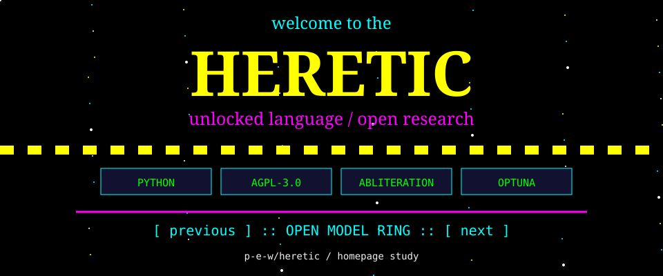

<!-- README.NFO candidate 01; original Heretic composition. -->

<p align="center"><a href="https://github.com/p-e-w/heretic"></a></p>

**Heretic** — Fully automatic censorship removal for language models. [Project](https://github.com/p-e-w/heretic) · Python · AGPL-3.0.

<details>
<summary>Text / ASCII companion</summary>

```text
WELCOME TO THE HERETIC HOMEPAGE

[ PYTHON ] [ AGPL-3.0 ] [ ABLITERATION ] [ OPTUNA ]

Fully automatic censorship removal for language models
https://github.com/p-e-w/heretic
```

</details>

> **Candidate 01** · [vap-12](../../styles/vap.md#vap-12) · A star-tiled web 1.0 homepage with a serif Heretic welcome, original research badges and a webring strip.

[Generator](src/01-vap-12.mjs) · [All 40 candidates](README.md) · [Text / ASCII](01-vap-12.txt)
