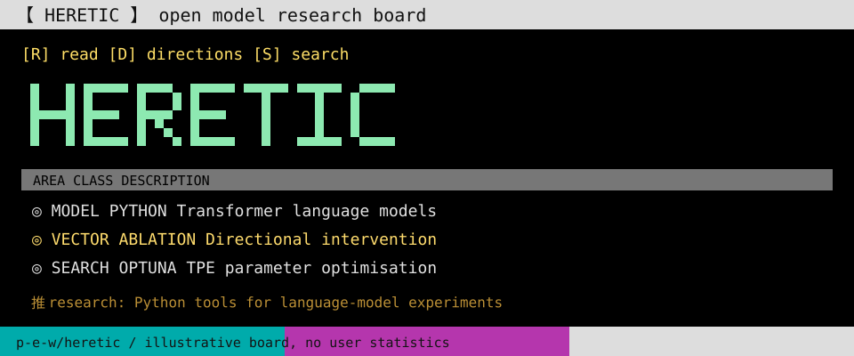

<!-- README.NFO candidate 05; original Heretic composition. -->

**Heretic** — Fully automatic censorship removal for language models. [Project](https://github.com/p-e-w/heretic) · Python · AGPL-3.0.

> **Candidate 05** · [asia-03](../../styles/asia.md#asia-03) · A telnet research board with lenticular brackets, semantic ANSI colours and Heretic component areas.

[Generator](src/05-asia-03.mjs) · [All 40 candidates](README.md)
