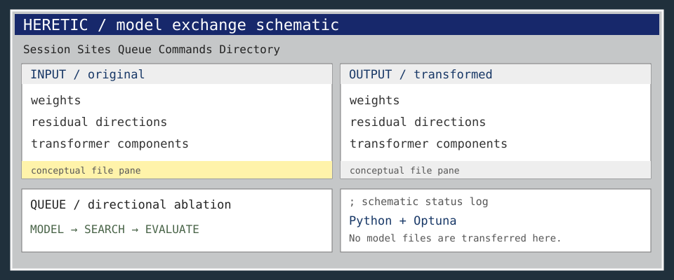

<!-- README.NFO candidate 06; original Heretic composition. -->

**Heretic** — Fully automatic censorship removal for language models. [Project](https://github.com/p-e-w/heretic) · Python · AGPL-3.0.

> **Candidate 06** · [xfer-09](../../styles/xfer.md#xfer-09) · A four-quadrant FXP-style exchange window contrasting original and transformed model concepts.

[Generator](src/06-xfer-09.mjs) · [All 40 candidates](README.md)
