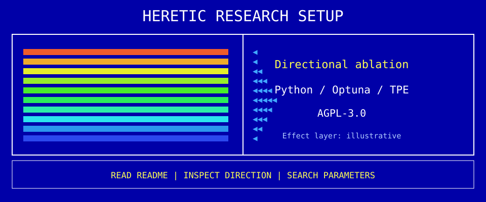

<!-- README.NFO candidate 21; original Heretic composition. -->

**Heretic** — Fully automatic censorship removal for language models. [Project](https://github.com/p-e-w/heretic) · Python · AGPL-3.0.

> **Candidate 21** · [pc-11](../../styles/pc.md#pc-11) · A split BIOS utility whose left panel breaks into orange-magenta rasters while research facts stay on the right.

[Generator](src/21-pc-11.mjs) · [All 40 candidates](README.md)
