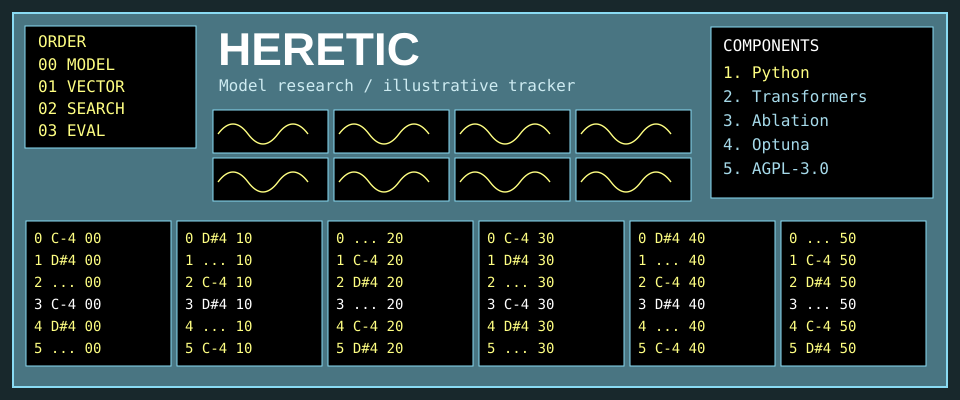

<!-- README.NFO candidate 22; original Heretic composition. -->

**Heretic** — Fully automatic censorship removal for language models. [Project](https://github.com/p-e-w/heretic) · Python · AGPL-3.0.

> **Candidate 22** · [trk-03](../../styles/trk.md#trk-03) · A dense teal FastTracker-like research workstation with scope cells, component list and explicitly decorative pattern notes.

[Generator](src/22-trk-03.mjs) · [All 40 candidates](README.md)
