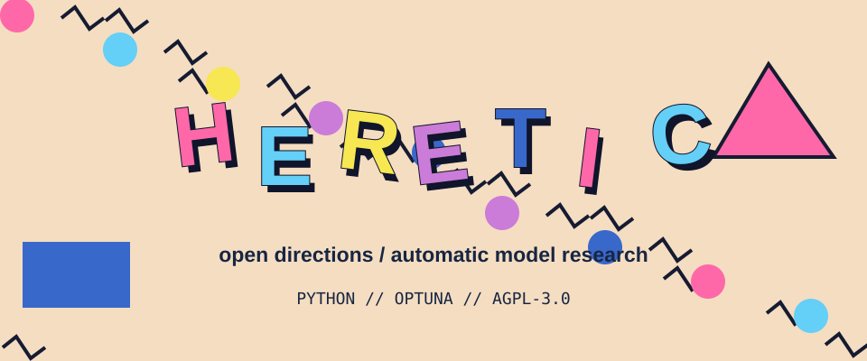

<!-- README.NFO candidate 24; original Heretic composition. -->

**Heretic** — Fully automatic censorship removal for language models. [Project](https://github.com/p-e-w/heretic) · Python · AGPL-3.0.

> **Candidate 24** · [vap-17](../../styles/vap.md#vap-17) · A playful Memphis laminate with independently tilted Heretic letters, hard shadows and scattered research confetti.

[Generator](src/24-vap-17.mjs) · [All 40 candidates](README.md)
