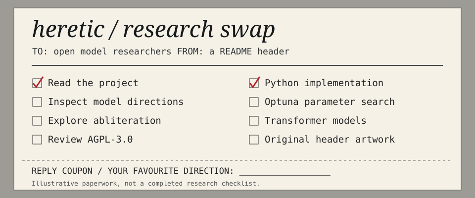

<!-- README.NFO candidate 29; original Heretic composition. -->

**Heretic** — Fully automatic censorship removal for language models. [Project](https://github.com/p-e-w/heretic) · Python · AGPL-3.0.

> **Candidate 29** · [print-05](../../styles/print.md#print-05) · A photocopied swap letter with red pen ticks, a research checklist and a tear-off direction coupon.

[Generator](src/29-print-05.mjs) · [All 40 candidates](README.md)
