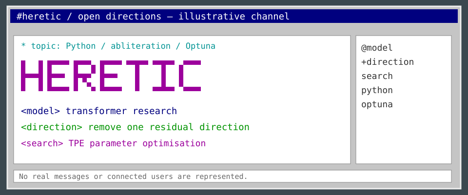

<!-- README.NFO candidate 30; original Heretic composition. -->

**Heretic** — Fully automatic censorship removal for language models. [Project](https://github.com/p-e-w/heretic) · Python · AGPL-3.0.

> **Candidate 30** · [hack-11](../../styles/hack.md#hack-11) · A colour-coded IRC channel with an original Heretic art paste and fictional component nicks in a separate member pane.

[Generator](src/30-hack-11.mjs) · [All 40 candidates](README.md)
