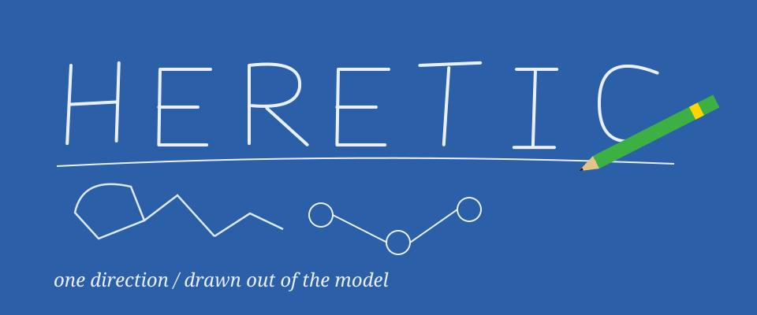

<!-- README.NFO candidate 39; original Heretic composition. -->

**Heretic** — Fully automatic censorship removal for language models. [Project](https://github.com/p-e-w/heretic) · Python · AGPL-3.0.

> **Candidate 39** · [pc-09](../../styles/pc.md#pc-09) · A blue-paper pencil sketch with seven original single-stroke letters, an open model graph and the pencil touching the newest line.

[Generator](src/39-pc-09.mjs) · [All 40 candidates](README.md)
