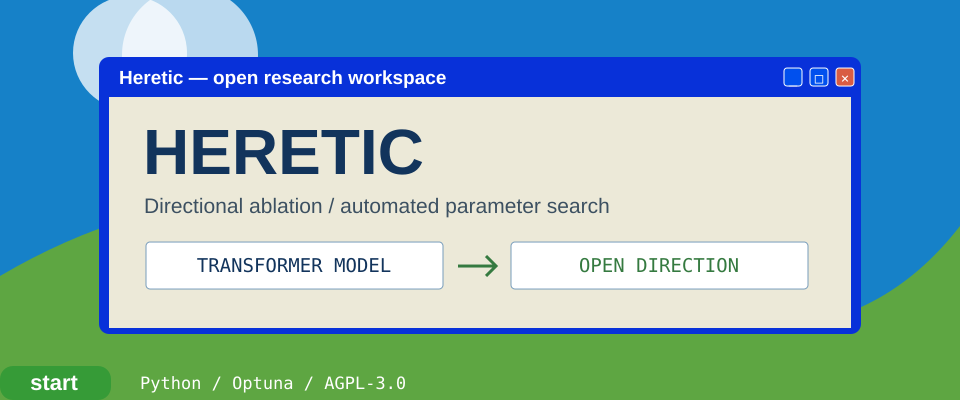

<!-- README.NFO candidate 40; original Heretic composition. -->

**Heretic** — Fully automatic censorship removal for language models. [Project](https://github.com/p-e-w/heretic) · Python · AGPL-3.0.

> **Candidate 40** · [vap-09](../../styles/vap.md#vap-09) · A glossy Luna workspace over an original green hill, with a model-to-open-direction diagram and readable research controls.

[Generator](src/40-vap-09.mjs) · [All 40 candidates](README.md)
