# Heretic — 40 random samples

Forty original compositions for [p-e-w/heretic](https://github.com/p-e-w/heretic), using a fixed random draw from 153 distinct catalogue briefs. These are individually authored examples, not recoloured CLI templates. [Saved draw](draw.json) · [Verified project facts](project.json) · [Interactive gallery](gallery.html) · [Visual QA](qa.json).

[01–10](page-1.md) · [11–20](page-2.md) · [21–30](page-3.md) · [31–40](page-4.md). Filter by Text / ASCII or SVG and save favourite numbers in the gallery. Copy each numbered Markdown header and its assets; paths are relative to that header. The included [MIT notice](LICENSE.README-NFO.txt) covers this artwork; Heretic itself is AGPL-3.0.

Rebuild every sample with <code>node examples/heretic/src/build.mjs</code>; rebuild only the index with <code>node examples/heretic/src/build-gallery.mjs</code>. Each candidate has its own generator and recorded artistic choices under <code>src/</code>. Small artwork detail is decorative at mobile widths; the project pitch is also real Markdown.

| # | Sample | Format | Preview |
| --- | --- | --- | --- |
| 01 | [Geocities homepage / web 1.0](01-vap-12.md) | SVG + TEXT |  |
| 02 | [Minter light synth (Psychedelia): mirrored trails of expanding pattern seeds](02-idle-02.md) | SVG | <a href="02-idle-02.md">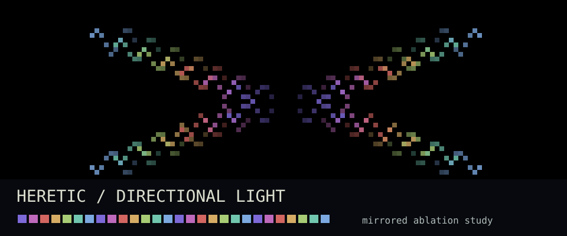</a> |
| 03 | [PC NFO: shaded block logo with fades and debris (SAC school)](03-nfo-02.md) | SVG | <a href="03-nfo-02.md">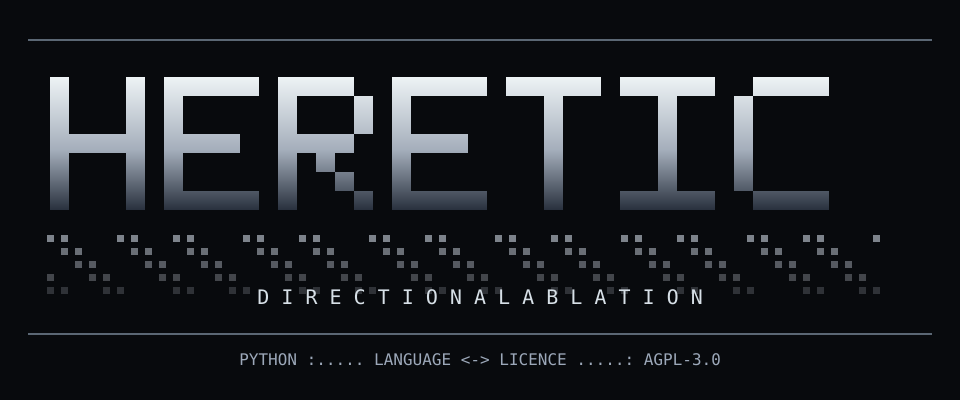</a> |
| 04 | [Usenet line art and the signed picture (jgs school)](04-nfo-10.md) | TEXT | [Copyable text](04-nfo-10.txt) |
| 05 | [PTT telnet board: board list, push/boo comment column and double-width Big5 block art](05-asia-03.md) | SVG |  |
| 06 | [FXP client: two site panes, a queue and a raw log](06-xfer-09.md) | SVG |  |
| 07 | [C64 disk directory art (dir art)](07-c64-04.md) | TEXT | [Copyable text](07-c64-04.txt) |
| 08 | [Signalwave: the Weather Channel local-forecast screen](08-vap-04.md) | SVG | <a href="08-vap-04.md">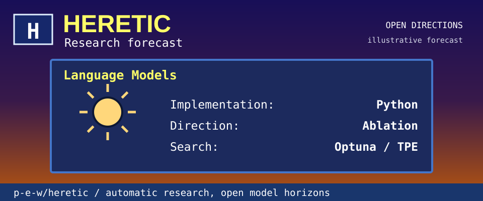</a> |
| 09 | [Neon cube field: the rez-era Razor look](09-pc-12.md) | SVG | <a href="09-pc-12.md">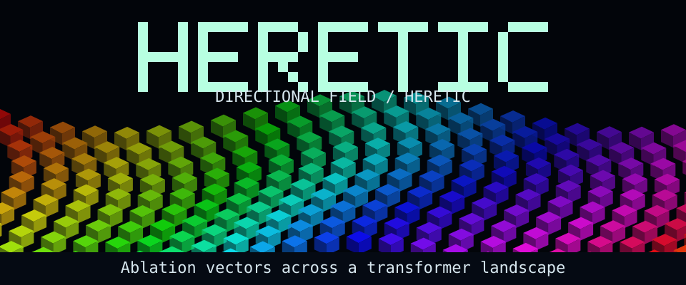</a> |
| 10 | [Magazine type-in listing: BASIC, DATA blocks and a checksum column](10-print-03.md) | TEXT | [Copyable text](10-print-03.txt) |
| 11 | [Classic Mac OS: 1-bit System 6/7 desktop](11-vap-11.md) | SVG |  |
| 12 | [Game Boy DMG boot: logo drop on a four-shade green LCD](12-mach-07.md) | SVG |  |
| 13 | [ZX Spectrum / Pentagon demo screen: effects in the attribute grid](13-demo-08.md) | SVG |  |
| 14 | [3D Maze: brick corridor walk with overlay map](14-idle-07.md) | SVG |  |
| 15 | [Amstrad CPC demo screen: Mode 0 fat pixels, three-level RGB, full overscan](15-demo-10.md) | SVG |  |
| 16 | [8-bit console title screen (NES / Famicom era)](16-mach-09.md) | SVG + TEXT |  |
| 17 | [ANSImation: the modem-speed draw-in](17-ansi-04.md) | SVG + TEXT |  |
| 18 | [DOS virus payload screen (falling letters, crawling sprite)](18-hack-10.md) | SVG |  |
| 19 | [SNES Mode 7: rotating textured ground plane](19-mach-15.md) | SVG |  |
| 20 | [Poster NFO: full-canvas shaded illustration with the text set inside it](20-nfo-03.md) | SVG |  |
| 21 | [BIOS setup hijack: the firmware screen that starts misbehaving](21-pc-11.md) | SVG |  |
| 22 | [FastTracker II (dense DOS GUI tracker with scope grid)](22-trk-03.md) | SVG |  |
| 23 | [CTF challenge board and scoreboard (category tiles, top-ten score graph, rank table)](23-hack-18.md) | SVG | <a href="23-hack-18.md">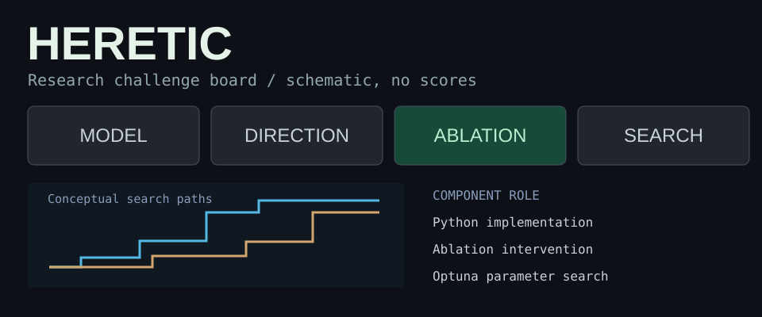</a> |
| 24 | [Memphis: squiggles, confetti and laminate](24-vap-17.md) | SVG |  |
| 25 | [Standards plain text: RFC first page and Unix man page](25-hack-03.md) | TEXT | [Copyable text](25-hack-03.txt) |
| 26 | [Atari 8-bit demo screen: 16-shade GTIA ramps recoloured by display-list interrupts](26-demo-09.md) | SVG | <a href="26-demo-09.md">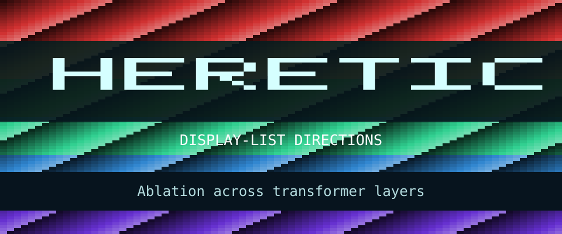</a> |
| 27 | [Japanese 8/16-bit BASIC power-on: memory count, file-buffer question, function-key bar (PC-88/98), and the MSX blue screen](27-asia-06.md) | TEXT | [Copyable text](27-asia-06.txt) |
| 28 | [Bobs and dot objects: a sphere chain on a Lissajous path, a rotating dot cube](28-c64-08.md) | SVG | <a href="28-c64-08.md">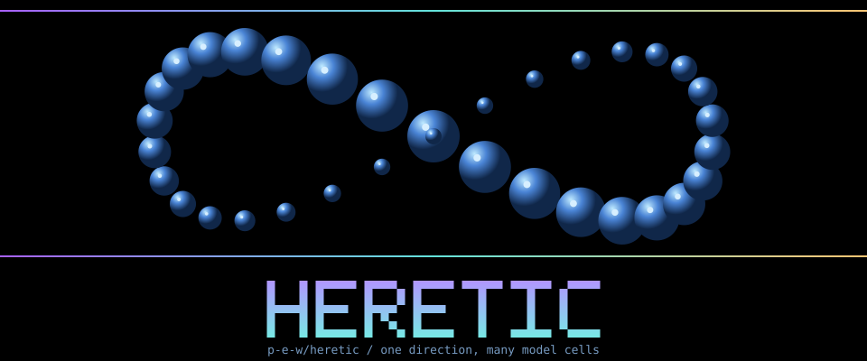</a> |
| 29 | [Scene paperwork: tick-box swap letter, party pre-invitation with reply coupon, hand-drawn votesheet](29-print-05.md) | SVG |  |
| 30 | [mIRC channel window with colour-code block art and netsplit](30-hack-11.md) | SVG |  |
| 31 | [PC demo READ.ME: paged info file with index, member table and cut-here form](31-demo-02.md) | TEXT | [Copyable text](31-demo-02.txt) |
| 32 | [VFD and segment-display front panel (hi-fi, VCR, calculator)](32-mach-12.md) | SVG | <a href="32-mach-12.md">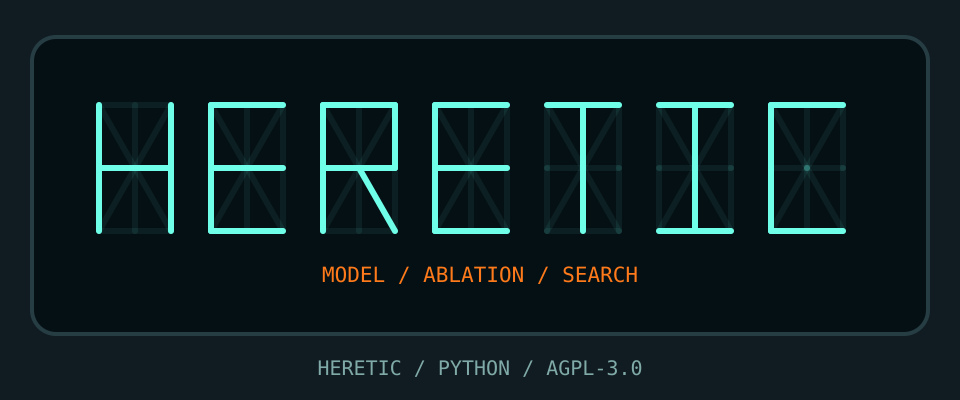</a> |
| 33 | [Chip-music jukebox: track list with times, embossed panel, 'hit a key' legend](33-c64-14.md) | SVG | <a href="33-c64-14.md">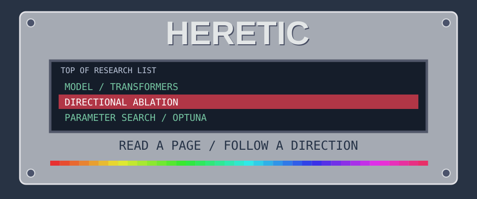</a> |
| 34 | [MML listing: the project name as a tune in plain text](34-asia-05.md) | TEXT | [Copyable text](34-asia-05.txt) |
| 35 | [Decrypt reveal: a scrambled text block that resolves into plaintext](35-hack-15.md) | SVG | <a href="35-hack-15.md">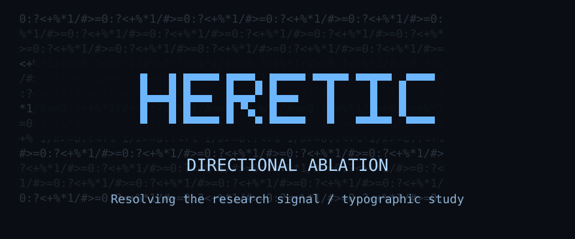</a> |
| 36 | [7-bit outline NFO with dot-leader fields](36-nfo-04.md) | TEXT | [Copyable text](36-nfo-04.txt) |
| 37 | [Amiga colly era: full-width Latin-1 logos and page layout](37-nfo-07.md) | SVG + TEXT | <a href="37-nfo-07.md">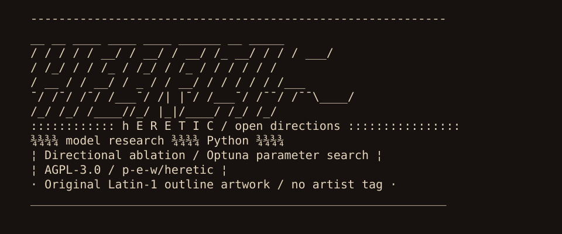</a> |
| 38 | [SFV file and check result (with an NFO viewer frame)](38-xfer-10.md) | SVG + TEXT | <a href="38-xfer-10.md">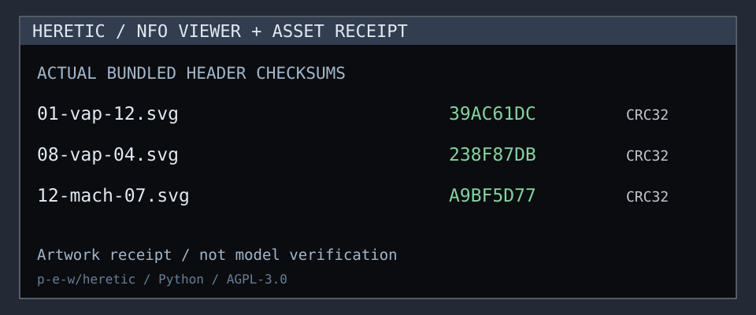</a> |
| 39 | [Pencil on paper: the cracktro that draws itself](39-pc-09.md) | SVG |  |
| 40 | [Windows XP Luna: blue title bars and the green hill](40-vap-09.md) | SVG |  |

[Other examples](../README.md) · [Style catalogue](../../styles/INDEX.md)
