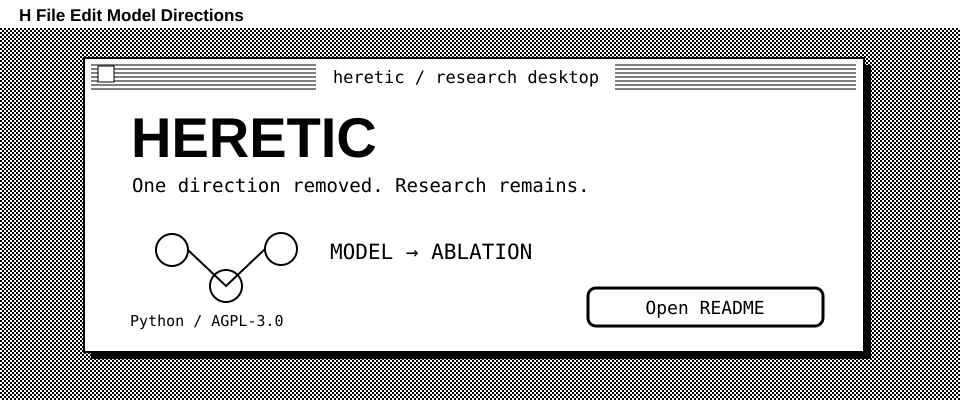
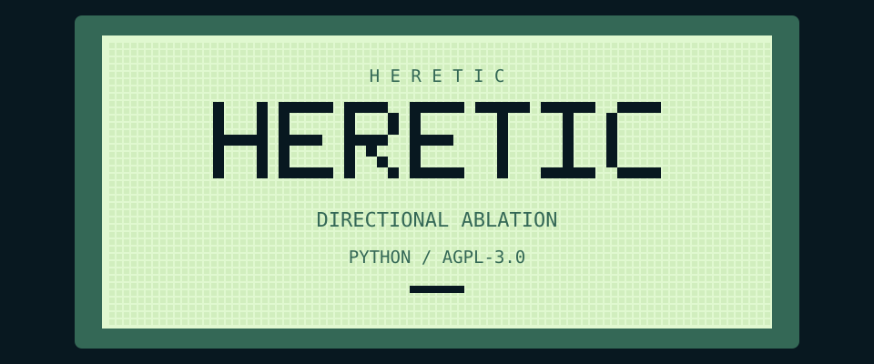
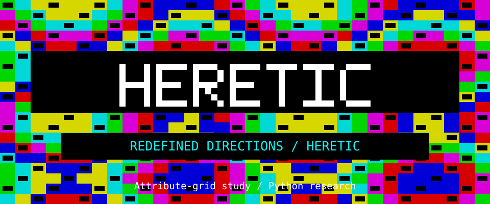
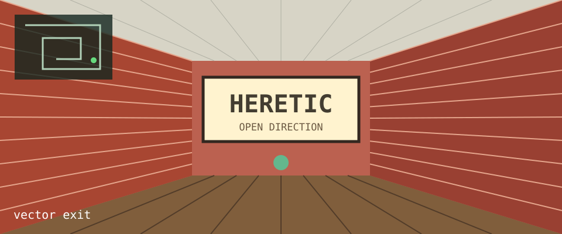
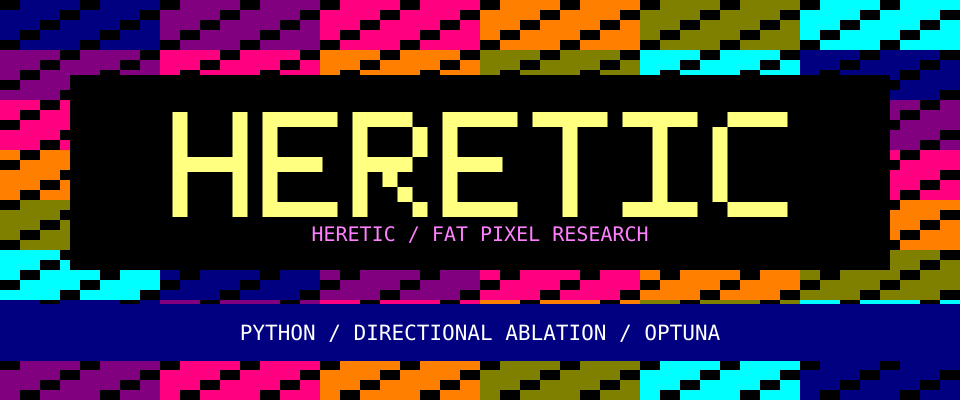
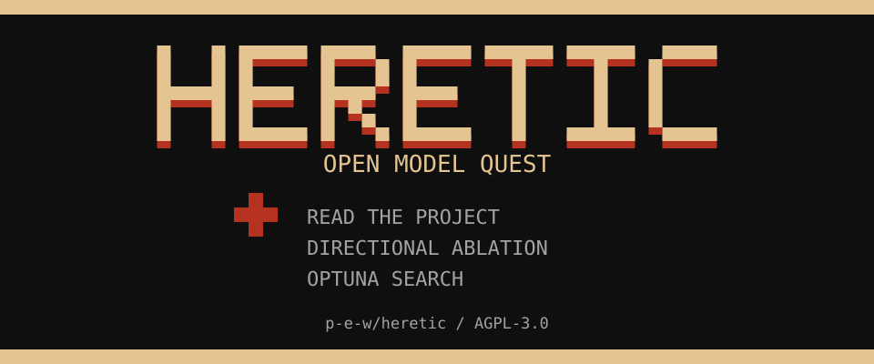
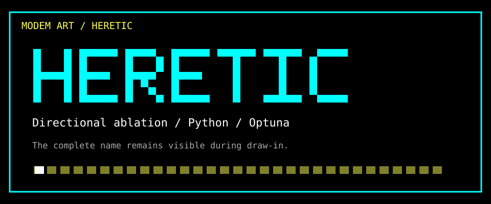
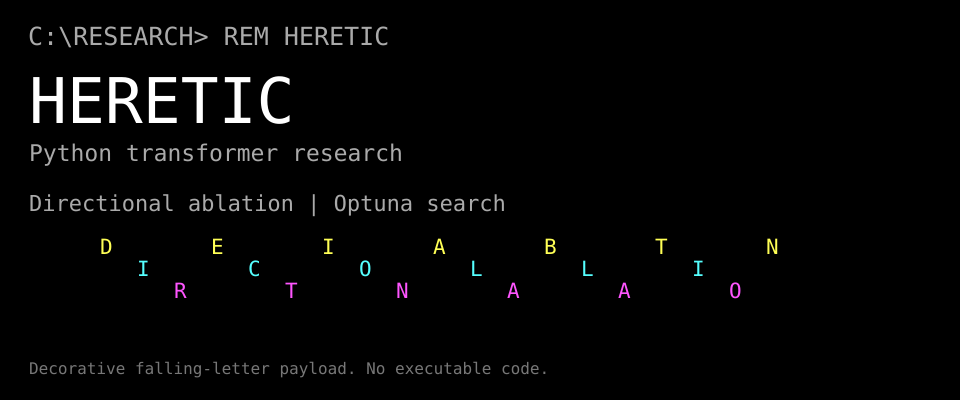
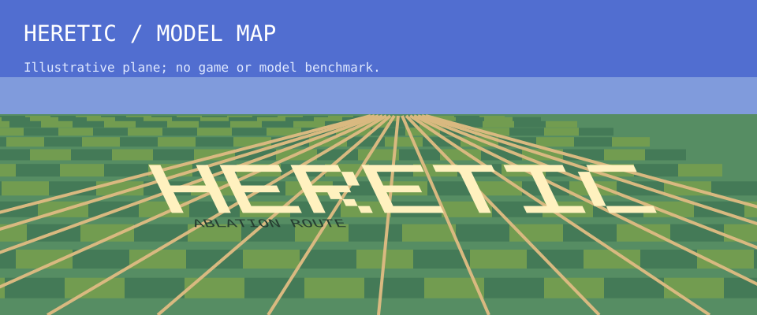
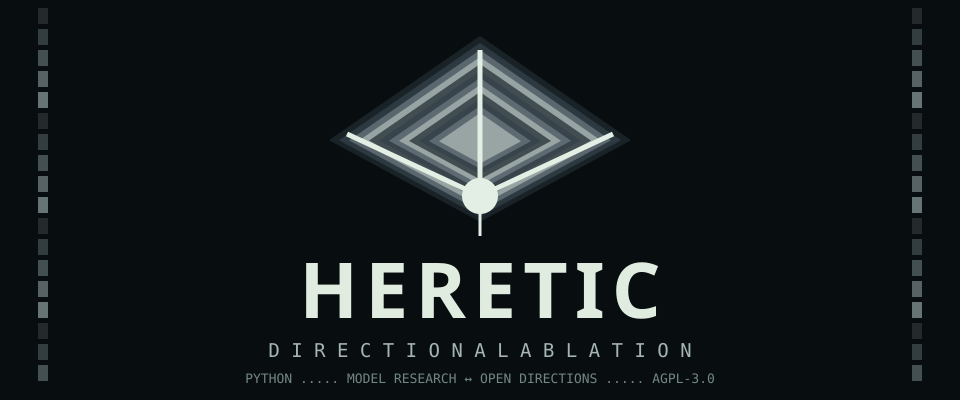

# Heretic samples 11–20

[All 40](README.md) · [Gallery](gallery.html) · [← Previous](page-1.md) · [Next →](page-3.md)

## 11 · Classic Mac OS: 1-bit System 6/7 desktop

[vap-11](../../styles/vap.md#vap-11) · [Generator](src/11-vap-11.mjs) · [Copy this header](11-vap-11.md)

<p align="center"><a href="https://github.com/p-e-w/heretic"></a></p>

**Heretic** — Fully automatic censorship removal for language models. [Project](https://github.com/p-e-w/heretic) · Python · AGPL-3.0.

---

## 12 · Game Boy DMG boot: logo drop on a four-shade green LCD

[mach-07](../../styles/mach.md#mach-07) · [Generator](src/12-mach-07.mjs) · [Copy this header](12-mach-07.md)

<p align="center"><a href="https://github.com/p-e-w/heretic"></a></p>

**Heretic** — Fully automatic censorship removal for language models. [Project](https://github.com/p-e-w/heretic) · Python · AGPL-3.0.

---

## 13 · ZX Spectrum / Pentagon demo screen: effects in the attribute grid

[demo-08](../../styles/demo.md#demo-08) · [Generator](src/13-demo-08.mjs) · [Copy this header](13-demo-08.md)

<p align="center"><a href="https://github.com/p-e-w/heretic"></a></p>

**Heretic** — Fully automatic censorship removal for language models. [Project](https://github.com/p-e-w/heretic) · Python · AGPL-3.0.

---

## 14 · 3D Maze: brick corridor walk with overlay map

[idle-07](../../styles/idle.md#idle-07) · [Generator](src/14-idle-07.mjs) · [Copy this header](14-idle-07.md)

<p align="center"><a href="https://github.com/p-e-w/heretic"></a></p>

**Heretic** — Fully automatic censorship removal for language models. [Project](https://github.com/p-e-w/heretic) · Python · AGPL-3.0.

---

## 15 · Amstrad CPC demo screen: Mode 0 fat pixels, three-level RGB, full overscan

[demo-10](../../styles/demo.md#demo-10) · [Generator](src/15-demo-10.mjs) · [Copy this header](15-demo-10.md)

<p align="center"><a href="https://github.com/p-e-w/heretic"></a></p>

**Heretic** — Fully automatic censorship removal for language models. [Project](https://github.com/p-e-w/heretic) · Python · AGPL-3.0.

---

## 16 · 8-bit console title screen (NES / Famicom era)

[mach-09](../../styles/mach.md#mach-09) · [Generator](src/16-mach-09.mjs) · [Copy this header](16-mach-09.md)

<p align="center"><a href="https://github.com/p-e-w/heretic"></a></p>

**Heretic** — Fully automatic censorship removal for language models. [Project](https://github.com/p-e-w/heretic) · Python · AGPL-3.0.

<details>
<summary>Text / ASCII companion</summary>

```text
HERETIC / OPEN MODEL QUEST

> READ THE PROJECT
  DIRECTIONAL ABLATION
  OPTUNA SEARCH

Four-colour title-card study; not a hardware palette measurement.
```

</details>

---

## 17 · ANSImation: the modem-speed draw-in

[ansi-04](../../styles/ansi.md#ansi-04) · [Generator](src/17-ansi-04.mjs) · [Copy this header](17-ansi-04.md)

<p align="center"><a href="https://github.com/p-e-w/heretic"></a></p>

**Heretic** — Fully automatic censorship removal for language models. [Project](https://github.com/p-e-w/heretic) · Python · AGPL-3.0.

<details>
<summary>Text / ASCII companion</summary>

```text
#   # ##### ####  ##### ##### #####  ####
#   # #     #   # #       #     #   #    
#   # #     #   # #       #     #   #    
##### ####  ####  ####    #     #   #    
#   # #     # #   #       #     #   #    
#   # #     #  #  #       #     #   #    
#   # ##### #   # #####   #   #####  ####

DIRECTIONAL ABLATION / PYTHON / OPTUNA
https://github.com/p-e-w/heretic
```

</details>

---

## 18 · DOS virus payload screen (falling letters, crawling sprite)

[hack-10](../../styles/hack.md#hack-10) · [Generator](src/18-hack-10.mjs) · [Copy this header](18-hack-10.md)

<p align="center"><a href="https://github.com/p-e-w/heretic"></a></p>

**Heretic** — Fully automatic censorship removal for language models. [Project](https://github.com/p-e-w/heretic) · Python · AGPL-3.0.

---

## 19 · SNES Mode 7: rotating textured ground plane

[mach-15](../../styles/mach.md#mach-15) · [Generator](src/19-mach-15.mjs) · [Copy this header](19-mach-15.md)

<p align="center"><a href="https://github.com/p-e-w/heretic"></a></p>

**Heretic** — Fully automatic censorship removal for language models. [Project](https://github.com/p-e-w/heretic) · Python · AGPL-3.0.

---

## 20 · Poster NFO: full-canvas shaded illustration with the text set inside it

[nfo-03](../../styles/nfo.md#nfo-03) · [Generator](src/20-nfo-03.mjs) · [Copy this header](20-nfo-03.md)

<p align="center"><a href="https://github.com/p-e-w/heretic"></a></p>

**Heretic** — Fully automatic censorship removal for language models. [Project](https://github.com/p-e-w/heretic) · Python · AGPL-3.0.

[All 40](README.md) · [Gallery](gallery.html) · [← Previous](page-1.md) · [Next →](page-3.md)
