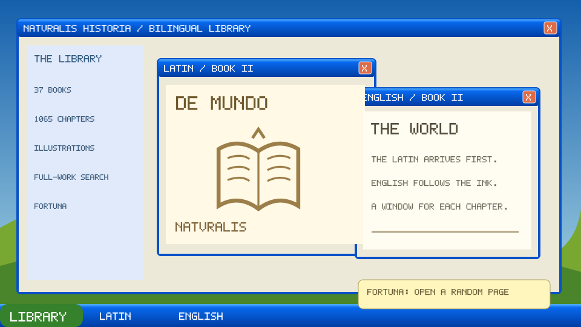

<!-- 05-luna-desktop: vap-09. Generated by src/05-luna-desktop.mjs; edit tools/pliny-headers/projects.json or render.mjs. -->

  

<h1 align="center">NATVRALIS HISTORIA</h1>

<strong>The first encyclopedia, illustrated.</strong>

<code>37 BOOKS</code> · <code>1065 CHAPTERS</code> · <code>LATIN + ENGLISH</code>

<a href="https://naturalishistoria.org/">Open the project</a> · <a href="https://github.com/elder-plinius/NATURALIS-HISTORIA">Source repository</a>

<!-- Unofficial README design study. Source descriptions checked 2026-10-05. Animation depicts an illustrative screen, not live project activity. -->
