# NATURALIS-HISTORIA — five scene studies

The first encyclopedia, illustrated.

[Source repository](https://github.com/elder-plinius/NATURALIS-HISTORIA) · [Live project](https://naturalishistoria.org/) · [Compare all three repos](../../comparisons/pliny-first-draw/index.html) · [Shared draw](../pliny.md)

The same five catalogue styles were drawn once for NATURALIS-HISTORIA, GL4SS and ST3GG. Each project gets its own composition, scene and motion. These are unofficial header studies; source descriptions were checked on 2026-10-05.

Each numbered Markdown file is a ready-to-copy header. Keep its matching SVG in an `assets/` folder. SVGs embed their artwork and Latin pixel lettering, scale to the available width, and support reduced motion. Terminal comments and file names are illustrative.

To rebuild this set from the repository root:

```sh
node tools/pliny-headers/build.mjs
```

To rebuild one header, run its matching `src/NN-name.mjs`. Project text lives in `tools/pliny-headers/projects.json`; the independent scene renderers live in `tools/pliny-headers/render.mjs`.

| # | Header | Catalogue reference |
| --- | --- | --- |
| 01 | [Off-air test card](01-off-air.md) | [idle-10](../../styles/idle.md#idle-10) |
| 02 | [Taiwanese BBS board](02-telnet-board.md) | [asia-03](../../styles/asia.md#asia-03) |
| 03 | [PC demo opening titles](03-demo-titles.md) | [demo-01](../../styles/demo.md#demo-01) |
| 04 | [Monochrome viewdata](04-viewdata.md) | [ansi-09](../../styles/ansi.md#ansi-09) |
| 05 | [Luna desktop](05-luna-desktop.md) | [vap-09](../../styles/vap.md#vap-09) |

## 01 · Off-air test card · idle-10

An archive calibration plate: thirty-seven book marks circle a folio; the station ident wanders across the grid.

[Copy the Markdown](01-off-air.md) · [SVG](assets/01-off-air.svg) · [Generator](src/01-off-air.mjs)

<!-- 01-off-air: idle-10. Generated by src/01-off-air.mjs; edit tools/pliny-headers/projects.json or render.mjs. -->

<p align="center">
  
</p>

<h1 align="center">NATVRALIS HISTORIA</h1>

<p align="center"><strong>The first encyclopedia, illustrated.</strong></p>

<p align="center"><code>37 BOOKS</code> · <code>1065 CHAPTERS</code> · <code>LATIN + ENGLISH</code></p>

<p align="center"><a href="https://naturalishistoria.org/">Open the project</a> · <a href="https://github.com/elder-plinius/NATURALIS-HISTORIA">Source repository</a></p>

<!-- Unofficial README design study. Source descriptions checked 2026-10-05. Animation depicts an illustrative screen, not live project activity. -->

---

## 02 · Taiwanese BBS board · asia-03

An encyclopedia board directory: books, chapters and plates sit above a small reader discussion.

[Copy the Markdown](02-telnet-board.md) · [SVG](assets/02-telnet-board.svg) · [Generator](src/02-telnet-board.mjs)

<!-- 02-telnet-board: asia-03. Generated by src/02-telnet-board.mjs; edit tools/pliny-headers/projects.json or render.mjs. -->

<p align="center">
  
</p>

<h1 align="center">NATVRALIS HISTORIA</h1>

<p align="center"><strong>The first encyclopedia, illustrated.</strong></p>

<p align="center"><code>37 BOOKS</code> · <code>1065 CHAPTERS</code> · <code>LATIN + ENGLISH</code></p>

<p align="center"><a href="https://naturalishistoria.org/">Open the project</a> · <a href="https://github.com/elder-plinius/NATURALIS-HISTORIA">Source repository</a></p>

<details>
<summary>Plain-text board list</summary>

```text
NATVRALIS HISTORIA
BOOKS      TEXT   The complete thirty-seven books [37]
CHAPTERS   READ   Latin with English translation [1065]
PLATES     ART    One illustration per chapter [1065]

+ Latin first. English beside it.
+ Every chapter has its own plate.
+ Let Fortuna choose the next page.
```

These comments and file names are illustrative.

</details>

<!-- Unofficial README design study. Source descriptions checked 2026-10-05. Animation depicts an illustrative screen, not live project activity. -->

---

## 03 · PC demo opening titles · demo-01

A classical horizon becomes a VGA opening sequence, with the two-line title above Vesuvius and a drifting boat.

[Copy the Markdown](03-demo-titles.md) · [SVG](assets/03-demo-titles.svg) · [Generator](src/03-demo-titles.mjs)

<!-- 03-demo-titles: demo-01. Generated by src/03-demo-titles.mjs; edit tools/pliny-headers/projects.json or render.mjs. -->

<p align="center">
  
</p>

<h1 align="center">NATVRALIS HISTORIA</h1>

<p align="center"><strong>The first encyclopedia, illustrated.</strong></p>

<p align="center"><code>37 BOOKS</code> · <code>1065 CHAPTERS</code> · <code>LATIN + ENGLISH</code></p>

<p align="center"><a href="https://naturalishistoria.org/">Open the project</a> · <a href="https://github.com/elder-plinius/NATURALIS-HISTORIA">Source repository</a></p>

<!-- Unofficial README design study. Source descriptions checked 2026-10-05. Animation depicts an illustrative screen, not live project activity. -->

---

## 04 · Monochrome viewdata · ansi-09

A dial-in reading service: four numbered routes into the encyclopedia, with a book made from terminal cells.

[Copy the Markdown](04-viewdata.md) · [SVG](assets/04-viewdata.svg) · [Generator](src/04-viewdata.mjs)

<!-- 04-viewdata: ansi-09. Generated by src/04-viewdata.mjs; edit tools/pliny-headers/projects.json or render.mjs. -->

<p align="center">
  
</p>

<h1 align="center">NATVRALIS HISTORIA</h1>

<p align="center"><strong>The first encyclopedia, illustrated.</strong></p>

<p align="center"><code>37 BOOKS</code> · <code>1065 CHAPTERS</code> · <code>LATIN + ENGLISH</code></p>

<p align="center"><a href="https://naturalishistoria.org/">Open the project</a> · <a href="https://github.com/elder-plinius/NATURALIS-HISTORIA">Source repository</a></p>

<!-- Unofficial README design study. Source descriptions checked 2026-10-05. Animation depicts an illustrative screen, not live project activity. -->

---

## 05 · Luna desktop · vap-09

A bilingual reading desk: the library tree opens overlapping Latin and English windows, while Fortuna offers a page.

[Copy the Markdown](05-luna-desktop.md) · [SVG](assets/05-luna-desktop.svg) · [Generator](src/05-luna-desktop.mjs)

<!-- 05-luna-desktop: vap-09. Generated by src/05-luna-desktop.mjs; edit tools/pliny-headers/projects.json or render.mjs. -->

<p align="center">
  
</p>

<h1 align="center">NATVRALIS HISTORIA</h1>

<p align="center"><strong>The first encyclopedia, illustrated.</strong></p>

<p align="center"><code>37 BOOKS</code> · <code>1065 CHAPTERS</code> · <code>LATIN + ENGLISH</code></p>

<p align="center"><a href="https://naturalishistoria.org/">Open the project</a> · <a href="https://github.com/elder-plinius/NATURALIS-HISTORIA">Source repository</a></p>

<!-- Unofficial README design study. Source descriptions checked 2026-10-05. Animation depicts an illustrative screen, not live project activity. -->

---

