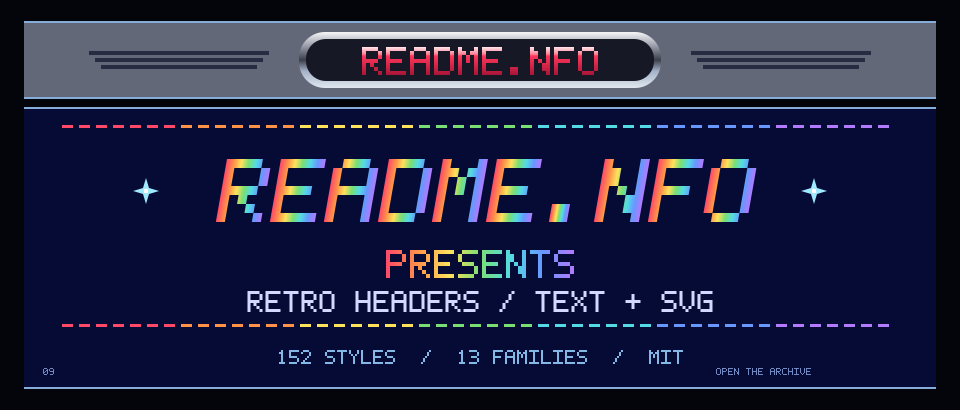

<!-- README.NFO candidate 09; generated by src/09-c64-05.mjs. -->

<p align="center"></p>

```text
+--------------------------------------------------------------+
|                          README.NFO                          |
|                  RETRO HEADERS / TEXT + SVG                  |
+--------------------------------------------------------------+
|  BUILT FROM    152 researched styles                         |
|  ORGANIZED IN  13 visual families                            |
|  SUPPLIED AS   Markdown + editable SVG                       |
|  RELEASED AS   MIT / copy, customise, share                  |
+--------------------------------------------------------------+
```

[Style catalogue](../../styles/INDEX.md) · [Example galleries](../README.md) · [MIT licence](../../LICENSE)

> **Candidate 09** · [c64-05](../../styles/c64.md#c64-05) · A red logo plate, deep-blue panel and gently waving rainbow copper title.

[Generator](src/09-c64-05.mjs) · [All 20 candidates](README.md)
