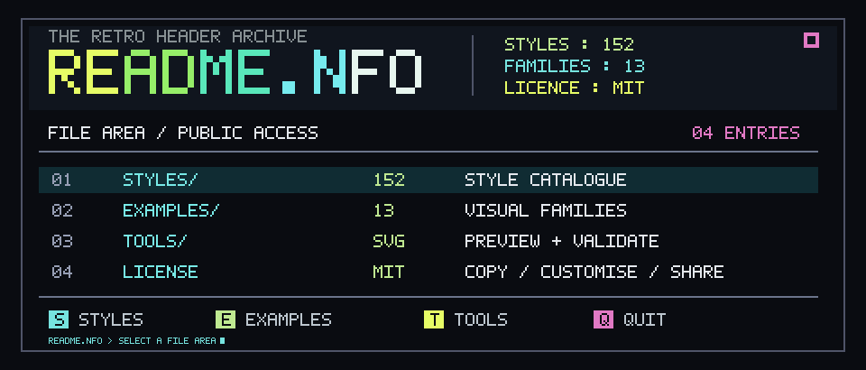

<!-- README.NFO candidate 10; generated by src/10-ansi-05.mjs. -->

<p align="center"></p>

```text
+--------------------------------------------------------------------+
| README.NFO       STYLES: 152   FAMILIES: 13   LICENCE: MIT         |
+----+-------------+-------+-----------------------------------------+
| 01 | STYLES/     | 152   | Researched retro style catalogue        |
| 02 | EXAMPLES/   | 13    | Text and SVG visual families            |
| 03 | TOOLS/      | SVG   | Local previews and validation           |
| 04 | LICENSE     | MIT   | Copy, customise and share               |
+----+-------------+-------+-----------------------------------------+
| [S] styles   [E] examples   [T] tools                              |
+--------------------------------------------------------------------+
```

[S: Styles](../../styles/INDEX.md) · [E: Examples](../README.md) · [T: Tools](../../tools/preview.mjs) · [MIT licence](../../LICENSE)

> **Candidate 10** · [ansi-05](../../styles/ansi.md#ansi-05) · BBS data screen with a stats masthead, directory table and inverse-video hotkeys.

[Generator](src/10-ansi-05.mjs) · [All 20 candidates](README.md)
