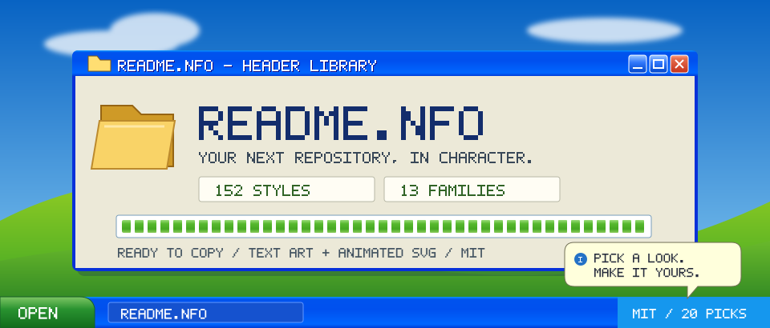

<!-- README.NFO candidate 12; generated by src/12-vap-09.mjs. -->

  

<b>README.NFO</b> — retro headers for your next repository. 
152 styles, thirteen families, text art and animated SVG. Pick a look. Make it yours.

<a href="../../styles/INDEX.md">Style catalogue</a> · <a href="../README.md">Example galleries</a> · <a href="../../LICENSE">MIT licence</a>

> **Candidate 12** · [vap-09](../../styles/vap.md#vap-09) · An original hill-and-sky desktop, glossy blue window chrome and a cream header-library dialog.

[Generator](src/12-vap-09.mjs) · [All 20 candidates](README.md)
