<!-- README.NFO candidate 33; generated by src/33-c64-08.mjs. -->

  

<b>README.NFO</b> — retro headers for your next repository. 
152 styles, thirteen families, text art and animated SVG. Pick a look. Make it yours.

<a href="../../styles/INDEX.md">Style catalogue</a> · <a href="../README.md">Example galleries</a> · <a href="../../LICENSE">MIT licence</a>

> **Candidate 33** · [c64-08](../../styles/c64.md#c64-08) · A blue sphere chain follows a figure-eight beside a rotating dot lattice, framed by rainbow hairlines.

[Generator](src/33-c64-08.mjs) · [All candidates](README.md)
