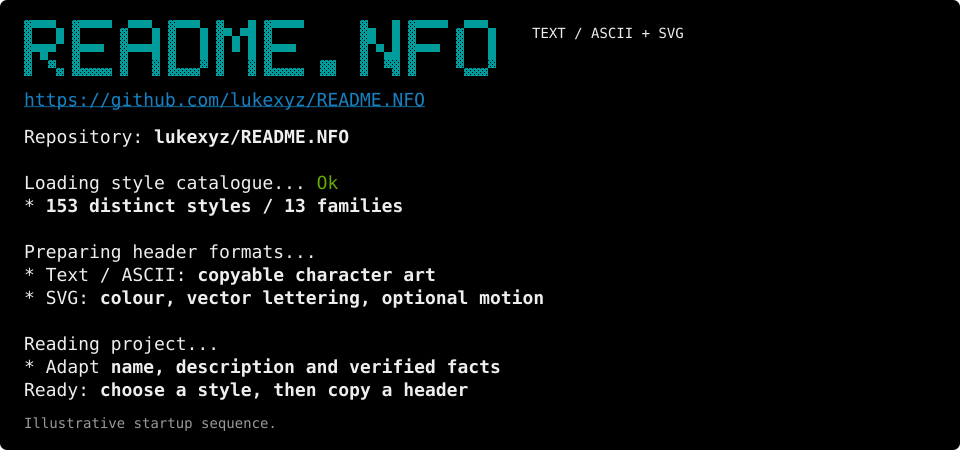

<!-- README.NFO candidate 41: additional screenshot-inspired reference, outside draw.json and draw-2.json. -->

> **Candidate 41** · [hack-19](../../styles/hack.md#hack-19) · A teal block-letter CLI banner with a compact illustrative diagnostic log. SVG with a copyable text / ASCII fallback.

[Generator](src/41-hack-19.mjs) · [All candidates](README.md) · [Sampler prompt](41-hack-19.prompt.txt) · [Text / ASCII](41-hack-19.txt)



<details>
<summary>Copyable text / ASCII fallback</summary>

```text
####  #####  ###  ####  #   # #####       #   # #####  ### 
#   # #     #   # #   # ## ## #           ##  # #     #   #
#   # #     #   # #   # # # # #           ##  # #     #   #
####  ####  ##### #   # # # # ####        # # # ####  #   #
# #   #     #   # #   # #   # #           #  ## #     #   #
#  #  :     #   # #   : :   # #      :#   :  :# #     #   :
:   # ##:## #   : :##:  #   # #:##:  ##   #   # #      ##: 

https://github.com/lukexyz/README.NFO

Repository: lukexyz/README.NFO

Loading style catalogue... Ok
* 153 distinct styles / 13 families

Preparing header formats...
* Text / ASCII: copyable character art
* SVG: colour, vector lettering, optional motion

Reading project...
* Adapt name, description and verified facts
Ready: choose a style, then copy a header

Illustrative startup sequence.
```

</details>
