# README.NFO — 40 headers to choose from

Forty original headers for [README.NFO itself](../../README.md), drawn in two random batches from the 152 distinct catalogue styles on 5 October 2026. [Draw one](draw.json) and [draw two](draw-2.json) record the selections; the second batch excludes every style used in the first.

**Home README:** [16 — Brush-script NFO](16-nfo-01.md) is the main header. The favourites below it are [04 — Tracker](04-trk-07.md), [26 — Cassette](26-print-02.md), [36 — Off-air test card](36-idle-10.md) and [38 — Copper ribbons](38-c64-07.md), with [12 — Luna desktop](12-vap-09.md) and [25 — Vector objects](25-pc-13.md) completing the preview gallery. [See the home README](../../README.md). All forty candidates remain available to copy and compare.

**New batch:** [Candidates 21–30](page-3.md) · [Candidates 31–40](page-4.md) · [Interactive new batch](gallery.html#batch-2).

**Browse all:** [Interactive gallery and favourites](gallery.html) · [01–10](page-1.md) · [11–20](page-2.md) · [21–30](page-3.md) · [31–40](page-4.md). Tick favourites in the browser and copy their numbers. Your existing selection is retained when local storage is available.

Each numbered Markdown file contains a copyable header. SVGs live in `assets/`; generators live in `src/`. Rebuild the index and pages with `node examples/readme-nfo/src/build-gallery.mjs`. The names below identify catalogue references; the artwork and repository branding are original.

| # | Option | Preview | Style | Full page |
| --- | --- | --- | --- | --- |
| 01 | [Pinball dot-matrix display (orange plasma DMD)](01-mach-11.md) | <a href="01-mach-11.md"></a> | [mach-11](../../styles/mach.md#mach-11) | [01–10](page-1.md) |
| 02 | [MUD session transcript (login banner, room block, exits line, HP prompt)](02-hack-09.md) | **Pure text** | [hack-09](../../styles/hack.md#hack-09) | [01–10](page-1.md) |
| 03 | [Digital rain banner (light falling through fixed glyph columns, resolving into the title)](03-hack-14.md) | <a href="03-hack-14.md"></a> | [hack-14](../../styles/hack.md#hack-14) | [01–10](page-1.md) |
| 04 | [Multi-chip tracker (FamiTracker / DefleMask / Furnace)](04-trk-07.md) |  | [trk-07](../../styles/trk.md#trk-07) | [01–10](page-1.md) |
| 05 | [Piano roll and falling notes (up to black MIDI)](05-trk-10.md) | <a href="05-trk-10.md">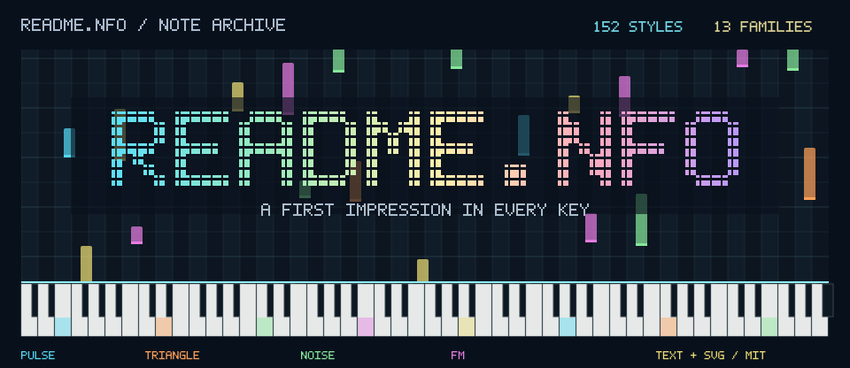</a> | [trk-10](../../styles/trk.md#trk-10) | [01–10](page-1.md) |
| 06 | [Apple II crack screen: six-colour hi-res panels and 40-column credits](06-demo-11.md) | <a href="06-demo-11.md">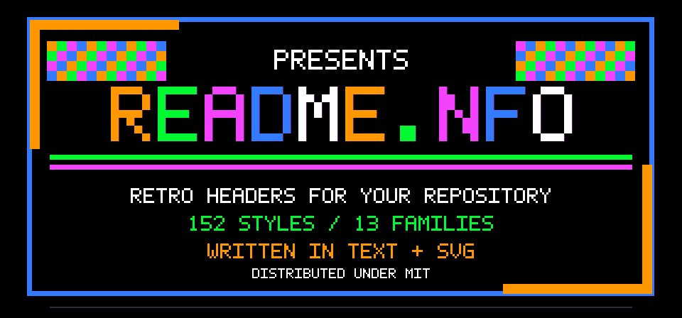</a> | [demo-11](../../styles/demo.md#demo-11) | [01–10](page-1.md) |
| 07 | [PC demo opening titles and part-credit cards (Second Reality manner)](07-demo-01.md) | <a href="07-demo-01.md">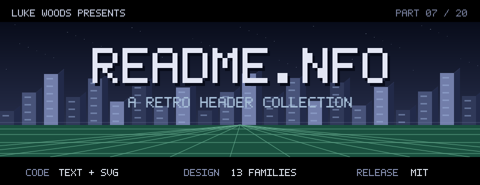</a> | [demo-01](../../styles/demo.md#demo-01) | [01–10](page-1.md) |
| 08 | [VHS tape and late-night lo-fi: OSD, tracking and chroma bleed](08-vap-03.md) | <a href="08-vap-03.md">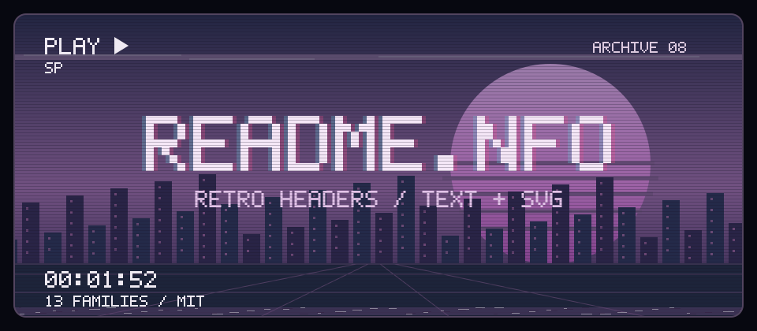</a> | [vap-03](../../styles/vap.md#vap-03) | [01–10](page-1.md) |
| 09 | [Razor 1911 Amiga cracktro (Sector9, 1990-91): logo plate, deep-blue panel, rainbow copper text](09-c64-05.md) |  | [c64-05](../../styles/c64.md#c64-05) | [01–10](page-1.md) |
| 10 | [BBS data screens: stats header, last callers, file-area table](10-ansi-05.md) |  | [ansi-05](../../styles/ansi.md#ansi-05) | [01–10](page-1.md) |
| 11 | [256-byte intro: bit-pattern textures in the default VGA palette](11-demo-04.md) | <a href="11-demo-04.md">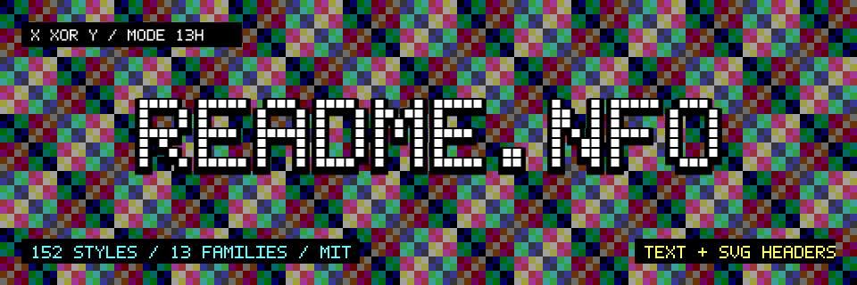</a> | [demo-04](../../styles/demo.md#demo-04) | [11–20](page-2.md) |
| 12 | [Windows XP Luna: blue title bars and the green hill](12-vap-09.md) |  | [vap-09](../../styles/vap.md#vap-09) | [11–20](page-2.md) |
| 13 | [Decrypt reveal: a scrambled text block that resolves into plaintext](13-hack-15.md) | <a href="13-hack-15.md"></a> | [hack-15](../../styles/hack.md#hack-15) | [11–20](page-2.md) |
| 14 | [Win32 new old-school cracktro: metal logo, twister, sine scroller](14-pc-05.md) | <a href="14-pc-05.md"></a> | [pc-05](../../styles/pc.md#pc-05) | [11–20](page-2.md) |
| 15 | [ANSImation: the modem-speed draw-in](15-ansi-04.md) | <a href="15-ansi-04.md"></a> | [ansi-04](../../styles/ansi.md#ansi-04) | [11–20](page-2.md) |
| 16 | [PC NFO: brush-script block logo (the Razor 1911 and Fairlight look, after JED)](16-nfo-01.md) |  | [nfo-01](../../styles/nfo.md#nfo-01) | [11–20](page-2.md) |
| 17 | [3D file-system landscape (pedestals and wires, or the glass-tower data city)](17-hack-16.md) | <a href="17-hack-16.md">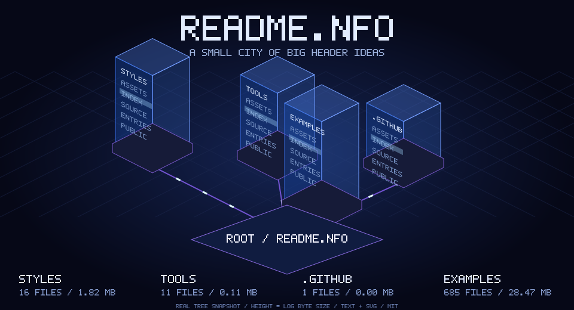</a> | [hack-16](../../styles/hack.md#hack-16) | [11–20](page-2.md) |
| 18 | [Phreak tone pad: 4x4 keypad matrix with dual-tone scope traces](18-hack-17.md) | <a href="18-hack-17.md"></a> | [hack-17](../../styles/hack.md#hack-17) | [11–20](page-2.md) |
| 19 | [Door game screen (narrated location, bracketed hotkeys, command prompt)](19-ansi-06.md) | <a href="19-ansi-06.md">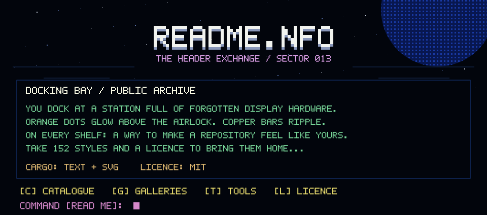</a> | [ansi-06](../../styles/ansi.md#ansi-06) | [11–20](page-2.md) |
| 20 | [MML listing: the project name as a tune in plain text](20-asia-05.md) | **Pure text** | [asia-05](../../styles/asia.md#asia-05) | [11–20](page-2.md) |
| 21 | [mIRC channel window with colour-code block art and netsplit](21-hack-11.md) | <a href="21-hack-11.md"></a> | [hack-11](../../styles/hack.md#hack-11) | [21–30](page-3.md) |
| 22 | [Magazine type-in listing: BASIC, DATA blocks and a checksum column](22-print-03.md) | **Pure text** | [print-03](../../styles/print.md#print-03) | [21–30](page-3.md) |
| 23 | [Game Boy DMG boot: logo drop on a four-shade green LCD](23-mach-07.md) | <a href="23-mach-07.md"></a> | [mach-07](../../styles/mach.md#mach-07) | [21–30](page-3.md) |
| 24 | [Shift_JIS AA: proportional-font line art inside an anonymous forum post](24-asia-04.md) | <a href="24-asia-04.md">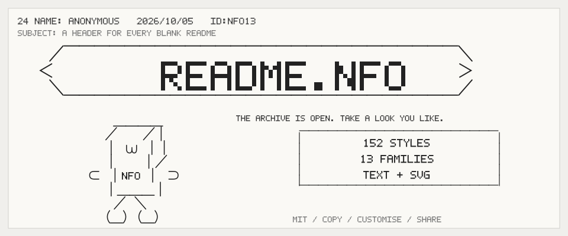</a> | [asia-04](../../styles/asia.md#asia-04) | [21–30](page-3.md) |
| 25 | [Vector objects: wireframe, glenz, vector balls, dot scroller, metaballs](25-pc-13.md) | <a href="25-pc-13.md">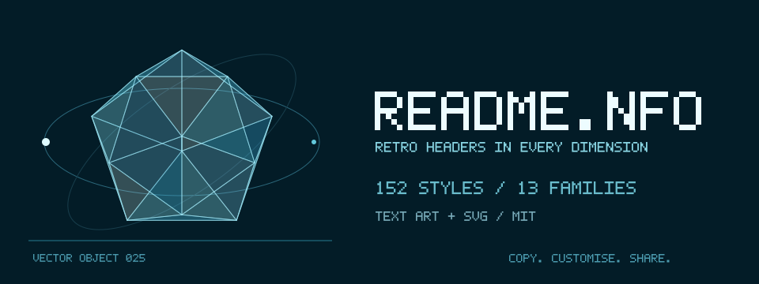</a> | [pc-13](../../styles/pc.md#pc-13) | [21–30](page-3.md) |
| 26 | [Netlabel cassette: J-card with obi strip, and a shell whose reels turn](26-print-02.md) |  | [print-02](../../styles/print.md#print-02) | [21–30](page-3.md) |
| 27 | [FM-synth status display: one piano keyboard per channel, level bars and spectrum (MMDSP / FMDSP lineage)](27-asia-01.md) | <a href="27-asia-01.md">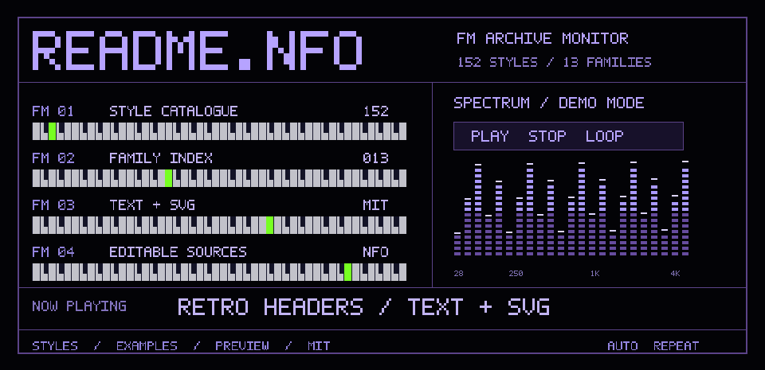</a> | [asia-01](../../styles/asia.md#asia-01) | [21–30](page-3.md) |
| 28 | [Atari ST menu disk: key-numbered game list, big gradient scroller, scanline rasters](28-c64-13.md) | <a href="28-c64-13.md">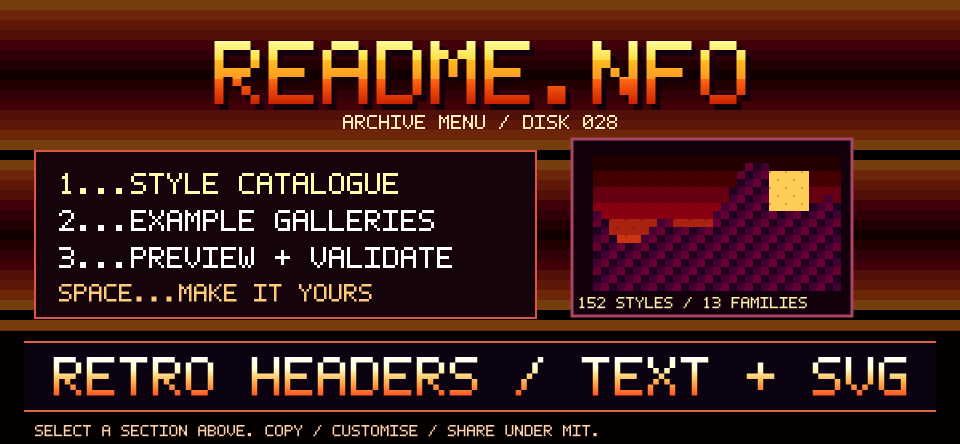</a> | [c64-13](../../styles/c64.md#c64-13) | [21–30](page-3.md) |
| 29 | [Amiga megademo menu and trainer menu: chrome logo, giant scroller, dotted-leader option list](29-c64-06.md) | <a href="29-c64-06.md">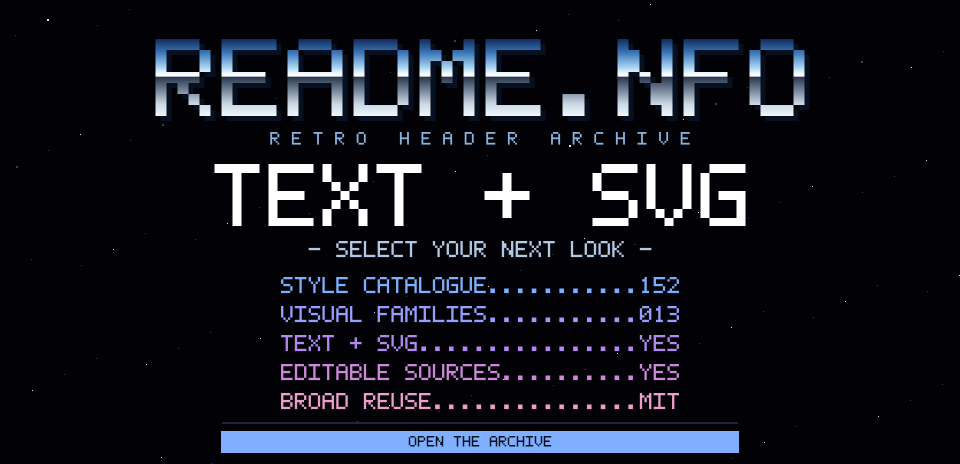</a> | [c64-06](../../styles/c64.md#c64-06) | [21–30](page-3.md) |
| 30 | [Braille-dot terminal graphics (modern TUI dashboard)](30-ansi-12.md) | **Pure text** | [ansi-12](../../styles/ansi.md#ansi-12) | [21–30](page-3.md) |
| 31 | [Atari Video Music: pulsing two-part diamonds in a tiled array](31-idle-01.md) | <a href="31-idle-01.md">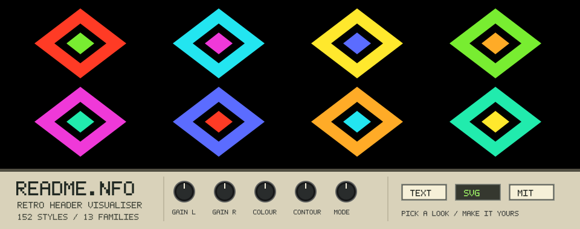</a> | [idle-01](../../styles/idle.md#idle-01) | [31–40](page-4.md) |
| 32 | [Oscilloscope view (one scope per channel)](32-trk-09.md) | <a href="32-trk-09.md">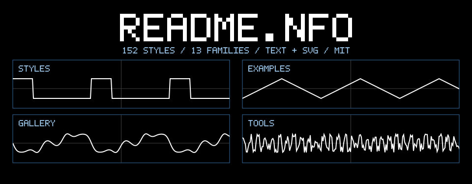</a> | [trk-09](../../styles/trk.md#trk-09) | [31–40](page-4.md) |
| 33 | [Bobs and dot objects: a sphere chain on a Lissajous path, a rotating dot cube](33-c64-08.md) |  | [c64-08](../../styles/c64.md#c64-08) | [31–40](page-4.md) |
| 34 | [Text-mode poster installer (Razor 1911, 2024-26)](34-pc-07.md) | <a href="34-pc-07.md">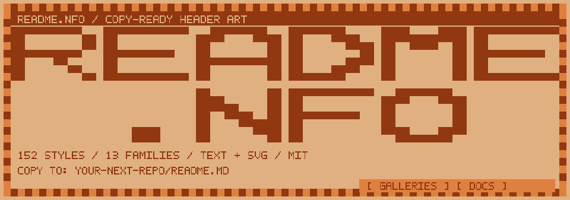</a> | [pc-07](../../styles/pc.md#pc-07) | [31–40](page-4.md) |
| 35 | [Demoparty results.txt (with the invitation text as its companion)](35-demo-06.md) | **Pure text** | [demo-06](../../styles/demo.md#demo-06) | [31–40](page-4.md) |
| 36 | [Off-air idle: colour bars, test card and the hopping 'no signal' box](36-idle-10.md) |  | [idle-10](../../styles/idle.md#idle-10) | [31–40](page-4.md) |
| 37 | [PC demo READ.ME: paged info file with index, member table and cut-here form](37-demo-02.md) | **Pure text** | [demo-02](../../styles/demo.md#demo-02) | [31–40](page-4.md) |
| 38 | [Vertical copper bars ('Kefrens bars' / 'Alcatraz bars'): ribbons twisting down the screen](38-c64-07.md) |  | [c64-07](../../styles/c64.md#c64-07) | [31–40](page-4.md) |
| 39 | [Classic Mac OS: 1-bit System 6/7 desktop](39-vap-11.md) | <a href="39-vap-11.md">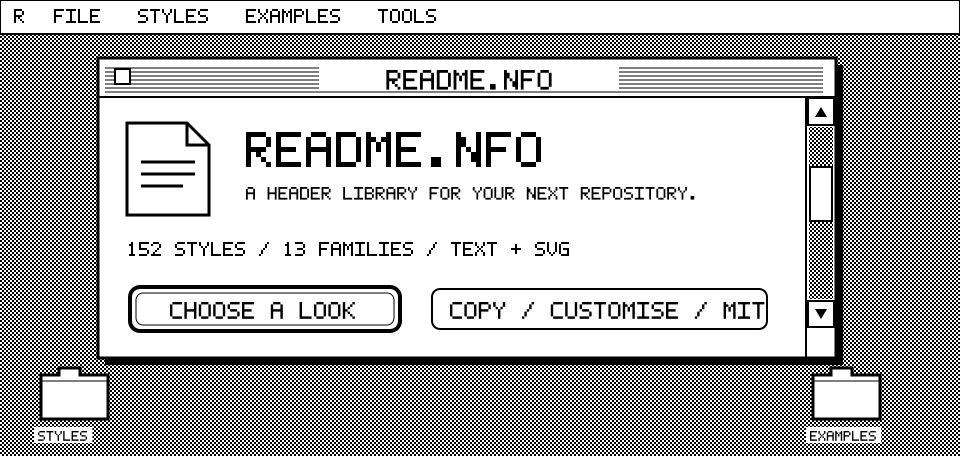</a> | [vap-11](../../styles/vap.md#vap-11) | [31–40](page-4.md) |
| 40 | [CTF challenge board and scoreboard (category tiles, top-ten score graph, rank table)](40-hack-18.md) | <a href="40-hack-18.md"></a> | [hack-18](../../styles/hack.md#hack-18) | [31–40](page-4.md) |

[Other example galleries](../README.md) · [Style catalogue](../../styles/INDEX.md) · [MIT licence](../../LICENSE)
