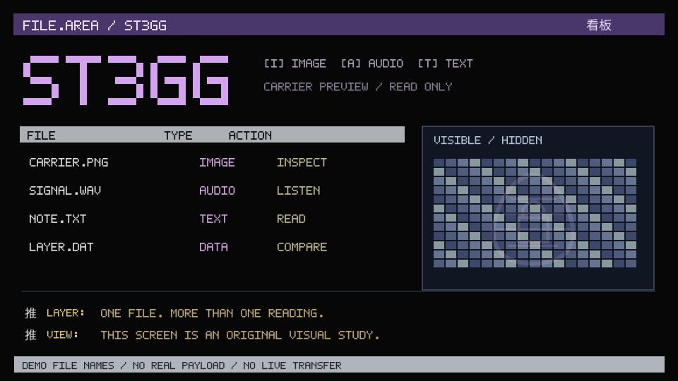

<!-- 02-telnet-board: asia-03. Generated by src/02-telnet-board.mjs; edit tools/pliny-headers/projects.json or render.mjs. -->

<p align="center">
  
</p>

<h1 align="center">ST3GG</h1>

<p align="center"><strong>A message beneath the surface.</strong></p>

<p align="center"><code>IMAGES + AUDIO</code> · <code>TEXT + DOCUMENTS</code> · <code>STEGANOGRAPHY</code></p>

<p align="center"><a href="https://ste.gg/">Open the project</a> · <a href="https://github.com/elder-plinius/ST3GG">Source repository</a></p>

<details>
<summary>Plain-text file area</summary>

```text
FILE.AREA / ST3GG
FILE          TYPE    ACTION
CARRIER.PNG   IMAGE   INSPECT
SIGNAL.WAV    AUDIO   LISTEN
NOTE.TXT      TEXT    READ
LAYER.DAT     DATA    COMPARE

+ LAYER: One file. More than one reading.
+ VIEW:  This screen is an original visual study.
```

These comments and file names are illustrative.

</details>

<!-- Unofficial README design study. Source descriptions checked 2026-10-05. Animation depicts an illustrative screen, not live project activity. -->
