<!-- 05-luna-desktop: vap-09. Generated by src/05-luna-desktop.mjs; edit tools/pliny-headers/projects.json or render.mjs. -->

  

<h1 align="center">ST3GG</h1>

<strong>A message beneath the surface.</strong>

<code>IMAGES + AUDIO</code> · <code>TEXT + DOCUMENTS</code> · <code>STEGANOGRAPHY</code>

<a href="https://ste.gg/">Open the project</a> · <a href="https://github.com/elder-plinius/ST3GG">Source repository</a>

<!-- Unofficial README design study. Source descriptions checked 2026-10-05. Animation depicts an illustrative screen, not live project activity. -->
