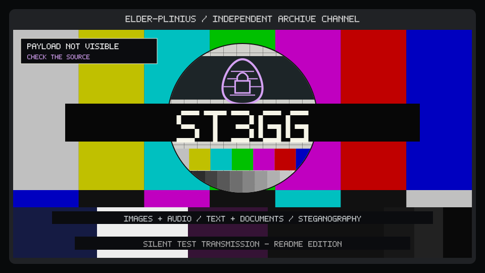
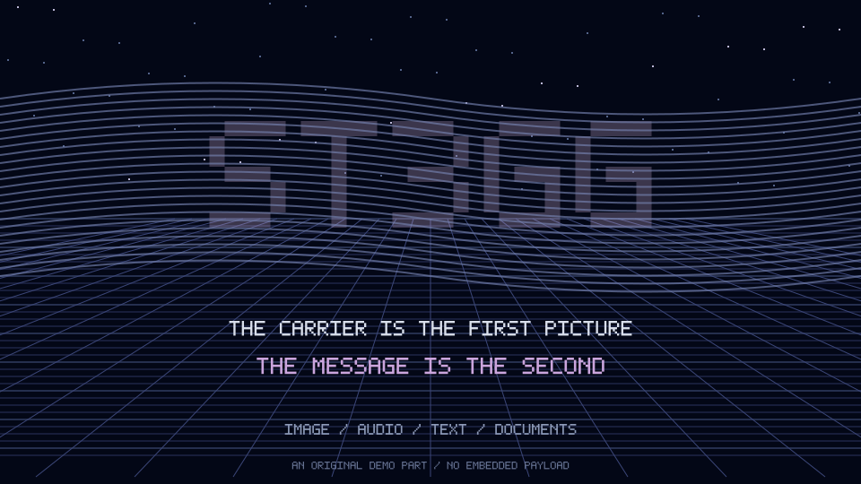

# ST3GG — five scene studies

A message beneath the surface.

[Source repository](https://github.com/elder-plinius/ST3GG) · [Live project](https://ste.gg/) · [Compare all three repos](../../comparisons/pliny-first-draw/index.html) · [Shared draw](../pliny.md)

The same five catalogue styles were drawn once for NATURALIS-HISTORIA, GL4SS and ST3GG. Each project gets its own composition, scene and motion. These are unofficial header studies; source descriptions were checked on 2026-10-05.

Each numbered Markdown file is a ready-to-copy header. Keep its matching SVG in an `assets/` folder. SVGs embed their artwork and Latin pixel lettering, scale to the available width, and support reduced motion. Terminal comments and file names are illustrative.

To rebuild this set from the repository root:

```sh
node tools/pliny-headers/build.mjs
```

To rebuild one header, run its matching `src/NN-name.mjs`. Project text lives in `tools/pliny-headers/projects.json`; the independent scene renderers live in `tools/pliny-headers/render.mjs`.

| # | Header | Catalogue reference |
| --- | --- | --- |
| 01 | [Off-air test card](01-off-air.md) | [idle-10](../../styles/idle.md#idle-10) |
| 02 | [Taiwanese BBS board](02-telnet-board.md) | [asia-03](../../styles/asia.md#asia-03) |
| 03 | [PC demo opening titles](03-demo-titles.md) | [demo-01](../../styles/demo.md#demo-01) |
| 04 | [Monochrome viewdata](04-viewdata.md) | [ansi-09](../../styles/ansi.md#ansi-09) |
| 05 | [Luna desktop](05-luna-desktop.md) | [vap-09](../../styles/vap.md#vap-09) |

## 01 · Off-air test card · idle-10

A full test transmission conceals the project inside the carrier: colour bars, an egg-lock emblem and a payload status box.

[Copy the Markdown](01-off-air.md) · [SVG](assets/01-off-air.svg) · [Generator](src/01-off-air.mjs)

<!-- 01-off-air: idle-10. Generated by src/01-off-air.mjs; edit tools/pliny-headers/projects.json or render.mjs. -->

<p align="center">
  
</p>

<h1 align="center">ST3GG</h1>

<p align="center"><strong>A message beneath the surface.</strong></p>

<p align="center"><code>IMAGES + AUDIO</code> · <code>TEXT + DOCUMENTS</code> · <code>STEGANOGRAPHY</code></p>

<p align="center"><a href="https://ste.gg/">Open the project</a> · <a href="https://github.com/elder-plinius/ST3GG">Source repository</a></p>

<!-- Unofficial README design study. Source descriptions checked 2026-10-05. Animation depicts an illustrative screen, not live project activity. -->

---

## 02 · Taiwanese BBS board · asia-03

A terminal file area lists image, audio, text and document carriers beside an egg emerging from a block preview.

[Copy the Markdown](02-telnet-board.md) · [SVG](assets/02-telnet-board.svg) · [Generator](src/02-telnet-board.mjs)

<!-- 02-telnet-board: asia-03. Generated by src/02-telnet-board.mjs; edit tools/pliny-headers/projects.json or render.mjs. -->

<p align="center">
  
</p>

<h1 align="center">ST3GG</h1>

<p align="center"><strong>A message beneath the surface.</strong></p>

<p align="center"><code>IMAGES + AUDIO</code> · <code>TEXT + DOCUMENTS</code> · <code>STEGANOGRAPHY</code></p>

<p align="center"><a href="https://ste.gg/">Open the project</a> · <a href="https://github.com/elder-plinius/ST3GG">Source repository</a></p>

<details>
<summary>Plain-text file area</summary>

```text
FILE.AREA / ST3GG
FILE          TYPE    ACTION
CARRIER.PNG   IMAGE   INSPECT
SIGNAL.WAV    AUDIO   LISTEN
NOTE.TXT      TEXT    READ
LAYER.DAT     DATA    COMPARE

+ LAYER: One file. More than one reading.
+ VIEW:  This screen is an original visual study.
```

These comments and file names are illustrative.

</details>

<!-- Unofficial README design study. Source descriptions checked 2026-10-05. Animation depicts an illustrative screen, not live project activity. -->

---

## 03 · PC demo opening titles · demo-01

The carrier appears first. An interference band slowly uncovers ST3GG above a wireframe floor and original star field.

[Copy the Markdown](03-demo-titles.md) · [SVG](assets/03-demo-titles.svg) · [Generator](src/03-demo-titles.mjs)

<!-- 03-demo-titles: demo-01. Generated by src/03-demo-titles.mjs; edit tools/pliny-headers/projects.json or render.mjs. -->

<p align="center">
  
</p>

<h1 align="center">ST3GG</h1>

<p align="center"><strong>A message beneath the surface.</strong></p>

<p align="center"><code>IMAGES + AUDIO</code> · <code>TEXT + DOCUMENTS</code> · <code>STEGANOGRAPHY</code></p>

<p align="center"><a href="https://ste.gg/">Open the project</a> · <a href="https://github.com/elder-plinius/ST3GG">Source repository</a></p>

<!-- Unofficial README design study. Source descriptions checked 2026-10-05. Animation depicts an illustrative screen, not live project activity. -->

---

## 04 · Monochrome viewdata · ansi-09

A decoding service divides visible file and hidden reading: inspect the mosaic image, hear the audio or read the text.

[Copy the Markdown](04-viewdata.md) · [SVG](assets/04-viewdata.svg) · [Generator](src/04-viewdata.mjs)

<!-- 04-viewdata: ansi-09. Generated by src/04-viewdata.mjs; edit tools/pliny-headers/projects.json or render.mjs. -->

<p align="center">
  
</p>

<h1 align="center">ST3GG</h1>

<p align="center"><strong>A message beneath the surface.</strong></p>

<p align="center"><code>IMAGES + AUDIO</code> · <code>TEXT + DOCUMENTS</code> · <code>STEGANOGRAPHY</code></p>

<p align="center"><a href="https://ste.gg/">Open the project</a> · <a href="https://github.com/elder-plinius/ST3GG">Source repository</a></p>

<!-- Unofficial README design study. Source descriptions checked 2026-10-05. Animation depicts an illustrative screen, not live project activity. -->

---

## 05 · Luna desktop · vap-09

A carrier explorer puts section shortcuts beside a preview. A hidden layer appears in the picture while the progress strip cycles.

[Copy the Markdown](05-luna-desktop.md) · [SVG](assets/05-luna-desktop.svg) · [Generator](src/05-luna-desktop.mjs)

<!-- 05-luna-desktop: vap-09. Generated by src/05-luna-desktop.mjs; edit tools/pliny-headers/projects.json or render.mjs. -->

<p align="center">
  
</p>

<h1 align="center">ST3GG</h1>

<p align="center"><strong>A message beneath the surface.</strong></p>

<p align="center"><code>IMAGES + AUDIO</code> · <code>TEXT + DOCUMENTS</code> · <code>STEGANOGRAPHY</code></p>

<p align="center"><a href="https://ste.gg/">Open the project</a> · <a href="https://github.com/elder-plinius/ST3GG">Source repository</a></p>

<!-- Unofficial README design study. Source descriptions checked 2026-10-05. Animation depicts an illustrative screen, not live project activity. -->

---

