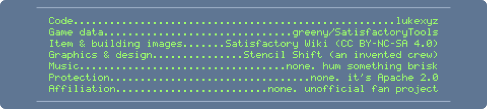
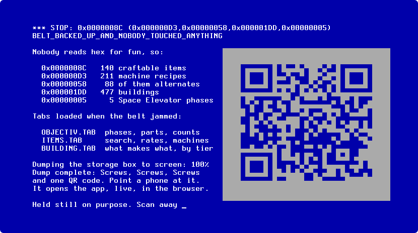

# ULTRA-SATISFACTORY header examples

Forty-two retro README headers for [ULTRA-SATISFACTORY](https://github.com/lukexyz/ULTRA-SATISFACTORY), a companion app for the game *Satisfactory*. Each one replaces the title and one-line pitch at the top of that README. 01 to 06 use the same six styles as the [Dance Vision examples](../dance-vision), redrawn around a factory. The rest come from the [style catalogue](../../styles): 07 to 12 were drawn at random, 13 to 27 are styles asked for by name (Razor 1911 looks, chiptune and tracker screens, NFO and ASCII art schools, vaporwave), and 28 to 42 are a second random draw. Build times for every header are in [../build-log.csv](../build-log.csv).

Each example is its own `.md` in this folder. Animated art is in `assets/`, and the generator that rebuilds it is in `src/` (`node examples/ultra-satisfactory/src/<option>.mjs`). Rebuild this page with `node examples/ultra-satisfactory/src/build-gallery.mjs`. Anchor and file links were written for the ULTRA-SATISFACTORY repo root, so they don't resolve here. Every number quoted (140 items, 211 recipes, 477 buildings, recipe rates and cycle times) was checked against that repo's data on 2026-09-30.

Unofficial fan work, not affiliated with Coffee Stain Studios. The art is original. The keygen and cracktro styling is parody of the app itself, which is free and Apache 2.0: nothing here cracks, unlocks or offers a key for the game. Every crew, label, party, station and maker named is invented, and real groups, artists and products are style references only: none of their names, logos or lettering is used.

| # | Option | Style | What it is |
| --- | --- | --- | --- |
| 01 | [Scene Release NFO](01-nfo-release_opus_5.5.md) | original six | Pure text: an 80-column .NFO with a block-character logo and hex-cog emblem, RELEASE INFO, PAYLOAD and INSTALL NOTES, and a three-tab flow diagram. Phase list, factory skyline, credits and greetz are collapsed. No images, works everywhere. |
| 02 | [Amiga Cracktro](02-amiga-cracktro_opus_5.5.md) | original six | Animated SVG: a chrome logo over copper bars and a starfield, above a pixel production line (Smelter, Constructor, Assembler, Space Elevator) and a sine scroller. Below it, a ProTracker pattern where the channels are machines and the notes are real per-minute recipe rates. |
| 03 | [Keygen Dialog](03-keygen-dialog_opus_5.5.md) | original six | Animated SVG: a skinned mid-2000s keygen window that generates recipes, not keys. It types an item, scrambles, and settles on four real recipes with machine, cycle time, power and rates, above a strip linking the three tabs. |
| 04 | [C64 SID Loader](04-c64-loader_opus_5.5.md) | original six | Animated SVG on a 15 s loop: the C64 boots, LOAD"ULTRA-SATISFACTORY",8,1, turbo-loader stripes, then a title screen where a pointer clicks through the three tabs while a conveyor feeds an Assembler. Quick start as a BASIC listing. |
| 05 | [Control Terminal](05-crt-terminal_opus_5.5.md) | original six | Animated SVG: an amber phosphor CRT that boots, shows ACCESS GRANTED, then looks up Space Elevator phase 2, the Modular Frame recipe and the Assembler. Quick start as a shell session. |
| 06 | [ANSI BBS](06-ansi-bbs_opus_5.5.md) | original six | Animated SVG: a 16-colour ANSI BBS login for THE CLOGGED MERGER BBS, with the Modular Frame recipe running through an Assembler, the five Space Elevator phases as the line-up and the nine production machines as the shift roster. Below it, a BBS menu with real links. |
| 07 | [Demoparty Compo Slides](07-compo-slides_opus_5.5.md) | [demo-07](../../styles/demo.md#demo-07) | Animated SVG: a demoparty big screen seen over a crowd, cycling through a title slide, a countdown, one slide per app tab and a prize-giving with score bars. Below it, a text results table ranking ten real recipes by items per minute. |
| 08 | [MilkDrop Visualiser](08-milkdrop-visualiser_opus_5.5.md) | [idle-04](../../styles/idle.md#idle-04) | Animated SVG: an early-2000s music visualiser with nothing playing. Rings zoom out of a hex-cog behind the title and cross-fade through three presets, one per tab. A playlist of 16 real recipes is collapsed below. |
| 09 | [Oscilloscope Channels](09-oscilloscope_opus_5.5.md) | [trk-09](../../styles/trk.md#trk-09) | Animated SVG: the title as a glowing trace above a 3x3 grid of scopes, one per production machine, each with its own waveform and a real recipe readout (items per minute, cycle seconds, MW). Channel 10 is the Pioneer, flatlining. |
| 10 | [Arcade Attract Mode](10-arcade-attract_opus_5.5.md) | [mach-08](../../styles/mach.md#mach-08) | Animated SVG: an arcade cabinet front whose screen loops a title card, a to-scale screw-factory demo and a high-score table of the five Space Elevator phases. INSERT NOTHING: free play, it is Apache 2.0. |
| 11 | [Win32 Cracktro](11-win32-cracktro_opus_5.5.md) | [pc-05](../../styles/pc.md#pc-05) | Animated SVG: a mid-2000s Windows cracktro with a bevelled chrome logo on a mirror floor between two twisting steel girders, a three-page text-writer and a dot-matrix sine scroller. An 80-column NFO is collapsed below. |
| 12 | [Netlabel Cassette](12-cassette-jcard_opus_5.5.md) | [print-02](../../styles/print.md#print-02) | Animated SVG: an orange cassette with turning reels beside its opened J-card and obi strip. The track list is twelve recipes whose running times are their real craft cycles, and the deck counter adds them up. |
| 13 | [Chrome Spheres](13-chrome-spheres_opus_5.5.md) | [pc-03](../../styles/pc.md#pc-03) | Animated SVG: an italic chrome ULTRA SATISFACTORY logo over a moving checkerboard floor with six bouncing mirror spheres, a 60-second day-night sky and a gold horizon scroller listing the tabs, counts, run commands and live link. |
| 14 | [Neon Cube Field](14-neon-cube-field_opus_5.5.md) | [pc-12](../../styles/pc.md#pc-12) | Animated SVG: an isometric floor of 378 rainbow cubes rolling in a wave under scanlines, with a segment-display ULTRA SATISFACTORY wordmark, a four-page text writer (pitch, counts, run commands, live link), three tab signposts and a divider of spinning octahedra. |
| 15 | [Brush-Script NFO](15-brush-script-nfo_opus_5.5.md) | [nfo-01](../../styles/nfo.md#nfo-01) | Animated SVG: an 80-column DOS .NFO screen with "Ultra" as a cyan half-block brush script (twelve-row capital U, tail under the word) over "Satisfactory" in white brush italic inside a die-cut contour. |
| 16 | [Text-Mode Poster Installer](16-poster-installer_opus_5.5.md) | [pc-07](../../styles/pc.md#pc-07) | Animated SVG: a character-cell installer poster with ULTRA in giant cyan block letters over SATISFACTORY in white inside a gold hazard-tape border, gold parts stepping along belt channels cut through the letters, a title strip, a path field, a progress bar that unpacks the app's item, recipe, building and phase counts, and two small buttons (INSTALL, QUIT), with a plain-text version of the same poster in a collapsed block. |
| 17 | [Amiga 4-Channel Tracker](17-amiga-tracker_opus_5.5.md) | [trk-01](../../styles/trk.md#trk-01) | Animated SVG: a full Amiga-style four-channel tracker editor screen (embossed grey field stack, button grid with the three tabs, ULTRA-SATISFACTORY logo plate, four scopes, name and status strips) over four scrolling pattern windows labelled Smelter, Constructor, Assembler and Manufacturer, where each note is a real standard-recipe craft cycle and the readouts step through 13 verified recipes. |
| 18 | [FM-Synth Keyboard Display](18-fm-synth-display_opus_5.5.md) | [asia-01](../../styles/asia.md#asia-01) | Animated SVG: an early-1990s FM-synth player status screen in lavender on black, with nine keyboard strips (one per production machine, a lime key stepping once per item made), segment-digit counters, a 31-bar spectrum of real output rates, power level bars with pan dials, and a file selector of the README sections. |
| 19 | [Handheld Tracker](19-handheld-tracker_opus_5.5.md) | [trk-05](../../styles/trk.md#trk-05) | Animated SVG: four pastel LCD tracker screens on a dark panel (a PROJECT title screen with the name and counts, a four-channel song grid, a sixteen-row recipe phrase grid in hex and a readout of each recipe or building card). |
| 20 | [Media Player Stack](20-player-stack_opus_5.5.md) | [trk-11](../../styles/trk.md#trk-11) | Animated SVG: five snapped pixel-art media-player windows (player with LED clock, analyser and ticker; ten-band equaliser whose sliders are real app counts on a log scale; visualiser with the ULTRA SATISFACTORY logo; library of the three tabs; playlist as table of contents). |
| 21 | [Shaded Block NFO](21-shaded-block-nfo_opus_5.5.md) | [nfo-02](../../styles/nfo.md#nfo-02) | Animated SVG: a 96 x 44 character-cell NFO screen with a dithered two-tone ULTRA SATISFACTORY logo, shaded frame walls, debris and scrolling shade bands, half-block headings, leader-dot field rows giving the app's counts, three tabs and run commands. |
| 22 | [Poster NFO](22-poster-nfo_opus_5.5.md) | [nfo-03](../../styles/nfo.md#nfo-03) | Animated SVG: a 100 x 45 character-grid poster NFO with a shaded block painting of a night-time factory, Space Elevator and planet, a tall faded-stem ULTRA SATISFACTORY logo, five mirrored dot-leader fact rows between two pillars. |
| 23 | [Illustrated ANSI](23-illustrated-ansi_opus_5.5.md) | [ansi-03](../../styles/ansi.md#ansi-03) | Animated SVG: an 80x139-cell, 16-colour illustrated ANSI comic that scrolls through a 30-row window once a minute, with a block-letter title, an original hard-hatted cog mascot, a credit plaque, one comic panel per tab (Objectives, Items, Buildings), a run-it panel and a DOS viewer status bar. |
| 24 | [Amiga ASCII Colly](24-amiga-ascii-colly_opus_5.5.md) | [nfo-07](../../styles/nfo.md#nfo-07) | Animated SVG: an 80-column, 144-line Amiga-style ASCII collection paged through a dark text viewer (sheared slash-and-macron logos for ULTRA, SATISFACTORY and the three tabs, a release frame, phase table, Modular Frame recipe card, building counts, run commands, greets and respects). |
| 25 | [Mid-90s Desktop](25-desktop-95_opus_5.5.md) | [vap-07](../../styles/vap.md#vap-07) | Animated SVG: a grey bevelled mid-90s desktop in which a disk-defragmenter window sorts an 828-cell block map of the app's items, recipes and buildings (with a legend of the real counts), hits 100%, shows a cascading error dialog and restarts, beside an editor window holding the two run commands and the live link. |
| 26 | [Classic Vaporwave](26-vaporwave_opus_5.5.md) | [vap-01](../../styles/vap.md#vap-01) | Animated SVG: a pink vaporwave collage with an original marble bust, a perspective checker floor, a mint title with katakana, and 1990s-style windows whose three tabs show phase 1 objectives, the Modular Frame recipe and machine power figures. |
| 27 | [Signalwave Forecast](27-signalwave-forecast_opus_5.5.md) | [vap-04](../../styles/vap.md#vap-04) | Animated SVG: a 4:3 1990s cable forecast screen that hard-cuts through six pages (current conditions with the app's counts, the pitch as a forecast, the three tabs, seven recipe readings, a joke spaghetti radar and the five Space Elevator phases) with a ticking clock and a bottom crawl carrying the run commands and live link. |
| 28 | [Flat-Colour Silhouette Intro](28-flat-silhouette-intro_opus_5.5.md) | [c64-10](../../styles/c64.md#c64-10) | Animated SVG: a flat-colour intro banner with the project name in black capitals on two waves over pink, mustard and green stepped factory skylines, a Space Elevator silhouette against expanding orange and violet rings and a curved text scroller. |
| 29 | [Site Race](29-site-race_opus_5.5.md) | [xfer-01](../../styles/xfer.md#xfer-01) | Pure text: a 7-bit ASCII FTP site-race session with ULTRA stencilled out of a '#' progress bar, a zipscript-style reply box carrying the counts, tabs and links, a 99% progress directory and COMPLETE bar, and a MACHINETOP table of the nine machines' recipe counts. |
| 30 | [Pencil on Paper](30-pencil-on-paper_opus_5.5.md) | [pc-09](../../styles/pc.md#pc-09) | Animated SVG: a green pencil writes ULTRA-SATISFACTORY and the pitch in chalk-white handwriting on blue woven paper, then sketches a three-machine iron plan with real recipe rates, a cog mascot carrying a crate of screws, and the three tabs. |
| 31 | [Magazine Type-In Listing](31-type-in-listing_opus_5.5.md) | [print-03](../../styles/print.md#print-03) | Pure text: a two-column magazine type-in listing of 26 BASIC lines carrying twelve real recipes, a computed checksum on every line and a 42-byte machine-code block. |
| 32 | [Generated Banner](32-generated-banner_opus_5.5.md) | [nfo-09](../../styles/nfo.md#nfo-09) | Pure text: an 80-column 7-bit ASCII page with ULTRA- in a bracket-pixel font over SATISFACTORY in a smushed outline font, a per-letter dimension line, the three tabs as boxed-letter strips, the run commands and live link, and three fold-outs (a spacing QC report, a specimen sheet of the six faces, credits). |
| 33 | [Sysop Dashboard](33-sysop-dashboard_opus_5.5.md) | [xfer-08](../../styles/xfer.md#xfer-08) | Animated SVG: an 80-column blue DOS BBS sysop waiting-for-caller dashboard with a block-letter ULTRA SATISFACTORY logo, four stat panels of the app's real counts and per-minute rates, a black Modem window showing the two quick-start commands, a rotating Last Caller window, a ticking clock and uptime, and a bracketed-hotkey grid. |
| 34 | [DOS Setup Dialog](34-dos-setup_opus_5.5.md) | [mach-05](../../styles/mach.md#mach-05) | Animated SVG: an 80x25 blue DOS text-mode setup screen in the VGA palette where stacked, shadowed windows walk through choosing a production machine, recipe, port, IRQ and DMA, run a level-meter test and end on the two run commands and live URL. |
| 35 | [Terminal Program Session](35-terminal-session_opus_5.5.md) | [xfer-05](../../styles/xfer.md#xfer-05) | Animated SVG: an 80x25 DOS terminal-program session (typed modem init, blue dialing directory of the three tabs, redialer, Rotor lookup, a Zmodem box downloading data.json, Alt-Z command menu, red status bar, external modem with blinking lights) above a plain-text dialing directory of real links and two collapsed text blocks. |
| 36 | [MML Listing](36-mml-listing_opus_5.5.md) | [asia-05](../../styles/asia.md#asia-05) | Pure text: an 80-column PMD-dialect Music Macro Language song file whose header lines carry the pitch and live link, whose ten note rows spell ULTRA SATISFACTORY, whose FM voice tables use machine power draws as operator levels, and whose two collapsed sections hold the rest of the tune (the five Space Elevator phases, drums) and liner notes with counts, cycle times and credits. |
| 37 | [Blue Error Screen](37-blue-screen_opus_5.5.md) | [vap-08](../../styles/vap.md#vap-08) | Animated SVG: a white-on-blue 80x25 text-mode error screen with the project name in an inverted title bar, the pitch and run commands as recovery options, a stop-code screen whose hex values are the app's real counts beside a QR code for the live app, and a restart into a black title screen with the three tabs. |
| 38 | [Piano Roll](38-piano-roll_opus_5.5.md) | [trk-10](../../styles/trk.md#trk-10) | Animated SVG: a falling-note piano roll in which the app's 211 machine recipes drop onto an 88-key keyboard as bars sized by cycle time and coloured by machine, under the project name spelled in note blocks, with a recipes-played counter and the three tabs as pattern blocks. |
| 39 | [Userbar Kit](39-userbar-kit_opus_5.5.md) | [xfer-04](../../styles/xfer.md#xfer-04) | Animated SVG: a 700 x 152 pixel-lettered banner with a conveyor of miniature userbars above six linked 350 x 19 forum-signature strips (three tabs, live build, local run, fan project), each with gradient, diagonal stripes, gloss and a highlight sweep. |
| 40 | [Power-On Self Test](40-power-on-self-test_opus_5.5.md) | [mach-04](../../styles/mach.md#mach-04) | Animated SVG: an 80 x 25 grey-on-black PC power-on self-test screen with a yellow-and-green corner badge, counters that run up to 140 items, 211 recipes and 477 buildings, the three tabs detected one by one, the run commands and live URL as the setup prompts, then a configuration table listing the nine production machines before the picture collapses and reboots. |
| 41 | [Attribute-Grid Demo Screen](41-attribute-grid-demo_opus_5.5.md) | [demo-08](../../styles/demo.md#demo-08) | Animated SVG: a 256x192 8-bit demo screen in a raster-bar border, with ULTRA in whole bright-cyan cells over a colour-cycling two-armed spiral, SATISFACTORY in white, three tabs that light up in turn with their counts, a multicolour twister drawn as a giant screw with its real recipe, and a rainbow-banded scroller. |
| 42 | [Aero Gloss](42-aero-gloss_opus_5.5.md) | [vap-10](../../styles/vap.md#vap-10) | Animated SVG: a Frutiger Aero / Web 2.0 banner with a two-tone glossy lowercase wordmark and its reflection, a starburst version badge, a glass window holding the three tab buttons with their counts and a progress bar, bubbles, lens flare, aurora and grass. |

<br>

---

## 01 · Scene Release NFO

<sub><code>01-nfo-release_opus_5.5.md</code></sub>

<!-- Header 01-nfo-release_opus_5.5 for ULTRA-SATISFACTORY. Generated by src/01-nfo-release_opus_5.5.mjs: edit that, not this. -->

<pre>
              ░▒▓█   <b>JUST ONE MORE BELT</b>   proudly presents   █▓▒░

███     ███  ███         ███████████  █████████▄    ▄███████▄        ▄▄█▀▀█▄▄
███░    ███░ ███░         ░░░███░░░░░ ███░░░░▀███  ███▀░░░▀███    ▄█▀▀  ▄▄  ▀▀█▄
███░    ███░ ███░            ███░     ███░    ███░ ███░░   ███░   ██  ██████  ██
███░    ███░ ███░            ███░     ███░   ▄███░ ███████████░   ██ ███  ███ ██
▓▓▓░    ▓▓▓░ ▓▓▓░            ▓▓▓░     ▓▓▓▓▓▓▓▓▓▓░░ ▓▓▓░░░░░▓▓▓░   ██  ██████  ██
▓▓▓▓   ▓▓▓▓░ ▓▓▓░            ▓▓▓░     ▓▓▓░░▓▓▓▓▓░  ▓▓▓░    ▓▓▓░   ▀█▄▄  ▀▀  ▄▄█▀
 ▒▒▒▒▒▒▒▒▒░░ ▒▒▒▒▒▒▒▒▒▒      ▒▒▒░     ▒▒▒░  ░▒▒▒▒  ▒▒▒░    ▒▒▒░      ▀▀█▄▄█▀▀
  ░░░░░░░░░   ░░░░░░░░░░      ░░░      ░░░    ░░░░  ░░░     ░░░   TERMiNAL v1.0
▄█████ ▄████▄ ██████ ██ ▄█████ ██████ ▄████▄ ▄█████ ██████ ▄████▄ █████▄ ██  ██
██     ██  ██   ██   ██ ██     ██     ██  ██ ██       ██   ██  ██ ██  ██ ██  ██
▀████▄ ██████   ██   ██ ▀████▄ █████  ██████ ██       ██   ██  ██ █████▀ ▀████▀
    ██ ██  ██   ██   ██     ██ ██     ██  ██ ██       ██   ██  ██ ██ ▀█▄   ██
█████▀ ██  ██   ██   ██ █████▀ ██     ██  ██ ▀█████   ██   ▀████▀ ██  ██   ██
 ░░░░░░ ░░  ░░   ░░   ░░ ░░░░░░ ░░     ░░  ░░ ░░░░░░   ░░   ░░░░░░ ░░  ░░   ░░
═■═══■═══■→  every recipe, building and objective, one click apart  ═■═══■═══■→

══[ <b>ULTRA-SATISFACTORY.Control.Terminal.v1.0.Apache2-J1MB</b> ]═════════[ 01/01 ]═══

╔══[ <b>RELEASE iNFO</b> ]════════════════════╦══[ <b>PAYLOAD</b> ]══════════════════════════╗
║ release ..... <b>ULTRA-SATISFACTORY</b>     ║ items ....... <b>140</b> craftable           ║
║ type ........ companion app          ║ recipes ..... <b>211</b> (88 alternates)     ║
║ for ......... the game Satisfactory  ║ buildings ... <b>477</b> player-buildable    ║
║ official .... no. a fan project      ║ machines .... <b>9</b> that do the work      ║
║ protection .. none. it's <a href="LICENSE">Apache 2.0</a>  ║ phases ...... <b>5</b>, Space Elevator       ║
║ format ...... Python + Streamlit     ║ runs on ..... 2nd monitor or browser  ║
║ price ....... 0. sleep not included  ║ spaghetti ... bring your own          ║
╠══[ <b>iNSTALL NOTES</b> ]═══════════════════╩═══════════════════════════════════════╣
║ <b>1.</b> python -m pip install -r requirements.txt         Python 3.10+, repo root ║
║ <b>2.</b> python -m streamlit run app/app.py           serves http://localhost:8501 ║
║ <b>3.</b> park it on monitor two. alt-tab responsibly.        more: <a href="#run-it-locally">#run-it-locally</a> ║
║ <b>or</b> skip 1-3: <a href="https://lukexyz.github.io/ULTRA-SATISFACTORY/">https://lukexyz.github.io/ULTRA-SATISFACTORY/</a>  live, no install ║
╚══════════════════════════════════════════════════════════════════════════════╝

──────────────────────────────[ <b>ONE CLiCK APART</b> ]───────────────────────────────
┌─[ <b>OBJECTiVES</b> ]─────┐     ┌─[ <b>iTEMS</b> ]───────────────────┐     ┌─[ <b>BUiLDiNGS</b> ]─┐
│ phase 2 of 5 wants │     │ Reinforced Iron Plate 3/min │     │ Assembler     │
│ <b>Modular Frame</b> x500 │ ══→ │ Iron Rod ........... 12/min │     │ tier 2, 15 MW │
│ Smart Plating x100 │     │ → Modular Frame ..... 2/min │     │ what it costs │
│ and 2 more parts   │     │ <b>Assembler</b> · 60 s · 15 MW    │ ══→ │ what it makes │
└────────────────────┘     └─────────────────────────────┘     └───────────────┘
  bold is a click. in the app every ingredient, product and machine is a link.
</pre>

⚡ **ULTRA-SATISFACTORY**, translated from .nfo: a companion app for the factory-building game *Satisfactory* that puts every recipe, building and Space Elevator objective one click apart. Three cross-linked tabs, **Objectives**, **Items** and **Buildings**, mean that "what goes into a Modular Frame again?" costs one alt-tab instead of one evening. [Open it live in your browser](https://lukexyz.github.io/ULTRA-SATISFACTORY/) with nothing to install, or [run it locally](#run-it-locally) with two commands. Unofficial fan project, not affiliated with Coffee Stain Studios.

<details>
<summary>⚡ <b>[ PHASE LiST ]</b> &nbsp;what the Space Elevator wants, all five phases</summary>

<pre>
──[ <b>PHASE LiST</b> ]────────────────────────────────────────────────────────────────

  the five Space Elevator phases, as the <b>OBJECTiVES</b> tab lists them. pick one,
  see the parts and the counts, click a part for its recipe.

     ┌────┬───────────────────────────┬───────────────────────────┬───────┐
     │ <b>##</b> │ <b>phase</b>                     │ <b>the elevator wants</b>        │   <b>qty</b> │
     ├────┼───────────────────────────┼───────────────────────────┼───────┤
     │ 01 │ <b>Automation basics</b>         │ Smart Plating             │   x50 │
     │    │ belts still tidy.         │ Versatile Framework       │  x100 │
     │    │ enjoy it while it lasts.  │ Automated Wiring          │  x500 │
     ├────┼───────────────────────────┼───────────────────────────┼───────┤
     │ 02 │ <b>Logistics &amp; steel</b>         │ Automated Wiring          │  x500 │
     │    │ the first spaghetti.      │ Modular Frame             │  x500 │
     │    │ "i'll tidy it up later."  │ Smart Plating             │  x100 │
     │    │ you will not.             │ Versatile Framework       │  x500 │
     ├────┼───────────────────────────┼───────────────────────────┼───────┤
     │ 03 │ <b>Oil &amp; computers</b>           │ Versatile Framework       │ x2500 │
     │    │ pipes. so many pipes.     │ Modular Engine            │  x500 │
     │    │ you own a whiteboard now. │ Adaptive Control Unit     │  x100 │
     ├────┼───────────────────────────┼───────────────────────────┼───────┤
     │ 04 │ <b>Nuclear &amp; endgame</b>         │ Assembly Director System  │ x1000 │
     │    │ yes, Nuclear Pasta is a   │ Magnetic Field Generator  │  x500 │
     │    │ real part. we checked.    │ Nuclear Pasta             │  x100 │
     │    │ the spaghetti is canon.   │ Thermal Propulsion Rocket │   x25 │
     ├────┼───────────────────────────┼───────────────────────────┼───────┤
     │ 05 │ <b>Alien tech &amp; quantum</b>      │ Biochemical Sculptor      │  x500 │
     │    │ daylight is a rumour.     │ AI Expansion Server       │  x100 │
     │    │ the base has a skyline.   │ Neural-Quantum Processor  │  x100 │
     │    │ one more belt, though.    │ Ballistic Warp Drive      │  x100 │
     └────┴───────────────────────────┴───────────────────────────┴───────┘

  five phases. eighteen line items. one Space Elevator that never says thanks.
</pre>

</details>

<details>
<summary>⚡ <b>[ READ THE REST OF THE .NFO ]</b> &nbsp;site plan, 3 a.m. field test, building manifest, release notes, known issues</summary>

<pre>
──[ <b>SiTE PLAN</b> ]─────────────────────────────────────────────────────────────────

                      ░▒░                                               ██
                    ░▒░                                                 ██
                   ▒░                                                  ▄██▄
     ▄▄           ██                              ▄█   ▄█   ▄█         ▀██▀
     ██           ██          ▄▄▄▄▄▄▄▄▄▄▄▄      ▄███ ▄███ ▄███          ██
    ▄██▄       ▄▄▄██▄▄▄▄▄     ██▀▀▀▀▀▀▀▀██     ████████████████         ██
   ▄█▀▀█▄      ██▀▀▀▀▀▀██     ██ ■ ■■ ■ ██     ██  ███  ███  ██       ▄████▄
  ▄█▀██▀█▄     ██ ░▒▒░ ██     ████████████     ████████████████     ▄████████▄
 ═■═══■═══■═══■═══■═══■═══■═══■═══■═══■═══■═══■═══■═══■═══■═══■═══■═══■═══■═══→
   miner        smelter       constructor         assembler          elevator

     artist's impression. yours has more spaghetti, and it is load-bearing.

──[ <b>FiELD TEST: A TYPiCAL 3 A.M.</b> ]──────────────────────────────────────────────

  03:02  the elevator wants <b>Modular Frame</b>. click.
         3 Reinforced Iron Plate + 12 Iron Rod → 2. Assembler, 60 s, 15 MW.
  03:02  click <b>Reinforced Iron Plate</b>.
         6 Iron Plate + 12 Screw → 1. Assembler, 12 s, 15 MW.
  03:03  click <b>Screw</b>.
         1 Iron Rod → 4 Screw. Constructor, 6 s, 4 MW.
  03:03  click <b>Constructor</b>. it's a building. of course it's a building.
  03:04  alt-tab back. lay just one more belt.
  05:47  birds.

──[ <b>BUiLDiNG MANiFEST</b> ]─────────────────────────────────────────────────────────

  structure .... 333  ■■■■■■■■■■■■■■■■■■■■■■■■■■■■■■■■■■■■■■■■■■■■■■■■■■
  logistics ....  59  ■■■■■■■■■
  decor ........  26  ■■■■
  power ........  15  ■■
  transit ......  14  ■■
  production ...   9  ■
  special ......   7  ■
  storage ......   7  ■
  extraction ...   7  ■
                 ───
  total ........ <b>477</b>  333 are structure pieces. 102 of those say "Ramp".

  the 9 that do the actual work: Assembler, Blender, Constructor, Foundry,
  Manufacturer, Packager, Particle Accelerator, Refinery, Smelter.

──[ <b>RELEASE NOTES</b> ]─────────────────────────────────────────────────────────────

  + three tabs: <b>OBJECTiVES</b>, <b>iTEMS</b>, <b>BUiLDiNGS</b>. parts, ingredients and products
    open recipes. machines open buildings. the full tour is in <a href="#whats-inside">#whats-inside</a>.
  + search is per keystroke. type "scr" and Screw is already on screen,
    judging you.
  + it is one Streamlit file, <a href="app/app.py">app/app.py</a>, with streamlit-aggrid doing the
    searchable grids.
  + the live build is stlite: Streamlit running in your browser on
    WebAssembly. GitHub Actions republishes it on every push to main.
  + it also deploys as a full Streamlit server on Modal (<a href="modal_app.py">modal_app.py</a>). more
    in <a href="#how-its-built">#how-its-built</a>.

──[ <b>PROTECTiON</b> ]────────────────────────────────────────────────────────────────

  none. the code is <a href="LICENSE">Apache 2.0</a>: read it, fork it, bolt a fourth tab on. the
  game data and the images keep their own licences, see <a href="#data--credits">#data--credits</a>.

──[ <b>REQUiREMENTS</b> ]──────────────────────────────────────────────────────────────

  to run it ... Python 3.10+ and two commands. or a browser and zero.
  to need it .. one factory that got out of hand.
  the game .... not included. this is a lookup tool. get Satisfactory from the
                people who made it.
  monitors .... two is ideal. one and alt-tab works. a phone works.
  sleep ....... optional.

──[ <b>KNOWN iSSUES</b> ]──────────────────────────────────────────────────────────────

  - does not untangle your belts. it only tells you what they should be
    carrying.
  - will not stop you starting "a small side factory".
  - lookups take one click, so "i was checking a recipe" no longer covers a
    two hour absence.
</pre>

</details>

<details>
<summary>⚡ <b>[ GREETZ ]</b> &nbsp;the real credits, the crew, the intro music and a FILE_ID.DIZ</summary>

<pre>
──[ <b>CREDiTS, THE TRUE KiND</b> ]────────────────────────────────────────────────────

  <a href="https://github.com/greeny/SatisfactoryTools">greeny/SatisfactoryTools</a> ... the game data (data/data.json). none of this
                               exists without it.
  <a href="https://satisfactory.wiki.gg">the Satisfactory Wiki</a> ...... the item and building images, under
                               <a href="https://creativecommons.org/licenses/by-nc-sa/4.0/">CC BY-NC-SA 4.0</a>.
  Coffee Stain Studios ....... made the game. not affiliated with this release
                               in any way. we just can't stop playing it.

──[ <b>GREETZ</b> ]────────────────────────────────────────────────────────────────────

                          greetz ride the belt out to

            the Manifold Mafia · the Load Balancer Liberation League
                Spaghetti Logistics Ltd · Power Shards Anonymous
             the Foundation Alignment Society (world grid chapter)
           the Hypertube Cannon Test Pilots · the Blueprint Hoarders
                        Team "It Works, Don't Touch It"
               everyone whose temporary belt is now load-bearing
        every lizard doggo who dragged home something it shouldn't have
          whoever is alt-tabbed right now while a Manufacturer starves
                and you, at 3 a.m., saying "just one more belt"

         no greetz to clipping conveyors, or to the power grid at 99%.

──[ <b>NOW PLAYiNG</b> ]───────────────────────────────────────────────────────────────

  ♪ one_more_belt.xm · 4ch · 140 bpm, one per item · looping since phase 1

  ┌────┬────────────┬────────────┬────────────┬────────────┐
  │ <b>##</b> │ <b>miner</b>      │ <b>smelter</b>    │ <b>assembler</b>  │ <b>you</b>        │
  ├────┼────────────┼────────────┼────────────┼────────────┤
  │ 00 │ C-2 01 v40 │ F-2 02 v30 │ C-5 03 v28 │ ··· ·· ··· │  miner     ■■■■■■■·
  │ 01 │ ··· ·· ··· │ ··· ·· ··· │ D#5 03 ··· │ ··· ·· ··· │  smelter   ■■■■■■··
  │ 02 │ C-2 01 v28 │ F-2 02 ··· │ G-5 03 ··· │ ··· ·· ··· │  assembler ■■■■····
  │ 03 │ ··· ·· ··· │ G#2 02 v30 │ C-6 03 ··· │ ··· ·· ··· │  you       ■·······
  <b>│ 04 │ C-2 01 v40 │ ··· ·· ··· │ A#5 03 v28 │ ··· ·· ··· │</b>
  │ 05 │ ··· ·· ··· │ A#2 02 v30 │ G-5 03 ··· │ ··· ·· ··· │  (go to bed)
  │ 06 │ C-2 01 v28 │ A#2 02 ··· │ D#5 03 ··· │ ··· ·· ··· │
  │ 07 │ C-2 01 v40 │ C-3 02 v30 │ G-5 03 ··· │ C-1 04 v02 │
  └────┴────────────┴────────────┴────────────┴────────────┘

──[ <b>THE CREW</b> ]──────────────────────────────────────────────────────────────────

  code ............. one Streamlit file that got out of hand
  packer ........... stlite. the whole app, in a tab, on WebAssembly
  courier .......... GitHub Actions. ships on every push to main
  quality control .. the Space Elevator. it counts. it always counts
  ascii ............ J1MB art division, drawn between belts

┌──[ <b>FiLE_iD.DiZ</b> ]────────────────────┐  ╔══[ <b>J1MB RECiPEGEN v1.0</b> ]════════════╗
│     <b>ULTRA-SATiSFACTORY</b>  [01/01]     │  ║ item    [ <b>Modular Frame</b>           ] ║
│ every recipe, building and Space    │  ║ needs   [ 3 Reinforced Iron Plate ] ║
│ Elevator objective, 1 click apart.  │  ║         [ 12 Iron Rod             ] ║
│ 140 items, 211 recipes,             │  ║ machine [ Assembler, 60 s, 15 MW  ] ║
│ 477 buildings, 5 phases, 0 keys.    │  ║                                     ║
│ unofficial fan project. Apache 2.0. │  ║ [ Generate ]  [ Alt-tab ]  [ Exit ] ║
│   released by J1MB, belt division   │  ║ generates recipes. never keys.      ║
└─────────────────────────────────────┘  ╚═════════════════════════════════════╝

       ░▒▓█  J1MB: efficiency first. sleep is an alternate recipe.  █▓▒░
</pre>

</details>

<br>

---

## 02 · Amiga Cracktro

<sub><code>02-amiga-cracktro_opus_5.5.md</code></sub>

<p align="center">
  
</p>

<h3 align="center">⚡ ULTRA-SATISFACTORY: every recipe, building and Space Elevator objective, one click apart.</h3>

<p align="center">
  ⚡ A companion app for the factory-building game <i>Satisfactory</i>. Park it on the second monitor, the phone or one alt-tab away,
  and stop doing belt maths in your head at 3&nbsp;a.m.<br>
  ⚡ Three tabs, everything cross-linked: <b>OBJECTIVES</b> (what each Space Elevator phase wants, and how many),
  <b>ITEMS</b> (search as you type, recipe cards with per-minute rates) and <b>BUILDINGS</b> (build costs, what each one makes, Mk-by-Mk upgrades).<br>
  ⚡ Unofficial fan project, not affiliated with Coffee Stain Studios. The game is sold separately. This bit is free.
</p>

<p align="center">
  ⚡&nbsp;
  <code>ITEMS:&nbsp;140</code>&nbsp;
  <code>RECIPES:&nbsp;211&nbsp;(88&nbsp;alt)</code>&nbsp;
  <code>BUILDINGS:&nbsp;477</code>&nbsp;
  <code>PROTECTION:&nbsp;none&nbsp;(Apache&nbsp;2.0)</code>&nbsp;
  <code>BELTS:&nbsp;just&nbsp;one&nbsp;more</code>
</p>

```sh
python -m pip install -r requirements.txt
python -m streamlit run app/app.py
```

<p align="center">
  ⚡ Python 3.10+, run from the repo root, then open <b>http://localhost:8501</b>. The long version is in <a href="#run-it-locally">Run&nbsp;it&nbsp;locally</a>.<br>
  ⚡ Or install nothing: it runs <a href="https://lukexyz.github.io/ULTRA-SATISFACTORY/"><b>live&nbsp;in&nbsp;your&nbsp;browser</b></a>,
  a stlite build (Streamlit on WebAssembly) that GitHub Actions republishes on every push to <code>main</code>.
</p>

<p align="center"><sub>⚡ &#9835; NOW PLAYING: FACTORY.MOD &middot; channels are machines, notes are items per minute, straight from the app's data &#9835;</sub></p>

```text
╔════════════════════════════════════════════════════════════════════════╗
║ FACTORY.MOD   ORE → INGOT → PART → FRAME   BPM 120   PAT 03   SLEEP 00 ║
╠════╦════════════════╦════════════════╦════════════════╦════════════════╣
║ ## ║ 1 SMELTER      ║ 2 CONSTRUCTOR  ║ 3 ASSEMBLER    ║ 4 MANUFACTURER ║
╠════╬════════════════╬════════════════╬════════════════╬════════════════╣
║ 00 ║ FEI 030 002 04 ║ PLT 020 006 04 ║ RIP 005 012 15 ║ HMF 002 030 55 ║
║ 01 ║ --- --- --- -- ║ ROD 015 004 04 ║ --- --- --- -- ║ --- --- --- -- ║
║ 02 ║ CUI 030 002 04 ║ SCR 040 006 04 ║ ROT 004 015 15 ║ --- --- --- -- ║
║ 03 ║ --- --- --- -- ║ --- --- --- -- ║ --- --- --- -- ║ --- --- --- -- ║
║>04<║ FEI 030 002 04 ║ WIR 030 004 04 ║ MFR 002 060 15 ║ MEN 001 060 55 ║
║ 05 ║ --- --- --- -- ║ CBL 030 002 04 ║ --- --- --- -- ║ --- --- --- -- ║
║ 06 ║ CAI 015 004 04 ║ PLT 020 006 04 ║ SPL 002 030 15 ║ ACU 001 120 55 ║
║ 07 ║ --- --- --- -- ║ ROD 015 004 04 ║ --- --- --- -- ║ --- --- --- -- ║
╚════╩════════════════╩════════════════╩════════════════╩════════════════╝
 each note: ITEM, items per minute, cycle in seconds, machine MW
 (standard recipes, one machine each)
 FEI Iron Ingot   CUI Copper Ingot   CAI Caterium Ingot   PLT Iron Plate
 ROD Iron Rod   SCR Screw   WIR Wire   CBL Cable   ROT Rotor
 RIP Reinforced Iron Plate   MFR Modular Frame   SPL Smart Plating
 HMF Heavy Modular Frame   MEN Modular Engine   ACU Adaptive Control Unit
 --- machine idle (unacceptable)
```

<details>
<summary>⚡ <b>ULTRA-SATISFACTORY.NFO</b>: release notes, install, files, the Space Elevator shopping list and greetz</summary>

```text
                      ██  ██ ██     ▀▀██▀▀ ██▀▀█▄ ▄█▀▀█▄
                      ██  ██ ██       ██   ██▄▄█▀ ██▄▄██
                      ▀█▄▄█▀ ██▄▄▄▄   ██   ██ ▀█▄ ██  ██
▄█▀▀▀▀ ▄█▀▀█▄ ▀▀██▀▀ ██ ▄█▀▀▀▀ ██▀▀▀▀ ▄█▀▀█▄ ▄█▀▀▀▀ ▀▀██▀▀ ▄█▀▀█▄ ██▀▀█▄ ██  ██
 ▀▀▀█▄ ██▄▄██   ██   ██  ▀▀▀█▄ ██▀▀▀  ██▄▄██ ██       ██   ██  ██ ██▄▄█▀  ▀██▀
▄▄▄▄█▀ ██  ██   ██   ██ ▄▄▄▄█▀ ██     ██  ██ ▀█▄▄▄▄   ██   ▀█▄▄█▀ ██ ▀█▄   ██
        ═════  M A N I F O L D   D E S T I N Y   P R E S E N T S  ═════

╔═════════════════════════════════════════════════════════════════════════════╗
║ RELEASE ..... ULTRA-SATISFACTORY         TYPE ....... companion app         ║
║ SUPPLIED BY . greeny/SatisfactoryTools   PACKED BY .. one Streamlit file    ║
║ PROTECTION .. none (Apache 2.0)          RUNS ON .... Python or a browser   ║
║ ITEMS ....... 140 craftable              RECIPES .... 211 (88 alternates)   ║
║ BUILDINGS ... 477                        PHASES ..... 5, Space Elevator     ║
║ GAME ........ sold separately            SLEEP ...... an alternate recipe   ║
╚═════════════════════════════════════════════════════════════════════════════╝

── RELEASE NOTES ──────────────────────────────────────────────────────────────
  * Every recipe, building and Space Elevator objective, one click apart.
  * Three tabs: OBJECTIVES, ITEMS, BUILDINGS. Everything links: click an
    ingredient for its recipe, click the machine for its building.
  * Recipe cards show per-minute rates, cycle time and power draw, so the
    belt maths happens on the second monitor and not in your head.
  * Runs next to the game: second monitor, phone, or one alt-tab away.
  * Does not build the factory for you. We checked. Twice.
  * Does not judge your spaghetti either. It is load-bearing.

── INSTALL ────────────────────────────────────────────────────────────────────
  1. python -m pip install -r requirements.txt
  2. python -m streamlit run app/app.py
  3. open http://localhost:8501 and drag it to the other monitor
  4. alt-tab back in. Tell nobody how long you were gone.
  Or install nothing: https://lukexyz.github.io/ULTRA-SATISFACTORY/

── FILES ──────────────────────────────────────────────────────────────────────
  app/app.py ................... the app: a single Streamlit file
  ultra_satisfactory/data.py ... loads the game data
  data/data.json ............... the recipe book
  modal_app.py ................. the same app as a server on Modal
  LICENSE ...................... Apache 2.0. Protection: none.

── THE SPACE ELEVATOR SHOPPING LIST (AS THE APP LISTS IT) ─────────────────────
  1 Automation basics .... Smart Plating x50 * Versatile Framework x100
                           * Automated Wiring x500
  2 Logistics & steel .... Automated Wiring x500 * Modular Frame x500
                           * Smart Plating x100 * Versatile Framework x500
  3 Oil & computers ...... Versatile Framework x2500 * Modular Engine x500
                           * Adaptive Control Unit x100
  4 Nuclear & endgame .... Assembly Director System x1000
                           * Magnetic Field Generator x500
                           * Nuclear Pasta x100 * Thermal Propulsion Rocket x25
  5 Alien tech & quantum . Biochemical Sculptor x500 * AI Expansion Server x100
                           * Neural-Quantum Processor x100
                           * Ballistic Warp Drive x100
  Pick a phase in OBJECTIVES, click a part, get its recipe.

── GREETZ ─────────────────────────────────────────────────────────────────────
  The Spaghetti Logistics Union * Bus Lane Bandits * Overclockers Anonymous
  * The Load Balancer Lads * everyone whose "temporary" belt is still there
  200 hours later * whoever is still hand-feeding a constructor. We see you.

── NO GREETZ ──────────────────────────────────────────────────────────────────
  Belts that clip through other belts. You know what you did.

── SMALL PRINT ────────────────────────────────────────────────────────────────
  Unofficial fan project, not affiliated with Coffee Stain Studios.
  Game data: greeny/SatisfactoryTools. Item and building images:
  Satisfactory Wiki, CC BY-NC-SA 4.0. Code: Apache 2.0.

     ═════  efficiency is mandatory. sleep is an alternate recipe.  ═════
```

</details>

<p align="center">
  
</p>

<br>

---

## 03 · Keygen Dialog

<sub><code>03-keygen-dialog_opus_5.5.md</code></sub>

<p align="center">
  <a href="https://lukexyz.github.io/ULTRA-SATISFACTORY/"></a>
</p>

<h1 align="center">ULTRA-SATISFACTORY &middot; <code>recipegen.exe</code></h1>

<p align="center">
  <a href="https://lukexyz.github.io/ULTRA-SATISFACTORY/"><kbd>&nbsp;[ LIVE ]&nbsp;</kbd></a>&nbsp;
  <a href="#run-it-locally"><kbd>&nbsp;[ RUN ]&nbsp;</kbd></a>&nbsp;
  <a href="#whats-inside"><kbd>&nbsp;[ WHAT'S INSIDE ]&nbsp;</kbd></a>&nbsp;
  <a href="#how-its-built"><kbd>&nbsp;[ HOW IT'S BUILT ]&nbsp;</kbd></a>&nbsp;
  <a href="#data--credits"><kbd>&nbsp;[ CREDITS ]&nbsp;</kbd></a>
</p>

⚡ **ULTRA-SATISFACTORY** is a companion app for the factory-building game *Satisfactory*: **every recipe, building and Space Elevator objective, one click apart.** Park it on the second monitor, your phone, or the far side of an alt-tab, and look things up before the belt backs up. Yes, it is dressed as a keygen. It generates recipes, not keys: the app is free, open source and has nothing to unlock.

- ⚡ **Three tabs.** `OBJECTIVES`: pick a Space Elevator phase, see the parts it wants and how many. `ITEMS`: search as you type, get recipe cards with per-minute rates, the machine, its cycle time and its power draw. `BUILDINGS`: build costs, what each one makes, and Mk-by-Mk upgrade paths.
- ⚡ **Everything links.** Click a part to open its recipe, click the machine to open its building, lose forty minutes, call it planning.
- ⚡ **Zero install.** It runs live in your browser at [lukexyz.github.io/ULTRA-SATISFACTORY](https://lukexyz.github.io/ULTRA-SATISFACTORY/).
- ⚡ **Quick start.** `python -m pip install -r requirements.txt`, then `python -m streamlit run app/app.py`, then open `http://localhost:8501`. Python 3.10+, run from the repo root: see [Run it locally](#run-it-locally).
- ⚡ **Unofficial fan project**, not affiliated with Coffee Stain Studios. Protection: none. Licence: [Apache 2.0](LICENSE).

<details>
<summary>⚡ <b>[ ABOUT ]</b> read <code>ultra_satisfactory.nfo</code>: release info, install, the Space Elevator shopping list, greetz</summary>

```text
╔════════════════════════════════════════════════════════════════════════════╗
║                                                                            ║
║         ░▒▓█  DEPT. OF SPAGHETTI LOGISTICS   p r e s e n t s  █▓▒░         ║
║                                                                            ║
║                    U L T R A - S A T I S F A C T O R Y                     ║
║     recipe generator  ·  generates recipes  ·  that is the whole trick     ║
║                                                                            ║
╠══════════════════════════════[ RELEASE iNFO ]══════════════════════════════╣
║   RELEASE ....... ULTRA-SATISFACTORY, control terminal v1.0                ║
║   SUPPLIER ...... a pioneer at 3 a.m. who alt-tabbed "for a second"        ║
║   CRACKER ....... not needed. protection: none. licence: Apache 2.0        ║
║   TYPE .......... companion app. it generates recipes, never keys          ║
║   PAYLOAD ....... 140 items, 211 recipes (88 alternates), 477 buildings    ║
║   REQUIRES ...... a browser. Python 3.10+ to run it on your own machine    ║
║   THE GAME ...... not included, not ours, worth buying. unofficial fan     ║
║                   project, not affiliated with Coffee Stain Studios        ║
╠════════════════════════════════[ iNSTALL ]═════════════════════════════════╣
║   0. or skip all of this: https://lukexyz.github.io/ULTRA-SATISFACTORY/    ║
║   1. python -m pip install -r requirements.txt                             ║
║   2. python -m streamlit run app/app.py                                    ║
║   3. open http://localhost:8501 on the second monitor                      ║
║   4. alt-tab back. the belts did not stop while you were away              ║
╠══════════════════════[ SPACE ELEVATOR SHOPPiNG LiST ]══════════════════════╣
║   PHASE 1  Automation basics                                               ║
║              Smart Plating ............................. x50               ║
║              Versatile Framework ...................... x100               ║
║              Automated Wiring ......................... x500               ║
║   PHASE 2  Logistics & steel                                               ║
║              Automated Wiring ......................... x500               ║
║              Modular Frame ............................ x500               ║
║              Smart Plating ............................ x100               ║
║              Versatile Framework ...................... x500               ║
║   PHASE 3  Oil & computers                                                 ║
║              Versatile Framework ..................... x2500               ║
║              Modular Engine ........................... x500               ║
║              Adaptive Control Unit .................... x100               ║
║   PHASE 4  Nuclear & endgame                                               ║
║              Assembly Director System ................ x1000               ║
║              Magnetic Field Generator ................. x500               ║
║              Nuclear Pasta ............................ x100               ║
║              Thermal Propulsion Rocket ................. x25               ║
║   PHASE 5  Alien tech & quantum                                            ║
║              Biochemical Sculptor ..................... x500               ║
║              AI Expansion Server ...................... x100               ║
║              Neural-Quantum Processor ................. x100               ║
║              Ballistic Warp Drive ..................... x100               ║
║                                                                            ║
║   The OBJECTIVES tab does this per phase. Click a part, get its recipe.    ║
╠══════════════════════════════[ SUPPLiED BY ]═══════════════════════════════╣
║   GAME DATA ..... greeny/SatisfactoryTools                                 ║
║   iMAGES ........ the Satisfactory Wiki, CC BY-NC-SA 4.0                   ║
║   CODE .......... Apache 2.0. take it, fork it, overclock it               ║
╠═════════════════════════════════[ GREETZ ]═════════════════════════════════╣
║   everyone whose "temporary" belt is now load-bearing  ·  the manifold     ║
║   faithful  ·  the load-balancer purists (you are both right)  ·  anyone   ║
║   who opened a Hard Drive and got alternates they did not ask for  ·       ║
║   the AWESOME Sink, for eating our mistakes without judgement              ║
║                                                                            ║
║                    -=[ just one more belt, then bed ]=-                    ║
╚════════════════════════════════════════════════════════════════════════════╝
```

</details>

<br>

---

## 04 · C64 SID Loader

<sub><code>04-c64-loader_opus_5.5.md</code></sub>

<p align="center">
  
</p>

<h1 align="center">ULTRA-SATISFACTORY</h1>

<p align="center">
  ⚡ <b>A companion app for the factory-building game <i>Satisfactory</i>: every recipe, building and Space Elevator objective, one click apart.</b><br>
  ⚡ Park it on the second monitor, prop it up on your phone, or alt-tab out at 3 a.m. because you have forgotten what goes in a Modular Frame. Again.<br>
  ⚡ <a href="https://lukexyz.github.io/ULTRA-SATISFACTORY/"><b>Run it in your browser, nothing to install</b></a> · <a href="#run-it-locally">run it locally</a> · <a href="#whats-inside">what's inside</a>
</p>

<p align="center">
  ⚡ Three tabs: <kbd>OBJECTIVES</kbd> what each Space Elevator phase wants
  → <kbd>ITEMS</kbd> how to make it
  → <kbd>BUILDINGS</kbd> what makes it
</p>

```text
10 REM *** ULTRA-SATISFACTORY QUICK START ***  PROTECTION: NONE (APACHE 2.0)
20 REM PYTHON 3.10+, FROM THE REPO ROOT:
30 SYS "python -m pip install -r requirements.txt"
40 SYS "python -m streamlit run app/app.py"
50 OPEN "http://localhost:8501" : REM PARK IT ON THE SECOND MONITOR
60 PRINT "JUST ONE MORE BELT. "; : GOTO 60
RUN
JUST ONE MORE BELT. JUST ONE MORE BELT. JUST ONE MORE BELT. JUST ONE MORE BELT.
?OUT OF SLEEP  ERROR IN 60
READY.
```

<p align="center">
  <sub>⚡ Unofficial fan project, not affiliated with Coffee Stain Studios. Factory sold separately.</sub>
</p>

<details>
<summary>⚡ <b>ULTRASAT.NFO</b>: release notes, the click path, the Space Elevator's shopping list, greetz (protection: none)</summary>

```text
       ████    ████  ████          ████████████  ██████████        ████
       ████░░  ████░░████░░          ░░████░░░░░░████░░░░████    ████████
      ████░░░ ████░░████░░░           ████░░░   ████░░░ ████░░████ ░░░████░
      ████░░  ████░░████░░            ████░░    ██████████░░░░████████████░░
     ████░░░ ████░░████░░░           ████░░░   ████████░░░░░ ████░░░░████░░░
     ████░░  ████░░████░░            ████░░    ████░░████    ████░░  ████░░
      ████████ ░░░████████████      ████░░░   ████░░░ ████░ ████░░░ ████░░░
        ░░░░░░░░    ░░░░░░░░░░░░      ░░░░      ░░░░    ░░░░  ░░░░    ░░░░

        S  A  T  I  S  F  A  C  T  O  R  Y             control terminal v1.0

═════════════════════════════════════════════════════════════════════════════
  MANIFOLD DESTINY PRESENTS ............................ ULTRA-SATISFACTORY
═════════════════════════════════════════════════════════════════════════════

  RELEASE TYPE .. companion app / second-monitor furniture / 3 a.m. enabler
  GOES WITH ..... Satisfactory, the factory-building game (sold separately:
                  this is a lookup tool, the game is not in the box)
  CONTENTS ...... 140 items, 211 recipes (88 of them alternates),
                  477 buildings, 5 Space Elevator phases, 0 excuses
  PROTECTION .... none. it's Apache 2.0. go on, read the source
  PACKED WITH ... Python, one Streamlit app (app/app.py), streamlit-aggrid
  LOADER ........ python -m streamlit run app/app.py
  ALSO RUNS ..... in a browser tab (stlite: Streamlit on WebAssembly,
                  republished on every push to main) and as a server on Modal
  SUPPLIED BY ... greeny/SatisfactoryTools (game data)
                  Satisfactory Wiki (images, CC BY-NC-SA 4.0)
  FILENAME ...... 18 characters. a real 1541 takes 16. we asked nicely

─── ONE CLICK APART ─────────────────────────────────────────────────────────

   OBJECTIVES             ITEMS                         BUILDINGS
  ┌─────────────────┐    ┌─────────────────────────┐    ┌─────────────────┐
  │ PHASE 2 wants   │    │ 3 Reinforced Iron Plate │    │ ASSEMBLER       │
  │ Modular Frame   │═══>│ 12 Iron Rod             │    │ production, T2  │
  │ x500            │    │ Assembler, 60 s, 15 MW  │═══>│ 15 MW           │
  │                 │    │ = 2 Modular Frame       │    │ makes 39 items  │
  └─────────────────┘    └─────────────────────────┘    └─────────────────┘
    click the part         click the machine             click any of them

─── THE SPACE ELEVATOR WOULD LIKE ───────────────────────────────────────────

  1  AUTOMATION BASICS ...... Smart Plating x50, Versatile Framework x100,
                              Automated Wiring x500
  2  LOGISTICS & STEEL ...... Automated Wiring x500, Modular Frame x500,
                              Smart Plating x100, Versatile Framework x500
  3  OIL & COMPUTERS ........ Versatile Framework x2500, Modular Engine x500,
                              Adaptive Control Unit x100
  4  NUCLEAR & ENDGAME ...... Assembly Director System x1000,
                              Magnetic Field Generator x500,
                              Nuclear Pasta x100,
                              Thermal Propulsion Rocket x25
  5  ALIEN TECH & QUANTUM ... Biochemical Sculptor x500,
                              AI Expansion Server x100,
                              Neural-Quantum Processor x100,
                              Ballistic Warp Drive x100

     it does not say please. it has never said please.

─── GREETZ ──────────────────────────────────────────────────────────────────

  DJ Splitter & MC Merger * the night shift at Belt Fiction * Overclock
  Holmes * the Load Balancer Lads * everyone whose "temporary" starter base
  is now load-bearing * the pioneer who built a railway to avoid a 200 m
  walk * whoever said "I'll tidy the spaghetti later" (you won't) * lizard
  doggos everywhere

  NO RESPECT TO: belts that clip through walls. we see you.

─── unofficial fan project, not affiliated with Coffee Stain Studios ────────
───────────────────────────────── every crew and DJ name above is made up ───
```

</details>

<br>

---

## 05 · Control Terminal

<sub><code>05-crt-terminal_opus_5.5.md</code></sub>

<p align="center">
  
</p>

<p align="center">
  ⚡ <b>ULTRA-SATISFACTORY</b>: a companion app for <i>Satisfactory</i>. Every recipe, building and Space Elevator objective, one click apart.
</p>

<p align="center">
  ⚡
  <a href="#run-it-locally"><kbd>F1 run it</kbd></a>
  <a href="https://lukexyz.github.io/ULTRA-SATISFACTORY/"><kbd>F2 live in your browser</kbd></a>
  <a href="#whats-inside"><kbd>F3 what's inside</kbd></a>
  <a href="#how-its-built"><kbd>F4 how it's built</kbd></a>
  <kbd>F10 sleep</kbd> <i>(denied)</i>
</p>

```console
$ whoami
pioneer (groups: belts, spaghetti, denial). awake since 03:00.

$ cat README.1st
You are in the factory. You need a recipe. Do not open 40 wiki tabs.
Alt-tab here, type the item, read the card, click through to the machine.
Runs on a second monitor, a phone, or one alt-tab away from the belts.

  OBJECTIVES   pick a Space Elevator phase: the parts it wants, and how many
  ITEMS        search as you type: per-minute rates, machine, cycle, power
  BUILDINGS    every building: what it costs, what it makes, Mk upgrades

Unofficial fan project. Not affiliated with Coffee Stain Studios.

$ python -m pip install -r requirements.txt
$ python -m streamlit run app/app.py
  → http://localhost:8501   (Python 3.10+, run it from the repo root)

$ echo "$NO_INSTALL"
https://lukexyz.github.io/ULTRA-SATISFACTORY/   (the whole app, in a tab)
```

<details>
<summary>⚡ <b>CTRLTERM.NFO</b>: release info, protection: none, greetz</summary>

```text
╔══════════════════════════════════════════════════════════════════════════════╗
║ ░▒▓█  U L T R A - S A T I S F A C T O R Y  █▓▒░          CTRLTERM.NFO · 2026 ║
╠═════════════════════════════════[ release ]══════════════════════════════════╣
║                                                                              ║
║   release ......... ULTRA-SATISFACTORY, amber phosphor edition               ║
║   released by ..... the Spaghetti Logic night shift                          ║
║   supplied by ..... greeny/SatisfactoryTools (the game data)                 ║
║   images by ....... the Satisfactory Wiki (CC BY-NC-SA 4.0)                  ║
║   protection ...... none. the app is Apache 2.0: read it, fork it, ship it   ║
║   generates ....... recipes. only ever recipes                               ║
║   requires ........ Python 3.10+, or nothing but a browser tab               ║
║   the game ........ Satisfactory, by Coffee Stain Studios. sold separately   ║
║   affiliation ..... none. unofficial fan project. we just like belts         ║
║                                                                              ║
╠════════════════════════════════[ inventory ]═════════════════════════════════╣
║                                                                              ║
║   140 craftable items ........ searched on every keystroke                   ║
║   211 machine recipes ........ 88 of them alternates                         ║
║   477 buildings .............. 9 production machines, 333 structure pieces,  ║
║                                59 logistics, 26 decor, 15 power, 14 transit, ║
║                                7 special, 7 storage, 7 extraction            ║
║     5 Space Elevator phases .. parts and counts, one click from a recipe     ║
║                                                                              ║
╠══════════════════════════════[ space elevator ]══════════════════════════════╣
║                                                                              ║
║   1  Automation basics ..... Smart Plating x50, Versatile Framework x100,    ║
║                              Automated Wiring x500                           ║
║   2  Logistics & steel ..... Automated Wiring x500, Modular Frame x500,      ║
║                              Smart Plating x100, Versatile Framework x500    ║
║   3  Oil & computers ....... Versatile Framework x2500, Modular Engine x500, ║
║                              Adaptive Control Unit x100                      ║
║   4  Nuclear & endgame ..... Assembly Director System x1000,                 ║
║                              Magnetic Field Generator x500,                  ║
║                              Nuclear Pasta x100,                             ║
║                              Thermal Propulsion Rocket x25                   ║
║   5  Alien tech & quantum .. Biochemical Sculptor x500,                      ║
║                              AI Expansion Server x100,                       ║
║                              Neural-Quantum Processor x100,                  ║
║                              Ballistic Warp Drive x100                       ║
║                                                                              ║
╠══════════════════════════[ the clock is not lying ]══════════════════════════╣
║                                                                              ║
║   Phase 2 wants 500 Modular Frames. One Assembler makes 2 a minute.          ║
║   500 / 2 = 250 minutes = 4 h 10. Watch the clock in the title bar: it       ║
║   leaves 03:00 when the belts start and reads 07:10 when the bar is full.    ║
║   The belts are to scale too: 3, 12 and 2 items a minute.                    ║
║   Build a second Assembler. Then a third. This is how it starts.             ║
║                                                                              ║
║   Small print: the factory on screen is staged. The app looks things up;     ║
║   it does not count your frames or pull the lever. The arithmetic is real.   ║
║                                                                              ║
╠══════════════════════════════════[ greetz ]══════════════════════════════════╣
║                                                                              ║
║   the Mk.1 Belt Preservation Society · Manifold Truthers Local 477 ·         ║
║   Load Balancers Anonymous · the Floating Foundation Guild ·                 ║
║   everyone who said "I'll tidy the spaghetti later" and never did ·          ║
║   whoever is still hand-feeding a Biomass Burner at 03:00. we see you.       ║
║                                                                              ║
╚══════════════════════════════════════════════════════════════════════════════╝
```

</details>

<details>
<summary>⚡ <b>floorplan.txt</b>: how the factory is wired</summary>

```text
  data/data.json ═══> ultra_satisfactory/data.py ═══> app/app.py
  the game data       loads it, works out the         one Streamlit app,
                      per-minute rates                three tabs
                                                          ║
        ╔══════════════════════════╦══════════════════════╩═══════╗
        ║                          ║                              ║
    OBJECTIVES ═ click a part ═> ITEMS ═ click the machine ═> BUILDINGS
    5 phases,                    140 items,                   477 buildings,
    parts + counts               211 recipes                  cost + products

  ships three ways
    your machine ....... python -m streamlit run app/app.py   (port 8501)
    your browser ....... stlite build on GitHub Pages: no install, no server
    somebody's cloud ... modal_app.py: a full Streamlit server on Modal
```

</details>

<br>

---

## 06 · ANSI BBS

<sub><code>06-ansi-bbs_opus_5.5.md</code></sub>

<p align="center">
  
</p>

<p align="center">
  ⚡ <b>ULTRA-SATISFACTORY</b> · now calling THE CLOGGED MERGER BBS, the factory-floor bulletin board<br>
  <sub>⚡ SysOp: Belt Daddy · node 1 of 1 · the shift never ends · an unofficial fan project, not affiliated with Coffee Stain Studios</sub>
</p>

⚡ **ULTRA-SATISFACTORY** is a companion app for the factory-building game *Satisfactory*: every recipe, building and Space Elevator objective, one click apart. Park it on a second monitor, a phone, or the far side of an alt-tab, and look things up before the belt backs up.

⚡ Three tabs, all wired into each other: **Objectives** (what the Space Elevator wants next, and how many), **Items** (search as you type; recipe cards with per-minute rates, the machine, its cycle time and power draw) and **Buildings** (build costs, what each one makes, Mk-by-Mk upgrade paths). Click any part and you're on its recipe. It is 3 a.m. You only came to check one thing.

⚡ Two commands and you're dialled in (Python 3.10+, run from the repo root). Or install nothing at all: it runs [live in your browser](https://lukexyz.github.io/ULTRA-SATISFACTORY/).

```sh
python -m pip install -r requirements.txt
python -m streamlit run app/app.py     # then open http://localhost:8501
```

<pre>
══════════════════════════════════════════════════════════════════════════════
 THE CLOGGED MERGER BBS  -=[ MAIN MENU ]=-  node 1 of 1 · 14400 baud · 03:07
──────────────────────────────────────────────────────────────────────────────
  <a href="#whats-inside">[O] Objectives</a> ... 5 phases          <a href="#how-its-built">[H] How it's built</a> . one Streamlit app
  <a href="#whats-inside">[I] Items</a> ........ 211 recipes       <a href="#data--credits">[D] Data &amp; credits</a> . who to thank
  <a href="#whats-inside">[B] Buildings</a> .... 477 to build      <a href="app/app.py">[S] Source</a> ......... app/app.py
  <a href="#run-it-locally">[R] Run it</a> ....... two commands      <a href="#license">[A] Apache 2.0</a> ..... protection: none
  <a href="https://lukexyz.github.io/ULTRA-SATISFACTORY/">[L] Live</a> ......... in your browser   <a href="#top">[G] Goodbye</a> ........ ATH0, NO CARRIER
══════════════════════════════════════════════════════════════════════════════
 Select [O I B R L H D S A G] or press any key (still a README) &gt; _
</pre>

<details>
<summary>⚡ <b>MERGER.NFO</b> · release info, the line-up in full, house rules, greetz</summary>

```text
             _   _ _   _____ ___    _
            | | | | | |_   _| _ \  /_\
            | |_| | |__ | | |   / / _ \
             \___/|____||_| |_|_\/_/ \_\   S A T I S F A C T O R Y

      -=[ THE CLOGGED MERGER BBS · the factory-floor bulletin board ]=-

 ▄▄▄▄▄▄▄▄▄▄▄▄▄▄▄▄▄▄▄▄▄▄▄▄▄▄▄▄▄▄▄▄▄▄▄▄▄▄▄▄▄▄▄▄▄▄▄▄▄▄▄▄▄▄▄▄▄▄▄▄▄▄▄▄▄▄▄▄▄▄▄▄▄▄▄▄
  RELEASE INFO
   Title ............ ULTRA-SATISFACTORY
   Type ............. companion app for the game Satisfactory. a lookup tool
   The game ......... not included, not ours. go and buy it, it's very good
   Released by ...... THE CLOGGED MERGER BBS (sysop: Belt Daddy)
   Supplied by ...... greeny/SatisfactoryTools (the data)
                      the Satisfactory Wiki (the images)
   Cracked by ....... nobody. this app was never locked
   Protection ....... none. it's Apache 2.0
   Format ........... one Streamlit app, app/app.py. Python 3.10+
   Contents ......... 140 items, 211 recipes (88 alternates), 477 buildings,
                      5 Space Elevator phases
   Runs on .......... a second monitor, a phone, the far side of alt-tab
   Rating ........... [##########] would alt-tab again

  THE RECIPE CARD ON THE SCREEN ABOVE
    3 Reinforced Iron Plate  3/min ═╗
                                    ╠═[ ASSEMBLER ]═► 2 Modular Frame  2/min
   12 Iron Rod              12/min ═╝   60 s · 15 MW
   the belts up there are to scale: rods are packed 4x tighter than plates

  INSTALL
   1. python -m pip install -r requirements.txt
   2. python -m streamlit run app/app.py
   3. open http://localhost:8501
   4. or install nothing: https://lukexyz.github.io/ULTRA-SATISFACTORY/

  THE LINE-UP (Space Elevator, all five phases, doors whenever you're ready)
   1 AUTOMATION BASICS
     Smart Plating x50 · Versatile Framework x100 · Automated Wiring x500
   2 LOGISTICS & STEEL
     Automated Wiring x500 · Modular Frame x500 · Smart Plating x100
     Versatile Framework x500
   3 OIL & COMPUTERS
     Versatile Framework x2500 · Modular Engine x500
     Adaptive Control Unit x100
   4 NUCLEAR & ENDGAME
     Assembly Director System x1000 · Magnetic Field Generator x500
     Nuclear Pasta x100 · Thermal Propulsion Rocket x25
   5 ALIEN TECH & QUANTUM
     Biochemical Sculptor x500 · AI Expansion Server x100
     Neural-Quantum Processor x100 · Ballistic Warp Drive x100

  THE SHIFT ROSTER (9 production machines, 0 tea breaks)
   Assembler · Blender · Constructor · Foundry · Manufacturer · Packager
   Particle Accelerator · Refinery · Smelter
   + 468 more things to build: 333 structure pieces, 59 logistics, 26 decor,
     15 power, 14 transit, 7 special, 7 storage, 7 extraction

  HOUSE RULES
   1. spaghetti is a layout, not a failure
   2. "just one more belt" is not a unit of time
   3. nobody rebuilds the starter base. we all said we would
   4. an alternate recipe is not a personality (there are 88. collect them)
   5. if it runs at 99.8% efficiency, no it doesn't, go and look

  GREETZ
   the Manifold Militia · the Load Balancer Purists · Clipping Anonymous
   the Temporary Belt Preservation Society (est. three saves ago)
   everyone whose power grid is one more Smelter away from a blackout
   whoever is on the other side of that alt-tab, still holding W

  NO LOVE TO
   the one splitter facing the wrong way. you know where it is. we don't

  SMALL PRINT
   unofficial fan project, not affiliated with Coffee Stain Studios.
   game data: greeny/SatisfactoryTools. images: Satisfactory Wiki,
   CC BY-NC-SA 4.0. the code is Apache 2.0.

 ▀▀▀▀▀▀▀▀▀▀▀▀▀▀▀▀▀▀▀▀▀▀▀▀▀▀▀▀▀▀▀▀▀▀▀▀▀▀▀▀▀▀▀▀▀▀▀▀▀▀▀▀▀▀▀▀▀▀▀▀▀▀▀▀▀▀▀▀▀▀▀▀▀▀▀▀
        the shift never ends · 14400 baud · ATH0 · NO CARRIER
```

</details>

<br>

---

## 07 · Demoparty Compo Slides

<sub><code>07-compo-slides_opus_5.5.md</code></sub>

<p align="center">
  
</p>

<h3 align="center">⚡ ULTRA-SATISFACTORY: now showing on the big screen</h3>

<p align="center">
  ⚡ A companion app for the factory-building game <i>Satisfactory</i>: every recipe, building and Space Elevator objective, one click apart.<br>
  ⚡ Keep it on the second monitor, the phone, or one alt-tab away, for when it is 3&nbsp;a.m. and you need to know what goes into a Modular Frame. It is 3 Reinforced Iron Plates and 12 Iron Rods. You're welcome.<br>
  ⚡ <a href="https://lukexyz.github.io/ULTRA-SATISFACTORY/"><b>Watch the entry live in your browser</b></a>, nothing to install · <a href="#run-it-locally">run it locally</a> · <a href="#whats-inside">what's inside</a> · <a href="#how-its-built">how it's built</a> · <a href="#data--credits">credits</a>
</p>

⚡ **The tab compo: three entries, one app.** Everything links: click an ingredient or product to open its recipe, click the machine to open its building.

- ⚡ <kbd>01</kbd> **OBJECTIVES** by Elevator Pitch. Pick a Space Elevator phase, see the parts it needs and how many, click a part for its recipe.
- ⚡ <kbd>02</kbd> **ITEMS** by Ctrl+F Collective. Search as you type. Recipe cards show the ingredients with per-minute rates, the machine with its cycle time and power draw, and the products.
- ⚡ <kbd>03</kbd> **BUILDINGS** by Foundation Issues. Every building and what it makes, grouped by tier, plus Mk-by-Mk upgrade paths for miners, conveyors, pipelines and storage.

⚡ **Organisers: to run the entry on the compo machine** you need Python 3.10+ and two commands, typed from the repo root.

```sh
python -m pip install -r requirements.txt
python -m streamlit run app/app.py
```

⚡ Streamlit serves it at `http://localhost:8501`; the long version is under [Run it locally](#run-it-locally). No compo machine? The [browser build](https://lukexyz.github.io/ULTRA-SATISFACTORY/) is the whole app in a tab.

⚡ **Prizegiving, items-per-minute compo.** Last place first, as tradition demands. Nobody voted. The belt decided.

```text
 BOTTLENECK 2026 / ITEMS-PER-MINUTE COMPO / PRIZEGIVING        last place first

  #  TITLE                 BY           PTS  SHARE OF THE TOP SCORE
 10. Modular Engine        Manufacturer   1  █
  9. Modular Frame         Assembler      2  █▌
  8. Rotor                 Assembler      4  ███▌
  7. Reinforced Iron Plate Assembler      5  ████▌
  5. Caterium Ingot        Smelter       15  █████████████
  5. Iron Rod              Constructor   15  █████████████
  4. Iron Plate            Constructor   20  █████████████████
  2. Wire                  Constructor   30  █████████████████████████▌
  2. Iron Ingot            Smelter       30  █████████████████████████▌
  1. Screw                 Constructor   40  ██████████████████████████████████

 PTS = items per minute out of one machine on the standard recipe.
 Ten of the app's 211 recipes. The other 201 were too busy working to enter.
```

<p align="center">
  <sub>⚡ BOTTLENECK 2026 is an invented demoparty and its crews are made up. The numbers are real: they are what the app shows.<br>
  ⚡ Unofficial fan project, not affiliated with Coffee Stain Studios. The game is sold separately. The lookups are free.</sub>
</p>

<details>
<summary>⚡ <b>Timetable</b>: the Space Elevator stage, phase by phase, with what it wants and how many</summary>

```text
 BOTTLENECK 2026 / TIMETABLE / SPACE ELEVATOR STAGE         doors: never closed

 SLOT     COMPO                  WHAT THE ELEVATOR WANTS              HOW MANY
 PHASE 1  Automation basics      Smart Plating ......................      x50
                                 Versatile Framework ................     x100
                                 Automated Wiring ...................     x500
 PHASE 2  Logistics & steel      Automated Wiring ...................     x500
                                 Modular Frame ......................     x500
                                 Smart Plating ......................     x100
                                 Versatile Framework ................     x500
 PHASE 3  Oil & computers        Versatile Framework ................    x2500
                                 Modular Engine .....................     x500
                                 Adaptive Control Unit ..............     x100
 PHASE 4  Nuclear & endgame      Assembly Director System ...........    x1000
                                 Magnetic Field Generator ...........     x500
                                 Nuclear Pasta ......................     x100
                                 Thermal Propulsion Rocket ..........      x25
 PHASE 5  Alien tech & quantum   Biochemical Sculptor ...............     x500
                                 AI Expansion Server ................     x100
                                 Neural-Quantum Processor ...........     x100
                                 Ballistic Warp Drive ...............     x100
 AFTER    Sleep                  cancelled. PHASE 1 of the next save is on

 The OBJECTIVES tab is this timetable, except every part is a link to its
 recipe and nobody makes you sit on a folding chair.
```

</details>

<details>
<summary>⚡ <b>Entry form</b>: slide text, notes for the organisers, credits, greetings, house rules</summary>

```text
=== BOTTLENECK 2026 / ENTRY FORM ==============================================
 title ......... ULTRA-SATISFACTORY
 author ........ lukexyz
 compo ......... companion app (new this year. one entry. it is this one)
 platform ...... Python 3.10+ with Streamlit, or any browser tab
 contents ...... 140 craftable items
                 211 machine recipes, 88 of them alternates
                 477 buildings, 9 of them production machines
                 5 Space Elevator phases
 licence ....... Apache 2.0 for the code
 protection .... none. it is open source. there is nothing to unlock

=== SLIDE TEXT (this goes on the big screen) ==================================
 Every recipe, building and Space Elevator objective, one click apart.

=== NOTES FOR THE ORGANISERS (this does not) ==================================
 - It is a lookup tool. It will not build the factory for you. We asked.
 - No compo machine needed: the browser build is Streamlit running on
   WebAssembly (stlite), republished by GitHub Actions on every push to main.
 - It also deploys as a full Streamlit server on Modal (modal_app.py).
 - The 88 alternates are in the data. Item cards show the standard recipe.
 - One Streamlit app, app/app.py, with streamlit-aggrid for the searchable
   grids. The game data is loaded by ultra_satisfactory/data.py.
 - Unofficial fan project, not affiliated with Coffee Stain Studios.
   Satisfactory is their game and it is sold separately.

=== CREDITS ===================================================================
 game data ..... greeny/SatisfactoryTools
 images ........ the Satisfactory Wiki (CC BY-NC-SA 4.0)
 slides ........ drawn from scratch. the font, the crowd and the confetti too

=== GREETINGS =================================================================
 Elevator Pitch · Ctrl+F Collective · Foundation Issues · Headlift Anonymous ·
 the Hypertube Cannon Appreciation Society · Team Blueprint Regret ·
 everyone whose "temporary" test line is now load-bearing ·
 and whoever is still in the hall at 3 a.m. saying "results, then bed"

=== HOUSE RULES ===============================================================
 1. No sleeping in the main hall. Nobody was going to.
 2. Entries run from the repo root.
 3. The belt is always right.
```

</details>

<br>

---

## 08 · MilkDrop Visualiser

<sub><code>08-milkdrop-visualiser_opus_5.5.md</code></sub>

<!-- Header 08-milkdrop-visualiser_opus_5.5 for ULTRA-SATISFACTORY. Generated by src/08-milkdrop-visualiser_opus_5.5.mjs: edit that, not this. -->

<p align="center">
  
</p>

<p align="center">
  ⚡ <b>ULTRA-SATISFACTORY</b>: a companion app for the factory-building game <i>Satisfactory</i>. Every recipe, building and Space Elevator objective, one click apart.<br>
  ⚡ Nothing is playing. That hum is the factory, and it would like to know why you alt-tabbed out at 3&nbsp;a.m. to look up a Rotor.
</p>

<p align="center">
  ⚡ Three presets, which the app insists on calling tabs: <b>OBJECTIVES</b> (what each Space Elevator phase wants, and how many), <b>ITEMS</b> (search as you type, recipe cards with per-minute rates) and <b>BUILDINGS</b> (what each one makes, tier by tier, Mk by Mk).<br>
  ⚡ Click a part, land on its recipe. Click the machine, land on its building. Second monitor, phone or one alt-tab away.
</p>

```sh
python -m pip install -r requirements.txt
python -m streamlit run app/app.py
```

<p align="center">
  ⚡ Python 3.10+, run from the repo root, then open <b>http://localhost:8501</b>. The long version is under <a href="#run-it-locally">Run&nbsp;it&nbsp;locally</a>.<br>
  ⚡ Or install nothing and <a href="https://lukexyz.github.io/ULTRA-SATISFACTORY/"><b>press&nbsp;play&nbsp;in&nbsp;your&nbsp;browser</b></a>: the whole app runs inside the tab, no server to start.<br>
  <sub>⚡ Unofficial fan project, not affiliated with Coffee Stain Studios. Contains no audio. May contain traces of hum.</sub>
</p>

<details>
<summary>⚡ <b>F1: help</b> (what the keys would do, and what the three presets are)</summary>

```text
╭──────────────────────────────────────────────────────────────────────────────╮
│  ULTRA-SATISFACTORY · HELP                       close: the little triangle  │
├──────────────────────────────────────────────────────────────────────────────┤
│                                                                              │
│  F1 ......... this help. you found it                                        │
│  F2 ......... song title. nothing is playing: that hum is the factory        │
│  F4 ......... preset name. there are three, one per tab of the app           │
│  F5 ......... frame rate. it reads 60.0 because 60.0 is what got drawn       │
│  T .......... launch the title animation. too late: it is the big one        │
│  SPACE ...... next preset: Objectives → Items → Buildings → round again      │
│  ALT+TAB .... back to the game. the only shortcut that matters               │
│  ESC ........ go to bed. not bound                                           │
│                                                                              │
│  (no key is wired to anything. it is a picture. the app is real.)            │
│  (the Iron Rod count is real too: a preset lasts 12 s, a rod takes 4.)       │
│                                                                              │
├─[ the three presets ]────────────────────────────────────────────────────────┤
│                                                                              │
│  OBJECTIVES   purple, five spiral arms: one per Space Elevator phase.        │
│               pick a phase, see the parts it needs and how many,             │
│               click a part for its recipe                                    │
│                                                                              │
│  ITEMS        pink, a cog with twelve bouncing teeth. 140 items,             │
│               searched on every keystroke. recipe cards: ingredients         │
│               with per-minute rates, the machine, its cycle time and         │
│               power draw, and the products                                   │
│                                                                              │
│  BUILDINGS    blue, nested hexagons. 477 buildings and what each one         │
│               makes, grouped by tier, plus Mk-by-Mk upgrade paths for        │
│               miners, conveyors, pipelines and storage                       │
│                                                                              │
│  everything links: click an ingredient or a product and its recipe           │
│  opens. click the machine and its building opens.                            │
│                                                                              │
╰──────────────────────────────────────────────────────────────────────────────╯
```

</details>

<details>
<summary>⚡ <b>FACTORY_HUM.M3U</b>: 16 real recipes as a playlist, plus the Space Elevator set list</summary>

```text
 FACTORY_HUM.M3U                16 tracks · 6:21 · repeat: all, forever

  #   TRACK                     LENGTH   PER MIN   VENUE          POWER
 ──   ───────────────────────   ──────   ───────   ────────────   ─────
 01   Iron Ingot                 0:02      30      Smelter         4 MW
 02   Copper Ingot               0:02      30      Smelter         4 MW
 03   Caterium Ingot             0:04      15      Smelter         4 MW
 04   Iron Plate                 0:06      20      Constructor     4 MW
 05   Iron Rod                   0:04      15      Constructor     4 MW
 06   Screw                      0:06      40      Constructor     4 MW
 07   Wire                       0:04      30      Constructor     4 MW
 08   Cable                      0:02      30      Constructor     4 MW
 09   Reinforced Iron Plate      0:12       5      Assembler      15 MW
 10   Rotor                      0:15       4      Assembler      15 MW
 11   Smart Plating              0:30       2      Assembler      15 MW
 12   Versatile Framework        0:24       5      Assembler      15 MW
 13   Modular Frame              1:00       2      Assembler      15 MW
 14   Heavy Modular Frame        0:30       2      Manufacturer   55 MW
 15   Modular Engine             1:00       1      Manufacturer   55 MW
 16   Adaptive Control Unit      2:00       1      Manufacturer   55 MW

 LENGTH is one machine cycle. PER MIN is what one machine puts out.
 Standard recipes, one machine each, nothing overclocked. The app has all
 211 recipes (88 of them alternates). These 16 just made the album.

 ♪ SET LIST: what the Space Elevator wants, phase by phase

 1  Automation basics     Smart Plating x50 · Versatile Framework x100 ·
                          Automated Wiring x500
 2  Logistics & steel     Automated Wiring x500 · Modular Frame x500 ·
                          Smart Plating x100 · Versatile Framework x500
 3  Oil & computers       Versatile Framework x2500 · Modular Engine x500 ·
                          Adaptive Control Unit x100
 4  Nuclear & endgame     Assembly Director System x1000 ·
                          Magnetic Field Generator x500 · Nuclear Pasta x100 ·
                          Thermal Propulsion Rocket x25
 5  Alien tech & quantum  Biochemical Sculptor x500 ·
                          AI Expansion Server x100 ·
                          Neural-Quantum Processor x100 ·
                          Ballistic Warp Drive x100

 Phase 3 alone wants 2500 Versatile Framework. One Assembler plays track 12
 at 5 a minute: 2500 / 5 = 500 minutes = 8 h 20 of the same song.
 Five Assemblers do it in 1 h 40, in five-part harmony. Build the choir.
```

</details>

<details>
<summary>⚡ <b>Preset info</b>: the numbers, the wiring, credits and greetz</summary>

```ini
; ultra-satisfactory.preset
; not a real preset file. it is a README wearing one.

[what]
name         = ULTRA-SATISFACTORY
is           = a companion app for the game Satisfactory
does         = looks things up: recipes, buildings, Space Elevator objectives
does_not     = play music, count your frames, or hear a beat. the pulse
               in the middle is a timer
affiliation  = none. unofficial fan project, not affiliated with Coffee
               Stain Studios. Satisfactory is their game. this hums along

[field]
items        = 140     ; craftable
recipes      = 211     ; machine recipes, 88 of them alternates
buildings    = 477     ; 9 production machines, 333 structure pieces,
                       ; 59 logistics, 26 decor, 15 power, 14 transit,
                       ; 7 special, 7 storage, 7 extraction
phases       = 5       ; Space Elevator
tabs         = 3       ; Objectives, Items, Buildings
decay        = 0.98    ; of your evening, per frame
zoom         = "just one more belt"

[signal chain]
source       = data/data.json              ; the game data
loader       = ultra_satisfactory/data.py  ; works out the per-minute rates
output       = app/app.py                  ; one Streamlit app, three tabs,
                                           ; streamlit-aggrid for the grids

[outputs]
local        = python -m streamlit run app/app.py    ; localhost:8501
browser      = lukexyz.github.io/ULTRA-SATISFACTORY  ; nothing to install
cloud        = modal_app.py                          ; Streamlit on Modal
; the browser one is a stlite build: Streamlit on WebAssembly, republished
; by GitHub Actions on every push to main

[credits]
game_data    = greeny/SatisfactoryTools
images       = the Satisfactory Wiki (CC BY-NC-SA 4.0)
licence      = Apache 2.0, for the code. copy protection: none. remix it
visualiser   = a homage to MilkDrop by Ryan Geiss. the look only: no preset,
               no code and no artwork was borrowed. nothing is listening

[greetz]
to           = the Belt Choir (sopranos on Mk.1, basses on Mk.5)
             + the Hum Appreciation Society
             + Friends of the Idle Constructor
             + the Committee for Perfectly Parallel Pipes
             + everyone who has left the game running just for the hum
             + whoever is awake at 3 a.m. with 40 Screws a minute and a dream
```

</details>

<p align="center">
  
</p>

<br>

---

## 09 · Oscilloscope Channels

<sub><code>09-oscilloscope_opus_5.5.md</code></sub>

<p align="center">
  
</p>

<p align="center">
  ⚡ <b>ULTRA-SATISFACTORY</b> is a companion app for the factory-building game <i>Satisfactory</i>.<br>
  ⚡ Every recipe, building and Space Elevator objective, one click apart.
</p>

<p align="center">
  ⚡ <a href="https://lukexyz.github.io/ULTRA-SATISFACTORY/"><b>&#9835; play it live in your browser</b></a>
  &nbsp;&middot;&nbsp; <a href="#run-it-locally">run it locally</a>
  &nbsp;&middot;&nbsp; <a href="#whats-inside">what's inside</a>
  &nbsp;&middot;&nbsp; <a href="#how-its-built">how it's built</a>
</p>

⚡ That thing up there is an oscilloscope view: how chiptune people film a song, one scope per sound channel. This song is a factory. Nine channels, one per production machine, and the numbers under each trace are real recipes out of the app. Channel 10 is you. It is flat, because it is 3 a.m. and you alt-tabbed out to look up Heavy Modular Frames instead of going to bed.

| Tab | What it plays |
| :--- | :--- |
| ⚡&nbsp;**OBJECTIVES** | Pick a Space Elevator phase: the parts it wants, and how many. Click a part for its recipe. |
| ⚡&nbsp;**ITEMS** | Search as you type. Recipe cards: per-minute rates, machine, cycle time, power draw. |
| ⚡&nbsp;**BUILDINGS** | Every building and what it makes, grouped by tier, plus Mk-by-Mk upgrade paths. |

⚡ Everything links: click an ingredient, get its recipe. Click the machine, get its building. Park it on the second monitor, the phone, or one alt-tab from the spaghetti.

```sh
python -m pip install -r requirements.txt
python -m streamlit run app/app.py
```

⚡ Python 3.10+, run from the repo root, and Streamlit serves it at `http://localhost:8501`. The long version is in [Run it locally](#run-it-locally).<br>
⚡ Or install nothing: the [live build](https://lukexyz.github.io/ULTRA-SATISFACTORY/) runs the whole app in your browser tab.

<p align="center"><sub>
  ⚡ 140 craftable items &middot; 211 machine recipes (88 of them alternates) &middot; 477 buildings &middot; 5 Space Elevator phases &middot; 0 hours of sleep<br>
  ⚡ Unofficial fan project, not affiliated with Coffee Stain Studios. Bring your own copy of the game.
</sub></p>

<details>
<summary>⚡ <b>Channel sheet</b>: what each scope is playing, and which parts of the picture are true</summary>

```text
 FACTORY FLOOR (3 A.M. MIX)      10 channels · 8 bars · 120 BPM · loops forever

 CH  MACHINE          NOW PLAYING          /MIN  CYCLE   MW  VOICE
 01  Smelter          Iron Ingot             30    2 s    4  pulse, width sweep
 02  Constructor      Screw                  40    6 s    4  pulse arpeggio
 03  Assembler        Modular Frame           2   60 s   15  stepped triangle
 04  Foundry          Steel Ingot            45    4 s   16  chugging sawtooth
 05  Manufacturer     Heavy Modular Frame     2   30 s   55  wavetable pad
 06  Refinery         Plastic                20    6 s   30  sliding sine
 07  Packager         Packaged Water         60    2 s   10  plucked square
 08  Blender          Cooling System          6   10 s   75  FM bell
 09  Particle Accel.  Nuclear Pasta         0.5  120 s  yes  noise
 10  Pioneer          Sleep                   0      -    -  flat line

 TRUE      every number: the standard recipe for one machine, exactly as the
           ITEMS tab shows it (items per minute, cycle time, machine MW)
 TRUE      the app: 140 craftable items, 211 machine recipes, 88 alternates,
           477 buildings, 5 Space Elevator phases, three tabs
 NOT TRUE  the waveforms. Nobody put a probe on a Smelter. Each machine got the
           voice that suits it: the Constructor thumps, the Refinery sloshes,
           a Heavy Modular Frame takes four ingredients so the Manufacturer
           gets four harmonics, and the Particle Accelerator is, of course,
           noise
 HONEST    the MW on channel 09. The data lists the Particle Accelerator at
           0 MW, which nobody believes, so the scope just says "yes"
 SILENT    channel 10. No signal since 03:00. Just one more belt
```

</details>

<details>
<summary>⚡ <b>Description box</b>: who made what, the small print, and greetz</summary>

```text
 ULTRA-SATISFACTORY · the bit under the video that nobody expands

 WRITTEN IN ..... Python, as a single Streamlit app (app/app.py)
 GRIDS BY ....... streamlit-aggrid, for the searchable tables
 GAME DATA ...... greeny/SatisfactoryTools, loaded from data/data.json
 PICTURES ....... the Satisfactory Wiki, CC BY-NC-SA 4.0
 STREAMS FROM ... GitHub Pages: a stlite build, Streamlit on WebAssembly,
                  republished by GitHub Actions on every push to main
 ALSO TOURS ..... a full Streamlit server on Modal (modal_app.py)
 LICENCE ........ Apache 2.0 for the code. Protection: none. Read LICENSE
 THE GAME ....... Satisfactory, by Coffee Stain Studios. Not ours, not
                  affiliated, not included. Go buy it, then come back

 PERFORMED BY ... The Overclocked Nine (Smelter, Constructor, Assembler,
                  Foundry, Manufacturer, Packager, Particle Accelerator,
                  Refinery, Blender) with a Pioneer on silence
 RECORDED AT .... Bottleneck Bay 4, in one take, because nobody could find
                  the off switch
 RELEASED ON .... Ninety Degree Turns Only, the label for people who rebuild
                  a working factory because a belt was one tile off

 GREETZ ......... everyone who said "just one more belt" and saw the sun rise
                  · the second monitor · the person who labels their storage
                  · whoever keeps feeding the AWESOME Sink instead of tidying
 NO GREETZ ...... doing belt maths in your head · the splitter that was a
                  merger all along · the one Constructor you forgot to
                  connect to power
```

</details>

<br>

---

## 10 · Arcade Attract Mode

<sub><code>10-arcade-attract_opus_5.5.md</code></sub>

<p align="center">
  
</p>

<p align="center">
  ⚡ <b>ULTRA-SATISFACTORY</b>: a companion app for the factory-building game <i>Satisfactory</i>. Every recipe, building and Space Elevator objective, one click apart.<br>
  <sub>⚡ The cabinet is in attract mode because you left to fix one belt, four hours ago. An unofficial fan project, not affiliated with Coffee Stain Studios.</sub>
</p>

<p align="center">
  ⚡
  <a href="https://lukexyz.github.io/ULTRA-SATISFACTORY/"><kbd>1P START: play it in your browser</kbd></a>
  <a href="#run-it-locally"><kbd>2P START: run it locally</kbd></a>
  <a href="#whats-inside"><kbd>HOW TO PLAY</kbd></a>
  <a href="#how-its-built"><kbd>OPERATOR'S MANUAL</kbd></a>
  <kbd>COIN</kbd> <i>(rejected: free play)</i>
</p>

⚡ Three buttons, three tabs: **Objectives** (what each Space Elevator phase wants, and how many), **Items** (search as you type; recipes with per-minute rates) and **Buildings** (every building and what it makes). Everything links: a part is one click from its recipe, a machine one click from its building. Park it on a second monitor, a phone, or the far side of an alt-tab.

⚡ Keep your coin: the code is [Apache 2.0](LICENSE). Two commands (Python 3.10+, from the repo root), or none at all: it runs [live in your browser](https://lukexyz.github.io/ULTRA-SATISFACTORY/).

```sh
python -m pip install -r requirements.txt
python -m streamlit run app/app.py     # then open http://localhost:8501
```

<details>
<summary>⚡ <b>HIGH SCORES</b>: the whole score table, for monitors that only do one colour</summary>

```text
        ITEMS            RECIPES           BUILDINGS
       000140             000211              000477

                 - SPACE ELEVATOR ORDERS -
                  parts wanted, per phase

     RANK   SCORE    NAME   PHASE
     1ST    003100   BLT    3  OIL & COMPUTERS
                            Versatile Framework ....... x2500
                            Modular Engine ............  x500
                            Adaptive Control Unit .....  x100

     2ND    001625   SPG    4  NUCLEAR & ENDGAME
                            Assembly Director System .. x1000
                            Magnetic Field Generator ..  x500
                            Nuclear Pasta .............  x100
                            Thermal Propulsion Rocket .   x25

     3RD    001600   3AM    2  LOGISTICS & STEEL
                            Automated Wiring ..........  x500
                            Modular Frame .............  x500
                            Versatile Framework .......  x500
                            Smart Plating .............  x100

     4TH    000800   ALT    5  ALIEN TECH & QUANTUM
                            Biochemical Sculptor ......  x500
                            AI Expansion Server .......  x100
                            Neural-Quantum Processor ..  x100
                            Ballistic Warp Drive ......  x100

     5TH    000650   TAB    1  AUTOMATION BASICS
                            Automated Wiring ..........  x500
                            Versatile Framework .......  x100
                            Smart Plating .............   x50

                  THE ELEVATOR ALWAYS WINS

             INSERT NOTHING        CREDIT 00
              FREE PLAY: IT'S APACHE 2.0
```

⚡ The scores are real: each one is a phase's part counts added up, exactly as the Objectives tab lists them. The initials are not real. Nobody called BLT has ever finished Phase 3. Your factory is not on the board, and it knows why.

</details>

<details>
<summary>⚡ <b>DEMO SHIFT</b>: what the little factory on the screen is doing, with the maths</summary>

```text
   - OUTPUT PER MINUTE -      standard recipes, as the Items tab shows them

   SCREW ........ 40/MIN   Constructor, 6 s, 4 MW   1 Iron Rod -> 4 Screw
   IRON INGOT ... 30/MIN   Smelter, 2 s, 4 MW       1 Iron Ore -> 1 Iron Ingot
   IRON PLATE ... 20/MIN   Constructor, 6 s, 4 MW   3 Iron Ingot -> 2 Iron Plate
   IRON ROD ..... 15/MIN   Constructor, 4 s, 4 MW   1 Iron Ingot -> 1 Iron Rod
   ROTOR ........  4/MIN   Assembler, 15 s, 15 MW   5 Iron Rod + 25 Screw -> 1
   ? ............ ??/MIN   88 alternate recipes are in the data as well

   THE DEMO LINE
                                  30/min                30/min
   Iron Ore ═══> [ SMELTER x1 ] ═══════> [ CONSTRUCTOR x2 ] ═══════╗
                                Iron Ingot              Iron Rod   ║
                                                                   ║
   [ CRATE ] <═══════════════════════════ [ CONSTRUCTOR x3 ] <═════╝
                       Screw, 120/min

   6 machines, 24 MW, 30 Iron Ore a minute in, 120 Screws a minute out.
   Every belt on the screen moves at one speed, so the gap between items
   is the rate: an ingot every 2 s, a rod every 2 s, two screws a second.
   The counter is in real time too. It reaches 13 before the cut.
```

⚡ Small print: the demo is staged. The app looks recipes up; it does not run your factory, count your screws or judge your spaghetti. The arithmetic is real.

</details>

<details>
<summary>⚡ <b>SERVICE MENU</b>: operator settings, what's in the cabinet, credits, greetz</summary>

```text
  THROUGHPUT AMUSEMENT CO.            SERVICE MENU            CABINET REV 0.0.1
  ─────────────────────────────────────────────────────────────────────────────
  DIP SWITCHES
   COINAGE ........... free play. the code is Apache 2.0: read it, fork it
   PLAYERS ........... 1, and a spare monitor, a phone, or alt-tab
   DIFFICULTY ........ spaghetti
   SLEEP ............. disabled
   CONTINUE? ......... always
   ATTRACT SOUND ..... none. that hum is your factory

  IN THE CABINET
   140 craftable items ....... searched on every keystroke
   211 machine recipes ....... 88 of them alternates
   477 buildings ............. 9 production machines, 333 structure pieces,
                               59 logistics, 26 decor, 15 power, 14 transit,
                               7 special, 7 storage, 7 extraction
     5 Space Elevator phases . parts and counts, one click from a recipe

  BOARD SET
   app/app.py ................ the whole game board: one Streamlit app
   ultra_satisfactory/ ....... data.py loads data/data.json, works out rates
   streamlit-aggrid .......... the searchable grids
   GitHub Pages .............. a stlite build: Streamlit in your browser
   modal_app.py .............. the same app as a full server, on Modal

  CREDITS (REAL)
   game data ................. greeny/SatisfactoryTools
   item and building images .. the Satisfactory Wiki (CC BY-NC-SA 4.0)
   the game .................. Satisfactory, by Coffee Stain Studios.
                               not included, not ours, sold separately
   affiliation ............... none. unofficial fan project

  GREETZ (INVENTED, LIKE THE INITIALS)
   the Overflow Valve Appreciation Club · Night Shift at Pipe 4 ·
   the Society for Perfectly Straight Belts (membership: 0) ·
   everyone who typed "screw" into a search box at 3 a.m. ·
   BLT, SPG, 3AM, ALT and TAB, still on the board, still not asleep

  NO GREETZ
   the screw. it knows what it did

  Throughput Amusement Co. does not exist. Please do not send it coins.
  ─────────────────────────────────────────────────────────────────────────────
```

</details>

<br>

---

## 11 · Win32 Cracktro

<sub><code>11-win32-cracktro_opus_5.5.md</code></sub>

<p align="center">
  
</p>

<p align="center">
  ⚡ <b>ULTRA-SATISFACTORY</b>: every recipe, building and Space Elevator objective, one click apart.<br>
  <sub>⚡ wrung out by TORQUE DIRTY &middot; protection: none, it's Apache 2.0 &middot; an unofficial fan project, not affiliated with Coffee Stain Studios</sub>
</p>

⚡ A companion app for the factory-building game *Satisfactory*. It lives next to the game (the other monitor, a phone, the far side of an alt-tab) and answers the 3&nbsp;a.m. question: what goes into that, how many a minute, and which machine do I blame? Your spreadsheet may now retire.

- ⚡ **OBJECTIVES**: pick a Space Elevator phase, see what it wants and how many. Click a part, get its recipe.
- ⚡ **ITEMS**: search as you type. Recipe cards: ingredients per minute, the machine, its cycle time, its power draw.
- ⚡ **BUILDINGS**: every building and what it makes, by tier, plus Mk-by-Mk upgrade paths.

⚡ All of it bolted together: click an ingredient, land on its recipe; click the machine, land on its building.

⚡ Two commands, no installer wizard (Python 3.10+, from the repo root, then open `http://localhost:8501`):

```sh
python -m pip install -r requirements.txt
python -m streamlit run app/app.py
```

⚡ Or install nothing at all: it runs **[live in your browser](https://lukexyz.github.io/ULTRA-SATISFACTORY/)**, a stlite build (Streamlit on WebAssembly) that GitHub Actions republishes on every push to `main`. DirectX not required.

<p align="center">
  ⚡ <a href="#whats-inside">what's inside</a> &middot; <a href="#run-it-locally">run it locally</a> &middot; <a href="#how-its-built">how it's built</a> &middot; <a href="#data--credits">data &amp; credits</a> &middot; <a href="#license">license</a> &middot; <kbd>ESC</kbd> back to the factory
</p>

<details>
<summary>⚡ <b>TORQUE.NFO</b>: the intro again in 80 columns, a sample lookup, install notes, how the twister twists, greetz</summary>

```text
[=====o=====]                                                      [=====o=====]
  |=======|                T O R Q U E     D I R T Y                |##|\\\\\\|
 |#|=======|                    proudly presents                   |####|\\\\\\|
|####|======|                                                      |#####|\\\\\|
|######|====|     ╔═════════════════════════════════════════╗      |######|\\\\|
|#######|===|     ║   U L T R A - S A T I S F A C T O R Y   ║      |#######|\\\|
 |#######|=|      ╚═════════════════════════════════════════╝       |#######|\|
  |#######|   every recipe, building and Space Elevator objective,  |########||
 |/|#######|                    one click apart                     ||########|
|///|#######|                                                       |=|#######|
|////|######|   WHAT ......... companion app for Satisfactory      |====|######|
|/////|#####|   INSIDE ....... 140 items, 211 recipes (88 alt),    |======|####|
|//////|####|                  477 buildings, 5 elevator phases     |======|##|
|///////|###|   PROTECTION ... none. It is Apache 2.0.               |=======|
 |///////|#|    REQUIRES ..... Python 3.10+, or a browser tab       |X|=======|
  |///////|     DIRECTX ...... not required                        |XXXXX|=====|
 ||////////|    INTRO ........ 1 SVG, 0 lines of JavaScript        |XXXXXXX|===|
 |X|///////|    GIRDERS ...... 2, twisted. They signed a waiver.    ||XXXXXXXX|
|XXX|///////|   THE GAME ..... sold separately. Fan project.       |\\\\|XXXXXX|
|XXXX|//////|                                                      |\\\\\\\|XXX|
|XXXXX|/////|   press any key. nothing happens. it is a README.      |\\\\\\\|
[=====o=====]                                                      [=====o=====]

── ONE CLICK APART, DEMONSTRATED ───────────────────────────────────────────────
  Modular Frame ........... 2/min   Assembler    60 s cycle   15 MW
      in: 3 Reinforced Iron Plate + 12 Iron Rod   out: 2   (click the plate)
  Reinforced Iron Plate ... 5/min   Assembler    12 s cycle   15 MW
      in: 6 Iron Plate + 12 Screw   out: 1                  (click the plate)
  Iron Plate ............. 20/min   Constructor   6 s cycle    4 MW
      in: 3 Iron Ingot   out: 2                             (click the ingot)
  Iron Ingot ............. 30/min   Smelter       2 s cycle    4 MW
      in: 1 Iron Ore   out: 1                   (the ore you dig up yourself)
  Three clicks from frame to ingot. Standard recipes, one machine each.

── INSTALL NOTES ───────────────────────────────────────────────────────────────
  1. python -m pip install -r requirements.txt
  2. python -m streamlit run app/app.py
  3. open http://localhost:8501 on whichever screen the game is not on
  4. there is no step 4. No installer wizard, no browser toolbar, no reboot.
     It is a free lookup tool under Apache 2.0.
  Or skip all four: https://lukexyz.github.io/ULTRA-SATISFACTORY/

── THE SPACE ELEVATOR, FIVE PHASES (as the app names them) ─────────────────────
  1 Automation basics     2 Logistics & steel     3 Oil & computers
  4 Nuclear & endgame     5 Alien tech & quantum
  Phase 3 alone wants 2500 Versatile Framework. One Assembler makes 5 a
  minute, so that is 500 minutes of one Assembler. Put the kettle on.

── HOW THE TWISTER TWISTS ──────────────────────────────────────────────────────
  No GIF, no video, no JavaScript: one SVG file and some CSS keyframes.
  Each girder is 60 slices. Every slice plays the same 12 second
  animation, 72 ms out of step with the slice next to it. That lag is the
  twist. Faces: hazard tape, riveted plate, light bar, lattice truss.
  Music: none. Hum a chiptune. We trust you.
  Torque applied: excessive. Torque authorised: also excessive.

── GREETZ ──────────────────────────────────────────────────────────────────────
  The Overtightened Bolt Collective · Lefty Loosey Ltd
  · The Quarter-Turn Club · Rivet Counters International
  · The Stripped Thread Support Group
  · whoever is holding the other end of this girder
  · everyone who alt-tabbed here for one recipe and is still reading greetz

── NO GREETZ ───────────────────────────────────────────────────────────────────
  The Screw. 40 a minute per Constructor and the factory still wants more.
  We twist things for a living and even we are tired of screwing.

── SMALL PRINT ─────────────────────────────────────────────────────────────────
  An unofficial fan project, not affiliated with Coffee Stain Studios.
  The game is theirs and is sold separately. The game data comes from
  greeny/SatisfactoryTools. The item and building images come from the
  Satisfactory Wiki (CC BY-NC-SA 4.0). The code is Apache 2.0.
  TORQUE DIRTY is made up. The girders are fine. They asked to go again.

        ═════  torque responsibly. or don't. the girders like it.  ═════
```

</details>

<br>

---

## 12 · Netlabel Cassette

<sub><code>12-cassette-jcard_opus_5.5.md</code></sub>

<p align="center">
  
</p>

<h1 align="center">ULTRA-SATISFACTORY</h1>

<p align="center">
  ⚡ <b>A companion app for the factory-building game <i>Satisfactory</i>: every recipe, building and Space Elevator objective, one click apart.</b><br>
  ⚡ Out now on Belt Hiss Tapes, a label that does not exist, on a format your PC cannot play. Luckily it is an app. Press play anyway.
</p>

<p align="center">
  ⚡
  <a href="https://lukexyz.github.io/ULTRA-SATISFACTORY/"><kbd>► PLAY</kbd></a> live in your browser &nbsp;
  <a href="#run-it-locally"><kbd>● REC</kbd></a> dub a local copy &nbsp;
  <a href="#whats-inside"><kbd>►► FF</kbd></a> what's inside &nbsp;
  <a href="#how-its-built"><kbd>◄◄ REW</kbd></a> how it's built &nbsp;
  <kbd>■ STOP</kbd> <i>not fitted</i>
</p>

⚡ You play it alongside the game: second monitor, phone, or the far side of an alt-tab at 3 a.m., when the belts have backed up and you cannot remember what goes in a Rotor. Three tabs, and everything links: click a part for its recipe, click the machine for its building.

- ⚡ <kbd>OBJECTIVES</kbd> pick a Space Elevator phase, see the parts it wants and how many.
- ⚡ <kbd>ITEMS</kbd> search as you type. Recipe cards show per-minute rates, the machine, its cycle time and its power draw.
- ⚡ <kbd>BUILDINGS</kbd> every building and what it makes, grouped by tier, plus Mk-by-Mk upgrade paths.

⚡ To dub your own copy: Python 3.10+ and two commands, run from the repo root. The long version is under [Run it locally](#run-it-locally).

```sh
python -m pip install -r requirements.txt
python -m streamlit run app/app.py        # now playing on http://localhost:8501
```

⚡ No deck, no Python, no patience? [Play it live in your browser](https://lukexyz.github.io/ULTRA-SATISFACTORY/): nothing to install, nothing to rewind.

<p align="center">
  <sub>⚡ Unofficial fan project, not affiliated with Coffee Stain Studios. The game is sold separately. The tape is not sold at all.</sub>
</p>

<details>
<summary>⚡ <b>Liner notes</b>: the index card as text, the catalogue number decoded, the Space Elevator suite, credits and thanks</summary>

```text
ULTRA-SATISFACTORY · VARIOUS MACHINES     BELT HISS TAPES · BH-140-211-477 · C-6
┌─[A] SIDE A · smelter + constructor ─┬─[B] SIDE B · assembler + manufacturer ─┐
│ 1  Iron Ingot ............... 0:02  │ 1  Rotor ....................... 0:15  │
│ 2  Copper Ingot ............. 0:02  │ 2  Smart Plating ............... 0:30  │
│ 3  Iron Plate ............... 0:06  │ 3  Modular Frame ............... 1:00  │
│ 4  Iron Rod ................. 0:04  │ 4  Versatile Framework ......... 0:24  │
│ 5  Screw .................... 0:06  │ 5  Modular Engine .............. 1:00  │
│ 6  Cable .................... 0:02  │ 6  Adaptive Control Unit ....... 2:00  │
├─────────────────────────────────────┴────────────────────────────────────────┤
│ NR [ ] on [x] off      BELTS [x] spaghetti [ ] tidy      DATE  3 a.m. again  │
│ Running time = one craft cycle of the standard recipe.  0:22 + 5:09 = 5:31   │
└──────────────────────────────────────────────────────────────────────────────┘

ULTRA-SATISFACTORY                                        BELT HISS TAPES · 2026
various machines                                         cat. no. BH-140-211-477
════════════════════════════════════════════════════════════════════════════════

THE CATALOGUE NUMBER IS THE TRACK COUNT
  140 ....... craftable items, searched on every keystroke
  211 ....... machine recipes, 88 of them alternates
  477 ....... buildings you can build: 9 production machines, 333 structure
              pieces, 59 logistics, 26 decor, 15 power, 14 transit,
              7 special, 7 storage, 7 extraction
    5 ....... Space Elevator phases (the hidden tracks, below)

ABOUT THE RUNNING TIMES
  Every time on the card is real: it is the craft cycle of that item's
  standard recipe, in minutes and seconds. A Modular Frame takes 60 s in an
  Assembler, so track B3 runs 1:00. The whole tape runs 5:31.
  The counter on the deck adds the craft seconds up as they play: it reads
  022 when side A runs out and 309 at the end of side B.
  Your save file runs somewhat longer.

HIDDEN TRACKS: THE SPACE ELEVATOR SUITE, IN FIVE MOVEMENTS
  I    Automation basics ...... Smart Plating x50, Versatile Framework x100,
                                Automated Wiring x500
  II   Logistics & steel ...... Automated Wiring x500, Modular Frame x500,
                                Smart Plating x100, Versatile Framework x500
  III  Oil & computers ........ Versatile Framework x2500, Modular Engine x500,
                                Adaptive Control Unit x100
  IV   Nuclear & endgame ...... Assembly Director System x1000,
                                Magnetic Field Generator x500,
                                Nuclear Pasta x100,
                                Thermal Propulsion Rocket x25
  V    Alien tech & quantum ... Biochemical Sculptor x500,
                                AI Expansion Server x100,
                                Neural-Quantum Processor x100,
                                Ballistic Warp Drive x100

PERSONNEL
  Smelter ............ ingots. 4 MW. has never once complained
  Constructor ........ plates, rods, screws, cable. 4 MW. the workhorse
  Assembler .......... 15 MW. the rhythm section
  Manufacturer ....... 55 MW. lead machine. very loud
  also appearing ..... Blender, Foundry, Packager, Particle Accelerator,
                       Refinery

PRODUCTION
  recorded at ........ app/app.py: one Streamlit app, three tabs
  mastered by ........ ultra_satisfactory/data.py, straight from data/data.json
  searchable grids ... streamlit-aggrid
  pressed at ......... GitHub Pages: a stlite build (Streamlit in the browser,
                       via WebAssembly), republished by GitHub Actions on
                       every push to main
  also touring ....... modal_app.py: a full Streamlit server on Modal

CREDITS
  game data .......... greeny/SatisfactoryTools
  pictures ........... the Satisfactory Wiki (CC BY-NC-SA 4.0)
  code licence ....... Apache 2.0. home taping is encouraged: fork it
  the game ........... Satisfactory, by Coffee Stain Studios. sold separately.
                       this is an unofficial fan project, not affiliated

THANKS
  the Sawtooth Roof Appreciation Society · the Pencil Rewinders' Union ·
  the Headlift Support Group (meets upstairs, arrives eventually) ·
  everyone who built the stairs last · whoever keeps petting the Lizard
  Doggo instead of fixing the power. you are the real take-up reel.

SMALL PRINT
  Belt Hiss Tapes is made up, and so are the tape and the deck. The app is
  real. The reels in the picture keep a constant tape speed, so the emptier
  hub turns faster. This helps nobody.
  No cassettes were harmed. Several belts were.
════════════════════════════════════════════════════════════════════════════════
```

</details>

<details>
<summary>⚡ <b>Care of your tape</b>: troubleshooting for pioneers</summary>

```text
SYMPTOM                        REMEDY
─────────────────────────────  ─────────────────────────────────────────────────
tape will not play             it is a web app. open the link instead
port 8501 already taken        that is the last copy you dubbed. still running
belts backed up                ITEMS tab: type the part, read the per-minute
                               rates, build one more machine
forgot what phase 3 wants      OBJECTIVES tab. it wants 2500 Versatile
                               Frameworks. sit down first
cannot find the Assembler      BUILDINGS tab, or click the machine on any
                               recipe card. everything links
it is 3 a.m.                   correct. no remedy is known
tape chewed by the deck        there is no tape. check the belts instead
```

</details>

<br>

---

## 13 · Chrome Spheres

<sub><code>13-chrome-spheres_opus_5.5.md</code></sub>

<p align="center">
  
</p>

<p align="center">
  ⚡ <b>ULTRA-SATISFACTORY</b>: every recipe, building and Space Elevator objective, one click apart.<br>
  <sub>⚡ polished by the REFLECTIVE ASSETS DIVISION &middot; six spheres, zero output, perfect uptime &middot; an unofficial fan project, not affiliated with Coffee Stain Studios</sub>
</p>

⚡ A companion app for the factory-building game *Satisfactory*. It lives beside the game (second monitor, phone, or the far side of an alt-tab) and answers the questions you were about to open a spreadsheet for: what goes into that, how many a minute, and in which machine. It cannot tell you which Assembler has been quietly starved of one input since Tuesday. It can tell you exactly what that Assembler wanted.

- ⚡ **OBJECTIVES**: pick a Space Elevator phase, see the parts it wants and how many. Click a part, get its recipe.
- ⚡ **ITEMS**: search as you type. Recipe cards show ingredients per minute, the machine, its cycle time and its power draw.
- ⚡ **BUILDINGS**: every building and what it makes, grouped by tier, plus Mk-by-Mk upgrade paths.

⚡ Everything reflects everything else: click an ingredient to land on its recipe, click the machine to land on its building.

⚡ Two commands, no 3D accelerator card (Python 3.10+, from the repo root, then open `http://localhost:8501`):

```sh
python -m pip install -r requirements.txt
python -m streamlit run app/app.py
```

⚡ Or install nothing: it runs **[live in your browser](https://lukexyz.github.io/ULTRA-SATISFACTORY/)**, a stlite build (Streamlit on WebAssembly) that GitHub Actions republishes on every push to `main`.

<p align="center">
  ⚡ <a href="#whats-inside">what's inside</a> &middot; <a href="#run-it-locally">run it locally</a> &middot; <a href="#how-its-built">how it's built</a> &middot; <a href="#data--credits">data &amp; credits</a> &middot; <a href="#license">license</a>
</p>

<details>
<summary>⚡ <b>R.A.D. QUARTERLY REFLECTION</b>: the banner again in 80 columns, the asset register, a sample lookup, how the floor moves, greetz</summary>

```text
                   REFLECTIVE ASSETS DIVISION   presents
            ______________________________________________________
           /                                                      /
          /        U L T R A  -  S A T I S F A C T O R Y         /
         /______________________________________________________/
      every recipe, building and Space Elevator objective, one click apart

                                                                 .-"""-.
       .-"""-.                                                  /  o    \
      /  o    \                                                |=========|
     |=========|                                                \ # # # /
 . .  \ # # # /  . . . . . . . . .  .-"""-.  . . . . . . . . . . `-...-' . . . .
##  ## `-...-' #  ##   ##  ###  ## /  o    \  ##  ###  ##   ##  ###  ##  ###  ##
###    ####    ####    ####   ### |=========| ####   ####    ####    ####    ###
#####     ######     ######     ## \ # # # / ###     ######      (:::::)   #####
  #### (:::::)  #######       ##### `-...-' ######       #######       #######
  ########         ########         ########         ########         ########
     ##########          ##########          ##########          ##########
###########            ###########  (:::::)   ###########            ###########
#######             #############              #############             #######

── ASSET REGISTER (SPHERES, REFLECTIVE, QTY 6) ─────────────────────────────────
  No  Tint     Output  Appraisal
  01  cyan     0/min   Reflects on the floor. The floor has not replied.
  02  blue     0/min   Middle management: bounces every idea straight back.
  03  indigo   0/min   Holds no screws. Would like that on the record.
  04  purple   0/min   Third performance review. Still well rounded.
  05  magenta  0/min   Largest. Says it is only nearer the camera. Correct.
  06  pink     0/min   Has cut no corners. Has none to cut.
  Combined output: nothing. Combined power draw: nothing. Not one of them
  is starved of an input. It is the most efficient line we have ever run.

── THE FLOOR ───────────────────────────────────────────────────────────────────
  Foundations, laid to the horizon. The plan said "a small starter base".
  The plan is under the foundations now. Anything out of square was placed
  past the haze, where nobody can count tiles.

── ONE CLICK APART, DEMONSTRATED ───────────────────────────────────────────────
  Phase 1 "Automation basics" wants Smart Plating x50. So you click:
  Smart Plating .... 2/min   Assembler     30 s cycle   15 MW
      in: 1 Reinforced Iron Plate + 1 Rotor   out: 1       (click the Rotor)
  Rotor ............ 4/min   Assembler     15 s cycle   15 MW
      in: 5 Iron Rod + 25 Screw   out: 1                   (click the Screw)
  Screw ........... 40/min   Constructor    6 s cycle    4 MW
      in: 1 Iron Rod   out: 4                           (click the Iron Rod)
  Iron Rod ........ 15/min   Constructor    4 s cycle    4 MW
      in: 1 Iron Ingot   out: 1              (you know where the ingots are)
  50 Smart Plating at 2 a minute is 25 minutes of one Assembler. A day on
  this banner lasts 60 seconds, so that is 25 sunsets. Pack a lunch.
  Standard recipes. The 88 alternates are in the data, reflecting quietly.

── HOW THE FLOOR MOVES ─────────────────────────────────────────────────────────
  No GIF, no video, no JavaScript. One SVG file and CSS keyframes.
  A checkerboard is rows XOR columns. Fly straight ahead and the column
  edges never move on screen: they are wedges fanning out of the vanishing
  point. So the columns are two fixed clip paths (even wedges, odd wedges)
  and the rows are 32 plain rectangles on ONE shared keyframe track, from
  the horizon to your feet, each running a little later than the last.
  Rows under the odd wedges run one tile out of step. That is the floor.
  Drifting sideways is a skew about the horizon line, and nothing more.
  The mirror balls are the same trick bent round: wedges out of the
  centre, rings collapsing onto the equator. The sun and the moon share
  one wheel. Music: none. Hum something in 4/4.

── KNOWN ISSUES ────────────────────────────────────────────────────────────────
  * The scroller is slow. Nobody overclocked it. Closed: works as designed.
  * The spheres make nothing. Efficiency was told. Efficiency is a sphere.
  * The sun sets on the right and rises on the left. Nobody checked which
    way this planet turns. Closed: could not reproduce at night.
  * The sun also sets behind the scroller. The scroller has right of way.
  * Chrome spheres over a checkerboard is the oldest joke in the demoscene.
    We played it straight. Closed: not a bug.

── GREETZ ──────────────────────────────────────────────────────────────────────
  Vanishing Point Accounts Payable · Wedge & Row Flooring
  · Fog It And Forget It Surveying · The Every-Other-Tile Club
  · The Right Angle Supremacy League · The Noodle Bus Preservation Trust
  · Amalgamated Bevellers, Local 45 Degrees
  · the storage box of screws nobody ordered
  · everyone who alt-tabbed here for one recipe and stayed for the sunset

── SMALL PRINT ─────────────────────────────────────────────────────────────────
  An unofficial fan project, not affiliated with Coffee Stain Studios. The
  game is theirs. Game data: greeny/SatisfactoryTools. Item and building
  images: the Satisfactory Wiki (CC BY-NC-SA 4.0). Code: Apache 2.0.
  REFLECTIVE ASSETS DIVISION is made up. The spheres are vectors. No
  foundations were harmed.

              ═════  stay shiny. reflect responsibly.  ═════
```

</details>

<br>

---

## 14 · Neon Cube Field

<sub><code>14-neon-cube-field_opus_5.5.md</code></sub>

<p align="center">
  
</p>

<p align="center">
  ⚡ <b>ULTRA-SATISFACTORY</b>: a companion app for the factory-building game <i>Satisfactory</i>. Every recipe, building and Space Elevator objective, one click apart.<br>
  <sub>⚡ A CUBIC METRES PER MINUTE production. 378 foundations laid, 0 machines placed: we are calling it the planning phase. An unofficial fan project, not affiliated with Coffee Stain Studios.</sub>
</p>

⚡ Park it beside the game (second monitor, phone, the far side of an alt-tab) and stop keeping ratios in your head, where they were never safe. Three tabs, one per sign on the floor up there:

- ⚡ **OBJECTIVES**: pick a Space Elevator phase, see the parts it wants and how many. Click a part for its recipe.
- ⚡ **ITEMS**: search on every keystroke. Recipe cards show the ingredients with per-minute rates, the machine with its cycle time and power draw, and the products.
- ⚡ **BUILDINGS**: every building and what it makes, grouped by tier, plus Mk-by-Mk upgrade paths for miners, conveyors, pipelines and storage.

⚡ Everything links to everything: click an ingredient or a product for its recipe, click the machine for its building. It is a manifold, but for facts.

⚡ Two commands (Python 3.10+, from the repo root), then open `http://localhost:8501`:

```sh
python -m pip install -r requirements.txt
python -m streamlit run app/app.py
```

⚡ Or run nothing at all: it is **[live in your browser](https://lukexyz.github.io/ULTRA-SATISFACTORY/)**, a stlite build (Streamlit on WebAssembly) that GitHub Actions republishes on every push to `main`. No install, and no fuse to blow.

<p align="center">
  ⚡ <a href="#whats-inside">what's inside</a> &middot; <a href="#run-it-locally">run it locally</a> &middot; <a href="#how-its-built">how it's built</a> &middot; <a href="#data--credits">data &amp; credits</a> &middot; <a href="#license">license</a>
</p>

<p align="center">
  
</p>

<details>
<summary>⚡ <b>CUBES.NFO</b>: the info file. The one real cube, how the floor rolls, a floor inspection, greetz</summary>

```text
         /\                                      /\
        |\/|     /\                      /\     |\/|
 /\      \/  /\ |\/|                    |\/| /\  \/      /\
|\/| /\     |\/| \/      /\              \/ |\/|     /\ |\/|             /\
 \/ |\/|     \/      /\ |\/|     /\          \/     |\/| \/      /\     |\/|
     \/             |\/| \/     |\/| /\              \/      /\ |\/|     \/
                     \/      /\  \/ |\/|                    |\/| \/  /\
                            |\/|     \/                      \/     |\/|
                             \/                                      \/

       C U B I C   M E T R E S   P E R   M I N U T E   floors you with

                  U L T R A - S A T I S F A C T O R Y

  WHAT ......... companion app for the factory game Satisfactory
  INSIDE ....... 140 items, 211 recipes (88 alternate), 477 buildings,
                 5 Space Elevator phases, 3 tabs
  PROTECTION ... none. It is Apache 2.0. Read it, fork it.
  REQUIRES ..... Python 3.10+, or nothing but a browser tab
  SIZE ......... the banner is one SVG under 65,536 bytes: a 64k
                 intro's whole allowance. The generator refuses to
                 build a fatter one.
  FRAME RATE ... smug. 378 cubes move; 3 rectangles do all the colouring.
  CREDITS ...... code: zoopline · pixels: lintel · music: see below
  MUSIC ........ none. A fuse blew in the first bar. Nobody owned up.
  CUBES ........ 378, all decorative. The app knows one real cube.
  THE GAME ..... sold separately. This is an unofficial fan project.

── THE ONE REAL CUBE ──────────────────────────────────────────────────────────
  The app's data has exactly one item with Cube in its name. Look it up
  in the ITEMS tab and follow the ingredients down:

  Pressure Conversion Cube ... 1/min   Assembler              60 s   15 MW
      in: 1 Fused Modular Frame + 2 Radio Control Unit        out: 1
  Its purpose in life is to become pasta:
  Nuclear Pasta ............ 0.5/min   Particle Accelerator  120 s
      in: 200 Copper Powder + 1 Pressure Conversion Cube      out: 1
  Copper Powder ............. 50/min   Constructor             6 s    4 MW
      in: 30 Copper Ingot                                     out: 5
  Copper Ingot .............. 30/min   Smelter                 2 s    4 MW
      in: 1 Copper Ore                                        out: 1

  Read the powder line again. One Constructor eats 300 Copper Ingot a
  minute: that is ten Smelters feeding a single machine. Phase 4 wants
  100 Nuclear Pasta, so 100 cubes, 20,000 Copper Powder and 120,000
  Copper Ingot. One click per ingredient in the app. Rather more in the
  factory.

── HOW THE FLOOR ROLLS ────────────────────────────────────────────────────────
  No GIF, no video, no JavaScript. One SVG file and some CSS keyframes.
  378 cubes, each a single <use> of the same grey cube. The floor is two
  plane waves sharing one 4 second period. Add two sines of the same
  frequency and every point still moves as one sine, so each cube needs
  only an amplitude (8 levels) and a head start (44 steps). That is all
  the per-cube animation there is: up, down, a little bigger on top.
  Colour: the cubes are grey. Under them one rainbow gradient slides by
  every 32 seconds, and the grey layer is blended over it (hard-light):
  mid grey shows the hue, dark grey shades it, white stays white.
  Light: two soft bands slide along with the waves, pale on the crests,
  dark in the troughs. Rectangles doing all the colour work: 3.
  Colour animations per cube: 0. The cubes have not been told.

── FLOOR INSPECTION, FORM 7B ──────────────────────────────────────────────────
  Foundations laid .......... 378
  Machines placed ........... 0. We laid the floor and then got shy.
  Belts ..................... 0. They would not survive the floor.
  Manifold or balancer ...... neither. The meeting is still going.
  Signs ..................... 3, one per tab, all spelled right. A first.
  Floor flatness ............ periodic
  Display, letter O ......... lower right bar drops out twice every 16 s.
                              Maintenance was told. Maintenance is busy
                              straightening a pillar.
  Verdict ................... tidy. The spaghetti people may look away.

── GREETZ ─────────────────────────────────────────────────────────────────────
  Grid Snap Fundamentalists · Friends of the Unlabelled Crate
  · Sine Wave Health & Safety · the One-Tile-Off Apologists
  · Painter's Algorithm & Sons (back to front, always)
  · the Alt-Tab Athletic Club
  · the 44 phase steps, who never get thanked
  · whoever overclocked the thing that took out the music

── NO GREETZ ──────────────────────────────────────────────────────────────────
  The one machine starved of one input. You know which. So does it.

── SMALL PRINT ────────────────────────────────────────────────────────────────
  An unofficial fan project, not affiliated with Coffee Stain Studios.
  Satisfactory is theirs and is sold separately. Game data:
  greeny/SatisfactoryTools. Item and building images: the Satisfactory
  Wiki (CC BY-NC-SA 4.0). Code: Apache 2.0.
  CUBIC METRES PER MINUTE is made up, and so is everyone in the credits
  and the greetz. The cube is real.
```

</details>

<details>
<summary>⚡ <b>THE ELEVATOR'S INVOICE</b>: every Space Elevator order, priced in machine-minutes</summary>

```text
  THE SPACE ELEVATOR'S INVOICE
  Each phase as the OBJECTIVES tab lists it, priced in machine-minutes:
  how long ONE machine on the standard recipe takes to fill the order.
  Last machine in the chain only. Everything upstream is extra.

  PHASE 1  Automation basics
    Smart Plating .............   x50     2/min  Assembler ...........   25 min
    Versatile Framework .......  x100     5/min  Assembler ...........   20 min
    Automated Wiring ..........  x500   2.5/min  Assembler ...........  200 min
                                                             subtotal   245 min
  PHASE 2  Logistics & steel
    Automated Wiring ..........  x500   2.5/min  Assembler ...........  200 min
    Modular Frame .............  x500     2/min  Assembler ...........  250 min
    Smart Plating .............  x100     2/min  Assembler ...........   50 min
    Versatile Framework .......  x500     5/min  Assembler ...........  100 min
                                                             subtotal   600 min
  PHASE 3  Oil & computers
    Versatile Framework ....... x2500     5/min  Assembler ...........  500 min
    Modular Engine ............  x500     1/min  Manufacturer ........  500 min
    Adaptive Control Unit .....  x100     1/min  Manufacturer ........  100 min
                                                             subtotal  1100 min
  PHASE 4  Nuclear & endgame
    Assembly Director System .. x1000  0.75/min  Assembler ........... 1333 min
    Magnetic Field Generator ..  x500     1/min  Manufacturer ........  500 min
    Nuclear Pasta .............  x100   0.5/min  Particle Accelerator   200 min
    Thermal Propulsion Rocket .   x25     1/min  Manufacturer ........   25 min
                                                             subtotal  2058 min

                                                        PHASES 1 TO 4  4003 min

  PHASE 5  Alien tech & quantum
    Biochemical Sculptor x500, AI Expansion Server x100,
    Neural-Quantum Processor x100, Ballistic Warp Drive x100.
    Not invoiced. Quantum accounting is another department.
```

⚡ That is a shade under 67 hours of one machine per part, before a single ingredient exists. Build a second Assembler. Build forty. The rates are standard recipes straight from the app's data; the arithmetic is ours, rounded to the minute, so blame accordingly.

</details>

<br>

---

## 15 · Brush-Script NFO

<sub><code>15-brush-script-nfo_opus_5.5.md</code></sub>

<!-- Header 15-brush-script-nfo_opus_5.5 for ULTRA-SATISFACTORY. Generated by src/15-brush-script-nfo_opus_5.5.mjs: edit that, not this. -->

<p align="center">
  
</p>

<p align="center">
  ⚡ <b>ULTRA-SATISFACTORY</b> · a SECOND COAT release · the first one never dried
</p>

⚡ **ULTRA-SATISFACTORY** is a companion app for the factory-building game *Satisfactory*: every recipe, building and Space Elevator objective, one click apart. Three tabs, all wired into each other: **Objectives** (pick a Space Elevator phase, see what it wants and how many), **Items** (search as you type; every recipe card has the per-minute rates, the machine, its cycle time and its power draw) and **Buildings** (what each one makes, tier by tier, with Mk-by-Mk upgrade paths). Keep it on the second monitor, a phone, or a well-worn alt-tab, and look things up before the Assembler notices it is starving.

⚡ [Open it live in your browser](https://lukexyz.github.io/ULTRA-SATISFACTORY/), nothing to install, or [run it locally](#run-it-locally) with two commands. Copy protection: none, it is [Apache 2.0](LICENSE). Unofficial fan project, not affiliated with Coffee Stain Studios, who would have used a nicer font.

<details>
<summary>⚡ <b>ULTRA.NFO</b> · the rest of the file: release notes, all five phases, screw arithmetic, known issues, greets</summary>

<pre>
 <b>Release Notes</b>
 ~~~~~~~~~~~~~
  ULTRA-SATISFACTORY is a lookup tool for the game Satisfactory. It lives on
  the other monitor and answers the three questions a factory asks all day:
  what does this need, what makes that, and how many of them does the Space
  Elevator want before it will stop looming.

  Everything is one click from everything else. Click a part for its recipe.
  Click an ingredient for that recipe. Click the machine for the building.
  Management notes that "I was only checking one thing" used to be an
  excuse. It is now a feature.

 <b>The Three Tabs</b>
 ~~~~~~~~~~~~~~
  <b>OBJECTIVES</b> .. pick a Space Elevator phase, see the parts and the counts
  <b>ITEMS</b> ....... search as you type. every recipe card has the ingredients
                with per-minute rates, the machine, cycle time, power draw
  <b>BUILDINGS</b> ... every building and what it makes, grouped by tier, plus
                Mk-by-Mk upgrade paths for miners, belts, pipes and storage
  The long version is under <a href="#whats-inside">#whats-inside</a>.

 <b>What The Elevator Wants</b>
 ~~~~~~~~~~~~~~~~~~~~~~~
  1  Automation basics ..... Smart Plating x50, Versatile Framework x100,
                             Automated Wiring x500
  2  Logistics &amp; steel ..... Automated Wiring x500, Modular Frame x500,
                             Smart Plating x100, Versatile Framework x500
  3  Oil &amp; computers ....... Versatile Framework x2500, Modular Engine x500,
                             Adaptive Control Unit x100
  4  Nuclear &amp; endgame ..... Assembly Director System x1000, Magnetic Field
                             Generator x500, Nuclear Pasta x100, Thermal
                             Propulsion Rocket x25
  5  Alien tech &amp; quantum .. Biochemical Sculptor x500, AI Expansion Server
                             x100, Neural-Quantum Processor x100, Ballistic
                             Warp Drive x100

 <b>Screw Arithmetic</b>
 ~~~~~~~~~~~~~~~~
  Straight off the recipe cards, standard recipes only:

    Smart Plating ........... 1 Reinforced Iron Plate + 1 Rotor
    Reinforced Iron Plate ... 6 Iron Plate + 12 Screw
    Rotor ................... 5 Iron Rod + 25 Screw
    Versatile Framework ..... 1 Modular Frame + 12 Steel Beam, makes 2
    Modular Frame ........... 3 Reinforced Iron Plate + 12 Iron Rod, makes 2
    Screw ................... 1 Iron Rod makes 4. Constructor, 6 s, 4 MW

  One Smart Plating is 37 Screws, and Phase 1 opens by asking for fifty:
  1,850. Its 100 Versatile Framework need 50 Modular Frames, which need 75
  more Reinforced Iron Plates: another 900. Automated Wiring, to its credit,
  uses none. Total 2,750 Screws, which is 68 minutes 45 seconds of a single
  Constructor at 40 a minute. Nobody ever plans a storage box full of
  Screws. It is simply where the arithmetic leads.

 <b>Install Notes</b>
 ~~~~~~~~~~~~~
  1. python -m pip install -r requirements.txt
  2. python -m streamlit run app/app.py
  3. Open http://localhost:8501. Python 3.10+, run it from the repo root.
  0. Or do none of that: <a href="https://lukexyz.github.io/ULTRA-SATISFACTORY/">https://lukexyz.github.io/ULTRA-SATISFACTORY/</a>
     The whole app runs in the browser tab. More under <a href="#run-it-locally">#run-it-locally</a>,
     and how that works under <a href="#how-its-built">#how-its-built</a>.

 <b>Known Issues</b>
 ~~~~~~~~~~~~
  - Knows every recipe. Does not know which way round you laid the belt.
  - Will tell you a Manufacturer draws 55 MW. Will not be standing next to
    you when you switch on the fourth one and the fuse goes.
  - Cannot see the pipe you clipped through that wall. Neither can we.
    Nobody saw anything.
  - Takes no side between manifolds and load balancers. It has seen what
    both camps do to a clean floor.
  - Overclocking the app has no effect. People keep trying.

 <b>Parts Supplied By</b>
 ~~~~~~~~~~~~~~~~~
  Game data ... <a href="https://github.com/greeny/SatisfactoryTools">greeny/SatisfactoryTools</a>
  Images ...... the Satisfactory Wiki, under <a href="https://creativecommons.org/licenses/by-nc-sa/4.0/">CC BY-NC-SA 4.0</a>
  The game .... Coffee Stain Studios, who are not involved and not to blame
  Protection .. none. the code is <a href="LICENSE">Apache 2.0</a>: read it, fork it, rewire it
  Small print . <a href="#data--credits">#data--credits</a> and <a href="#license">#license</a>

 <b>Greets</b>
 ~~~~~~
  the Clipped Pipe Alibi Bureau, the Half-A-Pasta-A-Minute Club, Fuse Box
  Five, Second Monitor Syndicate, the Tidy Grid Temperance League, Noodle
  Union Local 477, the Mk.1 Loyalists, and whoever left forty boxes of
  Screws by the door. It was a temporary arrangement. It is structural now.

                                     ____
                                    / __ \
                  SECOND COAT  --  / /**\ \  --  THE FiRST ONE NEVER DRiED
                                   \ \__/ /
                                    \____/

 SATISFACTORY IS MADE BY COFFEE STAIN STUDIOS. THIS APP IS AN UNOFFICIAL FAN
 PROJECT. SUPPORT THE PEOPLE WHO MADE THE GAME. THE APP IS FREE: STAR IT.
</pre>

</details>

<details>
<summary>⚡ <b>The logo as plain text</b> · 80 columns, six kinds of block, for your own terminal</summary>

<pre>
       ▄▄▄▄▄▄▄▄▄▄▄▄▄▄▄▄▄▄▄▄▄▄▄▄
     ▄█                        █
   ▄█    ▄▄███▄          ▄███  █▄▄▄▄▄▄▄▄▄▄
  █    ▄█▀▀█████        █████             █▄▄▄▄▄▄▄▄
  █  ▄█▀  ▐████▌       ▐████▌      ▄████           █▄▄▄▄▄▄▄▄▄▄▄▄▄▄▄▄▄▄▄▄▄▄▄▄▄▄▄
  █  ▀    █████        █████      █████▌    ▄███▌                              █
  █      ▐████▌       ▐████▌       ████ ▄▄▄▄████▄▄▄▄▄▄▄███▄▄▄▄       ▄▄▄▄▄▄▄▄  █
   ▀▀█   █████        █████       ▐███▌▀▀▀▀████▀▀▀▀▀███████████▌  ▄█████████   █
     █  ▐████▌       ▐████▌       ████    ▐████    ▄█████▀ ▀█▀▀ ▄███▀  ▐███▌  █
     █  █████▌       █████       ▐███▌    ████▌    ▄▄███▌      ▐███▌   ████   █
     █  █████       ▐████▌       ████   ▄█████   ▄██████       ████   ▄███▌   █
     █  █████      ▄█████       ▐████▄▄███████▄▄██▀▐███▌       ████▌ █████▌   █
     █  ██████▄▄▄▄███████        ▀████▀▀  ▀████▀▀  ████        ▀██████▀████▀  █
    ▄█   ▀████████▀▀▀█████▄▄                       ▀▀▀           ▀▀           █
   █                   ▀▀▀▀▀▀▀▀▀▀▀▀▀▀▀▀▀▀▀▀▀▀▀▀▀▀▀▀▀▀▀▀▀▀▀▀▀▀▀▀▀▀▀▀▀▀▀▀▀▀▀▀   █
  █   ▄████▌        ██   ▀▀        ▄███▌             ▐█▌                       █
  █  ██   ▀  █████ ███▀ ▐█▌ ▄████ ▐██   ▄████▌ ▄███▄▀██▀▀ ▄███▄  ████▌▐█▌ ▐█▌  █
 █   ▀███▄  ██  ██ ██   ██  ██▄ ▀▀██▀▀ ▐█▀ ▐█▌▐█▌  ▀▐█▌  ██▀ ██ ▐█▀ ▀ ██  ██   █
 █  ▄   ██ ▐█▌ ██▌▐█▌  ▐█▌ ▄ ▀██ ▐█▌   ██ ▄██ ██ ▄▄ ██  ▐██ ▄█▌ ██   ▐██ ▄█▌  █
 █  ████▀  ▐█████▌▐██▌ ▐██ ████▀ ██    ▀█████ ▐███▀ ███  ████▀ ▐█▌    █████   █
 █                              ▐█▌                                  ▄▄▄▄█▌  █
  ▀▀▀▀▀▀▀▀▀▀▀▀▀▀▀▀▀▀▀▀▀▀▀▀▀▀▀█   ▀   █▀▀▀▀▀▀▀▀▀▀▀▀▀▀▀▀▀▀▀▀▀▀▀▀▀▀▀▀█  ▀▀▀▀▀   █
                              █     █                             █         █
                               ▀▀▀▀▀                               ▀▀▀▀▀▀▀▀▀
</pre>

⚡ GitHub spaces its code lines, so the blocks show seams here. Paste it into a real 80-column terminal and they close up. Lettering by bristle/2C, who is a pen engine in the generator script and not a person.

</details>

<br>

---

## 16 · Text-Mode Poster Installer

<sub><code>16-poster-installer_opus_5.5.md</code></sub>

<p align="center">
  
</p>

<p align="right">
  ⚡ <code>SOFT CLEARANCE</code> <code>ULTRA-SATISFACTORY</code> <a href="LICENSE"><code>protection: none, it's Apache 2.0</code></a> &nbsp; <a href="#run-it-locally"><kbd>INSTALL</kbd></a> <a href="https://lukexyz.github.io/ULTRA-SATISFACTORY/"><kbd>DON'T</kbd></a>
</p>

⚡ **ULTRA-SATISFACTORY** is a companion app for the factory-building game *Satisfactory*: every recipe, building and Space Elevator objective, one click apart. Default install path: your second monitor. A phone or one alt-tab will also do. It answers "what goes in that again?" before you have finished typing the question.

⚡ Three tabs, wired into each other like a factory somebody actually planned: **Objectives** (pick a Space Elevator phase, see what it wants and how many), **Items** (search as you type; recipe cards with per-minute rates, the machine, its cycle time and its power draw) and **Buildings** (what each one makes, by tier, plus the Mk-by-Mk upgrade paths). Click an ingredient and you are on its recipe. Click the machine and you are on its building.

⚡ There are exactly two buttons. <kbd>INSTALL</kbd> is [two commands](#run-it-locally) (Python 3.10+, from the repo root). <kbd>DON'T</kbd> is the efficient one: it [runs live in your browser](https://lukexyz.github.io/ULTRA-SATISFACTORY/), so there is nothing to install and nothing to uninstall when the factory wins.

```sh
python -m pip install -r requirements.txt
python -m streamlit run app/app.py     # then open http://localhost:8501
```

<sub>⚡ An unofficial fan project, not affiliated with Coffee Stain Studios. Setup installs a lookup tool and exactly zero games: the factory is still your job.</sub>

<details>
<summary>⚡ <b>SETUP.LOG</b>: what the installer did while you were watching the progress bar</summary>

```text
 SOFT CLEARANCE SETUP ............................... "if it clips, it ships"
 ════════════════════════════════════════════════════════════════════════════
  installing ...... ULTRA-SATISFACTORY (the lookup tool. not the game)
  install to ...... second monitor / phone / one alt-tab away
  protection ...... none. this app is Apache 2.0. there was never a lock
  disk space ...... zero if you press DON'T: it runs in a browser tab
  reboot .......... not required. sleep: apparently also not required

 COMPONENTS
  [x] OBJECTIVES .. what the Space Elevator wants next, and how many
  [x] ITEMS ....... search as you type: rates, machine, cycle time, power
  [x] BUILDINGS ... what each one makes, plus Mk-by-Mk upgrade paths
  [x] Everything links to everything. This one cannot be unticked.
  [ ] Manifold   [ ] Load balancer     Setup declines to take a side.
  [ ] Tidy the spaghetti first         Greyed out. It was never an option.

 LOG
  [ OK ] looking for the game ... not in this repo. correct. that part is
                                  on you
  [ OK ] closing other programs . none. leave the game running. that is
                                  the whole idea
  [ OK ] unpacking .............. 140 craftable items
  [ OK ] unpacking .............. 211 machine recipes (88 are alternates)
  [ OK ] unpacking .............. 477 buildings: 9 production machines and
                                  468 other things, 333 of them structure
                                  pieces. we both know why
  [ OK ] unpacking .............. 5 Space Elevator phases
  [WARN] storage container ...... full of Screw. one Constructor makes 40
                                  a minute and nobody asked it to stop
  [WARN] pipe ................... passes through a wall. Setup did not see
                                  that. neither did you
  [FAIL] fuse ................... blew at 99%. naturally
  [ OK ] fuse ................... reset. progress bar resumed, running the
                                  right way this time
  [DONE] 0 files copied to your game folder. it never touches the game

 ESTIMATED TIME REMAINING (Phase 1, "Automation basics", one Assembler each)
  Versatile Framework x100 ..... 5 a minute ..... 20 min
  Smart Plating x50 ............ 2 a minute ..... 25 min
  Automated Wiring x500 ........ 2.5 a minute ... 3 h 20 min
  Setup recommends more Assemblers. Setup always recommends more Assemblers.

 LICENSE AGREEMENT
  The code is Apache 2.0. You scrolled to the bottom without reading it.
  So did everyone. It is a good one.       [ I AGREE ]  [ I ALSO AGREE ]

 GREETZ
  Mk.1 Forever · the Ninety-Nine Point Eights · Friends of the Default
  Path · everyone whose desktop shortcut opens a spreadsheet · whoever
  built a second floor instead of fixing the first

 CREDITS (the real ones)
  game data ....... greeny/SatisfactoryTools
  images .......... Satisfactory Wiki, CC BY-NC-SA 4.0
  everything else . an unofficial fan project, not affiliated with Coffee
                    Stain Studios. every crew named above is made up
 ════════════════════════════════════════════════════════════════════════════
                                                    [ INSTALL ]  [ QUIT ]
```

</details>

<details>
<summary>⚡ <b>POSTER.TXT</b>: the same poster in plain characters, for anyone reading with images off</summary>

<!-- POSTER.TXT:BEGIN (generated: node src/16-poster-installer_opus_5.5.mjs) -->

<pre>
////////////////////////////////// SOFT CLEARANCE PRESENTS: ///////////////////////////////////
███████   ███████   ███████             ███████████████   █████████████████      ███████████
███▀███   ███▀███   ███▀███             ███▀▀▀▀▀▀▀▀▀███   ███▀▀▀▀▀▀▀▀▀▀▀███      ███▀▀▀▀▀███
███ ███   ███ ███   ███ ███             ███████ ███████   ███ █████████ ███      ███████████
███ ███   ███ ███   ███ ███             ▀▀▀▀███ ███▀▀▀▀   ███ ███▀▀▀███ ███   ▄▄▄████▀▀▀████▄▄▄
███ ███   ███ ███   ███ ███                 ███ ███       ███ ███   ███ ███   ███████   ███████
███ ███   ███ ███   ███ ███                 ███ ███       ███ █████████ ███   ███ █████████ ███
███ ███   ███ ███   ███ ███                 ███ ███       ███ ▀▀▀▀▀▀▀▀▀ ███   ███ ▀▀▀▀▀▀▀▀▀ ███
███ ███▄▄▄███ ███   ███ ███▄▄▄▄▄▄▄▄▄▄       ███ ███       ███ █████████████   ███ █████████ ███
███ █████████ ███   ███ █████████████       ███ ███       ███ ███▀▀▀████▀▀▀   ███ ███▀▀▀███ ███
███▄▄▄▄▄▄▄▄▄▄▄███   ███▄▄▄▄▄▄▄▄▄▄▄███       ███▄███       ███▄███   ████▄▄▄   ███▄███   ███▄███
█████████████████   █████████████████       ███████       ███████   ███████   ███████   ███████
▄▄▄▄▄▄▄  ▄▄▄▄▄  ▄▄▄▄▄▄▄ ▄▄▄▄▄▄▄ ▄▄▄▄▄▄▄ ▄▄▄▄▄▄▄  ▄▄▄▄▄  ▄▄▄▄▄▄▄ ▄▄▄▄▄▄▄ ▄▄▄▄▄▄▄ ▄▄▄▄▄▄▄ ▄▄▄ ▄▄▄
███████ ███████ ███████ ███████ ███████ ███████ ███████ ███████ ███████ ███████ ███████ ███ ███
███▄▄▄▄ ███ ███   ███     ███   ███▄▄▄▄ ███▄▄▄▄ ███ ███ ███ ███   ███   ███ ███ ███ ███ ███▄███
███████ ███████   ███     ███   ███████ ███████ ███████ ███ ▄▄▄   ███   ███ ███ ███████ ███████
▄▄▄▄███ ███▀███   ███   ▄▄███▄▄ ▄▄▄▄███ ███     ███▀███ ███▄███   ███   ███▄███ ███▀█▀▀   ███
███████ ███ ███   ███   ███████ ███████ ███     ███ ███ ███████   ███   ███████ ███ ███   ███
░░░░░░░░░░░░░░░░░░░░░░░░░░ THE UNOFFICIAL SATISFACTORY COMPANION APP ░░░░░░░░░░░░░░░░░░░░░░░░░░
                        OBJECTIVES + ITEMS + BUILDINGS, ONE CLICK APART
RUN  python -m streamlit run app/app.py                                  [ <a href="#run-it-locally">INSTALL</a> ]  [ <a href="https://lukexyz.github.io/ULTRA-SATISFACTORY/">DON'T</a> ]
///////////////////////////////////////////////////////////////////////////////////////////////
</pre>

<!-- POSTER.TXT:END -->

</details>

<br>

---

## 17 · Amiga 4-Channel Tracker

<sub><code>17-amiga-tracker_opus_5.5.md</code></sub>

<p align="center">
  
</p>

<h1 align="center">ULTRA-SATISFACTORY</h1>

<p align="center">
  ⚡ <b>A companion app for the factory-building game <i>Satisfactory</i>: every recipe, building and Space Elevator objective, one click apart.</b><br>
  ⚡ Pictured as a four-channel tracker module, because a factory is just a song you cannot stop arranging. One row is one second, every note is a machine finishing a craft cycle, and every recipe number is the app's real data. Only the tune is made up.
</p>

⚡ You run it beside the game: second monitor, phone, or one alt-tab away. Three tabs, and everything links: click an ingredient or a product for its recipe, click the machine for its building.

- ⚡ <kbd>CH 1</kbd> **OBJECTIVES**: pick a Space Elevator phase, see the parts it wants and how many.
- ⚡ <kbd>CH 2</kbd> **ITEMS**: search as you type. Recipe cards show per-minute rates, the machine, its cycle time and its power draw.
- ⚡ <kbd>CH 3</kbd> **BUILDINGS**: every building and what it makes, grouped by tier, plus Mk-by-Mk upgrade paths.
- ⚡ <kbd>CH 4</kbd> *muted*: your actual factory. The app cannot hear it, which is a mercy.

⚡ To load it from disk: Python 3.10+ and two commands, run from the repo root. The long version is under [Run it locally](#run-it-locally).

```sh
python -m pip install -r requirements.txt
python -m streamlit run app/app.py        # then open http://localhost:8501
```

⚡ No disk drive? [Play it live in your browser](https://lukexyz.github.io/ULTRA-SATISFACTORY/): nothing to install, and it has never once asked for disk 2.

<p align="center">
  <sub>⚡ <code>140&nbsp;items</code> <code>211&nbsp;recipes,&nbsp;88&nbsp;of&nbsp;them&nbsp;alternates</code> <code>477&nbsp;buildings</code> <code>5&nbsp;Space&nbsp;Elevator&nbsp;phases</code> <code>4&nbsp;channels</code> <code>0&nbsp;bytes&nbsp;of&nbsp;audio</code></sub><br>
  <sub>⚡ Unofficial fan project, not affiliated with Coffee Stain Studios. The game is sold separately. The module does not exist: that is a picture of a song.</sub><br>
  <sub>⚡ Further down the disk: <a href="#whats-inside">What's inside</a> · <a href="#run-it-locally">Run it locally</a> · <a href="#how-its-built">How it's built</a> · <a href="#data--credits">Data &amp; credits</a> · <a href="#license">License</a></sub>
</p>

<details>
<summary>⚡ <b>MODULE INFO</b>: how to read the pattern, the sample list, the order list, greets and credits</summary>

<br>

⚡ The pattern is a production schedule. Each cell reads <code>NOTE SAMPLE EFFECT</code>, for example <code>E-3 02 C02</code>.

- ⚡ **Sample** is the item. `02` is Iron Plate: the full list is below.
- ⚡ **One row is one second** of factory time. A note is the machine finishing one craft cycle of the standard recipe, so Iron Ingot (2 s) plays every 2 rows and Modular Engine (60 s) plays once a pattern and then sulks. The playback runs at four rows a second, because somebody left OVERCLOCK on.
- ⚡ **`Cxx` is "set volume".** Here volume means what the spreadsheet people mean: items out per cycle. Notes per pattern times volume is items per minute. Iron Plate: 10 notes at `C02`, 20 a minute.
- ⚡ **`D00` on row 59 is a pattern break.** A minute has 60 seconds and a pattern has 64 rows. Four idle rows is four too many.
- ⚡ **The fields top left are a recipe card.** SAMPLE, PER MIN, CYCLE S and POWER MW follow the red cursor from channel to channel, the same numbers the ITEMS tab shows.
- ⚡ **The VU bars and scopes** are there because they look good. So is the melody: the pitches are invented, the timing is not.
- ⚡ **The status line** is the shift report. The fuse goes the moment the Modular Engine starts up, the OVERCLOCK lamp blinks until somebody resets it, and the screw box fills during the Screw pattern.

```text
ULTRA-SATISFACTORY.MOD              4 channels  4 patterns  0 bytes of audio
composed by FUSE BOX FOUR (four machines, one fuse, no spare)

 ## SAMPLENAME              MACHINE        CYCLE  VOL  /MIN   MW
 01 iron ingot              Smelter          2 s  C01    30    4
 02 iron plate              Constructor      6 s  C02    20    4
 03 reinforced iron plate   Assembler       12 s  C01     5   15
 04 heavy modular frame     Manufacturer    30 s  C01     2   55
 05 copper ingot            Smelter          2 s  C01    30    4
 06 wire                    Constructor      4 s  C02    30    4
 07 rotor                   Assembler       15 s  C01     4   15
 08 modular engine          Manufacturer    60 s  C01     1   55
 09 caterium ingot          Smelter          4 s  C01    15    4
 0A screw                   Constructor      6 s  C04    40    4
 0B smart plating           Assembler       30 s  C01     2   15
 0C iron rod                Constructor      4 s  C01    15    4
 0D modular frame           Assembler       60 s  C02     2   15
 0E ----------------------
 0F one row = one second
 10 one pattern = a minute
 11 a note = one machine
 12 finishing one cycle
 13 ----------------------
 14 the tune is invented
 15 the numbers are not
 16 ----------------------
 17 greets fly out to:
 18  club underclock
 19  mezzanine nine
 1A  the pallet cleansers
 1B  and whoever is still
 1C  hand-feeding a smelter
 1D ----------------------
 1E no audio was harmed
 1F apache 2.0: copy away

ORDER LIST (which sample each machine plays)
 POS  PAT   1 SMELTER   2 CONSTRUCTOR   3 ASSEMBLER   4 MANUFACTURER
  00   00      01            02              03             04
  01   01      05            06              07             08
  02   02      09            0A              0B             04
  03   03      01            0C              0D             04

THE LONGER SONG (what the Space Elevator wants, as OBJECTIVES lists it)
  1 Automation basics .... Smart Plating x50, Versatile Framework x100,
                           Automated Wiring x500
  2 Logistics & steel .... Automated Wiring x500, Modular Frame x500,
                           Smart Plating x100, Versatile Framework x500
  3 Oil & computers ...... Versatile Framework x2500, Modular Engine x500,
                           Adaptive Control Unit x100
  4 Nuclear & endgame .... Assembly Director System x1000,
                           Magnetic Field Generator x500, Nuclear Pasta x100,
                           Thermal Propulsion Rocket x25
  5 Alien tech & quantum . Biochemical Sculptor x500, AI Expansion Server x100,
                           Neural-Quantum Processor x100,
                           Ballistic Warp Drive x100

  Phase 2 wants 500 Modular Frames. One Assembler plays 2 a minute.
  That is 250 patterns of the same bar. Build more Assemblers.

STATUS LINE, IN ORDER OF APPEARANCE
  ALL RIGHT → FUSE BLOWN. AGAIN → ALL RIGHT-ISH → SCREW BOX FULL →
  ALL RIGHT → PIPE CLIPS WALL → NOBODY SAW THAT

CREDITS
  Game data ....... greeny/SatisfactoryTools
  Item images ..... Satisfactory Wiki, CC BY-NC-SA 4.0
  Code ............ Apache 2.0. Protection: none. Copy it to a friend.
  Unofficial fan project, not affiliated with Coffee Stain Studios.
```

</details>

<br>

---

## 18 · FM-Synth Keyboard Display

<sub><code>18-fm-synth-display_opus_5.5.md</code></sub>

<p align="center">
  
</p>

<h1 align="center">ULTRA-SATISFACTORY</h1>

<p align="center">
  ⚡ A companion app for the factory-building game <i>Satisfactory</i>: every recipe, building and Space Elevator objective, one click apart.<br>
  ⚡ <a href="https://lukexyz.github.io/ULTRA-SATISFACTORY/"><b>Play it live in your browser</b></a> &nbsp;·&nbsp; <a href="#run-it-locally">run it locally</a> &nbsp;·&nbsp; unofficial fan project, not affiliated with Coffee Stain Studios
</p>

- ⚡ `01 LIVE.OPM` **[Play it live](https://lukexyz.github.io/ULTRA-SATISFACTORY/)**: the whole app in a browser tab. Nothing to install.
- ⚡ `02 INSIDE.OPM` **[What's inside](#whats-inside)**: three tabs. **Objectives**: pick a Space Elevator phase, see the parts it wants and how many. **Items**: search as you type, get recipe cards with per-minute rates, the machine, its cycle time and its power draw. **Buildings**: every building and what it makes, plus Mk-by-Mk upgrade paths. Everything links: a part is one click from its recipe, a machine one click from its building.
- ⚡ `03 RUN.OPM` **[Run it locally](#run-it-locally)**: two commands and Python 3.10+, from the repo root. They are right under this list.
- ⚡ `04 BUILT.OPM` **[How it's built](#how-its-built)**: Python, one Streamlit app ([`app/app.py`](app/app.py)), streamlit-aggrid for the grids, stlite for the browser build.
- ⚡ `05 CREDITS.OPM` **[Data & credits](#data--credits)**: game data from greeny/SatisfactoryTools, images from the Satisfactory Wiki.
- ⚡ `06 LICENSE.OPM` **[License](#license)**: [Apache 2.0](LICENSE). Protection: none. Copy it, fork it, clip it through a wall and pretend not to notice.

```sh
python -m pip install -r requirements.txt
python -m streamlit run app/app.py     # then open http://localhost:8501
```

⚡ That screen is what music players looked like on Japanese home computers in the early nineties: no notes scrolling past, just one tiny piano per sound channel with the sounding key lit. This one is wired to a factory. Nine tracks, nine production machines, and every lit key is one item coming off the line, in real time. The Packager lands a note a second. The Manufacturer manages two a minute. The Particle Accelerator plays one note every two minutes and considers it a solo.

⚡ It makes no sound. GitHub strips audio out of READMEs, and your factory is loud enough. Park the real app on a second monitor, your phone, or the far side of an alt-tab.

<details>
<summary>⚡ <b>TRACK SHEET</b>: what each keyboard is playing, and which numbers are real (all of them)</summary>

```text
 OUTPUT-PER-MINUTE DISPLAY           9 tracks · 120 s loop · C minor pentatonic

 TRK  MACHINE               NOW MAKING              OPM  KEY-ON   CYC   MW IN  @
 01   Smelter               Iron Ingot               30   2.00s    2s    4  1  3
 02   Foundry               Steel Ingot              45   1.33s    4s   16  2  2
 03   Constructor           Screw                    40   1.50s    6s    4  1 20
 04   Assembler             Reinforced Iron Plate     5  12.00s   12s   15  2 27
 05   Manufacturer          Heavy Modular Frame       2  30.00s   30s   55  4 19
 06   Refinery              Plastic                  20   3.00s    6s   30  1 11
 07   Packager              Packaged Water           60   1.00s    2s   10  2 13
 08   Blender               Cooling System            6  10.00s   10s   75  4  7
 PCM  Particle Accelerator  Nuclear Pasta           0.5 120.00s  120s  ---  2  2

 OPM     output per minute of the standard recipe, as the Items tab shows it
 KEY-ON  60 / OPM. One lit key is one item off the line, averaged, in real time
 CYC     the machine's cycle time          MW  its power draw
 IN      how many different ingredients    @   item cards that use that machine
 ---     the data lists no power figure for the Particle Accelerator. Nor do we

 POLYRHYTHM   every 12 seconds, tracks 07 02 03 01 06 04 land
              12 : 9 : 8 : 6 : 4 : 1 key-ons
 PAN LAW      left is manifold, right is load balancer. The dials keep flipping
 FUSE STATUS  holding. It has not seen track 08 kick yet
 ENVELOPE     attack instant · decay none · sustain all night · release never
 BEDTIME      --:--  (never set)
```

⚡ On the real hardware the FM chip went by OPM, and the ninth voice was a sample channel, hence eight OPM tracks and one PCM. Here OPM stands for Output Per Minute, which is what a factory game was always going to do to that acronym.

⚡ Nobody composed the polyrhythm. It is what those six recipes do when you leave them running. It was a temporary arrangement and it is now load-bearing. Every note is in C minor pentatonic, so whatever the machines do, it is in key.

⚡ Track 03 has played one screw every second and a half since you opened this page. Nobody ordered that many. That is where the storage boxes come from.

</details>

<details>
<summary>⚡ <b>OUTPUT SPECTRUM</b>: the analyser is a real histogram, and the peak ticks are telling the truth</summary>

```text
 OUTPUT SPECTRUM      standard recipes by output rate · 31 bars · 104 items

   /MIN ITEMS                           /MIN ITEMS
   0.25    1  =                            15    6  ======
    0.4    1  =                            20   11  ===========
    0.5    2  ==                         22.5    1  =
   0.75    1  =                            25    2  ==
      1    6  ======                       30   12  ============
    1.5    1  =                            40    5  =====
  1.875    2  ==                           45    1  =
      2    3  ===                          50    3  ===
    2.5    4  ====                         60    7  =======
   3.75    2  ==                           75    1  =
      4    2  ==                          100    1  =
      5   10  ==========                  120    3  ===
      6    2  ==                          250    1  =
    7.5    4  ====                        360    1  =
     10    6  ======                     1500    1  =
   12.5    1  =
```

⚡ Of the 140 items the app lists, 104 have a standard machine recipe in the data. Sort them by how many a minute that recipe puts out and you get 31 different rates, from 0.25 to 1500: one analyser bar each. The bars bounce because it is an analyser and bouncing is its whole job, but the white peak-hold slice on each one tops out at the real count, on a square-root scale. The tallest is 30 a minute, shared by 12 items. The factory's favourite note, if you like.

⚡ The level bars under it are power draw in MW on a log scale, from the Smelter's 4 to the Blender's 75. Each one kicks when its machine finishes an item and sags until the next. The slice bar on every track strip is the same thing seen from the other side: progress towards the next key-on.

</details>

<details>
<summary>⚡ <b>LINER NOTES</b>: set list, what's in the box, credits, thanks</summary>

```text
 SET LIST      the five Space Elevator phases, as the Objectives tab lists them

  1  Automation basics      Smart Plating x50 · Versatile Framework x100 ·
                            Automated Wiring x500
  2  Logistics & steel      Automated Wiring x500 · Modular Frame x500 ·
                            Smart Plating x100 · Versatile Framework x500
  3  Oil & computers        Versatile Framework x2500 · Modular Engine x500 ·
                            Adaptive Control Unit x100
  4  Nuclear & endgame      Assembly Director System x1000 ·
                            Magnetic Field Generator x500 · Nuclear Pasta x100 ·
                            Thermal Propulsion Rocket x25
  5  Alien tech & quantum   Biochemical Sculptor x500 ·
                            AI Expansion Server x100 ·
                            Neural-Quantum Processor x100 ·
                            Ballistic Warp Drive x100

 IN THE BOX
  140 craftable items ..... searched on every keystroke
  211 machine recipes ..... 88 of them alternates
  477 buildings ........... 9 production machines, 333 structure pieces,
                            59 logistics, 26 decor, 15 power, 14 transit,
                            7 special, 7 storage, 7 extraction
    5 phases .............. see above. The elevator is never full

 PERSONNEL (REAL)
  game data ............... greeny/SatisfactoryTools
  item, building images ... the Satisfactory Wiki (CC BY-NC-SA 4.0)
  driver .................. Python, one Streamlit app, streamlit-aggrid
  venues .................. GitHub Pages (a stlite build: Streamlit in your
                            browser via WebAssembly) and Modal (a full server)
  the game ................ Satisfactory, by Coffee Stain Studios. Not
                            included and not ours: this is an unofficial fan
                            project, not affiliated with them

 PERSONNEL (INVENTED)
  arranged by ............. The Unpaid Operators
  thanks .................. Envelope Pushers' Glee Club · Tripped Breaker
                            Brass · the Low-Frequency Overclockers (LFO)
  no thanks ............... whoever set the toggle to SPAGH. and left
```

⚡ The Unpaid Operators do not exist, and neither do the nine machines: the display is a drawing. On the real chip every voice was built from four "operators", and nobody paid those either. The recipes, rates and counts are the app's own, checked against its data.

</details>

<br>

---

## 19 · Handheld Tracker

<sub><code>19-handheld-tracker_opus_5.5.md</code></sub>

<!-- Header 19-handheld-tracker_opus_5.5 for ULTRA-SATISFACTORY. The art is generated by src/19-handheld-tracker_opus_5.5.mjs: edit that, not the SVG. -->

<p align="center">
  
</p>

<h1 align="center">ULTRA-SATISFACTORY</h1>

<p align="center">
  ⚡ <b>A companion app for the factory-building game <i>Satisfactory</i>: every recipe, building and Space Elevator objective, one click apart.</b><br>
  ⚡ Shown here as a handheld tracker, because your factory was already a four-channel loop: three tabs, and the noise.
</p>

<p align="center">
  ⚡ <b>MAP</b>
  <kbd>U</kbd> here ·
  <a href="#whats-inside"><kbd>W</kbd> what's inside</a> ·
  <a href="#run-it-locally"><kbd>R</kbd> run it locally</a> ·
  <a href="#how-its-built"><kbd>H</kbd> how it's built</a> ·
  <a href="#data--credits"><kbd>D</kbd> data &amp; credits</a> ·
  <a href="#license"><kbd>L</kbd> license</a> ·
  <a href="https://lukexyz.github.io/ULTRA-SATISFACTORY/"><kbd>B</kbd> <b>play it live</b></a>
</p>

⚡ Three channels, which the app insists on calling tabs. **OBJ** is Objectives: pick a Space Elevator phase, see what it wants and how many. **ITM** is Items: search as you type, and every recipe card gives the ingredients with per-minute rates, the machine, its cycle time and its power draw. **BLD** is Buildings: every building and what it makes, by tier. Everything links, so a part is one click from its recipe and a machine is one click from its building. The fourth channel, **NOI**, is your factory. It has a mute. Management has looked into the mute.

⚡ No cartridge, no batteries, no install: it runs [live in your browser](https://lukexyz.github.io/ULTRA-SATISFACTORY/). Or keep it on your own machine with two commands (Python 3.10+, from the repo root), then park it on the second monitor, a phone, or the far side of an alt-tab:

```sh
python -m pip install -r requirements.txt
python -m streamlit run app/app.py     # then open http://localhost:8501
```

<p align="center">
  <sub>⚡ Unofficial fan project, not affiliated with Coffee Stain Studios. The code is <a href="LICENSE">Apache 2.0</a>. The right-hand screens count in hex because trackers do; the left one counts in decimal because someone has to talk to management.</sub>
</p>

<details>
<summary>⚡ <b>DECODER RING</b>: the PHASE 02 screen with the hex taken out</summary>

```text
 PHASE 02   LOGISTICS & STEEL          on the screen: hex. in this box: decimal.

 ROW CODE PART                     MACH MACHINE       CMD /MIN   CYCLE   MW
 ───────────────────────────────────────────────────────────────────────────
  0  IRN  Iron Ingot               SML  Smelter       R1E   30     2 s    4
  1  PLT  Iron Plate               CON  Constructor   R14   20     6 s    4
  2  ROD  Iron Rod                 CON  Constructor   R0F   15     4 s    4
  3  SCR  Screw                    CON  Constructor   R28   40     6 s    4
  4  RIP  Reinforced Iron Plate    ASM  Assembler     R05    5    12 s   15
  5  ROT  Rotor                    ASM  Assembler     R04    4    15 s   15
  6  MFR  Modular Frame         ^  ASM  Assembler     R02    2    60 s   15
  7  SMP  Smart Plating         ^  ASM  Assembler     R02    2    30 s   15
  8  STL  Steel Ingot              FDY  Foundry       R2D   45     4 s   16
  9  BEM  Steel Beam               CON  Constructor   R0F   15     4 s    4
  A  VFW  Versatile Framework   ^  ASM  Assembler     R05    5    24 s   15
  B  PIP  Steel Pipe               CON  Constructor   R14   20     6 s    4
  C  COP  Copper Ingot             SML  Smelter       R1E   30     2 s    4
  D  WIR  Wire                     CON  Constructor   R1E   30     4 s    4
  E  CBL  Cable                    CON  Constructor   R1E   30     2 s    4
  F  STA  Stator                   ASM  Assembler     R05    5    12 s   15
 ───────────────────────────────────────────────────────────────────────────
  ^    the Space Elevator wants this one. Phase 2's order in full:
       Automated Wiring x500, Modular Frame x500, Smart Plating x100,
       Versatile Framework x500.
  Rxx  output per minute, in hex. R1E is 30. R2D is 45. R02 is "be patient".
  10   AWR, Automated Wiring: 1 Stator + 20 Cable in an Assembler, 2.5 a
       minute. A phrase has sixteen rows and 2.5 does not fit in two hex
       digits, so the seventeenth recipe waits in the next phrase. There is
       always a next phrase.
```

⚡ All sixteen are the standard recipes, exactly as the Items tab shows them. The 88 alternates are in the data too, for those who consider the standard recipe a personal insult.

</details>

<details>
<summary>⚡ <b>SHIFT 00</b>: the sixteen-click session, row by row</summary>

```text
 SHIFT 00    tempo 020: one lookup every three seconds, twenty a minute

 ROW  OBJ ITM BLD NOI
 00   02  --  --  00   Objectives, phase 2. Four parts wanted. Click one.
 01   --  06  --  00   Modular Frame: 3 Reinforced Iron Plate + 12 Iron Rod
                       -> 2, every 60 s. Click the machine.
 02   --  --  00  00   Assembler: production, tier 2, 15 MW, makes 39 items.
 03   --  04  --  00   Reinforced Iron Plate: 6 Iron Plate + 12 Screw -> 1.
 04   --  03  --  00   Screw: 1 Iron Rod -> 4, every 6 s. The boxes are full.
 05   --  --  02  00   Constructor: production, tier 0, 4 MW, makes 24 items.
 06   --  02  --  00   Iron Rod: 1 Iron Ingot -> 1, every 4 s.
 07   --  00  --  00   Iron Ingot: 1 Iron Ore -> 1, every 2 s. The bottom.
 08   --  --  08  00   Smelter: production, tier 0, 4 MW, makes 4 items.
 09   02  --  --  00   Back to phase 2. Right. Where were we.
 0A   --  0A  --  00   Versatile Framework: 1 Modular Frame + 12 Steel Beam
                       -> 2, every 24 s.
 0B   --  09  --  00   Steel Beam: 4 Steel Ingot -> 1, every 4 s.
 0C   --  08  --  00   Steel Ingot: 3 Iron Ore + 3 Coal -> 3, every 4 s.
 0D   --  --  03  00   Foundry: production, tier 3, 16 MW, makes 4 items.
 0E   --  --  --  00   Rest. You alt-tab, place one Foundry, and the fuse
                       blows. Only NOI keeps playing.
 0F   03  --  --  00   Phase 3 wants Versatile Framework x2500. Back to 00.

 OBJ  the phase number.
 ITM  a row of PHASE 02 (06 is MFR, Modular Frame; 0A is VFW).
 BLD  a production machine, numbered alphabetically (see the liner notes).
 NOI  the factory. Chain 00 on every row. It has a mute. It does not work.
```

⚡ The session is staged, the arithmetic is not: every rate, cycle time and megawatt above is what the app shows. Each click lands on something that was on the previous card, which is the whole product in one sentence.

</details>

<details>
<summary>⚡ <b>LINER NOTES</b>: instrument list, what's in the box, credits, greetz</summary>

```text
 INSTRUMENTS   the nine production machines, as the BLD channel numbers them

  NO  CODE  MACHINE                  MW   MAKES
  00  ASM   Assembler .............  15   39 items
  01  BLN   Blender ...............  75   12
  02  CON   Constructor ...........   4   24
  03  FDY   Foundry ...............  16    4
  04  MAN   Manufacturer ..........  55   26
  05  PKG   Packager ..............  10   22
  06  ACC   Particle Accelerator ..  --    3
  07  REF   Refinery ..............  30   23
  08  SML   Smelter ...............   4    4
      (no MW for 06: the data's figure for it is not one to repeat)

 IN THE BOX                        DEC   HEX
  craftable items ...............  140    8C
  machine recipes ...............  211    D3
    of which alternates .........   88    58
  buildings .....................  477   1DD
  Space Elevator phases .........    5    05
  the 477, by shelf: 333 structure pieces, 59 logistics, 26 decor, 15 power,
    14 transit, 9 production, 7 special, 7 storage, 7 extraction

 HOW IT'S WIRED
  app/app.py ............ the whole app: one Streamlit file
  ultra_satisfactory/ ... data.py loads data/data.json, works out the rates
  streamlit-aggrid ...... the searchable grids
  GitHub Pages .......... a stlite build: Streamlit in the browser, by
                          WebAssembly, republished on every push to main
  modal_app.py .......... the same app as a full server, on Modal

 CREDITS (real)
  game data ............. greeny/SatisfactoryTools
  images ................ the Satisfactory Wiki (CC BY-NC-SA 4.0)
  the game .............. Satisfactory, by Coffee Stain Studios. Not
                          included, not ours, not affiliated.
  protection ............ none. It's Apache 2.0. Read it, fork it.

 GREETZ (invented, every one)
  Hex Shift Union, Local 0F · the Wrong-Way Belt Quartet · the Clipped
  Pipe Deniers · Friends of the Temporary Scaffold (load-bearing since
  week one) · the Screw Hoarders' Credit Union · the Spreadsheet Wing ·
  both sides of the manifold and load balancer war, who may now continue
  it under this README

 NO GREETZ
  whoever overclocked the one machine on the fuse that was already full
```

</details>

<br>

---

## 20 · Media Player Stack

<sub><code>20-player-stack_opus_5.5.md</code></sub>

<p align="center">
  <a href="https://lukexyz.github.io/ULTRA-SATISFACTORY/"></a>
</p>

<h1 align="center">ULTRA-SATISFACTORY</h1>

⚡ A companion app for the factory-building game *Satisfactory*: **every recipe, building and Space Elevator objective, one click apart.** Park it on the second monitor, your phone, or the far side of an alt-tab, and look things up while the Assembler is still waiting on screws.

⚡ Three tabs. `OBJECTIVES`: pick a Space Elevator phase, see the parts it needs and how many. `ITEMS`: search as you type, get the recipe with per-minute rates, the machine, its cycle time and its power draw. `BUILDINGS`: every building and what it makes, plus Mk-by-Mk upgrade paths. Everything links, so each answer is one click from the next question.

⚡ The banner is FUSEBOX, a media player that does not exist, playing this README on repeat. Clicking the picture opens the live app, but its rows are only pixels, so here is the playlist again with working links:

1. ⚡ **ULTRA-SATISFACTORY** - [What's inside](#whats-inside) *(Three-Tab Anthem)* `0:12`
2. ⚡ **Second Monitor Sound System** - [Play it live](https://lukexyz.github.io/ULTRA-SATISFACTORY/) *(No-Install Browser Mix)* `0:12` nothing to install
3. ⚡ **Pip & The Requirements** - [Run it locally](#run-it-locally) *(Two-Command Edit)* `0:08` two commands, then `localhost:8501`
4. ⚡ **The Provisional Catwalks** - [How it's built](#how-its-built) *(One Big app.py Dub)* `0:08`
5. ⚡ **Waiting On Screws** - [Data & credits](#data--credits) *(feat. greeny/SatisfactoryTools)* `0:12`
6. ⚡ **The Fuse Blew Again** - [License](#license) *(Apache 2.0 Unplugged)* `0:08`

<sub>⚡ Unofficial fan project, not affiliated with Coffee Stain Studios. The bands are invented. The numbers are not.</sub>

<details>
<summary>⚡ <b>Equaliser settings</b>: what the ten sliders actually are</summary>

⚡ Every band is a real count from the app, sorted low to high like frequencies and drawn on a log scale. Nothing was tuned by ear.

```text
 FUSEBOX EQUALISER   preset: EVERYTHING, COUNTED

 BAND       COUNT  1         10        100       1000
 TABS           3  █████                          Objectives, Items, Buildings
 PHASES         5  ███████                        Space Elevator phases
 MACHINES       9  █████████▌                     production machines
 POWER         15  ████████████                   power buildings
 DECOR         26  ██████████████                 decor pieces
 LOGISTICS     59  █████████████████▌             logistics buildings
 ALTS          88  ███████████████████▌           alternate recipes
 ITEMS        140  █████████████████████▌         craftable items
 RECIPES      211  ███████████████████████        machine recipes
 BUILDINGS    477  ███████████████████████████    player-buildable buildings

 OVERCLOCK  pinned to the top. It shakes a little. That is how you know
            it is working.
```

⚡ The nine machines, for the record: Assembler, Blender, Constructor, Foundry, Manufacturer, Packager, Particle Accelerator, Refinery, Smelter. The 88 alternates are in the data. The item card plays the standard recipe.

</details>

<details>
<summary>⚡ <b>Bonus disc</b>: The Space Elevator Sessions (5 phases, 18 deliveries)</summary>

```text
 DISC 2 / THE SPACE ELEVATOR SESSIONS

 PHASE 1  Automation basics
    1. Smart Plating ...................................... x50
    2. Versatile Framework ............................... x100
    3. Automated Wiring .................................. x500

 PHASE 2  Logistics & steel
    4. Automated Wiring .................................. x500
    5. Modular Frame ..................................... x500
    6. Smart Plating ..................................... x100
    7. Versatile Framework ............................... x500

 PHASE 3  Oil & computers
    8. Versatile Framework .............................. x2500
    9. Modular Engine .................................... x500
   10. Adaptive Control Unit ............................. x100

 PHASE 4  Nuclear & endgame
   11. Assembly Director System ......................... x1000
   12. Magnetic Field Generator .......................... x500
   13. Nuclear Pasta ..................................... x100
   14. Thermal Propulsion Rocket .......................... x25

 PHASE 5  Alien tech & quantum
   15. Biochemical Sculptor .............................. x500
   16. AI Expansion Server ............................... x100
   17. Neural-Quantum Processor .......................... x100
   18. Ballistic Warp Drive .............................. x100
```

⚡ The `OBJECTIVES` tab does this per phase: click a part and its recipe opens. Track 13 comes off the Particle Accelerator at half a Nuclear Pasta a minute, so put the kettle on.

</details>

<details>
<summary>⚡ <b>Skin notes</b>: credits, small print and troubleshooting</summary>

- ⚡ **The player.** FUSEBOX is invented for this README. The skin is original pixel art drawn by a script: no fonts, no bitmaps, no real player's artwork. Official slogan: plays until something trips.
- ⚡ **The durations.** Real. Each track lasts exactly as long as its row says, and the banner loops in 1:00.
- ⚡ **The credits.** Game data from [greeny/SatisfactoryTools](https://github.com/greeny/SatisfactoryTools). Item and building images from the [Satisfactory Wiki](https://satisfactory.wiki.gg), CC BY-NC-SA 4.0. The code is [Apache 2.0](LICENSE): protection none, skins welcome.
- ⚡ **"The playlist will not click."** It is a picture. The working copy is the numbered list above.
- ⚡ **"SPAGHETTI is lit and TIDY is not."** It is an indicator lamp, not a judgement. It is also a judgement.
- ⚡ **"OVERCLOCK is stuck on."** Working as intended. Fuses are a consumable.
- ⚡ **"Can it play my MP3s?"** No. It can tell you a Rotor takes 15 seconds in an Assembler at 15 MW, which is catchier than most of them.

</details>

<br>

---

## 21 · Shaded Block NFO

<sub><code>21-shaded-block-nfo_opus_5.5.md</code></sub>

<!-- Header 21-shaded-block-nfo_opus_5.5 for ULTRA-SATISFACTORY. The banner is drawn by src/21-shaded-block-nfo_opus_5.5.mjs: edit that and re-run it. -->

<p align="center">
  
</p>

<p align="center">
  ⚡ <b>ULTRA-SATISFACTORY</b> · a MERGED CELLS release · protection: none, it's <a href="LICENSE">Apache 2.0</a><br>
  <sub>⚡ unofficial fan project, not affiliated with Coffee Stain Studios · the game is not included, go and buy it, it's very good</sub>
</p>

⚡ **ULTRA-SATISFACTORY** is a companion app for the factory-building game *Satisfactory*: every recipe, building and Space Elevator objective, one click apart. Park it on the second monitor, the phone, or the far side of an alt-tab, and it answers "what goes into that again?" before the machine you were feeding runs dry.

⚡ Three tabs, cross-wired like a manifold somebody actually finished: **Objectives** (pick a Space Elevator phase, see the parts it wants and how many), **Items** (search as you type; recipe cards with per-minute rates, the machine, its cycle time and its power draw) and **Buildings** (every building by tier, what it makes, Mk-by-Mk upgrade paths). Every ingredient, product and machine is a link, so the answer is never more than a click from the question.

⚡ Two commands and it runs (Python 3.10+, from the repo root, [details here](#run-it-locally)). Or install nothing at all and [open it live in your browser](https://lukexyz.github.io/ULTRA-SATISFACTORY/): no spreadsheet required, which some of us are taking personally.

```sh
python -m pip install -r requirements.txt
python -m streamlit run app/app.py     # then open http://localhost:8501
```

<details>
<summary>⚡ <b>MRG-ULTRA.NFO</b> · the rest of the file: release notes, the rate card, the elevator's demands, group news, greetz</summary>

```text
 ·:· ────────────────────────────────────────────────────────────────── ·:·
      M E R G E D   C E L L S                                 ( M R G )
      "somebody merged A1:F1. nothing has sorted since"
 ·:· ────────────────────────────────────────────────────────────────── ·:·

                          p r e s e n t s

                        ULTRA-SATISFACTORY
          every recipe, building & objective. one click apart.

 ───■ RELEASE NOTES ■──────────────────────────────────────────────────────

   release ......: ULTRA-SATISFACTORY, a lookup tool for a second monitor
   game data ....: greeny/SatisfactoryTools, with thanks (data/data.json)
   pictures .....: the Satisfactory Wiki, CC BY-NC-SA 4.0
   packager .....: one Streamlit app, app/app.py, grids by streamlit-aggrid
   couriers .....: GitHub Actions, to GitHub Pages, on every push to main
   also seen on .: Modal, as a full Streamlit server (modal_app.py)
   protection ...: none. it's Apache 2.0. there was nothing to remove
   the game .....: not included and not ours. buy it, it's very good
   affiliation ..: none. unofficial fan project, not Coffee Stain Studios
   contents .....: 140 craftable items, 211 machine recipes (88 of them
                   alternates), 477 player-buildable buildings, 5 phases

 ───■ THE RATE CARD ■──────────────────────────────────────────────────────

   what an Items card tells you, one standard recipe per production
   machine. all nine machines reported for duty.

   item .................... per min .... cycle .... machine ........ power
   Iron Ingot ................... 30 ...... 2 s .... Smelter ......... 4 MW
   Screw ........................ 40 ...... 6 s .... Constructor ..... 4 MW
   Steel Ingot .................. 45 ...... 4 s .... Foundry ........ 16 MW
   Modular Frame ................. 2 ..... 60 s .... Assembler ...... 15 MW
   Heavy Modular Frame ........... 2 ..... 30 s .... Manufacturer ... 55 MW
   Plastic ...................... 20 ...... 6 s .... Refinery ....... 30 MW
   Packaged Water ............... 60 ...... 2 s .... Packager ....... 10 MW
   Cooling System ................ 6 ..... 10 s .... Blender ........ 75 MW
   Nuclear Pasta ............... 0.5 .... 120 s .... Particle Accelerator

   forty Screws a minute, per Constructor. one Manufacturer on Heavy
   Modular Frames eats 200 a minute, which is five Constructors doing
   nothing else. this is how a storage box ends up holding only Screws.
   nobody decides it. it just happens.

 ───■ THE ELEVATOR'S DEMANDS ■─────────────────────────────────────────────

   the Objectives tab, in full. pick a phase, click a part, get its recipe.

   1 Automation basics ......: Smart Plating x50
                               Versatile Framework x100
                               Automated Wiring x500
   2 Logistics & steel ......: Automated Wiring x500
                               Modular Frame x500
                               Smart Plating x100
                               Versatile Framework x500
   3 Oil & computers ........: Versatile Framework x2500
                               Modular Engine x500
                               Adaptive Control Unit x100
   4 Nuclear & endgame ......: Assembly Director System x1000
                               Magnetic Field Generator x500
                               Nuclear Pasta x100
                               Thermal Propulsion Rocket x25
   5 Alien tech & quantum ...: Biochemical Sculptor x500
                               AI Expansion Server x100
                               Neural-Quantum Processor x100
                               Ballistic Warp Drive x100

   it never says please. it never says thank you. it says x2500.

 ───■ iNSTALL NOTES ■──────────────────────────────────────────────────────

   01 ...: python -m pip install -r requirements.txt
   02 ...: python -m streamlit run app/app.py
   03 ...: open http://localhost:8501 and put it on the other monitor
   or ...: https://lukexyz.github.io/ULTRA-SATISFACTORY/  (unpack nothing)

 ───■ GROUP NEWS ■─────────────────────────────────────────────────────────

   MERGED CELLS was founded the night somebody merged A1 through F1 of
   the factory planner. the sheet has not sorted since. neither have we.

   the planner has 14 tabs. this app has three. one of those numbers is
   a boast and the group can no longer agree which.

   on manifolds versus load balancers the group takes no side. it takes
   minutes, and the minutes are 40 pages long.

   the pipe that goes through the wall is a design decision. we have
   looked directly at it and we have seen nothing.

   overclocking is not a personality. underclocking is, regrettably.

   wanted: one courier able to find the splitter that faces the wrong way.
   no experience needed. nobody has any.

 ───■ GREETZ ■─────────────────────────────────────────────────────────────

   Programmable Splitter Lodge No. 9 ·· the Fluid Buffer Optimists
   One Input Short Productions ·· Fuse Box Roulette ·· Third Output Unused
   the Society for Straight Belts, and the people they keep writing to
   everyone whose planner has a column nobody remembers adding

   no greetz to the one Assembler waiting on a single Iron Rod.

 ·:· ────────────────────────────────────────────────────────────────── ·:·
   logo and frame by dross (dr!MRG), one cell at a time on a 96 x 44 screen
   this file looks best in a font where a block is a block
 ·:· ────────────────────────────────────────────────────────────────── ·:·
```

</details>

<br>

---

## 22 · Poster NFO

<sub><code>22-poster-nfo_opus_5.5.md</code></sub>

<p align="center">
  
</p>

<p align="center">
  ⚡ <b>ULTRA-SATISFACTORY</b> · the .NFO so long that the whole factory fits inside it<br>
  <sub>⚡ 100 columns, four tones, every mark a character · blocks by soot of HALF-PASTA, a crew that exists only in this file</sub><br>
  <sub>⚡ an unofficial fan project, not affiliated with Coffee Stain Studios</sub>
</p>

⚡ **ULTRA-SATISFACTORY** is a companion app for the factory-building game *Satisfactory*: every recipe, building and Space Elevator objective, one click apart. Park it on a second monitor, a phone or the far side of an alt-tab, and look the thing up before the Assembler runs dry. Your spreadsheet may take the rest of the day off.

⚡ Three tabs, plumbed into each other like a manifold somebody actually finished: **Objectives** (pick a Space Elevator phase, see what it wants and how many), **Items** (search as you type; recipe cards with per-minute rates, the machine, its cycle time and power draw) and **Buildings** (what each one makes, tier by tier, with Mk-by-Mk upgrade paths). Click an ingredient and you are on its recipe. Click the machine and you are on its building.

⚡ Two commands start it (Python 3.10+, from the repo root): `python -m pip install -r requirements.txt`, then `python -m streamlit run app/app.py`. No commands also works: it runs [live in your browser](https://lukexyz.github.io/ULTRA-SATISFACTORY/) with nothing to install. The signposts, mirrored as the file format demands:

<!-- nav:begin (this block is written by src/22-poster-nfo_opus_5.5.mjs) -->

<div align="center">
<pre>
<a href="#whats-inside">what's inside</a> ................ TABS &lt;-&gt; RUN .................. <a href="#run-it-locally">two commands</a>
<a href="#how-its-built">how it's built</a> ............... CODE &lt;-&gt; DATA ................. <a href="#data--credits">who to thank</a>
<a href="https://lukexyz.github.io/ULTRA-SATISFACTORY/">live in your browser</a> .......... WEB &lt;-&gt; LICENCE ................ <a href="#license">Apache 2.0</a>
<a href="app/app.py">app/app.py</a> ................. SOURCE &lt;-&gt; CLOUD ................ <a href="modal_app.py">modal_app.py</a>
</pre>
</div>

<!-- nav:end -->

<details>
<summary>⚡ <b>SCROLL.NFO</b> · the rest of the file: a guide to the painting, the elevator's shopping list, six recipes, greetz</summary>

<!-- nfo:begin (this block is written by src/22-poster-nfo_opus_5.5.mjs) -->

```text
███                                                                          ███
███                   U L T R A - S A T I S F A C T O R Y                    ███
███   every recipe, building and Space Elevator objective, one click apart   ███
███                                                                          ███
███       (the painting is upstairs. this is the part with the words.)       ███
▓▓▓                                                                          ▓▓▓
 ▒░                                                                          ░▒
 ░  ░▒▓ THE FILE ▓▒░                                                          ░
▒▓▓                                                                          ▓▓▒
███  a companion app ............ TYPE <-> FOR ....... the game Satisfactory ███
███  140 items ............... PAYLOAD <-> RECIPES ....... 211, 88 alternate ███
███  477, all buildable .... BUILDINGS <-> MACHINES ..... 9 that do the work ███
███  Python + Streamlit ...... MADE OF <-> LICENCE .............. Apache 2.0 ███
███  none, it is open ..... PROTECTION <-> AFFILIATION ... none, fan project ███
▓▓▓                                                                          ▓▓▓
 ▒░                                                                          ░▒
 ░  ░▒▓ THE PAINTING, LEFT TO RIGHT ▓▒░                                       ░
▒▓▓                                                                          ▓▓▒
███   The stack on the left margin smokes all day and holds this text up.    ███
███   The hall with the sawtooth roof is where the Screws go. All of them.   ███
███   One window in the hall keeps going dark. That is the fuse. It picks    ███
███   its moments.                                                           ███
███   The mast in the middle is the Space Elevator. One car, going up.       ███
███   The planet is decorative. It is not in the data. Do not look it up.    ███
███   The conveyor runs the full width, left to right. Nothing is backed     ███
███   up. We would say.                                                      ███
███   The flare stack burns off whatever the Refinery did not want.          ███
███   The tower on the right margin holds up the other side. Teamwork.       ███
▓▓▓                                                                          ▓▓▓
 ▒░                                                                          ░▒
 ░  ░▒▓ THE ELEVATOR WANTS ▓▒░                                                ░
▒▓▓                                                                          ▓▓▒
███  Automation basics ....... PHASE 1 <-> x500 ........... Automated Wiring ███
███  Logistics & steel ....... PHASE 2 <-> x500 .............. Modular Frame ███
███  Oil & computers ......... PHASE 3 <-> x2500 ....... Versatile Framework ███
███  Nuclear & endgame ....... PHASE 4 <-> x1000 .. Assembly Director System ███
███  Alien tech & quantum .... PHASE 5 <-> x500 ....... Biochemical Sculptor ███
███                                                                          ███
███   One headline demand per phase. The full lists are in the Objectives    ███
███   tab, and every part on them is one click from its recipe.              ███
▓▓▓                                                                          ▓▓▓
 ▒░                                                                          ░▒
 ░  ░▒▓ SIX RECIPES, AS THE ITEMS TAB TELLS THEM ▓▒░                          ░
▒▓▓                                                                          ▓▓▒
███  Iron Plate ............... 20/min <-> 6 s ........... Constructor, 4 MW ███
███  Screw .................... 40/min <-> 6 s ........... Constructor, 4 MW ███
███  Modular Frame ............. 2/min <-> 60 s ........... Assembler, 15 MW ███
███  Versatile Framework ....... 5/min <-> 24 s ........... Assembler, 15 MW ███
███  Heavy Modular Frame ....... 2/min <-> 30 s ........ Manufacturer, 55 MW ███
███  Nuclear Pasta ........... 0.5/min <-> 120 s ...... Particle Accelerator ███
▓▓▓                                                                          ▓▓▓
 ▒░                                                                          ░▒
 ░  ░▒▓ INSTALL ▓▒░                                                           ░
▒▓▓                                                                          ▓▓▒
███   1. python -m pip install -r requirements.txt                           ███
███   2. python -m streamlit run app/app.py                                  ███
███   3. open http://localhost:8501                                          ███
███   or skip all three: https://lukexyz.github.io/ULTRA-SATISFACTORY/       ███
▓▓▓                                                                          ▓▓▓
 ▒░                                                                          ░▒
 ░  ░▒▓ NOTES FROM THE FLOOR ▓▒░                                              ░
▒▓▓                                                                          ▓▓▒
███   A manifold is a load balancer that stopped caring. Both welcome.       ███
███   The fuse blows while you are reading a recipe. Hence the recipe on     ███
███   the other monitor.                                                     ███
███   Every factory has one splitter facing the wrong way. This app will     ███
███   not find it. It will tell you what the machine behind it was hoping    ███
███   to receive.                                                            ███
███   A storage box full of Screws is a lifestyle, not a bug.                ███
███   The pipe that goes through the wall is structural now. Say nothing.    ███
███   "Temporary" is a tier.                                                 ███
▓▓▓                                                                          ▓▓▓
 ▒░                                                                          ░▒
 ░  ░▒▓ GREETZ ▓▒░                                                            ░
▒▓▓                                                                          ▓▓▒
███   The Flare Stack Ratepayers. The Observatory for a Planet That Is Not   ███
███   in the Data. The Grid Congregation and the Free-Range Conveyor         ███
███   Heretics, who read the same recipe card and draw different             ███
███   conclusions. The Dot Rationing Inspectorate, without whom these rows   ███
███   would not reach. The 88 alternate recipes: in the data, off the        ███
███   card, waiting for their moment. Whoever is in the elevator car. It     ███
███   has not come back down. Everyone whose power line was only meant to    ███
███   last the afternoon.                                                    ███
███                                                                          ███
███   Real thanks: game data from greeny/SatisfactoryTools, item and         ███
███   building images from the Satisfactory Wiki (CC BY-NC-SA 4.0).          ███
▓▓▓                                                                          ▓▓▓
 ▒░                                                                          ░▒
 ░  ░▒▓ SMALL PRINT ▓▒░                                                       ░
▒▓▓                                                                          ▓▓▒
███   Unofficial fan project, not affiliated with Coffee Stain Studios.      ███
███   The game is not in this file and never was: go and buy it, it is       ███
███   very good. The app is free and the code is Apache 2.0. HALF-PASTA      ███
███   and soot are made up. So is the planet.                                ███
███                                                                          ███
███                       blocks by soot of HALF-PASTA                       ███
███                  (0.5 a minute, like the Nuclear kind)                   ███
▓▓▓                                                                          ▓▓▓
▒▒▒                                                                          ▒▒▒
░░░                                                                          ░░░
```

<!-- nfo:end -->

</details>

<br>

---

## 23 · Illustrated ANSI

<sub><code>23-illustrated-ansi_opus_5.5.md</code></sub>

<!-- Header 23-illustrated-ansi_opus_5.5 for ULTRA-SATISFACTORY. The banner is drawn by src/23-illustrated-ansi_opus_5.5.mjs: edit that and re-run it. -->

<p align="center">
  
</p>

<p align="center">
  ⚡ <b>ULTRA-SATISFACTORY</b> · an illustrated ANSI in 80 columns and 16 colours · a SWARF production<br>
  <sub>⚡ starring Gary, senior cog (not in the game: Gary is management) · an unofficial fan project, not affiliated with Coffee Stain Studios</sub>
</p>

⚡ **ULTRA-SATISFACTORY** is a companion app for the factory-building game *Satisfactory*: every recipe, building and Space Elevator objective, one click apart. It sits beside the game (second monitor, phone, or a quick alt-tab) and answers the questions your factory keeps asking. Today's: a Rotor line eats 100 Screws a minute and a Constructor makes 40, so you need two and a half Constructors, and nobody has ever built half a Constructor on purpose.

⚡ Three tabs, one comic panel each. **Objectives** takes a Space Elevator phase and lists the parts it wants, and how many. **Items** searches on every keystroke and deals out recipe cards: ingredients at per-minute rates, the machine, its cycle time, its power draw. **Buildings** has every building by tier, what each one makes, and the Mk-by-Mk upgrade paths. All of it is wired together: click a part for its recipe, click the machine for its building.

⚡ Two commands and it is up (Python 3.10+, from the repo root, [the details](#run-it-locally)). Or install nothing at all: it [runs live in your browser](https://lukexyz.github.io/ULTRA-SATISFACTORY/).

```sh
python -m pip install -r requirements.txt
python -m streamlit run app/app.py     # then open http://localhost:8501
```

⚡ One lap of the scroller takes exactly one minute, so everything in it is per minute. In that lap a Constructor makes 40 Screws (count them: the belt in the Items panel really does drop 40 into the box), a Smelter makes 30 Iron Ingots, and Gary takes 0 sick days. Further down: [what's inside](#whats-inside) · [how it's built](#how-its-built) · [data & credits](#data--credits) · [license](#license).

<details>
<summary>⚡ <b>FILE_ID.DIZ</b> · the pack notes, the comic in plain text, the SAUCE record and the greets</summary>

```text
 ┌─ FILE_ID.DIZ ───────────────────────────────┐
 │ ULTRA-SATISFACTORY          [SWARF 09/26]   │
 │ ░▒▓ illustrated ANSI · 80x139 · iCE ▓▒░     │
 │ A companion app for the game Satisfactory:  │
 │ every recipe, building and Space Elevator   │
 │ objective, one click apart. 140 items, 211  │
 │ recipes (88 alternates), 477 buildings, 5   │
 │ phases. Free. Apache 2.0. Unofficial.       │
 │ art: pallet jack     mascot: Gary (a cog)   │
 └─────────────────────────────────────────────┘

 THE COMIC, IN PLAIN TEXT (for anyone reading without the pictures)

 PAGE 1 · royal blue
   GARY, SENIOR COG. 8 TEETH. 0 SICK DAYS. Hard hat, spanner, thumb up,
   and a grin with four more teeth in it (those are not on the payroll).
   Gary: "Every recipe, building and Space Elevator objective:
          one click apart. I timed it."
   Caption: The belt was "temporary". It is now load-bearing.

 PAGE 2 · OBJECTIVES · purple
   A clipboard, held up by a white glove that would like to go home.
   Space Elevator, phase 3 of 5, "Oil & computers":
     > Versatile Framework    x2500    (picked, in a blue bar)
       Modular Engine          x500
       Adaptive Control Unit   x100
   Small print on the clipboard: click a part, get its recipe.
   Caption: The elevator wants 2500 of them. It did not say please.

 PAGE 3 · ITEMS · red
   The search box says "scre". One hit out of 140 items.
   Recipe card: SCREW.  in   1 Iron Rod   10/min
                        out  4 Screw      40/min
                        via  Constructor, 6 s cycle, 4 MW
   Sound effect: TINK!
   Caption: 140 items. 211 recipes, 88 of them alternates. One box.
            It is full of screws. It was always full of screws.

 PAGE 4 · BUILDINGS · cyan
   Three miners in a row, Mk.1 to Mk.3, each one smugger than the last.
   All 477 buildings: 9 production, 333 structure, 59 logistics,
   26 decor, 15 power, 14 transit, 7 special, 7 storage, 7 extraction.
   Caption: 333 of the 477 are structure pieces. The tidy people use
            them all. The spaghetti people use four, and clip the rest
            through a wall.

 PAGE 5 · RUN IT · green
   On the monitor:   > python -m pip install -r requirements.txt
                     > python -m streamlit run app/app.py
                       up at http://localhost:8501
   Gary, from behind the desk: "Or install nothing. It runs in a
   browser: lukexyz.github.io/ULTRA-SATISFACTORY"

 ─────────────────────────────────────────────────────────────────────────
 SAUCE00
   Title ....... ULTRA-SATISFACTORY     (35 characters allowed. 18 used)
   Author ...... pallet jack            (20 allowed)
   Group ....... SWARF                  (20 allowed)
   Date ........ 20260930
   Size ........ 80 x 139
   Flags ....... iCE colors on          (16 backgrounds. blink was the price)
   Protection .. none (not a real SAUCE field. it's Apache 2.0, the
                 source is right there)

 HOW IT WAS DRAWN
   No ANSI editor was harmed. The generator paints vector shapes onto a
   grid, then forces every cell to be something a text screen could
   really hold: one character (full block, half block or one of the
   three shades), one foreground colour, one background colour.
   Gary is 100% legal. Gary insists you write that down.

 S W A R F · what is left on the floor after the real work
   pallet jack ............. ansi, outlines, this one
   Mrs. Overflow ........... shading (three characters, used with restraint)
   fuse #14 ................ power. blew at the worst possible moment
   the wrong-way splitter .. logistics. has never once apologised
   a spreadsheet ........... founder, treasurer, only adult present

 GREETS
   Spaghetti Local 477 · the Tidy Foundation League · the Friends of the
   Load-Bearing Temporary Belt · everyone hoarding all 88 alternates

 NO GREETS
   the machine starved of exactly one input. you know which input

 SMALL PRINT
   unofficial fan project, not affiliated with Coffee Stain Studios.
   game data: greeny/SatisfactoryTools. images: Satisfactory Wiki,
   CC BY-NC-SA 4.0. the code is Apache 2.0. the cog is original.
```

</details>

<br>

---

## 24 · Amiga ASCII Colly

<sub><code>24-amiga-ascii-colly_opus_5.5.md</code></sub>

<!-- Header 24-amiga-ascii-colly_opus_5.5 for ULTRA-SATISFACTORY. Generated by src/24-amiga-ascii-colly_opus_5.5.mjs: edit that, not this. -->

<p align="center">
  
</p>

<h1 align="center">ULTRA-SATISFACTORY</h1>

<p align="center">
  ⚡ <b>A companion app for the factory-building game <i>Satisfactory</i>: every recipe, building and Space Elevator objective, one click apart.</b><br>
  ⚡ Filed here as an Amiga ASCII collection: one text file, 80 columns, every letter cut from slashes, underscores and the macron. The viewer is paging through it for you, so both hands can stay on the belt.
</p>

<pre>
:    ___________
: __/ <b>i N D E X</b> \_____________________________________________________________
:
:   <b>00</b> · <a href="https://lukexyz.github.io/ULTRA-SATISFACTORY/">oPEN iT liVE</a> ...... lukexyz.github.io/ULTRA-SATISFACTORY, nO iNSTALL
:   <b>01</b> · <a href="#whats-inside">wHAT'S iNSiDE</a> ..... tHREE tABS: oBJECTiVES, iTEMS, bUiLDiNGS
:   <b>02</b> · <a href="#run-it-locally">rUN iT lOCALLY</a> .... tWO cOMMANDS aND a pYTHON
:   <b>03</b> · <a href="#how-its-built">hOW iT'S bUiLT</a> .... oNE sTREAMLiT fiLE, oNE vERY lARGE jSON
:   <b>04</b> · <a href="#data--credits">dATA &amp; cREDiTS</a> .... rESPECTS wHERE tHEY aRE dUE
:   <b>05</b> · <a href="#license">liCENSE</a> ........... aPACHE 2.0. pROTECTiON: nONE.
</pre>

⚡ Keep it open beside the game: second monitor, phone, or one alt-tab away. Three tabs. **Objectives**: pick a Space Elevator phase and see the parts it wants and how many. **Items**: search as you type, and every recipe card shows per-minute rates, the machine, its cycle time and its power draw. **Buildings**: every building and what it makes, grouped by tier, with Mk-by-Mk upgrade paths. Everything links, so finding out which input your Assembler is starving for costs one click and none of your dignity.

⚡ [Open it live in your browser](https://lukexyz.github.io/ULTRA-SATISFACTORY/): nothing to install, no modem required. Or run it yourself with Python 3.10+ and the two commands under [Run it locally](#run-it-locally). Unofficial fan project, not affiliated with Coffee Stain Studios. Protection: none, it is Apache 2.0. The crew, the artist, the board and everyone in the greets exist only in this file.

<details>
<summary>⚡ <b>m&amp;c!-uSAT.tXT</b>: the whole collection as the text file it is. Three more logos, a recipe card, greets and respects</summary>

<br>

⚡ This is the file the viewer is reading, all 144 lines of it. A colly was drawn for a screen font with no gap between its rows, so the macron of one row sat on the underscore of the row above and stacked slashes made one long diagonal. GitHub sets code at a line height of 1.45, which pulls every one of those joins apart, and that is the only reason the header is an image. The text has its own advantage: the links work.

<pre>
:   °· wHQ: <b>nO rAiLiNGS</b> · <a href="https://lukexyz.github.io/ULTRA-SATISFACTORY/">lukexyz.github.io/ULTRA-SATISFACTORY</a> · nO mODEM ·°   :
: _________________    ____  ____    ____________  ____________     __________ :
:             /×××/   /×××/ /×××/   /×××××××××××/ /×××××××××××/  __/×××××××××/ :
:            /×××/   /×××/ /×××/    ¯¯¯/×××/¯¯¯¯ /×××/¯¯¯/×××/  /×××/¯¯¯/×××/  :
:           /×××/   /×××/ /×××/       /×××/     /×××/___/×××/  /×××/___/×××/   :
:          /×××/   /×××/ /×××/       /×××/     /×××××××××××/  /×××××××××××/    :
:         /×××/___/×××/ /×××/_____  /×××/     /×××/¯¯\×××\¯  /×××/¯¯¯/×××/     :
:        /×××××××××××/ /×××××××××/ /×××/     /×××/    \×××\ /×××/   /×××/      :
:        ¯¯¯¯¯¯¯¯¯¯¯¯  ¯¯¯¯¯¯¯¯¯¯  ¯¯¯¯      ¯¯¯¯      ¯¯¯¯ ¯¯¯¯    ¯¯¯¯ ¯¯¯¯¯ :
: __________ _____ _____ __ _____ _____ _____ _____ _____ _____ _____ __ __    :
:     /·___//·_··//···_//·//·___//·___//·_··//·___//···_//·_··//·_··//·//·/    :
:    /·/__ /·//·/ /··/ /·//·/__ /·/_  /·//·//·/    /··/ /·//·//·//_//·//·/     :
:   /__··//·_··/ /··/ /·//__··//·__/ /·_··//·/    /··/ /·//·//·_·/ /···_/      :
:  ___/·//·//·/ /··/ /·/___/·//·/   /·//·//·/__  /··/ /·//·//·//·/ /··/        :
: /____//_//_/ /__/ /_//____//_/   /_//_//____/ /__/ /____//_//_/ /___________ :
:                                                                              :
: -- <b>pG!/m&amp;c</b> ---- u L T R A - s A T i S F A C T O R Y ----- rEQ. bY: nOBODY -¬ :
:                                                                              :
: ____________________________________________________________________________ :
: ¦    <b>mACRON &amp; cHEESE</b> pRESENT a cOMPANiON aPP fOR tHE gAME sATiSFACTORY:    ¦ :
: ¦  <b>eVERY rECiPE, bUiLDiNG aND sPACE eLEVATOR oBJECTiVE, oNE cLiCK aPART.</b>   ¦ :
: ¦ 140 iTEMS · 211 rECiPES · 477 bUiLDiNGS · 5 pHASES · uNOFFiCiAL fAN wORK ¦ :
: ¯¯¯¯¯¯¯¯¯¯¯¯¯¯¯¯¯¯¯¯¯¯¯¯¯¯¯¯¯¯¯¯¯¯¯¯¯¯¯¯¯¯¯¯¯¯¯¯¯¯¯¯¯¯¯¯¯¯¯¯¯¯¯¯¯¯¯¯¯¯¯¯¯¯¯¯ :
:                                                                              :
:                                                                              :
:    ___________                                                               :
: __/ <b>i N D E X</b> \_____________________________________________________________ :
:                                                                              :
:   <b>00</b> · <a href="https://lukexyz.github.io/ULTRA-SATISFACTORY/">oPEN iT liVE</a> ...... lukexyz.github.io/ULTRA-SATISFACTORY, nO iNSTALL  :
:   <b>01</b> · <a href="#whats-inside">wHAT'S iNSiDE</a> ..... tHREE tABS: oBJECTiVES, iTEMS, bUiLDiNGS          :
:   <b>02</b> · <a href="#run-it-locally">rUN iT lOCALLY</a> .... tWO cOMMANDS aND a pYTHON                         :
:   <b>03</b> · <a href="#how-its-built">hOW iT'S bUiLT</a> .... oNE sTREAMLiT fiLE, oNE vERY lARGE jSON           :
:   <b>04</b> · <a href="#data--credits">dATA &amp; cREDiTS</a> .... rESPECTS wHERE tHEY aRE dUE                       :
:   <b>05</b> · <a href="#license">liCENSE</a> ........... aPACHE 2.0. pROTECTiON: nONE.                     :
:                                                                              :
:    ___________                                                               :
: __/ <b>i N T R O</b> \_____________________________________________________________ :
:                                                                              :
:   you are standing in your factory holding a conveyor belt, and you have     :
:   forgotten what goes into a modular frame. again. this file is for that.    :
:                                                                              :
:   ultra-satisfactory is a lookup tool you keep open beside the game:         :
:   second monitor, phone, or one alt-tab away. three tabs, and everything     :
:   is a link. click an ingredient or a product for its recipe, the machine    :
:   for its building. it is an unofficial fan project, not affiliated with     :
:   coffee stain studios, and it is free: apache 2.0, no protection to         :
:   remove.                                                                    :
:                                                                              :
:                                                                              :
:         ______ _____      __ ______ ______ ______ __ __  __ ______ ______    :
:        / __  // __ /     / // ____// ____//_  __// // / / // ____// ____/    :
:       / / / // /_/_/    / // /__  / /      / /  / // / / // /__  / /___      :
:      / / / // __ / __  / // ___/ / /      / /  / // / / // ___/ /___  /      :
:     / /_/ // /_/_// /_/ // /___ / /___   / /  / // /_/_// /___ ____/ /       :
:    /_____//____/ /_____//_____//_____/  /_/  /_/ /___/ /_____//_____/        :
:                                                                              :
: -- <b>pG!/m&amp;c</b> ------ lOGO 01 · oBJECTiVES ------ rEQ. bY: tHE sPACE eLEVATOR -¬ :
:                                                                              :
:   pick a space elevator phase. see the parts it wants and how many. click    :
:   a part for its recipe. deliver. the elevator does not say thank you.       :
:                                                                              :
:   pHASE   tHEME                    wANTS     fOR eXAMPLE                     :
:     <b>1</b>     aUTOMATiON bASiCS        3 pARTS   sMART pLATiNG <b>×50</b>               :
:     <b>2</b>     lOGiSTiCS &amp; sTEEL        4 pARTS   mODULAR fRAME <b>×500</b>              :
:     <b>3</b>     oiL &amp; cOMPUTERS          3 pARTS   vERSATiLE fRAMEWORK <b>×2500</b>       :
:     <b>4</b>     nUCLEAR &amp; eNDGAME        4 pARTS   nUCLEAR pASTA <b>×100</b>              :
:     <b>5</b>     aLiEN tECH &amp; qUANTUM     4 pARTS   bALLiSTiC wARP dRiVE <b>×100</b>       :
:                                                                              :
:   18 line items over 5 phases. the last one wants a ballistic warp drive,    :
:   a hundred times, and you are expected to supply your own enthusiasm.       :
:                                                                              :
:                                                                              :
:                                                                              :
:           ____  ___________  ___________  __________________  ___________    :
:          /¾¾¾/ /¾¾¾¾¾¾¾¾¾¾/ /¾¾¾¾¾¾¾¾¾¾/ /¾¾¾¾¾¾¾¾¾¾¾¾¾¾¾¾¾/ /¾¾¾¾¾¾¾¾¾¾/    :
:         /¾¾¾/  ¯¯/¾¾¾¾/¯¯¯ /¾¾¾/¯¯¯¯¯¯¯ /¾¾¾/¯¯/¾¾¾/¯¯/¾¾¾/ /¾¾¾/¯¯¯¯¯¯¯     :
:        /¾¾¾/    /¾¾¾¾/    /¾¾¾/_____   /¾¾¾/  /¾¾¾/  /¾¾¾/ /¾¾¾/______       :
:       /¾¾¾/    /¾¾¾¾/    /¾¾¾¾¾¾¾¾¾/  /¾¾¾/  /¾¾¾/  /¾¾¾/ /¾¾¾¾¾¾¾¾¾¾/       :
:      /¾¾¾/    /¾¾¾¾/    /¾¾¾/¯¯¯¯¯¯  /¾¾¾/  /¾¾¾/  /¾¾¾/  ¯¯¯¯¯¯/¾¾¾/        :
:     /¾¾¾/    /¾¾¾¾/    /¾¾¾/______  /¾¾¾/  /¾¾¾/  /¾¾¾/ _______/¾¾¾/         :
:    /¾¾¾/    /¾¾¾¾/    /¾¾¾¾¾¾¾¾¾¾/ /¾¾¾/  /¾¾¾/  /¾¾¾/ /¾¾¾¾¾¾¾¾¾¾/          :
:    ¯¯¯¯     ¯¯¯¯¯     ¯¯¯¯¯¯¯¯¯¯¯  ¯¯¯¯   ¯¯¯¯   ¯¯¯¯  ¯¯¯¯¯¯¯¯¯¯¯           :
: -- <b>pG!/m&amp;c</b> ------- lOGO 02 · iTEMS ------- rEQ. bY: a sTARVED cONSTRUCTOR -¬ :
:                                                                              :
:   type three letters, click a row. the recipe card appears, looking smug.    :
: ____________________________________________________________________________ :
: ¦ <b>mODULAR fRAME</b>                            aSSEMBLER · 60 s cYCLE · 15 MW  ¦ :
: ¦   iN    3 /miN  rEiNFORCED iRON pLATE                                    ¦ :
: ¦   iN   12 /miN  iRON rOD                                                 ¦ :
: ¦   oUT   2 /miN  <b>mODULAR fRAME</b>                                            ¦ :
: ¯¯¯¯¯¯¯¯¯¯¯¯¯¯¯¯¯¯¯¯¯¯¯¯¯¯¯¯¯¯¯¯¯¯¯¯¯¯¯¯¯¯¯¯¯¯¯¯¯¯¯¯¯¯¯¯¯¯¯¯¯¯¯¯¯¯¯¯¯¯¯¯¯¯¯¯ :
:   every name on the card is a link. 140 items, 211 recipes, and 88 of        :
:   those are alternates, for when the normal way feels too easy.              :
:                                                                              :
:                                                                              :
:                                                                              :
:                                                                              :
:      _______  ___  ___ ___ ___      _______  ___ ________ ________ ________  :
:     /::__::/ /::/ /:://:://::/     /::__::/ /:://::__::://::_____//::_____/  :
:    /::/_/:_//::/ /:://:://::/     /::/ /:://:://::/ /:://::/ ___ /::/____    :
:   /::__::/ /::/ /:://:://::/     /::/ /:://:://::/ /:://::/ /:://____:::/    :
:  /::/_/:_//::/_/:://:://::/____ /::/_/:_//:://::/ /:://::/_/::/_____/::/     :
: /______/ /_______//__//_______//______/ /__//__/ /__//_______//_______/      :
:                                                                              :
: -- <b>pG!/m&amp;c</b> ---- lOGO 03 · bUiLDiNGS ---- rEQ. bY: tHE tiDY-fACTORY pEOPLE -¬ :
:                                                                              :
:   every building and what it makes, grouped by tier, with mk-by-mk upgrade   :
:   paths for miners, conveyors, pipelines and storage.                        :
:                                                                              :
:     <b>333</b>  sTRUCTURE         <b>26</b>  dECOR              <b>7</b>  sPECiAL                 :
:      <b>59</b>  lOGiSTiCS         <b>15</b>  pOWER              <b>7</b>  sTORAGE                 :
:       <b>9</b>  pRODUCTiON        <b>14</b>  tRANSiT            <b>7</b>  eXTRACTiON              :
:   -----                                                                      :
:     <b>477</b>  bUiLDiNGS a piONEER cAN pUT dOWN                                    :
:                                                                              :
:   the 9 that run every recipe: assembler, blender, constructor, foundry,     :
:   manufacturer, packager, particle accelerator, refinery, smelter.           :
:                                                                              :
:   the other 468 are there so the tidy people have something to align.        :
:                                                                              :
:    _____________                                                             :
: __/ <b>r U N</b>   <b>i T</b> \___________________________________________________________ :
:                                                                              :
:   <b>python -m pip install -r requirements.txt</b>                                  :
:   <b>python -m streamlit run app/app.py</b>     (pYTHON 3.10+, fROM tHE rEPO rOOT)  :
:   then localhost:8501. or skip both: <a href="https://lukexyz.github.io/ULTRA-SATISFACTORY/">lukexyz.github.io/ULTRA-SATISFACTORY</a>    :
:    _____________                                                             :
: __/ <b>g R E E T S</b> \___________________________________________________________ :
:                                                                              :
:   sCREW bOX sEVEN · piPE tHROUGH wALL · fUSE? wHAT fUSE · cELL b7            :
:   gRiD-sNAP oRTHODOX · nOODLE rEFORMED · oVERCLOCKED &amp; uNDERFED              :
:                                                                              :
:    _________________                                                         :
: __/ <b>r E S P E C T S</b> \_______________________________________________________ :
:                                                                              :
:   <b>greeny/SatisfactoryTools</b> for the game data. the <b>Satisfactory Wiki</b> for      :
:   the item and building images (CC BY-NC-SA 4.0). <b>Coffee Stain Studios</b>       :
:   for the game: they had no part in this file and are not to blame.          :
:   and everyone who ever drew a letter out of two slashes and a macron.       :
:                                                                              :
: ____________________________________________________________________________ :
:                                                                              :
:    °· <b>¡eOF!</b> · cODE: aPACHE 2.0 · <b>pG!</b> oF <b>mACRON &amp; cHEESE</b> · wRAPS tO tOP ·°    :
:                                                                              :
</pre>

⚡ Drawn by <code>src/24-amiga-ascii-colly_opus_5.5.mjs</code>: a sheared block alphabet, a rail, an index and a credit-rule formatter, which is about as much machinery as one Constructor. No logo, tag, crew name or board advert from a real collection was copied. The mark vocabulary belongs to the scene. The spaghetti is ours.

</details>

<br>

---

## 25 · Mid-90s Desktop

<sub><code>25-desktop-95_opus_5.5.md</code></sub>

<p align="center">
  <a href="https://lukexyz.github.io/ULTRA-SATISFACTORY/"></a>
</p>

<h1 align="center">ULTRA-SATISFACTORY</h1>

<p align="center">
  <a href="https://lukexyz.github.io/ULTRA-SATISFACTORY/"><kbd>&nbsp;Open it live&nbsp;</kbd></a>&nbsp;
  <a href="#run-it-locally"><kbd>&nbsp;Run...&nbsp;</kbd></a>&nbsp;
  <a href="#whats-inside"><kbd>&nbsp;What's inside&nbsp;</kbd></a>&nbsp;
  <a href="#how-its-built"><kbd>&nbsp;How it's built&nbsp;</kbd></a>&nbsp;
  <a href="#data--credits"><kbd>&nbsp;Credits&nbsp;</kbd></a>&nbsp;
  <a href="#license"><kbd>&nbsp;License&nbsp;</kbd></a>
</p>

⚡ **ULTRA-SATISFACTORY** is a companion app for the factory-building game *Satisfactory*: **every recipe, building and Space Elevator objective, one click apart.** Park it on the second monitor, your phone, or the far side of an alt-tab, and look things up while the Constructors wait politely for you to come back.

⚡ The desktop above is defragmenting the lot. Each of its 828 blocks is something the app knows: 140 items, 211 recipes (88 of them alternates) and 477 buildings. It sorts them by real swaps (no block is invented or lost on the way), reaches 100%, somebody builds one "temporary" belt, and it starts again from 0%. Please do not switch off your factory.

- ⚡ **Three programs on the taskbar.** `OBJECTIVES`: pick a Space Elevator phase, see the parts it needs and how many. `ITEMS`: search on every keystroke; recipe cards show the ingredients with per-minute rates, the machine, its cycle time and its power draw. `BUILDINGS`: every building and what it makes, by tier, plus Mk-by-Mk upgrade paths. Everything links: click an ingredient for its recipe, click the machine for its building. No hourglass.
- ⚡ **Nothing to install.** It [runs live in your browser](https://lukexyz.github.io/ULTRA-SATISFACTORY/): no floppies, no reboot, no "please insert disk 2".
- ⚡ **Or type the two lines from the little editor window** (Python 3.10+, from the repo root, then open `http://localhost:8501`; more under [Run it locally](#run-it-locally)):

```
python -m pip install -r requirements.txt
python -m streamlit run app/app.py
```

<sub>⚡ An unofficial fan project, not affiliated with Coffee Stain Studios. The game is not on this drive: bring your own factory.</sub>

<details>
<summary>⚡ <b>Properties</b>: right-click the factory to see what the 828 blocks are</summary>

```text
┌─ Factory (F:) Properties ───────────────────────────────────────── [?][X] ─┐
│                                                                            │
│   Label ......... FACTORY              Type ......... Local factory        │
│   File system ... SPAGHETTI16          Tidiness ..... pending              │
│                                                                            │
│   Used space .... 828 blocks   ████████████████████████████████  100%      │
│   Free space .... 0 blocks     (the storage box is full of Screws)         │
│                                                                            │
│   What the 828 blocks are:                                                 │
│   ■ Items ............... 140   every craftable item, one search away      │
│   ■ Structure pieces .... 333   333 ways to put off the actual factory     │
│   ■ Logistics ............ 59   the parts that carry the other parts       │
│   ■ Production machines ... 9   Assembler, Blender, Constructor, Foundry,  │
│                                 Manufacturer, Packager, Particle           │
│                                 Accelerator, Refinery, Smelter             │
│   ■ Other buildings ...... 76   26 decor, 15 power, 14 transit, 7 special, │
│                                 7 storage, 7 extraction                    │
│   ■ Standard recipes .... 123   the kind an item card shows                │
│   ■ Alternate recipes .... 88   in the data, waiting for their moment      │
│                                                                            │
│   140 items + 211 recipes + 477 buildings = 828. It divides into 69 x 12.  │
│   Also on this drive: 5 Space Elevator phases (the OBJECTIVES tab).        │
│                                                                            │
│              [     OK     ]   [   Cancel   ]   [   Apply   ]               │
└────────────────────────────────────────────────────────────────────────────┘
```

</details>

<details>
<summary>⚡ <b>Command prompt</b>: the Space Elevator shopping list, in 8.3 file names</summary>

```text
F:\ELEVATOR>dir /s

 Volume in drive F is FACTORY
 Long part names are shown on the right, because it is 1995 now.

 Directory of F:\ELEVATOR\PHASE1      "Automation basics"
SMARTP~1 PRT       x50   Smart Plating
VERSAT~1 PRT      x100   Versatile Framework
AUTOMA~1 PRT      x500   Automated Wiring

 Directory of F:\ELEVATOR\PHASE2      "Logistics & steel"
AUTOMA~1 PRT      x500   Automated Wiring
MODULA~1 PRT      x500   Modular Frame
SMARTP~1 PRT      x100   Smart Plating
VERSAT~1 PRT      x500   Versatile Framework

 Directory of F:\ELEVATOR\PHASE3      "Oil & computers"
VERSAT~1 PRT     x2500   Versatile Framework
MODULA~1 PRT      x500   Modular Engine
ADAPTI~1 PRT      x100   Adaptive Control Unit

 Directory of F:\ELEVATOR\PHASE4      "Nuclear & endgame"
ASSEMB~1 PRT     x1000   Assembly Director System
MAGNET~1 PRT      x500   Magnetic Field Generator
NUCLEA~1 PRT      x100   Nuclear Pasta
THERMA~1 PRT       x25   Thermal Propulsion Rocket

 Directory of F:\ELEVATOR\PHASE5      "Alien tech & quantum"
BIOCHE~1 PRT      x500   Biochemical Sculptor
AIEXPA~1 PRT      x100   AI Expansion Server
NEURAL~1 PRT      x100   Neural-Quantum Processor
BALLIS~1 PRT      x100   Ballistic Warp Drive

       18 part(s) across 5 phase(s)
        0 bytes free. Somebody check the Screw box.

F:\ELEVATOR>_
```

⚡ The `OBJECTIVES` tab does this per phase, with the long names, and every part is a click away from its recipe.

</details>

<details>
<summary>⚡ <b>About</b>: credits, the licence, and who this copy is registered to</summary>

```text
┌─ About Factory Defragmenter ───────────────────────────────────────── [X] ─┐
│                                                                            │
│   Factory Defragmenter for ULTRA-SATISFACTORY                              │
│   A Please Wait Industrial utility. "Your time is important to us."        │
│                                                                            │
│   It is a README header. It defragments nothing. The app underneath is     │
│   real: three tabs, everything linked, your spaghetti left as found.       │
├────────────────────────────────────────────────────────────────────────────┤
│   Game data ....... greeny/SatisfactoryTools                               │
│   Images .......... the Satisfactory Wiki, CC BY-NC-SA 4.0                 │
│   Code ............ Apache 2.0. Protection: none. Take it, fork it.        │
│   The game ........ not included and not ours. This is an unofficial fan   │
│                     project, not affiliated with Coffee Stain Studios.     │
├────────────────────────────────────────────────────────────────────────────┤
│   This product is licensed to:                                             │
│       whoever left that belt there "for now"                               │
│                                                                            │
│   Tip of the day: click the machine on any recipe card to open its         │
│   building. Then tell people you planned the factory that way.             │
│                                                                            │
│                               [     OK     ]                               │
│                                                                            │
│                  It is now safe to turn off your factory.                  │
└────────────────────────────────────────────────────────────────────────────┘
```

</details>

<br>

---

## 26 · Classic Vaporwave

<sub><code>26-vaporwave_opus_5.5.md</code></sub>

<p align="center">
  <a href="https://lukexyz.github.io/ULTRA-SATISFACTORY/"></a>
</p>

<h1 align="center">ULTRA-SATISFACTORY</h1>

<p align="center">
  ⚡ <b>ウルトラ・サティスファクトリー</b> &nbsp;·&nbsp; 工場の友 &nbsp;·&nbsp; <i>the factory's friend</i><br>
  ⚡ A companion app for the factory-building game <i>Satisfactory</i>: <b>every recipe, building and Space Elevator objective, one click apart.</b>
</p>

<p align="center">
  ⚡ Would you like to look something up?<br>
  <a href="https://lukexyz.github.io/ULTRA-SATISFACTORY/"><kbd>&nbsp;&nbsp;Yes, live in my browser&nbsp;&nbsp;</kbd></a>&nbsp;
  <a href="#run-it-locally"><kbd>&nbsp;&nbsp;Yes, on my own machine&nbsp;&nbsp;</kbd></a>
</p>

⚡ Welcome to the atrium. **ULTRA-SATISFACTORY** sits beside the game on a second monitor, a phone, or the far side of an alt-tab, and answers the three questions a factory never stops asking: what goes into that, how many a minute, and which machine makes it. When an Assembler is sulking because one input ran dry, this is where you look up what it wanted. The fountain is decorative. The numbers are real: 140 craftable items, 211 machine recipes (88 of them alternates), 477 buildings, 5 Space Elevator phases.

- ⚡ **Objectives**: pick a Space Elevator phase, see the parts it wants and how many, click a part for its recipe.
- ⚡ **Items**: search as you type. Recipe cards show the ingredients with per-minute rates, the machine with its cycle time and power draw, and the products.
- ⚡ **Buildings**: every building and what it makes, grouped by tier, plus Mk-by-Mk upgrade paths for miners, conveyors, pipelines and storage.
- ⚡ **Everything links**: click an ingredient, arrive at its recipe. Click the machine, arrive at its building. The mall has no exits, only more departments.

⚡ To open a branch at home: Python 3.10+ and two commands, run from the repo root. Streamlit serves it at `http://localhost:8501`. The long version is under [Run it locally](#run-it-locally).

```
python -m pip install -r requirements.txt
python -m streamlit run app/app.py
```

⚡ Or install nothing at all. It runs [live in your browser](https://lukexyz.github.io/ULTRA-SATISFACTORY/): a stlite build (Streamlit on WebAssembly) that GitHub Actions republishes on every push to `main`.

<p align="center">
  ⚡ <a href="#whats-inside">what's inside</a> · <a href="#run-it-locally">run it locally</a> · <a href="#how-its-built">how it's built</a> · <a href="#data--credits">data &amp; credits</a> · <a href="#license">license</a><br>
  <sub>⚡ An unofficial fan project, not affiliated with Coffee Stain Studios. The bust is not affiliated with anyone. It has always been here.</sub>
</p>

<details>
<summary>⚡ <b>Plaza 477 directory</b>: the Space Elevator, floor by floor</summary>

```text
┌────────────────────────────────────────────────────────────────────────────┐
│   P L A Z A   4 7 7    ·    S P A C E   E L E V A T O R    ·    [^] [v]    │
│      directory of floors  ·  please mind the gap in your supply chain      │
├──────┬─────────────────────────────────────────────────────────────────────┤
│      │  ALIEN TECH & QUANTUM                                               │
│  5   │  Biochemical Sculptor x500  ·  AI Expansion Server x100             │
│      │  Neural-Quantum Processor x100  ·  Ballistic Warp Drive x100        │
├──────┼─────────────────────────────────────────────────────────────────────┤
│      │  NUCLEAR & ENDGAME                                                  │
│  4   │  Assembly Director System x1000  ·  Magnetic Field Generator x500   │
│      │  Nuclear Pasta x100  ·  Thermal Propulsion Rocket x25               │
├──────┼─────────────────────────────────────────────────────────────────────┤
│      │  OIL & COMPUTERS                                                    │
│  3   │  Versatile Framework x2500  ·  Modular Engine x500                  │
│      │  Adaptive Control Unit x100                                         │
├──────┼─────────────────────────────────────────────────────────────────────┤
│      │  LOGISTICS & STEEL                                                  │
│  2   │  Automated Wiring x500  ·  Modular Frame x500                       │
│      │  Smart Plating x100  ·  Versatile Framework x500                    │
├──────┼─────────────────────────────────────────────────────────────────────┤
│      │  AUTOMATION BASICS                                [ YOU ARE HERE ]  │
│  1   │  Smart Plating x50  ·  Versatile Framework x100                     │
│      │  Automated Wiring x500                                              │
├──────┴─────────────────────────────────────────────────────────────────────┤
│  The elevator does not move until the parts arrive. There are no stairs.   │
│  Information desk: the OBJECTIVES tab. Pick a floor, click a part,         │
│  get its recipe. The desk is always staffed. The desk is a web page.       │
└────────────────────────────────────────────────────────────────────────────┘
```

</details>

<details>
<summary>⚡ <b>Announcements from the mezzanine</b>: the public address, a glossary for the Japanese, credits</summary>

<br>

- ⚡ Attention, pioneers. A storage box on level 2 is full of Screws. It was full yesterday. Nobody is coming for it.
- ⚡ Would the owner of the pipe clipped through the east wall please continue to pretend not to notice.
- ⚡ The fuse in the food court will blow at the worst possible moment. This has been scheduled.
- ⚡ The "temporary" walkway by the fountain is now load-bearing and has been given a plaque.
- ⚡ A conveyor near the atrium is running the wrong way. It knows what it did.
- ⚡ Tidy-factory people and spaghetti people are reminded that the fountain is neutral ground.
- ⚡ Manifold or load balancer: both queues reach the same checkout. One of them looks nicer in a spreadsheet.
- ⚡ Overclocking the escalator is not permitted. Overclocking the Assembler is between you and your power grid.

⚡ **Glossary**, because Japanese on a vaporwave cover should mean something:

- ⚡ `ウルトラ・サティスファクトリー` (*urutora satisufakutorī*): "Ultra Satisfactory", spelled out in katakana.
- ⚡ `工場の友` (*kōjō no tomo*): "the factory's friend". A companion, in other words.
- ⚡ `VLTRA · MMXXVI`: the plinth. Roman stonecutters wrote U as V, *ultra* is Latin for "beyond", and MMXXVI is 2026.

⚡ **Credits**: game data from [greeny/SatisfactoryTools](https://github.com/greeny/SatisfactoryTools); item and building images from the [Satisfactory Wiki](https://satisfactory.wiki.gg), [CC BY-NC-SA 4.0](https://creativecommons.org/licenses/by-nc-sa/4.0/); the code is [Apache 2.0](LICENSE).

⚡ **The banner** is a homage to early-2010s vaporwave album art, drawn from scratch by a plain Node script: the bust is an original drawing, the letters are strokes and pixels defined in the script, and the checker floor is a real perspective projection. No photos, no fonts, nothing borrowed. "Plaza 477" is not a real mall. You may still get lost in it.

</details>

<br>

---

## 27 · Signalwave Forecast

<sub><code>27-signalwave-forecast_opus_5.5.md</code></sub>

<p align="center">
  
</p>

<h3 align="center">⚡ ULTRA-SATISFACTORY: your local factory forecast</h3>

<p align="center">
  ⚡ A companion app for the factory-building game <i>Satisfactory</i>: every recipe, building and Space Elevator objective, one click apart.<br>
  ⚡ Tonight: partly automated, with spaghetti moving in from wherever you last said "I'll tidy that later". Keep it on the second monitor, the phone, or one alt-tab away.<br>
  ⚡ <a href="https://lukexyz.github.io/ULTRA-SATISFACTORY/"><b>Watch it live in your browser</b></a>, nothing to install · <a href="#run-it-locally">run it locally</a> · <a href="#whats-inside">what's inside</a> · <a href="#how-its-built">how it's built</a> · <a href="#data--credits">credits</a>
</p>

⚡ **The three-tab outlook.** Everything links: click an ingredient or product to open its recipe, click the machine to open its building.

- ⚡ **OBJECTIVES**, ceiling: Phase 5. Pick a Space Elevator phase, see the parts it needs and how many, click a part for its recipe.
- ⚡ **ITEMS**, visibility: one click. Search as you type across every item. Recipe cards show the ingredients with per-minute rates, the machine with its cycle time and power draw, and the products.
- ⚡ **BUILDINGS**, conditions: settled. Every building and what it makes, grouped by tier, plus Mk-by-Mk upgrade paths for miners, conveyors, pipelines and storage.

⚡ **To receive this channel at home** you need Python 3.10+ and two commands, typed from the repo root. The crawl has them too, but the crawl does not wait for you.

```sh
python -m pip install -r requirements.txt
python -m streamlit run app/app.py     # then open http://localhost:8501
```

⚡ The long version is under [Run it locally](#run-it-locally). No aerial? The [browser build](https://lukexyz.github.io/ULTRA-SATISFACTORY/) is the whole app in a tab.

<p align="center">
  <sub>⚡ Cable 88 is not a real station and nobody called Sunny works there. The numbers are real: they are what the app shows.<br>
  ⚡ Unofficial fan project, not affiliated with Coffee Stain Studios. The game is sold separately. The forecast is free.</sub>
</p>

<details>
<summary>⚡ <b>Forecast discussion</b>: the long-range outlook, typed in capitals by a very tired office</summary>

```text
FACTORY FORECAST DISCUSSION
REGIONAL OFFICE OF EXPECTED OUTPUT, YOUR FACTORY FLOOR
211 PM WED SEP 30

.SYNOPSIS...
A LARGE STATIONARY COMPANION APP REMAINS PARKED OVER THE SECOND MONITOR.
140 CRAFTABLE ITEMS, 211 MACHINE RECIPES (88 OF THEM ALTERNATES), 477
BUILDINGS AND 5 SPACE ELEVATOR PHASES ARE ALL WITHIN ONE CLICK OF EACH
OTHER. NO MOVEMENT IS EXPECTED. THAT IS THE WHOLE IDEA.

.TONIGHT...OBJECTIVES TAB...
PICK A PHASE, SEE THE PARTS IT WANTS AND HOW MANY. CLICK A PART FOR ITS
RECIPE. CEILING PHASE 5. ORDERS RANGE FROM X25 TO X2500.

.TOMORROW...ITEMS TAB...
SEARCH UPDATES ON EVERY KEYSTROKE. EACH RECIPE CARD CARRIES THE INGREDIENTS
WITH PER-MINUTE RATES, THE MACHINE WITH ITS CYCLE TIME AND POWER DRAW, AND
THE PRODUCTS. THE 88 ALTERNATES ARE IN THE DATA. CARDS SHOW THE STANDARD
RECIPE.

.EXTENDED...BUILDINGS TAB...
EVERY BUILDING AND WHAT IT MAKES, GROUPED BY TIER, WITH MK-BY-MK UPGRADE
PATHS FOR MINERS, CONVEYORS, PIPELINES AND STORAGE. OF THE 477, NINE ARE
PRODUCTION MACHINES AND 333 ARE STRUCTURE PIECES. YOU KNOW WHICH PEOPLE
BUILT THE 333.

.HAZARDS...
FUSE WATCH...IN EFFECT FOR ANYONE OVERCLOCKING ON A "TEMPORARY" POWER LINE.
SPAGHETTI ADVISORY...SCATTERED THIS EVENING, WIDESPREAD BY PHASE 3.
STORAGE STATEMENT...THE BOX IS FULL OF SCREWS. IT WAS ALWAYS GOING TO BE.
STARVATION NOTICE...ONE MACHINE IS WAITING ON ONE INPUT. IT IS THE LAST ONE
YOU WILL CHECK.

.CONFIDENCE...
HIGH. THIS OFFICE DOES NOT PREDICT YOUR FACTORY. IT LOOKS THINGS UP.

&&

FORECASTER...UNDERCLOCK
```

</details>

<details>
<summary>⚡ <b>Latest observations</b>: nine stations reporting, twenty-one readings, with rates, cycle times and megawatts</summary>

```text
 LATEST OBSERVATIONS                     standard recipes, one machine each

 STATION              ITEM                   /MIN  CYCLE   MW  SKY
 Smelter              Iron Ingot               30    2 s    4  fair
                      Copper Ingot             30    2 s    4  fair
                      Caterium Ingot           15    4 s    4  light drizzle
 Foundry              Steel Ingot              45    4 s   16  warm
 Constructor          Iron Plate               20    6 s    4  steady
                      Iron Rod                 15    4 s    4  steady
                      Screw                    40    6 s    4  gusting, box full
                      Wire                     30    4 s    4  tangled
                      Cable                    30    2 s    4  breezy
 Assembler            Reinforced Iron Plate     5   12 s   15  calm
                      Rotor                     4   15 s   15  turning
                      Modular Frame             2   60 s   15  slow-moving front
                      Smart Plating             2   30 s   15  overcast
                      Versatile Framework       5   24 s   15  changeable
 Manufacturer         Heavy Modular Frame       2   30 s   55  heavy
                      Modular Engine            1   60 s   55  rumbling
                      Adaptive Control Unit     1  120 s   55  stalled
 Refinery             Plastic                  20    6 s   30  hazy
 Packager             Packaged Water           60    2 s   10  wet
 Blender              Cooling System            6   10 s   75  cold snap
 Particle Accelerator Nuclear Pasta           0.5  120 s  n/a  do not look up

 /MIN is output per minute, CYCLE is one craft, MW is the machine's power
 (n/a: the data has no usable figure for that one). The SKY column is made
 up. The rest is the app's own data, as the Items tab shows it.
 21 of the app's 211 recipes. The other 190 did not phone in.
```

</details>

<details>
<summary>⚡ <b>Elevator almanac</b>: all five phases, what each one wants and how many</summary>

```text
 ELEVATOR ALMANAC                          phases of the Space Elevator

 [#----]  PHASE 1  Automation basics
                   Smart Plating ...........................    x50
                   Versatile Framework .....................   x100
                   Automated Wiring ........................   x500

 [##---]  PHASE 2  Logistics & steel
                   Automated Wiring ........................   x500
                   Modular Frame ...........................   x500
                   Smart Plating ...........................   x100
                   Versatile Framework .....................   x500

 [###--]  PHASE 3  Oil & computers
                   Versatile Framework .....................  x2500
                   Modular Engine ..........................   x500
                   Adaptive Control Unit ...................   x100

 [####-]  PHASE 4  Nuclear & endgame
                   Assembly Director System ................  x1000
                   Magnetic Field Generator ................   x500
                   Nuclear Pasta ...........................   x100
                   Thermal Propulsion Rocket ...............    x25

 [#####]  PHASE 5  Alien tech & quantum
                   Biochemical Sculptor ....................   x500
                   AI Expansion Server .....................   x100
                   Neural-Quantum Processor ................   x100
                   Ballistic Warp Drive ....................   x100

 Sunrise: not observed. Sunset: not observed. You were indoors.
 The Objectives tab is this page, except every part is a link to its recipe.
```

</details>

<details>
<summary>⚡ <b>Station sign-off</b>: what is behind the picture, credits, and a word from our sponsors (there are none)</summary>

```text
 CABLE 88, THE ALTERNATE CHANNEL                     broadcasting since 0.0.1

 THE TRANSMITTER
  app/app.py ............ the whole station: one Streamlit app
  ultra_satisfactory/ ... data.py loads data/data.json and works out rates
  streamlit-aggrid ...... the searchable grids
  GitHub Pages .......... a stlite build: Streamlit in your browser, via
                          WebAssembly, republished on every push to main
  modal_app.py .......... the same app as a full server, on Modal
  licence ............... Apache 2.0. Descrambler not required

 CREDITS (REAL)
  game data ............. greeny/SatisfactoryTools
  images ................ the Satisfactory Wiki (CC BY-NC-SA 4.0)
  the game .............. Satisfactory, by Coffee Stain Studios.
                          not ours, not included, sold separately
  this screen ........... drawn from scratch: the lettering is a home-made
                          pixel font, rasterised by the generator script

 STAFF (INVENTED)
  Sunny Underclock ...... chief belt meteorologist. has never been outside
  the Regional Office of Expected Output ... two desks and a spreadsheet

 VIEWER MAIL
  "Your forecast said steady. My belt is running backwards."
      It is running steadily backwards.
  "Is the manifold front or the load-balancer front going to win?"
      This station does not take sides. This station uses manifolds.
  "There is a pipe through my wall."
      We have no record of a pipe.

 WE NOW RETURN YOU TO YOUR FACTORY, ALREADY IN PROGRESS.
```

</details>

<br>

---

## 28 · Flat-Colour Silhouette Intro

<sub><code>28-flat-silhouette-intro_opus_5.5.md</code></sub>

<p align="center">
  
</p>

<h3 align="center">⚡ ULTRA-SATISFACTORY: every recipe, building and Space Elevator objective, one click apart.</h3>

<p align="center">
  ⚡ A companion app for the factory-building game <i>Satisfactory</i>. Park it on the second monitor, the phone, or one alt-tab away, and look the thing up before the fuse blows.<br>
  ⚡ Three tabs, everything cross-linked: <b>OBJECTIVES</b> (what each Space Elevator phase wants, and how many), <b>ITEMS</b> (search as you type, recipe cards with per-minute rates) and <b>BUILDINGS</b> (what each one makes, plus Mk-by-Mk upgrade paths).<br>
  ⚡ <a href="https://lukexyz.github.io/ULTRA-SATISFACTORY/"><b>Run it live in your browser</b></a>, nothing to install · <a href="#run-it-locally">run it locally</a> · <a href="#whats-inside">what's inside</a> · <a href="#how-its-built">how it's built</a> · <a href="#data--credits">credits</a>
</p>

```sh
python -m pip install -r requirements.txt
python -m streamlit run app/app.py
```

<p align="center">
  ⚡ Python 3.10+, from the repo root, then open <b>http://localhost:8501</b>. It is a single Streamlit app, <a href="app/app.py"><code>app/app.py</code></a>, and the code is <a href="LICENSE">Apache 2.0</a>.<br>
  ⚡ <b>Notice from the Department of Visual Efficiency:</b> chrome, starfields, copper bars and gradients were audited and found not to be load-bearing. They have been removed. Output is unaffected.
</p>

<p align="center">
  
</p>

<p align="center"><sub>⚡ Screen two: 140 cubes, one per craftable item. Count them if you like. The factory can run itself for a minute. It cannot, but count them anyway.</sub></p>

<details>
<summary>⚡ <b>SCROLLER.TXT</b>: the belt of words in plain text, the colour budget, greetings and credits</summary>

<!-- SCROLLER.TXT:BEGIN (generated: node src/28-flat-silhouette-intro_opus_5.5.mjs) -->

```text
 stencil shift proudly presents ........................ ULTRA-SATISFACTORY

 THE SCROLLER, FOR ANYONE WHO READS FASTER THAN 120 PIXELS A SECOND
 --------------------------------------------------------------------------
  * STENCIL SHIFT PRESENTS
  * ULTRA-SATISFACTORY
  * EVERY RECIPE, BUILDING AND SPACE ELEVATOR OBJECTIVE, ONE CLICK APART
  * 140 ITEMS. 211 RECIPES. 477 BUILDINGS. 0 GRADIENTS
  * NO CHROME. NO STARFIELD. NO COPPER BARS, ONLY COPPER INGOTS: 30 A MINUTE
    PER SMELTER
  * THIS IS NOT A SCROLLER, IT IS A CONVEYOR BELT FOR WORDS
  * MANIFOLD PEOPLE AND LOAD BALANCER PEOPLE MAY SHARE THIS TAB IN PEACE
  * PROTECTION: NONE. IT'S APACHE 2.0
  * UNOFFICIAL FAN PROJECT, NOT AFFILIATED WITH COFFEE STAIN STUDIOS

 THE COLOUR BUDGET, SCREEN ONE
 --------------------------------------------------------------------------
  Hot pink.........................................................the sky
  Mustard..................................................the far factory
  Leaf green..............................................the near factory
  Violet and orange...........................................the ring sun
  Black....................the letters, the Space Elevator, the supervisor
  White...........................half of one tag, one line of small print
  Purple, pink, blue.................three tab names, on loan from the app
  Grey.................................two slashes. nobody signed for them
  Gradients.......................................none. requisition denied

 GREETINGS TO
 --------------------------------------------------------------------------
  The Overprint Club............the pipe goes through the wall. what pipe?
  The Third Input................one ingredient short. always the same one
  Fuse & Excuse......................it tripped the second you walked away
  Wrong Way Mk.2....................the belt is fine. the arrows are wrong
  The Rounding Error......it balanced in the spreadsheet. not on the floor
  Probably Screws Ltd.............the box has no label. it never needs one
  The Set Square Set............every belt at ninety degrees. owns a ruler
  The Freehand Mob................it works. do not ask which belt is which

 CREDITS
 --------------------------------------------------------------------------
  Code.............................................................lukexyz
  Game data.......................................greeny/SatisfactoryTools
  Item & building images...............Satisfactory Wiki (CC BY-NC-SA 4.0)
  Graphics & design.......................Stencil Shift (an invented crew)
  Music..........................................none. hum something brisk
  Protection.........................................none. it's Apache 2.0
  Affiliation.................................none. unofficial fan project
```

<!-- SCROLLER.TXT:END -->

</details>

<details>
<summary>⚡ <b>ELEVATOR.TXT</b>: what the tower in the picture wants, phase by phase, and how many</summary>

<!-- ELEVATOR.TXT:BEGIN (generated: node src/28-flat-silhouette-intro_opus_5.5.mjs) -->

```text
 the space elevator requests ................................ the following

 PHASE 1: AUTOMATION BASICS
 --------------------------------------------------------------------------
  Smart Plating........................................................x50
  Versatile Framework.................................................x100
  Automated Wiring....................................................x500

 PHASE 2: LOGISTICS & STEEL
 --------------------------------------------------------------------------
  Automated Wiring....................................................x500
  Modular Frame.......................................................x500
  Smart Plating.......................................................x100
  Versatile Framework.................................................x500

 PHASE 3: OIL & COMPUTERS
 --------------------------------------------------------------------------
  Versatile Framework................................................x2500
  Modular Engine......................................................x500
  Adaptive Control Unit...............................................x100

 PHASE 4: NUCLEAR & ENDGAME
 --------------------------------------------------------------------------
  Assembly Director System...........................................x1000
  Magnetic Field Generator............................................x500
  Nuclear Pasta.......................................................x100
  Thermal Propulsion Rocket............................................x25

 PHASE 5: ALIEN TECH & QUANTUM
 --------------------------------------------------------------------------
  Biochemical Sculptor................................................x500
  AI Expansion Server.................................................x100
  Neural-Quantum Processor............................................x100
  Ballistic Warp Drive................................................x100

 Pick a phase in OBJECTIVES, click a part, get its recipe. The tower does
 not say thank you. The tower says PHASE 2.
```

<!-- ELEVATOR.TXT:END -->

</details>

<details>
<summary>⚡ <b>CREDITS.IFF</b>: screen three, the end credits on regulation grey-blue</summary>

<p align="center">
  
</p>

</details>

<p align="center"><sub>⚡ Unofficial fan project, not affiliated with Coffee Stain Studios. Stencil Shift and everyone in the greetings are invented. The numbers are real: they are counted from the app's own data.</sub></p>

<br>

---

## 29 · Site Race

<sub><code>29-site-race_opus_5.5.md</code></sub>

<!-- Header 29-site-race_opus_5.5 for ULTRA-SATISFACTORY. Generated by src/29-site-race_opus_5.5.mjs: edit that, not this. -->

<pre>
[############################################################################]
[#####  ######  ####  ############          ####        ########      #######]
[#####  ######  ####  ################  ########  ######  ####  ######  #####]
[#####  ######  ####  ################  ########        ######          #####]
[#####  ######  ####  ################  ########  ####  ######  ######  #####]
[#######      ######          ########  ########  ######  ####  ######  #####]
[############################################################################]
 ####   ###   ####  ##   ####  #####   ###    ####  ####   ###   ####   ##  ##
##     ## ##   ##   ##  ##     ##     ## ##  ##      ##   ## ##  ## ##  ##  ##
 ###   #####   ##   ##   ###   ####   #####  ##      ##   ## ##  ####    ####
   ##  ## ##   ##   ##     ##  ##     ## ##  ##      ##   ## ##  ## #     ##
####   ## ##   ##   ##  ####   ##     ## ##   ####   ##    ###   ## ##    ##

    220 [TMP] TEMPORARY. est. phase 1. still up. now load-bearing.
    ftp&gt; <b>cd /apps/ULTRA-SATISFACTORY.Companion.App.v0.0.1.Apache2-LUKEXYZ</b>
    250- a companion app for the factory game Satisfactory: every recipe,
    250  building and Space Elevator objective, one click apart.
    ftp&gt; <b>ls</b>
    [###################:] -  99% Complete - [TMP]  210 of 211. one to go.
    ftp&gt; <b>put recipe.211.of.211</b>
    .-== <b>ULTRA-SATISFACTORY</b> beltscript ==--------------.
    | + SFV-file: oK!    140 items, 211 recipes        |  [##::::::::] 1/6
    | + CRC-Check: oK!   477 buildings, 5 phases       |  [###:::::::] 2/6
    | + Tabs: oK!        <b>OBJECTiVES</b> <b>iTEMS</b> <b>BUiLDiNGS</b>    |  [#####:::::] 3/6
    | + Live: oK!        <a href="https://lukexyz.github.io/ULTRA-SATISFACTORY/">in your browser, no install</a>   |  [#######:::] 4/6
    | + Local: oK!       <a href="#run-it-locally">two commands: run it locally</a>  |  [########::] 5/6
    | + Official: nO!    unofficial fan project        |  [##########] 6/6
    `-[########################]------------[211/211]--'
    ftp&gt; <b>ls</b>
    [TMP] - ( 9M 211F - <b>COMPLETE</b> ) - [TMP]        M: machines. F: recipes.
    ftp&gt; <b>site stat</b>
    .--------------------------------------------------------------------.
    |-=[ <b>M A C H I N E T O P</b> ]=---------.  F: recipes    ALT: alternates |
    |                                    `-----------------====----------|
    |   1 <b>Assembler</b>                         15MW   58F  27.5%      31ALT |
    |   2 Constructor                        4MW   39F  18.5%       8ALT |
    |   3 Manufacturer                      55MW   38F  18.0%      19ALT |
    |   4 Refinery                          30MW   29F  13.7%      17ALT |
    |   5 Packager                          10MW   20F   9.5%       0ALT |
    |   6 Blender                           75MW   13F   6.2%       6ALT |
    |   7 Foundry                           16MW    7F   3.3%       5ALT |
    |   8 Smelter                            4MW    4F   1.9%       1ALT |
    |   9 Particle Accelerator              ??MW    3F   1.4%       1ALT |
    |- - - - - - - - - - - - - - - - - - - - - - - - - - - - - - - - - - |
    |   9 Total     ??: the data says 0. sure.    211F 100.0%      88ALT |
    `--------------------------------------------------------------------'
</pre>

⚡ **ULTRA-SATISFACTORY** is a companion app for the factory-building game *Satisfactory*: every recipe, building and Space Elevator objective, one click apart. Three tabs, **Objectives**, **Items** and **Buildings**, all linked to each other, so you can look a thing up and be back before the Manufacturer notices. [Open it live in your browser](https://lukexyz.github.io/ULTRA-SATISFACTORY/), nothing to install, or [run it locally](#run-it-locally) with two commands. The race above is real data: nine machines, 211 recipes, 88 of them alternates. Unofficial fan project, not affiliated with Coffee Stain Studios.

<details>
<summary>⚡ <b>ftp&gt; ls</b> &nbsp;what is in the directory: three tabs, two commands, and the things you left (incomplete)</summary>

<pre>
ftp&gt; <b>ls</b>
[TMP] - ( 9M 211F - <b>COMPLETE</b> ) - [TMP]
<b>OBJECTiVES/</b>    pick a Space Elevator phase, see the parts it needs and
               how many. click a part for its recipe.
<b>iTEMS/</b>         search every item as you type. recipe cards show the
               ingredients per minute, the machine with its cycle time
               and power draw, and the products.
<b>BUiLDiNGS/</b>     every building and what it makes, grouped by tier.
               Mk-by-Mk upgrade paths for miners, conveyors, pipelines
               and storage.
<a href="app/app.py">app/app.py</a>     the app: a single Streamlit file. a monolith, like your
               first factory.
<a href="modal_app.py">modal_app.py</a>   the same app as a full Streamlit server, on Modal.
<a href="LICENSE">LICENSE</a>        Apache 2.0. nothing to unlock. it was never locked.
226- everything links: click an ingredient or product to open its
226  recipe, click the machine to open its building. <a href="#whats-inside">#whats-inside</a>

ftp&gt; <b>site run</b>
.-== <b>ULTRA-SATISFACTORY</b>: run it ==-----------------.
| + python -m pip install -r requirements.txt      |  &lt;- command one
| + python -m streamlit run app/app.py             |  &lt;- command two
| + Python: oK!      3.10+, from the repo root     |
| + Serving: oK!     http://localhost:8501         |  &lt;- that is all
`-[########################]------------[  2/2  ]--'
200- or install nothing: <a href="https://lukexyz.github.io/ULTRA-SATISFACTORY/">https://lukexyz.github.io/ULTRA-SATISFACTORY/</a>
200- the whole app in a tab: stlite runs Streamlit on WebAssembly.
200  GitHub Actions publishes it again on every push to main.

ftp&gt; <b>cd ..</b>
ftp&gt; <b>ls</b>
<b>ULTRA-SATISFACTORY.Companion.App.v0.0.1.Apache2-LUKEXYZ</b>
(incomplete)-Your.Factory.Phase.3.Oil.And.Computers-YOU
(no-nfo)-Temporary.Belt.Now.Load.Bearing-YOU
(incomplete)-Tidy.Main.Bus.For.Real.This.Time-YOU
(no-nfo)-Storage.Box.Of.Screws.Number.Nine-YOU
ftp&gt; <b>ls Your.Factory.Phase.3.Oil.And.Computers-YOU</b>
[########::::::::::::] -  40% Complete - [TMP]
226- 2 phases of 5. the missing file is the one input your
226- Manufacturer is starved of. the app cannot build it for you. it
226  can tell you, in one click, what it is.
</pre>

</details>

<details>
<summary>⚡ <b>ftp&gt; site stat buildings</b> &nbsp;all 477 buildings by category, and what the Space Elevator wants in all five phases</summary>

<pre>
ftp&gt; <b>site stat buildings</b>
.--------------------------------------------------------------------.
|-=[ <b>B U I L D T O P</b> ]=-------------.     B: buildings you can place |
|                                    `-----------------====----------|
|   1 structure                               333B  69.8% [######::] |
|   2 logistics                                59B  12.4% [#:::::::] |
|   3 decor                                    26B   5.5% [::::::::] |
|   4 power                                    15B   3.1% [::::::::] |
|   5 transit                                  14B   2.9% [::::::::] |
|   6 production                                9B   1.9% [::::::::] |
|   7 special                                   7B   1.5% [::::::::] |
|   8 storage                                   7B   1.5% [::::::::] |
|   9 extraction                                7B   1.5% [::::::::] |
|- - - - - - - - - - - - - - - - - - - - - - - - - - - - - - - - - - |
|   9 Total                                   477B 100.0% [########] |
`--------------------------------------------------------------------'
200- yes, the share column adds up to 100.1. it is overclocked.
200- 9 of the 477 do the work. the other 468 hold them up, feed them,
200- or stand nearby looking good. the tidy-factory people use all 333
200  structure pieces. the spaghetti people never opened that tab.

ftp&gt; <b>ls -R /elevator</b>
<b>Phase.1.Automation.Basics</b>                                  ( 650P 3F )
     x50 Smart Plating               x100 Versatile Framework
    x500 Automated Wiring
<b>Phase.2.Logistics.And.Steel</b>                               ( 1600P 4F )
    x500 Automated Wiring            x500 Modular Frame
    x100 Smart Plating               x500 Versatile Framework
<b>Phase.3.Oil.And.Computers</b>                                 ( 3100P 3F )
   x2500 Versatile Framework         x500 Modular Engine
    x100 Adaptive Control Unit
<b>Phase.4.Nuclear.And.Endgame</b>                               ( 1625P 4F )
   x1000 Assembly Director System    x500 Magnetic Field Generator
    x100 Nuclear Pasta                x25 Thermal Propulsion Rocket
<b>Phase.5.Alien.Tech.And.Quantum</b>                             ( 800P 4F )
    x500 Biochemical Sculptor        x100 AI Expansion Server
    x100 Neural-Quantum Processor    x100 Ballistic Warp Drive
226- 5 phases, 18 orders, 7775 parts. P: parts. F: lines on the order
226- form. the <b>OBJECTiVES</b> tab lists them like this: pick a phase,
226  click a part, get its recipe. no spreadsheet was harmed.
</pre>

</details>

<details>
<summary>⚡ <b>ftp&gt; site who</b> &nbsp;who is uploading right now, a few nukes, and the real credits</summary>

<pre>
ftp&gt; <b>site who</b>
.--------------------------------------------------------------------.
|-=[ <b>W H O</b> ]=-----------------------.   standard recipe, one machine |
|                                    `-----------------====----------|
| Smelter               STOR Iron.Ingot                     30.0/min |
| Foundry               STOR Steel.Ingot                    45.0/min |
| Constructor           STOR Screw                          40.0/min |
| Assembler             STOR Versatile.Framework             5.0/min |
| Manufacturer          STOR Modular.Engine                  1.0/min |
| Refinery              STOR Plastic                        20.0/min |
| Packager              STOR Packaged.Water                 60.0/min |
| Blender               STOR Cooling.System                  6.0/min |
| Particle Accelerator  STOR Nuclear.Pasta                   0.5/min |
| you                   IDLE "just checking a recipe"         2h 14m |
|- - - - - - - - - - - - - - - - - - - - - - - - - - - - - - - - - - |
| 9 uploading, 1 idle. the idle one is the bottleneck. it always is. |
`--------------------------------------------------------------------'

ftp&gt; <b>site dupe screw</b>
200- <b>Screw</b>: 1 Iron Rod -&gt; 4 Screw. Constructor, 6 s, 4 MW. 40/min.
200  dupe. you already own nine storage boxes of these.
ftp&gt; <b>site nuke Spaghetti.Bus.v2.FINAL-YOU 3 belts.run.the.wrong.way</b>
200 nuked x3. the tidy-factory people send their regards.
ftp&gt; <b>site nuke Load.Balancer.For.Two.Smelters-YOU 2 use.a.manifold</b>
200 nuked x2. the manifold people send theirs.
ftp&gt; <b>site nuke Pipe.Clipped.Through.A.Wall-YOU 1 we.all.saw.it</b>
550 what pipe. nobody here saw a pipe.
ftp&gt; <b>site unnuke Temporary.Belt.Now.Load.Bearing-YOU</b>
550 it was never nuked. nobody dares. it is holding up the roof.

ftp&gt; <b>site credits</b>
211- game data  <a href="https://github.com/greeny/SatisfactoryTools">greeny/SatisfactoryTools</a> (data/data.json). none of
211-            this exists without it.
211- images     <a href="https://satisfactory.wiki.gg">the Satisfactory Wiki</a>, under <a href="https://creativecommons.org/licenses/by-nc-sa/4.0/">CC BY-NC-SA 4.0</a>.
211- the game   made by Coffee Stain Studios. this is an unofficial
211-            fan project, not affiliated with them. get the game
211-            from them.
211- this app   <a href="LICENSE">Apache 2.0</a>. one Streamlit file. <a href="#how-its-built">#how-its-built</a>
211- the rest   <a href="#data--credits">#data--credits</a>
211  raced      this app and its own open data. nothing else. ever.
ftp&gt; <b>quit</b>
221 goodbye. a fuse just blew. the race was at 98%.
</pre>

</details>

<br>

---

## 30 · Pencil on Paper

<sub><code>30-pencil-on-paper_opus_5.5.md</code></sub>

<!-- Header 30-pencil-on-paper_opus_5.5 for ULTRA-SATISFACTORY. The drawing is generated by src/30-pencil-on-paper_opus_5.5.mjs: edit that, then re-run it. -->

<p align="center">
  
</p>

<h1 align="center">ULTRA-SATISFACTORY</h1>

<p align="center">
  ⚡ <b>A companion app for the factory-building game <i>Satisfactory</i>: every recipe, building and Space Elevator objective, one click apart.</b><br>
  ⚡ The plan above took a pencil, a sheet of blue paper and most of a night, and it is still wrong. The app would have told you in one click.
</p>

<p align="center">
  ⚡ <a href="https://lukexyz.github.io/ULTRA-SATISFACTORY/"><b>Open it live in your browser</b></a>
  &nbsp;&middot;&nbsp; <a href="#run-it-locally">Run it locally</a>
  &nbsp;&middot;&nbsp; <a href="#whats-inside">What's inside</a>
  &nbsp;&middot;&nbsp; <a href="#how-its-built">How it's built</a>
</p>

⚡ Put the pencil down. Keep this open beside the game instead (second monitor, phone, or one alt-tab from the belts) and look things up before the Assembler starts making that face. Three tabs, and everything links: click a part for its recipe, click the machine for its building.

- ⚡ **Objectives**: pick a Space Elevator phase, see the parts it wants and how many.
- ⚡ **Items**: search as you type. Recipe cards show per-minute rates, the machine, its cycle time and its power draw.
- ⚡ **Buildings**: every building and what it makes, grouped by tier, plus Mk-by-Mk upgrade paths.

```sh
python -m pip install -r requirements.txt
python -m streamlit run app/app.py
```

⚡ Python 3.10+, run from the repo root, and Streamlit serves it at `http://localhost:8501`. The long version is under [Run it locally](#run-it-locally).<br>
⚡ Or sharpen nothing and install nothing: the [live build](https://lukexyz.github.io/ULTRA-SATISFACTORY/) runs the whole app in a browser tab.

<p align="center"><sub>
  ⚡ 140 craftable items &middot; 211 machine recipes (88 of them alternates) &middot; 477 buildings &middot; 5 Space Elevator phases &middot; 1 pencil<br>
  ⚡ p.s. Unofficial fan project, not affiliated with Coffee Stain Studios. Obviously. The code is <a href="LICENSE">Apache 2.0</a>.
</sub></p>

<details>
<summary>⚡ <b>Marking the homework</b>: what the drawing got wrong, and the plan it should have been</summary>

```text
 AS DRAWN (in pencil, with confidence)

   ore ─> [ SMELTER ] ─30/min─> [ CONSTRUCTOR ] ─20/min─> [ ASSEMBLER ] ─> 5/min
                       ingots                    plates     wants 30 plates
                                                            wants 60 screws
                                                            has    0 screws

 AS IT SHOULD HAVE BEEN DRAWN (each rate is a standard recipe in the app)

   2   Smelters ......... 60 Iron Ingot/min     30/min each ·  2 s ·  4 MW
   1   Constructor ...... 15 Iron Rod/min       15/min each ·  4 s ·  4 MW
   1.5 Constructors ..... 60 Screw/min          40/min each ·  6 s ·  4 MW
   1.5 Constructors ..... 30 Iron Plate/min     20/min each ·  6 s ·  4 MW
   1   Assembler ........  5 Reinforced Iron Plate/min      · 12 s · 15 MW

   Ingots: 45/min into plates, 15/min into rods. 60 in, 60 out. It balances.
   Rods: 15/min become 60 screws. Nothing left over, nothing in a box.

   "1.5 Constructors" is two Constructors and a decision you keep postponing.
```

⚡ Every rate in that table is read straight off a recipe card: **Items** tab, type `reinf`, read the card, then click each ingredient to follow it down. The app hands you the per-minute numbers. Dividing 60 by 40 is still your job, and that is what the envelope is for.

⚡ The drawing has been left uncorrected as a warning to others.

</details>

<details>
<summary>⚡ <b>Notes in the margin</b>: who drew it, which parts are true, credits and greetings</summary>

```text
 ULTRA-SATISFACTORY · notes in the margin

 DRAWN BY ....... 2B Continued, the night shift at the Office of
                  Back-of-Envelope Engineering. Both are made up. So is
                  the pencil
 MEDIUM ......... chalk-white pencil on blue paper. 502 strokes, redrawn
                  every 33.4 seconds. No rubber: mistakes are load-bearing
 THE COG ........ Backlash. Nine teeth, one for each production machine:
                  Assembler, Blender, Constructor, Foundry, Manufacturer,
                  Packager, Particle Accelerator, Refinery, Smelter.
                  Will be carrying that crate until somebody builds
                  the screw line

 TRUE ........... every number on the page. Smelter: Iron Ingot, 30/min.
                  Constructor: Iron Plate, 20/min. Assembler: Reinforced
                  Iron Plate, 5/min, and it really does want 60 Screws
                  a minute
 ALSO TRUE ...... the app. 140 craftable items, 211 machine recipes (88 of
                  them alternates), 477 buildings, 5 Space Elevator phases,
                  three tabs, everything one click from everything else
 NOT TRUE ....... the face. An Assembler cannot look disappointed in you.
                  It only feels that way

 WRITTEN IN ..... Python: a single Streamlit app (app/app.py), with
                  streamlit-aggrid for the searchable grids
 GAME DATA ...... greeny/SatisfactoryTools, loaded from data/data.json
 PICTURES ....... the Satisfactory Wiki, CC BY-NC-SA 4.0
 LIVE BUILD ..... stlite: Streamlit in the browser via WebAssembly,
                  republished by GitHub Actions on every push to main
 ALSO RUNS ON ... Modal, as a full Streamlit server (modal_app.py)
 LICENCE ........ Apache 2.0 for the code. Copy protection: none. Trace it
 THE GAME ....... Satisfactory, by Coffee Stain Studios. Not ours, not
                  affiliated, not included. Buy it, then come back

 GREETINGS TO ... the tidy-factory people, who will redraw this with a
                  ruler · the spaghetti people, who cannot see what is
                  wrong with it · whoever clipped a pipe through that
                  wall and said nothing · every "temporary" belt now
                  holding the roof up
 NO GREETINGS ... the storage box that is entirely screws, except tonight
                  · the fuse, which knows exactly when you are busy
```

</details>

<br>

---

## 31 · Magazine Type-In Listing

<sub><code>31-type-in-listing_opus_5.5.md</code></sub>

<!-- Header 31-type-in-listing_opus_5.5 for ULTRA-SATISFACTORY. Generated by src/31-type-in-listing_opus_5.5.mjs: edit that, not this. -->

# ULTRA-SATISFACTORY

<a href="assets/31-type-in-listing_opus_5.5.svg"></a>

⚡ <b>A companion app for the factory-building game <i>Satisfactory</i>: every recipe, building and Space Elevator objective, one click apart.</b> Keep it open beside the game on a second monitor, a phone or an alt-tab.

⚡ For readers who like to earn their software, this month's type-in is the pocket edition: 26 lines of BASIC that really run, 12 real recipes, and a checksum on every line that really adds up. The full-size app has all 140 items, 211 recipes, 477 buildings and all 5 Space Elevator phases, and needs [no typing at all](https://lukexyz.github.io/ULTRA-SATISFACTORY/).<br clear="right">

<pre>
<b>Program 1: ULTRA-SATISFACTORY</b>            310 NEXT:PRINT"NOT ON THIS PAGE. THE
                                             APP HAS 140.":RETURN       :rem 106
10 PRINT"{CLR}{DOWN}{RVS}                320 PRINT R"A MINUTE FROM ONE "M$(M):
   <b>ULTRA-SATISFACTORY</b> {OFF}"    :rem 82      PRINT S"SEC,"W"MW":RETURN  :rem 174
20 REM COMPANION APP FOR SATISFACTORY,   400 FOR I=1 TO 9:PRINT M$(I):NEXT:
   THE FACTORY-BUILDING GAME     :rem 8      PRINT"468 MORE IN THE REAL APP.":
30 REM EVERY RECIPE, BUILDING AND SPACE      RETURN                     :rem 254
   ELEVATOR OBJECTIVE           :rem 64  500 DATA IRON INGOT,30,2,9,4,
40 REM UNOFFICIAL FAN PROJECT. NO TIES       IRON PLATE,20,6,3,4        :rem 163
   TO COFFEE STAIN STUDIOS       :rem 9  510 DATA SCREW,40,6,3,4,
50 REM THE FULL-SIZE APP: <a href="https://lukexyz.github.io/ULTRA-SATISFACTORY/">OPEN IT LIVE</a>,      STEEL INGOT,45,4,4,16      :rem 247
   OR <a href="#run-it-locally">RUN IT LOCALLY</a>            :rem 78  520 DATA MODULAR FRAME,2,60,1,15,
60 REM <a href="#whats-inside">WHAT'S INSIDE</a>, <a href="#how-its-built">HOW IT'S BUILT</a>,        SMART PLATING,2,30,1,15    :rem 173
   <a href="#data--credits">DATA &amp; CREDITS</a>, <a href="#license">LICENSE</a>      :rem 14  530 DATA VERSATILE FRAMEWORK,5,24,1,15,
70 FOR I=1 TO 12:READ N$,R,S,M,W:            PLASTIC,20,6,8,30           :rem 16
   T=T+R+S+M+W:NEXT             :rem 89  540 DATA AUTOMATED WIRING,2.5,24,1,15,
80 IF T&lt;&gt;769.5 THEN PRINT"DATA TYPO.         PACKAGED WATER,60,2,6,10    :rem 39
   A MACHINE IS STARVED.":END  :rem 140  550 DATA MODULAR ENGINE,1,60,5,55,
90 FOR I=1 TO 9:                             COOLING SYSTEM,6,10,2,75   :rem 101
   READ M$(I):NEXT             :rem 189  560 DATA ASSEMBLER,BLENDER,CONSTRUCTOR,
100 PRINT"{DOWN}1 OBJECTIVES 2 ITEMS         FOUNDRY,MANUFACTURER        :rem 25
    3 BUILDINGS"                :rem 57  570 DATA PACKAGER,PARTICLE ACCELERATOR,
110 INPUT"TAB";K:ON K GOSUB 200,300,         REFINERY,SMELTER           :rem 113
    400:GOTO 100               :rem 122
200 PRINT"PHASE 1 OF 5, AUTOMATION       <b>Program 2: A Word From Management</b>
    BASICS:"                   :rem 235
210 PRINT"SMART PLATING X50":PRINT       49152 :162,000,189,014,192,240,029
    "VERSATILE FRAMEWORK X100"   :rem 8  49158 :006,032,210,255,232,208,181
220 PRINT"AUTOMATED WIRING X500":        49164 :245,096,067,079,077,080,144
    RETURN                     :rem 224  49170 :076,089,046,032,079,086,170
300 INPUT"ITEM";Q$:RESTORE:              49176 :069,082,067,076,079,067,208
    FOR I=1 TO 12:READ N$,R,S,M,W:       49182 :075,046,032,082,069,080,158
    IF N$=Q$ THEN 320          :rem 244  49188 :069,065,084,046,013,000,057
--------------------------------------------------------------------------------
88   <b>WHAT CONVEYOR?</b>   September 2026        The number after :rem is a checksum.
</pre>

⚡ The full-size app has three tabs. **Objectives**: pick a Space Elevator phase, see the parts it wants and how many, click a part for its recipe. **Items**: search every item as you type; each recipe card shows the ingredients with per-minute rates, the machine with its cycle time and power draw, and the products. **Buildings**: every building and what it makes, grouped by tier, with Mk-by-Mk upgrade paths for miners, conveyors, pipelines and storage. Everything is a link: ingredients and products open their recipes, machines open their buildings.

⚡ [Open it live in your browser](https://lukexyz.github.io/ULTRA-SATISFACTORY/): nothing to install, nothing to type. Or run it yourself with Python 3.10+, from the repo root:

```sh
python -m pip install -r requirements.txt
python -m streamlit run app/app.py        # then open http://localhost:8501
```

⚡ Unofficial fan project, not affiliated with Coffee Stain Studios. *WHAT CONVEYOR?* is an invented magazine and so is everyone who writes to it. The recipes, the checksums and the machine code are real. So, we regret to say, is your spaghetti.

<details>
<summary>⚡ <b>RUN</b>: what you get for an evening of typing, and what happens when you fumble a digit</summary>

<br>

⚡ This is the listing's actual output. The script that builds this header carries a small BASIC interpreter: it runs Program 1, then types it back in from the two printed columns and checks that it still runs the same. Typed input is in bold.

<pre>
<b>RUN</b>

<b> ULTRA-SATISFACTORY</b>                  &lt;- Line 10: clear the screen, then the
                                        name in reverse video.
1 OBJECTIVES 2 ITEMS 3 BUILDINGS
TAB? <b>1</b>                               &lt;- OBJECTIVES. The app has all 5 phases;
PHASE 1 OF 5, AUTOMATION BASICS:        the page had room for one.
SMART PLATING X50
VERSATILE FRAMEWORK X100
AUTOMATED WIRING X500

1 OBJECTIVES 2 ITEMS 3 BUILDINGS
TAB? <b>2</b>                               &lt;- ITEMS. The app searches all 140 as
ITEM? <b>SMART PLATING</b>                     you type, and adds the ingredients
 2 A MINUTE FROM ONE ASSEMBLER          with their per-minute rates.
 30 SEC, 15 MW

1 OBJECTIVES 2 ITEMS 3 BUILDINGS
TAB? <b>3</b>                               &lt;- BUILDINGS. The 9 that make things.
ASSEMBLER                               The app has all 477, and what
BLENDER                                 each one makes.
CONSTRUCTOR
FOUNDRY
MANUFACTURER
PACKAGER
PARTICLE ACCELERATOR
REFINERY
SMELTER
468 MORE IN THE REAL APP.

1 OBJECTIVES 2 ITEMS 3 BUILDINGS
TAB? <b>2</b>
ITEM? <b>NUCLEAR PASTA</b>                  &lt;- A real item. The column was full.
NOT ON THIS PAGE. THE APP HAS 140.

1 OBJECTIVES 2 ITEMS 3 BUILDINGS
TAB?                                 &lt;- RUN/STOP and RESTORE. Open the real one.

<b>SYS 49152</b>
COMPLY. OVERCLOCK. REPEAT.           &lt;- Program 2, all 42 bytes of it.
</pre>

⚡ Now the classic: on line 510, type Steel Ingot's 45 a minute as 54. The line still checksums to 247, because a plain sum cannot see two digits swapped. Line 80 can, because it adds up the DATA itself:

<pre>
510 DATA SCREW,40,6,3,4,STEEL INGOT,54,4,4,16
<b>RUN</b>

<b> ULTRA-SATISFACTORY</b>
DATA TYPO. A MACHINE IS STARVED.
</pre>

</details>

<details>
<summary>⚡ <b>How to type it in</b>: brace keys, wrapped lines, and checking the checksums yourself</summary>

<br>

- ⚡ **Braces are keys, not text.** `{CLR}` is the clear-screen key, `{DOWN}` is cursor down, `{RVS}` and `{OFF}` switch reverse video on and off. Press the key and leave the braces on the page.
- ⚡ **A line that runs out of column carries on underneath.** Type it as one line, with one space where the row breaks. `:rem` and the number after it are the checksum, not part of the line.
- ⚡ **The checksum** is the character codes of the line as printed, line number included, spaces skipped, added up, and the remainder kept after dividing by 256. You do not need a 1983 home computer to check one. Run this, paste `110 INPUT"TAB";K:ON K GOSUB 200,300,400:GOTO 100`, and it answers 122:

```sh
python -c "print(sum(map(ord, input().replace(' ', ''))) % 256)"
```

- ⚡ **Program 2 is machine code**: an address, six bytes, and a seventh number that is the address plus the six bytes, remainder after 256. It is 42 bytes of 6502: a 14-byte loop, then the message it prints, one character code at a time. POKE the six bytes of each row into memory from the address shown, then `SYS 49152`.

<pre>
49152  162,000      LDX #0         start at the first character
49154  189,014,192  LDA 49166,X    fetch it
49157  240,006      BEQ 49165      a zero means the message is over
49159  032,210,255  JSR 65490      print it: the character-output call
49162  232          INX            next character
49163  208,245      BNE 49154      and round again
49165  096          RTS            back to BASIC
49166  067,079,077,080,076,089 ...  "COMPLY. OVERCLOCK. REPEAT."
       then 013 (RETURN) and 000 (stop)
</pre>

- ⚡ **The honesty box.** Program 1 is written to Commodore 64 BASIC V2 rules, and Program 2 calls that machine's character output. Both were run by the build script, on its own interpreter and a seven-opcode 6502, and the build stops if a checksum, the DATA total or the output is wrong. Nobody has tried them on real hardware yet. Be the first.

</details>

<details>
<summary>⚡ <b>Page 88, as printed</b>: the same listing on paper, with a reader's pencil ticks and a highlighter</summary>

<br>

<p align="center">
  
</p>

⚡ Same words, same checksums, drawn from the same data as the text above: every letter is a path, so it looks the same for everyone. The highlighter works down the page one line at a time and leaves a tick behind it. Watch what the pencil does when it reaches line 510.

</details>

<details>
<summary>⚡ <b>The back pages</b>: letters, errata, next month, and the small print</summary>

<br>

<pre>
<b>LETTERS</b>

Sir: I typed in all 26 lines and the machine told me a Screw is made 40 to the
minute. My storage boxes have known this for some time. There are eleven of
them. It is all Screws.
                                          W. Sprag (Mrs), address withheld

Sir: Your listing takes no position on manifolds versus load balancers.
Kindly take one. There is a wager on it, and a belt.
                                          Col. B. Underflow (retd.)
  <b>The Editor writes:</b> Manifolds. The Deputy Editor has asked to be moved.

Sir: Line 80 said a machine was starved. I went and looked. One was. I should
like to know how long your magazine has been watching my factory.
                                          Name and coordinates supplied

Sir: I clipped a pipe through a wall in March and nobody has mentioned it.
Should I say something?
                                          Anxious, no fixed foundation
  <b>The Editor writes:</b> No.

<b>ERRATA</b>

Last month's power-grid listing, line 40: for "OVERCLOCK EVERYTHING" read
"OVERCLOCK EVERYTHING, THEN STAND NEAR THE FUSE". We apologise to readers
who were standing elsewhere.

<b>NEXT MONTH</b>

Twelve splitters on test: we recommend the one you already built. Plus: is
your "temporary" bus load-bearing? Take our quiz, then leave it exactly as
it is.
</pre>

⚡ The small print, which is true: game data from [greeny/SatisfactoryTools](https://github.com/greeny/SatisfactoryTools), item and building images from the [Satisfactory Wiki](https://satisfactory.wiki.gg) (CC BY-NC-SA 4.0), code under [Apache 2.0](LICENSE). The listing knows 12 recipes. The app knows 140 items, 211 recipes (88 of them alternates), 477 buildings and all 5 Space Elevator phases, and you do not have to type any of it.

</details>

<br>

---

## 32 · Generated Banner

<sub><code>32-generated-banner_opus_5.5.md</code></sub>

<!-- Header 32-generated-banner_opus_5.5 for ULTRA-SATISFACTORY. Generated by src/32-generated-banner_opus_5.5.mjs: edit that, not this. -->

<pre>
<b>SMUSH &amp; SONS PRESSWORKS</b>           job 0001 :: sheet 1 of 1 :: stamped, not drawn
================================================================================

<b>[][]    [][]  [][]          [][][][][][]  [][][][][]      [][][][]</b>
<b>[][]    [][]  [][]              [][]      [][]    [][]  [][]    [][]</b>
<b>[][]    [][]  [][]              [][]      [][]    [][]  [][]    [][]</b>
<b>[][]    [][]  [][]              [][]      [][][][][]    [][][][][][]  [][][][][]</b>
<b>[][]    [][]  [][]              [][]      [][]  [][]    [][]    [][]</b>
<b>[][]    [][]  [][]              [][]      [][]    [][]  [][]    [][]</b>
  <b>[][][][]    [][][][][][]      [][]      [][]    [][]  [][]    [][]</b>
  _____  _____ _____ ___  _____ ______  _____  _____ _____  _____  _____ __   __
 / ____|/ __  |_   _|_ _|/ ____|  ____|/ __  |/ ____|_   _|/ __  |/ __  |\ \ / /
| |____| |__| | | |  | || |____| |___ | |__| | |      | | | |  | | |__| | \ V /
|____  |  __  | | |  | ||____  |  ___||  __  | |      | | | |  | |     _/  | |
 ____| | |  | | | | _| |_____| | |    | |  | | |____  | | | |__| | | \ \   | |
|_____/|_|  |_| |_| |___|_____/|_|    |_|  |_|______| |_| |_____/|_|  \_\  |_|
|---<b>S</b>--+---<b>A</b>--+--<b>T</b>--+-<b>I</b>-+---<b>S</b>--+---<b>F</b>--|---<b>A</b>--+---<b>C</b>--+--<b>T</b>--|---<b>O</b>--+---<b>R</b>--|---<b>Y</b>--|
|&lt;----------- 80 col :: 17 letters :: 8 shared walls :: 0 artists ------------&gt;|

     every recipe, building and Space Elevator objective, one click apart.
   a companion app for the factory game Satisfactory. park it on monitor two,
     for when a Manufacturer starves and you cannot remember what it eats.
  <b>___ ___ ___ ___ ___ ___ ___ ___ ___ ___</b>
 <b>| O | B | J | E | C | T | I | V | E | S |</b>  pick a Space Elevator phase, see its
 <b>|___|___|___|___|___|___|___|___|___|___|</b>  parts and counts, click for recipes.
  <b>___ ___ ___ ___ ___</b>
 <b>| I | T | E | M | S |</b>                      search every item as you type. cards
 <b>|___|___|___|___|___|</b>                      show rates, machine, cycle and MW.
  <b>___ ___ ___ ___ ___ ___ ___ ___ ___</b>
 <b>| B | U | I | L | D | I | N | G | S |</b>      every building and what it makes, by
 <b>|___|___|___|___|___|___|___|___|___|</b>      tier, plus Mk-by-Mk upgrade paths.

 <b>run it</b>    $ python -m pip install -r requirements.txt
           $ python -m streamlit run app/app.py                 <a href="#run-it-locally">#run-it-locally</a>
 <b>or don't</b>  <a href="https://lukexyz.github.io/ULTRA-SATISFACTORY/">https://lukexyz.github.io/ULTRA-SATISFACTORY/</a>  live, in your browser
================================================================================
unofficial fan project :: not affiliated with Coffee Stain Studios :: <a href="LICENSE">Apache 2.0</a>
</pre>

⚡ **ULTRA-SATISFACTORY** is a companion app for the factory-building game *Satisfactory*: every recipe, building and Space Elevator objective, one click apart. Keep it on the second monitor, a phone or an alt-tab away, and look things up while the factory keeps running. [Open it live in your browser](https://lukexyz.github.io/ULTRA-SATISFACTORY/) with nothing to install, or [run it locally](#run-it-locally) with two commands. Unofficial fan project, not affiliated with Coffee Stain Studios.

⚡ The banner was stamped from a font by a for-loop, not drawn by an artist. That is why the two S's in SATISFACTORY are the same S.

<details>
<summary>⚡ <b>QC REPORT</b> &nbsp;why twelve letters only fit in 80 columns if they share walls</summary>

<pre>
  _____    _____       _____  ______  _____  _____  _____ _____
 / __  |  / ____|     / __  ||  ____|/ __  |/ __  |/ __  |_   _|
| |  | | | |         | |__| || |___ | |__| | |  | | |__| | | |
| |  | | | |         |     _/|  ___||  ____| |  | |     _/ | |
| |__\ \ | |____     | | \ \ | |____| |    | |__| | | \ \  | |
|_____\_\|______|    |_|  \_\|______|_|    |_____/|_|  \_\ |_|
|---<b>Q</b>---|---<b>C</b>---|    |---<b>R</b>--|---<b>E</b>---+---<b>P</b>--+---<b>O</b>--+---<b>R</b>--+--<b>T</b>--|
job 0001 :: <b>ULTRA-SATISFACTORY</b> :: inspected by a for-loop, signed by nobody
--------------------------------------------------------------------------------

<b>1. SPACING.</b> the page is 80 columns and SATISFACTORY is twelve letters. there
are three ways to stamp a word and only one of them fits. shown here on SCREW,
because there is a storage box of those in your base right now and it is full.

  <b>full width</b>                              SATISFACTORY: <b>101</b> col. does not fit.
    _____    _____    _____   ______   _     _
   / ____|  / ____|  / __  | |  ____| | |   | |   every letter gets its own box
  | |____  | |      | |__| | | |___   | | _ | |   and keeps it. fair, even and
  |____  | | |      |     _/ |  ___|  | |/ \| |   wasteful. a load balancer.
   ____| | | |____  | | \ \  | |____  |  / \  |
  |_____/  |______| |_|  \_\ |______| |_/   \_|

  <b>kerned</b>                                   SATISFACTORY: <b>88</b> col. does not fit.
    _____   _____   _____  ______  _     _
   / ____| / ____| / __  ||  ____|| |   | |       letters slide left until
  | |____ | |     | |__| || |___  | | _ | |       something touches. tidier.
  |____  || |     |     _/|  ___| | |/ \| |       still two walls at each joint
   ____| || |____ | | \ \ | |____ |  / \  |       where one would do.
  |_____/ |______||_|  \_\|______||_/   \_|

  <b>smushed</b>                                         SATISFACTORY: <b>80</b> col. ships.
    _____  _____  _____  ______ _     _
   / ____|/ ____|/ __  ||  ____| |   | |          neighbours share one wall.
  | |____| |    | |__| || |___ | | _ | |          closer than HR guidelines
  |____  | |    |     _/|  ___|| |/ \| |          allow. this is a manifold,
   ____| | |____| | \ \ | |____|  / \  |          and it shipped.
  |_____/|______|_|  \_\|______|_/   \_|

<b>2. INSPECTION.</b>

  letters stamped .... 17 and a hyphen, off 2 dies: <b>CRATE</b> on top, <b>GUSSET</b> below
  repeats ............ in SATISFACTORY: S x2, A x2, T x2. identical between the
                       walls. we diffed them. a human would have made them
                       charming. we made them on time.
  joints ............. 11. 8 share a wall: count the + under the banner.
                       2 tuck a corner into a clipped one (FA, TO).
                       R and Y would not share. there is always one.
  line width ......... 80 col allowed, 80 used, both lines. waste: 0 col.
                       column 81 is where the spaghetti starts.
  the press .......... one input, one output, no opinions. in factory
                       terms: a Constructor.
  incidents .......... a fuse went halfway through an S. we restamped it.
                       you cannot tell which S. that is the point.
  artists harmed ..... 0. artists involved: also 0.
  verdict ............ <b>PASS.</b> ship it. the Space Elevator does not read fonts.
</pre>

</details>

<details>
<summary>⚡ <b>THE DIES</b> &nbsp;six faces off three drawings: boxes, rivets, a leaning belt, and one that failed inspection</summary>

<pre>
 _____ _    _ ______      _____  ___ ______  _____
|_   _| |  | |  ____|    |  __ \|_ _|  ____|/ ____|
  | | | |__| | |___      | |  | || || |___ | |____
  | | |  __  |  ___|     | |  | || ||  ___||____  |
  | | | |  | | |____     | |__| || || |____ ____| |
  |_| |_|  |_|______|    |_____/|___|______|_____/
|--<b>T</b>--+---<b>H</b>--+---<b>E</b>--|    |---<b>D</b>--+-<b>I</b>-+---<b>E</b>--+---<b>S</b>--|
SMUSH &amp; SONS PRESSWORKS :: six faces off three drawings. no hands were involved.
--------------------------------------------------------------------------------

<b>CRATE</b> :: 7 rows :: ink []

  [][][][][]      [][][][]    [][]    [][]  [][][][][][]    [][][][][]
  [][]    [][]  [][]    [][]  [][]    [][]  [][]          [][]
  [][]    [][]  [][]    [][]    [][][][]    [][]          [][]
  [][][][][]    [][]    [][]      [][]      [][][][][]      [][][][]
  [][]    [][]  [][]    [][]    [][][][]    [][]                  [][]
  [][]    [][]  [][]    [][]  [][]    [][]  [][]                  [][]
  [][][][][]      [][][][]    [][]    [][]  [][][][][][]  [][][][][]

  every pixel is a storage box, two brackets wide. nobody looked inside.
  it is screws. it is always screws.

<b>RIVET</b> :: the CRATE die inked with ## :: for counting what the app holds

      ####  ####    ####    ########            ########        ####      ####
    ######  ####    ####  ####    ####        ####    ####    ######    ######
      ####  ####    ####  ####  ######                ####      ####      ####
      ####  ############  ######  ####              ####        ####      ####
      ####          ####  ####    ####            ####          ####      ####
      ####          ####  ####    ####          ####            ####      ####
      ####          ####    ########          ############      ####      ####

  craftable items, one search box             machine recipes, 88 of them
                                              alternates

  ####    ####  ############  ############    ############
  ####    ####          ####          ####    ####
  ####    ####        ####          ####      ####
  ############      ####          ####        ##########
          ####      ####          ####                ####
          ####      ####          ####                ####
          ####      ####          ####        ##########

  buildings: 9 production machines and        Space Elevator phases.
  333 structure pieces to hide them in        one lift.

<b>SKID</b> :: the CRATE die sheared a column a row :: ink //

        //////////    ////////////  ////          ////////////    //////////
       ////    ////  ////          ////              ////      ////
      ////    ////  ////          ////              ////      ////
     //////////    //////////    ////              ////        ////////
    ////    ////  ////          ////              ////              ////
   ////    ////  ////          ////              ////              ////
  //////////    ////////////  ////////////      ////      //////////

  this one came off the line leaning. the belt was running the wrong way, so
  we called it italic and overclocked it.

<b>GUSSET</b> :: 6 rows :: outline :: smushes :: the I is an I-beam

    _____  _____  _____  _____ _    _ ______ _____ _____ ___
   / ____|/ __  |/ __  |/ ____| |  | |  ____|_   _|_   _|_ _|
  | |____| |__| | |__| | |  __| |__| | |___   | |   | |  | |
  |____  |  ____|  __  | | |_ |  __  |  ___|  | |   | |  | |
   ____| | |    | |  | | |__| | |  | | |____  | |   | | _| |_
  |_____/|_|    |_|  |_|_____/|_|  |_|______| |_|   |_| |___|
  |---<b>S</b>--+---<b>P</b>--+---<b>A</b>--+---<b>G</b>--+---<b>H</b>--+---<b>E</b>--+--<b>T</b>--+--<b>T</b>--+-<b>I</b>-|

  the round letters get their corners clipped off, like a gusset plate. unlike
  the pipe through your wall, this clipping is on purpose and we admit to it.
  set in GUSSET, even that word looks planned. the tidy-factory people asked
  for it. the spaghetti people were not consulted and like it anyway.

<b>SHIM</b> :: 3 rows :: for small headings :: <b>FAILED INSPECTION</b>

  _____  ___       __   __   __   __   __
    |   |__  |\/| |__) |  | |__) |__| |__) \_/    &lt;- it says TEMPORARY.
    |   |___ |  | |    |__| |  \ |  | |  \  |        we are fairly sure.

  it was only meant to hold a heading up for an afternoon. in a terminal it
  reads fine. at this line spacing it reads like a dropped box of screws, so
  QC pulled it from the page. it is still in the build. nobody dares take
  it out.

<b>KEYCAP</b> :: 3 rows :: one box a letter, side walls shared

   ___ ___ ___     ___ ___ ___
  | A | L | T |   | T | A | B |     the full control scheme. the app
  |___|___|___|   |___|___|___|     lives on the other side of it.
</pre>

</details>

<details>
<summary>⚡ <b>CREDITS</b> &nbsp;the real ones, and a signature that is too long</summary>

<pre>
  _____  _____  ______ _____  ___ _____  _____
 / ____|/ __  ||  ____|  __ \|_ _|_   _|/ ____|
| |    | |__| || |___ | |  | || |  | | | |____
| |    |     _/|  ___|| |  | || |  | | |____  |
| |____| | \ \ | |____| |__| || |_ | |  ____| |
|______|_|  \_\|______|_____/|___| |_| |_____/
|---<b>C</b>--+---<b>R</b>--|---<b>E</b>---+---<b>D</b>--+-<b>I</b>-+--<b>T</b>--|---<b>S</b>--|
the true kind. no jokes in this box until the signature.
--------------------------------------------------------------------------------

  game data .... <a href="https://github.com/greeny/SatisfactoryTools">greeny/SatisfactoryTools</a>. the app's recipes come from it.
  images ....... <a href="https://satisfactory.wiki.gg">the Satisfactory Wiki</a>, under <a href="https://creativecommons.org/licenses/by-nc-sa/4.0/">CC BY-NC-SA 4.0</a>.
  the game ..... Coffee Stain Studios made Satisfactory. this is an unofficial
                 fan project and is not affiliated with them. it looks things
                 up. the game is theirs, and you get it from them.
  the app ...... one Streamlit file, <a href="app/app.py">app/app.py</a>, with streamlit-aggrid for the
                 grids. also deploys to Modal (<a href="modal_app.py">modal_app.py</a>): <a href="#how-its-built">#how-its-built</a>.
  the licence .. <a href="LICENSE">Apache 2.0</a> for the code. the data and the images keep
                 their own: <a href="#data--credits">#data--credits</a>.
  the style .... banners set from a font file, after FIGlet (Glenn Chappell and
                 Ian Chai, 1991) and TOIlet (Sam Hocevar, 2006). the dies here
                 were drawn for this job, not taken from their font files. in
                 a grid this small an H only comes out one way, so expect a
                 family resemblance to fonts that got there first.

--
    ________
   /   __   \       <b>SMUSH &amp; SONS PRESSWORKS</b>
  /  _|  |_  \      "measure once, stamp forever"
 /  |_ () _|  \
 \    |__|    /     netiquette says a signature is four lines.
  \  PASSED  /      this one is seven and has a cog in it.
   \________/       standards slip after phase 3.
</pre>

</details>

<br>

---

## 33 · Sysop Dashboard

<sub><code>33-sysop-dashboard_opus_5.5.md</code></sub>

<!-- Header 33-sysop-dashboard_opus_5.5 for ULTRA-SATISFACTORY. Generated by src/33-sysop-dashboard_opus_5.5.mjs: edit that, not this. -->

<p align="center">
  
</p>

⚡ **ULTRA-SATISFACTORY** is a companion app for the factory-building game *Satisfactory*: every recipe, building and Space Elevator objective, one click apart. You keep it open next to the game (second monitor, phone, or a quick alt-tab) and look things up while the machines wait. The screen above is its back office, the console only the sysop sees, and the counts in the panels are the app's own: 140 items, 211 recipes (88 of them alternates), 477 buildings, 5 Space Elevator phases. The fuse is decorative. It is also blown.

⚡ Callers get three tabs. **Objectives**: pick a Space Elevator phase, see the parts it wants and how many. **Items**: search as you type, and every recipe card shows per-minute rates, the machine, its cycle time and its power draw. **Buildings**: every building and what it makes, grouped by tier, with Mk-by-Mk upgrade paths. Click an ingredient, a product or a machine and you land on its page. Nobody has to page the sysop.

⚡ The init string in the Modem window is the entire install: two commands, Python 3.10+, run from the repo root. Or never dial in at all: it runs [live in your browser](https://lukexyz.github.io/ULTRA-SATISFACTORY/) with nothing to install. This is an unofficial fan project, not affiliated with Coffee Stain Studios.

```sh
python -m pip install -r requirements.txt
python -m streamlit run app/app.py     # OK  http://localhost:8501
```

<pre>
── Sysop keys ─────────────────────────────────────────────────────────────────
 <a href="#whats-inside">[O]bjectives</a>   <a href="#whats-inside">[I]tems</a>        <a href="#whats-inside">[B]uildings</a>    <a href="#run-it-locally">[R]un locally</a>  <a href="https://lukexyz.github.io/ULTRA-SATISFACTORY/">[L]ive in browser</a>
 <a href="#data--credits">[D]ata credits</a> <a href="app/app.py">[S]ource code</a>  <a href="#license">[A]pache 2.0</a>   <a href="https://github.com/lukexyz/ULTRA-SATISFACTORY">[G]itHub repo</a>  <a href="#how-its-built">[H]ow it's built</a>
───────────────────────────────────────────────────────────────────────────────
 Waiting for a Pioneer to call . . .  (a README has no keys. These are links.)
</pre>

<details>
<summary>⚡ <b>WFC.TXT</b> · the same screen in plain text, for callers on a slow line</summary>

```text
 16:59:41             ULTRA-SATISFACTORY Control Terminal          Tue 01-01-80

                      U L T R A   S A T I S F A C T O R Y

  Satisfactory companion: every recipe, building & objective, one click apart
 ┌ System Totals ─┐  ┌── Buildings ───┐  ┌─ Output / Min ─┐  ┌── Other Info ──┐
 │ Items      140 │  │ Structure  333 │  │ Iron Ingot  30 │  │ Version  0.0.1 │
 │ Recipes    211 │  │ Logistics   59 │  │ Iron Plate  20 │  │ Lic Apache 2.0 │
 │ Alternates  88 │  │ Decor       26 │  │ Iron Rod    15 │  │ Python   3.10+ │
 │ Buildings  477 │  │ Power       15 │  │ Screw       40 │  │ Port      8501 │
 │ Machines     9 │  │ Transit     14 │  │ Wire        30 │  │ SysOp Idle Ida │
 │ Phases       5 │  │ Machines     9 │  │ Cable       30 │  │ Calls     1296 │
 │ Tabs         3 │  │ Special      7 │  │ Steel Ingot 45 │  │ Up    07:12:05 │
 │ Clicks apart 1 │  │ Storage      7 │  │ Rotor        4 │  │ Spaghetti  yes │
 │ Paywalls     0 │  │ Extraction   7 │  │ Mod. Frame   2 │  │ Screws    lots │
 │ Price     free │  │ Total      477 │  │ Nuc. Pasta 0.5 │  │ Fuse     BLOWN │
 └────────────────┘  └────────────────┘  └────────────────┘  └────────────────┘
 ┌─ Modem ───────── HS AA CD OH RD SD TR MR ─┐ ┌─ Last Caller ────────────────┐
 │ python -m pip install -r requirements.txt │ │ Who   fuse_whisperer         │
 │ OK                                        │ │ Tab   OBJECTIVES  > Phase 2  │
 │ python -m streamlit run app/app.py        │ │ Got   Modular Frame x500     │
 │ OK  http://localhost:8501                 │ │ Rate  2/min, 60 s cycle      │
 │ _                                         │ │ On    Assembler, 15 MW       │
 └───────────────────────────────────────────┘ └──────────────────────────────┘
                      Waiting for a Pioneer to call . . .

  [O]bjectives   [I]tems        [B]uildings    [R]un locally  [L]ive in browser
  [D]ata credits [S]ource code  [A]pache 2.0   [G]itHub repo  [H]ow it's built
  [M]anifold     [U]njam merger [F]lip breaker o[V]erclock    [T]idy up (never)
  [C]lip a pipe  [Y]eet to Sink [E]xcel, again [N]ap (denied) [Q]uit (disabled)
 No install: lukexyz.github.io/ULTRA-SATISFACTORY    │   unofficial fan project
```

</details>

<details>
<summary>⚡ <b>SYSOP.LOG</b> · the shift so far, the mail from the Space Elevator, standing orders, thanks</summary>

```text
 SYSOP.LOG                     ULTRA-SATISFACTORY               SysOp: Idle Ida
 ──────────────────────────────────────────────────────────────────────────────

 THE SHIFT SO FAR (every answer is the app's own data, standard recipes)
 09:47:36 BOOT     date says 01-01-80 again. Somebody buy a clock battery.
 ........          1291 calls not shown. Most of them were about screws.
 16:58:07 CONNECT  box_of_screws    ITEMS > search "scr"
 16:58:10 TOLD     Screw: 40/min, 6 s cycle, Constructor, 4 MW
 16:58:13 HANGUP   call 1292. Reason: storage full. Of screws.
 16:58:27 CONNECT  wrong_way_belt   OBJECTIVES > Phase 3
 16:58:28 TOLD     on the Phase 3 list: Modular Engine x500
 16:58:30 TOLD     Modular Engine: 1/min, 60 s cycle, Manufacturer, 55 MW
 16:58:33 HANGUP   call 1293. Reason: a belt was running backwards.
 16:58:47 CONNECT  clipped_pipe     BUILDINGS > Foundry
 16:58:50 TOLD     Foundry makes Steel Ingot: 45/min, 4 s cycle, 16 MW
 16:58:53 HANGUP   call 1294. Reason: went to not look at a pipe.
 16:59:07 CONNECT  one_input_short  OBJECTIVES > Phase 4
 16:59:08 TOLD     on the Phase 4 list: Nuclear Pasta x100
 16:59:10 TOLD     Nuclear Pasta: 0.5/min, 120 s cycle, Particle Accelerator
 16:59:13 HANGUP   call 1295. Reason: needs a bigger spreadsheet.
 16:59:27 CONNECT  fuse_whisperer   OBJECTIVES > Phase 2
 16:59:28 TOLD     on the Phase 2 list: Modular Frame x500
 16:59:30 TOLD     Modular Frame: 2/min, 60 s cycle, Assembler, 15 MW
 16:59:33 HANGUP   call 1296. Reason: the fuse blew. Again.

 MAIL WAITING: 5 (all from the Space Elevator, all marked urgent)
  Phase 1  Automation basics
           Smart Plating x50, Versatile Framework x100, Automated Wiring x500
  Phase 2  Logistics & steel
           Automated Wiring x500, Modular Frame x500, Smart Plating x100,
           Versatile Framework x500
  Phase 3  Oil & computers
           Versatile Framework x2500, Modular Engine x500,
           Adaptive Control Unit x100
  Phase 4  Nuclear & endgame
           Assembly Director System x1000, Magnetic Field Generator x500,
           Nuclear Pasta x100, Thermal Propulsion Rocket x25
  Phase 5  Alien tech & quantum
           Biochemical Sculptor x500, AI Expansion Server x100,
           Neural-Quantum Processor x100, Ballistic Warp Drive x100

 BULLETIN 1: STANDING ORDERS
  1. Manifold people and load-balancer people get separate nodes.
     There is one node. Work it out between you.
  2. The fuse may only blow during a Space Elevator delivery. It knows this.
  3. A pipe through a wall is a design decision once nobody mentions it.
  4. Overclocking is approved. Asking where the power comes from is not.
  5. The "temporary" belt is load-bearing now. Do not touch it.
     Do not look at it.
  6. A machine is only ever starved of the one input you did not check.
  7. Callers who say their factory is tidy will be asked for screenshots.
  8. Nobody needs that many screws. Keep making screws.

 THANKS
  Game data .... greeny/SatisfactoryTools
  Images ....... the Satisfactory Wiki (CC BY-NC-SA 4.0)
  Code ......... Apache 2.0. Price: free. Paywalls: 0.
  Small print .. unofficial fan project, not affiliated with
                 Coffee Stain Studios. The game is theirs.
                 The spaghetti is yours.

 ──────────────────────────────────────────────────────────────────────────────
 End of log. The board is up. The fuse is not.
```

</details>

<br>

---

## 34 · DOS Setup Dialog

<sub><code>34-dos-setup_opus_5.5.md</code></sub>

<!-- Header 34-dos-setup_opus_5.5 for ULTRA-SATISFACTORY. The banner is generated by src/34-dos-setup_opus_5.5.mjs: edit that, not the SVG. -->

<p align="center">
  <a href="https://lukexyz.github.io/ULTRA-SATISFACTORY/"></a>
</p>

<p align="center">
  ⚡ <b>ULTRA-SATISFACTORY</b> · <code>SETUP.EXE</code> found no sound card. It found nine production machines instead.
</p>

⚡ A companion app for the factory-building game *Satisfactory*: **every recipe, building and Space Elevator objective, one click apart.** Run it beside the game, on a second monitor, a phone, or the far side of Alt-Tab, and look things up before the Assembler runs dry.

⚡ Three tabs and no jumpers to set. **Objectives**: pick a Space Elevator phase, see what it wants and how many. **Items**: search on every keystroke, then read the recipe card. **Buildings**: what each one makes, by tier, plus the Mk-by-Mk upgrade paths. Click an ingredient or product for its recipe, click the machine for its building. The long version is under [What's inside](#whats-inside).

⚡ **Skip setup entirely:** it [runs live in your browser](https://lukexyz.github.io/ULTRA-SATISFACTORY/), nothing to install. Or do it the 1993 way, with Python 3.10+ from the repo root:

```
python -m pip install -r requirements.txt
python -m streamlit run app/app.py
```

⚡ Then open `http://localhost:8501`. That is port 8501: ports 220 to 280 were only ever in the list for old times' sake. More under [Run it locally](#run-it-locally).

<sub>⚡ An unofficial fan project, not affiliated with Coffee Stain Studios. The game is not on this disk: bring your own factory. Code is <a href="LICENSE">Apache 2.0</a>, so copy protection is none and there is no code wheel.</sub>

<details>
<summary>⚡ <b>README.1ST</b>: supported devices, troubleshooting, credits</summary>

```text
 README.1ST                 ULTRA-SATISFACTORY SETUP                 page 1/1
══════════════════════════════════════════════════════════════════════════════

 1. WHAT YOU HAVE INSTALLED

    A companion app for the game Satisfactory: every recipe, building and
    Space Elevator objective, one click apart. It runs beside the game and
    never touches it. It only looks things up.

    The game is not on this disk. This is an unofficial fan project, not
    affiliated with Coffee Stain Studios.

 2. SUPPORTED DEVICES

    SETUP detects the 9 production machines. The figures are the app's
    own: one standard recipe per machine.

    Device                   Draw  Test recipe             Output  Cycle
    ─────────────────────  ──────  ─────────────────────  ───────  ─────
    Smelter                  4 MW  Iron Ingot              30/min    2 s
    Constructor              4 MW  Screw                   40/min    6 s
    Assembler               15 MW  Modular Frame            2/min   60 s
    Foundry                 16 MW  Steel Ingot             45/min    4 s
    Refinery                30 MW  Plastic                 20/min    6 s
    Packager                10 MW  Packaged Water          60/min    2 s
    Manufacturer            55 MW  Heavy Modular Frame      2/min   30 s
    Blender                 75 MW  Cooling System           6/min   10 s
    Particle Accelerator      yes  Nuclear Pasta          0.5/min  120 s
    None                      you  whatever fits in your pockets

    Not on the list but in the app: the other 468 things you can build.
    333 structure pieces, 59 logistics, 26 decor, 15 power, 14 transit,
    7 special, 7 storage and 7 extraction. 477 buildings in all, next to
    140 items and 211 recipes, 88 of them alternates.

 3. TROUBLESHOOTING

    Q. I pressed Y in the test and heard nothing.
    A. Correct. This is a README. The Assembler is in the other window.

    Q. The machine is detected but produces nothing.
    A. It is starved of one input. It is always one input. Open ITEMS,
       click the ingredient, and follow the chain down to the empty belt.

    Q. SETUP reports an IRQ conflict.
    A. Two things want you at once. Dinner wins. The fuse can wait, and
       the belt was already backed up when you got here.

    Q. Port 220 does not answer.
    A. Nothing here ever listened on 220. Streamlit serves on 8501.

    Q. Which DMA channel do load balancers use?
    A. We do not know those people.

    Q. My storage box is full of Screws.
    A. That is not a fault. That is a lifestyle. SETUP has no opinion,
       and neither should your friends.

    Q. Can I skip SETUP?
    A. Yes. https://lukexyz.github.io/ULTRA-SATISFACTORY/ runs in a
       browser with nothing installed. SETUP will try not to take it
       personally.

 4. MANUAL INSTALLATION (Python 3.10 or later, from the repo root)

    python -m pip install -r requirements.txt
    python -m streamlit run app/app.py
    ... then open http://localhost:8501

 5. CREDITS

    Game data ....... greeny/SatisfactoryTools
    Images .......... the Satisfactory Wiki, CC BY-NC-SA 4.0
    Code ............ Apache 2.0
    SETUP.EXE ....... Still Temporary Software ("it was only for one save")
    Beta testers .... the Tidy Grid Tendency, who filed 400 alignment bugs
                      the Noodle Bloc, who closed them all as "by design"

══════════════════════════════════════════════════════════════════════════════
 Press any key to return to the factory.
```

</details>

<details>
<summary>⚡ <b>SETUP.CFG</b>: what it saved, Space Elevator shopping list included</summary>

```ini
; SETUP.CFG, written by SETUP.EXE for ULTRA-SATISFACTORY.
; Do not edit by hand. (Everybody edits it by hand.)

[Machine]
Device=Assembler
Draw=15 MW

[Recipe]
Item=Modular Frame
In1=3 Reinforced Iron Plate
In2=12 Iron Rod
Out=2 Modular Frame
Cycle=60 s

[Hardware]
Port=8501          ; where Streamlit serves it: http://localhost:8501
IRQ=7              ; "Dinner is ready"
DMA=1              ; Direct Manifold Access. It backs up eventually.
Overclock=No       ; you say that now

[Tabs]
1=Objectives
2=Items
3=Buildings

[SpaceElevator]
; Five phases, as the OBJECTIVES tab lists them. Click any part for its recipe.
Phase1=Automation basics
Phase1.Parts=Smart Plating x50, Versatile Framework x100, Automated Wiring x500
Phase2=Logistics & steel
Phase2.Parts=Automated Wiring x500, Modular Frame x500, Smart Plating x100,
             Versatile Framework x500
Phase3=Oil & computers
Phase3.Parts=Versatile Framework x2500, Modular Engine x500,
             Adaptive Control Unit x100
Phase4=Nuclear & endgame
Phase4.Parts=Assembly Director System x1000, Magnetic Field Generator x500,
             Nuclear Pasta x100, Thermal Propulsion Rocket x25
Phase5=Alien tech & quantum
Phase5.Parts=Biochemical Sculptor x500, AI Expansion Server x100,
             Neural-Quantum Processor x100, Ballistic Warp Drive x100

[Layout]
Style=Temporary    ; load-bearing since the second save
Pipes=Through the wall. Nobody look at it.
```

</details>

<br>

---

## 35 · Terminal Program Session

<sub><code>35-terminal-session_opus_5.5.md</code></sub>

<!-- Header 35-terminal-session_opus_5.5 for ULTRA-SATISFACTORY. Generated by src/35-terminal-session_opus_5.5.mjs: edit that, not this. -->

<p align="center">
  <a href="https://lukexyz.github.io/ULTRA-SATISFACTORY/"></a>
</p>

<p align="center">
  ⚡ <i>You have reached the factory floor. All of our Assemblers are currently starved of one input. Your call is important to the Space Elevator.</i>
</p>

⚡ **ULTRA-SATISFACTORY** is a companion app for the factory-building game *Satisfactory*: every recipe, building and Space Elevator objective, one click apart. Leave it on a second monitor, a phone, or the far side of an alt-tab, and look the thing up before the Assembler finishes starving.

⚡ Three tabs, one number. **Objectives**: pick a Space Elevator phase, see the parts it wants and how many. **Items**: search as you type; recipe cards give per-minute rates, the machine, its cycle time and its power draw. **Buildings**: every building and what it makes, by tier, with Mk-by-Mk upgrade paths. Everything links to everything else, which is more than can be said for your pipes.

<pre>
╔═════════════════════════════ Dialing Directory ══════════════════════════════╗
║    # Name              Number                                  On the line   ║
╟──────────────────────────────────────────────────────────────────────────────╢
║ •  1 <a href="#whats-inside"><b>OBJECTIVES</b></a>        <a href="https://lukexyz.github.io/ULTRA-SATISFACTORY/">lukexyz.github.io/ULTRA-SATISFACTORY,,1</a> 5 phases      ║
║ •  2 <a href="#whats-inside"><b>ITEMS</b></a>             <a href="https://lukexyz.github.io/ULTRA-SATISFACTORY/">lukexyz.github.io/ULTRA-SATISFACTORY,,2</a> 140 items     ║
║ •  3 <a href="#whats-inside"><b>BUILDINGS</b></a>         <a href="https://lukexyz.github.io/ULTRA-SATISFACTORY/">lukexyz.github.io/ULTRA-SATISFACTORY,,3</a> 477 buildings ║
║    4 <a href="#run-it-locally"><b>RUN IT AT HOME</b></a>    localhost:8501                          2 commands    ║
║    5 <a href="#how-its-built"><b>HOW IT'S BUILT</b></a>    <a href="app/app.py">app/app.py</a>                              one app       ║
║    6 <a href="#how-its-built"><b>THE CLOUD ONE</b></a>     <a href="modal_app.py">modal_app.py</a>                            on Modal      ║
║    7 <a href="#data--credits"><b>DATA &amp; CREDITS</b></a>    <a href="https://github.com/greeny/SatisfactoryTools">greeny/SatisfactoryTools</a>                the recipes   ║
║    8 <a href="#license"><b>THE SMALL PRINT</b></a>   <a href="LICENSE">LICENSE</a>                                 Apache 2.0    ║
║    9 <b>THE MANIFOLD</b>      please hold. It fills up eventually.    On hold       ║
╟──────────────────────────────────────────────────────────────────────────────╢
║ <b>Enter</b>-Dial: click a <b>Name</b> for this README, or a <b>Number</b> for the real thing.    ║
╚══════════════════════════════════════════════════════════════════════════════╝
</pre>

⚡ No modem required. It is [live in your browser](https://lukexyz.github.io/ULTRA-SATISFACTORY/) with nothing to install, or it is two commands at home (Python 3.10+, from the repo root, answers on `http://localhost:8501`; more under [Run it locally](#run-it-locally)):

```
python -m pip install -r requirements.txt
python -m streamlit run app/app.py
```

<p><sub>⚡ An unofficial fan project, not affiliated with Coffee Stain Studios. The only thing coming down the line is this app's own open data. The game is not in the download: bring your own copy, and your own spaghetti.</sub></p>

<details>
<summary>⚡ <b>Alt-Z</b>: the command menu again, with links that work and nine toggles nobody has ever switched the right way</summary>

<pre>
╔════════════════════════════ Alt-Z  Command Menu ═════════════════════════════╗
║ ──────── Before ────────  ──────── During ────────  ──────── After ───────── ║
║ <b>Alt-D</b> <a href="#whats-inside">Dialing directory</a>   <b>Alt-O</b> <a href="#whats-inside">Objectives</a>          <b>Alt-H</b> Hang up. You won't ║
║ <b>Alt-L</b> <a href="https://lukexyz.github.io/ULTRA-SATISFACTORY/">Live, no install</a>    <b>Alt-I</b> <a href="#whats-inside">Items</a>               <b>Alt-X</b> Exit to factory    ║
║ <b>Alt-R</b> <a href="#run-it-locally">Run it locally</a>      <b>Alt-B</b> <a href="#whats-inside">Buildings</a>           <b>Alt-C</b> <a href="#data--credits">Data &amp; credits</a>     ║
║ <b>Alt-S</b> <a href="app/app.py">Read the source</a>     <b>PgDn</b>  Receive data.json   <b>Alt-A</b> <a href="#license">Apache 2.0</a>         ║
║                                                                              ║
║ ──────── Setup ─────────  ──────────────────── Toggles ───────────────────── ║
║ <b>Alt-P</b> Line     38400 N81  <b>1</b> Tidy factory ..... OFF  <b>6</b> Belt direction . WRONG ║
║ <b>Alt-T</b> Emulation ANSI-BBS  <b>2</b> Spaghetti ......... ON  <b>7</b> Fuse ........... BLOWN ║
║ <b>Alt-V</b> Version      0.0.1  <b>3</b> Manifolds ......... ON  <b>8</b> Pipe in the wall . SHH ║
║ <b>Alt-Y</b> Python       3.10+  <b>4</b> Load balancers ... OFF  <b>9</b> "Temporary" .. FOREVER ║
║ <b>Alt-W</b> Second monitor YES  <b>5</b> Overclock ......... ON                           ║
╚══════════════════════════════════════════════════════════════════════════════╝
</pre>

</details>

<details>
<summary>⚡ <b>SESSION.CAP</b>: the capture log. All five Space Elevator phases, what is real in the picture, credits</summary>

```text
-- SESSION.CAP: capture opened ---------------------------------------------
ATDT lukexyz.github.io/ULTRA-SATISFACTORY,,1
CONNECT 38400/STLITE/WASM

OBJECTIVES: 5 Space Elevator phases on file. Which one? ALL OF THEM

 1 Automation basics     Smart Plating x50, Versatile Framework x100,
                         Automated Wiring x500
 2 Logistics & steel     Automated Wiring x500, Modular Frame x500,
                         Smart Plating x100, Versatile Framework x500
 3 Oil & computers       Versatile Framework x2500, Modular Engine x500,
                         Adaptive Control Unit x100
 4 Nuclear & endgame     Assembly Director System x1000,
                         Magnetic Field Generator x500, Nuclear Pasta x100,
                         Thermal Propulsion Rocket x25
 5 Alien tech & quantum  Biochemical Sculptor x500, AI Expansion Server x100,
                         Neural-Quantum Processor x100,
                         Ballistic Warp Drive x100

Click a part for its recipe. Part? NUCLEAR PASTA
 Particle Accelerator, 120 s a cycle, 0.5 a minute.
 Phase 4 wants 100. That is 200 minutes of one machine. Pack a lunch.

BUILDINGS: 477 on file. 9 of them do the actual work:
 Assembler, Blender, Constructor, Foundry, Manufacturer, Packager,
 Particle Accelerator, Refinery, Smelter.
 The other 468: 333 structure pieces, 59 logistics, 26 decor, 15 power,
 14 transit, 7 special, 7 storage, 7 extraction.

-- what is real in the picture ---------------------------------------------
 data.json is 1,553,963 bytes: 1,518 blocks of 1,024, the last one short.
 At 38400 N81 the line carries 3,840 characters a second at best. At the
 3,790 in the box, the file takes 6 min 50 s. The picture does it in 7.5 s:
 the only thing overclocked here is the clock.
 The status line names the file's real top-level sections as the byte
 counter passes them:
   items, recipes, schematics, generators, resources, miners, buildings.
 Three of those are 7,138 bytes between them, under two seconds of line
 time, so they go by between two updates of the box.
 The Rotor really is 5 Iron Rod + 25 Screw, Assembler, 15 s, 15 MW.
 The belt did not really reverse. That one is on the modem.

-- credits -----------------------------------------------------------------
 Game data ........ greeny/SatisfactoryTools
 Images ........... the Satisfactory Wiki, CC BY-NC-SA 4.0
 Code ............. Apache 2.0. Registration: not required. Nag screen: none.
 The game ......... Satisfactory, by Coffee Stain Studios. Not on this line.
 Modem ............ Widdershins Datacom Mk.1. Invented. So is its warranty.

Callers today: 1. It was you. It is always you.
+++ATH0
NO CARRIER
-- capture closed ----------------------------------------------------------
```

</details>

<br>

---

## 36 · MML Listing

<sub><code>36-mml-listing_opus_5.5.md</code></sub>

<!-- Header 36-mml-listing_opus_5.5 for ULTRA-SATISFACTORY. Generated by src/36-mml-listing_opus_5.5.mjs: edit that, not this. -->

<pre>
; ULTRASAT.MML =================================================================
; This README header is also a song. It is MML (Music Macro Language): chip
; music typed as plain text. Lowercase letters are notes, numbers are lengths,
; a semicolon starts a comment. Dialect: PMD (NEC PC-98). &gt; is up an octave.

#Title     <b>ULTRA-SATISFACTORY</b>
#Composer  the Hz &amp; Safety Committee
#Arranger  Clank &amp; File, for ten parts, a drummer and one fuse
#Memo      A companion app for the factory-building game Satisfactory:
#Memo      every recipe, building and Space Elevator objective, one click apart.
#Memo      Live, no install: <a href="https://lukexyz.github.io/ULTRA-SATISFACTORY/">https://lukexyz.github.io/ULTRA-SATISFACTORY/</a>
#Memo      Unofficial fan project, not affiliated with Coffee Stain Studios.
#Tempo     60
; ^ 60 half notes a minute: one bar lasts 2 s, which is one Iron Ingot out of a
;   Smelter. The whole tune is timed in ingots.

; <b>INTRO</b>, two bars. All ten melodic parts pile onto one chord and spell the name.
ABCDE  @0 v11 o4 l16 q1   ; FM 1 to 5: big letters, sixteenth notes
FGHIJ  @0 v11 o5 l32 q1   ; FM 6, SSG 1 to 3, ADPCM: small letters, 32nds
A r8         <b>dd      dd   dd           dddddddddd   dddddddd       dddddd</b>
B r1         <b>ee      ee   ee               ee       ee      ee   ee      ee</b>
C r4.        <b>cc      cc   cc               cc       cccccccc     cccccccccc</b>
D r1         <b>aa      aa   aa               aa       aa    aa     aa      aa</b>
E r4.        <b>  ffffff     ffffffffff       ff       ff      ff   ff      ff</b>
F r%33  <b>ccccc  ccc  cccccc cc ccccc ccccc  ccc  ccccc cccccc ccccc cccc  cc  cc</b>
G r%90  <b>aa    aa aa   aa   aa aa    aa    aa aa aa      aa   aa aa aa aa aa  aa</b>
H r%60  <b>ggggg ggggg   gg   gg ggggg gggg  ggggg gg      gg   gg gg gggg   gggg</b>
I r1    <b>   ee ee ee   ee   ee    ee ee    ee ee ee      ee   ee ee ee ee   ee</b>
J r%66  <b>ddddd dd dd   dd   dd ddddd dd    dd dd ddddd   dd   ddddd dd dd   dd</b>
; Read the note names downward: DECAF, CAGED. Part J has no sample loaded, so
; it makes no sound. It is structural: remove it and the bottom row falls off.

; <b>HOOK</b>. MML only has the notes a to g, plus r for a rest. So in the name
;   u l t R A - s A t i s F A C t o R y    exactly seven letters are music:
;         r a     a       f a c     r      and that is the tune.
ABC L @0 v12 o4 l8 q1  |A D0 p3  |B D3 p1  |C D-3 p2  |
ABC [ <b>r a a f a &gt;c&lt; r4</b>   r a a f a &gt;d&lt; r4   r b- b- g b- &gt;d&lt; r4
ABC   r g g e g b- &gt;c4&lt; ]2
; Parts A, B and C are the three tabs: <b>OBJECTIVES</b>, <b>ITEMS</b> and <b>BUILDINGS</b>. One
; line, three parts, a hair out of tune with each other. Everything links.

; Voice 0, heard above. Its TL column is real data: each machine's power draw.
@  0  4  6  =MegawattLead
;   AR DR SR RR SL  TL KS ML DT AMS   ; A legal patch. Sounds like a Refinery.
    31  7  0  5  2  30  1  2  3   0   ; Refinery, 30 MW
    26  9  2  7  1   4  1  1  3   0   ; Smelter, 4 MW
    31  8  0  5  3  55  0  4 -3   0   ; Manufacturer, 55 MW
    24  9  2  7  1  15  1  1 -3   0   ; Assembler, 15 MW

; To hear it you need a PC-98. To run the app you need two lines:
;   python -m pip install -r requirements.txt
;   python -m streamlit run app/app.py          (more: <a href="#run-it-locally">#run-it-locally</a>)
</pre>

⚡ **ULTRA-SATISFACTORY** is a companion app for the factory-building game *Satisfactory*: every recipe, building and Space Elevator objective, one click apart. Three cross-linked tabs, **Objectives**, **Items** and **Buildings**, sit on your second monitor and answer "what goes into that again?" before the belt backs up.

⚡ [Open it live in your browser](https://lukexyz.github.io/ULTRA-SATISFACTORY/), nothing to install, or [run it locally](#run-it-locally) with two commands. The block above is its theme tune, typed out in Music Macro Language, and a script has counted every bar. Unofficial fan project, not affiliated with Coffee Stain Studios.

<details>
<summary>⚡ <b>ULTRASAT.MML, side B</b> &nbsp;bass, drums, the climb through all five Space Elevator phases, and the fuse</summary>

<pre>
; ULTRASAT.MML, continued ======================================================

; Two more voices. Same rule for the bass: the TL column is megawatts.
@  1  5  5  =GrowlBass
;   AR DR SR RR SL  TL KS ML DT AMS
    31 12  0  6  4  16  1  1  0   0   ; Foundry, 16 MW
    31  9  3  8  2   4  1  1  0   0   ; Constructor, 4 MW
    31 11  2  6  3  10  0  0  0   0   ; Packager, 10 MW
    31 10  0  6  3  75  0  2  0   0   ; Blender, 75 MW
; Eight machines, eight operators. At a level of 75 the Blender is in the patch
; for the headcount: you cannot hear it. The ninth production machine, the
; Particle Accelerator, did not fit on a four-operator chip and took it badly.
@  2  4  3  =IdleHum
;   AR DR SR RR SL  TL KS ML DT AMS
    18  4  1  5  2  34  0  2  2   0   ; This one is just a pad.
    14  3  1  6  1   8  0  1  2   0   ; Its numbers mean nothing.
    18  4  1  5  2  40  0  1 -2   0   ; Some numbers are allowed
    13  3  1  6  1   8  0  2 -2   0   ; to mean nothing.

; <b>THE HOOK</b>, everyone else. Eight bars, underneath parts A, B and C.
D   L @2 v9  o4 l1      [c d&amp;d e]2
E   L @2 v9  o3 l1      [a&amp;a b-&amp;b-]2
F   L @1 v12 o2 l8  q1  [ [f&gt;f&lt;]4 [d&gt;d&lt;]4 [b-&gt;b-&lt;]4 [c&gt;c&lt;]4 ]2
G   L @6 v9  o5 l16     [ [f a &gt;c&lt; a]4 [d f a f]4 [d f b- f]4 [e g b- g]4 ]2
H   L @6 v8  o5 l16     [ r2. &gt;f c&lt; a f  r2. &gt;f d&lt; a f  r2. &gt;f d&lt; b- f  r1 ]2
; D and E hold the chords. &amp; is a tie: where a note stays put for two bars it
; is struck once and left running, like everything else in this factory.
; F is the bass, bouncing between octaves like a belt with a lift in it. G is
; the sparkle. H answers the hook in the gap at the end of each bar.

; <b>THE CLIMB</b>. Five bars for the five Space Elevator phases, one step up each.
; The three tabs stop agreeing and spread into a chord, one whole note a phase.
;              1       2       3       4       5
A   o5 l1      d       e       f       g       a
B   o4 l1      b-     &gt;c       d       e       f&lt;
C   o4 l1      g       a       b-     &gt;c       d&lt;
D   o3 l1      g       a       b-     &gt;c       d&lt;
E   [r1]5
F   [g&gt;g&lt;]4 [a&gt;a&lt;]4 [b-&gt;b-&lt;]4 &gt; [c&gt;c&lt;]4 [d&gt;d&lt;]4 &lt;
H   [r1]5
G   o4 l16 [g b- &gt;d&lt; b-]4  ; phase 1, <b>Automation basics</b>. It wants:
    Smart Plating x50, Versatile Framework x100, Automated Wiring x500
G   [a &gt;c e c&lt;]4           ; phase 2, <b>Logistics &amp; steel</b>. It wants:
    Automated Wiring x500, Modular Frame x500, Smart Plating x100,
    Versatile Framework x500
G   [b- &gt;d f d&lt;]4          ; phase 3, <b>Oil &amp; computers</b>. It wants:
    Versatile Framework x2500, Modular Engine x500, Adaptive Control Unit x100
G   &gt; [c e g e]4           ; phase 4, <b>Nuclear &amp; endgame</b>. It wants:
    Assembly Director System x1000, Magnetic Field Generator x500,
    Nuclear Pasta x100, Thermal Propulsion Rocket x25
G   [d f a f]4 &lt;           ; phase 5, <b>Alien tech &amp; quantum</b>. It wants:
    Biochemical Sculptor x500, AI Expansion Server x100,
    Neural-Quantum Processor x100, Ballistic Warp Drive x100
; In the app: pick a phase in <b>OBJECTIVES</b>, click a part, land on its recipe.

; <b>THE FUSE</b>. It goes at the top of the climb, because of course it does. One
; bar of nothing, then one bar to get the grid back up and come around again.
ABC o4 l8      r1   &gt;c e g e c&lt; b- g e
D   o4 l1      r    e
E   o3 l1      r    b-
F              r1   [c&gt;c&lt;]4
G   o5 l16     r1   [e g b- g]4
H              r1   r1

; <b>DRUMS</b>. K calls the patterns. The R lines define them, numbered in order.
K   R0 R1 L [R2]3 R3 [R2]3 R3 [R2]4 R3 R4 R5
R0  r1                                                 ; the power is still off
R1  r2 l8 @4c @8c l16 @16c @16c @2c @2c                ; toms, up the stairs
R2  l8 @1c [@128c]3 @2c [@128c]3                       ; the beat
R3  l8 @1c [@128c]3 @2c @128c l16 @2c @2c @64c @64c    ; the beat, with a fill
R4  l8 [@128c]8                                        ; the fuse bar
R5  l16 [@2c]4 [@64c]4 l8 @16c @8c @4c @1c             ; the breaker goes in
; @1 is the bass drum. One in every bar of the loop, so one ingot a kick. Except
; in the fuse bar: no power, no kick, no ingot. The hi-hat carries on, because
; somebody put it on its own grid. There is always one person who plans.
; K plays its drums on SSG channel 3, which is also part I. They cannot both
; talk: a key-on from either one cuts the other off, and on a dead heat K wins.
; So for the last second of the intro they interrupt each other sixteen times
; a second, and after that part I is not invited back. Two machines, one belt.

; Every part adds up: 192 clocks of intro (2 bars), then, for the nine parts
; that come back, a loop of 1440 clocks (15 bars). At 2 s a bar the loop lasts
; 30 s, which is one Smart Plating out of an Assembler. Phase 1 wants 50 of
; those: 50 loops, 25 minutes of this. Then phase 2 asks for 100 more, and you
; start to see why people build a second Assembler.
</pre>

</details>

<details>
<summary>⚡ <b>ULTRASAT.DOC</b> &nbsp;liner notes: how to read MML, what the app holds, the ingot clock, credits, greetz</summary>

<pre>
`
<b>ULTRASAT.DOC</b>   Liner notes. In PMD, everything between two backticks is a
comment, so this is still a valid song file. It has just become chatty.

<b>HOW TO READ THE LISTING</b>
  c d e f g a b   the notes             r        a rest
  b-              b flat (+ sharpens)   4 8 16   quarter, eighth, sixteenth
  .               half as long again    %33      a length in raw clocks
  o4              octave 4              &gt; &lt;      octave up, octave down
  l8              default length        v12      volume
  [ ... ]4        play it four times    L        loop from here, for ever
  a&amp;a             a tie: two lengths, one note, struck once
  q1              stop each note one clock early, so repeats do not smear
  @2              a voice on FM parts, an envelope on SSG, a drum on R lines
  D3  p1 p2 p3    detune; pan right, left, centre
  |A              the rest of this line is for part A only
  ABC             one line sent to three parts at once
  96 clocks make a whole note. A to F are FM, G to I are SSG square waves,
  J is ADPCM samples, K is rhythm and R0, R1, R2 are the patterns K calls.
  The rests at the front of the intro rows (r8, r%33) are sized so that all
  ten parts finish spelling at the same instant.

<b>WHAT THE APP HOLDS</b>
  140   craftable items, searched per keystroke
  211   machine recipes, 88 of them alternates
  477   player-buildable buildings: 333 structure, 59 logistics, 26 decor,
        15 power, 14 transit, 9 production, 7 special, 7 storage, 7 extraction
    9   machines that do the actual work: Assembler, Blender, Constructor,
        Foundry, Manufacturer, Packager, Particle Accelerator, Refinery, Smelter
    5   Space Elevator phases, 18 line items, 0 thank-you notes
  Three tabs, all cross-linked. The full tour is under <a href="#whats-inside">#whats-inside</a>.

<b>THE INGOT CLOCK</b>   cycle times from the ITEMS tab, at 2 s a bar
    1 bar     2 s   Iron Ingot, Smelter                 (the bass drum)
    2 bars    4 s   Iron Rod, Constructor               (the intro)
    3 bars    6 s   Screw, Constructor
    6 bars   12 s   Reinforced Iron Plate, Assembler
   12 bars   24 s   Versatile Framework, Assembler
   15 bars   30 s   Smart Plating, Assembler            (one full loop)
   30 bars   60 s   Modular Frame, Assembler            (two loops)
   60 bars  120 s   Adaptive Control Unit, Manufacturer (four loops)
  So when a Manufacturer is starved of one input, you know how many bars of
  this you will be humming while you work out which one.

<b>CREDITS</b>
  Game data ........ greeny/SatisfactoryTools (<a href="#data--credits">#data--credits</a>)
  Pictures ......... the Satisfactory Wiki, CC BY-NC-SA 4.0
  The app .......... Python and one Streamlit file, <a href="app/app.py">app/app.py</a>, with
                     streamlit-aggrid for the searchable grids (<a href="#how-its-built">#how-its-built</a>)
  Live build ....... stlite: Streamlit in your browser on WebAssembly.
                     GitHub Actions republishes it on every push to main
  Also deploys ..... as a full Streamlit server on Modal (<a href="modal_app.py">modal_app.py</a>)
  Licence .......... Apache 2.0 (<a href="LICENSE">LICENSE</a>). Copy protection: none. Help yourself
  The game ......... Satisfactory is by Coffee Stain Studios. This is an
                     unofficial fan project and has nothing to do with them
  The dialect ...... PMD, the PC-98 music driver by M. Kajihara (KAJA).
                     English MML manual by Blaze and Pigu. Credited, not claimed
  Compiled ......... not by the real thing: nobody here owns a PC-98. The
                     script that prints this listing reads it back, plays every
                     part note by note and counts the clocks. It can also bounce
                     a WAV through a toy synth of its own. Accuracy: spiritual

<b>GREETZ</b>
  D3 and the Near Misses, the Part J Solidarity Fund, the Stopgap
  Philharmonic, Column Q and the Circular References, the Left-Hand Belt
  Society, the Forty Screws a Minute Club, the people whose manifold "will
  even out", the load balancer people, who are right and tired, and whoever
  clipped that pipe through the wall and said nothing.
  No greetz to the fuse. It knows what it did.
`
</pre>

</details>

<br>

---

## 37 · Blue Error Screen

<sub><code>37-blue-screen_opus_5.5.md</code></sub>

<p align="center">
  <a href="https://lukexyz.github.io/ULTRA-SATISFACTORY/"></a>
</p>

<p align="center">
  <a href="https://lukexyz.github.io/ULTRA-SATISFACTORY/"></a>
  <br>
  <sub>⚡ The Any key. People have hunted for it since the nineties. This one opens the app live in your browser.</sub>
  <br>
  <sub>⚡ Or continue to: <a href="#whats-inside">what's inside</a> · <a href="#run-it-locally">run it locally</a> · <a href="#how-its-built">how it's built</a> · <a href="#data--credits">data &amp; credits</a> · <a href="#license">license</a></sub>
</p>

<h1 align="center">ULTRA-SATISFACTORY</h1>

⚡ **Nothing here is broken.** The blue screen belongs to your factory, not to this repo. **ULTRA-SATISFACTORY** is a companion app for the factory-building game *Satisfactory*: **every recipe, building and Space Elevator objective, one click apart.** Keep it on a second monitor, a phone or the far side of an alt-tab, and the next time a belt backs up you will know what it wanted, how many a minute, and which machine to glare at.

⚡ Three tabs were loaded when the belt jammed. **OBJECTIVES**: pick a Space Elevator phase, see the parts it needs and how many. **ITEMS**: search on every keystroke; recipe cards show the ingredients with per-minute rates, the machine, its cycle time and its power draw. **BUILDINGS**: every building and what it makes, by tier, plus Mk-by-Mk upgrade paths. Everything links: click an ingredient for its recipe, click the machine for its building.

- ⚡ <kbd>F1</kbd> **[Open it live in your browser](https://lukexyz.github.io/ULTRA-SATISFACTORY/).** Nothing to install, nothing to reboot.
- ⚡ <kbd>F2</kbd> **[Run it on your own machine](#run-it-locally).** Python 3.10+, from the repo root, then open `http://localhost:8501`:

```
python -m pip install -r requirements.txt
python -m streamlit run app/app.py
```

- ⚡ <kbd>Ctrl</kbd>+<kbd>Alt</kbd>+<kbd>Del</kbd> Restart the factory. This will not help. The storage box will still be full of Screws.

<sub>⚡ An unofficial fan project, not affiliated with Coffee Stain Studios. The error screen is a joke and the app works. We cannot speak for your factory.</sub>

<details>
<summary>⚡ <b>STOP code, decoded</b>: every hex number on the second screen is a real count</summary>

```text
*** STOP: 0x0000008C (0x000000D3,0x00000058,0x000001DD,0x00000005)
*** BELT_BACKED_UP_AND_NOBODY_TOUCHED_ANYTHING

Nobody reads hex for fun. Every number on that line is a real count from the
app's data, written the hard way:

    0x0000008C ....  140   craftable items, searched on every keystroke
    0x000000D3 ....  211   machine recipes
    0x00000058 ....   88   of those recipes are alternates
    0x000001DD ....  477   buildings you can build
    0x00000005 ....    5   Space Elevator phases

*** Modules loaded when the belt jammed: the 9 production machines

    Base      Module         Power   Last seen making
    00000004  SMELTER.SYS     4 MW   Iron Ingot              30/min     2 s
    00000004  CONSTRUC.SYS    4 MW   Screw                   40/min     6 s
    00000010  FOUNDRY.SYS    16 MW   Steel Ingot             45/min     4 s
    0000000F  ASSEMBLR.SYS   15 MW   Reinforced Iron Plate    5/min    12 s
    00000037  MANUFACT.SYS   55 MW   Modular Engine           1/min    60 s
    0000001E  REFINERY.SYS   30 MW   Plastic                 20/min     6 s
    0000000A  PACKAGER.SYS   10 MW   Packaged Water          60/min     2 s
    0000004B  BLENDER.SYS    75 MW   Cooling System           6/min    10 s
    ????????  PARTACCL.SYS    ? MW   Nuclear Pasta          0.5/min   120 s

The base address is the power draw in megawatts, in hex. The Particle
Accelerator's draw is missing from the dump, so it gets question marks
instead of a guess.

*** Also resident: the other 468 buildings

    0x0000014D   333   structure pieces     0x0000000E   14   transit
    0x0000003B    59   logistics            0x00000007    7   special
    0x0000001A    26   decor                0x00000007    7   storage
    0x0000000F    15   power                0x00000007    7   extraction
```

</details>

<details>
<summary>⚡ <b>Stack trace</b>: how one backwards belt stops a Space Elevator</summary>

```text
*** Stack trace, most recent stop first

 #0  SPACE ELEVATOR   Phase 2 "Logistics & steel" wants Modular Frame x500
                      WAITING. It is very patient. You are not.

 #1  MODULAR FRAME    Assembler, 60 s cycle, 15 MW, 2/min
                      3 Reinforced Iron Plate + 12 Iron Rod -> 2 Modular Frame
                      STARVED: no Reinforced Iron Plate on the input belt

 #2  REINFORCED       Assembler, 12 s cycle, 15 MW, 5/min
     IRON PLATE       6 Iron Plate + 12 Screw -> 1 Reinforced Iron Plate
                      STARVED: it eats 30 Iron Plate a minute and is getting
                      none. Screws it has. Screws it has always had.

 #3  SCREW            Constructor, 6 s cycle, 4 MW, 40/min
                      1 Iron Rod -> 4 Screw
                      BACKED UP: #2 is not eating, so the belt is full

 #4  STORAGE BOX      "temporary". Now load-bearing.
                      FULL: Screws

 #5  IRON PLATE       Constructor, 6 s cycle, 4 MW, 20/min
                      3 Iron Ingot -> 2 Iron Plate
                      IDLE: its output belt was laid the wrong way round.
                      Nobody has looked at it since.

*** Resolution: turn one belt around. Then build a second Iron Plate
    Constructor if you want #2 at full speed: one makes 20 a minute
    and #2 eats 30.
```

⚡ Every frame of that trace is one click from the next in the app: click an ingredient to open its recipe, click the machine to open its building. The numbers are the standard recipes, exactly as the **ITEMS** tab shows them. The backwards belt is all yours.

</details>

<details>
<summary>⚡ <b>Storage box dump</b>: the QR code held still, plus who to blame</summary>

<p align="center">
  <a href="https://lukexyz.github.io/ULTRA-SATISFACTORY/"></a>
</p>

⚡ It is a real QR code, drawn in text-mode half blocks, two modules to every character cell. Point a phone at it and the app opens, which is handy, because a phone propped against the monitor is a fine second screen.

```text
*** Technical information

    Issued by ....... the Office of Unscheduled Stillness, night desk
    Any key ......... cast to order by the Any Key Foundry (16 MW, like
                      every Foundry)
    Typeface ........ drawn for this screen: 7 x 16 pixels in a 9 x 16 cell,
                      80 columns by 25 rows, two-pixel stems, no smoothing
    Game data ....... greeny/SatisfactoryTools
    Images .......... the Satisfactory Wiki, CC BY-NC-SA 4.0
    Code ............ Apache 2.0. Protection: none. Dump it, fork it, ship it.
    The game ........ Satisfactory, by Coffee Stain Studios. Not included and
                      not ours: this is an unofficial fan project.

    Greetings to .... the Second Storage Box Society; the Clip & Deny
                      Pipefitters (that pipe was always through that wall);
                      manifold people and load-balancer people, seated at
                      separate tables; and whoever overclocked the one
                      machine on the fuse that was already sweating.

    Press any key to continue _
```

</details>

<br>

---

## 38 · Piano Roll

<sub><code>38-piano-roll_opus_5.5.md</code></sub>

<p align="center">
  
</p>

<p align="center">
  ⚡ <b>ULTRA-SATISFACTORY</b> is a companion app for the factory-building game <i>Satisfactory</i>: every recipe, building and Space Elevator objective, one click apart.<br>
  <sub>⚡ That is its whole recipe book up there, arranged for piano: 211 machine recipes, 211 notes, and for once length is everything, because each bar is as long as its cycle time. An unofficial fan project, not affiliated with Coffee Stain Studios.</sub>
</p>

<p align="center">
  ⚡ <a href="https://lukexyz.github.io/ULTRA-SATISFACTORY/"><b>Press play: it runs live in your browser, nothing to install</b></a><br>
  <sub>⚡ <a href="#run-it-locally">Run it locally</a> &nbsp;&middot;&nbsp; <a href="#whats-inside">What's inside</a> &nbsp;&middot;&nbsp; <a href="#how-its-built">How it's built</a> &nbsp;&middot;&nbsp; <a href="#data--credits">Data &amp; credits</a> &nbsp;&middot;&nbsp; <a href="#license">License</a></sub>
</p>

| Movement | What you get |
| :--- | :--- |
| ⚡&nbsp;I.&nbsp;**Objectives** | *Maestoso.* Pick a Space Elevator phase and get its shopping list: which parts, and how many of each. Click a part and you are at its recipe. |
| ⚡&nbsp;II.&nbsp;**Items** | *Presto.* Search every item, one keystroke at a time. Each recipe card shows the ingredients at per-minute rates, the machine with its cycle time and power draw, and what comes out. |
| ⚡&nbsp;III.&nbsp;**Buildings** | *Largo.* Every building and what it makes, grouped by tier, plus Mk-by-Mk upgrade paths for miners, conveyors, pipelines and storage. |

⚡ Everything links: click an ingredient or a product and you are at its recipe, click the machine and you are at its building. Keep it on the second monitor, a phone, or the far side of an alt-tab, and retire the spreadsheet with the tab called "FINAL final v3".

```sh
python -m pip install -r requirements.txt
python -m streamlit run app/app.py
```

⚡ Python 3.10+, run from the repo root, and Streamlit serves it at `http://localhost:8501` (the long version is under [Run it locally](#run-it-locally)). Or skip all of that and open the [live build](https://lukexyz.github.io/ULTRA-SATISFACTORY/).

<details>
<summary>⚡ <b>Programme notes</b>: how to read the roll, and why the Smelter only gets four notes</summary>

```text
 THE RECIPE BOOK, ARRANGED FOR 88 KEYS
 211 notes · one 300 s phrase, then the title card · 12.5x speed, on a loop

 HOW TO READ IT
   a bar ............ one machine recipe. All 211 are up there, once each
   its length ....... the cycle time, to scale (the ruler on the left is
                      in minutes). A 60 s recipe is a long bar, a 2 s ingot
                      is a blip, a 1 s Packager job is a tick
   its colour ....... the machine that makes it
   hollow ........... one of the 88 alternate recipes (the ones under 4 s
                      are too small to hollow out, so they are dimmed)
   a diamond ........ a part the Space Elevator asks for. Phases 1 to 4
                      only: Phase 5's parts have no machine recipe in the
                      data, so they have no note
   left to right .... slowest machine to fastest, by average cycle time
   which key ........ arrangement. The seconds are real, the tune is ours

 THE BAND               RECIPES  ALT  SECONDS  AVERAGE  PLAYS
   Particle Accelerator       3    1      300  100.0 s  one line, no rests
   Manufacturer              38   19     2278   59.9 s  the organ pipes
   Assembler                 58   31     1298   22.4 s  the actual tune
   Blender                   13    6      191   14.7 s  one slow arch
   Foundry                    7    5       57    8.1 s  mostly waiting
   Refinery                  29   17      204    7.0 s  zigzags
   Constructor               39    8      253    6.5 s  never shuts up
   Packager                  20    0       54    2.7 s  packs going up,
                                                        unpacks coming down
   Smelter                    4    1       10    2.5 s  see below
                            ---  ---     ----
                            211   88     4645           77 min 25 s, if you
                                                        queued them end to end

 LONGEST NOTE ...... Uranium Fuel Unit (an alternate, Manufacturer): 300 s.
                     It is held for the entire phrase. Bring a book
 SHORTEST .......... eight recipes take 1 s: six Packager jobs, Aluminum
                     Scrap in the Refinery and the Empty Fluid Tank in the
                     Constructor
 MOST POPULAR ...... 6 s. Thirty recipes agree on it, Screw among them.
                     You already own four containers of that note
 TIDIEST ........... the Particle Accelerator. Its three recipes add up to
                     exactly 300 s (120 + 60 + 120), so it plays the whole
                     phrase alone without a single rest. Nobody asked it to
 THE SMELTER ....... four recipes, ten seconds in total. It comes in on the
                     first beat with an Iron Ingot, then sits there like
                     the triangle player, counting bars
 88 ................ a piano has 88 keys. The app has 88 alternate recipes.
                     This was not planned by anybody
 NOTE COUNT ........ 211. The black MIDI crowd would call that a rest
```

⚡ Small print: the app looks recipes up. It does not play them, time them or judge your manifolds. The roll is just what 211 cycle times look like when you stop reading them as a table.

</details>

<details>
<summary>⚡ <b>Back of the programme</b>: who made what, the licence, and who gets applause</summary>

```text
 ENGRAVED BY ....... one Node script with no dependencies. It places every
                     bar from a copy of the app's own data, and refuses to
                     run if a recipe is missing or played twice
 THE APP ........... Python: a single Streamlit app (app/app.py), with
                     streamlit-aggrid for the searchable grids
 GAME DATA ......... greeny/SatisfactoryTools, loaded from data/data.json
 PICTURES .......... the Satisfactory Wiki, CC BY-NC-SA 4.0
 LIVE BUILD ........ stlite: Streamlit in your browser via WebAssembly,
                     published by GitHub Actions on every push to main
 SECOND VENUE ...... Modal, where the same app runs as a full Streamlit
                     server (modal_app.py)
 LICENCE ........... the code is Apache 2.0, see LICENSE. Copy it, fork it,
                     transpose it into a key you like better
 THE GAME .......... Satisfactory belongs to Coffee Stain Studios. This is
                     an unofficial fan project: no affiliation, no game
                     inside, it only looks things up

 PERFORMED BY ...... The Tacet Smelter Orchestra: nine machines, one of
                     them resting with great discipline
 PUBLISHED BY ...... Urtext Spaghetti Edition. The original tangle, with
                     no editorial tidying
 TEMPO ............. Allegro ma non tidy
 PAGE TURNER ....... a pioneer who was told this would take five minutes

 APPLAUSE FOR ...... the left hand, for holding Nuclear Pasta down for two
                     whole minutes without complaining · manifold people ·
                     load balancer people (written for manifold, but you
                     may rearrange at your own expense) · everyone who
                     labels their storage · the fuse that waits politely
                     for the last bar
 NO ENCORE FOR ..... the "temporary" rig that is now load-bearing · the
                     belt you laid backwards and found out about later ·
                     the pipe through the wall. We all saw it
```

⚡ The Tacet Smelter Orchestra and Urtext Spaghetti Edition do not exist. The data and image credits do, and so does the licence: the code is [Apache 2.0](LICENSE).

</details>

<br>

---

## 39 · Userbar Kit

<sub><code>39-userbar-kit_opus_5.5.md</code></sub>

<p align="center">
  <a href="https://lukexyz.github.io/ULTRA-SATISFACTORY/"><picture><source media="(max-width: 540px)" srcset="assets/39-userbar-kit_opus_5.5-short.svg"></picture></a><br>
  <a href="#whats-inside"><picture><source media="(max-width: 540px)" srcset="assets/39-userbar-kit_opus_5.5-objectives-short.svg"></picture></a><br>
  <a href="#whats-inside"><picture><source media="(max-width: 540px)" srcset="assets/39-userbar-kit_opus_5.5-items-short.svg"></picture></a><br>
  <a href="#whats-inside"><picture><source media="(max-width: 540px)" srcset="assets/39-userbar-kit_opus_5.5-buildings-short.svg"></picture></a><br>
  <a href="https://lukexyz.github.io/ULTRA-SATISFACTORY/"><picture><source media="(max-width: 540px)" srcset="assets/39-userbar-kit_opus_5.5-live-short.svg"></picture></a><br>
  <a href="#run-it-locally"><picture><source media="(max-width: 540px)" srcset="assets/39-userbar-kit_opus_5.5-run-short.svg"></picture></a><br>
  <a href="#data--credits"><picture><source media="(max-width: 540px)" srcset="assets/39-userbar-kit_opus_5.5-fan-short.svg"></picture></a>
</p>

<h1 align="center">ULTRA-SATISFACTORY</h1>

<p align="center">
  ⚡ <b>A companion app for the factory-building game <i>Satisfactory</i>: every recipe, building and Space Elevator objective, one click apart.</b><br>
  ⚡ Filed as a 2006 forum signature, because a row of README badges is only a userbar stack that went and got a job.
</p>

<p align="center">
  ⚡ Every bar above is a link, and so are these:
  <a href="https://lukexyz.github.io/ULTRA-SATISFACTORY/"><b>open it live in your browser</b></a> ·
  <a href="#run-it-locally">run it locally</a> ·
  <a href="#whats-inside">what's inside</a> ·
  <a href="#how-its-built">how it's built</a> ·
  <a href="#data--credits">data &amp; credits</a> ·
  <a href="#license">license</a>
</p>

⚡ You keep it open beside the game (second monitor, phone, or the far side of an alt-tab) for the moment an Assembler sits starved of one input and you cannot remember which. Three tabs, a userbar apiece: **OBJECTIVES** for what each Space Elevator phase wants and how many, **ITEMS** to search every item for its recipe (per-minute rates, the machine, its cycle time and power draw), **BUILDINGS** for every building and what it makes. Everything links: click an ingredient or product for its recipe, click the machine for its building.

⚡ To become a **LOCALHOST:8501 USER** you need Python 3.10+ and two commands, run from the repo root. The long version is under [Run it locally](#run-it-locally).

```sh
python -m pip install -r requirements.txt
python -m streamlit run app/app.py        # then open http://localhost:8501
```

⚡ To become a **LIVE BROWSER USER** you need nothing at all: [lukexyz.github.io/ULTRA-SATISFACTORY](https://lukexyz.github.io/ULTRA-SATISFACTORY/) runs the whole app in a tab, no install.

<p align="center">
  <sub>⚡ Unofficial fan project, not affiliated with Coffee Stain Studios. This signature is six userbars deep on a board that allows five. A moderator has been notified. The moderator is busy with a fuse.</sub>
</p>

<details>
<summary>⚡ <b>The rest of the kit</b>: sixteen more userbars at the regulation 350 x 19. Declare your allegiance</summary>

<br>

<p align="center">
  <a href="https://github.com/lukexyz/ULTRA-SATISFACTORY"></a>
  <br>
  <a href="https://lukexyz.github.io/ULTRA-SATISFACTORY/"></a>
  <a href="https://lukexyz.github.io/ULTRA-SATISFACTORY/"></a><br>
  <a href="https://lukexyz.github.io/ULTRA-SATISFACTORY/"></a>
  <br>
  
  <br>
  
  <br>
  
  <br>
  <a href="#whats-inside"></a>
  <br>
  
  
</p>

- ⚡ **The honest ones.** SECOND MONITOR, ALT-TAB and PHONE AGAINST THE MUG are the three ways people run this app. EX-SPREADSHEET is what it is for.
- ⚡ **The rivalries.** MANIFOLD or LOAD BALANCER. SPAGHETTI or TIDY FACTORY. One per pair, please: wearing both is how a thread gets locked.
- ⚡ **The confessions.** OVERCLOCK sits next to TRIPPED FUSE for a reason. WHAT PIPE? is for the pipe that goes through a wall while you hold eye contact and say nothing.
- ⚡ **The statistic.** 88 ALTERNATE RECIPES is a real count from the app's data. The box of screws is uncounted and will stay that way.
- ⚡ To take one, open it and save it, exactly like 2006. They are SVGs, so they stay sharp at any size, which is more than the originals managed.

</details>

<details>
<summary>⚡ <b>Signature rules</b>, as posted on the Third Shift Boards, and how many of them this README breaks</summary>

```text
THIRD SHIFT BOARDS · SIGNATURE RULES · last edited by Foreman_Gasket

 1. Five userbars maximum.
      This signature has six, and a banner. A report has been filed.
 2. 350 x 19. No exceptions.
      The banner is 700 x 152. It claims to be a very confident userbar.
 3. No animated signatures.
      A highlight crosses every bar once in nine seconds, the belt rolls,
      the cog turns and one cursor blinks. Reduced-motion settings stop
      the lot. The rule stays broken.
 4. One allegiance per rivalry.
      MANIFOLD USER or LOAD BALANCER USER. SPAGHETTI USER or TIDY FACTORY
      USER. Pick one. We can all see the belts from here.
 5. No bumping old threads.
      The "temporary setup" thread is now load-bearing. Do not touch it.
 6. Off-topic goes in Off-Topic.
      "My pipe goes through a wall and I feel fine" is off-topic.
 7. Do not quote the whole post above yours.
      Click the ingredient instead. Everything links.
```

</details>

<details>
<summary>⚡ <b>Kit spec sheet</b>: the userbar recipe, what each bar says, the five phases as forum ranks, credits</summary>

```text
STRIP MILL No. 19 · USERBAR KIT · SPEC SHEET                  ULTRA-SATISFACTORY
════════════════════════════════════════════════════════════════════════════════

RECIPE: USERBAR (standard)
  in ......... 1 gradient, left to right, saturated
               1 picture, cropped by the strip, fading out to the right
               1 set of 45-degree stripes, lower left to upper right
               1 pale half-ellipse of gloss across the top half
               1 caption: 5 px capitals, white, 1 px black outline
               1 black border, 1 px
  machine .... Strip Mill No. 19 (one Node script, no dependencies)
  out ........ 1 userbar, 350 x 19, reading "<SOMETHING> USER"
  byproduct .. 1 short form, 150 x 19, no small print, for narrow screens
               (the six signature bars; the banner's short form is 150 x 72)
  per run .... 30 files: 1 banner, 6 signature bars, 7 short forms,
               16 kit bars

THE SIX IN THE SIGNATURE
  OBJECTIVES USER ....... 5 Space Elevator phases ........ → What's inside
  ITEMS USER ............ 140 items, 211 recipes ......... → What's inside
  BUILDINGS USER ........ 477 buildings, 9 machines ...... → What's inside
  LIVE BROWSER USER ..... no install, runs in a tab ...... → the live build
  LOCALHOST:8501 USER ... 2 commands, Python 3.10+ ....... → Run it locally
  FAN PROJECT USER ...... unofficial, Apache 2.0 ......... → Data & credits

THE NUMBERS ON THE BARS ARE THE APP'S OWN
  140 ........ craftable items, searched on every keystroke
  211 ........ machine recipes in the data, 88 of them alternates
  477 ........ buildings you can build: 9 production machines, 333 structure
               pieces, 59 logistics, 26 decor, 15 power, 14 transit,
               7 special, 7 storage, 7 extraction
    5 ........ Space Elevator phases

RANKS ON THIS BOARD (deliver the parts, get the title)
  Phase 1  Automation basics ...... Smart Plating x50,
                                    Versatile Framework x100,
                                    Automated Wiring x500
  Phase 2  Logistics & steel ...... Automated Wiring x500,
                                    Modular Frame x500, Smart Plating x100,
                                    Versatile Framework x500
  Phase 3  Oil & computers ........ Versatile Framework x2500,
                                    Modular Engine x500,
                                    Adaptive Control Unit x100
  Phase 4  Nuclear & endgame ...... Assembly Director System x1000,
                                    Magnetic Field Generator x500,
                                    Nuclear Pasta x100,
                                    Thermal Propulsion Rocket x25
  Phase 5  Alien tech & quantum ... Biochemical Sculptor x500,
                                    AI Expansion Server x100,
                                    Neural-Quantum Processor x100,
                                    Ballistic Warp Drive x100

CREDITS
  game data .......... greeny/SatisfactoryTools
  app images ......... the Satisfactory Wiki (CC BY-NC-SA 4.0)
  code licence ....... Apache 2.0
  the app ............ app/app.py: one Streamlit app, three tabs
  the letters ........ an original 5 x 5 pixel alphabet, drawn for this kit.
                       The font of the era was Visitor. None of it is used.
  the pictures ....... original glyphs. Real userbars wore product logos.
                       These wear a hex nut.
  the game ........... Satisfactory, by Coffee Stain Studios. This is an
                       unofficial fan project, not affiliated with them.

SMALL PRINT
  Strip Mill No. 19, the Third Shift Boards and Foreman_Gasket are made up.
  The app is real, and so is every number above.
════════════════════════════════════════════════════════════════════════════════
```

</details>

<br>

---

## 40 · Power-On Self Test

<sub><code>40-power-on-self-test_opus_5.5.md</code></sub>

<!-- Header 40-power-on-self-test_opus_5.5 for ULTRA-SATISFACTORY. The banner is generated by src/40-power-on-self-test_opus_5.5.mjs: edit that, not the SVG. -->

<p align="center">
  <a href="https://lukexyz.github.io/ULTRA-SATISFACTORY/"></a>
</p>

<p align="center">
  ⚡ <b>ULTRA-SATISFACTORY</b> has passed its power-on self test. 140 items OK. 211 recipes OK. 477 buildings OK. Load balancers: none fitted, none missed.
</p>

⚡ **ULTRA-SATISFACTORY** is a companion app for the factory-building game *Satisfactory*: **every recipe, building and Space Elevator objective, one click apart.** Run it beside the game, on a second monitor, a phone, or the far side of Alt-Tab, and look things up while the machines are still warm.

- ⚡ <kbd>Tab 1</kbd> **OBJECTIVES**: pick a Space Elevator phase, see the parts it needs and how many.
- ⚡ <kbd>Tab 2</kbd> **ITEMS**: search as you type. Recipe cards give rates per minute, machine, cycle time and power draw.
- ⚡ <kbd>Tab 3</kbd> **BUILDINGS**: every building and what it makes, plus Mk-by-Mk upgrade paths.
- ⚡ <kbd>Click and Play</kbd> Everything links: ingredient to recipe, machine to building. No wiki tabs detected this boot.

⚡ Press <kbd>ESC</kbd> to skip install: it [runs live in your browser](https://lukexyz.github.io/ULTRA-SATISFACTORY/), nothing to set up. Or press <kbd>DEL</kbd> to enter SETUP, with Python 3.10+ from the repo root:

```
python -m pip install -r requirements.txt
python -m streamlit run app/app.py
```

⚡ Streamlit answers on `http://localhost:8501`. The long version is under [Run it locally](#run-it-locally).

<sub>⚡ Unofficial fan project, not affiliated with Coffee Stain Studios. The firmware vendor is invented; the numbers are not. Code: <a href="LICENSE">Apache 2.0</a>.</sub>

<details>
<summary>⚡ <b>BEEP CODES</b>: what the speaker is trying to tell you</summary>

```text
 POST BEEP CODES                     ULTRA-SATISFACTORY Companion BIOS v0.0.1
══════════════════════════════════════════════════════════════════════════════
  Speaker       Count            Meaning
  ────────────  ───────────────  ─────────────────────────────────────────────
  •             1 short          All clear. 140 items, 211 recipes and 477
                                 buildings answered the roll call.
  • •           2 short          A machine is starved of one input. It is
                                 always one input. Open ITEMS, click the
                                 ingredient, follow it down to the empty belt.
  • • •         3 short          A belt is running the wrong way. You built it
                                 that way. POST is not angry, only
                                 disappointed.
  ▬             1 long           Storage full. It is Screws. It was always
                                 going to be Screws.
  ▬ •           1 long, 1 short  A pipe is clipped through a wall. POST has
                                 agreed not to notice if you will do the same.
  ▬ • •         1 long, 2 short  Load balancer not found. Manifold found. This
                                 is not an error. Go and put the kettle on.
  ▬ ▬ ▬         3 long           Overclock requested. There are no spare
                                 fuses. Request noted, admired and denied.
  (continuous)                   The "temporary" platform is now holding up
                                 the factory. Do not touch it. Do not look at
                                 it.
  (silence)                      Fuse blown. The speaker is on the same grid
                                 as everything else. This is the one code you
                                 cannot hear.
══════════════════════════════════════════════════════════════════════════════
 Press F1 to flip the lever and act like nothing happened.
```

</details>

<details>
<summary>⚡ <b>Press DEL</b>: the SETUP utility, Space Elevator boot sequence and credits</summary>

```text
                ULTRA-SATISFACTORY COMPANION BIOS SETUP UTILITY
╔══════════════════════════════════════╤═══════════════════════════════════════╗
║                                      │                                       ║
║  ► STANDARD RECIPE SETUP             │    SPACE ELEVATOR BOOT SEQUENCE       ║
║    ALTERNATE RECIPE SETUP            │    POWER MANAGEMENT (FUSES)           ║
║    OBJECTIVES FEATURES SETUP         │    PIPE / WALL CONFIGURATION          ║
║    ITEMS FEATURES SETUP              │    LOAD SPAGHETTI DEFAULTS            ║
║    BUILDINGS FEATURES SETUP          │    LOAD TIDY DEFAULTS                 ║
║    LOAD BALANCER (NOT FITTED)        │    SAVE & EXIT TO THE FACTORY         ║
║                                      │                                       ║
╟──────────────────────────────────────┴───────────────────────────────────────╢
║  Esc : Quit to the factory             ↑ ↓ → ← : Select Item                 ║
║  F10 : Save & Exit Setup               Alt-Tab : Look up one more thing      ║
╟──────────────────────────────────────────────────────────────────────────────╢
║                                                                              ║
║           Ingredients, Rates, Machine, Cycle Time, Power Draw ...            ║
║                                                                              ║
╚══════════════════════════════════════════════════════════════════════════════╝

 STANDARD RECIPE SETUP
 ──────────────────────────────────────────────────────────────────────────────
   Craftable Items ........ : 140      searched on every keystroke
   Machine Recipes ........ : 211      rates per minute, machine, cycle, MW
   Alternate Recipes ...... : 88       of the 211. In the data; the item card
                                       shows the standard recipe
   Buildings .............. : 477      9 production machines, 333 structure
                                       pieces, 59 logistics, 26 decor, 15 power,
                                       14 transit, 7 special, 7 storage,
                                       7 extraction

 SPACE ELEVATOR BOOT SEQUENCE
 ──────────────────────────────────────────────────────────────────────────────
   1st  Automation basics     Smart Plating x50, Versatile Framework x100,
                              Automated Wiring x500
   2nd  Logistics & steel     Automated Wiring x500, Modular Frame x500,
                              Smart Plating x100, Versatile Framework x500
   3rd  Oil & computers       Versatile Framework x2500, Modular Engine x500,
                              Adaptive Control Unit x100
   4th  Nuclear & endgame     Assembly Director System x1000,
                              Magnetic Field Generator x500,
                              Nuclear Pasta x100,
                              Thermal Propulsion Rocket x25
   5th  Alien tech & quantum  Biochemical Sculptor x500,
                              AI Expansion Server x100,
                              Neural-Quantum Processor x100,
                              Ballistic Warp Drive x100

 POWER MANAGEMENT (FUSES)
 ──────────────────────────────────────────────────────────────────────────────
   Fuse ................... : Blown    [Flip lever]
   Spare Fuses ............ : 0
   Overclock .............. : Denied   you say that now
   Wake On Alt-Tab ........ : Enabled

 PIPE / WALL CONFIGURATION
 ──────────────────────────────────────────────────────────────────────────────
   Clipping ............... : Enabled  [Do not look]
   "Temporary" Setups ..... : 1        load-bearing, do not disable

 ABOUT THIS FIRMWARE
 ──────────────────────────────────────────────────────────────────────────────
   Game data .............. : greeny/SatisfactoryTools
   Images in the app ...... : the Satisfactory Wiki, CC BY-NC-SA 4.0
   Code ................... : Apache 2.0. No supervisor password
   The game ............... : Satisfactory, by Coffee Stain Studios
   Affiliation ............ : None. Unofficial fan project
   Firmware vendor ........ : Brownout Microsystems (invented)
   Video BIOS ............. : Offgrid VGA-16 (also invented)
   Beta testers ........... : the Right-Angle Lobby, who wanted a grid
                              the Knot Garden Society, who voted it down
```

</details>

<br>

---

## 41 · Attribute-Grid Demo Screen

<sub><code>41-attribute-grid-demo_opus_5.5.md</code></sub>

<p align="center">
  <a href="https://lukexyz.github.io/ULTRA-SATISFACTORY/"></a>
</p>

<p align="center">
  ⚡ <b>ULTRA-SATISFACTORY</b>: a companion app for the factory-building game <i>Satisfactory</i>. Every recipe, building and Space Elevator objective, one click apart.<br>
  <sub>⚡ Drawn in 768 colour cells at two colours each, which is still more planning than your screw storage got. Unofficial fan project, not affiliated with Coffee Stain Studios.</sub>
</p>

<p align="center">
  ⚡
  <a href="https://lukexyz.github.io/ULTRA-SATISFACTORY/"><kbd>RUN</kbd> live in your browser</a> ·
  <a href="#run-it-locally"><kbd>LOAD</kbd> run it locally</a> ·
  <a href="#whats-inside"><kbd>LIST</kbd> what's inside</a> ·
  <a href="#how-its-built"><kbd>PEEK</kbd> how it's built</a>
</p>

⚡ Three tabs, no colour clash: **Objectives** (pick a Space Elevator phase, see the parts it wants and how many), **Items** (search on every keystroke; recipe cards with per-minute rates, the machine, its cycle time and power draw) and **Buildings** (every building and what it makes, plus Mk-by-Mk upgrade paths). Everything links, so a part is one click from its recipe and a machine is one click from its building. Park it on a second monitor, a phone, or the far side of an alt-tab.

⚡ Loading takes two lines (Python 3.10+, from the repo root) and no tape. Or skip loading altogether: it runs [live in your browser](https://lukexyz.github.io/ULTRA-SATISFACTORY/).

```sh
python -m pip install -r requirements.txt
python -m streamlit run app/app.py     # then open http://localhost:8501
```

<details>
<summary>⚡ <b>THE ATTRIBUTE MAP</b>: the same screen as text, one character per colour cell, with the workings</summary>

```text
     01234567890123456789012345678901
    ┌────────────────────────────────┐  BORDER: three raster bars on a slow sine
  0 │·················::::░░░░░░░    │  ROWS 0-9: THE SPIRAL
  1 │·█·· █ █     █████:█████░█████  │  one phase number per cell and one ramp:
  2 │·█   █ █       █··:█:░░█░█   █  │  black, blue, magenta, red (here: space,
  3 │ █   █ █     ░ █··:█████░█   █  │  dot, colon, shade). every other step is
  4 │ █   █ █  ░░░░░█ ·:█░█░░ █████  │  a 50/50 chequer. cycle it and it turns.
  5 │ █   █ █░░░░░:·█:░░█░░█  █   █  │  ULTRA is 71 whole cells of BRIGHT cyan,
  6 │ █████ █████::·█  ░█   █ █   █  │  edged in one pixel of BRIGHT white INK.
  7 │      ░░░░░:::··               ·│
  8 │    S A T I S F A C T O R Y  ···│  SATISFACTORY: four cells to the letter.
  9 │                             ···│
 10 │A COMPANION APP FOR SATISFACTORY│  ROW 10: exactly 32 characters. counted.
 11 │                                │
 12 │ OBJECTIVES   ITEMS   BUILDINGS │  ROWS 12-13: THE TABS. the live one gets
 13 │5 SPACE ELEVATOR SHOPPING LISTS │  PAPER, the others INK. they take turns.
 14 │                                │
 15 │┌─╥──┐▒▒▒ █ ░▒  ▓█ ░ ▓     ╤ ╤╤ │  ROWS 15-19: THE SCREW. a twister in the
 16 ││┌──┐├▒▒▒▒██░▒▒▒▓██░▒▓█░  ╤╤╤╤╤╤│  20-column multicolour band, where cells
 17 │││<>│╞▒▒▒▒███▒▒▒▒███▒▒██▒▒╔════╗│  are 8 pixels wide and 2 lines tall. one
 18 ││└──┘├▓▓▓▒░██▓▓▒▒░██▒▒██  SCREWS│  turning bar, staggered along its length.
 19 │╧════╧▓▓                  ╚════╝│  the machine and the crate are 1-bit art.
 20 │SCREW 40/MIN  CONSTRUCTOR 6S 4MW│  ROW 20: its real recipe, as Items has it
 21 │                                │
 22 │  ULTRA-SATISFACTORY  *  A COMPA│  ROWS 22-23: THE SCROLLER. text moves in
 23 │                                │  pixels, colours stay put in their cells.
    └────────────────────────────────┘  BORDER again: one colour per scanline.
```

⚡ The rules are self-imposed and all obeyed: a 256 by 192 picture cut into 32 by 24 cells, one INK and one PAPER per cell from eight colours, one BRIGHT bit that both must share, and effects that change colour in steps and never blend. The generator stores exactly one INK and one PAPER per cell, so a third colour has nowhere to go, which makes it tidier than any factory we have built.

⚡ The screw is the Items tab's honest example: one Iron Rod in, four Screws out, 40 a minute from a Constructor on a 6 second cycle at 4 MW. The crate was full before you got here.

</details>

<details>
<summary>⚡ <b>THE SCROLLTEXT</b>: all of it, at 32 columns, for people who cannot spare it two and a half minutes</summary>

```text
ULTRA-SATISFACTORY * A COMPANION
APP FOR THE FACTORY GAME
SATISFACTORY * EVERY RECIPE,
BUILDING AND SPACE ELEVATOR
OBJECTIVE, ONE CLICK APART * 140
ITEMS, 211 RECIPES (88 OF THEM
ALTERNATES), 477 BUILDINGS, 5
PHASES * UNOFFICIAL FAN PROJECT,
NOT AFFILIATED WITH COFFEE STAIN
STUDIOS * THIS TEXT RUNS RIGHT
TO LEFT. SO DOES THE BELT YOU
BUILT BACKWARDS * THIS SCREEN
HAS 768 COLOUR CELLS, SO EVERY
BUILDING COULD HAVE ITS OWN AND
LEAVE 291 SPARE FOR SCREWS * TWO
COLOURS PER CELL IS OUR VERSION
OF ONE ITEM PER BELT: PUT SCREWS
AND WIRE ON THE SAME BELT AND
THAT IS COLOUR CLASH TOO * THE
SCREW ABOVE IS NOT TO SCALE.
NEITHER IS YOUR STORAGE BOX *
THE GAME DATA IS 1.5 MEGABYTES:
THIRTY-TWO 48K MACHINES JUST TO
HOLD IT, SO IT RUNS IN A BROWSER
TAB INSTEAD. NO TAPE, NO AZIMUTH
SCREWDRIVER * CELL BLOCK 768
SENDS GREETINGS TO THE MANIFOLD
PEOPLE, THE LOAD BALANCER
PEOPLE, AND THE FUSE THAT WAITED
UNTIL YOU WERE FAR AWAY * THE
BORDER EFFECT WAS TEMPORARY. IT
IS NOW LOAD-BEARING * THE CODE
IS APACHE 2.0 * TEXT RESTARTS,
LIKE YOUR FACTORY AFTER THE FUSE
```

⚡ The sums in it are real: 768 cells minus 477 buildings is 291, and the game data (one JSON file of about 1.5 MB) is too big for thirty-one 48K machines, so thirty-two it is. Cell Block 768 is not real, and neither are its greetings.

⚡ Credits that are real: game data from [greeny/SatisfactoryTools](https://github.com/greeny/SatisfactoryTools), item and building images from the [Satisfactory Wiki](https://satisfactory.wiki.gg) (CC BY-NC-SA 4.0), code under [Apache 2.0](LICENSE).

</details>

<br>

---

## 42 · Aero Gloss

<sub><code>42-aero-gloss_opus_5.5.md</code></sub>

<p align="center">
  
</p>

<p align="center">
  <a href="https://lukexyz.github.io/ULTRA-SATISFACTORY/"></a>
  <a href="#run-it-locally"></a>
  <a href="#whats-inside"></a>
  <a href="#how-its-built"></a>
</p>

<p align="center">
  ⚡ <b>ULTRA-SATISFACTORY</b>: every recipe, building and Space Elevator objective, one click apart.<br>
  <sub>⚡ mopped to a mirror finish by WET FLOOR LOGISTICS &middot; an unofficial fan project, not affiliated with Coffee Stain Studios &middot; <a href="#data--credits">data &amp; credits</a> &middot; <a href="#license">license</a></sub>
</p>

⚡ A companion app for the factory-building game *Satisfactory*. Keep it open beside the game (second monitor, phone, or one alt-tab away) and it answers the three questions a factory asks all day: what goes in, how many a minute, and which machine makes it. It answers them faster than you can find the spreadsheet you swore you would keep tidy.

- ⚡ **OBJECTIVES**: pick a Space Elevator phase, see the parts it needs and how many. Click a part, get its recipe.
- ⚡ **ITEMS**: search as you type. Recipe cards show ingredients per minute, the machine, its cycle time and its power draw.
- ⚡ **BUILDINGS**: every building and what it makes, grouped by tier, plus Mk-by-Mk upgrade paths.

⚡ Everything is a link: click an ingredient to open its recipe, click the machine to open its building.

⚡ Two commands and it is running on your own machine (Python 3.10+, from the repo root, then open `http://localhost:8501`):

```sh
python -m pip install -r requirements.txt
python -m streamlit run app/app.py
```

⚡ Or install nothing at all: it runs **[live in your browser](https://lukexyz.github.io/ULTRA-SATISFACTORY/)**, a stlite build (Streamlit on WebAssembly) that GitHub Actions republishes on every push to `main`.

<details>
<summary>⚡ <b>Frequently unasked questions</b>: is it in beta, why is the logo standing in a puddle, will that progress bar ever finish</summary>

<br>

⚡ **Is it in beta?** Not even. The package version is 0.0.1 and nobody has declared a beta. In 2007 everything wore a BETA badge, some of it permanently, so we have applied for one. The Bureau of Perpetual Beta says to expect a decision in about 4 years.

⚡ **Why is the logo standing in a puddle?** That is the wet floor. Every logo of the period stood on one. Ours is mopped hourly by Wet Floor Logistics, who ask us to remind you that reflections are slippery.

⚡ **Will the progress bar in the banner ever finish?** It is moving the whole factory one foundation to the left, because somebody noticed it was off the grid. Time remaining: about 4 years. The estimate has not changed since we drew it, which makes it the most honest progress bar of its generation.

⚡ **Does it balance my manifold?** No. It tells you what goes in, what comes out, how fast, and in which machine. Whether you feed that machine from a manifold or a load balancer is between you, your splitters and whichever forum thread you are currently losing.

⚡ **One of my machines is starved of an input. Can it help?** Click the ingredient. Then click *its* ingredient. Keep going. At the bottom there is a Constructor you built in a hurry and never plugged in.

⚡ **Is it social? Can I poke my friends?** No. It is a lookup tool that happens to have rounded corners. There is a tag cloud further down, because the period demanded one.

⚡ **How much is the premium plan?** There is one plan and it is free: Apache 2.0, no sign-up, no invite code, no waiting list. We asked Finance about the business model and Finance turned out to be a gradient.

</details>

<details>
<summary>⚡ <b>One click apart, demonstrated</b>: from a Space Elevator phase down to the iron, clicking the whole way</summary>

<br>

| You click | The card says |
| :--- | :--- |
| ⚡&nbsp;**Phase&nbsp;2** "Logistics & steel" | Wants Versatile Framework x500, Modular Frame x500, Automated Wiring x500 and Smart Plating x100. |
| ⚡&nbsp;**Versatile&nbsp;Framework** | 5/min from an Assembler, 24 s cycle, 15 MW. In: 1 Modular Frame + 12 Steel Beam. Out: 2. |
| ⚡&nbsp;**Modular&nbsp;Frame** | 2/min from an Assembler, 60 s cycle, 15 MW. In: 3 Reinforced Iron Plate + 12 Iron Rod. Out: 2. |
| ⚡&nbsp;**Reinforced&nbsp;Iron&nbsp;Plate** | 5/min from an Assembler, 12 s cycle, 15 MW. In: 6 Iron Plate + 12 Screw. Out: 1. |
| ⚡&nbsp;**Screw** | 40/min from a Constructor, 6 s cycle, 4 MW. In: 1 Iron Rod. Out: 4. |
| ⚡&nbsp;**Iron&nbsp;Rod** | 15/min from a Constructor, 4 s cycle, 4 MW. In: 1 Iron Ingot. Out: 1. You know where the ingots are. |

⚡ 500 Versatile Framework at 5 a minute is 100 minutes of one Assembler, provided nothing upstream runs dry. Something upstream always runs dry. These are the standard recipes: the 88 alternates are in the data too, looking smug.

</details>

<details>
<summary>⚡ <b>Tag cloud</b>: legally required on any page with this many gradients</summary>

<br>

<p align="center">
  
</p>

⚡ Every tag is a real item, sized by how many one machine makes a minute on the standard recipe. Packaged Water shouts loudest at 60, Steel Ingot and Screw come next at 45 and 40 (check your storage boxes: it is always screws), and Nuclear Pasta whispers at one every two minutes.

</details>

<details>
<summary>⚡ <b>Small print, gloss budget and greetz</b></summary>

```text
  HOW TO MAKE ONE (1) GLASS BUTTON, 2007 METHOD

      .--------------------------------------.
     /    lighter band: the top 46 percent    \
    |==========================================|   <- hard edge. this is law.
     \    darker body, a little glow below    /
      '--------------------------------------'
        . : . : . : . : . : . : . : . : . :        <- wet floor. mind the
          .   .   .   .   .   .   .   .   .           reflection.

  GLOSS BUDGET FOR THIS README
    gradients ........ plenty         photographs ......... 0
    blur filters ..... 0              rounded corners ..... all of them
    starburst badges . 1              wet floors .......... 5
    soap bubbles ..... 22             bubbles that pop .... 0
    blades of grass .. 12             blades mown ......... 0
    dew drops ........ 5              dew drops wiped ..... 0

  GREETZ, IN NO PARTICULAR Z-ORDER
    The Rounded Corner Office  ·  Gradient Descent Landscaping
    The 46 Percent Highlight Appreciation Society
    Lens Flare Occupational Safety  ·  The Bureau of Perpetual Beta
    Dew Point Quality Assurance  ·  the tidy-factory people, who will
    straighten that progress bar  ·  the spaghetti people, who clipped a
    pipe through this window and are pretending not to have noticed

  SMALL PRINT
    An unofficial fan project, not affiliated with Coffee Stain Studios.
    The game is theirs. Game data: greeny/SatisfactoryTools. Item and
    building images: the Satisfactory Wiki (CC BY-NC-SA 4.0). Code:
    Apache 2.0. Wet Floor Logistics and everyone in the greetz are made
    up. No photographs were used: the sky, the grass and the bubbles are
    gradients, and the lettering is a font drawn for this banner.
```

</details>
